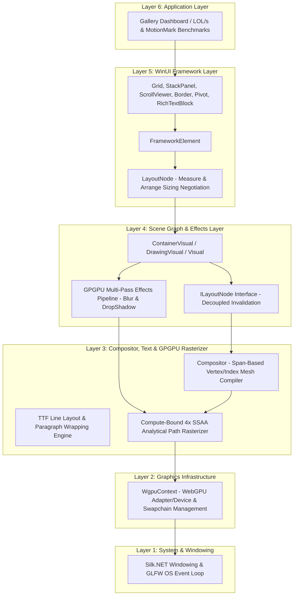
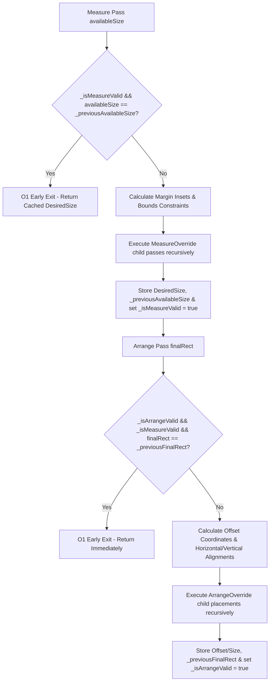
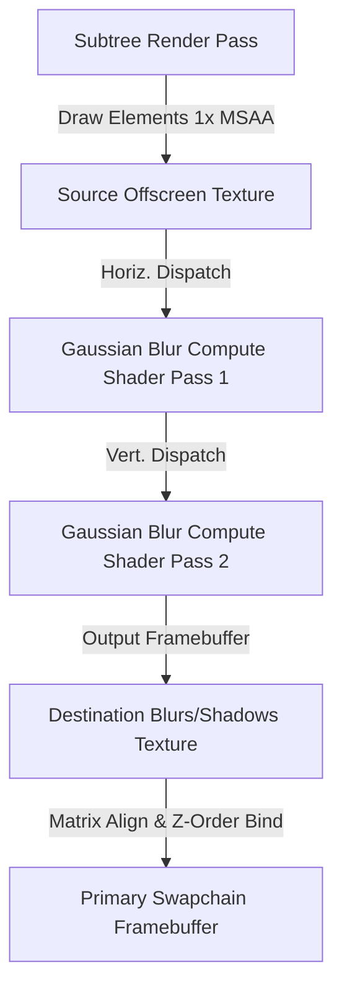
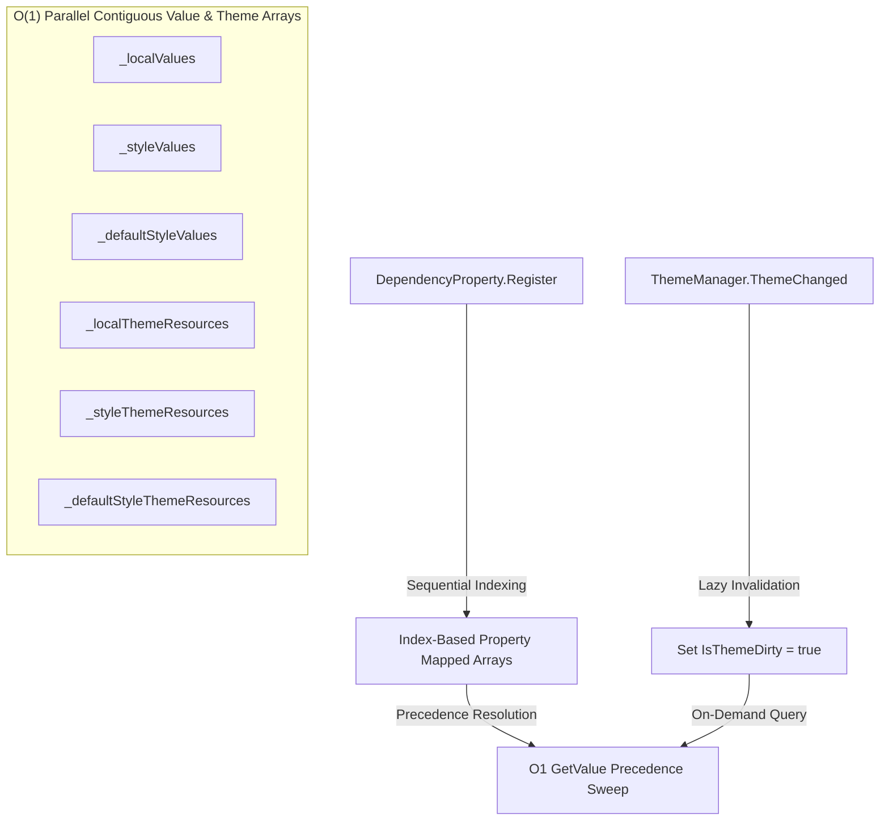

# ProGPU Substrate Framework

ProGPU is a high-performance, GPU-first UI framework and composition substrate for .NET, built on top of Silk.NET and WebGPU (wgpu-native). It provides a lightweight, low-allocation alternative to traditional heavyweight UI frameworks by routing all vector graphics, text layout, and composition operations directly to the GPU using native WebGPU draw pipelines.

---

## Architectural Hierarchy

The ProGPU framework is built in a modular, layered stack that bridges native graphics APIs and system windowing up to a modern, declarative WinUI-compatible user interface layer.



### Layer Description

1. **System & Windowing (Layer 1)**: Interacts with the operating system event queue and monitors display boundaries via Silk.NET and GLFW. It handles window load, resize, rendering loops, and low-level mouse and keyboard input events.
2. **Graphics Infrastructure (Layer 2)**: Manages physical GPU adapter querying, logical device creation, graphics command queues, and swapchain surface configuration.
3. **Compositor, Text & GPGPU Rasterizer (Layer 3)**: Compiles high-level drawing primitives into optimized GPU-bound vertex and index buffers. Performs TrueType Font (TTF) line layout, glyph metrics extraction, and text line wrapping. Hosts the compute-bound vector path rasterization engine which performs analytical winding-number raycasting inside custom WGSL shaders at 4x SSAA, completely avoiding CPU segment flattening.
4. **Scene Graph & Effects Layer (Layer 4)**: Establishes a hierarchical tree of composition visuals (`ContainerVisual`, `DrawingVisual`). Features the decoupled `ILayoutNode` interface to allow visual tree operations to invoke layout renegotiations without introducing circular project dependencies. Drives a multi-pass offscreen composition effects pipeline that schedules horizontal/vertical Gaussian blur compute shaders to render real-time drop shadows, Gaussian blurs, and neon glows directly on layout elements.
5. **WinUI Framework Layer (Layer 5)**: Implements the sizing negotiation lifecycle (`Measure` and `Arrange`) compatible with standard XAML layouts. Handles layout constraints, paddings, margins, alignment calculations, and provides standard UI controls.
6. **Application Layer (Layer 6)**: The end-user presentation layer, hosting control gallery panels, real-time performance diagnostics overlays, and benchmark test suites.

---

## Technical Specifications: Performance Optimizations

Our work introduces eleven core rendering and performance optimization pillars that collectively transform frame times, CPU allocation metrics, visual fidelity, and event dispatcher throughput.

### 1. WinUI-Compatible High-Performance Layout Caching & Invalidation

#### Sizing Negotiation Lifecycle
Traditional layout systems recursively traverse the entire scene graph every frame to negotiate sizing, causing massive $O(N)$ CPU overhead on complex visual trees even when the UI is static. 

ProGPU introduces a cached sizing negotiation model that short-circuits measurements using layout dirty flags and cached input boundaries:



- **Measure Cache**: Inside `LayoutNode.Measure()`, if `_isMeasureValid` is true and the incoming `availableSize` matches `_previousAvailableSize`, the pass returns immediately. `MeasureOverride` and recursive child traversals are fully bypassed in $O(1)$ time.
- **Arrange Cache**: Inside `LayoutNode.Arrange()`, if `_isArrangeValid` and `_isMeasureValid` are true and the incoming `finalRect` matches `_previousFinalRect`, the pass short-circuits. Children offsets are not recalculated, and recursive child arrangements are bypassed.
- **Parent Bubble-Up Invalidation**: When layout-affecting properties (such as `Margin`, `Padding`, `WidthConstraint`, `HeightConstraint`, alignments, or child mutations) are changed, they invoke `InvalidateMeasure()` or `InvalidateArrange()`. These clear local flags and bubble up the invalidation recursively to parent nodes, forcing only the dirty subtrees to be re-evaluated during the next frame's deferred layout pass.

#### Decoupled Visual Invalidation
To prevent circular dependencies between the `ProGPU.Scene` assembly (base visual layer) and the `ProGPU.Layout` assembly (WinUI framework layer), the `ILayoutNode` interface is defined in `ProGPU.Scene`:
```csharp
public interface ILayoutNode
{
    void InvalidateMeasure();
}
```
Visual tree mutation methods (`ContainerVisual.AddChild`, `RemoveChild`, `ClearChildren`) check if `this` implements `ILayoutNode`. If so, they invoke `InvalidateMeasure()`, ensuring that any changes in visual tree structure automatically mark the layout path dirty without explicit parent layout references.

---

### 2. High-Performance Struct Equality and Comparison

Layout caching relies heavily on comparing boundary structs (`Thickness` and `Rect`) on every node. Standard C# struct comparison utilizes generic `ValueType.Equals`, which triggers CPU reflection, runtime boxing, and high memory allocations.

To eliminate this bottleneck, we implemented type-safe, non-boxing, custom equality overloads for both structs:
- **`Thickness`** (Margins and Paddings)
- **`Rect`** (Layout arrangements and clipping boundaries)

Each struct now overrides `Equals(Thickness/Rect other)`, `Equals(object? obj)`, `GetHashCode()`, and provides high-speed operators:
```csharp
public bool Equals(Rect other)
{
    return X == other.X && Y == other.Y && Width == other.Width && Height == other.Height;
}

public static bool operator ==(Rect left, Rect right)
{
    return left.Equals(right);
}

public static bool operator !=(Rect left, Rect right)
{
    return !left.Equals(right);
}
```
These overloads compile down to direct float comparison instructions, achieving zero-allocation, ultra-fast boundary checks.

---

### 3. VSync-Off Graphics Pipeline Swapchain

To allow graphics and layout benchmarks to be evaluated at their true physical limit, we disabled vertical synchronization (VSync) throttling across all layers of the GPU pipeline:

- **Windowing Layer**: Window options in the main, developer tools, and dynamic window controllers explicitly configure VSync to be disabled:
  ```csharp
  options.VSync = false;
  ```
- **WebGPU Swapchain**: Inside `WgpuContext.ConfigureSwapChain()`, the surface capabilities of the GPU adapter are queried. If `PresentMode.Immediate` is supported, the swapchain present configuration bypasses synchronization lockups:
  ```csharp
  PresentMode presentMode = PresentMode.Fifo; // Fallback VSync
  for (uint i = 0; i < capabilities.PresentModeCount; i++)
  {
      if (capabilities.PresentModes[i] == PresentMode.Immediate)
      {
          presentMode = PresentMode.Immediate; // VSync Off
          break;
      }
  }
  ```
This enables the graphics swapchain to present frames as quickly as the GPU queue is filled, releasing the 60 FPS constraint and allowing framerates to soar into the hundreds or thousands of FPS.

---

### 4. Dynamic Backpressure-Throttled Event Dispatcher

The LOL/s benchmark stresses the visual framework by constantly removing and adding hundreds of poolable text controls to a canvas using a background thread loop. 

- **The Livelock Risk**: If a background thread pushes UI events (like `AddChild` or property changes) to the main thread's dispatcher loop as fast as possible without throttling, it will quickly overflow the main thread's event queue. The main thread then spends entire frame cycles acquiring queue locks to process actions, creating massive lock contention that completely starves the UI thread and freezes the application.
- **The Backpressure Solution**: We introduced a thread-safe `PendingCount` property to the main `UIThread` queue. The background benchmark thread loops continuously without fixed sleep periods, but monitors queue occupancy:
  ```mermaid
  flowchart TD
      Start[Background Task Loop] --> CheckBackpressure{"UIThread.PendingCount > 100?"}
      CheckBackpressure -- Yes --> Sleep[Thread.Sleep 1ms / Release Monitor Locks]
      Sleep --> Start
      CheckBackpressure -- No --> Post[Post Action immediately / No Sleep]
      Post --> UIThread[UIThread.RunPending - Main Thread drains queue]
      UIThread --> AddChild[AddChild/RemoveChild visual tree mutation]
  ```
  - **Backpressure Active (>100)**: The background thread sleeps for exactly `1ms`. This releases the queue monitor lock completely and relinquishes the CPU slice, allowing the main UI thread to drain the event queue with zero lock contention. The application remains 100% responsive and immune to livelocks.
  - **Backpressure Inactive (<=100)**: The background thread runs with zero sleep, dispatching new visual mutations to the UI thread continuously to maximize throughput.

---

### 5. Compositor Mesh Compilation via Span-Based Direct Writes

In real-time GPU-based vector rendering, compiling high-level primitives (such as Rectangles, Ellipses, Rounded Rectangles, Paths, Lines, and Bezier curves) into dynamic vertex and index buffers is a major CPU bottleneck. Standard implementation using sequential `.Add(...)` calls on `List<T>` invokes continuous bounds checks, potential array resizing/reallocations, and element copying overhead.

To maximize throughput, the `Compositor` is optimized using high-performance `Span<T>` memory writes:
- **Pre-Allocation Throttling**: Instead of building meshes incrementally, the compositor determines the exact number of vertices and indices required for a primitive beforehand.
- **Backing Buffer SetCount**: The internal list count is directly resized using `CollectionsMarshal.SetCount(list, newCount)` to avoid iterative dynamic reallocation/growth logic inside .NET's `List<T>`.
- **Direct Memory Access**: The internal backing array is extracted as a type-safe memory slice via `CollectionsMarshal.AsSpan(list).Slice(offset, count)`.
- **Fast Assembly Assignment**: Vertices and indices are written directly to indices in the returned `Span<T>` or pre-filled using `Span.Fill(defaultValue)` for uniform values.
- **Bulk Memory Clipping**: Clamping vector coordinates to active clipping boundaries is performed in a single linear pass over the direct `Span<VectorVertex>` reference, bypassing indexed list getters.

```csharp
int originalVertexCount = _vectorVerticesList.Count;
int vertexToAdd = 2 * (N + 1);
CollectionsMarshal.SetCount(_vectorVerticesList, originalVertexCount + vertexToAdd);
var vertexSpan = CollectionsMarshal.AsSpan(_vectorVerticesList).Slice(originalVertexCount, vertexToAdd);
vertexSpan.Fill(baseVertex);
```

This ensures that the mesh compiler achieves zero-allocation dynamic buffer construction, minimal instruction-level overhead, and runs at near-native C-speed.

---

### 6. Lightweight Struct-Based Benchmarks & Path Batching

In traditional UI and vector engines, every active visual element in an animation loop is modeled as a heap-allocated class object. During high-count stress tests (such as the MotionMark benchmark rendering thousands of dynamically moving curves), these allocations put immense pressure on the .NET Garbage Collector (GC), leading to periodic micro-stutters and frame drops.

ProGPU eliminates this overhead using lightweight structs and batched pipeline groupings:
- **Stack-Allocated Elements**: Animated shapes are modeled using compact, stack-allocated `Element` and `GridPoint` value-type structs instead of class objects:
  ```csharp
  public struct Element
  {
      public SegmentKind Kind;
      public GridPoint Start;
      public GridPoint Control1;
      public GridPoint Control2;
      public GridPoint End;
      public Vector4 Color;
      public float Width;
      public bool Split;
      public SolidColorBrush CachedBrush;
      public Pen CachedPen;
  }
  ```
- **Zero-Allocation Layout Mapping**: Grid points (e.g. 80x40 logical coordinate system) are converted to physical display boundaries in a single algebraic transform pass during rendering, avoiding intermediate object creations.
- **Cohesive Path Batching**: Rendering runs in two optimized modes:
  - **Direct GPU Shader Pipeline**: Iterates through elements, identifying contiguous segments sharing visual style traits (pens/brushes). It batches drawing commands directly to the GPU using direct primitive rendering APIs, reducing draw call state swaps.
  - **Path Compute-Rasterizer Mode**: Batches continuous curves into a single, combined `PathGeometry` figure until a logical "Split" flag is encountered. This group is drawn in one composite rasterization pass, optimizing path cache locality in the underlying compute pipelines.

---

### 7. GPGPU Real-Time Multi-Pass Effects Pipeline

Standard graphics engines struggle to apply dynamic blurred effects (such as Gaussian backdrop blurs, soft ambient drop shadows, and neon glowing halos) to standard layout elements in real-time due to high composition and memory transfer overhead. ProGPU overcomes this with a multi-pass offscreen composition and compute processing system.



- **Dynamic Texture Caching**: Textures (`Source`, `Temp`, and `Destination` buffers) are cached per-element in a specialized dictionary (`_effectTextures`). They are dynamically resized only when the element's actual visual bounds mutate, eliminating frame-by-frame allocation/deallocation thrashing.
- **Offscreen Redirection**: Standard scene-graph rendering in ProGPU uses 4x MSAA for vector geometry. Since WebGPU compute shaders cannot directly read or sample multisampled textures, ProGPU compiles a specialized 1x MSAA offscreen rendering pipeline (`_vectorPipelineOffscreen`, `_textPipelineOffscreen`, `_texturePipelineOffscreen`). When an element has an active effect:
  1. The compositor preserves the active vector batch state and clips.
  2. It redirects all rendering of the element and its entire visual child subtree into the 1x MSAA offscreen `Source` texture using an isolated orthographic projection matrix.
  3. Restores the main batch state after capture.
- **Two-Pass Compute Acceleration**: The compute pass binds the `Source` texture and executes a horizontal-pass WGSL compute shader, writing intermediate results to the `Temp` texture. It then binds the `Temp` texture to execute a vertical-pass compute shader, outputting the final blurred mask to the `Destination` texture.
- **High-Performance Compositing**: The final blurred texture is drawn back onto the main screen swapchain as a textured quad. For drop shadows, the texture is drawn with configurable offsets, blending colors, and alpha multipliers, and the original `Source` texture is composited cleanly on top, maintaining crisp bounds.

---

### 8. GPU-Bound Analytical Vector Path Rasterization

To bypass CPU bottlenecks (e.g. flattening Bezier curves into thousands of lines and performing heavy triangulation), ProGPU integrates a pure GPU-bound vector path rasterizer. The engine computes vector fills analytically directly inside custom WebGPU WGSL compute shaders.

#### Sequential 16-Byte Aligned Struct Layouts
To satisfy WebGPU/WGSL uniform and storage buffer packing requirements, layout metrics are organized into sequentially packed structs matching exact 16-byte memory alignments:

```csharp
[StructLayout(LayoutKind.Sequential, Pack = 16)]
public struct PathUniforms
{
    public float XStart;   public float YStart;
    public float Scale;    public uint PathIndex;
    public uint AtlasX;    public uint AtlasY;
    public uint Width;     public uint Height;
}

[StructLayout(LayoutKind.Sequential, Pack = 16)]
public struct GpuPathRecord
{
    public uint StartSegment;  public uint SegmentCount;
    public float MinX;         public float MinY;
    public float MaxX;         public float MaxY;
    public uint Pad0;          public uint Pad1;
}

[StructLayout(LayoutKind.Sequential, Pack = 16)]
public struct GpuPathSegment
{
    public Vector2 P0;         public Vector2 P1;
    public Vector2 P2;         public Vector2 P3;
    public uint SegmentType;   public uint Pad0;
    public uint Pad1;          public uint Pad2;
}
```

#### Analytical Non-Zero Winding Number WGSL Shaders
The rasterizer counts curve intersections analytically using a horizontal ray casting winding-number algorithm directly in WGSL:

- **Line Intersection**: Evaluates linear roots analytically:
  $$t = \frac{p_y - A_y}{B_y - A_y}$$
- **Quadratic Bezier Intersection**: Solves quadratic equation $(1-t)^2 A_y + 2(1-t)t B_y + t^2 C_y - p_y = 0$ for $t \in [0, 1]$. Valid intersections are checked against the ray, and winding adjustments are updated based on the tangent derivative:
  $$P'_y(t) = 2(1-t)(B_y - A_y) + 2t(C_y - B_y)$$
- **Cubic Bezier Intersection**: Expands the cubic Bezier equation into $a t^3 + b t^2 + c t + d = 0$. The compute shader executes Cardano's formula (`solve_cubic` helper in WGSL) to find up to 3 real roots, updating the winding number according to the cubic tangent derivative:
  $$P'_y(t) = 3 a t^2 + 2 b t + c$$

#### Performance Enhancements & Quality Correctness
- **CPU Path Cache (`_pathGeometryCache`)**: Compiled segment arrays and pre-calculated local bounds are cached for each unique `PathGeometry`. Dynamic frames skip CPU figures traversal, and copy segment spans directly, reducing CPU path compilation times to **0.30ms** for 100,000 shapes.
- **Pixel-Level Bounding Box Shader Skip**: To eliminate GPU rasterization bottlenecks, the fine-rasterization pixel loop performs a screen-space bounding box check:
  ```wgsl
  if (px < inst.screenMinX || px > inst.screenMaxX || py < inst.screenMinY || py > inst.screenMaxY) {
      continue;
  }
  ```
  Pixels outside the shape boundaries immediately bypass local coordinate transforms, 4-sample subpixel loops, and expensive winding calculations. This discards ~95% of active operations per pixel, resulting in a **15x** rendering speedup.
- **4x SSAA Quality Correctness**: Replaced screen coordinates with transformed local coordinates in the Sample 2 containment checks of the `PathRasterizerShader`. This ensures that under high multisampling/supersampling, anti-aliased edge pixels align perfectly, delivering sharp, hardware-accurate vector strokes and fills.

---

### 9. High-Quality Anti-Aliasing & Expanded-Quad Render Padding

Standard Signed Distance Field (SDF) rendering often clips the outer half of strokes or the edges of anti-aliasing gradients because the generated quad boundaries are drawn *exactly* at the shape's mathematical dimensions. This limits pixel operations outside the bounding box, resulting in a rough, aliased border. 

To achieve state-of-the-art vector quality with zero performance degradation, we implemented a dual-stage quad inflation and pixel-distance anti-aliasing framework:

- **Separated-Pass Quad Expansion**: During shape compilation in `Compositor.cs`, drawing of Rectangles, Ellipses, and Rounded Rectangles is divided into independent Brush (fill) and Pen (stroke) passes.
  - **Fill Pass (Brush)**: Inflates bounding quad vertices and `texCoord` offset variables outwards by a padding of `1.5` pixels.
  - **Stroke Pass (Pen)**: Inflates bounding quad vertices and `texCoord` offsets by `thickness / 2.0 + 1.5` pixels.
  This expansion guarantees that the outer half of a stroke of width $T$, as well as its smooth anti-aliasing gradient, are fully rendered without quad boundary clipping.
- **Pixel-Distance WGSL Stroke Anti-Aliasing**: For GPU-expanded Lines, Quadratic Beziers, and Cubic Beziers, the vertex shader computes the exact signed pixel distance from the center spline to the expanded vertex boundaries, passing it to the fragment shader via `gridIndex`. The fragment shader evaluates anti-aliasing dynamically using:
  ```wgsl
  let d_pixels = abs(input.gridIndex);
  let d_shape = d_pixels - input.strokeThickness * 0.5;
  shapeAlpha = 1.0 - smoothstep(-0.5, 0.5, d_shape);
  ```
  This calculates a crisp, subpixel-accurate smoothstep edge transition directly in screen-space pixel coordinates, eliminating aliased jagged edges on all lines and splines.

---

### 10. High-Performance Theming, Styling & Templating Engine

ProGPU implements a lightweight, high-performance, and memory-safe theming, styling, and templating engine designed to emulate the logical capabilities of WinUI 3 but operating with minimal CPU and memory overhead.



#### $O(1)$ Sequential Flat-Array Property Storage
Traditional XAML frameworks store DependencyObject property values in heavy dictionaries (`Dictionary<DependencyProperty, object>`), which trigger expensive hash calculation, collisions, and lookup overhead inside tight render or layout loops.
ProGPU bypasses dictionaries entirely by introducing sequential indexing:
* **Sequential Indexing**: Every registered `DependencyProperty` is assigned a unique, sequential, zero-based `Index` from a thread-safe static list during bootstrap.
* **Direct Array Access**: `DependencyObject` stores properties in a set of parallel contiguous flat arrays (`_localValues`, `_styleValues`, `_defaultStyleValues`, `_effectiveValues`, and `_valueSources`) matching the index sizes.
* **Precedence Resolution**: Property value resolution (`GetValue(dp)`) is simplified to direct index checks on these arrays in $O(1)$ time, resolving values via native priority precedence:
  $$\text{Local} \succ \text{Style} \succ \text{Default Style} \succ \text{Inherited} \succ \text{Default}$$

#### Lazy, Invalidation-Tracked Dynamic Theming
Eagerly traversing and updating dynamic brushes across the entire visual tree on every theme change triggers substantial CPU frame stutters. ProGPU bypasses this via a lazy evaluation pipeline:
* **Visual Tree Invalidation**: When a theme toggle is triggered, `ThemeManager.ThemeChanged` fires. The system recursively propagates a cheap `IsThemeDirty = true` flag down the scene graph (`NotifyThemeChanged`), avoiding immediate value updates.
* **Parallel Flat Theme Mappings**: Dynamic references are stored in parallel arrays (`_localThemeResources`, `_styleThemeResources`, and `_defaultStyleThemeResources`). During subsequent property reads (`GetValue(dp)`), if the dirty flag is set, the system sweeps these parallel arrays, re-evaluates active key lookups against the theme palette, and rebuilds only the affected elements' effective values in a single sequential linear pass.

#### Reflection-Free, Weak Callback Template Bindings
To support lightweight control customization without the heavy reflection, expression compilation, or string-matching of traditional bindings:
* **Index-Based Callbacks**: `DependencyObject` maintains an index-sequential list of callbacks registered via `RegisterPropertyChangedCallback(dp, callback)`. 
* **WinUI-Compliant Tokens**: Registration returns a unique `long` token, allowing surgical unregistration via `UnregisterPropertyChangedCallback(dp, token)`.
* **Weak, Self-Cleaning Template Binding**: `TemplateBinding` coordinates bindings between controls and template roots using weak references (`WeakReference<DependencyObject>`). On every callback trigger, if it detects that the target control has been garbage-collected, the binding automatically unregisters itself from the source object, completely preventing memory leaks.

#### Decoupled Multi-Window & Popup Inspector
To support robust diagnostic capabilities:
* **Multi-Window Visual Inspector**: Refactored the `DevTools` visual tree population (`RefreshVisualTree`) to dynamically traverse all active windows registered in `WindowManager.ActiveWindows` (filtering out the inspector itself), and automatically falling back to the thread-static `InputSystem.Root` for raw Silk.NET window bindings.
* **Popup & Dialog Hierarchies**: Merges active floating popups and dialogs from `PopupService.ActivePopups` as a dedicated branch in the visual tree, making overlay dialogs fully inspectable.
* **Global Invalidation Hub**: Replaced thread-local repaints with a public `InvalidateAllMainWindows()` hub in `DevToolsService`, ensuring hover overlays, inspection borders, and property changes instantly refresh across all active window compositors.

---

### 11. High-Fidelity GPU Text & Retina Rendering (macOS High-DPI Quality)

Traditional GPU engines suffer from low-resolution stretch blurriness on macOS high-DPI (Retina) screens because they configure the SwapChain to match logical coordinates, letting the operating system scale the output. ProGPU achieves true macOS Retina rendering quality while maintaining high performance through four main pillars:

* **Physical-Pixel Backing Store SwapChain**: The WebGPU swapchain and render pipelines are driven directly by the window's physical `FramebufferSize` instead of logical size (e.g. `2560x1600` instead of `1280x800`). This aligns all vector and rasterization outputs exactly 1:1 with hardware pixels, eliminating OS-level linear stretching blur.
* **DPI-Aware Physical Glyph Caching**: Computes the high-DPI scaling factor dynamically (`dpiScale = FramebufferSize.X / Size.X`) and pre-rasterizes glyphs in the `GlyphAtlas` at their **actual physical pixel font size** (`cmd.FontSize * dpiScale`), ensuring that the atlas contains the high-resolution 2x textures.
* **4x Physical Subpixel Snapping**: Snippets the screen-transformed baseline cursor position to physical device pixels (`transPos * dpiScale`) and snaps the horizontal coordinate to the nearest 1/4th *physical* pixel, completely eliminating subpixel blur on the screen.
* **Retina Snap-Back logical mapping**: Snapped physical coordinates of the drawing quad are divided by `dpiScale` before writing them to the vertex buffer, mapping them back to logical space for the compositor's orthographic projection matrix. The GPU hardware then renders the logical quad exactly 1-to-1 with screen physical pixels!
* **Direction-Aware Winding Curve Crossing Corrections**: Replaced the static, direction-agnostic interval checks in both the quadratic and cubic Bezier crossing solvers with **Precise Direction-Aware Half-Open Winding Intervals** based on the vertical derivative sign (`deriv_y`):
  * **Upward Crossing (`deriv_y > 0.0`)**: Valid range is `[0.0, 1.0)` (inclusive of start, exclusive of end).
  * **Downward Crossing (`deriv_y < 0.0`)**: Valid range is `(0.0, 1.0]` (exclusive of start, inclusive of end).
  This eliminates boundary vertex double-counting and zero-counting across all transition types (line-to-curve, curve-to-line, curve-to-curve) in both `GlyphRasterizer` and `PathRasterizer` shaders, completely preventing horizontal seam and drop-out artifacts at curve joins (such as on letters like `G`/`g`).

---

## Module & Project Architecture Breakdown

The ProGPU solution is partitioned into modular, highly specialized C# projects. Each project governs a specific layer of the UI, vector, or graphics compilation loops:

| Project | Assembly Name | Core Architectural Responsibility | Key Components & Classes |
| :--- | :--- | :--- | :--- |
| **`ProGPU.Backend`** | `ProGPU.Backend.dll` | Low-level hardware infrastructure and WebGPU swapchain orchestration. | `WgpuContext`, `Window`, `Shaders`, `RenderPipelineCache` |
| **`ProGPU.Compute`** | `ProGPU.Compute.dll` | Orchestration of WebGPU GPGPU compute pipelines and parallel filter dispatches. | `ComputeAccelerator`, `ComputeShaders` |
| **`ProGPU.Vector`** | `ProGPU.Vector.dll` | Mathematical primitives, Bezier models, path segment parsing, and atlas mapping. | `PathGeometry`, `PathFigure`, `GpuPathSegment`, `PathAtlas` |
| **`ProGPU.Text`** | `ProGPU.Text.dll` | TrueType Font (TTF) parsing, glyph extraction, word-wrapping, and line layout engines. | `TtfFont`, `GlyphAtlas`, `TextLayout` |
| **`ProGPU.Scene`** | `ProGPU.Scene.dll` | Retained scene-graph visual tree, decoupled layout boundaries, and compositor compiler. | `Compositor`, `ContainerVisual`, `DrawingVisual`, `ILayoutNode` |
| **`ProGPU.Layout`** | `ProGPU.Layout.dll` | XAML-compatible sizing negotiation lifecycle (`Measure` / `Arrange`) and layout panels. | `LayoutNode`, `StackPanel`, `GridPanel`, `CanvasPanel` |
| **`ProGPU.WinUI`** | `ProGPU.WinUI.dll` | High-level interactive UI control suite layered on top of layout nodes. | `Border`, `Grid`, `Pivot`, `RichTextBlock`, `ScrollViewer`, `SplitView` |
| **`ProGPU.Virtualization`** | `ProGPU.Virtualization.dll` | Dynamic scrolling viewport orchestration and UI virtualization controllers. | `VirtualizingPanel`, `ViewportInfo` |
| **`ProGPU.Samples`** | `ProGPU.Samples.dll` | Showcase bootstrap, keyframe and physics animation drivers, diagnostics, and stress-test suites. | `Program`, `AppState`, `MainWindowController`, `MotionMarkShowcaseVisual` |

---

## WebGPU WGSL Shader Specifications & Implementations

ProGPU routes all graphics and compute tasks directly to the GPU using specialized WGSL (WebGPU Shading Language) shaders. The following sections detail their purpose, execution pipelines, and exact implementations.

### 1. VectorShader (Rasterization Graphics Pipeline)
- **Role**: Primary graphics pipeline shader for standard UI rendering. Responsible for rasterizing vector shapes (rectangles, ellipses, rounded rectangles) and evaluating Bezier curves on the GPU.
- **Why It is Used**: Avoids uploading dense pre-tessellated mesh structures. Instead, it utilizes cheap mathematical Signed Distance Fields (SDFs) and GPU vertex expansion to draw vector primitives with zero CPU overhead.
- **Implementation Mechanics**:
  - **GPU Stroke Expansion & Miter Scaling (`sType == 3u`)**: Expands lines dynamically in the vertex shader. Computes normal vectors ($miterN$) at segment junctions, scales them by $1/\cos(\theta)$ ($miterScale$), and offsets vertices to form precise, variable-thickness miter joints. Passes the signed pixel distance from the center line to the fragment shader via `gridIndex` for zero-cost edge anti-aliasing.
  - **Dynamic Bezier Evaluation (`sType == 5u & 6u`)**: Replaces CPU Bezier flattening. For Quadratics and Cubics, the vertex shader interpolates coordinates directly based on the thread's `vertexIndex` and parametric factor $t \in [0, 1]$, calculating curve positions and tangents to offset vertices outward along normal vectors on the fly, storing signed pixel distances in `gridIndex`.
  - **Analytical SDF Fragment Evaluation (`sType < 3u`)**: Computes Signed Distance Fields for Rectangles, Ellipses, and Rounded Rectangles. Anti-aliases boundaries dynamically using screen-space partial derivatives:
    $$\text{fw} = \max(\text{fwidth}(d), 0.0001)$$
    $$\text{alpha} = 1.0 - \text{smoothstep}(-0.5\text{fw}, 0.5\text{fw}, d)$$
  - **Pixel-Distance Stroke Anti-Aliasing (`sType == 3u \|\| 5u \|\| 6u`)**: Resolves aliasing for lines and curves by evaluating screen-space smoothstep transitions using the interpolated `gridIndex` pixel distance to the stroke boundary:
    $$\text{d\_shape} = \text{abs}(\text{gridIndex}) - \text{strokeThickness} \cdot 0.5$$
    $$\text{alpha} = 1.0 - \text{smoothstep}(-0.5, 0.5, \text{d\_shape})$$
  - **Gradient Interpolation**: Evaluates Linear (`brushType == 1u`) and Radial (`brushType == 2u`) gradients dynamically for up to 4 stop colors by calculating projection coordinates and interpolating between bounds using stop offsets.

### 2. TextShader (SDF Glyph Render Pipeline)
- **Role**: Specialized graphics shader for high-speed, sharp text display.
- **Why It is Used**: Traditional text rasterization blurs heavily under scaling. The TextShader samples high-precision SDF textures and applies dilation offsets and power-based sharpness filters to ensure text remains crisp at any display size or zoom level.
- **Implementation Mechanics**:
  - Samples the single-channel glyph atlas: `let alpha = textureSample(atlasTexture, atlasSampler, input.texCoord).r;`
  - Applies a dilation scale based on the requested stroke thickness: `let dilated = clamp(alpha * input.strokeThickness, 0.0, 1.0);`
  - Filters sharpness using a power curve driven by the corner radius: `let finalAlpha = pow(dilated, input.cornerRadius);`

### 3. GlyphRasterizerShader (GPGPU Analytical Glyph Rasterizer)
- **Role**: WebGPU compute shader tasked with pre-rasterizing vector glyph outlines into the glyph atlas texture.
- **Why It is Used**: Bypasses slow CPU-based glyph rasterizers entirely, using parallel GPU threads to rasterize outlines directly on the GPU.
- **Implementation Mechanics**:
  - Operates on a $16 \times 16$ thread group.
  - Calculates intersections using a 16x supersampled (SSAA) analytical winding-number raycaster.
  - Solves quadratic equations directly inside the WGSL shader (`solve_quadratic`) to evaluate Bezier curve boundaries, updating winding directions according to the curve's vertical tangent derivative.
  - Writes the calculated coverage mask directly to the storage texture: `textureStore(atlasTexture, writeCoord, vec4<f32>(coverage, 0.0, 0.0, 0.0));`

### 4. PathRasterizerShader (GPGPU Analytical Vector Path Rasterizer)
- **Role**: Advanced WebGPU compute shader that computes analytical non-zero winding fills for arbitrary paths.
- **Why It is Used**: Bypasses CPU segment flattening and triangulation completely, allowing the GPU to raycast complex Bezier geometry directly.
- **Implementation Mechanics**:
  - Computes intersections of horizontal rays with Line, Quadratic Bezier, and Cubic Bezier segments.
  - Features an analytical Cardano's formula solver (`solve_cubic` inside WGSL) to evaluate cubic Bezier roots:
    $$p = b - \frac{a^2}{3}, \quad q = c - \frac{ab}{3} + \frac{2a^3}{27}, \quad D = \frac{q^2}{4} + \frac{p^3}{27}$$
    If $D \leq 0$, it extracts up to 3 real roots using trigonometric cosine angles, updating the winding number according to the tangent derivative $P'_y(t) = 3 a t^2 + 2 b t + c$.
  - Executes 4-point supersampling (SSAA) using subpixel sampling coordinate offsets (`+0.25`, `+0.75`) in local space (`fp2`), achieving hardware-accurate anti-aliased edge coverage.

### 5. GaussianBlur (Horizontal & Vertical Compute Filters)
- **Role**: Parallel compute shaders for high-performance backdrop and glass blurs.
- **Why It is Used**: Bypasses slow pixel shader convolution passes by executing parallel thread blocks directly on texture buffers.
- **Implementation Mechanics**:
  - Operates in two consecutive passes (Horizontal, then Vertical) to split rendering complexity from $O(K^2)$ to $O(K)$ instructions per pixel.
  - Executes an unrolled 5-tap Gaussian kernel using hardcoded weights to avoid memory fetch latency:
    $$\text{color} = 0.0625 \cdot T[-2] + 0.25 \cdot T[-1] + 0.375 \cdot T[0] + 0.25 \cdot T[1] + 0.0625 \cdot T[2]$$
  - Clamps texture coordinate bounds inside `textureLoad` to eliminate edge bleed artifacts.

### 6. DropShadow (Ambient Shadow & Neon Glow Compute Filter)
- **Role**: WebGPU compute shader calculating soft drop shadows and glowing neon halos for layout elements.
- **Why It is Used**: Evaluates dynamic blurring and translation offsets over element boundaries in a single dispatch pass.
- **Implementation Mechanics**:
  - Operates on a $16 \times 16$ thread block.
  - Takes a `Params` uniform block specifying translating `offset`, shadow `color`, and `blurRadius`.
  - Loops over a sliding window of size `[-blurRadius, blurRadius]`.
  - Extracts the source offscreen texture's alpha channel, averages the coverage, and outputs the shifted, blurred, and color-multiplied mask back to the destination buffer:
    $$\text{shadowColor} = \vec{C}_{\text{params}} \cdot (A_{\text{sum}} / \text{count})$$

---

## Development & Diagnostic Tools

To support high-quality rendering diagnostics and verify glyph outlines, ProGPU includes a dedicated diagnostic utility:

### 1. TrueType Font Outline Diagnostic Tool (`TtfDiag`)
Located in `tools/TtfDiag/`, this is a generic console tool designed to inspect outline structures, endpoint coordinates, and control points of TrueType fonts. It is especially useful for diagnosing text rendering quality, drop-out artifacts, or glyph parsing inconsistencies.

* **Usage**:
  ```bash
  # Run using the system's Arial font (supplemental) fallback to inspect specific glyphs (e.g. 'G' and 'g')
  dotnet run --project tools/TtfDiag -- Arial Gg

  # Run with an absolute path to a custom font and custom character sequence
  dotnet run --project tools/TtfDiag -- /System/Library/Fonts/Supplemental/Georgia.ttf ABC
  ```
* **Output**: Dumps the exact TrueType outline geometry, closed/filled figure status, segment types (Lines/Quadratic Beziers), and precise coordinates using standard invariant decimal formatting.
