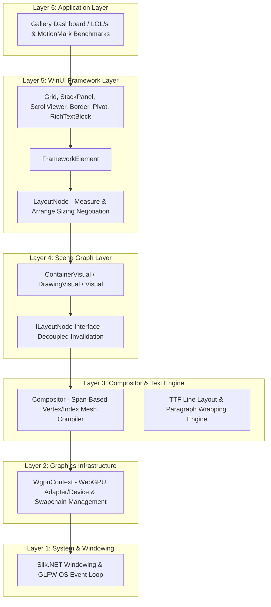
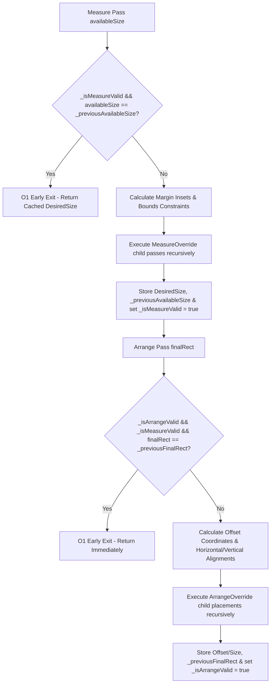

# ProGPU Substrate Framework

ProGPU is a high-performance, GPU-first UI framework and composition substrate for .NET, built on top of Silk.NET and WebGPU (wgpu-native). It provides a lightweight, low-allocation alternative to traditional heavyweight UI frameworks by routing all vector graphics, text layout, and composition operations directly to the GPU using native WebGPU draw pipelines.

---

## Architectural Hierarchy

The ProGPU framework is built in a modular, layered stack that bridges native graphics APIs and system windowing up to a modern, declarative WinUI-compatible user interface layer.



### Layer Description

1. **System & Windowing (Layer 1)**: Interacts with the operating system event queue and monitors display boundaries via Silk.NET and GLFW. It handles window load, resize, rendering loops, and low-level mouse and keyboard input events.
2. **Graphics Infrastructure (Layer 2)**: Manages physical GPU adapter querying, logical device creation, graphics command queues, and swapchain surface configuration.
3. **Compositor & Text Engine (Layer 3)**: Compiles high-level drawing primitives (rounded rectangles, lines, Bézier curves, textures, and glyph coordinates) into optimized GPU-bound vertex and index buffers. Performs TrueType Font (TTF) line layout, glyph metrics extraction, and text line wrapping.
4. **Scene Graph Layer (Layer 4)**: Establishes a hierarchical tree of composition visuals (`ContainerVisual`, `DrawingVisual`). Features the decoupled `ILayoutNode` interface to allow visual tree operations to invoke layout renegotiations across separate assemblies without introducing circular project dependencies.
5. **WinUI Framework Layer (Layer 5)**: Implements the sizing negotiation lifecycle (`Measure` and `Arrange`) compatible with standard XAML layouts. Handles layout constraints, paddings, margins, alignment calculations, and provides standard UI controls.
6. **Application Layer (Layer 6)**: The end-user presentation layer, hosting control gallery panels, real-time performance diagnostics overlays, and benchmark test suites.

---

## Technical Specifications: Performance Optimizations

Our work introduces four core performance optimization pillars that collectively transform frame times, CPU allocation metrics, and event dispatcher throughput.

### 1. WinUI-Compatible High-Performance Layout Caching & Invalidation

#### Sizing Negotiation Lifecycle
Traditional layout systems recursively traverse the entire scene graph every frame to negotiate sizing, causing massive $O(N)$ CPU overhead on complex visual trees even when the UI is static. 

ProGPU introduces a cached sizing negotiation model that short-circuits measurements using layout dirty flags and cached input boundaries:



- **Measure Cache**: Inside `LayoutNode.Measure()`, if `_isMeasureValid` is true and the incoming `availableSize` matches `_previousAvailableSize`, the pass returns immediately. `MeasureOverride` and recursive child traversals are fully bypassed in $O(1)$ time.
- **Arrange Cache**: Inside `LayoutNode.Arrange()`, if `_isArrangeValid` and `_isMeasureValid` are true and the incoming `finalRect` matches `_previousFinalRect`, the pass short-circuits. Children offsets are not recalculated, and recursive child arrangements are bypassed.
- **Parent Bubble-Up Invalidation**: When layout-affecting properties (such as `Margin`, `Padding`, `WidthConstraint`, `HeightConstraint`, alignments, or child mutations) are changed, they invoke `InvalidateMeasure()` or `InvalidateArrange()`. These clear local flags and bubble up the invalidation recursively to parent nodes, forcing only the dirty subtrees to be re-evaluated during the next frame's deferred layout pass.

#### Decoupled Visual Invalidation
To prevent circular dependencies between the `ProGPU.Scene` assembly (base visual layer) and the `ProGPU.Layout` assembly (WinUI framework layer), the `ILayoutNode` interface is defined in `ProGPU.Scene`:
```csharp
public interface ILayoutNode
{
    void InvalidateMeasure();
}
```
Visual tree mutation methods (`ContainerVisual.AddChild`, `RemoveChild`, `ClearChildren`) check if `this` implements `ILayoutNode`. If so, they invoke `InvalidateMeasure()`, ensuring that any changes in visual tree structure automatically mark the layout path dirty without explicit parent layout references.

---

### 2. High-Performance Struct Equality and Comparison

Layout caching relies heavily on comparing boundary structs (`Thickness` and `Rect`) on every node. Standard C# struct comparison utilizes generic `ValueType.Equals`, which triggers CPU reflection, runtime boxing, and high memory allocations.

To eliminate this bottleneck, we implemented type-safe, non-boxing, custom equality overloads for both structs:
- **`Thickness`** (Margins and Paddings)
- **`Rect`** (Layout arrangements and clipping boundaries)

Each struct now overrides `Equals(Thickness/Rect other)`, `Equals(object? obj)`, `GetHashCode()`, and provides high-speed operators:
```csharp
public bool Equals(Rect other)
{
    return X == other.X && Y == other.Y && Width == other.Width && Height == other.Height;
}

public static bool operator ==(Rect left, Rect right)
{
    return left.Equals(right);
}

public static bool operator !=(Rect left, Rect right)
{
    return !left.Equals(right);
}
```
These overloads compile down to direct float comparison instructions, achieving zero-allocation, ultra-fast boundary checks.

---

### 3. VSync-Off Graphics Pipeline Swapchain

To allow graphics and layout benchmarks to be evaluated at their true physical limit, we disabled vertical synchronization (VSync) throttling across all layers of the GPU pipeline:

- **Windowing Layer**: Window options in the main, developer tools, and dynamic window controllers explicitly configure VSync to be disabled:
  ```csharp
  options.VSync = false;
  ```
- **WebGPU Swapchain**: Inside `WgpuContext.ConfigureSwapChain()`, the surface capabilities of the GPU adapter are queried. If `PresentMode.Immediate` is supported, the swapchain present configuration bypasses synchronization lockups:
  ```csharp
  PresentMode presentMode = PresentMode.Fifo; // Fallback VSync
  for (uint i = 0; i < capabilities.PresentModeCount; i++)
  {
      if (capabilities.PresentModes[i] == PresentMode.Immediate)
      {
          presentMode = PresentMode.Immediate; // VSync Off
          break;
      }
  }
  ```
This enables the graphics swapchain to present frames as quickly as the GPU queue is filled, releasing the 60 FPS constraint and allowing framerates to soar into the hundreds or thousands of FPS.

---

### 4. Dynamic Backpressure-Throttled Event Dispatcher

The LOL/s benchmark stresses the visual framework by constantly removing and adding hundreds of poolable text controls to a canvas using a background thread loop. 

- **The Livelock Risk**: If a background thread pushes UI events (like `AddChild` or property changes) to the main thread's dispatcher loop as fast as possible without throttling, it will quickly overflow the main thread's event queue. The main thread then spends entire frame cycles acquiring queue locks to process actions, creating massive lock contention that completely starves the UI thread and freezes the application.
- **The Backpressure Solution**: We introduced a thread-safe `PendingCount` property to the main `UIThread` queue. The background benchmark thread loops continuously without fixed sleep periods, but monitors queue occupancy:
  ```mermaid
  flowchart TD
      Start[Background Task Loop] --> CheckBackpressure{UIThread.PendingCount > 100?}
      CheckBackpressure -- Yes --> Sleep[Thread.Sleep 1ms / Release Monitor Locks]
      Sleep --> Start
      CheckBackpressure -- No --> Post[Post Action immediately / No Sleep]
      Post --> UIThread[UIThread.RunPending - Main Thread drains queue]
      UIThread --> AddChild[AddChild/RemoveChild visual tree mutation]
  ```
  - **Backpressure Active (>100)**: The background thread sleeps for exactly `1ms`. This releases the queue monitor lock completely and relinquishes the CPU slice, allowing the main UI thread to drain the event queue with zero lock contention. The application remains 100% responsive and immune to livelocks.
  - **Backpressure Inactive (<=100)**: The background thread runs with zero sleep, dispatching new visual mutations to the UI thread continuously to maximize throughput.
