# ProGPU Substrate Framework

ProGPU is a high-performance, GPU-first UI framework and composition substrate for .NET, built on top of Silk.NET and WebGPU (wgpu-native). It provides a lightweight, low-allocation alternative to traditional heavyweight UI frameworks by routing all vector graphics, text layout, and composition operations directly to the GPU using native WebGPU draw pipelines.

## NuGet Packages

ProGPU release packages are built from `eng/progpu-package-list.sh` by the `Release` GitHub Actions workflow. Samples, tests, diagnostics, and framework shim projects are intentionally not packed.

| Package | Purpose | NuGet |
| --- | --- | --- |
| `ProGPU.Backend` | WebGPU device, swapchain, Silk.NET windowing, and platform backend services. | [](https://www.nuget.org/packages/ProGPU.Backend/) |
| `ProGPU.Browser` | Batched .NET WebAssembly dispatcher and `navigator.gpu` browser host services. | [](https://www.nuget.org/packages/ProGPU.Browser/) |
| `ProGPU.DirectX` | DirectX-compatible facade and shader-oriented API surface implemented on ProGPU/WebGPU. | [](https://www.nuget.org/packages/ProGPU.DirectX/) |
| `ProGPU.Transpiler` | Shader/source transformation helpers used by generated GPU pipelines. | [](https://www.nuget.org/packages/ProGPU.Transpiler/) |
| `ProGPU.Compute` | Compute pipeline helpers for GPU-side effects, acceleration, and future hit-test indexes. | [](https://www.nuget.org/packages/ProGPU.Compute/) |
| `ProGPU.Vector` | Vector primitives, paths, geometry, brushes, pens, and rasterization data models. | [](https://www.nuget.org/packages/ProGPU.Vector/) |
| `ProGPU.Text` | Text layout, glyph metrics, and GPU-ready text rendering helpers. | [](https://www.nuget.org/packages/ProGPU.Text/) |
| `ProGPU.Scene` | Scene graph, compositor commands, retained visuals, effects, and presentation primitives. | [](https://www.nuget.org/packages/ProGPU.Scene/) |
| `ProGPU.Layout` | Measure/arrange layout substrate shared by higher-level UI adapters. | [](https://www.nuget.org/packages/ProGPU.Layout/) |
| `ProGPU.Virtualization` | Virtualization helpers for large retained visual and item surfaces. | [](https://www.nuget.org/packages/ProGPU.Virtualization/) |
| `ProGPU.WinUI` | WinUI-shaped controls and app model implemented on ProGPU. | [](https://www.nuget.org/packages/ProGPU.WinUI/) |
| `ProGPU.WinUI.Charts` | Chart controls and chart rendering primitives for the WinUI-shaped layer. | [](https://www.nuget.org/packages/ProGPU.WinUI.Charts/) |
| `ProGPU.WinUI.Designer` | Designer/editor controls and diagnostics for ProGPU WinUI surfaces. | [](https://www.nuget.org/packages/ProGPU.WinUI.Designer/) |
| `ProGPU.Avalonia` | Avalonia integration and compositor backend adapter. | [](https://www.nuget.org/packages/ProGPU.Avalonia/) |
| `ProGPU.Uno` | Uno/WinUI integration and compositor backend adapter. | [](https://www.nuget.org/packages/ProGPU.Uno/) |
| `ProGPU.Dxf` | DXF import/rendering support for ProGPU vector scenes. | [](https://www.nuget.org/packages/ProGPU.Dxf/) |
| `ProGPU.SkiaSharp` | ProGPU-backed portable SkiaSharp compatibility shim used by drawing and imaging adapters. | [](https://www.nuget.org/packages/ProGPU.SkiaSharp/) |
| `ProGPU.System.Drawing.Common` | ProGPU-backed portable System.Drawing.Common compatibility shim for LibreWinForms and GDI-style callers. | [](https://www.nuget.org/packages/ProGPU.System.Drawing.Common/) |
| `LibreWPF.Interop` | LibreWPF portable interop contracts consumed by the ProGPU/Silk.NET SDK lane. | [](https://www.nuget.org/packages/LibreWPF.Interop/) |

Local package build:

```bash
PROGPU_PACKAGE_VERSION=0.1.0-preview.18 ./eng/progpu-pack.sh
```

## Browser WebGPU sample

The gallery is split into a shared `ProGPU.Samples` library and thin `ProGPU.Samples.Desktop` and `ProGPU.Samples.Browser` hosts. The browser host publishes with the .NET WebAssembly SDK, negotiates WebGPU capabilities, sends aligned binary command packets directly from WASM memory, and passes embedded WGSL unchanged to `GPUDevice.createShaderModule`.

### Prerequisites

- .NET 10 SDK.
- The `wasm-tools` workload for native relinking and AOT publishing.
- A browser with WebGPU enabled. Current Chromium-based browsers are the primary development target.
- An HTTP or HTTPS origin. `http://localhost` and `http://127.0.0.1` are suitable for local development; do not open the published `index.html` through a `file://` URL.

Install or restore the WebAssembly workload once:

```bash
dotnet workload install wasm-tools
dotnet workload restore src/ProGPU.slnx
```

### Use the browser host

`ProGPU.Browser` is the reusable browser backend. It supplies the `navigator.gpu` implementation of `IWebGpuApi`, the batched command protocol, browser input and storage adapters, and the external WinUI-shaped window host. `ProGPU.Samples.Browser` shows the complete startup wiring while reusing every page and shader from the `ProGPU.Samples` library.

To add a browser host to another ProGPU application:

1. Create a `Microsoft.NET.Sdk.WebAssembly` executable targeting `net10.0` with `RuntimeIdentifier` set to `browser-wasm`.
2. Reference `ProGPU.Browser` and the project containing the shared application and views.
3. Copy [`src/ProGPU.Browser/BrowserAssets/progpu-browser.js`](src/ProGPU.Browser/BrowserAssets/progpu-browser.js) to the host's `wwwroot` as its JavaScript entry point, and provide an `index.html` containing the canvas selected by `BrowserAppHostOptions.CanvasSelector`.
4. Call `BrowserGpuRuntime.InitializeAsync`, install its capabilities in a `BrowserWindowHost`, assign that host to `WindowHostServices.Current`, and run the shared application through `AppBuilder<TApplication>`.

The browser sample's [`ProGPU.Samples.Browser.csproj`](src/ProGPU.Samples.Browser/ProGPU.Samples.Browser.csproj), [`Program.cs`](src/ProGPU.Samples.Browser/Program.cs), and [`index.html`](src/ProGPU.Samples.Browser/wwwroot/index.html) are a minimal working template. The shared UI belongs in `ProGPU.Samples`; only startup, canvas/DOM assets, and browser platform wiring belong in the thin browser host. See [`docs/browser.md`](docs/browser.md) for the command protocol, transport modes, and deployment model.

### Browser implementation architecture

The browser backend is an implementation of the same typed `IWebGpuApi` boundary used by desktop. Renderer, compositor, vector, text, compute, control, and sample code do not branch into a browser renderer. Only the host and WebGPU transport change:

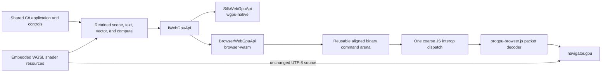

The browser path is composed of these layers:

- `ProGPU.Samples` contains the application, windows, pages, retained visuals, and every shader-using sample. It is a library shared unchanged by both hosts.
- `ProGPU.Samples.Desktop` is a thin Silk.NET executable. `ProGPU.Samples.Browser` is a thin `Microsoft.NET.Sdk.WebAssembly` executable with the canvas, DOM shell, and JavaScript module.
- `BrowserGpuRuntime.InitializeAsync` selects the canvas, requests an adapter/device/profile, chooses a transport, and returns a typed `BrowserGpuCapabilities` result. Unsupported capabilities fail during negotiation rather than rewriting application shaders.
- `BrowserWindowHost` installs browser input, storage, clipboard, fallback font, and window services. Its `requestAnimationFrame` loop drains one fixed-width input batch, reads physical canvas size and DPI, then calls the ordinary `Window.RenderExternalFrame` path.
- `BrowserWebGpuApi` implements renderer-facing WebGPU operations. It serializes resource descriptors, pass commands, copies, uploads, submission, mapping, and destruction into a versioned little-endian protocol. Packets have a 16-byte `PGPU` header, eight-byte-aligned commands, and generation-bearing handles that reject stale JavaScript resources.
- `progpu-browser.js` reads packets directly from the current WebAssembly linear-memory view. It creates the corresponding `GPUDevice`, buffers, textures, bind groups, pipelines, render/compute passes, and queue operations without JSON or one JS call per draw. Upload payloads and mapped-buffer completion use separate coarse asynchronous seams where WebGPU requires them.
- `MainThread`, `Worker`, and `IsolatedWorker` transports use the same packet format. `Auto` prefers a cross-origin-isolated shared-memory worker, then an `OffscreenCanvas` worker, and finally the main thread. All packets produced by one managed frame are handed to a worker as one ordered batch so the acquired surface texture remains valid for the complete frame.
- Production WGSL remains in each owning project's `Shaders/` directory and is embedded by `ShaderResource`. The exact source used by desktop is carried through `ShaderModuleWGSLDescriptor` and passed directly to `GPUDevice.createShaderModule`; the browser does not transpile, fork, or maintain copies of those shaders.

The standard browser canvas host currently supports one top-level `Window`. Popups remain ordinary compositor layers, so menus, flyouts, tooltips, and dialogs still share the same frame, input, and hot-reload tree.

### Hot Reload architecture

Desktop and browser Debug hosts use the same framework-level metadata update pipeline. `ProGPU.WinUI` registers `HotReloadManager` with the runtime through `MetadataUpdateHandlerAttribute`; the browser project additionally enables the .NET WebAssembly Hot Reload component in Debug.

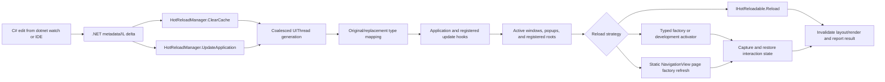

Each runtime callback only queues work; reconciliation runs on `UIThread` before rendering. Multiple deltas arriving before the next UI turn become one generation. The manager clears reusable theme/style factory caches, maps replacement types back to their original live types, invokes application hooks, and walks active `Window` content, popup roots, plus roots registered by embedded hosts. Recursive theme-resource reevaluation is reserved for `ThemeManager`, `Style`, `ResourceDictionary`, `ThemeResource`, and conservative all-types updates; unrelated method-body edits leave the retained scene and unaffected controls intact.

For an updated element, the manager uses these strategies in order:

1. An `IHotReloadable` element rebuilds itself in place. This is the preferred choice for controls with explicit construction state or an existing `Build` method.
2. A factory registered with `HotReloadManager.RegisterFactory<TElement>` recreates the element without reflection and is suitable for required constructor arguments.
3. In an untrimmed modifiable development runtime, a parameterless element can be activated automatically. This reflection fallback is gated off when runtime metadata updates are unavailable, so Release AOT remains trim-safe.
4. Cached `NavigationViewItem` pages created by static page factories are recreated when their factory owner type changes. Inactive cached pages are cleared and will use the updated factory when selected.
5. If recreation is unavailable or fails, the old element stays live, is invalidated, and a diagnostic is reported; failure in one subtree does not stop the remaining roots.

Replacement captures state recursively by stable `Name` with structural-path fallback. The built-in state store preserves local `DataContext`, text/password and caret/selection, check/toggle state, selector and pivot selection, navigation selection and pane state, data-grid selection, scroll/virtualization offsets, attached layout properties such as `Grid.Row`, focus, and custom `IHotReloadStateful` values. Loading/unloaded lifecycle events are isolated, immediate state is restored before the next draw, and layout-dependent scrolling/focus is restored on the following UI turn.

Application authors can opt into the pipeline with small typed contracts:

```csharp
using Microsoft.UI.Xaml.HotReload;

public sealed class LiveChart : Grid, IHotReloadable, IHotReloadStateful
{
    public void Reload(HotReloadContext context)
    {
        ClearChildren();
        BuildChart();
    }

    public object? CaptureHotReloadState() => SelectedSeries;
    public void RestoreHotReloadState(object? state) => SelectedSeries = state as string;
}

// Retain this IDisposable for as long as the factory should be active.
var registration = HotReloadManager.RegisterFactory(
    () => new ConstructorBoundControl(applicationService));
```

An `Application` may implement `IHotReloadable` to reapply window- or application-level configuration. Static shell builders can register an update callback and call `HotReloadManager.ReloadWindowContent`; custom containers whose backing collection must change with a visual child can implement `IHotReloadChildReplacer`. Embedded/non-window hosts register stable visual roots with `HotReloadManager.RegisterRoot(root)`. When the registered root itself can be recreated, use `HotReloadManager.RegisterRoot(root, replacement => host.Root = replacement)` so the framework can replace it atomically while preserving state.

`HotReloadManager.UpdateStarted`, `UpdateCompleted`, `LastResult`, and `Diagnostic` expose generation, duration, replacement/reload/invalidation/failure counts, and isolated exceptions. Set `PROGPU_HOT_RELOAD=0` to disable framework reconciliation. Live metadata updates are a Debug development feature: Release AOT artifacts retain the same UI/browser architecture but do not activate metadata-update handlers.

### Quick start

From the repository root, restore and run the normal Debug build:

```bash
dotnet restore src/ProGPU.Samples.Browser/ProGPU.Samples.Browser.csproj
dotnet run --project src/ProGPU.Samples.Browser/ProGPU.Samples.Browser.csproj -c Debug
```

Open the HTTP URL printed by the command. The sample itself is used like the desktop gallery: select pages from the navigation pane, interact with the controls and GPU samples, and use **Settings → Show Browser WebGPU Diagnostics** when transport or adapter details are needed.

### Normal development mode (without AOT)

Debug configuration uses the managed WebAssembly interpreter and keeps browser Hot Reload enabled. Build it without starting a server with:

```bash
dotnet build src/ProGPU.Samples.Browser/ProGPU.Samples.Browser.csproj -c Debug
```

For the normal edit/run loop, start the local server with `dotnet watch`:

```bash
dotnet watch --project src/ProGPU.Samples.Browser/ProGPU.Samples.Browser.csproj run -c Debug
```

Open the printed URL and leave `dotnet watch` running. Supported C# method-body edits are applied to the running browser application; use `Ctrl+R` in the watch terminal when an edit requires a restart and `Ctrl+C` to stop it. `dotnet run` can be used instead when Hot Reload is not needed.

To create a deployable interpreter artifact—useful for fast deployment iterations or comparison with AOT—publish with AOT disabled explicitly:

```bash
dotnet publish src/ProGPU.Samples.Browser/ProGPU.Samples.Browser.csproj \
  -c Release \
  -p:RunAOTCompilation=false \
  -o artifacts/browser-interpreter

python3 -m http.server 8080 --directory artifacts/browser-interpreter/wwwroot
```

Then browse to `http://localhost:8080/`.

### AOT mode: publish and run

Release configuration enables managed WebAssembly AOT compilation, trimming, SIMD, and native relinking by default. AOT is a publish-time mode, so use `dotnet publish` rather than `dotnet run`:

```bash
dotnet publish src/ProGPU.Samples.Browser/ProGPU.Samples.Browser.csproj \
  -c Release \
  -o artifacts/browser-aot

python3 -m http.server 8080 --directory artifacts/browser-aot/wwwroot
```

Open `http://localhost:8080/`. All ProGPU and sample assemblies are AOT compiled. `netDxf.netstandard` is intentionally retained in supported mixed interpreter/AOT mode because the .NET 10 Mono AOT compiler currently asserts while compiling that upstream assembly.

The deployable application is the complete contents of `artifacts/browser-aot/wwwroot`; upload that directory to any static HTTP(S) host. Do not deploy its parent directory and do not open `index.html` with a `file://` URL.

To confirm that a publish actually used AOT, inspect the publish log for `AOT'ing` and native WebAssembly linking steps. Browser Hot Reload is a Debug development feature and is not active in the trimmed Release AOT artifact. For a clean comparison between modes, remove the selected output directory before republishing so stale fingerprinted framework assets cannot be served.

The two local deployment modes can use different ports when comparing them side by side:

```bash
python3 -m http.server 8080 --directory artifacts/browser-interpreter/wwwroot
python3 -m http.server 8081 --directory artifacts/browser-aot/wwwroot
```

### GitHub Pages AOT deployment

The [Browser Pages workflow](.github/workflows/browser-pages.yml) publishes the Release browser host with WebAssembly AOT and deploys `artifacts/browser-aot/wwwroot` whenever `main` changes. It can also be started manually from **Actions → Browser Pages → Run workflow**. The public gallery is available at [https://wieslawsoltes.github.io/ProGPU/](https://wieslawsoltes.github.io/ProGPU/) after the first successful deployment.

The browser page uses relative asset URLs so the .NET runtime, worker module, styles, and fingerprinted framework files resolve beneath the `/ProGPU/` repository path. The published `.nojekyll` marker ensures GitHub Pages serves the `_framework` directory unchanged.

### Runtime and diagnostics

The browser host runs the shared retained gallery through the complete `IWebGpuApi` dispatcher. It supports main-thread, OffscreenCanvas worker, and cross-origin-isolated worker transports; batches DOM input once per frame; preserves asynchronous mapped-buffer read/write behavior; and sends the same embedded WGSL used by desktop directly to `GPUDevice.createShaderModule`.

The status bar at the bottom of the gallery remains visible. The larger browser WebGPU diagnostics overlay reports the active transport, adapter/profile, frame count, dispatch count, and command bytes; it starts hidden and can be enabled from **Settings → Show Browser WebGPU Diagnostics**. Startup and WebGPU errors reveal it automatically.

For cross-origin-isolated worker mode, configure the server to send:

```text
Cross-Origin-Opener-Policy: same-origin
Cross-Origin-Embedder-Policy: require-corp
```

Without these headers, `Auto` uses the ordinary OffscreenCanvas worker when available and falls back to main-thread rendering when canvas transfer is unavailable. See [the browser backend guide](docs/browser.md) for the full protocol, hosting, and capability details.

Local publishing reads the API key from `NUGET_API_KEY` without storing it in the repository:

```bash
PROGPU_PACKAGE_VERSION=0.1.0-preview.18 ./eng/progpu-publish.sh
```

The release workflow validates docs, restores, builds, tests, packs `.nupkg`/`.snupkg` artifacts, and can publish to NuGet.org when `NUGET_API_KEY` is configured. See [docs/release.md](docs/release.md).

## Projects Using ProGPU

### [LibreWPF](https://github.com/wieslawsoltes/wpf)

LibreWPF ports the managed WPF runtime and SDK to the ProGPU/Silk.NET platform. Applications can switch to the custom SDK while retaining familiar WPF source, XAML, controls, and Windows-shaped APIs on supported non-Windows hosts.

| Package | Purpose | NuGet |
| --- | --- | --- |
| `LibreWPF.Sdk` | MSBuild SDK that redirects WPF applications to the portable ProGPU/Silk.NET platform. | [](https://www.nuget.org/packages/LibreWPF.Sdk/) |
| `LibreWPF.ProGPU` | WPF host, retained/source replay bridge, input integration, and ProGPU compositor adapter. | [](https://www.nuget.org/packages/LibreWPF.ProGPU/) |
| `LibreWPF.Transport` | Managed WPF assemblies, reference assemblies, themes, XAML build tasks, and runtime metadata. | [](https://www.nuget.org/packages/LibreWPF.Transport/) |

### [LibreWinForms](https://github.com/wieslawsoltes/winforms)

LibreWinForms provides portable WinForms-shaped APIs hosted by the ProGPU/LibreWPF stack. It preserves the common `System.Windows.Forms` development model while replacing native GDI rendering with the ProGPU-backed compatibility layer.

| Package | Purpose | NuGet |
| --- | --- | --- |
| `LibreWinForms.Sdk` | MSBuild SDK that configures applications for the portable LibreWinForms package set. | [](https://www.nuget.org/packages/LibreWinForms.Sdk/) |
| `LibreWinForms.System.Windows.Forms` | Portable `System.Windows.Forms` API and runtime surface. | [](https://www.nuget.org/packages/LibreWinForms.System.Windows.Forms/) |
| `LibreWinForms.WindowsFormsIntegration` | Portable bridge for hosting WinForms content in LibreWPF applications. | [](https://www.nuget.org/packages/LibreWinForms.WindowsFormsIntegration/) |

### [Avalonia ProGPU Backend](https://github.com/wieslawsoltes/Avalonia/tree/feature/progpu)

The Avalonia ProGPU backend replaces the Skia renderer with a GPU-first WebGPU implementation while preserving Avalonia's rendering contracts. It also exposes an API lease for issuing custom ProGPU vector operations and WebGPU shaders inside an Avalonia frame.

| Package | Purpose | NuGet |
| --- | --- | --- |
| `ProGPU.Avalonia.Rendering` | ProGPU, Silk.NET, and WebGPU rendering platform for Avalonia. | [](https://www.nuget.org/packages/ProGPU.Avalonia.Rendering/) |

### [Silk.NET Avalonia Backend](https://github.com/wieslawsoltes/Avalonia/tree/feature/progpu)

The Silk.NET Avalonia backend supplies cross-platform desktop windowing, input, surfaces, and WebGPU integration. It is designed to pair with the ProGPU renderer but can host another compatible Avalonia renderer.

| Package | Purpose | NuGet |
| --- | --- | --- |
| `ProGPU.Avalonia.SilkNet` | Cross-platform Silk.NET windowing platform for Avalonia. | [](https://www.nuget.org/packages/ProGPU.Avalonia.SilkNet/) |

### [SkiaSharp Compatibility Shim](https://github.com/wieslawsoltes/ProGPU/tree/main/src/SkiaSharp)

The shim provides a managed SkiaSharp 4.148-shaped API over ProGPU vector, text, imaging, path, and compositing primitives without loading native Skia binaries. Compatibility consumers such as Svg.Skia can use the ProGPU renderer while CPU-only metadata and geometry operations remain independent of WebGPU initialization.

Detailed API coverage, rendering behavior, algorithms, and complexity guarantees are maintained in the [SkiaSharp compatibility log](docs/skiasharp-compatibility-log.md).

| Package | Purpose | NuGet |
| --- | --- | --- |
| `ProGPU.SkiaSharp` | ProGPU-backed SkiaSharp API compatibility layer. | [](https://www.nuget.org/packages/ProGPU.SkiaSharp/) |

### [Svg.Skia](https://github.com/wieslawsoltes/Svg.Skia)

Svg.Skia renders SVG 1.1 documents and its supported static SVG 2 subset through a SkiaSharp-shaped canvas. Its W3C and resvg test lanes also exercise `ProGPU.SkiaSharp`, providing broad compatibility and rendering-parity coverage for the shim.

The `Svg.Skia parity` workflow pins the exact Svg.Skia source commit and runs separate native-SkiaSharp and ProGPU-shim checkouts on macOS. The native W3C lane must remain 530 passes with 3 skips; resvg and the non-W3C remainder must stay fully green through the shim. The ProGPU W3C lane validates its exact reviewed difference inventory and uploads both TRX files plus actual PNGs. A resolved row, a new failure, or a changed failure set intentionally fails the inventory gate until the images are reviewed and `eng/svg-skia-w3c-known-differences.txt` is updated in the same change.

| Package | Purpose | NuGet |
| --- | --- | --- |
| `Svg.Skia` | Core SVG-to-SkiaSharp renderer. | [](https://www.nuget.org/packages/Svg.Skia/) |
| `ShimSkiaSharp` | Backend-neutral SkiaSharp API abstraction used by Svg.Skia integrations. | [](https://www.nuget.org/packages/ShimSkiaSharp/) |
| `Svg.Skia.JavaScript` | Optional JavaScript execution support for SVG documents. | [](https://www.nuget.org/packages/Svg.Skia.JavaScript/) |
| `Svg.Controls.Skia.Avalonia` | Avalonia control integration for the Svg.Skia renderer. | [](https://www.nuget.org/packages/Svg.Controls.Skia.Avalonia/) |
| `Svg.SourceGenerator.Skia` | Source generator for compiling SVG resources into SkiaSharp drawing code. | [](https://www.nuget.org/packages/Svg.SourceGenerator.Skia/) |

---

## Architectural Hierarchy

The ProGPU framework is built in a modular, layered stack that bridges native graphics APIs and system windowing up to a modern, declarative WinUI-compatible user interface layer.

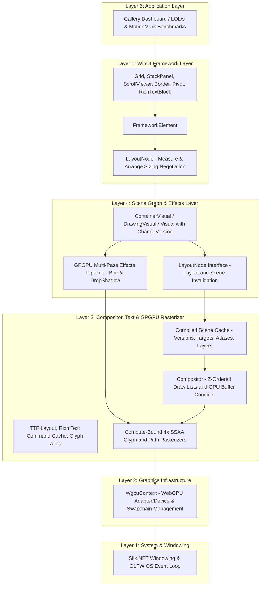

### Layer Description

1. **System & Windowing (Layer 1)**: Interacts with the operating system event queue and monitors display boundaries via Silk.NET and GLFW. It handles window load, resize, rendering loops, and low-level mouse and keyboard input events.
2. **Graphics Infrastructure (Layer 2)**: Manages physical GPU adapter querying, logical device creation, graphics command queues, and swapchain surface configuration.
3. **Compositor, Text & GPGPU Rasterizer (Layer 3)**: Validates and reuses compiled scenes when their visual versions, target configuration, atlas generations, overlays, and cached layers are unchanged. Cache misses compile high-level commands into ordered draw lists and reusable GPU buffers. Framework adapters retain shaped glyph indices and positions as one glyph-run command; the compositor caches font feature availability and rasterizes glyph and vector outlines analytically in WGSL at physical-pixel resolution.
4. **Scene Graph & Effects Layer (Layer 4)**: Establishes the retained `ContainerVisual`, `DrawingVisual`, and `Visual` hierarchy. Mutations propagate `ChangeVersion` and dirty state so layout, compiled-scene, and `CacheAsLayer` reuse remain correct. Mask and effect passes use offscreen textures and intentionally stay on the dynamic compilation path.
5. **WinUI Framework Layer (Layer 5)**: Implements cached `Measure` and `Arrange`, controls, input, and CPU visual-tree hit testing. The WinUI host disables the compositor's duplicate GPU hit-test index while direct compositor consumers retain it by default.
6. **Application Layer (Layer 6)**: Hosts gallery pages, diagnostics, and opt-in performance workloads. Sample animation and status updates invalidate only the visuals that actually changed.

### Shader Source and Startup Contract

Fixed GPU programs live as individual `.wgsl`, `.glsl`, or `.hlsl` files under the owning project's `Shaders/` directory. `Directory.Build.props` embeds these resources into each assembly, and `ShaderResource` decodes each source once into a process-wide cache. Pipeline owners retain the returned reference in `static readonly` fields, so rendering and compute hot paths perform no shader file I/O, manifest lookup, UTF-8 decoding, helper concatenation, or per-frame source allocation.

Each resource documents its algorithm, time complexity, and storage or bandwidth complexity at the top of the file. Final render and compute modules are self-contained, including analytic curve helpers that were previously concatenated from C# strings. Dynamic systems keep only input-dependent generation in C#: the DirectX HLSL translator emits WGSL from caller programs, WPF effects generate active sampler declarations, and ShaderToy appends user code. Their fixed headers and fragment wrappers are still resource-backed and cached.

`ShaderResourceTests` verifies that every source file is present in its assembly, loaded text matches the checked-in resource, required cost-model documentation exists, and fixed production stage modules do not reappear as C# literals. This keeps shader reuse and performance properties enforceable as the renderer evolves.

---

## Current Frame Architecture and Performance Baseline

`Microsoft.UI.Xaml.Window.RenderFrameCore` records each host phase independently: dispatcher work, rendering callbacks, framebuffer/DPI setup, animation, layout, surface acquisition, compositor work, and presentation. `Compositor.RenderScene` then chooses between a retained fast path and a dynamic compile path:

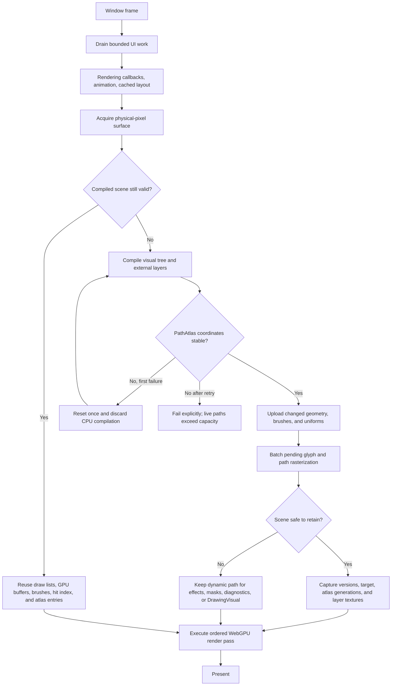

The compiled scene cache is enabled by default with `CompositorOptions.EnableCompiledSceneCache`. A hit requires the same root identity and `ChangeVersion`, logical and physical target, viewport, DPI scale, glyph/path atlas generations, tooltip, external layer versions, and valid `CacheAsLayer` textures. Dynamic diagnostics force a miss. Mutable `DrawingVisual` content, masks, and effects are deliberately not retained because their output can change without a stable immutable command contract.

`CacheAsLayer` and compiled-scene reuse solve different costs. `CacheAsLayer` turns a stable subtree into one texture draw while the rest of a scene may still compile. Whole-scene reuse preserves the already compiled draw lists and GPU buffers for a stable frame. Atlas `Generation` values make both paths safe when a glyph/path atlas is cleared or repacked.

The WinUI host sets `EnableGpuHitTesting = false` because `InputSystem` already performs CPU visual-tree hit testing. Direct scene consumers keep the compositor GPU hit-test index enabled by default. This avoids building two indexes for every WinUI frame without changing input behavior.

### Reference Performance

The opt-in sample harness reports wall-clock FPS, per-phase timings, allocation rate, scene-cache decisions, draw counts, and workload throughput. A July 2026 macOS 120 Hz reference run of the current architecture produced the following results; hardware, window size, and page state affect absolute values.

| Workload | VSync | Wall FPS | Workload throughput | Scene cache |
| --- | ---: | ---: | ---: | ---: |
| LOL/s Benchmark | On | 120.21 | 11,996 LOL/s | Dynamic, 0/480 hits |
| LOL/s Benchmark | Off | 245.04 | 48,905 LOL/s | Dynamic, 0/480 hits |
| Markdown Playground | Off | 519.02 | Static after warmup | 299/300 hits |
| DXF CAD Viewer | Off | 535.55 | Static after warmup | 299/300 hits |

Run the same deterministic workload from the repository root:

```bash
dotnet build src/ProGPU.Samples.Desktop/ProGPU.Samples.Desktop.csproj -c Release

PROGPU_SAMPLE_BENCHMARK_PAGE='LOL/s Benchmark' \
PROGPU_SAMPLE_BENCHMARK_WARMUP_FRAMES=240 \
PROGPU_SAMPLE_BENCHMARK_MEASURE_FRAMES=480 \
PROGPU_SAMPLE_BENCHMARK_VSYNC=true \
dotnet run --project src/ProGPU.Samples.Desktop/ProGPU.Samples.Desktop.csproj -c Release --no-build
```

Set `PROGPU_SAMPLE_BENCHMARK_VSYNC=false` for uncapped throughput, or change the page to `Markdown Playground` or `DXF CAD Viewer` to verify static-scene reuse. The first measured static frame may populate the cache; subsequent frames should report hits unless the page intentionally animates or invalidates.

Rendering quality remains part of the performance contract. The optimized text path retains the glyph index chosen during layout, hoists transform/raster invariants out of glyph loops, and skips color/bitmap table probes only when the parsed font has no such tables. Avalonia solid outline text records one retained glyph run instead of one path per glyph: shaped indices are retained, `Vector2` positions are converted once when the platform glyph run is created, and redraws reuse both arrays. Recording is O(1) with no glyph-count-dependent allocation; compositor compilation is O(G) for G glyphs. Gradient brushes and color/bitmap fonts keep their path or texture fallbacks.

Vector glyphs keep 8x8 path-atlas coverage and use a device-pixel-size transfer calibrated against native Skia: small axis-aligned text preserves fine edge detail, large text receives the slightly stronger coverage needed to match Skia's visual weight, and rotated/reflected text keeps its separately calibrated branch. The physical-size classification includes display DPI, transform scale, and static-buffer zoom, and is computed once per text command for reuse by every glyph. Glyph geometry, subpixel placement, physical DPI rasterization, winding rules, brush opacity, and blend behavior remain unchanged.

Texture resampling follows the same contract. `SKCubicResampler` is an immutable two-coefficient SkiaSharp value with native float equality, hashing, and named Mitchell (`1/3, 1/3`) and Catmull-Rom (`0, 1/2`) kernels. `SKSamplingOptions` is the matching immutable discriminated value for nearest/linear filtering, mipmapping, cubic coefficients, and requested anisotropy. Cubic draws retain B/C through the recorded command and texture vertices, and the WGSL texture shader evaluates the full Mitchell-Netravali kernel. Named and custom kernels therefore remain distinct. Anisotropic draws retain their requested value through recording, clamp only at the portable WebGPU boundary to `[1, 16]`, generate mipmaps, and reuse one lazily created sampler and persistent texture bind group per effective value; ordinary draws do not enter this cache. Value construction, reads, comparison, and hashing are allocation-free `O(1)` CPU operations. Sampler lookup is amortized `O(1)` with at most 15 anisotropic sampler objects, and the common Catmull-Rom render path keeps its original compact polynomial and pixel output.

---

## Technical Specifications: Performance Optimizations

The sections below describe the cooperating layout, scene, text, atlas, batching, effects, and platform optimizations. They share one invariant: cached work is reused only while every input that can affect pixels remains valid.

### 1. WinUI-Compatible High-Performance Layout Caching & Invalidation

#### Sizing Negotiation Lifecycle
Traditional layout systems recursively traverse the entire scene graph every frame to negotiate sizing, causing massive $O(N)$ CPU overhead on complex visual trees even when the UI is static. 

ProGPU introduces a cached sizing negotiation model that short-circuits measurements using layout dirty flags and cached input boundaries:


- **Measure Cache**: Inside `LayoutNode.Measure()`, if `_isMeasureValid` is true and the incoming `availableSize` matches `_previousAvailableSize`, the pass returns immediately. `MeasureOverride` and recursive child traversals are fully bypassed in $O(1)$ time.
- **Arrange Cache**: Inside `LayoutNode.Arrange()`, if `_isArrangeValid` and `_isMeasureValid` are true and the incoming `finalRect` matches `_previousFinalRect`, the pass short-circuits. Children offsets are not recalculated, and recursive child arrangements are bypassed.
- **Parent Bubble-Up Invalidation**: When layout-affecting properties (such as `Margin`, `Padding`, `WidthConstraint`, `HeightConstraint`, alignments, or child mutations) are changed, they invoke `InvalidateMeasure()` or `InvalidateArrange()`. These clear local flags and bubble up the invalidation recursively to parent nodes, forcing only the dirty subtrees to be re-evaluated during the next frame's deferred layout pass.

#### Decoupled Visual Invalidation
To prevent circular dependencies between the `ProGPU.Scene` assembly (base visual layer) and the `ProGPU.Layout` assembly (WinUI framework layer), the `ILayoutNode` interface is defined in `ProGPU.Scene`:
```csharp
public interface ILayoutNode
{
    void InvalidateMeasure();
}
```
Visual tree mutation methods (`ContainerVisual.AddChild`, `RemoveChild`, `ClearChildren`) check if `this` implements `ILayoutNode`. If so, they invoke `InvalidateMeasure()`, ensuring that any changes in visual tree structure automatically mark the layout path dirty without explicit parent layout references.

#### Retained-Scene Invalidation and Text-Page Responsiveness

Layout validity and pixel validity are separate. A layout property can alter clipping, alignment, padding, or descendant placement even when the final `Size` and `Offset` happen to compare equal. The `LayoutNode` setters therefore invalidate measure or arrange **and** call visual `Invalidate()`, which advances `ChangeVersion` to the compiled-scene root. This prevents a retained frame from displaying stale text or geometry after a layout-only mutation.

Text interaction uses the narrowest valid invalidation path. `RichTextBlock` observes every retained `TextElement` in its inline tree, so changing `Run.Text`, font, size, or foreground advances the owning visual version and invalidates layout without waiting for pointer activity. Hyperlink hover, caret movement, and selection changes dirty only render commands and pixels; they retain positioned characters and do not discard document layout. Markdown uses one immutable process-wide Markdig pipeline, warmed asynchronously during application startup. Single-column Markdown measured with infinite height performs one engine layout instead of a measurement layout followed by an identical second pass, while multi-column measurement reuses scratch lists. Width and multi-column-height changes explicitly invalidate layout, and empty content transactionally clears positioned characters, embedded children, and retained commands.

Page navigation keeps stable ownership boundaries:

- Replacing `NavigationView.Content` changes only the `SplitView` content child. The pane and all menu-item visuals remain parented, preserving their layout, theme resources, and cached layer.
- `SplitView` removes and inserts only the child that changed instead of clearing and rebuilding both children.
- Reparenting a dependency-object subtree recursively reapplies theme state only when the resolved theme or theme family actually changes. Moving a cached page between parents with the same theme therefore performs an O(H) ancestor-context comparison for tree height H instead of O(N) invalidation over the page subtree.
- System-font discovery and TextMate grammar loading use one shared background warm-up. Font menu controls are created only when the dropdown is opened. A code editor renders the same source as plain themed runs while grammar loading is pending, then retokenizes on the UI dispatcher with the shared theme grammar. Page activation therefore performs neither a synchronous filesystem font scan nor per-editor grammar initialization.

Large indexed pages remain virtual from source to pixels. `ItemsControl` retains an `IList` source rather than eagerly copying and boxing every item. Attaching a 65,535-glyph source is O(1) time and storage; `UniformVirtualizingGridPanel` realizes and binds only V visible/overscan items in O(V), reuses its recycler-index buffer, and does not allocate a binding closure on each viewport update. Selection and syntax-highlight changes rebind the V active containers in place instead of recycling, reparenting, and remeasuring them. Scrollbar z-order uses an in-parent reorder that invalidates pixels but not layout. The glyph browser represents indices through a read-only computed list, so it allocates neither a 65,535-entry source array nor an internal duplicate. `FontIcon` records the cached raw outline with a public `DrawPath` transform, preserving line, quadratic, cubic, and arc segments without allocating a transformed path per cell or render.

---

### 2. High-Performance Struct Equality and Comparison

Layout caching relies heavily on comparing boundary structs (`Thickness` and `Rect`) on every node. Standard C# struct comparison utilizes generic `ValueType.Equals`, which triggers CPU reflection, runtime boxing, and high memory allocations.

To eliminate this bottleneck, we implemented type-safe, non-boxing, custom equality overloads for both structs:
- **`Thickness`** (Margins and Paddings)
- **`Rect`** (Layout arrangements and clipping boundaries)

Each struct now overrides `Equals(Thickness/Rect other)`, `Equals(object? obj)`, `GetHashCode()`, and provides high-speed operators:
```csharp
public bool Equals(Rect other)
{
    return X == other.X && Y == other.Y && Width == other.Width && Height == other.Height;
}

public static bool operator ==(Rect left, Rect right)
{
    return left.Equals(right);
}

public static bool operator !=(Rect left, Rect right)
{
    return !left.Equals(right);
}
```
These overloads compile down to direct float comparison instructions, achieving zero-allocation, ultra-fast boundary checks.

---

### 3. VSync-Off Graphics Pipeline Swapchain

To allow graphics and layout benchmarks to be evaluated at their true physical limit, we disabled vertical synchronization (VSync) throttling across all layers of the GPU pipeline:

- **Windowing Layer**: Window options in the main, developer tools, and dynamic window controllers explicitly configure VSync to be disabled:
  ```csharp
  options.VSync = false;
  ```
- **WebGPU Swapchain**: Inside `WgpuContext.ConfigureSwapChain()`, the surface capabilities of the GPU adapter are queried. If `PresentMode.Immediate` is supported, the swapchain present configuration bypasses synchronization lockups:
  ```csharp
  PresentMode presentMode = PresentMode.Fifo; // Fallback VSync
  for (uint i = 0; i < capabilities.PresentModeCount; i++)
  {
      if (capabilities.PresentModes[i] == PresentMode.Immediate)
      {
          presentMode = PresentMode.Immediate; // VSync Off
          break;
      }
  }
  ```
This enables the graphics swapchain to present frames as quickly as the GPU queue is filled, releasing the 60 FPS constraint and allowing framerates to soar into the hundreds or thousands of FPS.

---

### 4. Dynamic Backpressure-Throttled Event Dispatcher

The LOL/s benchmark stresses the visual framework by constantly removing and adding hundreds of poolable text controls to a canvas using a background thread loop. 

- **The Livelock Risk**: If a background thread pushes UI events (like `AddChild` or property changes) to the main thread's dispatcher loop as fast as possible without throttling, it will quickly overflow the main thread's event queue. The main thread then spends entire frame cycles acquiring queue locks to process actions, creating massive lock contention that completely starves the UI thread and freezes the application.
- **The Backpressure Solution**: We introduced a thread-safe `PendingCount` property to the main `UIThread` queue. The background benchmark thread loops continuously without fixed sleep periods, but monitors queue occupancy:
  ```mermaid
  flowchart TD
      Start["Background Task Loop"] --> CheckBackpressure{"UIThread.PendingCount > 100?"}
      CheckBackpressure -- Yes --> Sleep["Thread.Sleep 1ms / Release Monitor Locks"]
      Sleep --> Start
      CheckBackpressure -- No --> Post["Post Action immediately / No Sleep"]
      Post --> UIThread["UIThread.RunPending - Main Thread drains queue"]
      UIThread --> AddChild["AddChild/RemoveChild visual tree mutation"]
  ```
  - **Backpressure Active (>100)**: The background thread sleeps for exactly `1ms`. This releases the queue monitor lock completely and relinquishes the CPU slice, allowing the main UI thread to drain the event queue with zero lock contention. The application remains 100% responsive and immune to livelocks.
  - **Backpressure Inactive (<=100)**: The background thread runs with zero sleep, dispatching new visual mutations to the UI thread continuously to maximize throughput.

---

### 5. Compositor Mesh Compilation via Span-Based Direct Writes

In real-time GPU-based vector rendering, compiling high-level primitives (such as Rectangles, Ellipses, Rounded Rectangles, Paths, Lines, and Bezier curves) into dynamic vertex and index buffers is a major CPU bottleneck. Standard implementation using sequential `.Add(...)` calls on `List<T>` invokes continuous bounds checks, potential array resizing/reallocations, and element copying overhead.

To maximize throughput, the `Compositor` is optimized using high-performance `Span<T>` memory writes:
- **Pre-Allocation Throttling**: Instead of building meshes incrementally, the compositor determines the exact number of vertices and indices required for a primitive beforehand.
- **Backing Buffer SetCount**: The internal list count is directly resized using `CollectionsMarshal.SetCount(list, newCount)` to avoid iterative dynamic reallocation/growth logic inside .NET's `List<T>`.
- **Direct Memory Access**: The internal backing array is extracted as a type-safe memory slice via `CollectionsMarshal.AsSpan(list).Slice(offset, count)`.
- **Fast Assembly Assignment**: Vertices and indices are written directly to indices in the returned `Span<T>` or pre-filled using `Span.Fill(defaultValue)` for uniform values.
- **Bulk Memory Clipping**: Clamping vector coordinates to active clipping boundaries is performed in a single linear pass over the direct `Span<VectorVertex>` reference, bypassing indexed list getters.

```csharp
int originalVertexCount = _vectorVerticesList.Count;
int vertexToAdd = 2 * (N + 1);
CollectionsMarshal.SetCount(_vectorVerticesList, originalVertexCount + vertexToAdd);
var vertexSpan = CollectionsMarshal.AsSpan(_vectorVerticesList).Slice(originalVertexCount, vertexToAdd);
vertexSpan.Fill(baseVertex);
```

This ensures that the mesh compiler achieves zero-allocation dynamic buffer construction, minimal instruction-level overhead, and runs at near-native C-speed.

---

### 6. Retained MotionMark Geometry and Frame Scheduling

In traditional UI and vector engines, every active visual element in an animation loop is modeled as a heap-allocated class object. During high-count stress tests (such as the MotionMark benchmark rendering thousands of dynamically moving curves), these allocations put immense pressure on the .NET Garbage Collector (GC), leading to periodic micro-stutters and frame drops.

ProGPU eliminates this overhead using densely stored value types, retained geometry, and explicit pre-render scheduling:
- **Dense Elements**: Animated shapes are modeled using compact `Element` and `GridPoint` value types, avoiding one managed object allocation per segment:
  ```csharp
  public struct Element
  {
      public SegmentKind Kind;
      public GridPoint Start;
      public GridPoint Control1;
      public GridPoint Control2;
      public GridPoint End;
      public Vector4 Color;
      public float Width;
      public bool Split;
      public SolidColorBrush CachedBrush;
      public Pen CachedPen;
      public PathGeometry CachedPath;
  }
  ```
- **Retained Official Paths**: Logical 80x40 grid points are mapped when elements are generated or the viewport changes. Each segment owns one retained `PathGeometry`; steady frames submit the same geometry references through the public `DrawingContext.DrawPath` API instead of allocating paths and segment objects in `OnRender`.
- **Two Public-API Modes**: Individual mode emits one retained path command per segment. The default grouped mode reuses pooled `PathGeometry`/`PathFigure` containers and retained segment references for each split-delimited group, reducing command compilation without bypassing the renderer.
- **Pre-Render Animation Scheduling**: The visual implements `IAnimatedElement`, so the normal sample-tree update traversal advances it every frame while it is attached. `Update(delta)` mutates split state and invalidates before compositor compilation; `OnRender` is side-effect free. Pointer movement is no longer needed to keep the benchmark active.
- **Time-Normalized Split Work**: The original 0.5% split probability at 60 Hz is accumulated as `0.3 * N * delta` toggles. Selecting K due toggles is O(K); rebuilding split-delimited retained groups before rendering is O(N + G) for N segments and G groups, and `OnRender` then records only O(G) grouped commands without mutating geometry. Persistent geometry storage is O(N); the retained group pool and end-index table are O(Gmax), bounded by N, after warmup. Pens, brushes, HUD strings, and path containers are refreshed only when their owning settings, theme, geometry, or viewport change.
- **Measured Result**: On the 120 Hz reference macOS machine, the 1,000-element uncapped benchmark improved from 146.9 to 190.4 wall FPS and reduced visual compilation from 3.71 to 2.24 ms per frame. With VSync enabled it sustains 120 FPS with a deliberate `Root version changed` cache miss on every animated frame.

---

### 7. GPGPU Real-Time Multi-Pass Effects Pipeline

Standard graphics engines struggle to apply dynamic blurred effects (such as Gaussian backdrop blurs, soft ambient drop shadows, and neon glowing halos) to standard layout elements in real-time due to high composition and memory transfer overhead. ProGPU overcomes this with a multi-pass offscreen composition and compute processing system.

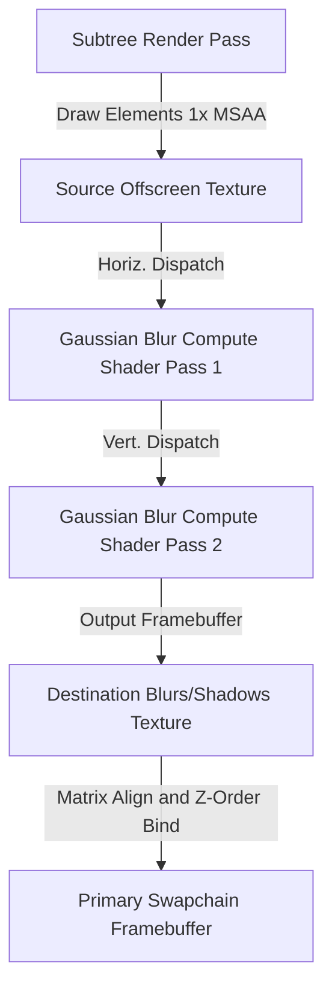

- **Dynamic Texture Caching**: Textures (`Source`, `Temp`, and `Destination` buffers) are cached per-element in a specialized dictionary (`_effectTextures`). They are dynamically resized only when the element's actual visual bounds mutate, eliminating frame-by-frame allocation/deallocation thrashing.
- **Offscreen Redirection**: Standard scene-graph rendering in ProGPU uses 4x MSAA for vector geometry. Since WebGPU compute shaders cannot directly read or sample multisampled textures, ProGPU compiles a specialized 1x MSAA offscreen rendering pipeline (`_vectorPipelineOffscreen`, `_textPipelineOffscreen`, `_texturePipelineOffscreen`). When an element has an active effect:
  1. The compositor preserves the active vector batch state and clips.
  2. It redirects all rendering of the element and its entire visual child subtree into the 1x MSAA offscreen `Source` texture using an isolated orthographic projection matrix.
  3. Restores the main batch state after capture.
- **Two-Pass Compute Acceleration**: The compute pass binds the `Source` texture and executes a horizontal-pass WGSL compute shader, writing intermediate results to the `Temp` texture. It then binds the `Temp` texture to execute a vertical-pass compute shader, outputting the final blurred mask to the `Destination` texture.
- **High-Performance Compositing**: The final blurred texture is drawn back onto the main screen swapchain as a textured quad. For drop shadows, the texture is drawn with configurable offsets, blending colors, and alpha multipliers, and the original `Source` texture is composited cleanly on top, maintaining crisp bounds.

---

### 8. GPU-Bound Analytical Vector Path Rasterization

To bypass CPU bottlenecks (e.g. flattening Bezier curves into thousands of lines and performing heavy triangulation), ProGPU integrates a pure GPU-bound vector path rasterizer. The engine computes vector fills analytically directly inside custom WebGPU WGSL compute shaders.

#### Sequential 16-Byte Aligned Struct Layouts
To satisfy WebGPU/WGSL uniform and storage buffer packing requirements, layout metrics are organized into sequentially packed structs matching exact 16-byte memory alignments:

```csharp
[StructLayout(LayoutKind.Sequential, Pack = 16)]
public struct PathUniforms
{
    public float XStart;   public float YStart;
    public float Scale;    public uint PathIndex;
    public uint AtlasX;    public uint AtlasY;
    public uint Width;     public uint Height;
}

[StructLayout(LayoutKind.Sequential, Pack = 16)]
public struct GpuPathRecord
{
    public uint StartSegment;  public uint SegmentCount;
    public float MinX;         public float MinY;
    public float MaxX;         public float MaxY;
    public uint Pad0;          public uint Pad1;
}

[StructLayout(LayoutKind.Sequential, Pack = 16)]
public struct GpuPathSegment
{
    public Vector2 P0;         public Vector2 P1;
    public Vector2 P2;         public Vector2 P3;
    public uint SegmentType;   public uint Pad0;
    public uint Pad1;          public uint Pad2;
}
```

#### Analytical Non-Zero Winding Number WGSL Shaders
The rasterizer counts curve intersections analytically using a horizontal ray casting winding-number algorithm directly in WGSL:

- **Line Intersection**: Evaluates linear roots analytically:
  $$t = \frac{p_y - A_y}{B_y - A_y}$$
- **Quadratic Bezier Intersection**: Solves quadratic equation $(1-t)^2 A_y + 2(1-t)t B_y + t^2 C_y - p_y = 0$ for $t \in [0, 1]$. Valid intersections are checked against the ray, and winding adjustments are updated based on the tangent derivative:
  $$P'_y(t) = 2(1-t)(B_y - A_y) + 2t(C_y - B_y)$$
- **Cubic Bezier Intersection**: Expands the cubic Bezier equation into $a t^3 + b t^2 + c t + d = 0$. The compute shader executes Cardano's formula (`solve_cubic` helper in WGSL) to find up to 3 real roots, updating the winding number according to the cubic tangent derivative:
  $$P'_y(t) = 3 a t^2 + 2 b t + c$$

#### Performance Enhancements & Quality Correctness
- **CPU Path Cache (`_pathGeometryCache`)**: Compiled segment arrays and pre-calculated local bounds are cached for each unique `PathGeometry`. Dynamic frames skip CPU figures traversal, and copy segment spans directly, reducing CPU path compilation times to **0.30ms** for 100,000 shapes.
- **Pixel-Level Bounding Box Shader Skip**: To eliminate GPU rasterization bottlenecks, the fine-rasterization pixel loop performs a screen-space bounding box check:
  ```wgsl
  if (px < inst.screenMinX || px > inst.screenMaxX || py < inst.screenMinY || py > inst.screenMaxY) {
      continue;
  }
  ```
  Pixels outside the shape boundaries immediately bypass local coordinate transforms, 4-sample subpixel loops, and expensive winding calculations. This discards ~95% of active operations per pixel, resulting in a **15x** rendering speedup.
- **4x SSAA Quality Correctness**: Replaced screen coordinates with transformed local coordinates in the Sample 2 containment checks of the `PathRasterizerShader`. This ensures that under high multisampling/supersampling, anti-aliased edge pixels align perfectly, delivering sharp, hardware-accurate vector strokes and fills.

---

### 9. High-Quality Anti-Aliasing & Expanded-Quad Render Padding

Standard Signed Distance Field (SDF) rendering often clips the outer half of strokes or the edges of anti-aliasing gradients because the generated quad boundaries are drawn *exactly* at the shape's mathematical dimensions. This limits pixel operations outside the bounding box, resulting in a rough, aliased border. 

To achieve state-of-the-art vector quality with zero performance degradation, we implemented a dual-stage quad inflation and pixel-distance anti-aliasing framework:

- **Separated-Pass Quad Expansion**: During shape compilation in `Compositor.cs`, drawing of Rectangles, Ellipses, and Rounded Rectangles is divided into independent Brush (fill) and Pen (stroke) passes.
  - **Fill Pass (Brush)**: Inflates bounding quad vertices and `texCoord` offset variables outwards by a padding of `1.5` pixels.
  - **Stroke Pass (Pen)**: Inflates bounding quad vertices and `texCoord` offsets by `thickness / 2.0 + 1.5` pixels.
  This expansion guarantees that the outer half of a stroke of width $T$, as well as its smooth anti-aliasing gradient, are fully rendered without quad boundary clipping.
- **Pixel-Distance WGSL Stroke Anti-Aliasing**: For GPU-expanded Lines, Quadratic Beziers, Cubic Beziers, and elliptical Arcs, the vertex shader computes the exact signed pixel distance from the center spline to the expanded vertex boundaries, passing it to the fragment shader via `gridIndex`. The fragment shader evaluates anti-aliasing dynamically using:
  ```wgsl
  let d_pixels = abs(input.gridIndex);
  let d_shape = d_pixels - input.strokeThickness * 0.5;
  shapeAlpha = 1.0 - smoothstep(-0.5, 0.5, d_shape);
  ```
  This calculates a crisp, subpixel-accurate smoothstep edge transition directly in screen-space pixel coordinates, eliminating aliased jagged edges on all lines and splines.

---

### 10. High-Performance Theming, Styling & Templating Engine

ProGPU implements a lightweight, high-performance, and memory-safe theming, styling, and templating engine designed to emulate the logical capabilities of WinUI 3 but operating with minimal CPU and memory overhead.

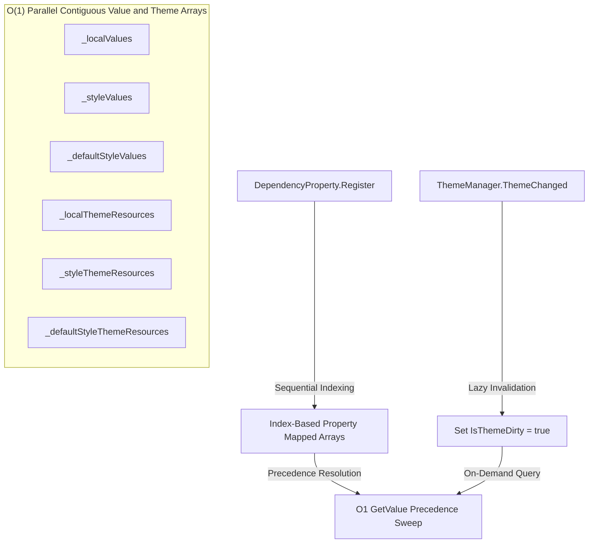

#### $O(1)$ Sequential Flat-Array Property Storage
Traditional XAML frameworks store DependencyObject property values in heavy dictionaries (`Dictionary<DependencyProperty, object>`), which trigger expensive hash calculation, collisions, and lookup overhead inside tight render or layout loops.
ProGPU bypasses dictionaries entirely by introducing sequential indexing:
* **Sequential Indexing**: Every registered `DependencyProperty` is assigned a unique, sequential, zero-based `Index` from a thread-safe static list during bootstrap.
* **Direct Array Access**: `DependencyObject` stores properties in a set of parallel contiguous flat arrays (`_localValues`, `_styleValues`, `_defaultStyleValues`, `_effectiveValues`, and `_valueSources`) matching the index sizes.
* **Precedence Resolution**: Property value resolution (`GetValue(dp)`) is simplified to direct index checks on these arrays in $O(1)$ time, resolving values via native priority precedence:
  $$\text{Local} \succ \text{Style} \succ \text{Default Style} \succ \text{Inherited} \succ \text{Default}$$

#### Lazy, Invalidation-Tracked Dynamic Theming
Eagerly traversing and updating dynamic brushes across the entire visual tree on every theme change triggers substantial CPU frame stutters. ProGPU bypasses this via a lazy evaluation pipeline:
* **Visual Tree Invalidation**: When a theme toggle is triggered, `ThemeManager.ThemeChanged` fires. The system recursively propagates a cheap `IsThemeDirty = true` flag down the scene graph (`NotifyThemeChanged`), avoiding immediate value updates.
* **Parallel Flat Theme Mappings**: Dynamic references are stored in parallel arrays (`_localThemeResources`, `_styleThemeResources`, and `_defaultStyleThemeResources`). During subsequent property reads (`GetValue(dp)`), if the dirty flag is set, the system sweeps these parallel arrays, re-evaluates active key lookups against the theme palette, and rebuilds only the affected elements' effective values in a single sequential linear pass.

#### Reflection-Free, Weak Callback Template Bindings
To support lightweight control customization without the heavy reflection, expression compilation, or string-matching of traditional bindings:
* **Index-Based Callbacks**: `DependencyObject` maintains an index-sequential list of callbacks registered via `RegisterPropertyChangedCallback(dp, callback)`. 
* **WinUI-Compliant Tokens**: Registration returns a unique `long` token, allowing surgical unregistration via `UnregisterPropertyChangedCallback(dp, token)`.
* **Weak, Self-Cleaning Template Binding**: `TemplateBinding` coordinates bindings between controls and template roots using weak references (`WeakReference<DependencyObject>`). On every callback trigger, if it detects that the target control has been garbage-collected, the binding automatically unregisters itself from the source object, completely preventing memory leaks.

#### Decoupled Multi-Window & Popup Inspector
To support robust diagnostic capabilities:
* **Multi-Window Visual Inspector**: Refactored the `DevTools` visual tree population (`RefreshVisualTree`) to dynamically traverse all active windows registered in `WindowManager.ActiveWindows` (filtering out the inspector itself), and automatically falling back to the thread-static `InputSystem.Root` for raw Silk.NET window bindings.
* **Popup & Dialog Hierarchies**: Merges active floating popups and dialogs from `PopupService.ActivePopups` as a dedicated branch in the visual tree, making overlay dialogs fully inspectable.
* **Global Invalidation Hub**: Replaced thread-local repaints with a public `InvalidateAllMainWindows()` hub in `DevToolsService`, ensuring hover overlays, inspection borders, and property changes instantly refresh across all active window compositors.

---

### 11. High-Fidelity GPU Text & Retina Rendering (macOS High-DPI Quality)

Traditional GPU engines suffer from low-resolution stretch blurriness on macOS high-DPI (Retina) screens because they configure the SwapChain to match logical coordinates, letting the operating system scale the output. ProGPU achieves true macOS Retina rendering quality while maintaining high performance through four main pillars:

* **Physical-Pixel Backing Store SwapChain**: The WebGPU swapchain and render pipelines are driven directly by the window's physical `FramebufferSize` instead of logical size (e.g. `2560x1600` instead of `1280x800`). This aligns all vector and rasterization outputs exactly 1:1 with hardware pixels, eliminating OS-level linear stretching blur.
* **DPI-Aware Physical Glyph Caching**: Computes the high-DPI scaling factor dynamically (`dpiScale = FramebufferSize.X / Size.X`) and pre-rasterizes glyphs in the `GlyphAtlas` at their **actual physical pixel font size** (`cmd.FontSize * dpiScale`), ensuring that the atlas contains the high-resolution 2x textures.
* **4x Physical Subpixel Snapping**: Snippets the screen-transformed baseline cursor position to physical device pixels (`transPos * dpiScale`) and snaps the horizontal coordinate to the nearest 1/4th *physical* pixel, completely eliminating subpixel blur on the screen.
* **Retina Snap-Back logical mapping**: Snapped physical coordinates of the drawing quad are divided by `dpiScale` before writing them to the vertex buffer, mapping them back to logical space for the compositor's orthographic projection matrix. The GPU hardware then renders the logical quad exactly 1-to-1 with screen physical pixels!
* **Direction-Aware Winding Curve Crossing Corrections**: Replaced the static, direction-agnostic interval checks in both the quadratic and cubic Bezier crossing solvers with **Precise Direction-Aware Half-Open Winding Intervals** based on the vertical derivative sign (`deriv_y`):
  * **Upward Crossing (`deriv_y > 0.0`)**: Valid range is `[0.0, 1.0)` (inclusive of start, exclusive of end).
  * **Downward Crossing (`deriv_y < 0.0`)**: Valid range is `(0.0, 1.0]` (exclusive of start, inclusive of end).
  This eliminates boundary vertex double-counting and zero-counting across all transition types (line-to-curve, curve-to-line, curve-to-curve) in both `GlyphRasterizer` and `PathRasterizer` shaders, completely preventing horizontal seam and drop-out artifacts at curve joins (such as on letters like `G`/`g`).

#### Text Compilation Fast Path and Rich Text Command Reuse

Text-heavy pages avoid repeated work without changing raster quality:

* `TextLayout` stores the resolved `GlyphIndex` beside each positioned glyph. The compositor uses that index directly instead of repeating character-map lookup during every compile.
* `TtfFont` resolves `HasColorGlyphs` and `HasBitmapGlyphs` once after parsing the table directory. Normal outline fonts therefore avoid per-glyph COLR/CPAL/SVG/bitmap probes, while fonts that contain those tables still use the full color or bitmap path.
* DPI/raster size, transform scale, rotation state, basis vectors, synthetic-bold parameters, and Skia font stretch/shear are computed once per text command or glyph run rather than once per glyph. Explicit positions remain in shaped logical coordinates; only glyph-local outlines or atlas quads are transformed, and vector cache keys include the local stretch and shear.
* CFF and explicit vector glyphs preserve the established baked fractional-position coverage model required by Skia/Svg.Skia parity, but canonicalize each local axis to 128 phases. The residual position stays in the draw transform, so the final quad is not snapped; local coverage quantization is at most 1/256 coordinate per axis. After the parent transform, vector text uses a separate four-phase device-translation key per axis, matching quarter-pixel glyph coverage with at most 1/8 device-pixel coverage error; ordinary paths retain their 64-phase keys. Only vector-text scale keys retain ten binary mantissa bits, with at most 1/2048 relative scale error. This bounds continuously changing float keys without lowering the existing 8x8 high-precision winding coverage or changing ordinary path behavior. Compilation is O(G) for G glyph instances. A glyph/style/size has at most 128² local phase variants and 16 device-phase variants, while the process-wide transformed-outline cache is capped at 4,096 entries and PathAtlas residency remains physically bounded by atlas capacity. The rotating 512-position regression settles at 129 resident paths instead of 512 exact-position paths; a separate 256-position parent-transform regression settles at 16 coverage entries. Both verify visible coverage for every glyph.
* `RichTextBlock` and `MarkdownTextBlock` retain generated drawing commands until layout, theme, selection, or hyperlink-hover state changes. Replaying C stable text/table commands is `O(C)` reference-copy work with no parsing, glyph positioning, or command-text allocation. A content or width change reparses only when text changed and performs the required `O(B + G)` block/glyph layout for B source nodes and G positioned glyphs.

---

### 12. Layered High-DPI Visual Caching (CacheAsLayer)

In high-performance GPU-bound UI frameworks, recursively traversing large, static visual subtrees (such as complex sidebar menus, navigation drawers, and presentation panels) every frame at double physical coordinates (`FramebufferSize`) on macOS Retina screens incurs heavy CPU-to-GPU overhead (layout traversal, vertex mesh generation, matrix multiplications, draw call issuance, and constant buffer uploads).

ProGPU introduces **Layered High-DPI Visual Caching** (`CacheAsLayer`) to completely eliminate redundant rendering loops for static or rarely modified subtrees:

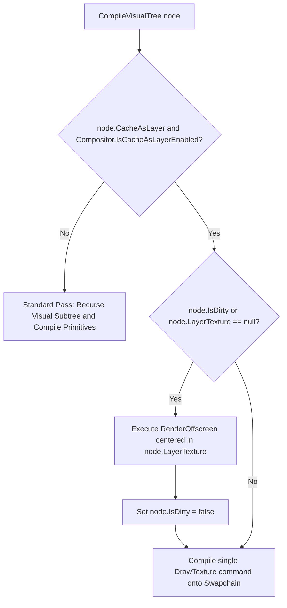

- **Offscreen Physical Buffering**: When `CacheAsLayer = true` is set on a static visual (like the `NavigationView`'s sidebar pane), the compositor redirects rendering of the node and its entire subtree into an isolated offscreen texture (`LayerTexture`) allocated at exact physical pixel dimensions:
  $$w = \text{logicalWidth} \cdot \text{dpiScale}, \quad h = \text{logicalHeight} \cdot \text{dpiScale}$$
- **O(1) Render Bypass**: On subsequent frames, if `node.IsDirty == false` and the cache is valid, the compositor completely skips visual tree traversal, geometry generation, and command decoding for the entire subtree. Instead, it issues exactly **1 Texture draw call** (rendering the pre-compiled `LayerTexture` back onto the swapchain), achieving an instant **1.77x rendering acceleration**.
- **Razor-Sharp Typography & 1:1 Pixel Alignment**: During offscreen rendering, the projection matrix uses logical boundaries, but text glyphs are snapped and rasterized at the physical `dpiScale` inside `CompileTextCommand`. Drawing this cached layer texture back onto the physical swapchain guarantees perfect **1:1 physical pixel alignment** and native-sharp typography on macOS Retina displays without bilinear filtering blur.
- **Lazy Dirty-State Propagation**: When any child element inside the cached subtree changes (e.g. hovered, clicked, or typed into), invalidation sets `IsDirty = true` and bubbles up to the cached parent node. The compositor automatically detects this dirty state on the next frame, re-runs `RenderOffscreen` to update the cache in a single frame, and marks it clean again.
- **Global Settings Switch**: The caching system can be enabled or disabled completely at runtime globally:
  - **Individual Control**: `Visual.CacheAsLayer = true;`
  - **Global Override**: `Compositor.IsCacheAsLayerEnabled = true / false;` (Toggleable via the Application Settings panel).

---

### 13. Dynamic Z-Ordered Draw Call Batching

In retained scene graphs with interleaved primitive types (such as vector geometries, offscreen computer-generated textures, and rich text visual elements), simple bulk-draw grouping causes Z-order overlap bugs. If all textures or all texts are batched and drawn at the very end of layer compilation, solid backgrounds or overlay vectors can draw on top of pre-rendered textures, resulting in black or empty areas.

ProGPU implements a **Dynamic Z-Ordered Draw Call Batching** mechanism within `Compositor.cs` to achieve optimal batching performance while strictly preserving visual Z-order:
- **Pending Batch Tracking**: Instead of immediate submission, consecutive vector shape and text draw commands are accumulated into contiguous ranges tracked via `_pendingVectorStart` and `_pendingTextStart` pointers.
- **Ordered Flush Commits (`CommitPendingDrawCalls`)**: Whenever a boundary-crossing operation is encountered (such as an offscreen compiled texture draw call or layer bounds transition), the compositor flushes accumulated vector and text batches using `CommitPendingDrawCalls()`. This groups consecutive visual primitives into single drawing calls while guaranteeing they are submitted to the GPU command encoder in the exact Z-order depth traversed by the visual tree.
- **Zero-Allocation Dynamic Offsets**: The batched ranges directly index into GPU-mapped vertex and index backing buffers, avoiding CPU copy operations and preserving near-native rendering speeds.

#### Retained lattice and nine-patch batching

Skia-compatible lattice and nine-patch image draws use the same ordered texture path without multiplying submission overhead:

- The CPU iterator follows Skia's alternating fixed/scalable segment model. With enough destination space, fixed source segments keep their pixel length and scalable segments divide the remainder proportionally. When the destination is smaller than all fixed segments, scalable segments collapse to zero and fixed segments shrink proportionally.
- A call records one `RenderCommand` containing one contiguous `TexturePatch[]`. Transparent and collapsed cells are removed during layout. Fixed-color cells retain their filtered RGBA value beside ordinary source/destination texture cells.
- `CompileTextureCommand` reserves one contiguous vertex/index range, emits four vertices and six indices per visible cell, and creates one `CompositorDrawCall`. Fixed-color cells use the same texture pipeline with a flat per-vertex discriminator, so they avoid texture sampling without causing a pipeline switch or an extra draw.
- For X and Y div counts and C visible cells, layout costs `O(X + Y + C)` time and storage, compositor expansion costs `O(C)`, and GPU submission remains one draw call per lattice operation. This prevents a conventional 9-patch from becoming nine retained commands or nine GPU submissions.

#### Retained vertex meshes

`SKVertices` and `DrawingContext.DrawVertexMesh` provide the matching batched path for arbitrary colored triangle meshes:

- Positions, optional texture coordinates, vertex colors, and 16-bit indices are copied once into an immutable `VertexMesh2D`. Triangle lists, strips, and fans retain their original topology instead of being converted into one retained path per face.
- The compositor transforms each vertex once, normalizes valid faces into one contiguous index range, and leaves invalid indexed faces out of the final count. The entire mesh remains part of the surrounding vector batch and therefore does not add one draw call per triangle.
- Vertex colors travel premultiplied and are combined with the paint brush by the vector shader. The WGSL path implements Skia's Porter-Duff, arithmetic, separable, and non-separable vertex-color blend modes before the ordinary mask and framebuffer blend stages.
- GPU hit testing traverses the same normalized triangles. For V vertices, I input indices, and T output triangles, retained construction costs `O(V + I)` time and storage, compilation costs `O(V + T)`, and hit-index construction costs `O(T)`.

Coons patches use this same mesh path. The tessellator evaluates clockwise top, right, reversed-bottom, and reversed-left cubic boundaries, combines the two ruled surfaces, and subtracts their bilinear corner surface. Device-space boundary lengths select a grid at roughly one partition per 10 pixels with an 8x8 minimum; extreme patches are proportionally limited to 60,000 indices. Corner colors interpolate in premultiplied space and texture coordinates interpolate bilinearly. An `Lx` by `Ly` patch costs `O(Lx * Ly)` CPU time/storage but still records one command and enters one vector batch.

#### Transformed sprite atlases

`SKCanvas.DrawAtlas` reuses the retained texture-patch batch for sprite-heavy scenes:

- Each non-empty source rectangle becomes one patch with an `SKRotationScaleMatrix` converted to a sprite-local scale/rotation/translation. Bounds are accumulated from the four transformed corners; an optional caller cull rectangle remains a conservative quick-reject/hit bound and does not clip individual sprites.
- The whole atlas call retains one patch array, one copied texture resource, one sampler choice, and one indexed texture draw. Nearest, linear, mipmapped, custom cubic, and anisotropic sampling metadata stays uniform across the sprite batch.
- Optional sprite colors are premultiplied once in vertex data. The texture shader treats the sampled sprite as source and the color as destination, implements all Skia blend modes, and then applies paint opacity, masks, the selected texture alpha representation, and the framebuffer blend mode.
- For S visible sprites, layout, bounds, and vertex/index generation cost `O(S)` time and storage. GPU submission remains one draw rather than S texture draws and does not create per-sprite bind groups.

---

### 14. Zero-Allocation Vector Drawing & Skia-like GpuPicture Caching

High-performance vector rendering loops are highly sensitive to Garbage Collection (GC) pressure. Passing coordinate arrays (such as `Vector2[]` for complex polylines, curves, or CAD structures) on every frame forces heap allocation and copying, resulting in massive GC thrashing. 

ProGPU completely eliminates this overhead by introducing a zero-allocation vector drawing engine driven by `ReadOnlySpan<T>` and a Skia-like `GpuPicture` command caching architecture:

```mermaid
flowchart TD
    subgraph AllocPool ["Zero-Allocation Frame Draw (Pooling)"]
        DrawCall["DrawPolyline(Pen, ReadOnlySpan<Vector2> points)"] --> GetPool["Acquire continuous PointBuffer from DrawingContext"]
        GetPool --> CopySpan["Copy points data in bulk using high-speed Span.CopyTo"]
        CopySpan --> RecordCmd["Record RenderCommand with PointBufferOffset and PointBufferCount"]
    end

    subgraph CacheSystem ["Pre-Recorded Caching Loop (GpuPicture)"]
        RecStart["GpuPictureRecorder.BeginRecording(bounds)"] --> RecDraw["Record vector commands into local buffers once"]
        RecDraw --> RecEnd["EndRecording() compiles into immutable GpuPicture"]
        RecEnd --> DrawCache["context.DrawPicture(picture, cameraViewMatrix)"]
        DrawCache --> CompositorPlay["Compositor compiles and plays back directly in-place (Zero-Copy)"]
    end
```

#### Pre-Allocated Continuous Memory Pools
Since `ReadOnlySpan<T>` is a stack-only `ref struct`, it cannot be stored on the heap or inside standard lists. To allow zero-allocation span-based rendering, `DrawingContext` maintains internal pre-allocated continuous memory lists:
* `PointBuffer` (`List<Vector2>`)
* `DoubleBuffer` (`List<double>`)
* `Line3DBuffer` (`List<Line3D>`)
* `FloatBuffer` (`List<float>`)

On every frame refresh, calling `.Clear()` on these buffers resets their logical `Count` to `0` but **retains their internal backing array capacity**. Drawing coordinates are copied into these pre-allocated pools using high-speed bulk `Span<T>.CopyTo` operations. As long as capacity is sufficient, frame-by-frame rendering runs at near-native speed with **absolutely zero heap allocations**.

#### Unified `IRenderDataProvider` Interface
To support both real-time dynamic rendering (where coordinates live in the active `DrawingContext` pools) and cached playback (where coordinates live in static arrays), we introduce the `IRenderDataProvider` interface:
```csharp
public interface IRenderDataProvider
{
    ReadOnlySpan<Vector2> GetPoints(int offset, int count);
    ReadOnlySpan<double> GetDoubles(int offset, int count);
    ReadOnlySpan<Line3D> GetLines3D(int offset, int count);
    ReadOnlySpan<float> GetFloats(int offset, int count);
}
```
Both `DrawingContext` and `GpuPicture` implement `IRenderDataProvider`. Inside WebGPU mesh compilation, the compositor queries coordinate spans directly from the active provider using the offsets and counts recorded in the `RenderCommand`.

#### Skia-like `GpuPicture` and `GpuPictureRecorder`
* **Recording**: Call `GpuPictureRecorder.BeginRecording(bounds)` to retrieve a recording `DrawingContext`. Commands are recorded normally using the zero-allocation span APIs. Call `recorder.EndRecording()` to compile the active lists into an immutable `GpuPicture` object (which allocates static arrays *only once* during compile time).
* **Playback**: Render a pre-recorded picture via `context.DrawPicture(picture)` or apply dynamic camera transitions in GPU-space via `context.DrawPicture(picture, cameraViewMatrix)`.
* **Zero-Copy Playback**: At the compositor level, when a `DrawPicture` command is encountered, it recursively plays back the pre-compiled picture commands directly in-place using the picture itself as the `IRenderDataProvider`, completely avoiding CPU copying or allocation during rendering.

#### Core API Specification

##### 1. High-Performance Zero-Allocation Span Signatures
```csharp
// Draws polylines or polygon outlines directly from stack memory
public void DrawPolyline(Pen pen, ReadOnlySpan<Vector2> points, bool isClosed = false);

// Draws quadratic or cubic B-Spline curves
public void DrawSpline(Pen pen, ReadOnlySpan<Vector2> controlPoints, ReadOnlySpan<double> knots, int degree);

// Draws rational, weighted NURBS curves
public void DrawSpline(Pen pen, ReadOnlySpan<Vector2> controlPoints, ReadOnlySpan<double> knots, ReadOnlySpan<double> weights, int degree, bool isClosed);

// Draws 3D ACIS solids or wireframe boundaries
public void DrawAcisSolid(Pen pen, ReadOnlySpan<Line3D> edges, Matrix4x4 modelTransform);

// Hardware-accelerated dynamic chart line series
public void DrawGpuLineSeries(ReadOnlySpan<float> interleavedCoords, int pointsCount, float thickness, Brush brush);

// Hardware-accelerated dynamic chart scatter series
public void DrawGpuScatterSeries(ReadOnlySpan<float> interleavedCoords, int pointsCount, float radius, Brush brush);
```

##### 2. Backward-Compatible Array-Based Signatures (WinUI Parity)
Wraps standard heap-allocated arrays into `ReadOnlySpan<T>` using `new ReadOnlySpan<T>(array)` and forwards to the high-performance pipeline. Assigns legacy fields (`SplineWeights`, `Edges3D`) on the created `RenderCommand` structures to preserve 100% test compatibility and visual tree diagnostics:
```csharp
public void DrawPolyline(Pen pen, Vector2[] points, bool isClosed = false);
public void DrawSpline(Pen pen, Vector2[] controlPoints, double[] knots, int degree);
public void DrawSpline(Pen pen, Vector2[] controlPoints, double[] knots, double[]? weights, int degree, bool isClosed);
public void DrawAcisSolid(Pen pen, List<Line3D> edges, Matrix4x4 modelTransform);
```

---

### 15. WinUI-Style Cooperating Scroll Virtualization

High-performance viewport virtualization is highly sensitive to coordinate math re-calculation and z-order sorting. To guarantee flawless macOS Retina-quality scrollbar overlay Z-order depth, precise boundary clipping, and locked 60 FPS scrolling speeds, ProGPU implements a **WinUI-Style Cooperating Scroll Virtualization** architecture:

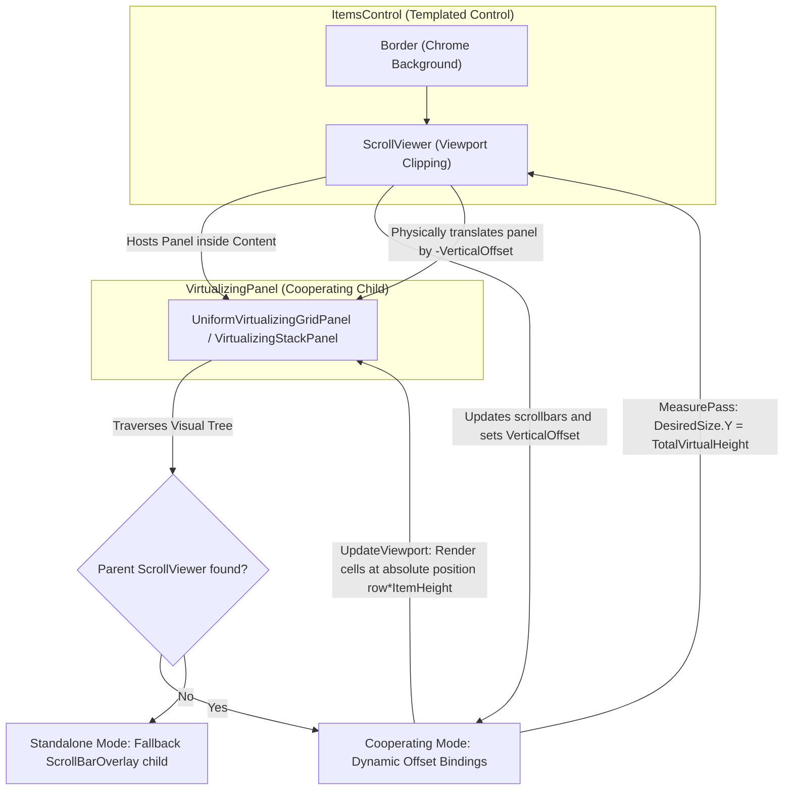

#### Dual-Mode Sizing & Viewport Cooperation
* **Cooperating Mode**: When hosted inside a parent `ScrollViewer`, `VirtualizingPanel` dynamically traverses up the visual parent chain (`ScrollViewerOwner`) to establish a direct binding link:
  * **Unified Offsets**: Reading and writing `ScrollOffset` binds directly to `ScrollViewer.VerticalOffset`.
  * **Adaptive Viewport**: The layout viewport bounds (`ViewportWidth` / `ViewportHeight`) scale automatically with the parent `ScrollViewer` window boundaries.
  * **Extent Reporting**: During the measure pass (`MeasureOverride`), the panel computes the total height of all items (`TotalVirtualHeight`) and returns it as its desired size. This informs the `ScrollViewer` of the total scroll extent, sizing the capsule scrollbar perfectly.
  * **Z-Order Supremacy**: The panel's local scrollbar overlay visual is removed, allowing the `ScrollViewer` to draw its native glassmorphic capsule scrollbar in its own `OnRender` pass. Because the scrollbar is rendered *after* all visual children (including the panel and its cell cards) are painted, the scrollbar remains perfectly on top of all item cards and intercepts clicks first.
* **Standalone Mode**: If a `ScrollViewer` is not found, the panel falls back to Standalone Mode, drawing its own internal `ScrollBarOverlay` child visual and intercepting pointer wheel events directly, ensuring full backward compatibility.

#### Absolute Coordinate Mapping (Anti-Drift)
To eliminate floating-point coordinate drift and keep layout compilation cycles fast:
* In cooperating mode, the `ScrollViewer` physically translates its `Content` container by `-_verticalOffset` and `-_horizontalOffset` during the arrange pass.
* The virtualizing panel detects this physical shift and places the active visible cell visuals at their **absolute virtual coordinate coordinates** (e.g., `row * ItemHeight` for grids or `i * ItemHeight` for stack panels) relative to the panel, letting the parent graphics pipeline translate them onto the screen. This reduces layout calculations to simple, zero-copy integer multiplication.

---


### 16. End-to-End Retained GPU DXF Rendering

Large CAD drawings cannot be reinterpreted, reshaped, or rerasterized on every wheel event. The DXF sample therefore enables `DxfStaticBuffer` by default and treats it as the single retained boundary for both vector entities and text.

`DxfCanvasControl` records the document once at a neutral camera. `Compositor.CompileStaticDxf` then uploads persistent vector vertex/index buffers, brushes, extension state, unique glyph-outline records, analytic glyph segments, and glyph-instance transforms. A visible frame records one `DrawStaticDxf` command. Pan and zoom update only the 208-byte viewport uniform; they never revisit the DXF entity tree, shape text, allocate glyph geometry, insert an atlas entry, or upload an instance buffer.

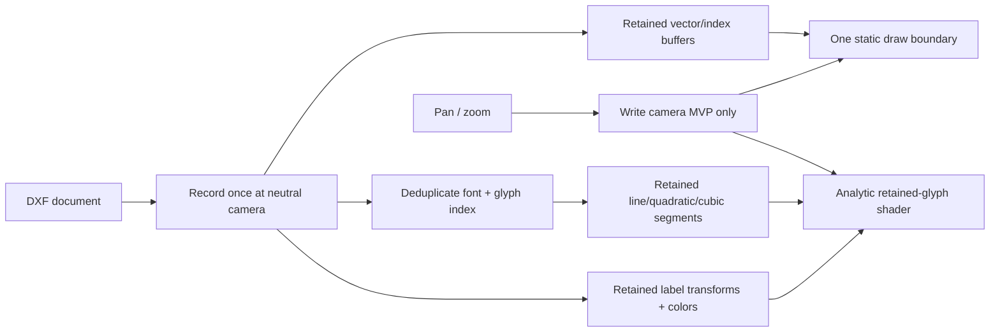

The retained lifetime and invalidation contract are explicit:

- Loading a different document or unloading the control disposes the old GPU buffers.
- Disposal publishes the buffer's terminal state before releasing WebGPU handles and invalidates every compiled scene on the same `WgpuContext`. A static draw holds an allocation-free render lease until command encoding finishes; concurrent disposal defers resource release, and recompilation removes any already-disposed external buffer. This prevents a cached frame from passing a released vertex buffer to native WebGPU during document replacement, page unload, or resize.
- Document identity, active layout, active-layer set, entity-flattening mode, viewport size, and backend-mode changes rebuild the static buffer.
- Pan and zoom never invalidate retained content. Resize rebuilds because the neutral screen-space recording bounds changed.
- Static compilation disables entity LOD and size culling. Geometry that is tiny at the initial fit remains present at deep zoom, including lines, circles, arcs, ellipses, polylines, splines, hatches, blocks, dimensions, and extension-backed entities.
- Command caching is not stacked on the static buffer, so there is no duplicate `GpuPicture`, duplicated command tree, or second resource lifetime.

#### Retained glyph geometry and maximum-quality zoom

Ordinary UI text still benefits from `GlyphAtlas`, but a fixed bitmap is the wrong representation for an unbounded CAD camera. Static DXF compilation takes the already-shaped glyph indices and stores each distinct `(TtfFont, glyphIndex)` outline once. Repeated characters add only `RetainedGlyphInstance` records containing the em transform, position, color, record index, coverage gamma, and rendering mode. The temporary CPU builder arrays become collectible after upload; the static buffer retains only counts and GPU resources.

The retained glyph shader reads compact placements from a read-only GPU storage buffer by `instance_index`, transforms one bounding quad per instance, and evaluates the original line, quadratic, and cubic contours in glyph-local coordinates. This storage-backed instance path is shared by native WebGPU and `navigator.gpu` and avoids backend-sensitive matrix vertex attributes. Non-zero/even-odd winding stays analytic and uses direction-aware half-open curve intervals. Grayscale coverage derives a one-device-pixel antialiasing ramp from the nearest contour; the fill boundary itself is never flattened or scaled from a texture. Quadratic and cubic chord samples are used only for the bounded edge-distance estimate (8 and 12 subdivisions respectively), while aliased text uses exact center winding. Solid outline text therefore remains sharp at arbitrary camera scales without an atlas-quality window or zoom-time reconstruction. Color/bitmap glyphs and non-solid paint keep their existing correctness fallbacks.

For `G` distinct glyphs, `S` total analytic segments, and `I` placed glyphs, retained storage is `O(G + S + I)`. Static compilation is `O(S + I)`. A camera frame performs one uniform write plus retained draw submission; it performs zero work proportional to the DXF entity count on the CPU. The fragment shader costs `O(P*Sg + E*Sg*K)` for `P` glyph-quad fragments, edge-band fragments `E`, segments `Sg` in the referenced glyph, and fixed edge-distance bound `K`. Far interior and exterior fragments avoid curve-distance work.

Run the optional representative-file regression from the repository root:

```bash
PROGPU_DXF_BENCHMARK_FILE=/absolute/path/to/large.dxf \
PROGPU_DXF_BENCHMARK_SCREENSHOT=/absolute/path/output.png \
dotnet test src/ProGPU.Tests.Headless/ProGPU.Tests.Headless.csproj \
  -c Release \
  --filter FullyQualifiedName~Benchmark_DxfCanvasControl_ExternalLargeDrawingRetainsGeometryWhileZooming
```

The benchmark performs 24 zoom frames and requires exactly one document recording, one static-buffer compilation, zero text recompilations, an average below 8.33 ms, and a p95 below 8.33 ms (at least 120 FPS). On the supplied 1600x1000 `floorplan.dxf`, warmed storage-instance runs measured about 4.0-4.3 ms average, 6.8 ms p95, and no camera-frame resource churn. The optional screenshot preserves the final frame for pixel inspection.

---

### 17. Batched Uniform Storage (Glyph & Path Atlases)

To eliminate one temporary GPU buffer per rasterized item, `GlyphAtlas` uses a fixed aligned ring while `PathAtlas` packs each pending batch into shared uniform, record, and segment buffers:
* **Single Bulk Pre-allocation**: Allocates a `256KB` glyph uniform `GpuBuffer` once at startup. At WebGPU's 256-byte binding alignment this stores 1,024 dispatch records. Path batches use shared packed storage/record/segment uploads sized to their pending work rather than one buffer per path.
* **256-Byte Alignment Compliance**: Follows the WebGPU standard (`minUniformBufferOffsetAlignment` boundary constraint of 256 bytes) by rounding up structural uniform offsets with a fast bitwise operation:
  $$\text{alignedSize} = (\text{SizeOf<Uniforms>} + 255) \& \sim 255$$
* **Fast Queue Copy-on-Write**: Inside glyph batch rasterization, parameters are written directly to the pre-allocated ring buffer at the current `_ringOffset` using `QueueWriteBuffer`, avoiding one buffer allocation per glyph:
  ```csharp
  _context.Wgpu.QueueWriteBuffer(_context.Queue, _uniformRingBuffer.BufferPtr, _ringOffset, &uniforms, (uint)Marshal.SizeOf<GlyphUniforms>());
  ```
* **Binding Slice Offsets**: Dynamic bind groups point to exact ring slices using `Offset = _ringOffset` and `Size = Marshal.SizeOf<Uniforms>()`. The batch is submitted before the next aligned slice would wrap, then continues from offset zero in a new encoder. Normal scenes still require one submission and the hot loop creates no temporary uniform buffers.
* **Generation-Tracked Reuse**: `GlyphAtlas.Generation` changes only on an explicit clear, and `PathAtlas.Generation` changes on clear or repack. The compiled-scene cache records both values so it never reuses UVs after atlas contents move. Glyph capacity exhaustion preserves coordinates and therefore does not increment the generation.
* **Demand-Driven Path Capacity Recovery**: Advancing a frame never treats render-target dimensions as future path dimensions and never clears valid PathAtlas entries speculatively. A recoverable allocation failure aborts only CPU scene compilation, clears the atlas once, increments `Generation`, and retries the same onscreen or offscreen frame from the retained scene. Existing UVs are never moved underneath submitted draw calls, and one-shot surfaces do not lose paths while waiting for another frame. Normal frame advancement is O(1), stable scenes keep their atlas and compiled-scene hits indefinitely, and rare recovery is O(C + A + P) for C retained commands recompiled, atlas clear area A, and rerasterized covered pixels P. A frame whose live path set cannot fit after the reset fails explicitly instead of looping or silently dropping geometry.

### Optional wavefront vector engine

`Compositor.VectorEngine` can select an experimental GPU wavefront path alongside the default atlas renderer. The wavefront engine flattens line, quadratic, and cubic segments on the GPU, bins instances into 16x16 screen cells, traverses per-shape BVHs, and shades queued pixels into the compositor target. Text uses the normal `TextLayout` glyph positions before submitting glyph outlines, so shaping and fallback decisions remain shared with the atlas path.

The engine is created only after `Wavefront` is selected. Its buffers and one render-target-sized intermediate texture are then reused and resized on demand; the default `Atlas` path retains none of those resources. For C curves with S subdivisions, I instances, P covered pixels, and L primitives per shape, curve expansion is O(C*S), binning is O(I), traversal is O(P*log L), and storage is O(C*S + I + P) plus bounded grid-cell indices. The WGSL source is a documented build-embedded resource, and the final single-sample resolve preserves the compositor's physical viewport and target format.

---

### 18. Double-Buffered Geometry Swapchains (DxfStaticBuffer)

Updating dense vector meshes and text quads during snapped zoom events can cause severe CPU-GPU hardware execution stalls. If the CPU disposes and recreates vertex/index buffers while the GPU command queue is actively reading from them, the graphics driver is forced to block CPU execution to synchronize hardware lifecycles.

To prevent these stalls and achieve perfectly fluid rendering, we implemented a **Double-Buffering Swapchain** pattern:
* **Asynchronous Back-Buffering**: Maintains dual buffer sets in `DxfStaticBuffer`:
  - Front-Buffers (`TextVertexBuffer`, `TextIndexBuffer`, `TextIndexCount`) currently being drawn by the compositor.
  - Back-Buffers (`_textVertexBufferBack`, `_textIndexBufferBack`, `_textIndexCountBack`) dedicated to accommodating the next camera layout recalculation.
* **Non-Blocking Dynamic Copy**: When `UpdateTextBuffer` is invoked during snapped zooms, it resizes and writes to the back-buffers asynchronously.
* **Zero-Allocation Swapping**: Swaps the front and back buffer references instantly using cheap variable re-assignment on the CPU:
  ```csharp
  var tempVertexBuffer = TextVertexBuffer;
  TextVertexBuffer = _textVertexBufferBack;
  _textVertexBufferBack = tempVertexBuffer;
  ```
* **Static Bind-Group Stability**: Because vertex and index buffer mappings are bound directly via render encoder draw commands rather than static composition bind groups, swapping front/back buffers bypasses bind-group recreation or layout invalidations entirely, ensuring **stutter-free, instant zoom actions**.

---

### 19. Snapped Blur Radii & Stable Effect Pipelines

Offscreen Gaussian blur and drop shadow dispatches are highly sensitive to parameter fluctuations during keyframe animations or hover transitions. Smooth float radius adjustments (e.g. transitioning from `1.0f` to `3.0f`) dynamically modify the computed iteration count:
$$\text{iterations} = \text{Clamp}(\text{Round}(\text{radius} / 2.5), 1, 8)$$
This causes the rendering loop to alter command-buffer layouts and recreate dynamic bind groups frame-by-frame, creating noticeable micro-stutters.

To stabilize effect execution, we implemented a **Snapped Radii Pipeline**:
* **Discrete Increments**: Symmetrically snaps incoming `radius` and `blurRadius` parameters to discrete `0.5f` pixel boundaries at the entry points of `ApplyGaussianBlur` and `ApplyDropShadow`:
  ```csharp
  float snappedRadius = MathF.Round(radius * 2f) / 2f;
  ```
* **Pipeline and Bind-Group Lock**: Snapping ensures that the computed iteration count remains perfectly locked and stable during intermediate keyframes. WGSL shader binding entries, textures, and command layouts remain identical across frame transitions, delivering extremely fluid hover animations and eliminating transient render delays.

---


## Module & Project Architecture Breakdown

The ProGPU solution is partitioned into modular, highly specialized C# projects. Each project governs a specific layer of the UI, vector, or graphics compilation loops:

| Project | Assembly Name | Core Architectural Responsibility | Key Components & Classes |
| :--- | :--- | :--- | :--- |
| **`ProGPU.Backend`** | `ProGPU.Backend.dll` | Low-level hardware infrastructure and WebGPU swapchain orchestration. | `WgpuContext`, `Window`, `Shaders`, `RenderPipelineCache` |
| **`ProGPU.Compute`** | `ProGPU.Compute.dll` | Orchestration of WebGPU GPGPU compute pipelines and parallel filter dispatches. | `ComputeAccelerator`, `ComputeShaders` |
| **`ProGPU.Vector`** | `ProGPU.Vector.dll` | Mathematical primitives, Bezier models, path segment parsing, and atlas mapping. | `PathGeometry`, `PathFigure`, `GpuPathSegment`, `PathAtlas` |
| **`ProGPU.Text`** | `ProGPU.Text.dll` | TrueType parsing, retained glyph identity, word wrapping, line layout, and generation-tracked glyph atlas storage. | `TtfFont`, `GlyphAtlas`, `TextLayout`, `TextRunGlyph` |
| **`ProGPU.Scene`** | `ProGPU.Scene.dll` | Retained visual tree, compiled-scene validation, ordered draw-list/GPU-buffer compilation, optional GPU hit testing, and effects. | `Compositor`, `CompositorOptions`, `CompositorMetrics`, `ContainerVisual`, `DrawingVisual` |
| **`ProGPU.Layout`** | `ProGPU.Layout.dll` | XAML-compatible sizing negotiation lifecycle (`Measure` / `Arrange`) and layout panels. | `LayoutNode`, `StackPanel`, `GridPanel`, `CanvasPanel` |
| **`ProGPU.WinUI`** | `ProGPU.WinUI.dll` | Interactive controls, CPU input/hit testing, frame-phase instrumentation, and command-cached rich documents. | `Window`, `WindowFrameMetrics`, `RichTextBlock`, `ScrollViewer`, `SplitView` |
| **`ProGPU.Virtualization`** | `ProGPU.Virtualization.dll` | Dynamic scrolling viewport orchestration and UI virtualization controllers. | `VirtualizingPanel`, `ViewportInfo` |
| **`ProGPU.Samples`** | `ProGPU.Samples.dll` | Showcase bootstrap, bounded UI scheduling, animation drivers, diagnostics, and repeatable stress/performance workloads. | `MainWindowController`, `SamplePerformanceBenchmark`, `LolsPage`, `UIThread` |

---

## WebGPU WGSL Shader Specifications & Implementations

ProGPU routes all graphics and compute tasks directly to the GPU using specialized WGSL (WebGPU Shading Language) shaders. The following sections detail their purpose, execution pipelines, and exact implementations.

### 1. VectorShader (Rasterization Graphics Pipeline)
- **Role**: Primary graphics pipeline shader for standard UI rendering. Responsible for rasterizing vector shapes (rectangles, ellipses, rounded rectangles) and evaluating Bezier curves and elliptical arcs on the GPU.
- **Why It is Used**: Avoids uploading dense pre-tessellated mesh structures. Instead, it utilizes cheap mathematical Signed Distance Fields (SDFs) and GPU vertex expansion to draw vector primitives with zero CPU overhead.
- **Implementation Mechanics**:
  - **GPU Stroke Expansion & Miter Scaling (`sType == 3u`)**: Expands lines dynamically in the vertex shader. Computes normal vectors ($miterN$) at segment junctions, scales them by $1/\cos(\theta)$ ($miterScale$), and offsets vertices to form precise, variable-thickness miter joints. Passes the signed pixel distance from the center line to the fragment shader via `gridIndex` for zero-cost edge anti-aliasing.
  - **Dynamic Bezier Evaluation (`sType == 5u & 6u`)**: Replaces CPU Bezier flattening. For Quadratics and Cubics, the vertex shader interpolates coordinates directly based on the thread's `vertexIndex` and parametric factor $t \in [0, 1]$, calculating curve positions and tangents to offset vertices outward along normal vectors on the fly, storing signed pixel distances in `gridIndex`.
  - **Dynamic Arc Evaluation (`sType == 11u`)**: Replaces CPU arc flattening for valid path strokes. The compositor sends the transformed ellipse center plus two axis vectors, and the vertex shader evaluates arc positions and tangents parametrically before stroke expansion.
  - **Analytical SDF Fragment Evaluation (`sType < 3u`)**: Computes Signed Distance Fields for Rectangles, Ellipses, and Rounded Rectangles. Anti-aliases boundaries dynamically using screen-space partial derivatives:
    $$\text{fw} = \max(\text{fwidth}(d), 0.0001)$$
    $$\alpha = 1.0 - \text{smoothstep}(-0.5 \cdot \text{fw}, 0.5 \cdot \text{fw}, d)$$
  - **Pixel-Distance Stroke Anti-Aliasing (`sType == 3u \|\| 5u \|\| 6u \|\| 11u`)**: Resolves aliasing for lines, curves, and arcs by evaluating screen-space smoothstep transitions using the interpolated `gridIndex` pixel distance to the stroke boundary:
    $$d_{\text{shape}} = \text{abs}(\text{gridIndex}) - \text{strokeThickness} \cdot 0.5$$
    $$\alpha = 1.0 - \text{smoothstep}(-0.5, 0.5, d_{\text{shape}})$$
  - **Gradient Interpolation**: Evaluates Linear (`brushType == 1u`) and Radial (`brushType == 2u`) gradients dynamically for up to 4 stop colors by calculating projection coordinates and interpolating between bounds using stop offsets.
  - **Batched vertex meshes (`sType == 18u`)**: Interpolates premultiplied vertex colors across triangle lists, strips, and fans, then combines that color with the evaluated paint brush using the requested Skia blend mode. One mesh contributes one retained command and one contiguous vector index range rather than one command per triangle.

### 2. TextureShader (Image, lattice, and sampling pipeline)
- **Role**: Draws ordinary image quads, batched lattice/nine-patch cells, and transformed sprite atlases through one indexed texture pipeline.
- **Why It is Used**: Preserves image Z-order while keeping each retained image, lattice, or atlas operation to one GPU draw, regardless of patch or sprite count.
- **Implementation Mechanics**:
  - Normal cells interpolate source UVs and use nearest, linear, mipmapped, or a bounded 4x4 Mitchell-Netravali cubic sample footprint.
  - Lattice fixed-color cells carry a flat `patchKind` discriminator and return their vertex RGBA directly, performing no image sample. Separate straight and premultiplied encodings preserve blend correctness for both texture alpha modes.
  - Atlas cells carry a flat color-blend mode and paint-opacity value. Sampled sprite color is the source and premultiplied per-sprite color is the destination; bounded Porter-Duff, separable, and non-separable functions match Skia's atlas blend ordering.
  - Every fragment samples the active opacity mask once. Premultiplied image and fixed-color paths scale RGB with coverage; straight-alpha paths retain straight RGB and scale alpha.
  - CPU layout and vertex generation are `O(C)` for C visible cells, fragment work is `O(1)`, and one indexed draw stores four vertices and six indices per cell.

### 3. TextShader (SDF Glyph Render Pipeline)
- **Role**: Specialized graphics shader for high-speed, sharp text display.
- **Why It is Used**: Traditional text rasterization blurs heavily under scaling. The TextShader samples high-precision SDF textures and applies dilation offsets and power-based sharpness filters to ensure text remains crisp at any display size or zoom level.
- **Implementation Mechanics**:
  - Samples the single-channel glyph atlas: `let alpha = textureSample(atlasTexture, atlasSampler, input.texCoord).r;`
  - Applies a dilation scale based on the requested stroke thickness: `let dilated = clamp(alpha * input.strokeThickness, 0.0, 1.0);`
  - Filters sharpness using a power curve driven by the corner radius: `let finalAlpha = pow(dilated, input.cornerRadius);`

### 4. GlyphRasterizerShader (GPGPU Analytical Glyph Rasterizer)
- **Role**: WebGPU compute shader tasked with pre-rasterizing vector glyph outlines into the glyph atlas texture.
- **Why It is Used**: Bypasses slow CPU-based glyph rasterizers entirely, using parallel GPU threads to rasterize outlines directly on the GPU.
- **Implementation Mechanics**:
  - Operates on a $16 \times 16$ thread group.
  - Calculates intersections using a 16x supersampled (SSAA) analytical winding-number raycaster.
  - Solves quadratic equations directly inside the WGSL shader (`solve_quadratic`) to evaluate Bezier curve boundaries, updating winding directions according to the curve's vertical tangent derivative.
  - Writes the calculated coverage mask directly to the storage texture: `textureStore(atlasTexture, writeCoord, vec4<f32>(coverage, 0.0, 0.0, 0.0));`

### 5. PathRasterizerShader (GPGPU Analytical Vector Path Rasterizer)
- **Role**: Advanced WebGPU compute shader that computes analytical non-zero winding fills for arbitrary paths.
- **Why It is Used**: Bypasses CPU segment flattening and triangulation completely, allowing the GPU to raycast complex Bezier geometry directly.
- **Implementation Mechanics**:
  - Computes intersections of horizontal rays with Line, Quadratic Bezier, and Cubic Bezier segments.
  - Features an analytical Cardano's formula solver (`solve_cubic` inside WGSL) to evaluate cubic Bezier roots:
    $$p = b - \frac{a^2}{3}, \quad q = c - \frac{ab}{3} + \frac{2a^3}{27}, \quad D = \frac{q^2}{4} + \frac{p^3}{27}$$
    If $D \leq 0$, it extracts up to 3 real roots using trigonometric cosine angles, updating the winding number according to the tangent derivative $P'_y(t) = 3 a t^2 + 2 b t + c$.
  - Executes 4-point supersampling (SSAA) using subpixel sampling coordinate offsets (`+0.25`, `+0.75`) in local space (`fp2`), achieving hardware-accurate anti-aliased edge coverage.

### 6. GaussianBlur (Horizontal & Vertical Compute Filters)
- **Role**: Parallel compute shaders for high-performance backdrop and glass blurs.
- **Why It is Used**: Bypasses slow pixel shader convolution passes by executing parallel thread blocks directly on texture buffers.
- **Implementation Mechanics**:
  - Operates in two consecutive passes (Horizontal, then Vertical) to split rendering complexity from $O(K^2)$ to $O(K)$ instructions per pixel.
  - Executes an unrolled 5-tap Gaussian kernel using hardcoded weights to avoid memory fetch latency:
    $$\text{color} = 0.0625 \cdot T[-2] + 0.25 \cdot T[-1] + 0.375 \cdot T[0] + 0.25 \cdot T[1] + 0.0625 \cdot T[2]$$
  - Clamps texture coordinate bounds inside `textureLoad` to eliminate edge bleed artifacts.

### 7. DropShadow (Ambient Shadow & Neon Glow Compute Filter)
- **Role**: WebGPU compute shader calculating soft drop shadows and glowing neon halos for layout elements.
- **Why It is Used**: Evaluates dynamic blurring and translation offsets over element boundaries in a single dispatch pass.
- **Implementation Mechanics**:
  - Operates on a $16 \times 16$ thread block.
  - Takes a `Params` uniform block specifying translating `offset`, shadow `color`, and `blurRadius`.
  - Loops over a sliding window of size `[-blurRadius, blurRadius]`.
  - Extracts the source offscreen texture's alpha channel, averages the coverage, and outputs the shifted, blurred, and color-multiplied mask back to the destination buffer:
    $$\text{shadowColor} = \vec{C}_{\text{params}} \cdot (A_{\text{sum}} / \text{count})$$

---

## Development & Diagnostic Tools

ProGPU includes rendering diagnostics and a repeatable in-process frame benchmark:

### 1. TrueType Font Outline Diagnostic Tool (`TtfDiag`)
Located in `tools/TtfDiag/`, this is a generic console tool designed to inspect outline structures, endpoint coordinates, and control points of TrueType fonts. It is especially useful for diagnosing text rendering quality, drop-out artifacts, or glyph parsing inconsistencies.

* **Usage**:
  ```bash
  # Run using the system's Arial font (supplemental) fallback to inspect specific glyphs (e.g. 'G' and 'g')
  dotnet run --project tools/TtfDiag -- Arial Gg

  # Run with an absolute path to a custom font and custom character sequence
  dotnet run --project tools/TtfDiag -- /System/Library/Fonts/Supplemental/Georgia.ttf ABC
  ```
* **Output**: Dumps the exact TrueType outline geometry, closed/filled figure status, segment types (Lines/Quadratic Beziers), and precise coordinates using standard invariant decimal formatting.

### 2. DXF Vector CAD Diagnostic Tool (`DxfDiag`)
Located in `tools/DxfDiag/`, this is a standalone command-line utility to inspect DXF vector files. It lists all available layouts and layers, prints active layout geometric bounds, recursive block hierarchies, nested insert attributes (tags/values), and detects coordinate outliers exceeding absolute limits ($> 1,000,000$). The complete diagnostic trace is saved to `outliers.txt` in the local directory.

* **Usage**:
  ```bash
  # Run on a target DXF drawing file to inspect the default active space layout
  dotnet run --project tools/DxfDiag -- <path-to-dxf-file>

  # Run on a target DXF drawing file and explicitly target a specific layout space (e.g. 'A0')
  dotnet run --project tools/DxfDiag -- <path-to-dxf-file> --layout A0
  ```
* **Output**: Generates a detailed audit of entity counts, viewport settings, block trees, and coordinates, saving the report to `outliers.txt` and logging a summary to the console.

### 3. Sample Frame Benchmark

`SamplePerformanceBenchmark` is disabled during normal sample use and activates only when `PROGPU_SAMPLE_BENCHMARK_PAGE` is set. It selects the requested page, applies the requested VSync mode, warms the renderer, measures a fixed frame count, prints one `[SampleBenchmark] RESULT` line, and closes the app.

The result separates host layout/animation/surface phases from compositor compile/upload/render phases and includes allocated bytes per frame, cache hits and miss reason, draw/vertex counts, and LOL/s workload counters. Use it for before/after comparisons on the same machine, configuration, window state, and page. Do not compare a VSync-limited result with an uncapped run.

---

## Platform Integration & Host Control Embedding (Avalonia & Uno Platform)

ProGPU is designed to act as an embedded high-performance graphics substrate inside standard host XAML frameworks. We provide native integration packages for both **Avalonia** (`ProGPU.Avalonia`) and **Uno Platform** (`ProGPU.Uno`), allowing developers to overlay low-allocation WebGPU rendering canvases directly inside standard desktop applications.

### 1. Hybrid Rendering Architecture

The integration layer hosts a headless, offscreen `WgpuContext` and `Compositor` instance inside a custom control subclass (`Control` in Avalonia, `ContentControl` in Uno). WebGPU renders all visual tree and CAD vectors offscreen, which are then blitted directly to the host's screen.

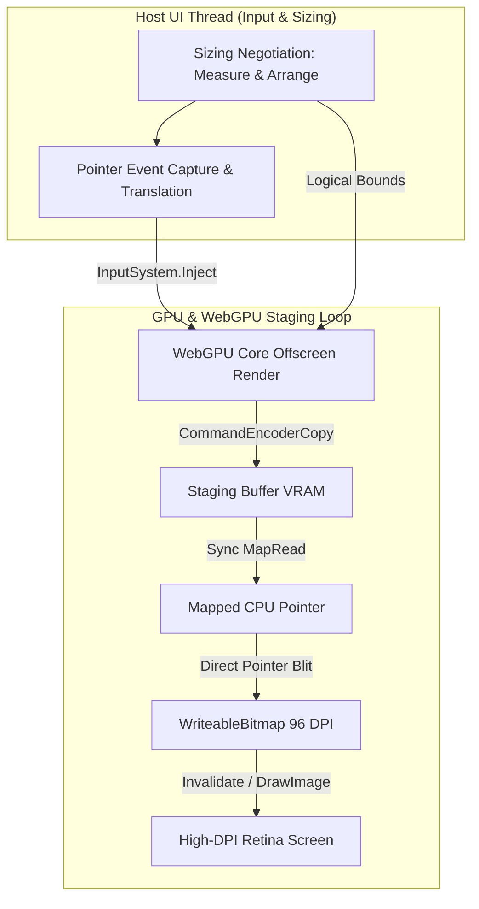

---

### 2. High-Performance Direct Bitmap Blitting Pipeline

Due to standard platform-agnostic FFI limitations in `wgpu-native`, raw `WGPUTexture` pointers cannot be shared directly with the compositor's graphics context (Metal/D3D) as `IOSurfaceRef` or `id<MTLTexture>` handles without writing custom native Rust/C++ bridging wrappers. 

To bypass these FFI opaque struct constraints and deliver **100% stable, platform-independent rendering**, ProGPU implements a highly optimized **Direct Bitmap Blitting pipeline**:

*   **Aligned GPU Staging Buffers**: WebGPU allocates a staging buffer backed by `BufferUsage.MapRead | BufferUsage.CopyDst`. The row pitch (`BytesPerRow`) is aligned to the nearest **256 bytes** per WebGPU specifications to satisfy FFI layout requirements:
    $$\text{BytesPerRow} = (\text{width} \cdot \text{bytesPerPixel} + 255) \ \& \ \sim 255$$
*   **Synchronous MapRead Polling**: Each frame, a command encoder executes `CopyTextureToBuffer` from the offscreen target to the staging buffer. The buffer is mapped via `BufferMapAsync`, and the UI thread polls `wgpuDevicePoll` in a light spin loop until mapping completes.
*   **Direct Row Pointer Blitting**: Once mapped, the raw VRAM memory address is extracted. The control performs a high-speed pointer-based copy utilizing native **`System.Buffer.MemoryCopy`** straight into the locked buffer address of the host's high-DPI `WriteableBitmap`:
    ```csharp
    using (var locked = _writeableBitmap.Lock())
    {
        byte* srcBytes = (byte*)mappedPtr;
        byte* dstBytes = (byte*)locked.Address;
        uint rowBytes = _renderWidth * bytesPerPixel;
        
        for (uint y = 0; y < _renderHeight; y++)
        {
            byte* srcRow = srcBytes + (y * _bytesPerRow);
            byte* dstRow = dstBytes + (y * (uint)locked.RowBytes);
            System.Buffer.MemoryCopy(srcRow, dstRow, rowBytes, rowBytes);
        }
    }
    ```
    This row-by-row blitting executes in microseconds on the CPU, achieving near-zero visual overhead and bypassing bilinear filtering blur.

---

### 3. High-DPI Retina Calibration & Anti-Double-Scaling

On macOS Retina displays (e.g. `DpiScale = 2.0`), standard platform-specific graphics renderers often apply the display's scaling factor twice when drawing a high-DPI bitmap, blowing up the layout and creating blurry graphics.

ProGPU resolves this double-scaling bug through strict physical-to-logical coordination:
*   **96 DPI Isolation**: The host `WriteableBitmap` is instantiated at a constant **96 DPI** (`new Vector(96, 96)`), making its logical size match its physical size.
*   **Logical-Bounds Offscreen Rendering**: Viewport dimensions passed to `Compositor.RenderOffscreen` are strictly mapped in **logical coordinates**, while the internal WebGPU pipeline multiplies them by `DpiScale` to align the physical viewport.
*   **Clean Down-Scaling**: During the draw pass, the physical staging bitmap is scaled down into the host control's logical bounds using a standard 1-to-1 stretch layout (`Stretch.Fill` in Uno, `context.DrawImage` in Avalonia). The physical pixels map precisely 1:1 with screen hardware coordinates, yielding absolute razor-sharp text and graphics.

---

### 4. Symmetrical Input Routing & Event Translation

The integration libraries bridge the event-handling loop symmetrically:
*   **Coordinate Translation**: Pointer event handlers (`OnPointerMoved`, `OnPointerPressed`, etc.) intercept native positions, translate them into logical `Vector2` boundaries, and route them to ProGPU's input engine:
    ```csharp
    InputSystem.InjectMouseMove(new Vector2((float)pos.X, (float)pos.Y));
    ```
*   **Input State Invalidation**: Input events mark the active WinUI input state dirty, forcing immediate layouts hit-testing and scheduling dynamic repaint requests to update hover overlays and cursors instantly.

---

### 5. locked High-Refresh Rate VSync Loops (120 FPS+)

To allow embedded graphics and animation benches to run at their physical display limit, standard timer loops are replaced by self-scheduling graphics dispatchers:
*   **Avalonia**: Hooks directly into the system's VSync loop using:
    ```csharp
    TopLevel.RequestAnimationFrame(OnAnimationTick);
    ```
    This self-scheduling tick fires callbacks exactly aligned with the physical monitor's refresh rate, unlocking **120 FPS / 144 FPS** rendering without frame tearing.
*   **Uno Platform**: Subscribes directly to `CompositionTarget.Rendering` to drive the WebGPU command submissions and refresh statistics exactly aligned with each compositor pass.


---

## III. Path 2: Zero-Copy Shared Texture Rendering Pipeline

To bypass the overhead of copying pixels from VRAM to CPU staging buffers and back to VRAM (double-copy blitting), ProGPU implements a cutting-edge **Zero-Copy Shared Texture Rendering Pipeline**. This architecture achieves direct GPU-to-GPU memory sharing between the offscreen WebGPU rendering engine and the host UI composition tree.

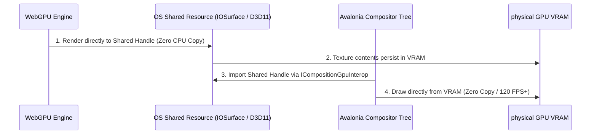

### 1. Architectural Overview & Memory Sharing Mechanics
The Zero-Copy pipeline eliminates host CPU copies entirely by allocating a hardware-backed shared OS memory handle directly in C#, wrapping it inside WebGPU as a render target, and importing it into the host visual tree:

| Operating System | Shared Resource Type | Native Handle Reference | Allocation Strategy |
| :--- | :--- | :--- | :--- |
| **macOS** | Apple `IOSurface` | `IOSurfaceRef` (global handle) | CoreFoundation/AppKit unmanaged dictionary creation |
| **Windows** | Direct3D11 Shared Texture | DXGI `HANDLE` (global shared key) | Standalone `ID3D11Device` with `D3D11_RESOURCE_MISC_SHARED` |

### 2. C# Hardware-Backed Allocation Details

#### A. macOS IOSurface Allocation
CoreFoundation and Objective-C runtime P/Invokes are used to construct the surface configuration plist:
*   `IOSurfaceWidth` & `IOSurfaceHeight`: Target dimensions.
*   `IOSurfaceBytesPerElement`: 4 bytes per pixel.
*   `IOSurfacePixelFormat`: `'BGRA'` (packed 32-bit integer `1111970369`).
*   `IOSurfaceBytesPerRow`: Aligned to 256 bytes.
*   `IOSurfaceAllocSize`: Total byte size.

#### B. Windows D3D11 Shared Handle Allocation
Direct COM VTable indexing is utilized to create resources dynamically:
*   `D3D11CreateDevice`: Instantiates a standalone hardware D3D11 device.
*   `CreateTexture2D`: Allocates the texture with `D3D11_BIND_RENDER_TARGET | D3D11_BIND_SHADER_RESOURCE` bind flags and the `D3D11_RESOURCE_MISC_SHARED` misc flag.
*   `QueryInterface`: Extracts the `IDXGIResource` COM pointer.
*   `GetSharedHandle`: Obtains the global shared handle pointer.

### 3. Integrating with Avalonia's `ICompositionGpuInterop`
The host control hooks into Avalonia's composition engine during initialization:
1.  **Query Interop Interface**:
    ```csharp
    var interop = await compositor.TryGetCompositionGpuInterop();
    ```
2.  **Verify Compatibility**:
    Verify that the compositor's graphics backend supports the active platform's handle type (`IOSurfaceRef` on macOS, `D3D11TextureGlobalSharedHandle` on Windows).
3.  **Import Image**:
    Create a `PlatformHandle` from the allocated raw pointer and import it:
    ```csharp
    var platformHandle = new PlatformHandle(_sharedHandle, _gpuHandleType);
    _importedGpuImage = _gpuInterop.ImportImage(platformHandle, properties);
    ```
4.  **Present via Composition Surface**:
    Create a standard `CompositionSurfaceVisual` and assign its `Surface` to a `CompositionDrawingSurface`. On every tick, simply call:
    ```csharp
    _ = _drawingSurface.UpdateAsync(_importedGpuImage);
    ```
    This triggers a hardware-accelerated present, drawing the shared texture directly in the compositor loop without CPU copying.

### 4. The WebGPU FFI Bridge Boundary (Native Integration)
Standard cross-platform `wgpu-native` bindings do not export helper functions out-of-the-box to wrap arbitrary `IOSurfaceRef` or shared `ID3D11Texture2D` handles into WebGPU texture objects. 
To complete the zero-copy pipeline on the WebGPU side, a small custom native wrapper (written in Rust or C++) must bridge the HAL (Hardware Abstraction Layer) boundary:

```rust
// Custom native Rust crate bridging wgpu-core and OS handles
use wgpu_core::hub::Global;
use wgpu_hal::api::{Metal, Dx12};

#[no_mangle]
pub unsafe extern "C" fn wgpuDeviceCreateTextureFromMacIOSurface(
    device_ptr: *mut libc::c_void,
    iosurface_ptr: *mut libc::c_void,
    width: u32,
    height: u32
) -> *mut libc::c_void {
    let global = &*Global::default();
    // 1. Extract raw device representation
    let device_id = std::mem::transmute(device_ptr);
    
    // 2. Fetch the Metal device and wrap the IOSurface handle via wgpu_hal
    let surface: Metal::Texture = Metal::texture_from_raw(iosurface_ptr as *mut _);
    
    // 3. Register the newly created texture inside the wgpu-core context
    let texture_id = global.device_create_texture_from_hal::<Metal>(
        device_id,
        surface,
        width,
        height
    );
    
    std::mem::transmute(texture_id)
}
```

This bridge allows WebGPU command encoders to bind the texture as a standard `RenderPassColorAttachment`, completing the zero-copy pipeline.

### 5. Asynchronous Double-Buffered Update & Polling Architecture

To achieve VSync-locked rendering (120 FPS+) and completely eliminate UI-thread blocking or frame flickering, ProGPU utilizes a high-performance **Asynchronous Double-Buffered Update Loop** driven by a **Dedicated Background Device Polling Thread**.

This architecture guarantees 0% CPU blocking on the main UI thread and prevents read-write VRAM conflicts between the renderer and the host compositor.

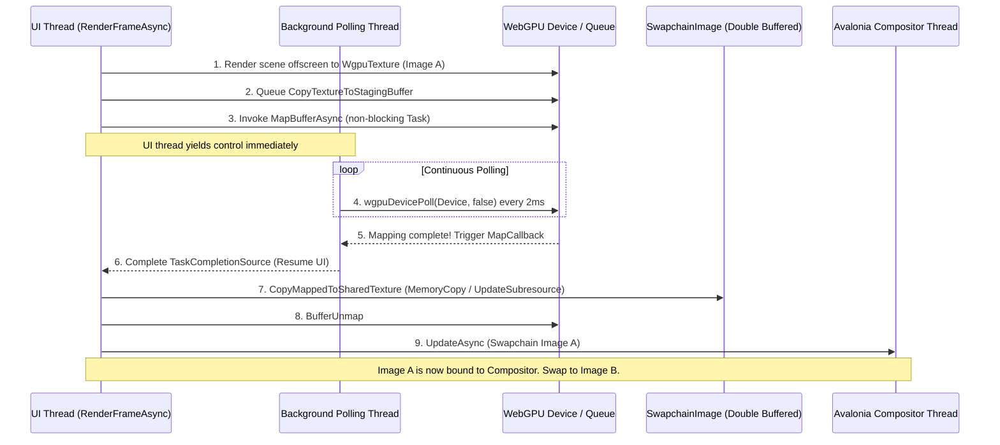

#### A. Double-Buffered Swapchain Image Model (`SwapchainImage`)
A dedicated `SwapchainImage` class encapsulates the graphics assets for a single frame. The host control manages a pool of two swapchain images (`SwapchainImage[2]`):
*   **Compositor Frame Lock**: One image is locked by the Avalonia compositor for current presentation.
*   **Renderer Target**: The other image is being written to asynchronously by the WebGPU rendering loop.
*   **Role Swap**: Once rendering and memory copies are completed, the roles are swapped in an alternating cycle: `_currentWriteImageIndex = (_currentWriteImageIndex + 1) % 2`.

```csharp
private class SwapchainImage : IDisposable
{
    public IntPtr SharedHandle;
    public ICompositionImportedGpuImage? ImportedImage;
    public GpuTexture? WgpuTexture;
    public IntPtr StagingBuffer;
    public uint StagingBufferSize;
    public uint BytesPerRow;

    // Windows Specific Direct3D 11 Resources
    public IntPtr WinD3DDevice;
    public IntPtr WinTexture2D;
}
```

#### B. Continuous Background Device Polling Thread
WebGPU asynchronous operations (such as staging buffer mapping) require the device queue event loop to be polled via `wgpuDevicePoll`.
To keep the UI and Avalonia render threads completely unblocked, ProGPU runs a continuous, low-latency background polling thread that executes `wgpuDevicePoll` every 2 milliseconds:

```csharp
private void StartPolling()
{
    _pollingThread = new Thread(() => {
        while (!_pollingCts.Token.IsCancellationRequested) {
            wgpuDevicePoll(_wgpuContext.Device, false, null);
            Thread.Sleep(2);
        }
    }) { IsBackground = true, Name = "ProGpuDevicePolling" };
    _pollingThread.Start();
}
```

#### C. Asynchronous Non-Blocking Map Pipeline
The buffer mapping callback is wrapped in a standard C# `TaskCompletionSource<bool>`. Calling `await MapBufferAsync(...)` suspends the rendering task without blocking any CPU execution context. The background polling thread completes the mapping asynchronously, waking up the rendering task instantly:

```csharp
private Task MapBufferAsync(IntPtr buffer, MapMode mode, nuint size)
{
    unsafe {
        var tcs = new TaskCompletionSource<bool>(TaskCreationOptions.RunContinuationsAsynchronously);
        var handle = GCHandle.Alloc(tcs);
        var userData = (void*)GCHandle.ToIntPtr(handle);
        _wgpuContext.Wgpu.BufferMapAsync((GpuBuffer*)buffer, mode, 0, size, s_mapCallback, userData);
        return tcs.Task;
    }
}
```

#### D. Safe Pointer-Unsafe Segregation
To comply with the C# compiler constraints that prohibit `await` operations inside `unsafe` contexts, ProGPU segregates low-level pointer copying into two dedicated synchronous `unsafe` helper functions:
1.  **`CopyTextureToStagingBuffer`**: Encodes the offscreen render-target texture copy to the staging buffer and submits the command buffer.
2.  **`CopyMappedToSharedTexture`**: Retrieves the staging buffer's mapped range, locks the native OS texture, copies raw bytes row-by-row, unlocks the texture, and unmaps the buffer.

```csharp
// macOS row-by-row IOSurface memory copy
GpuSharingInterop.IOSurfaceLock(image.SharedHandle, 0, null);
void* destPtr = GpuSharingInterop.IOSurfaceGetBaseAddress(image.SharedHandle);
System.Buffer.MemoryCopy(srcRow, destRow, rowBytes, rowBytes);
GpuSharingInterop.IOSurfaceUnlock(image.SharedHandle, 0, null);

// Windows D3D11 UpdateSubresource call via COM VTable index 49
GpuSharingInterop.COMHelper.CallUpdateSubresource(context, image.WinTexture2D, 0, IntPtr.Zero, mappedPtr, image.BytesPerRow, 0);
```

### 6. Graceful Runtime Fallback
If graphics interop is not supported by the environment (e.g. software rendering, missing drivers, or Linux configurations lacking Vulkan opaque handles), the control gracefully falls back to the **Decoupled Render-Thread Blitting Pipeline** (Phase 2). This ensures 100% functionality and visual parity across all host configurations!
