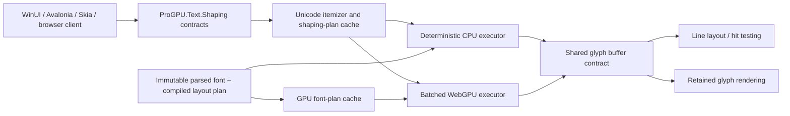

# HarfBuzz OpenType shaping parity plan

## Goal and definition of parity

ProGPU text shaping must produce the same observable OpenType shaping result as
the pinned HarfBuzz `ot` shaper for the same font bytes, face index, variation
coordinates, Unicode input, item context, direction, script, language, feature
ranges, cluster level, and buffer flags.

Parity is exact for:

- glyph identifiers and output order;
- UTF-16 cluster values and cluster monotonicity;
- x/y advances and x/y offsets in font design units;
- glyph safety flags (`unsafe-to-break`, `unsafe-to-concat`, and
  `safe-to-insert-tatweel`);
- default-ignorable, dotted-circle, missing-glyph, and variation-selector
  behavior;
- OpenType feature ordering and lookup application, including variation data.

The target is HarfBuzz's OpenType shaper. AAT, Graphite, CoreText, DirectWrite,
and HarfBuzz's deliberately reduced `fallback` shaper are separate engines and
are classified by the conformance runner instead of being silently counted as
OpenType passes.

The initial reference is HarfBuzz 14.2.1 at commit
`9de7e9d56396654b07649005cd2f4f494b2cdc4b`. The pin contains 85 test
files, 5,147 active shaping cases, and 205 compact fonts. It lives in
`eng/harfbuzz-reference.json`. Updating it requires a reviewed parity report for
both the old and new pins.

## Current baseline

As of 2026-07-20, the implementation is substantially beyond the original
planning baseline:

- `ProGPU.Text.Shaping` is a standalone, rendering-independent contract package
  with immutable requests, typed directions, all four cluster levels, ranged
  features, buffer flags, glyph flags, design-unit results, and a typed
  `IShapingFontFace` boundary;
- generated Unicode 17 data and the managed executor cover normalization,
  grapheme/character clusters, default ignorables, variation selectors,
  direction and vertical metrics, Arabic joining/fallback/stretch, Indic, USE,
  Khmer, Myanmar, Hangul, Thai/Lao, Tibetan, Hebrew, and directional mappings;
- GSUB/GPOS execution includes contextual and nested lookup machinery, ranged
  feature evaluation, GDEF filtering, mark/cursive attachment, legacy kerning,
  variation adjustments, and vertical positioning;
- a pinned differential runner classifies non-OpenType cases and unsupported
  options separately and can exercise CPU, WebGPU, or both backends.

The complete pinned CPU corpus was measured on 2026-07-20 with HarfBuzz 14.2.1:

| Result | Cases |
| --- | ---: |
| Exact OpenType passes | 4,977 |
| Glyph/cluster/position mismatches | 0 |
| Unsupported option cases | 15 |
| Deliberately classified non-OpenType cases | 106 |
| Environment errors (unavailable legacy macOS fonts) | 49 |
| Total | 5,147 |

The 15 unsupported cases are the current actionable corpus boundary: legacy
`dfont` containers (6), optical-size `ptem` (4), glyph extents (2), a
missing-variation-selector policy (1), synthetic slant (1), and synthetic bold
(1). HarfBuzz inclusive feature ranges now translate to ProGPU's half-open
UTF-16 ranges, including negative scalar indices, and preserve/remove-default-
ignorables map to typed buffer flags. The five affected macOS cases are AAT-only
fonts without GSUB and are therefore classified as non-OpenType rather than
unsupported options. The 49 errors are not shaping mismatches: the corpus names
Apple Chancery, Kokonor, Khmer MN, Tamil MN, Thonburi, SFNSDisplay, Zapfino, and
Hiragino fonts that are absent on the test host.

`ShapingRequest` now carries paragraph-local pre/post context without emitting
it, and the managed executor matches all 11 pinned `item-context.tests` cases.
BOT controls leading-mark dotted-circle recovery exactly with respect to
pre-context. Arabic joining propagates unsafe-to-break/concat and optional
tatweel-safety state, including the pinned `unsafe-to-concat.tests` result.
Indic, Khmer, Myanmar, and USE syllables; character-level grapheme interiors;
automatic fractions; Arabic stretch; random alternates; pair/legacy kern,
cursive and mark positioning; and complete matched contextual/chained
GSUB/GPOS ranges now propagate unsafe-to-break dependencies as well. The low-level
`TextLayout` wrapper refuses unsafe dependency and cluster splits because it does
not reshape arbitrary fragments. The shared rich-text/Markdown engine refuses
cluster-interior splits but may wrap at an unsafe dependency boundary because it
reshapes every committed line fragment. Both layout paths pass context across
bidi/font/style items and apply BOT/EOT only at real fragment edges.

`Verify` now checks monotone cluster order, reshapes every fragment separated by
an advertised safe boundary with adjusted BOT/EOT, context, and ranged features,
and requires an exact reconstruction apart from glyph flags. The full pinned
corpus with `--verify` retains 4,977 exact OpenType passes, zero output
mismatches, and zero reconstruction failures; 15 unsupported, 106 non-OpenType,
and 49 missing-system-font classifications remain. The WebGPU
executor now preserves input flags and emits dependency flags for fractions,
Arabic joining/tatweel boundaries, contextual and chained lookups, pair and
legacy kerning, cursive/mark attachment, and fallback mark positioning. Exact
native GPU regression comparisons cover those implemented paths. GPU item
context, character-level grapheme-interior flagging, the remaining specialized
script safety rules, and full-corpus GPU execution remain blocking parity gaps.

The first baseline command is:

```sh
dotnet run --project tools/HarfBuzzParity -- suite \
  --harfbuzz-root /path/to/harfbuzz \
  --verify \
  --report artifacts/harfbuzz-parity.json
```

The report is expected to be red until every OpenType category below reaches
zero mismatches and zero unsupported cases.

## Primary HarfBuzz sources for the remaining boundary work

- [HarfBuzz buffer API](https://harfbuzz.github.io/harfbuzz-hb-buffer.html)
  defines item context, BOT/EOT boundary semantics, verification, and the three
  public glyph-safety flags.
- [HarfBuzz shaping and shape plans](https://harfbuzz.github.io/shaping-and-shape-plans.html)
  defines the boundary between buffer preparation, plan creation, and execution.
- [HarfBuzz OpenType shaping model](https://harfbuzz.github.io/shaping-opentype-features.html)
  defines feature defaults, ordering, and range behavior.
- [Pinned in-house shaping corpus](https://github.com/harfbuzz/harfbuzz/tree/9de7e9d56396654b07649005cd2f4f494b2cdc4b/test/shape/data/in-house)
  is the executable parity specification used for the counts above.
- [Pinned buffer implementation](https://github.com/harfbuzz/harfbuzz/blob/9de7e9d56396654b07649005cd2f4f494b2cdc4b/src/hb-buffer.cc)
  is the source-level reference for context storage, flag verification, and
  serialization behavior.
- [Pinned OpenType shaping implementation](https://github.com/harfbuzz/harfbuzz/blob/9de7e9d56396654b07649005cd2f4f494b2cdc4b/src/hb-ot-shape.cc)
  is the source-level reference for boundary-aware shaping and safety propagation.

## Target package architecture



`ProGPU.Text.Shaping` will be a standalone, AOT-safe package with no rendering,
windowing, native-library, reflection, or file-system dependency. It will own:

- immutable shaping requests, feature ranges, direction, script, language,
  cluster-level, buffer-flag, glyph-flag, glyph-info, and glyph-position types;
- an `IShapingFontFace` table/metric/cmap boundary;
- parsed and validated OpenType layout plans;
- Unicode data generated at build time into compact static tables;
- the CPU reference executor and reusable shaping buffers;
- backend-neutral GPU plan and buffer DTOs.

`ProGPU.Text.Shaping.WebGPU` will reference the standalone package and the
existing WebGPU backend. `ProGPU.Text` will adapt `TtfFont`, font fallback,
layout, and glyph rendering to the standalone contracts. Platform packages
must consume the same shaping API rather than maintaining parallel shapers.

All positions are signed 32-bit font-design units through shaping. Scaling to
logical/device coordinates happens once after shaping. This keeps CPU/GPU
results deterministic and avoids floating-point drift in the parity gate.

## Work breakdown

### 1. Conformance infrastructure

- Parse HarfBuzz in-house `.tests` files and resolve their compact fonts.
- Invoke a pinned `hb-shape` with JSON/numeric output.
- Compare glyphs, clusters, advances, offsets, and requested flags exactly.
- Record unsupported options separately from mismatches; neither is a pass.
- Produce JSON plus a concise Markdown summary grouped by script, feature,
  lookup type, direction, cluster level, and buffer flag.
- Add focused fixtures for malformed UTF-16, long runs, malicious table
  offsets/counts, integer overflow, and out-of-memory bounds.
- Add differential fuzzing that minimizes failing font/input/request tuples.

Acceptance gate: every applicable upstream `--shaper=ot` case is executed. No
case is dropped because the current API cannot represent it.

### 2. Standalone contracts and immutable font model

- Extract SFNT/TTC/WOFF normalization, cmap, metrics, GDEF, GSUB, GPOS, BASE,
  JSTF, variation-store, and feature-variation parsing from rendering types.
- Validate all offsets, counts, recursion depth, and expansion factors before
  creating a plan.
- Keep borrowed font-table memory internally and copy only at public ownership
  boundaries.
- Cache plans by font identity, face, normalized variation coordinates,
  direction, script, language, feature ranges, cluster level, and relevant
  flags.
- Make buffers reusable and pool-backed with explicit maximum glyph expansion.

Acceptance gate: the package builds and tests without WebGPU/native assets,
survives trimming/AOT, and parsing does not initialize a graphics device.

### 3. Unicode buffer preparation and itemization

- Decode UTF-8/UTF-16/UTF-32 with HarfBuzz-compatible replacement and cluster
  semantics.
- Generate Unicode general-category, combining-class, script, script-extension,
  grapheme, joining, Indic/USE syllabic, emoji, variation-selector, mirroring,
  and default-ignorable tables from one pinned Unicode data version.
- Implement normalization/decomposition/recomposition callbacks used by the
  OpenType shaper, including font-aware composition decisions.
- Implement direction/script/language guessing, item context, grapheme cluster
  levels, default-ignorable policies, dotted-circle insertion, and glyph flags.
- Move font fallback after grapheme/shaping-cluster discovery. Select one face
  for the widest valid cluster and never split joiners, combining sequences, or
  emoji ZWJ sequences.

Acceptance gate: Unicode buffer/cluster tests and HarfBuzz normalization,
default-ignorable, emoji-cluster, Hangul, and variation-selector suites pass.

### 4. Script-specific OpenType shaping models

Implement HarfBuzz-compatible feature collection, masks, pauses, reordering,
and cleanup for:

- default/Latin/Greek/Cyrillic and Hebrew;
- Arabic and Arabic-joining scripts, including fallback shaping and `stch`;
- Indic old/new specifications and Sinhala;
- USE, Khmer, Myanmar, Thai/Lao, Tibetan, Hangul, and Javanese;
- emoji behavior that participates in OpenType shaping and cluster safety.

Generated state tables and category maps must be shared by CPU and WGSL paths
to prevent semantic drift.

Acceptance gate: each upstream script file passes before the script is marked
complete in the parity matrix.

### 5. Complete OpenType layout execution

- GSUB 1–8, extension lookups, all contextual/chaining formats, reverse
  chaining, nested lookup application, lookup flags, mark filtering sets, and
  alternate values/ranges.
- GPOS 1–9, device/variation adjustments, pair formats, cursive chains,
  mark-to-base/ligature/mark, contextual positioning, extensions, and vertical
  metrics/origins.
- GDEF glyph classes, attachment classes/lists, ligature carets, mark glyph
  sets, and variation stores.
- Required/default features, script-specific feature order, language-system
  fallback, character variants, random alternates with deterministic seed,
  automatic fractions, legacy `kern`, and horizontal/vertical defaults.
- Exact recursion, lookup-application, cluster-merging, and safety-flag rules.

Acceptance gate: all layout, context, mark, cursive, kern, feature-order,
language-tag, vertical, and variation cases pass with exact integer positions.

### 6. WebGPU execution

GPU work is selected by measured total latency, not shader occupancy alone.
Short or highly serial runs use the CPU executor; long runs and batches use a
cached GPU plan. Both paths consume the same validated plan and must be
bit-identical.

Appropriate compute stages are:

- Unicode-property lookup, initial cluster/category masks, cmap mapping,
  GDEF classification, and initial horizontal/vertical metrics;
- coverage/class matching and independent lookup candidate generation;
- segmented scans for syllable boundaries, attachment propagation, cluster
  merging, and safety flags;
- deterministic conflict resolution followed by prefix-sum compaction/scatter
  for variable-length substitutions;
- parallel pair/anchor/device/variation evaluation, then bounded attachment
  chain resolution;
- final reorder/scatter directly into retained rendering buffers.

CPU-only work is appropriate for one-time untrusted table validation, shaping
plan construction, cache coordination, and workloads below the measured GPU
break-even point. Moving these to shaders would add upload/dispatch/readback
latency without accelerating browser text.

GPU invariants:

- no CPU readback between shaping stages;
- no per-run font-table upload and no per-glyph managed allocation;
- bounded workgroup loops, buffer sizes, recursion replacement, and expansion;
- stable left-to-right lookup conflict resolution matching HarfBuzz;
- one logical module per WGSL file, embedded through `ShaderResource`, with the
  repository's algorithm/time/space complexity header;
- device loss and unsupported-limit paths fall back to the CPU executor without
  changing output;
- a GPU result remains resident through retained glyph rendering when line
  layout/hit testing does not require CPU data.

Acceptance gate: CPU and GPU results match each other and HarfBuzz for the full
OpenType corpus. Browser AOT runs the GPU suite on a real WebGPU adapter.

### 7. Integration and font fallback

- Route WinUI, Avalonia, SkiaSharp compatibility, WPF compatibility, browser,
  and sample text through the shared manager and shaper.
- Preserve glyph indices and shaped positions through retained commands.
- Add bidi paragraph segmentation above the shaping-run API; shaping consumes
  resolved directional runs and does not pretend to be a full paragraph bidi
  engine.
- Make line breaking consume unsafe-break flags and cluster boundaries.
- Keep selection, caret, hit testing, trimming, wrapping, and fallback aligned
  with shaped clusters in LTR, RTL, mixed, and vertical layouts.

Acceptance gate: platform-specific code contains no alternate glyph-mapping or
GSUB/GPOS loop, and mixed-font complex clusters render identically across
desktop and browser.

## Performance and quality gates

Before changing execution, capture baselines for ASCII UI labels, Inter feature
showcase runs, Arabic, Devanagari, Khmer, emoji ZWJ, mixed fallback, long code
editor lines, and a page containing thousands of short labels.

Track:

- cold plan-build time and bytes allocated;
- warm CPU shape latency at 8/32/128/1,024/16,384 scalars;
- warm GPU batch latency including upload/dispatch and any required readback;
- plan/GPU-buffer cache hit rate and retained memory;
- browser first-text latency, steady frame time, and device-memory growth;
- glyph/cluster/position parity and screenshot pixel diffs at multiple DPI
  scales.

Required steady-state properties:

- unchanged retained text performs no shaping and no glyph-count-dependent
  managed allocation;
- warm short-run CPU shaping remains allocation-free with caller-owned buffers;
- GPU batching never makes the representative short-label workload slower;
- text rasterization, 4-way physical-pixel snapping, antialiasing, vector
  fallback phase quantization, and final unsnapped quad placement remain
  unchanged unless a separately reviewed quality test proves improvement;
- no benchmark gain may come from disabling a feature, skipping invalidation,
  reducing cluster fidelity, or lowering raster quality.

## CI gates and completion audit

1. Standalone unit tests and malformed-font tests.
2. Focused GSUB/GPOS lookup-format tests.
3. Script-model and Unicode data tests.
4. Pinned HarfBuzz in-house OpenType conformance on CPU.
5. The same corpus on a native WebGPU adapter.
6. Browser AOT smoke and representative conformance shards.
7. Desktop/headless/browser visual tests for multilingual samples.
8. Benchmark comparison against the checked-in baseline envelope.
9. Trimmed/AOT package build and API-surface audit.

The project is complete only when the report contains zero OpenType mismatches,
zero unsupported OpenType cases, zero crashes/timeouts, CPU/GPU outputs are
identical, all platform tests pass, and the performance/quality gates show no
regression. A green Inter-only suite or a green CPU-only suite is not completion.
