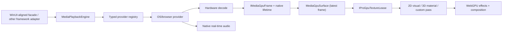
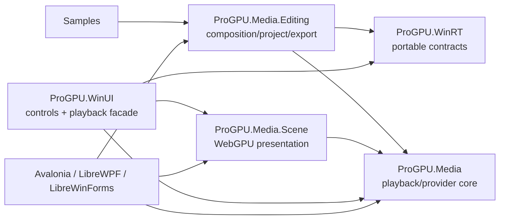

# ProGPU media engine architecture and clean-room research

## Scope

`ProGPU.Media` is the framework-neutral playback and presentation core shared
by WinUI, Avalonia, LibreWPF, LibreWinForms, mobile, and browser hosts. Its
public contracts intentionally do not contain framework controls or
platform-owned media objects. `ProGPU.Media.Editing` is a separate reusable
assembly for non-destructive composition and export; it does not reference
`ProGPU.WinUI` or any control framework. `ProGPU.WinRT` contains the small
platform-neutral WinRT-shaped value, storage, property-set, effect,
encoding-profile, and transcoding contracts shared by the editor and UI
adapters. This separation establishes:

- generation-safe asynchronous source replacement;
- explicit, reflection-free provider and effect registries;
- WinUI-shaped playback state projected through `MediaPlaybackSession`;
- a latest-frame GPU surface with retained texture leases;
- direct recording into any ProGPU 2D visual, with a public surface available
  to 3D materials and custom render extensions;
- explicit transfer-mode and hardware-decode diagnostics.

“Zero-copy” is a capability result, not an unconditional promise. It means the
decoded native allocation is sampled by the presentation GPU without CPU
readback or CPU upload. A provider must report `GpuCopy` or `CpuUpload` when
device, format, protection, or API interoperability forces a fallback.
Export uses a separate typed diagnostic because compressed passthrough,
native GPU surfaces, and native audio buffers have different ownership
semantics. `MediaCompositionExportRegistry.TryGetCapabilities` reports the
selected provider, video/audio path, whether hardware encoding was merely
requested or guaranteed, GPU effect baking, and an explicit limitation.
`IMediaGpuEncoderFrameSink` is the matching provider-side extension point for
effect-baked export. It exposes bounded native encoder targets as WebGPU render
attachments, reports backpressure instead of blocking, and requires each frame
lease to survive through command-buffer submission. Disposal of an incomplete
frame aborts that native slot, preventing stale or partially rendered pixels
from entering the coded stream. This contract is ProGPU-specific because
WinUI exposes composition export rather than a public GPU encoder-surface API.
The shared `GpuTextureBlitter` now provides the encoder path's first fused
post-process operation: one fullscreen triangle applies an affine straight-RGB
transform in the same texture sample/write pass. A typed resolver folds ordered
registered brightness, contrast, saturation, grayscale, sepia, and invert
definitions into that 3x4 transform. Its retained 48-byte uniform buffer is
updated without per-frame managed allocation, so native provider sinks can
reuse the operation without depending on Scene or a particular UI framework.
`GpuTextureClearer` complements it with an O(P)
render-attachment clear using WebGPU
[`loadOp: "clear"`](https://www.w3.org/TR/webgpu/#load-store-ops); it has O(1)
command storage and no upload, mapping, or readback. Windows color clips clear
one reusable shared source texture, then use the same effect pass and tracked
encoder targets as decoded frames.

## Clean-room primary sources

No source implementation from another media engine is copied or translated.
The following specifications and public architecture contracts informed this
design.

### Public API shape

- [Windows `MediaPlayer`](https://learn.microsoft.com/en-us/uwp/api/windows.media.playback.mediaplayer)
  and [MediaPlaybackSession](https://learn.microsoft.com/en-us/uwp/api/windows.media.playback.mediaplaybacksession)
  establish the source/player/session separation, state events, playback
  controls, and effect activation shape.
- [`MediaPlaybackItem.StartTime`](https://learn.microsoft.com/en-us/uwp/api/windows.media.playback.mediaplaybackitem.starttime)
  and
  [`DurationLimit`](https://learn.microsoft.com/en-us/uwp/api/windows.media.playback.mediaplaybackitem.durationlimit)
  establish the item-relative start and maximum-duration playback contract.
  ProGPU keeps providers in absolute source time and performs one typed O(1)
  translation at the engine boundary for updates, seeks, looping, and end
  transitions.
- [`MediaPlaybackList.MoveNext`](https://learn.microsoft.com/en-us/uwp/api/windows.media.playback.mediaplaybacklist.movenext),
  [`MovePrevious`](https://learn.microsoft.com/en-us/uwp/api/windows.media.playback.mediaplaybacklist.moveprevious),
  and
  [`MoveTo`](https://learn.microsoft.com/en-us/uwp/api/windows.media.playback.mediaplaybacklist.moveto)
  establish that navigation returns the resulting `MediaPlaybackItem`.
  ProGPU retains a nullable annotation for the no-item/end-of-list case while
  preserving the official CLR return type.
- [`MediaPlaybackItem.CanSkip`](https://learn.microsoft.com/en-us/uwp/api/windows.media.playback.mediaplaybackitem.canskip)
  establishes that app-requested list navigation must fail while an
  unskippable current item is actively playing. ProGPU tracks attached
  players through weak typed entries, so a list shared by multiple players
  remains blocked while any owner is playing or buffering without retaining
  disposed or abandoned players. Natural end-of-stream advancement bypasses
  this manual-navigation guard.
- [`MediaPlaybackItem.FindFromMediaSource`](https://learn.microsoft.com/en-us/uwp/api/windows.media.playback.mediaplaybackitem.findfrommediasource)
  and Microsoft's
  [media items and playlists guidance](https://learn.microsoft.com/en-us/windows/uwp/audio-video-camera/media-playback-with-mediasource)
  establish a one-to-one `MediaSource`/`MediaPlaybackItem` association. The
  typed source owns its associated item, rejects a second wrapper
  transactionally, and prevents the already-associated raw source from being
  assigned directly to a player. The official
  [`TotalDownloadProgress`](https://learn.microsoft.com/en-us/uwp/api/windows.media.playback.mediaplaybackitem.totaldownloadprogress)
  value is projected from the active provider snapshot only onto the current
  list item, remains in the documented 0–1 range, and starts complete for a
  local file URI.
- [`MediaSource.ExternalTimedMetadataTracks`](https://learn.microsoft.com/en-us/uwp/api/windows.media.core.mediasource.externaltimedmetadatatracks),
  [`TimedMetadataTrack.ActiveCues`](https://learn.microsoft.com/en-us/uwp/api/windows.media.core.timedmetadatatrack.activecues),
  [`CueEntered`](https://learn.microsoft.com/en-us/uwp/api/windows.media.core.timedmetadatatrack.cueentered),
  [`TimedTextCue`](https://learn.microsoft.com/en-us/uwp/api/windows.media.core.timedtextcue),
  [`TimedTextLine`](https://learn.microsoft.com/en-us/uwp/api/windows.media.core.timedtextline),
  and
  [`DataCue`](https://learn.microsoft.com/en-us/uwp/api/windows.media.core.datacue)
  establish caller-owned external tracks, the active-cue view, cue lifecycle
  events, and binary custom metadata. Microsoft's
  [media items, playlists, and tracks guidance](https://learn.microsoft.com/en-us/windows/uwp/audio-video-camera/media-playback-with-mediasource)
  establishes that `Disabled` suppresses cue events while `Hidden`,
  `ApplicationPresented`, and `PlatformPresented` continue scheduling them.
  ProGPU adopts that lifecycle contract without claiming a platform caption
  renderer where none is connected.
- The
  [WHATWG media/text-track model](https://html.spec.whatwg.org/multipage/media.html)
  and the browser
  [`TextTrack.mode`](https://developer.mozilla.org/en-US/docs/Web/API/TextTrack/mode)
  and
  [`cuechange`](https://developer.mozilla.org/en-US/docs/Web/API/TextTrack/cuechange_event)
  contracts establish that `disabled` suppresses cue loading/events,
  `hidden` keeps cues active without native rendering, and `showing` enables
  native presentation. The browser provider maps WinUI `Disabled` to
  `disabled`, both `Hidden` and `ApplicationPresented` to `hidden`, and
  `PlatformPresented` to `showing`. It observes dynamic track membership and
  cue changes, publishes complete typed per-track snapshots, and preserves
  stable managed `TimedTextCue` identity by provider cue ID. Snapshot
  publication and reconciliation are O(C) time and storage for C cues;
  steady playback scheduling remains allocation-free after warmup. This
  clean-room adapter does not parse WebVTT text or duplicate the browser's
  native cue loader.
- [`MediaPlaybackSession.NormalizedSourceRect`](https://learn.microsoft.com/en-us/uwp/api/windows.media.playback.mediaplaybacksession.normalizedsourcerect),
  [`IsMirroring`](https://learn.microsoft.com/en-us/uwp/api/windows.media.playback.mediaplaybacksession.ismirroring),
  [`PlaybackRotation`](https://learn.microsoft.com/en-us/uwp/api/windows.media.playback.mediaplaybacksession.playbackrotation),
  and the
  [`Windows.Media.MediaProperties.MediaRotation`](https://learn.microsoft.com/en-us/uwp/api/windows.media.mediaproperties.mediarotation)
  enum establish normalized pan/zoom, horizontal mirroring, clockwise
  quarter-turn semantics, and the official enum namespace. ProGPU applies
  the inverse presentation mapping once per fragment before RGB or planar
  sampling. The
  [WebGPU coordinate and sampler contract](https://gpuweb.github.io/gpuweb/#coordinate-systems)
  establishes normalized texture coordinates and clamp-to-edge behavior.
- [Windows App SDK `MediaPlayerElement`](https://learn.microsoft.com/en-us/windows/windows-app-sdk/api/winrt/microsoft.ui.xaml.controls.mediaplayerelement)
  and [MediaPlayerPresenter](https://learn.microsoft.com/en-us/windows/windows-app-sdk/api/winrt/microsoft.ui.xaml.controls.mediaplayerpresenter),
  [`MediaPlayerElement.PosterSource`](https://learn.microsoft.com/en-us/windows/windows-app-sdk/api/winrt/microsoft.ui.xaml.controls.mediaplayerelement.postersource),
  [`MediaTransportControls`](https://learn.microsoft.com/en-us/windows/windows-app-sdk/api/winrt/microsoft.ui.xaml.controls.mediatransportcontrols),
  [`AreTransportControlsEnabled`](https://learn.microsoft.com/en-us/windows/windows-app-sdk/api/winrt/microsoft.ui.xaml.controls.mediaplayerelement.aretransportcontrolsenabled),
  and [`ThumbnailRequested`](https://learn.microsoft.com/en-us/windows/windows-app-sdk/api/winrt/microsoft.ui.xaml.controls.mediatransportcontrols.thumbnailrequested)
  establish the lightweight control/presenter split and `Stretch`,
  `IsFullWindow`, source, poster, and transport-control contracts.
- [`Windows.Media.Editing.MediaComposition`](https://learn.microsoft.com/en-us/uwp/api/windows.media.editing.mediacomposition)
  and [`MediaClip`](https://learn.microsoft.com/en-us/uwp/api/windows.media.editing.mediaclip)
  establish ordered clip ownership, non-destructive start/end trimming,
  composition-relative time, cloning, volume, string user-data semantics,
  static project loading, project persistence, embedded-audio selection,
  encoding-property discovery, and the `RenderToFileAsync` overload family.
- [`MediaComposition.GetThumbnailAsync`](https://learn.microsoft.com/en-us/uwp/api/windows.media.editing.mediacomposition.getthumbnailasync)
  and
  [`GetThumbnailsAsync`](https://learn.microsoft.com/en-us/uwp/api/windows.media.editing.mediacomposition.getthumbnailsasync)
  establish composition-relative positions, single/batch asynchronous
  rendering, `VideoFramePrecision`, and the dimension contract: two explicit
  values may alter aspect ratio, while one zero dimension is derived from the
  composition aspect ratio. The returned
  [`Windows.Graphics.Imaging.ImageStream`](https://learn.microsoft.com/en-us/uwp/api/windows.graphics.imaging.imagestream)
  establishes encoded-image content type, random-access cursor, cloning, and
  close/dispose ownership.
- [`EmbeddedAudioTrack`](https://learn.microsoft.com/en-us/uwp/api/windows.media.editing.embeddedaudiotrack)
  establishes the clip-owned embedded-audio metadata object and detached
  `GetAudioEncodingProperties` ownership boundary.
- [`BackgroundAudioTrack`](https://learn.microsoft.com/en-us/uwp/api/windows.media.editing.backgroundaudiotrack),
  including its signed
  [`Delay`](https://learn.microsoft.com/en-us/uwp/api/windows.media.editing.backgroundaudiotrack.delay),
  trim, volume, clone, user-data, and audio-effect collections, establishes
  the independent soundtrack timeline. ProGPU preserves negative delay as a
  source advance and positive delay as a composition insertion offset.
- [`AudioEffectDefinition`](https://learn.microsoft.com/en-us/uwp/api/windows.media.effects.audioeffectdefinition)
  and
  [`VideoEffectDefinition`](https://learn.microsoft.com/en-us/uwp/api/windows.media.effects.videoeffectdefinition)
  establish the activatable class ID plus `IPropertySet` configuration shape.
  The editable project serializer preserves null, string, Boolean, and all
  finite primitive numeric property types with explicit type tags.
- [`MediaOverlay`](https://learn.microsoft.com/en-us/uwp/api/windows.media.editing.mediaoverlay),
  [`MediaOverlayLayer`](https://learn.microsoft.com/en-us/uwp/api/windows.media.editing.mediaoverlaylayer),
  and
  [`VideoCompositorDefinition`](https://learn.microsoft.com/en-us/uwp/api/windows.media.effects.videocompositordefinition)
  establish delayed, positioned, opacity-controlled overlay clips, ordered
  layer/overlay z-order, optional overlay audio, and custom compositor
  configuration.
- [`MediaEncodingProfile`](https://learn.microsoft.com/en-us/uwp/api/windows.media.mediaproperties.mediaencodingprofile),
  [`MediaTrimmingPreference`](https://learn.microsoft.com/en-us/uwp/api/windows.media.editing.mediatrimmingpreference),
  and [`TranscodeFailureReason`](https://learn.microsoft.com/en-us/uwp/api/windows.media.transcoding.transcodefailurereason)
  establish the export profile, exact/fast trim selection, and result shape.

Adopted: WinUI names, enum values, session ownership, event placement, and
control defaults where the semantics apply. Adapted: WinRT async and property
containers use the repository's existing .NET projections. Rejected:
reflection-based activation and Windows-native types in the portable core.

### Native decode and audio

- Windows Media Foundation documents that
  [`MF_SOURCE_READER_D3D_MANAGER`](https://learn.microsoft.com/en-us/windows/win32/medfound/mf-source-reader-d3d-manager)
  lets DXVA-capable decoders allocate video buffers on the supplied D3D
  device. Direct decoder-allocation playback remains planned. The precise
  export lane now pairs the official
  [Source Reader](https://learn.microsoft.com/en-us/windows/win32/medfound/source-reader)
  and [Sink Writer](https://learn.microsoft.com/en-us/windows/win32/medfound/sink-writer).
  Both receive one `IMFDXGIDeviceManager`; the reader's advanced processor
  produces target-sized NV12 samples for identity export and BGRA DXGI
  samples for the affine effect lane. Identity samples go directly to the
  writer. Effect samples receive one D3D11 GPU copy into a three-slot shared
  source ring, one fused WebGPU affine color render into a three-slot
  encoder-target ring, and no ProGPU CPU readback/upload.
  Solid-color clips use a WebGPU render-pass clear on the same bounded source
  ring, so their effect values remain GPU-baked without allocating or
  uploading a full-frame bitmap. Their rational frame clock carries the
  division remainder between frames and therefore has no cumulative NTSC
  rounding drift.
  [`MF_READWRITE_ENABLE_HARDWARE_TRANSFORMS`](https://learn.microsoft.com/en-us/windows/win32/medfound/mf-readwrite-enable-hardware-transforms)
  requests registered hardware transforms, but selection remains a runtime
  codec capability; the exporter reports requested, not guaranteed, and a
  negotiation failure is returned rather than presented as hardware support.
  The AAC lane follows Microsoft's documented
  [AAC encoder](https://learn.microsoft.com/en-us/windows/win32/medfound/aac-encoder)
  PCM input and supported
  44.1/48-kHz, 96/128/160/192-kbit profiles. Output remains a sibling
  temporary MP4 until `IMFSinkWriter::Finalize` succeeds.
  The implemented playback lane follows the official
  [`IMFMediaEngine::OnVideoStreamTick`](https://learn.microsoft.com/en-us/windows/win32/api/mfmediaengine/nf-mfmediaengine-imfmediaengine-onvideostreamtick)
  frame-server contract and
  [`TransferVideoFrame`](https://learn.microsoft.com/en-us/windows/win32/api/mfmediaengine/nf-mfmediaengine-imfmediaengine-transfervideoframe),
  which explicitly blits each ready frame to a DXGI surface. It therefore
  reports `GpuCopy`, never `NativeZeroCopy`.
- Dawn's
  [shared-texture-memory contract](https://dawn.googlesource.com/dawn/%2Bshow/5a54d9e9e498edfcaa73d0d45bfcc8ac931bf240/docs/dawn/features/shared_texture_memory.md)
  requires queue use to be bracketed by `BeginAccess`/`EndAccess`; its typed
  [DXGI descriptor](https://dawn.googlesource.com/dawn/%2B/0979968b84312b7c52521739ef93eb9812f0f3ed/src/dawn/dawn.json)
  exposes keyed-mutex synchronization. ProGPU keeps the D3D11 texture,
  shared HANDLE, keyed mutex, Dawn shared memory, and media-frame owner alive
  as one lease, and returns a ring slot only after Dawn ends access.
  Windows export also follows Microsoft's
  [`IMFDXGIBuffer::GetResource`](https://learn.microsoft.com/en-us/windows/win32/api/mfobjects/nf-mfobjects-imfdxgibuffer-getresource)
  and
  [`MFCreateDXGISurfaceBuffer`](https://learn.microsoft.com/en-us/windows/win32/api/mfapi/nf-mfapi-mfcreatedxgisurfacebuffer)
  contracts to unwrap decoder textures and wrap rendered encoder textures.
  Each encoder target uses
  [`IMFTrackedSample::SetAllocator`](https://learn.microsoft.com/en-us/windows/win32/api/mfidl/nf-mfidl-imftrackedsample-setallocator);
  the AOT-safe callback returns the slot only after every Sink Writer
  reference is released. Dawn's official
  [DXGI shared-memory white-box tests](https://dawn.googlesource.com/dawn/%2B/refs/heads/chromium/7943/src/dawn/tests/white_box/SharedTextureMemoryTests_win.cpp)
  informed the keyed-mutex access sequence. ProGPU adopted explicit access
  scopes and tracked asynchronous reuse, adapted them into separate bounded
  decoder-staging and encoder-target rings, and rejected CPU mapping,
  unbounded per-frame allocations, and device-wide idle waits.
  Color clips have no source audio. ProGPU follows
  [`IMFSinkWriter::SendStreamTick`](https://learn.microsoft.com/en-us/windows/win32/api/mfreadwrite/nf-mfreadwrite-imfsinkwriter-sendstreamtick)
  by reporting the gap at least once per second, and marks the first following
  audio sample with
  [`MFSampleExtension_Discontinuity`](https://learn.microsoft.com/en-us/windows/win32/medfound/mfsampleextension-discontinuity-attribute).
  The encoder-sink contract adopts the same explicit access lifetime and the
  WebGPU
  [canvas/current-texture model](https://www.w3.org/TR/webgpu/#canvas-context),
  but adapts acquisition to a non-blocking codec queue. A provider reports
  `SupportsExplicitPresentationTime` separately because presentation timing is
  a native encoder requirement and is not guaranteed by WebGPU surface
  presentation itself.
  For Android encoder targets, Dawn's authoritative
  [`dawn.json`](https://dawn.googlesource.com/dawn/+/refs/heads/main/src/dawn/dawn.json)
  defines `SharedTextureMemoryAHardwareBuffer`, `SharedFenceSyncFD`, and the
  typed SyncFD export structure. Dawn owns the file descriptor returned by
  `SharedFenceExportInfo` until the end-access state is freed, so ProGPU
  duplicates it first and gives the duplicate an explicit detachable
  lifetime. The MediaCodec bridge can transfer that duplicate to an
  `EGL_SYNC_NATIVE_FENCE_ANDROID` wait without polling the WebGPU device or
  reading pixels back to the CPU. In the reverse direction, Dawn's Vulkan
  implementation duplicates an imported SyncFD. The reusable target lease
  therefore consumes and closes the EGL-owned original immediately after
  `BeginAccess`, while Dawn retains its own fence reference for the queued
  WebGPU wait.
- Media Foundation's
  [`MF_MEDIA_ENGINE_AUDIO_CATEGORY`](https://learn.microsoft.com/en-us/windows/win32/medfound/mf-media-engine-audio-category)
  and
  [`MF_MEDIA_ENGINE_AUDIO_ENDPOINT_ROLE`](https://learn.microsoft.com/en-us/windows/win32/medfound/mf-media-engine-audio-endpoint-role)
  attributes map the portable WinUI-shaped audio category and endpoint role
  into the native renderer when the engine is created.
- [`IMFMediaEngineEx::SetBalance`](https://learn.microsoft.com/en-us/windows/win32/api/mfmediaengine/nf-mfmediaengine-imfmediaengineex-setbalance)
  and
  [`FrameStep`](https://learn.microsoft.com/en-us/windows/win32/api/mfmediaengine/nf-mfmediaengine-imfmediaengineex-framestep)
  define the native WinUI-aligned balance and forward/backward stepping
  operations used by the Windows provider. WinUI's
  [`MediaPlayer.AudioBalance`](https://learn.microsoft.com/en-us/uwp/api/windows.media.playback.mediaplayer.audiobalance)
  defines an inclusive -1 through +1 range with zero as the default, while
  [`AddAudioEffect`](https://learn.microsoft.com/en-us/uwp/api/windows.media.playback.mediaplayer.addaudioeffect)
  establishes the activatable-class ID, optional flag, and `IPropertySet`
  boundary. ProGPU adopts those public contracts and provides registered
  `Gain` and `StereoBalance` graph nodes. An allocation-free
  `MediaAudioStereoLevels` value folds the player's balance and every live
  node into left/right linear levels in O(E) work and O(1) temporary storage
  for E effects. The Windows provider decomposes the result back into one
  common Media Engine volume plus `SetBalance`; gain above unity remains
  diagnosed instead of being silently represented.
  [`InsertAudioEffect`](https://learn.microsoft.com/en-us/windows/win32/api/mfmediaengine/nf-mfmediaengine-imfmediaengineex-insertaudioeffect)
  accepts an `IMFTransform`/`IMFActivate` and applies insertion on the next
  source load; ProGPU therefore does not claim arbitrary live PCM processing
  until its original registered-MFT or Source Reader/WASAPI lane is present.
  Precise export now accepts per-clip 0–2× gain and stereo balance from the
  WinUI editing contract. The Source Reader already produces signed PCM16, so
  ProGPU walks each native sample buffer directly using
  [`IMFSample::GetBufferByIndex`](https://learn.microsoft.com/en-us/windows/win32/api/mfobjects/nf-mfobjects-imfsample-getbufferbyindex)
  and the official
  [`IMFMediaBuffer::Lock`](https://learn.microsoft.com/en-us/windows/win32/api/mfobjects/nf-mfobjects-imfmediabuffer-lock)/
  [`Unlock`](https://learn.microsoft.com/en-us/windows/win32/api/mfobjects/nf-mfobjects-imfmediabuffer-unlock)
  lifetime. Left and right Q15 levels are computed once per native buffer and
  samples are modified in place with O(S) work and O(1) managed storage.
  Interleaved channel phase is carried across native buffer boundaries; mono
  output uses the common peak so balance remains a no-op while gain is
  retained.
  Amplified samples use a deterministic saturating clamp; the 2× bound keeps
  every PCM16 × Q15 product within signed 32-bit arithmetic. Separate buffers
  are not joined, and mixing and arbitrary effects remain rejected rather
  than silently omitted or copied. Serialized WinUI-aligned
  audio-effect definitions now use the shared typed
  `MediaAudioGraphEffectResolver`: registered `Gain` and `StereoBalance` nodes
  are snapshotted before native export begins, folded with
  `MediaClip.Volume`, validated against the per-channel 0–2× range, and then
  passed to that same PCM16 native-buffer loop. Unregistered, unsupported,
  non-finite, and greater-than-2× graphs fail capability selection.
- Apple
  [`AVAssetReaderOutput`](https://developer.apple.com/documentation/avfoundation/avassetreaderoutput)
  explicitly supports disabling unnecessary sample-data copies. Apple
  providers will retain the `CMSampleBuffer`/`CVPixelBuffer`, import its
  IOSurface or Metal texture planes, and release it only after the render
  lease.
- Apple
  [TN3121](https://developer.apple.com/documentation/technotes/tn3121-selecting-a-pixel-format-for-an-avcapturevideodataoutput)
  defines the Core Video pixel-format identifiers, including losslessly
  compressed `&BGA`. This matters independently for macOS top-level
  presentation: a compressed CAMetalLayer drawable cannot be assumed to have
  the same IOSurface import capability as an uncompressed decoded BGRA frame.
- Apple
  [`AVAssetExportSession`](https://developer.apple.com/documentation/avfoundation/avassetexportsession)
  and
  [`AVMutableAudioMixInputParameters`](https://developer.apple.com/documentation/avfoundation/avmutableaudiomixinputparameters)
  define native composition export and per-track volume processing. The
  current clean-room exporter adopts `AVMutableComposition` for ordered,
  trimmed URI clips and background-audio tracks with an H.264/AAC MP4 preset.
  Background tracks use
  [`AVMutableCompositionTrack.insertTimeRange`](https://developer.apple.com/documentation/avfoundation/avmutablecompositiontrack/inserttimerange(_:of:at:))
  and dedicated
  [`setVolume`](https://developer.apple.com/documentation/avfoundation/avmutableaudiomixinputparameters/setvolume(_:at:))
  parameters. Standard overlays use
  [`AVMutableVideoComposition`](https://developer.apple.com/documentation/avfoundation/avmutablevideocomposition)
  plus per-track transform and opacity layer instructions, preserving the
  WinUI back-to-front layer order. Legacy saturation/grayscale metadata and
  registered WinUI-shaped brightness, contrast, saturation, grayscale, sepia,
  and invert definitions are folded in declared order into one affine
  straight-RGB transform. Registered clamped Gaussian definitions are
  combined by variance into one spatial node. Apple executes that plan through its
  [Core Image filtering video-composition handler](https://developer.apple.com/documentation/avfoundation/avmutablevideocomposition/videocomposition(with:applyingcifilterswithhandler:))
  with
  [`CIColorMatrix`](https://developer.apple.com/documentation/coreimage/cicolormatrix)
  and a clamp/blur/crop sequence on the system Metal device. ProGPU snapshots
  the portable plan before the native frame callback, pre-renders only the
  requested trimmed clip range, then feeds that transactionally owned result
  into the normal composition. This avoids CPU readback and preserves native
  overlay/audio mixing. Unregistered or unsupported definitions plus custom
  compositors remain rejected rather than silently producing output that
  differs from preview.
- Apple
  [`AVAssetWriter`](https://developer.apple.com/documentation/avfoundation/avassetwriter),
  [`AVAssetWriterInputPixelBufferAdaptor`](https://developer.apple.com/documentation/avfoundation/avassetwriterinputpixelbufferadaptor),
  and
  [`appendPixelBuffer:withPresentationTime:`](https://developer.apple.com/documentation/avfoundation/avassetwriterinputpixelbufferadaptor/append(_:withpresentationtime:))
  define the generated-video path. The adaptor's documented
  [`pixelBufferPool`](https://developer.apple.com/documentation/avfoundation/avassetwriterinputpixelbufferadaptor/pixelbufferpool)
  is used instead of a separately managed bitmap pool. ProGPU requests one
  Metal-compatible IOSurface-backed BGRA buffer, renders an immutable color
  image into it with a Metal-backed
  [`CIContext`](https://developer.apple.com/documentation/coreimage/cicontext),
  and appends that same retained buffer at exact rational `CMTime` values.
  The source color's affine effect result is constant-folded once.
  Core Image performs one O(P) GPU render for P pixels; encoding remains
  O(F * P) for F output frames, while ProGPU's managed and full-frame native
  working storage remains O(1) per prepared clip. There is no base-address
  lock, managed pixel array, upload, or readback. Apple recommends the
  writer-input readiness callback for non-real-time sources; the current
  bounded offline implementation follows the same
  [`readyForMoreMediaData`](https://developer.apple.com/documentation/avfoundation/avassetwriterinput/isreadyformoremediadata)
  backpressure contract on its dedicated worker and never queues another
  managed frame. The generated MP4 becomes an ordinary composition asset, so
  main-track and overlay color clips share the existing transform, opacity,
  ordering, and transactional final-export logic.
- Apple
  [`AVAssetImageGenerator`](https://developer.apple.com/documentation/avfoundation/avassetimagegenerator)
  defines single and batch image extraction at requested asset times,
  configurable before/after time tolerances, target size, and an attached
  video composition for multi-track assets. ProGPU builds one
  `AVMutableComposition`, applies the same main/overlay transforms and
  Core Image/Metal-prepared built-in effects as export, and reuses one image
  generator for the entire request. Exact-frame precision sets both time
  tolerances to zero; key-frame precision allows AVFoundation to select the
  nearest decodable sync frame. A duration endpoint maps to the final frame
  start rather than requesting a nonexistent sample after end of stream.
  Apple's
  [`CGImageDestination`](https://developer.apple.com/documentation/imageio/cgimagedestination)
  then encodes each returned `CGImage` as PNG into the official-shaped
  `ImageStream`. Native composition and decoding remain shared across the
  batch, but the encoded API necessarily materializes O(B) image bytes for B
  output bytes; this lane is not labeled zero-copy.
- Android
  [`MediaMetadataRetriever.getScaledFrameAtTime`](https://developer.android.com/reference/android/media/MediaMetadataRetriever#getScaledFrameAtTime(long,%20int,%20int,%20int))
  defines native scaled thumbnail decode and the distinction between
  `OPTION_CLOSEST` exact-frame selection and `OPTION_CLOSEST_SYNC` key-frame
  selection. ProGPU retains one retriever per URI clip for the batch instead
  of reopening the source for every position. URI frames are posted to the
  existing retained decoder surface and built-in saturation/grayscale runs
  through the same WebGPU AHardwareBuffer/SyncFD lane used by precise export
  when a compatible Vulkan Dawn context is active, with the existing GLES
  surface renderer as the device fallback. Generated colors enter that
  renderer directly. One CPU-readable
  [`ImageReader`](https://developer.android.com/reference/android/media/ImageReader)
  receives the exact target-sized result and
  [`Bitmap.compress`](https://developer.android.com/reference/android/graphics/Bitmap#compress(android.graphics.Bitmap.CompressFormat,%20int,%20java.io.OutputStream))
  encodes PNG. The public Android thumbnail API returns a native `Bitmap` and
  the WinUI-shaped result requires encoded bytes, so this batch path has one
  native bitmap-to-surface transfer and one final readback; it is explicitly
  not a zero-copy claim. A direct reusable MediaCodec seek/decode session was
  rejected for this slice because Android's public thumbnail contract already
  owns nearest-frame/key-frame selection and a correct cross-clip random seek
  decoder would require substantially different buffering and flush logic.
- Apple
  [`MTAudioProcessingTapGetSourceAudio`](https://developer.apple.com/documentation/mediatoolbox/mtaudioprocessingtapgetsourceaudio(_:_:_:_:_:_:))
  and
  [`AVMutableAudioMixInputParameters.audioTapProcessor`](https://developer.apple.com/documentation/avfoundation/avmutableaudiomixinputparameters/audiotapprocessor)
  provide decoded PCM inside AVPlayer's native audio graph and explicitly
  allow access before playback, read, or export. Apple also documents
  [`AVAssetExportSession.audioMix`](https://developer.apple.com/documentation/avfoundation/avassetexportsession/audiomix)
  as the nondefault mixing configuration used by export. ProGPU adopts the
  same post-effects tap for playback and composition export. Export activates
  declared effects through the typed `MediaEffectRegistry` before starting
  AVFoundation, builds immutable per-track timeline segments for main clips,
  background tracks, and audio-enabled overlays, and attaches each tap to its
  existing volume parameters. A callback binary-searches the first overlapping
  segment and processes only that frame slice, so lookup is O(log S + K) for
  S scheduled and K overlapping segments; effect work remains
  O(P * F * C). Serialized gain properties create isolated effect state rather
  than mutating a live playback factory. The prepare callback allocates the
  only bounded planar-interleave scratch storage; interleaved PCM is modified
  directly in AVFoundation's native buffer. Neither callback path allocates,
  locks, dispatches, logs, or performs I/O. Apple may finish
  process/unprepare callbacks asynchronously after the owner drops its audio
  mix. The clean-room wrapper therefore stores a managed owner handle in the
  tap's documented client storage, releases the native reference
  independently, and frees that handle only from the native finalize callback.
  This avoids tearing down callback lookup state while AVFoundation is still
  draining the tap.
  The portable stereo-balance node uses this same callback path for Apple
  playback: it scales the first two interleaved channels in place and leaves
  mono or additional surround channels unchanged. The callback performs
  O(F) work for F frames and allocates no managed storage.
- Android
  [`AImage_getHardwareBuffer`](https://developer.android.com/ndk/reference/group/media)
  defines the lifetime relationship between `AImage` and
  `AHardwareBuffer`; the lease must acquire the hardware buffer when it
  outlives the image. [AAudio](https://developer.android.com/ndk/guides/audio/aaudio/aaudio)
  supplies the low-latency native audio callback path without adding Oboe.
  The implemented platform provider keeps each `Image` checked out as part of
  the render lease, additionally acquires the native `AHardwareBuffer`, and
  requests `USAGE_GPU_SAMPLED_IMAGE`; this prevents ImageReader from recycling
  a buffer while Dawn still owns queue access.
  Android's official
  [`MediaCodec`](https://developer.android.com/reference/android/media/MediaCodec)
  surface-input contract allows an encoder to consume frames without exposing
  input byte buffers, while
  [`MediaExtractor`](https://developer.android.com/reference/android/media/MediaExtractor)
  supplies sync-aware source timestamps and
  [`MediaMuxer`](https://developer.android.com/reference/android/media/MediaMuxer)
  requires chronological per-track samples between `start` and `stop`.
  The precise exporter therefore decodes to a `SurfaceTexture`, applies the
  retained saturation/grayscale pass on OpenGL ES, assigns each normalized
  composition timestamp with
  [`eglPresentationTimeANDROID`](https://developer.android.com/reference/android/opengl/EGLExt#eglPresentationTimeANDROID(android.opengl.EGLDisplay,%20android.opengl.EGLSurface,%20long)),
  and swaps directly into a hardware H.264 encoder input surface. No decoded
  pixel is read into managed memory. Compatible AAC remains compressed and is
  remuxed only when its sample rate, channels, bitrate, and codec-specific
  configuration match every clip and the requested profile.
  For a timeline with `MediaClip.Volume` or registered gain/stereo-balance
  definitions, the exporter follows the documented
  [`MediaCodec.getOutputBuffer`](https://developer.android.com/reference/android/media/MediaCodec#getOutputBuffer(int))
  and
  [`MediaCodec.getInputBuffer`](https://developer.android.com/reference/android/media/MediaCodec#getInputBuffer(int))
  ownership boundaries: decoder output is treated as read-only, copied
  directly into a writable native AAC-encoder input buffer, and processed
  there as interleaved PCM16. The requested
  [`MediaFormat.KEY_PCM_ENCODING`](https://developer.android.com/reference/android/media/MediaFormat#KEY_PCM_ENCODING)
  is validated after decoder format negotiation. Because
  [`MediaMuxer`](https://developer.android.com/reference/android/media/MediaMuxer)
  requires every final track to be added before `start`, the effect-bearing
  audio timeline is first encoded into a transactional AAC-only staging MP4,
  then its compressed access units are copied into the final video muxer.
  This adopts the native buffer lifecycle and muxer ordering contracts while
  rejecting a managed PCM boundary, mutable decoder output, and unbounded
  encoded-sample buffering. Processing is O(A + S) for A access units and S
  PCM samples with O(1) managed working storage; it is a native-buffer copy
  path, not a decoded-audio zero-copy claim. Identity AAC keeps the existing
  compressed remux lane.
  [`MediaCodecInfo.isHardwareAccelerated`](https://developer.android.com/reference/android/media/MediaCodecInfo#isHardwareAccelerated())
  and video capability size/rate checks select the encoder; runtime selection
  is still reported as requested rather than guaranteed until device
  validation records the chosen codec.
  [`ANativeWindow`](https://developer.android.com/ndk/reference/group/a-native-window)
  is the producer side of an image queue and may target a video encoder. Dawn
  can therefore use an encoder `ANativeWindow` as a render surface, but the
  public NDK window contract does not provide the explicit per-buffer
  presentation-time operation supplied by
  `eglPresentationTimeANDROID`. The current EGL bridge remains the correctness
  path while the typed WebGPU sink carries an explicit timestamp capability
  bit; ProGPU will not silently substitute wall-clock timestamps for exact
  composition timestamps.
  Android's official
  [`AHardwareBuffer`](https://developer.android.com/ndk/reference/group/a-hardware-buffer)
  contract permits the same allocation to be bound by EGL/OpenGL ES and
  Vulkan. ProGPU now exposes that allocation as an explicit Dawn WebGPU render
  attachment and exports its binary SyncFD at end access. The precise exporter
  uses a bounded three-source/three-target AHardwareBuffer ring, imports the
  targets into EGL, waits on each detached fence, renders one terminal encoder
  blit, and retains `eglPresentationTimeANDROID` for exact composition
  timestamps.
  Android's
  [`MediaPlayer.setVolume`](https://developer.android.com/reference/android/media/MediaPlayer#setVolume(float,%20float))
  accepts independent raw left/right scalars from zero through one. The
  Android provider folds WinUI `AudioBalance`, portable gain nodes, and
  portable stereo-balance nodes into one pair, normalizes the pair by its
  common peak for `setVolume`, and applies only the remaining above-unity
  common stage through
  [`LoudnessEnhancer`](https://developer.android.com/reference/android/media/audiofx/LoudnessEnhancer)
  on the player's audio session. Live parameter changes are marshalled to the
  provider handler. General sample processors still require the planned
  MediaCodec/AAudio provider extension.
- Linux kernel
  [stateful decoder](https://docs.kernel.org/userspace-api/media/v4l/dev-decoder.html),
  [stateful encoder](https://docs.kernel.org/userspace-api/media/v4l/dev-encoder.html),
  [compressed-format](https://docs.kernel.org/userspace-api/media/v4l/pixfmt-compressed.html),
  [stateless decoder](https://www.kernel.org/doc/html/latest/userspace-api/media/v4l/dev-stateless-decoder.html),
  [DMA-BUF](https://www.kernel.org/doc/html/latest/userspace-api/media/v4l/dmabuf.html),
  and
  [`VIDIOC_ENCODER_CMD`](https://docs.kernel.org/userspace-api/media/v4l/vidioc-encoder-cmd.html)
  contracts define coded-queue ordering, source-change setup, decoded-buffer
  ownership, timestamps, and hardware surface export. PipeWire's
  [real-time module](https://pipewire.pages.freedesktop.org/pipewire/page_module_rt.html)
  documents the scheduling basis for low-latency audio. Container demux is
  separate from V4L2 and must be supplied by clean-room built-in demuxers or a
  registered external provider.
  The implemented low-level Linux encoder imports one- or two-plane NV12
  DMA-BUF frames into the V4L2 `OUTPUT` queue, retains each allocation owner
  until `OUTPUT` dequeue, and independently drains MMAP-backed compressed
  `CAPTURE` access units through bounded leases. The kernel format contract
  defines one H.264 access unit per buffer; ProGPU converts its Annex-B NAL
  units directly to length-prefixed AVC samples, derives `avcC` from SPS/PPS,
  and preserves encoder dequeue order plus copied presentation timestamps in
  ISO-BMFF `stts`/version-1 `ctts` tables. A single identity URI clip connects
  decoder-exported linear NV12 DMA-BUF allocations directly to that encoder
  with exact head/tail frame rejection. Ordered multi-clip timelines keep one
  H.264 encoder open, add each clip's exact trimmed duration to the next
  composition offset, and normalize URI or generated-color frames through the
  same two-plane GPU target ring. This preserves one stable encoder input
  format across clip boundaries without mapping or copying decoded pixels.
  `MediaClip.GetVideoEncodingProperties` width/height now cross the neutral
  export snapshot so capability selection can distinguish a native-size
  identity transfer from scaling before opening a codec. Demuxed track
  metadata remains authoritative at execution time. The NV12 processor uses
  WebGPU's normalized sampled-texture coordinates with a retained linear
  sampler: the output attachment extent determines the output raster while
  source luma dimensions determine the chroma reconstruction half-texel.
  Consequently URI clips of differing dimensions are stretched to the
  explicitly requested `MediaEncodingProfile` width/height in the same fused
  GPU pass. Each source R8/RG8 pair and destination R8/RG8 pair is validated
  independently; no resize staging texture or CPU pixel conversion is added.
  This adopts the explicit two-dimension profile as the exact output extent,
  keeps WinUI's encoding-property discovery boundary, and preserves the
  direct decoder-to-encoder path only when the dimensions already match.
  Precise AAC composition follows Apple's official
  [edit-list timeline mapping](https://developer.apple.com/documentation/quicktime-file-format/playing_with_edit_lists)
  and the W3C ISO-BMFF
  [`edts`/`elst` offset requirement](https://www.w3.org/TR/mse-byte-stream-format-isobmff/).
  The selected embedded-audio index, subtype, bitrate, sample rate, and channel
  count cross the neutral export snapshot. Compatible AAC sources must share
  the same timescale and complete `mp4a` sample entry. Boundary access units
  remain compressed; version-1 edit entries select the exact requested media
  time inside those frames. A media time of `-1` represents leading or
  internal silence for missing-audio and generated-color spans. Consecutive
  empty edits are coalesced and trailing empty edits are omitted, leaving the
  longer video/movie timeline to express trailing silence. The audio plan is
  validated before V4L2 encode begins, payload copying stays in the shared
  bounded pooled ISO-BMFF writer, and AAC is never decoded or transformed into
  managed PCM. The shared demuxer independently reads both version-0 and
  version-1 `elst` entries plus the `mvhd` movie timescale. Portable metadata
  reports the sum of edit segment durations as presentation duration while
  retaining raw `mdhd` and sample-table timing for decode and remux.
  Adopted: explicit movie-to-media mapping and normal 1.0 playback rate.
  Adapted: one retained edit per audible clip segment plus coalesced empty
  spans. Rejected: frame-boundary timestamp shifting, synthetic compressed
  silence, and claiming the requested gain/effects were applied while merely
  copying AAC.
  The effect lane follows the kernel's
  [`DMA_BUF_IOCTL_IMPORT_SYNC_FILE`](https://docs.kernel.org/driver-api/dma-buf.html)
  explicit-to-implicit synchronization contract and Dawn's
  [shared-texture-memory access model](https://dawn.googlesource.com/dawn/%2Bshow/5a54d9e9e498edfcaa73d0d45bfcc8ac931bf240/docs/dawn/features/shared_texture_memory.md).
  A three-target GBM ring allocates separate linear R8 and RG8 DMA-BUF planes,
  imports both as Dawn render attachments, performs luma and 2x2-averaged
  chroma passes in one WebGPU command buffer, exports SyncFD completion, and
  imports that fence into each DMA-BUF reservation before V4L2 `OUTPUT`
  queueing. Encoder dequeue is the bounded target-reuse completion point.
  Dawn's own
  [DMA-BUF white-box test](https://dawn.googlesource.com/dawn/%2B/48f5ceeea3ef22d294effa5b8cc00f4ebad4a735/src/dawn/tests/white_box/SharedTextureMemoryTests_dmabuf.cpp)
  informed the GBM allocation/import validation, while the
  [DRM modifier contract](https://registry.khronos.org/VulkanSC/specs/1.0-extensions/man/html/VK_EXT_image_drm_format_modifier.html)
  informed per-plane modifier preservation. ProGPU adopted explicit access
  scopes and fences, adapted allocation into separate V4L2 multi-planar
  buffers, and rejected mapped staging, unbounded per-frame targets, and
  device-wide waits. Runtime selection remains gated on a format/modifier
  intersection accepted by GBM, Dawn/Vulkan, and the V4L2 encoder.
  Composition thumbnails reuse the same V4L2 stateful decode and Dawn
  DMA-BUF import path without requiring the encoder/GBM target intersection.
  Requests are grouped by URI clip, sorted by source presentation time, and
  decoded once from the earliest preceding sync sample. Nearest-frame
  requests retain the two surrounding decoded candidates; key-frame requests
  first normalize each target to its preceding ISO-BMFF sync sample. One
  retained RGBA8 WebGPU target performs NV12 conversion, scaling, saturation,
  and grayscale, and one retained aligned `MAP_READ | COPY_DST` buffer serves
  the entire batch. The WebGPU
  [`copyTextureToBuffer` layout contract](https://gpuweb.github.io/gpuweb/#dom-gpucommandencoder-copytexturetobuffer)
  requires the staging row pitch to be a multiple of 256 bytes. ProGPU removes
  that padding while copying into the final tightly packed managed RGBA array,
  then uses the dependency-free PNG boundary. This final map/encode is
  intentional and is never reported as zero-copy.
  Dawn's native
  [Wayland surface contract](https://dawn.googlesource.com/dawn/%2B/579447cf71643bde5652e5bd5e81eb55538e1ba0/src/dawn/native/webgpu/SwapChainWGPU.cpp)
  also informs the desktop sample's borrowed Wayland display/surface
  presentation path; X11 uses the equivalent Xlib surface contract.
- The current
  [WebGPU specification](https://gpuweb.github.io/gpuweb/#texture-formats-tier1)
  gates `r16unorm` and `rg16unorm` behind
  `texture-formats-tier1` and classifies them as unfilterable float sample
  types. Dawn's
  [multi-planar format contract](https://dawn.googlesource.com/dawn/+/refs/heads/main/docs/dawn/features/multi_planar_formats.md)
  describes P010 as full-size R16Unorm luma plus half-size RG16Unorm chroma,
  with the ten valid bits in the most-significant positions. Microsoft's
  [DXGI P010 contract](https://learn.microsoft.com/en-us/windows/win32/api/dxgiformat/ne-dxgiformat-dxgi_format)
  independently specifies `R16_UNORM` and `R16G16_UNORM` plane views and six
  zero low bits. Linux's
  [`videodev2.h`](https://github.com/torvalds/linux/blob/master/include/uapi/linux/videodev2.h)
  and
  [`drm_fourcc.h`](https://github.com/torvalds/linux/blob/master/include/uapi/drm/drm_fourcc.h)
  define the P010, R16, and GR1616 layouts used by V4L2 DMA-BUF export.
  ProGPU adopts the plane formats, MSB alignment, and explicit Tier-1 feature
  negotiation. It adapts them through typed ProGPU transport tokens because
  the pinned Silk.NET enum predates those WebGPU values, and translates them
  only inside the exact-ABI Dawn backend. It rejects sending those tokens to
  older backends, treating the formats as filterable, or claiming whole
  multi-planar Apple/Windows import before a typed allocation-plus-plane-view
  contract exists.
- The [WebCodecs specification](https://www.w3.org/TR/webcodecs/) defines
  reference-counted, transferable `VideoFrame`/`AudioData` resources and
  requires timely `close()` to avoid exhausting codec resources. The
  [WebGPU external texture contract](https://gpuweb.github.io/gpuweb/#external-texture)
  defines immutable, sampleable external frames with implementation-dependent
  zero-copy and multi-plane color conversion. WebGPU command buffers cross
  content, device, and queue timelines, so a resource must remain bindable
  through encoding and submission; Apple's
  [`CVMetalBuffer`](https://developer.apple.com/documentation/corevideo/cvmetalbuffer)
  guidance likewise requires clients to retain the wrapper until content use
  is complete. ProGPU therefore transfers decoded-frame leases from pooled
  drawing contexts into a compositor-frame owner, releases them only after
  queue submission, and disables compiled-scene reuse for that transient
  frame. Effect pipelines additionally reject a missing texture/view before
  bind-group creation. This closes the publication race without CPU copying
  or per-resource reference-count allocation.
  Browser worker mode transfers each `VideoFrame` instead of serializing it,
  retains at most one pending frame per provider, and calls `close()` after
  consumption, replacement, or provider disposal. A failed `postMessage`
  transfer is closed by the sending realm. This follows the WebCodecs resource
  reference and transfer model while keeping pending decoded storage bounded
  at O(P) for P active providers.
- The W3C
  [`MediaElementAudioSourceNode`](https://www.w3.org/TR/webaudio-1.1/#MediaElementAudioSourceNode)
  [`GainNode`](https://www.w3.org/TR/webaudio-1.1/#GainNode), and
  [`StereoPannerNode`](https://www.w3.org/TR/webaudio-1.1/#stereopannernode)
  contracts define a browser-owned native audio graph, sample-accurate gain,
  and the same -1/0/+1 full-left/center/full-right range used by WinUI. The
  browser provider creates one source node, chains a native node for each
  typed `Gain` or `StereoBalance` effect, retains the player's terminal
  panner, and updates `AudioParam` values without rebuilding the graph.
  Web Audio specifies an equal-power panning algorithm, so the endpoint and
  center contract is aligned while intermediate amplitudes remain
  browser-defined rather than pretending to be bit-identical to the linear
  Apple/Linux PCM implementation. Cross-origin media that is not CORS-enabled
  remains subject to the Web Audio security rule and may produce silence;
  arbitrary custom processors require an explicit AudioWorklet extension.
  The browser composition exporter also follows Chromium's official
  [autoplay guidance](https://www.chromium.org/audio-video/autoplay/) by
  constructing and resuming its `AudioContext` before the first asynchronous
  GPU or media wait. Export is initiated by the editor's click/tap, so the
  native graph is unlocked while user activation is still available instead
  of potentially leaving a delayed `resume()` pending.
- The W3C
  [MediaStream Recording specification](https://www.w3.org/TR/mediastream-recording/)
  defines `MediaRecorder.isTypeSupported`, constrained MIME/codec selection,
  bitrate hints, `dataavailable`, and the requirement that the completed
  recording preserve the original stream tracks. The
  [Media Capture from DOM Elements draft](https://www.w3.org/TR/mediacapture-fromelement/)
  defines canvas capture tracks and explicit frame requests, while the
  [HTML `OffscreenCanvas` contract](https://html.spec.whatwg.org/multipage/canvas.html#the-offscreencanvas-interface)
  defines `transferToImageBitmap` ownership. The browser exporter therefore
  probes H.264/AAC MP4 support before selection, renders layers into a
  dedicated OffscreenCanvas WebGPU target, transfers each completed GPU image
  into a manually requested capture frame, and lets the native recorder own
  encoding and muxing. This is reported as a browser-controlled GPU copy, not
  zero-copy. The fast lane remains separate and copies compatible compressed
  samples without decode/re-encode. Browser export and remote-source staging
  complete through typed JS-to-.NET operation callbacks rather than awaiting
  a re-entrant .NET-to-JavaScript promise; download fallback destinations are
  resolved synchronously while native file-system pickers retain their
  asynchronous user-gesture contract.

Adopted: explicit frame ownership, bounded latest-frame retention, provider
capability reporting, hardware-first selection, and real-time audio callback
boundaries. Adapted: every native object is hidden behind typed ProGPU
interfaces. Rejected: a universal “zero-copy” flag that conceals copies, CPU
readback for ordinary presentation, and unbounded decoded-frame queues.

### Rendering-engine comparison required by repository policy

- [Skia color filters](https://api.skia.org/classSkColorFilter.html),
  [`SkColorFilters::Matrix`](https://api.skia.org/classSkColorFilters.html),
  and
  [SkImageFilter](https://api.skia.org/classSkImageFilter.html) use composable
  image-processing objects, and expose when a filter can be represented by a
  5x4 color matrix. ProGPU adopts the observable affine-composition property,
  typed effect descriptors, and a GPU pass graph; it does not copy Skia's
  object model, source layout, or implementation.
- [Direct2D effects](https://learn.microsoft.com/en-us/windows/win32/direct2d/effects-overview)
  form connected image graphs evaluated by the renderer. Its
  [color-matrix effect](https://learn.microsoft.com/en-us/windows/win32/direct2d/color-matrix)
  documents an unbounded 5x4 channel transform, straight/premultiplied alpha
  modes, and optional output clamping. The
  [Win2D precision guidance](https://learn.microsoft.com/en-us/windows/apps/develop/win2d/effect-precision-and-clamping)
  documents that color matrices can be shader-linked while spatial kernels
  such as convolution require a sampling boundary. ProGPU therefore composes
  affine straight-RGB nodes into one unclamped 3x4 transform, preserves alpha,
  lets the output format perform terminal clamping, and represents Gaussian
  blur as a separate typed spatial boundary.
- [Skia Gaussian image filters](https://api.skia.org/classSkImageFilters.html)
  expose separate X/Y sigma plus explicit edge tiling and cropping.
  [Direct2D Gaussian blur](https://learn.microsoft.com/en-us/windows/win32/direct2d/gaussian-blur)
  defines the kernel radius as three standard deviations and distinguishes
  transparent from bounded edge behavior. ProGPU adopts standard deviation as
  the portable property, combines multiple clamped Gaussian nodes by variance,
  preserves the encoded frame extent, and rejects a combined sigma beyond the
  documented portable bound instead of silently truncating the kernel.
- The [WebGPU texture-usage model](https://gpuweb.github.io/gpuweb/#textures)
  prohibits reading and writing the same texture subresource in one usage
  scope. Native WebGPU providers therefore require a separate reusable
  intermediate texture for the two separable spatial passes; Apple maps the
  same plan to Core Image on Metal, clamps the source extent, and uses
  [`CIImage.applyingGaussianBlur(sigma:)`](https://developer.apple.com/documentation/coreimage/ciimage/applyinggaussianblur%28sigma%3A%29)
  rather than the distinct radius-valued filter property.
- Dawn's
  [multi-planar format contract](https://dawn.googlesource.com/dawn/+/refs/heads/main/docs/dawn/features/multi_planar_formats.md)
  identifies NV12 and P010 plane formats and explicitly motivates external
  multi-planar textures for zero-copy video and lower memory bandwidth.
  ProGPU adapts the plane-format and lifetime boundary, while keeping color
  interpretation in the typed media descriptor instead of assigning
  semantics to a generic WebGPU plane.
- [WebRender's rendering overview](https://firefox-source-docs.mozilla.org/gfx/RenderingOverview.html)
  separates retained scene data, resource caching, frame building, and GPU
  rendering. ProGPU keeps media timing/provider state outside the retained
  visual and invalidates only the presenter when a frame changes.
- [Vello](https://github.com/linebender/vello) keeps scene construction
  independent from the GPU target. ProGPU likewise exposes a framework-neutral
  media surface and lets the consuming drawing context select the device.
  Vello and WebRender do not define the WinUI media-effect activation contract;
  ProGPU adapts only their retained scene/resource separation, not their public
  types or source organization.
- [HarfBuzz shaping plans and caching](https://harfbuzz.github.io/shaping-plans-and-caching.html),
  [Skia text shaping](https://docs.skia.org/docs/dev/design/text_shaper/),
  [DirectWrite](https://learn.microsoft.com/en-us/windows/win32/directwrite/direct-write-portal),
  and [Parley](https://github.com/linebender/parley) confirm that text
  shaping/layout state is independent of video decode and remains reusable
  CPU state. No media frame invalidation may flush text, glyph, or layout
  caches.

The effect implementation is clean-room. `MediaVideoColorTransform` is an
original immutable three-row affine value with fixed O(1) composition.
`MediaVideoColorEffectFactory` reads only explicitly named finite primitive
properties from the existing WinUI-shaped `IPropertySet` snapshot.
`MediaCompositionVideoEffectResolver` activates definitions through
`MediaEffectRegistry`, requires the typed `IMediaVideoGraphEffect` contract,
and folds E compatible nodes in O(E) time with O(1) working storage.
`MediaVideoEffectPlan` retains the ordered affine result and one clamped
Gaussian standard deviation; multiple Gaussian nodes add variance and remain
one spatial boundary. An unregistered or unsupported node is rejected during
capability negotiation; there is no reflection, assembly scan, managed pixel
callback, or silent effect drop.

## Architecture



Provider callbacks may arrive on decode or audio threads. They update a
normalized snapshot under a short coordinator lock and invoke events only
after releasing the lock. Platform/UI facades dispatch those events to their
captured owner context. Provider calls, provider disposal, and effect calls
must never occur while the coordinator lock is held.

Publishing a frame is O(1) time and storage. It atomically replaces the prior
frame and releases the old owner reference. A render command acquires one
lease for the current decoded allocation; that lease is retained with the
compiled command and prevents decoder-buffer reuse until command invalidation.
The steady presenter records one `DrawTexture` command plus the clip pair only
for `UniformToFill`.

The shared Mesh3D payload accepts an `IProGpuTextureLeaseSource`, UV
coordinates, normalized source crop, clockwise quarter-turn/mirror
presentation state, sampling policy, and immutable effect parameters. RGB
providers lease one texture. NV12/P010 providers implement the backend-neutral
`IProGpuPlanarTextureLeaseSource`; the mesh pass atomically leases both native
planes in the consuming device domain, retains them through queue submission,
and performs range-aware BT.601/709/2020 conversion at each material sample.
For identity or unsupported spatial effects, the same shader transforms the
coordinate once, then fuses conversion, a fixed bounded fallback kernel,
color adjustments, optional color matrix, and lighting. For every supported
finite nonzero Gaussian sigma, the Mesh3D extension instead leases two
source-sized textures from a retained pool and runs the same full
horizontal/vertical source-domain Gaussian graph as 2D presentation before
the mesh pass. RGB is sampled directly; NV12 and capability-gated P010 decode
to straight RGBA16F at each horizontal tap before the vertical RGB pass. The
terminal material receives a transient RGB result with sigma and planar
metadata cleared, while the retained `MeshCompilationEntry` remains
unchanged. `MediaMesh3DPresentation` configures the shared
`MeshCompilationEntry` directly for Avalonia, LibreWPF, LibreWinForms, WinUI,
and custom hosts, while framework adapters only translate their material
object models into that Scene contract. The WinUI
`ProGpuMediaTextureMaterial` observes playback-session presentation changes
and invalidates only its consuming viewport.

Ordinary RGB, R8/RG8 NV12, and capability-gated R16/RG16 P010 2D image-effect
draw calls use a retained Scene pre-pass when Gaussian standard deviation is
finite and the source plane formats are supported. The image-effect extension
leases two same-device, source-sized RGB textures per simultaneously distinct
blur and executes the shared horizontal/vertical WebGPU kernel. RGB sources
are sampled directly. NV12 sources use paired bilinear taps. Tier-1 P010
planes are unfilterable, so their specialized horizontal shader uses explicit
clamped integer luma loads and reconstructs chroma bilinearly from four RG16
loads per source location. Both planar paths apply the command's exact range
plus BT.601/709/2020 rows at every horizontal tap, writing straight RGBA16F
to the existing intermediate; the vertical pass then samples that RGB. The
floating-point work pair avoids an intermediate gamut clamp. This preserves
conversion-before-blur semantics without a third full-frame texture or
conversion pass.

Spherical presentation uses the same retained result. The terminal shader
first maps the quad coordinate through the view orientation, field of view,
aspect, and equirectangular crop, then samples a source-domain blur
neighborhood. Because the projection selects one center coordinate before the
kernel and does not transform individual tap offsets, preconvolving the source
and applying the unchanged projection produces the same source-domain ordering.
The transient command therefore clears only sigma and planar metadata while
retaining `ImageEffectSphericalProjection`. Different spherical views of the
same source generations and sigma share one blurred texture in a frame.

The compositor restores the original texture planes, conversion, spherical
projection, and nonzero sigma after encoding, including on compiled-scene
hits, so a changing native media allocation is processed every frame without
corrupting retained commands or forcing scene recompilation. Repeated 2D draw
calls or 3D material entries with the same luma/chroma generations, conversion
rows, and sigma share one result in a frame. This deduplicates the common
front/back material pair. Texture pairs are reused across frames and idle peak
resources are released after 240 frames. The preparation and main render are
separate ordered queue submissions, with no CPU wait, readback, upload, or
per-frame managed collection allocation after warmup. For D extension draw
calls or material entries, U unique blurred sources, P source pixels, and
R = `ceil(3 * sigma)`, preparation is O(D + U * P * R) time and
O(U * P) retained texture storage. NV12 doubles the horizontal sample count.
P010 performs one luma plus four explicit chroma loads per Gaussian source
location because WebGPU forbids filtered R16/RG16 sampling; neither changes
asymptotic work or residency.

The current typed P010 lane covers separate high-bit-depth plane views on a
Tier-1 Dawn device, direct Mesh3D nearest/manual-bilinear sampling, retained
2D and Mesh3D Gaussian preparation, and Linux V4L2 P010 DMA-BUF capture.
The direct material lane uses a second fragment entry point in the same
reviewable shader module. WebGPU validates only resources statically used by
that entry point, so RGB/NV12 retains its filtering sampler/layout while P010
uses R16/RG16 `unfilterable-float` bindings and clamped `textureLoad`
reconstruction. A one-byte retained scratch lane selects the required
pipeline per mesh, allowing RGB, NV12, and P010 materials in the same pass
without changing the 448-byte storage-record ABI or allocating per frame.
Nearest performs one luma and one chroma load; linear performs four of each.
The fixed nine-tap fallback remains bounded at 18 or 72 loads respectively,
and supported nonzero Gaussian continues through the retained RGBA16F
source-domain graph. Apple and Windows
providers still request BGRA playback surfaces, and the pinned managed Dawn
ABI does not expose whole multi-planar P010 texture aspects. Those providers
therefore retain their existing negotiated formats rather than claiming P010
zero-copy. A future typed whole-allocation/plane-aspect importer can extend
those provider lanes without changing the public effect contract.

The package dependency boundary is:



`ProGPU.Media.Editing` retains the `Windows.Media.Editing` public namespace
and documented WinRT member shapes for source familiarity, but assembly
ownership is independent of WinUI. Its file APIs use the official-shaped
`Windows.Storage.StorageFile` projection from `ProGPU.WinRT`; platform hosts
install typed virtual-file callbacks for browser and mobile storage.

## WinUI API alignment

The public compatibility facade follows the official contracts for
`Windows.Media.Core.MediaSource`, `Windows.Media.Playback.MediaPlayer`,
`MediaPlaybackSession`, `MediaPlaybackItem`, `MediaPlaybackList`,
`MediaPlaybackCommandManager`, `Microsoft.UI.Xaml.Controls.MediaPlayerElement`,
`MediaPlayerPresenter`, `Windows.Media.Editing.MediaComposition`, and
`MediaClip`, `BackgroundAudioTrack`, `IAudioEffectDefinition`,
`IVideoEffectDefinition`, `AudioEffectDefinition`, `VideoEffectDefinition`,
`MediaOverlay`, `MediaOverlayLayer`, and `VideoCompositorDefinition` wherever
ProGPU can provide the documented semantics on every registered provider.
`MediaPlaybackSession.PlaybackRotation` uses the official
`Windows.Media.MediaProperties.MediaRotation` type rather than declaring a
lookalike enum in the playback namespace. Crop, mirroring, and rotation are
shared by the 2D presenter and Mesh3D material path.
`MediaTransportControls` uses the official property names and documented
defaults, remains linked to the element's player through
`MediaPlaybackCommandManager`, and exposes the official
`ThumbnailRequested` event with `GetDeferral` and
`SetThumbnailImage(IInputStream)`. Its retained command elements are created
once, use dynamic theme resources, update status text at most once per media
second, drop optional commands by the official attached dropout order when
width is constrained, and auto-hide after inactivity while pointer
interaction restores them. Disabling the command manager disables command
dispatch rather than bypassing the documented link. Encoded seek thumbnails
are read asynchronously through a pooled 32 KiB buffer with a 16 MiB bound;
the newest completed request wins and only final image decoding/upload is
demand-driven on the render device. `MediaPlayerElement.PosterSource` accepts
the portable `ImageSource` contract, uses the same `Stretch` as video, remains
visible before the first decoded video frame or for audio-only media, and
hides on the first leased GPU frame.

This control behavior was designed clean-room from the public Microsoft Learn
contracts above and the
[public Microsoft UI XAML API metadata](https://github.com/microsoft/microsoft-ui-xaml/blob/main/src/dxaml/xcp/tools/XCPTypesAutoGen/XamlOM/Model/Microsoft.UI.Xaml.Controls.cs).
ProGPU adopts the observable defaults, command-manager link,
dropout ordering, poster transition, and thumbnail deferral contract. It
adapts WinUI's template states into a retained typed control tree so the same
behavior is reusable by Avalonia, LibreWPF, and LibreWinForms hosts. It rejects
private WinUI template implementation details, Windows-only media objects,
reflection-based template lookup, and any claim that encoded poster or
thumbnail decoding is zero-copy.
`MediaPlaybackItem(MediaSource, StartTime, DurationLimit)` is enforced by the
framework-neutral engine instead of being facade-only metadata: provider
absolute timestamps are projected into an item-relative session, seeks add
the source offset, a duration boundary publishes the normal ended transition,
and playlists continue with the next enabled item. Native full-source looping
is disabled for ranged items so the engine can restart at `StartTime` without
exposing frames outside the item. This projection is fixed O(1) work per
provider state update and allocates no per-frame range objects.
`MediaPlaybackList.MoveNext`, `MovePrevious`, and `MoveTo` return the
resulting item, matching the official WinRT API rather than exposing an
implementation-specific Boolean. Manual navigation and `StartingItem`
changes honor `MediaPlaybackItem.CanSkip` while any attached player has
active playback; command-manager Next/Previous enablement uses the same
decision. Natural completion remains able to advance the list.
`MediaPlaybackList.Items` exposes the official
[`IObservableVector<MediaPlaybackItem>`](https://learn.microsoft.com/en-us/uwp/api/windows.media.playback.mediaplaybacklist.items)
projection. Insert, remove, replacement, and reset mutations publish one
typed `VectorChanged` notification with the documented `CollectionChange`
and zero-based index after the list has updated its playback state. The
notification adds O(1) work and no reflection to each ordinary mutation.
Mutating an item before or after the active item preserves active-item
identity and updates `CurrentItemIndex` without reopening the native decoder.
Removing or replacing the active item raises the official
[`CurrentItemChanged`](https://learn.microsoft.com/en-us/uwp/api/windows.media.playback.mediaplaybacklist.currentitemchanged)
event once with `AppRequested` and opens only the resulting item. A separate
typed playback-order notification refreshes command enablement without
invalidating the media source. Non-shuffle insert, remove, and replacement
bookkeeping is O(1); regenerating an enabled shuffle remains O(N) for N items.
Live changes to
[`CanSkip`](https://learn.microsoft.com/en-us/uwp/api/windows.media.playback.mediaplaybackitem.canskip)
and
[`IsDisabledInPlaybackList`](https://learn.microsoft.com/en-us/uwp/api/windows.media.playback.mediaplaybackitem.isdisabledinplaybacklist)
refresh the same command state without interrupting or reopening the active
provider. This preserves the documented rule that disabling an item after
playback starts does not affect that active playback. Items keep only weak
references to their containing lists, while each list reference-counts
duplicate item identities. An ordinary property mutation is O(L) for L live
containing lists, and insertion or removal adds O(1) subscription bookkeeping;
reset remains O(N) for N items.
`MediaPlaybackItem.GetDisplayProperties`,
`ApplyDisplayProperties`, and `AutoLoadedDisplayProperties` follow the
official
[`MediaPlaybackItem`](https://learn.microsoft.com/en-us/uwp/api/windows.media.playback.mediaplaybackitem)
and
[`MediaItemDisplayProperties`](https://learn.microsoft.com/en-us/uwp/api/windows.media.playback.mediaitemdisplayproperties)
contracts. ProGPU adopts the documented retrieve/edit/apply transaction,
`MediaPlaybackType`, music/video metadata fields, mutable genre collections,
`ClearAll`, and a reopenable
[`RandomAccessStreamReference`](https://learn.microsoft.com/en-us/uwp/api/windows.storage.streams.randomaccessstreamreference)
thumbnail. Apply snapshots the scalar values and genre collections so later
caller mutation cannot silently change active transport metadata; the
thumbnail retains one immutable payload and each open owns an independent
cursor. The sample player exercises the same item metadata path before native
playback. Automatic embedded-tag extraction and platform SMTC publication are
not fabricated where a host has no system transport service; the public
contracts remain typed extension points for those hosts.
`MediaPlaybackItem.AudioTracks`, `VideoTracks`, and `TimedMetadataTracks`
expose the official
read-only
[`MediaPlaybackAudioTrackList`](https://learn.microsoft.com/en-us/uwp/api/windows.media.playback.mediaplaybackaudiotracklist)
and
[`MediaPlaybackVideoTrackList`](https://learn.microsoft.com/en-us/uwp/api/windows.media.playback.mediaplaybackvideotracklist)
and
[`MediaPlaybackTimedMetadataTrackList`](https://learn.microsoft.com/en-us/uwp/api/windows.media.playback.mediaplaybacktimedmetadatatracklist)
projections, including `Size`, `GetAt`, `GetMany`, `IndexOf`,
`ISingleSelectMediaTrackList.SelectedIndex`, and the documented selected-index
event. Provider-neutral immutable descriptors carry stable native IDs,
language, label/name, encoding facts, decoder support, timed-metadata kind,
and dispatch type. Timed metadata uses the official per-track `Disabled`,
`Hidden`, `ApplicationPresented`, and `PlatformPresented` modes instead of
being forced into the audio/video single-selection model. Mode requests flow
through an optional typed provider contract and publish
`PresentationModeChanged` only after the active provider accepts the request.
Caller-created tracks in `MediaSource.ExternalTimedMetadataTracks` retain
their exact object identity in the playback item and do not require a native
provider mode call. `DataCue` provides the official binary buffer and property
bag surface. Its timing changes invalidate the shared schedule immediately;
custom mutable `IMediaCue` implementations should be removed and re-added
after changing timing because the official interface has no change event.
The reusable `MediaTimedCueTimeline<TCue>` in `ProGPU.Media` owns scheduling
independently of WinUI. It keeps half-open `[start, start + duration)` active
intervals, suppresses all events while disabled, reconciles backward seeks,
and drops fully skipped cue windows rather than synthesizing stale events.
Cue insertion is O(C); warmed steady forward updates are O(E + A) with zero
managed allocation, and seek/schedule reconciliation is O(C * A), for C
cues, E crossed boundaries, and A active cues.
An open or changed provider snapshot updates membership first and publishes typed
`IVectorChangedEventArgs`; selection-only updates preserve the existing
`AudioTrack`/`VideoTrack`/`TimedMetadataTrack` object identities and
caller-edited labels. Source
replacement resets the active item's engine snapshot, and item-to-player
selection and presentation-mode subscriptions detach when the current item
changes or the player is disposed, preventing a stale item from changing a
later provider.
Publication is O(T) time and storage for T tracks and does not enter the
per-frame playback path. The shared GPU Media Player sample presents the
reported audio, video, and timed-metadata tracks in selectors and drives the
same official `SelectedIndex` and per-track presentation-mode properties used
by applications.

This track design adopts the public WinUI
[`AudioTrack`](https://learn.microsoft.com/en-us/uwp/api/windows.media.core.audiotrack),
[`VideoTrack`](https://learn.microsoft.com/en-us/uwp/api/windows.media.core.videotrack),
[`TimedMetadataTrack`](https://learn.microsoft.com/en-us/uwp/api/windows.media.core.timedmetadatatrack),
[`TimedMetadataTrackPresentationMode`](https://learn.microsoft.com/en-us/uwp/api/windows.media.playback.timedmetadatatrackpresentationmode),
and
[`ISingleSelectMediaTrackList`](https://learn.microsoft.com/en-us/uwp/api/windows.media.core.isingleselectmediatracklist)
contracts. Apple enumeration and switching use the public
[`AVPlayerItem.tracks`](https://developer.apple.com/documentation/avfoundation/avplayeritem/tracks)
and
[`AVPlayerItemTrack.isEnabled`](https://developer.apple.com/documentation/avfoundation/avplayeritemtrack/isenabled)
state. Android uses
[`MediaPlayer.getTrackInfo`](https://developer.android.com/reference/android/media/MediaPlayer#getTrackInfo())
and the documented
[`selectTrack`](https://developer.android.com/reference/android/media/MediaPlayer#selectTrack(int))
audio lane; Android's contract does not promise video selection, so alternate
video selection is rejected rather than simulated. Linux publishes the
ISO-BMFF tracks parsed by its bounded sample-table reader and marks only the
currently executable V4L2/PipeWire lane selected. Windows Media Engine and
browser HTML media currently publish their active audio/video stream facts;
enumerating and switching every alternate stream remains pending until their
typed native stream-selection lanes are implemented. No provider claims
multi-track selection from only a `HasAudio`/`HasVideo` probe.
Provider-backed timed-cue payload delivery and native caption rendering remain
separate capability-gated work. Until a provider implements those typed lanes
it must reject presentation-mode changes rather than treating native
text-track selection as proof that cue payloads or platform-rendered captions
are available. External application cues already use the shared playback
clock and remain available to Avalonia, LibreWPF, and LibreWinForms through
the neutral scheduler without placing cue-list mutations on the playback
frame path.
The editing
facade implements ordered clips, independent delayed background
audio, ordered overlay layers, positioned/delayed/opacity-controlled overlay
clips, custom compositor definitions, composition duration,
composition-relative clip times, non-destructive trimming, cloning, volume,
file/URI/color creation, string user data, typed effect-definition lists,
project `SaveAsync`, the official static `LoadAsync` factory, embedded audio
tracks and selection, detached video/audio encoding properties, default MP4
profile creation, the official `GetThumbnailAsync`/`GetThumbnailsAsync`
members with aspect-preserving zero-dimension behavior, and the official
`RenderToFileAsync` overload names. Encoded thumbnails are returned as
`Windows.Graphics.Imaging.ImageStream` values from `ProGPU.WinRT`; cloned
streams share immutable bytes while retaining independent cursors. The
ProGPU overload adds .NET cancellation and progress. The portable ISO-BMFF
metadata reader populates file-backed H.264/H.265 and AAC/PCM clip metadata
from sample tables without decoding media or initializing WebGPU. The
portable core snapshots clips,
background tracks, overlays, effect/compositor definitions, and property sets
into immutable DTOs for typed native export providers. Exporters that cannot
faithfully composite overlays reject such requests; overlay baking is never
silently omitted.

ProGPU-specific capabilities use explicitly named extensions rather than
occupying an official WinUI member with incomplete behavior:

- `MediaPlayer.GetProGpuSurface()` exposes the portable leased GPU surface;
- `MediaPlayer.GetProGpuDiagnostics()` exposes hardware/copy/fallback facts;
- `MediaPlayerElement.ProGpuVideoEffects` exposes fused WebGPU effects;
- `ProGpuMediaTextureMaterial` maps a player frame onto a UV mesh.
- `MediaClip.CreateFromUri` and `SetProGpuOriginalDuration` bridge providers
  that expose URI sources and asynchronous native metadata alongside the
  portable `Windows.Storage.StorageFile` projection.
- `MediaClip.SetProGpuEncodingProperties` and
  `BackgroundAudioTrack.SetProGpuEncodingProperties` let a native provider
  publish detached metadata for non-ISO containers.
- `MediaComposition.LoadProjectAsync` is the explicitly named transactional
  instance-replacement helper used by editor applications; the official
  `MediaComposition.LoadAsync(StorageFile)` member remains a static factory
  returning a new composition.
- `MediaCompositionExportRegistry` is the reflection-free native encoder
  extension point consumed by `RenderToFileAsync`.
- `MediaCompositionThumbnailRegistry` is the reflection-free batch thumbnail
  provider extension point consumed by the official thumbnail members. A
  provider receives one immutable timeline snapshot and all requested
  positions so it can reuse demux, decoder, and native compositor state.
- `MediaComposition.TryGetProGpuExportCapabilities` snapshots the same
  request as `RenderToFileAsync` and exposes the selected path to diagnostics
  and sample UI without changing any official WinUI member.
- `IMediaCompositionExportCapabilityProvider` and
  `MediaCompositionExportCapabilities` report the selected provider's
  compressed/native-GPU/CPU video path, compressed/native/CPU audio path,
  hardware-encoder request versus guarantee, effect baking, and limitations.
  These explicitly named diagnostics are not added to the official WinUI
  `MediaComposition` surface. The Windows precise, Apple AVFoundation,
  browser WebGPU, browser fast-commit, and portable ISO-BMFF providers expose
  this contract. AVFoundation without a ProGPU effect pass reports an unknown
  native video sub-path rather than inferring a GPU surface or compressed
  copy that `AVAssetExportSession` does not reveal.
- `IsoBmffFastMediaCompositionExportProvider` is the portable compressed
  passthrough fallback registered by the Apple, Windows, Android, Linux, and
  browser packages. It implements WinUI `Fast` trimming for compatible local
  H.264/AAC MP4 clips without invoking a decoder or encoder. HTTP(S) sources
  are streamed once into a bounded export-only staging directory, reused by
  duplicate timeline references, and removed after the transactional output
  move; local sources are never staged. It explicitly rejects background
  audio, overlays, declared effect definitions, and non-identity preview
  effects because compressed passthrough cannot mix or bake them.
- `BrowserWebGpuMediaCompositionExportProvider` is selected only when a
  browser edit requires baking. It uses WebGPU for ordered base/color clips,
  folded affine color transforms, registered clamped Gaussian blur,
  positioned opacity-controlled overlays, and native Web Audio
  gain/stereo-balance graphs for clips, overlays, and background tracks. A
  blurred URI visual retains two RGBA8 work
  textures and two 912-byte uniform buffers; horizontal and vertical passes
  run before the normal composition pass in one command submission. Constant
  color visuals skip the spatial passes because clamped blur cannot change
  them. Registered typed
  `IMediaAudioGraphEffect` definitions are activated off the audio render
  graph, snapshotted in declaration order, and translated into retained
  native `GainNode` or `StereoPannerNode` values after the clip,
  background-track, or overlay volume node. This intentionally preserves
  multiple panner nodes rather than algebraically collapsing Web Audio's
  specified equal-power law into ProGPU's linear PCM balance. Other declared
  unsupported effects and custom compositors are rejected rather than
  silently omitted.
  A runtime-probed H.264/AAC `MediaRecorder` performs real-time encoding and
  MP4 muxing. Output is written directly as a Blob to the selected browser
  file handle, avoiding a Blob-to-WASM-to-Blob round trip.
- `BrowserWebGpuMediaCompositionThumbnailProvider` reuses that composition
  shader, one high-performance WebGPU device/pipeline, one media-element set,
  and one texture set for a complete ordered thumbnail batch. Precise requests
  use the HTML media element `currentTime` seek algorithm. Key-frame requests
  use `fastSeek` when the browser exposes it and otherwise retain the precise
  seek fallback. Each completed WebGPU canvas is encoded through
  `OffscreenCanvas.convertToBlob("image/png")`; the encoded bytes cross into
  their final managed arrays once, so this is a bounded GPU-copy/readback path
  and is not described as zero-copy.

The browser thumbnail design was derived clean-room from the
[WHATWG HTML media seek algorithms](https://html.spec.whatwg.org/multipage/media.html),
the [WebGPU external-image copy contract](https://gpuweb.github.io/gpuweb/#dom-gpuqueue-copyexternalimagetotexture),
and the
[WHATWG OffscreenCanvas encoding contract](https://html.spec.whatwg.org/multipage/canvas.html#dom-offscreencanvas-converttoblob).
The architecture adopts explicit browser-owned decode, reusable WebGPU
composition state, precise-versus-approximate seek intent, and mandatory PNG
support. It rejects claims that `copyExternalImageToTexture` or encoded PNG
delivery is zero-copy, because both specifications expose copy/encoding
boundaries and leave the underlying browser implementation opaque.

`WindowsMediaFoundationCompositionThumbnailProvider` reuses the precise
exporter's Media Foundation/DXGI/WebGPU lane. A batch owns one source reader
per URI clip, one D3D11 device and DXGI manager, the existing three-source/
three-target keyed-mutex WebGPU ring, and one retained staging texture.
Media Foundation seeks to the key frame at or before a requested position;
nearest-frame requests then decode forward and choose the closer surrounding
sample, while nearest-key-frame requests retain the first decoded sample.
Generated colors and affine effects execute on WebGPU. URI clips with a
registered Gaussian node add one lazily retained BGRA intermediate and two
separable passes in one submission; the final axis fuses the affine matrix.
The fixed three-sigma kernel combines adjacent taps through linear sampling,
so each axis performs one center plus at most 96 mirrored samples. Constant
color clips skip the spatial passes because clamp-to-edge blur leaves a
constant field unchanged. Only the final BGRA target is copied to the retained
`D3D11_USAGE_STAGING` texture, mapped row-by-row, and passed to the
dependency-free PNG boundary.

This Windows design was derived clean-room from Microsoft's
[`MF_SOURCE_READER_D3D_MANAGER` contract](https://learn.microsoft.com/en-us/windows/win32/medfound/mf-source-reader-d3d-manager),
[`IMFSourceReader::SetCurrentPosition` seek contract](https://learn.microsoft.com/en-us/windows/win32/api/mfreadwrite/nf-mfreadwrite-imfsourcereader-setcurrentposition),
[`D3D11_USAGE_STAGING` contract](https://learn.microsoft.com/en-us/windows/win32/api/d3d11/ne-d3d11-d3d11_usage),
and
[`ID3D11DeviceContext::Map` contract](https://learn.microsoft.com/en-us/windows/win32/api/d3d11/nf-d3d11-id3d11devicecontext-map).
The adopted architecture lets DXVA-capable decoders allocate Direct3D
buffers, explicitly decodes forward after the inherently inexact source seek,
and confines CPU access to the documented staging resource. It therefore
reports GPU composition plus encoded-result readback, never zero-copy
thumbnails.

`LinuxV4l2MediaCompositionThumbnailProvider` implements the same public
single/batch WinUI thumbnail surface for local H.264 ISO-BMFF and generated
color clips. It retains one V4L2 decoder per active URI clip operation, one
NV12-to-RGBA WebGPU pipeline/cache, one RGBA target, and one aligned readback
buffer. Decode CAPTURE ownership follows the kernel stateful decoder rule:
dequeued buffers remain available until ProGPU releases their candidate
leases. DMA-BUF descriptors preserve the complete plane format, modifier,
offset, and stride metadata through Dawn import. The architecture was derived
clean-room from the Linux kernel
[stateful decoder seek guidance](https://docs.kernel.org/userspace-api/media/v4l/dev-decoder.html),
[pixel-buffer exchange contract](https://docs.kernel.org/userspace-api/dma-buf-alloc-exchange.html),
[DMA-BUF synchronization contract](https://docs.kernel.org/driver-api/dma-buf.html),
and the WebGPU
[buffer mapping/copy contract](https://gpuweb.github.io/gpuweb/#buffer-mapping).
It adopts ordered decode from sync samples and bounded decoder ownership,
adapts the existing reusable NV12 shader with an RGBA output entry point, and
rejects random decoder resets, CPU NV12 conversion, unbounded frame caches,
and zero-copy claims across encoded PNG delivery.

Windows-only contracts such as casting, SMTC, DRM/protection managers,
timeline-controller integration, audio-device objects, and Direct3D surface
copy/composition are not stubbed. They require a real typed platform adapter
before being exposed. `MediaComposition.GenerateMediaStreamSource`,
remains unexposed until a real composition source can satisfy its official
behavior. `RenderToFileAsync` returns `CodecNotFound` when no
registered provider can faithfully encode the requested timeline.

## Current implementation status

| Target | Provider status | Rendering status | Honest limitation |
|---|---|---|---|
| Browser | Runtime-validated worker-mode HTML media playback with seek/replay and a native Web Audio graph; registered typed gain and stereo-balance nodes are applied live. Native `TextTrack` membership, modes, and cue changes project through stable WinUI-aligned `TimedMetadataTrack`/`TimedTextCue` objects; `PlatformPresented` selects browser `showing`, while application presentation uses `hidden`. Compatible edits use dependency-free compressed MP4 fast export; precise/effect/color/overlay/background-audio edits use the WebGPU plus native H.264/AAC MediaRecorder lane, including serialized ordered gain/stereo-balance definitions and registered WinUI `VideoEffectDefinition` brightness, contrast, saturation, grayscale, sepia, invert, and clamped Gaussian nodes. WinUI-aligned single/batch thumbnails reuse the same WebGPU composition lane for URI/color clips, affine and Gaussian effects, overlays, endpoint mapping, and precise or browser-approximate seeking | WebGPU `copyExternalImageToTexture`, 2D effects and spherical projection; transferred `VideoFrame` ownership is bounded and decoded-frame copies are ordered inside the frame command packet. Export and thumbnails render through one retained OffscreenCanvas WebGPU pipeline per operation. The normal 80-byte per-layer uniform carries destination, three folded affine rows, and opacity; a blurred URI visual adds two retained RGBA8 textures and two 912-byte separable-kernel uniforms. Both blur axes and composition are encoded in one command buffer, with the affine transform remaining in the terminal composition pass. Constant colors skip spatial work. Thumbnails use the required PNG `convertToBlob` boundary and copy each encoded result directly into its final managed array | Playback, baked export, and thumbnails are browser-controlled GPU-copy/readback lanes, not zero-copy; baked export is real-time and requires runtime H.264/AAC MP4 recorder support plus a user-initiated action. URI export/thumbnails require CORS-readable media; `fastSeek` availability and approximation are browser-defined, with precise fallback; browser/platform caption styling is native and is not duplicated in the WebGPU scene; Web Audio uses equal-power intermediate pan amplitudes; unregistered/unsupported video effects and custom compositors remain rejected |
| macOS | Shared Apple AVFoundation/AVPlayer provider implemented; native audio with typed post-effects `MTAudioProcessingTap` callbacks, IOSurface-backed BGRA frames, AVFoundation H.264/AAC composition export, and WinUI-aligned single/batch composition thumbnails. Export and thumbnails support ordered clips, built-in positioned/opacity URI or color overlays, generated main-track colors, legacy saturation/grayscale metadata, registered WinUI `VideoEffectDefinition` color nodes for brightness, contrast, saturation, grayscale, sepia, and invert, and registered clamped Gaussian blur nodes | Runtime-validated hardware decode and Dawn IOSurface `NativeZeroCopy`; generated colors render once through Core Image/Metal into the AVAssetWriter adaptor's recyclable pixel-buffer pool and use exact rational presentation timestamps without CPU pixel access. URI clips snapshot one portable effect plan, execute one folded Core Image color matrix plus an optional clamped Core Image/Metal Gaussian blur, and crop back to the encoded frame without CPU pixel access. One AVAssetImageGenerator and native composition are reused per thumbnail batch; ImageIO materializes the required encoded PNG result. `ProGPU.Samples.Desktop` presents through the same Dawn/Metal device | On macOS 26 the outer Avalonia shell currently uses its framebuffer fallback because Dawn does not accept the losslessly compressed `&BGA` CAMetalLayer IOSurface; AVFoundation owns encoder selection, so hardware encode is not guaranteed; encoded thumbnails are not zero-copy; export/thumbnail composition rejects unregistered or unsupported video effects and custom compositor definitions |
| iOS | The shared Apple AVFoundation playback, decoded-audio effect, composition-export, and composition-thumbnail providers are registered by the iOS host; export includes typed scheduled audio effects plus the same native background-audio, URI/color standard-overlay, generated main-track color, registered affine color-effect, and clamped Gaussian-blur GPU-bake lanes as macOS | IOSurface external-frame ownership and same-device Dawn Metal `CAMetalLayer` presentation/import are implemented; generated colors and URI effects use Core Image/Metal and the native writer pool without managed pixel copies; audio effects operate on the native mix-tap buffer; native thumbnail composition is shared across each encoded batch | The deployable package must supply the exact WebGPUSharp ABI as `webgpu_dawn.xcframework`; without it the host deliberately selects the diagnosed wgpu-native UI-only fallback; Apple hardware encode remains runtime-selected, thumbnail runtime evidence is currently macOS-only, and unsupported video-effect plus custom-compositor export remain pending |
| Windows | Dependency-free, AOT-safe Media Foundation Media Engine playback, Source Reader/Sink Writer precise export, and WinUI-aligned single/batch composition thumbnails are implemented; native audio, D3D11 DXGI manager, WinUI-aligned audio category/endpoint role, rate, loop, seek, mute, volume, `IMFMediaEngineEx` balance/frame stepping, and live typed gain/stereo-balance nodes are supported. Fast mode retains compressed H.264/AAC MP4 remux. Precise export and thumbnails accept ordered trimmed URI/color clips, legacy saturation/grayscale metadata, registered WinUI `VideoEffectDefinition` color nodes for brightness, contrast, saturation, grayscale, sepia, and invert, and registered clamped Gaussian blur nodes; export additionally supports optional PCM/AAC and in-place 0–2× per-clip typed gain/stereo balance | Playback frames are GPU-blitted into a bounded keyed-mutex D3D11 texture ring and imported into Dawn D3D12. Identity export passes target-sized NV12 samples through one DXGI manager. GPU export/thumbnail composition reuses three shared BGRA source textures, three WebGPU targets, WebGPU color generation or one decoded-frame D3D11 copy, and either one fused affine pass or two separable Gaussian passes with the affine transform fused into the final axis. The Gaussian path lazily retains one BGRA intermediate and encodes both axes in one submission. A thumbnail batch adds exactly one retained staging texture for final BGRA readback/PNG; PCM16 export modifies native channel samples in place without managed scratch | Playback, GPU export, and thumbnails report their actual GPU copies; encoded thumbnails are not zero-copy. Precise export and thumbnails reject overlays, unsupported/arbitrary video effects, and custom compositors. D3D11/Dawn adapter compatibility is runtime-negotiated, and Gaussian export/thumbnail runtime validation on Windows hardware remains. Direct Source Reader decoder-allocation playback and arbitrary MFT/WASAPI processing remain |
| Android | Android MediaPlayer/MediaCodec playback, a registered precise/effect MediaExtractor/MediaCodec/MediaMuxer exporter, and WinUI-aligned single/batch composition thumbnails are implemented. Export supports ordered trimmed URI clips, generated color clips with optional silent AAC, hardware H.264 surface input, legacy saturation/grayscale metadata, registered WinUI `VideoEffectDefinition` brightness, contrast, saturation, grayscale, sepia, and invert nodes, registered clamped Gaussian blur nodes, matching compressed AAC identity remux, and native PCM16 gain/stereo-balance AAC baking with transactional output, cancellation, and typed copy-path reporting. Thumbnails support ordered URI/color clips, exact or sync-frame selection, endpoint mapping, and the same video effects. The shared fast exporter remains available for compatible H.264/AAC MP4 timelines | Playback uses AHardwareBuffer external ownership and Dawn Vulkan import. With an active Vulkan Dawn context, precise export and thumbnail effects reuse the bounded RGBA AHardwareBuffer/SyncFD WebGPU renderer and either one fused 3x4 color pass or a two-axis Gaussian submission with one lazily retained RGBA intermediate. Constant colors skip spatial work. Affine-only fallback uses the retained GLES surface program with the same three affine rows. Audio-effect export copies decoded PCM directly between native codec buffers, applies shared saturating Q15 levels through the encoder buffer address, and stages only compressed AAC on disk; generated-color intervals clear bounded native encoder buffers to silence. No managed PCM array is materialized. A thumbnail batch retains one MediaMetadataRetriever per URI clip, one renderer, and one exact-sized ImageReader | The deployable package must supply the exact WebGPUSharp ABI as `libwebgpu_dawn.so`. Gaussian effects require the active Vulkan Dawn AHardwareBuffer lane; Android thumbnail decode returns native Bitmaps and encoded PNG requires final readback, so thumbnails are not zero-copy; device runtime evidence remains pending. Audio-effect export currently requires each URI source sample rate and channel count to match the requested mono/stereo 44.1/48-kHz profile. Thumbnail overlays, background audio, mixing, arbitrary/unregistered effects, overlays, and non-H.264 profiles remain rejected; hardware video and AAC encoder selection is runtime-negotiated |
| Linux | Seekable ISO-BMFF H.264/H.265 demux, Annex-B conversion, V4L2 stateful decode queues, timestamp pacing, seek/restart, EOS drain, dynamic source-change restart, explicit sample registration, and WinUI-aligned single/batch composition thumbnails are implemented; version-zero signed `sowt`/`twos` PCM uses native PipeWire output. Fast H.264/AAC MP4 export copies compatible compressed samples transactionally. The registered precise lane accepts ordered local H.264 and generated-color clips, legacy saturation/grayscale metadata, registered WinUI `VideoEffectDefinition` brightness, contrast, saturation, grayscale, sepia, and invert nodes, and registered clamped Gaussian nodes; it keeps one hardware H.264 encoder open across clip boundaries, derives `avcC`, transactionally rebuilds timing/sample tables, and preserves compatible selected AAC access units with exact edit-list trims/silence | Playback imports RGB DMA-BUF directly, NV12/NV12M as R8/RG8 planes, and capability-gated P010 as R16/RG16 planes. A single native-size identity URI export passes decoder-owned linear NV12 DMA-BUF directly into V4L2. Scaled output, multi-clip timelines, affine effects, and generated colors use three reusable output-sized GBM R8/RG8 targets, normalized bilinear WebGPU sampling, Dawn SyncFD export, kernel fence import, and one stable V4L2 multi-planar encoder input. Gaussian URI frames remain GPU-only through NV12→RGBA, the shared two-axis blur with three lazily retained RGBA textures, and RGBA→NV12 before the existing encoder planes; no decoded or rendered export pixel is mapped. Thumbnails group positions by URI clip, retain at most two decoded NV12 candidates, reuse two Gaussian work textures plus the final RGBA target, and use one aligned final WebGPU readback/PNG boundary. AAC remains compressed and is copied only by the final bounded writer | GBM/Dawn/V4L2 format compatibility is runtime-negotiated and still needs Linux hardware evidence. P010 selection additionally requires WebGPU `texture-formats-tier1`; encoder/export lanes deliberately remain NV12-only. Encoded thumbnails are not zero-copy and local H.264 device validation remains pending. Precise AAC requires identical selected `mp4a` configuration matching the output bitrate/rate/channels. Audio gain/effects, background audio, thumbnail/export overlays, in-stream dynamic source-size changes, seamless in-place pool replacement, and unregistered/unsupported effects remain |
| Shared desktop/mobile UI | WinUI facade, standalone `ProGPU.Media.Editing`, platform-neutral `ProGPU.WinRT` contracts, framework-neutral 2D recording, direct Mesh3D material path, coalescing `MediaGpuSurfacePresenter`, and Avalonia sample navigation are implemented | WebGPU effects work for any provider texture in the consuming device domain | Framework packages still own their ordinary control templates and transport chrome |
| Avalonia/LibreWPF/LibreWinForms | Playback core, the standalone editing assembly, Scene contracts, and typed presenter controller are reusable without referencing `ProGPU.WinUI`; the presenter captures the owning synchronization context, coalesces provider-thread frame notifications, exposes natural size, and records the retained GPU lease. Native hosts can implement `IProGpuDrawingContextSource`; package-neutral WPF hosts instead convert their portable native context through the allocation-free `ProGpuDrawingContextState.TryCreate` type check and call the public state-based `Record` overload. ProGPU-backed `System.Drawing.Graphics` uses the same typed state, so WPF and WinForms preserve their current outer transform without reflection or boxed per-frame adapters. The Avalonia sample host exposes both media pages | All three host families can consume the same editable composition and `MediaGpuSurface` without duplicating media core or reading pixels to the CPU. Host recording composes command-local and framework transforms exactly once while retaining the decoded GPU lease | Dedicated convenience control templates for LibreWPF and LibreWinForms remain work in their sibling framework packages; the typed rendering/lifecycle seam is implemented here without shim-owned geometry or media types |

This table is deliberately capability-based. “Supported project target” does
not mean a native media provider has already been completed for that target.

## Provider matrix

| Platform | Decode/demux | Video interop target | Audio | Required fallback |
|---|---|---|---|---|
| Windows | Implemented Media Engine frame-server playback; precise export and thumbnails use Source Reader advanced processing with a DXGI manager, while Source Reader/MFT + DXVA direct-allocation playback remains planned | Bounded keyed-mutex D3D11/DXGI playback ring imported by Dawn D3D12; identity export exchanges NV12 samples through one DXGI manager; registered affine color and clamped Gaussian definitions, generated colors, and thumbnails use the bounded shared BGRA/WebGPU ring. Gaussian URI frames use one retained intermediate and a two-axis submission; thumbnail PNG adds one retained staging copy/map after GPU completion | Native Media Engine audio, balance, frame stepping, and registered typed gain/stereo-balance playback nodes; precise export combines `MediaClip.Volume` with ordered registered gain/stereo-balance nodes, applies 0–2× Q15 left/right levels with saturation directly to interleaved PCM16 before native AAC encoding, and reports color-clip audio gaps with stream ticks; arbitrary MFT/WASAPI processing remains planned | Playback, GPU composition export, and thumbnails report their GPU copies/readback; overlays, unsupported/custom effects, mixing, gain above 2×, and other unsupported composition fail capability selection, native type/shared-adapter negotiation fails explicitly, and no Windows hardware measurements are claimed |
| macOS/iOS | AVFoundation/VideoToolbox playback and AVAssetWriter/AVAssetExportSession composition export; generated main/overlay colors are prepared as native H.264 assets | CVPixelBuffer/IOSurface/Metal texture planes; generated colors use one immutable adaptor-pool BGRA buffer rendered by Core Image/Metal at exact rational timestamps; registered affine color definitions fold into one Core Image matrix pass and registered Gaussian nodes execute as one clamped Core Image blur cropped to the frame extent | AVPlayer and export audio use typed post-effects `MTAudioProcessingTap`; portable gain and stereo-balance nodes process native float PCM without callback allocation, while immutable clip/background/overlay schedules use direct interleaved buffers or bounded planar scratch | GPU conversion pass for unsupported YUV sampling; unregistered/unsupported effects and unsupported tap PCM numeric layouts fail or pass through with explicit diagnostics; AVFoundation owns hardware-encoder selection |
| Android | Implemented MediaPlayer/MediaCodec playback, MediaExtractor/MediaCodec/MediaMuxer precise export, and MediaMetadataRetriever composition thumbnails; export surfaces and generated colors bypass CPU pixel access, while thumbnail URI decode follows Android's native Bitmap-returning contract | Playback uses ImageReader/AHardwareBuffer plus same-device Dawn Vulkan import/presentation; export uses a SurfaceTexture or WebGPU-generated color through the bounded encoder-Surface GPU path. Registered Gaussian URI effects reuse the shared separable WebGPU kernel and one retained intermediate before the encoder target; thumbnail effects reuse that renderer before one CPU-readable ImageReader/PNG boundary | Registered playback gain and stereo balance fold into left/right `MediaPlayer` volume plus a common per-session `LoudnessEnhancer`. Identity export preserves exactly matching AAC access units. Effect export decodes directly to native PCM16 codec buffers, applies clip volume plus ordered registered gain/stereo-balance levels in the writable encoder input, and natively re-encodes AAC without managed PCM copies. Generated-color intervals feed frame-counted zeroed native buffers into the same encoder; general AAudio processing, background audio, and mixing remain planned | Missing exact-ABI Dawn packaging selects an explicitly diagnosed affine playback/export fallback, but Gaussian composition fails capability selection without Vulkan Dawn. Encoded thumbnails and effect-bearing audio are not zero-copy and still need Android device validation; URI audio transcode requires matching source/output rate and channel count, thumbnail overlays and unsupported composition fail explicitly, and hardware encode remains runtime-negotiated |
| Linux | Built-in ISO-BMFF sample tables plus H.264/H.265 Annex-B conversion feed the implemented V4L2 stateful MMAP decoder OUTPUT queue; local seekable file/stream playback is registered in the Avalonia sample; a dynamic source change reopens at the preceding sync sample while old exported leases drain. Fast mode remuxes compatible H.264/AAC. Precise mode registers one V4L2 H.264 encoder for an ordered URI/color timeline, composes trimmed source timestamps with cumulative clip offsets, and muxes native encoder access units without an external codec/container dependency. Composition thumbnails reuse the demuxer/decoder per URI clip and normalize key-frame requests through the sync-sample index | Playback exposes RGB as one Dawn DMA-BUF texture, NV12/NV12M as R8/RG8 plane textures, and P010 as Tier-1 R16/RG16 plane textures. Native-size single-URI identity export transfers decoder CAPTURE leases directly to encoder OUTPUT. Scaling, ordered timelines, registered affine color definitions, and generated limited-range BT.709 color planes use a bounded output-sized GBM R8/RG8 target ring with normalized bilinear sampling, one fused three-row transform, explicit Dawn SyncFD export, and DMA-BUF reservation-fence import before V4L2 queueing. Registered Gaussian nodes add retained RGBA conversion/blur work textures and a GPU RGBA→NV12 pass before the same encoder planes. Thumbnails reuse the effect plan, retained RGBA targets, and exactly one aligned WebGPU staging buffer per batch | PipeWire float-PCM playback uses an allocation-free bounded SPSC callback ring with registered gain/stereo-balance or arbitrary typed PCM effects and native timing. Precise export preserves compatible selected AAC samples as `CompressedSampleCopy`; version-1 edit lists trim partial boundary frames and represent leading/internal silent spans without decode or PCM generation | Unsupported containers/codecs fail explicitly. Precise export remains NV12-only and requires a runtime-compatible GBM/Dawn/V4L2 DMA-BUF intersection; P010 playback requires `texture-formats-tier1`; thumbnails require a compatible decoder/Dawn import path and final mapped PNG readback. AAC gain/effects, mixing, background audio, overlays, unregistered/unsupported effects, and incompatible source configurations remain rejected. It has executable capability/scaling/AAC-edit/timestamp/WebGPU-RGBA tests and source/build tests but no Linux hardware run yet. No CPU video conversion is disguised as zero-copy |
| Browser | HTML media playback; dependency-free ISO-BMFF fast export, WebGPU/MediaRecorder effect-bake export, and HTML-media/WebGPU composition thumbnails; a future WebCodecs provider remains pluggable | Browser external images are explicitly copied into reusable WebGPU textures; export and thumbnails fold registered affine color definitions into one retained three-row shader pass and execute registered Gaussian definitions through the shared separable kernel, two retained work textures, and one command-buffer submission. Export uses OffscreenCanvas plus explicit `ImageBitmap` ownership transfer, while thumbnails encode the completed canvas directly to PNG | Native Web Audio source, registered typed GainNodes and StereoPannerNodes, a terminal player StereoPanner, and export-time clip/background/overlay volume followed by the ordered registered gain/stereo-balance graph; AudioWorklet extension planned | Browser-controlled decoded-frame copies and encoded-thumbnail readback are reported honestly; Web Audio's native equal-power intermediate pan law is not bit-identical to linear PCM balance, CORS can block URI media, `fastSeek` is optional, effect-baked export is real-time/user-initiated, unregistered/unsupported effects fail capability selection, and codec availability is runtime-probed |

The native projects must register their factories explicitly at application
startup. Packaging must not make every consumer load every native API.

## Sample applications

The ProGPU sample navigation contains:

- **GPU Media Player**: local/URI source selection, play/pause, frame stepping,
  seek, mute, loop, mirror, live provider diagnostics, and fused WebGPU effect
  controls. Its optional live Mesh3D view uses the same player, session crop,
  rotation, mirror state, planar conversion, and fused effects without an
  intermediate 2D texture. Live registered audio-gain and stereo-balance
  effects exercise the same typed graph through Apple/Linux decoded-PCM
  callbacks, Windows/Android native player controls, or Web Audio nodes; both
  remain optional when a provider cannot represent them.
- **Video Editor**: a non-destructive non-linear preview workflow with
  local/URI import, multi-clip timeline, scrub, trim, split, remove, reorder,
  sequential native playback, per-clip GPU effects, typed 0–2× clip-audio
  gain and -1 through +1 balance effects, multiple background-audio tracks
  with signed delay/volume, independent typed gain/balance effects,
  synchronized native playback, and
  layered video overlays with editable delay, position, size, and opacity.
  Overlay players render through the same WebGPU presenter tree and follow
  the shared playhead with bounded drift correction. Transactional project
  save/load retains all of these edits, and MP4 export reports progress where
  a provider can encode the requested feature set faithfully. Its project
  stores audio processing through WinUI-aligned `AudioEffectDefinition`
  property sets while the sample registers the reusable typed factory in
  `ProGPU.Media`; the standalone editing assembly has no sample dependency.
  The project model uses the WinUI-aligned `MediaComposition`, `MediaClip`,
  `BackgroundAudioTrack`, `MediaOverlay`, and `MediaOverlayLayer` facade.

Both pages are available in the shared ProGPU sample application,
`ProGPU.Samples.Desktop`, and the Avalonia desktop sample. On macOS the thin
Desktop host explicitly registers `ProGPU.Apple.Media`, creates Dawn
presentation from the Cocoa `NSWindow`/`CAMetalLayer`, and supplies that same
context to the WinUI compositor, so decoded IOSurfaces do not cross devices.
The macOS Avalonia host also registers `ProGPU.Apple.Media` and prewarms its
shared Dawn Metal device. The Windows host explicitly registers
`ProGPU.Windows.Media` and selects Avalonia Win32 plus Dawn native D3D12
presentation so DXGI media textures enter the same WebGPU device domain.
Provider selection remains outside the framework-neutral page implementation.

The Apple sample export lane is implemented through AVFoundation, mixes
background audio, uses built-in video-composition layer instructions for
standard URI/color overlays, prepares generated main/overlay colors through
the AVAssetWriter pixel-buffer pool, and bakes the editor's built-in
saturation/grayscale preview edits through the registered WinUI
`VideoEffectDefinition` contract and Core Image on Metal before final
composition. The editor also stores Gaussian blur as a separate registered
definition, previews it through the retained Scene material, and exports it
through the Apple Core Image/Metal spatial path. New sample edits no longer
write private effect metadata; the reader retains a legacy fallback for
previously saved sample projects. Apple, Windows, Android, and Linux also
register the portable compatible-MP4 fast remux fallback. Windows additionally
registers its stricter precise
Source Reader/Sink Writer lane above that fallback. Linux additionally
registers its conservative V4L2 decoder-DMA-BUF-to-encoder precise lane.
Export returns the
official `CodecNotFound` result when no provider can encode the requested
feature set; unregistered/non-affine effects and custom compositors are not
presented as available until their GPU-surface encoder paths are implemented.

## Effect pipeline

Built-in video effects execute as WGSL render/compute passes over the leased
frame. Fixed shaders live in `Shaders/` and include the repository's algorithm
and complexity header. Compatible affine color operations are already folded
in declared order into one 48-byte uniform and one fullscreen sample/write
pass. Gaussian blur is a distinct typed spatial node measured in output-pixel
standard deviations; clamped nodes combine by variance. Apple executes the
plan through Core Image/Metal. Windows, Android, Linux, and browser providers
reuse one backend-owned two-axis WGSL kernel with bounded reusable
intermediates rather than sampling and writing one texture in the same usage
scope. The shared Scene image-effect extension now uses that kernel for live
RGB, R8/RG8 NV12, and Tier-1 R16/RG16 P010 2D presentation as a retained,
queue-ordered pre-pass. Both planar lanes perform range-aware YUV conversion
per horizontal tap and reuse the same two RGB work textures; the P010 variant
uses explicit integer loads because those formats are unfilterable. Affine
effects stay in the terminal compositor pass. Spherical projection remains in
that terminal pass and can share the preblurred source across orientations,
fields of view, and aspects. A future pass compiler may further specialize
whole multi-planar import, material spatial kernels, and tone-mapping.
User effects are activated through
`MediaEffectRegistry`, never through reflection or assembly scanning.

Audio effects run on native real-time callback buffers. The callback path must
be allocation-free, nonblocking, and free of UI dispatch, logging, locks,
provider discovery, or managed exception propagation. Configuration is
prepared off the audio thread and exchanged as immutable state.
`MediaAudioGraphEffectState` is the stable provider interop snapshot:
`Gain.Parameter0` is a finite nonnegative linear amplitude and
`StereoBalance.Parameter0` is the WinUI-aligned inclusive -1 through +1
balance. Unknown finite kind values remain representable for forward-compatible
external providers, while each built-in provider explicitly accepts only the
kinds it can execute. Apple and Linux execute the typed processor in place,
Windows and Android fold it into native player controls, and browser playback
creates retained Web Audio nodes. Composition export deliberately accepts
only graph nodes that its selected provider can faithfully bake. The shared
resolver keeps separate gain-only, combined-linear-level, and ordered
built-in-graph capture contracts: copy/remux lanes can retain strict gain-only
selection, Windows can process left/right PCM16 levels, and browser export can
preserve each native Web Audio node in declaration order.

## Device loss, synchronization, and security

- A frame lease records the decoder allocation, device domain, format, color
  metadata, timestamp, and release action as one ownership unit.
- Cross-device imports are rejected. Providers may explicitly choose a GPU
  copy into the active device and report it in diagnostics.
- Device loss invalidates all outstanding imported resources and requests a
  provider reopen; stale source-generation callbacks are ignored.
- Protected media never exposes a CPU pointer and is rendered only when the
  native protected-content path and presentation target are compatible.
- Frame queues are bounded. The latest-frame presentation surface holds one
  owner reference; providers may use a small decode reorder queue dictated by
  codec semantics, not UI latency.

## Validation gates

Each provider is incomplete until it has:

1. state, cancellation, source-generation, end/loop, seek, and failure tests;
2. lifetime tests proving an old decoded allocation survives an outstanding
   render lease and is released immediately afterward;
3. color-bar and HDR metadata tests for crop, rotation, range, matrix,
   transfer function, and primaries;
4. A/V drift, underrun, frame-drop, device-loss, and rapid-source-swap tests;
5. desktop/mobile/browser AOT builds;
6. matched Release measurements for startup, first frame, steady frame-time
   percentiles, allocation rate, queue depth, audio latency, and GPU memory.

The Desktop sample accepts
`PROGPU_SAMPLE_BENCHMARK_MEDIA_URI=<absolute-file-or-network-URI>` together
with `PROGPU_SAMPLE_BENCHMARK_PAGE='GPU Media Player'`. Automated native and
managed profilers therefore exercise looping decode, audio, WebGPU
presentation, transport chrome, and compositor presentation rather than an
idle media page.

On macOS, performance conclusions additionally require matched Instruments
Allocations/VM Tracker, Time Profiler, and Metal System Trace captures,
correlated with EventPipe and Metal allocation counters. A first deterministic
local checkpoint has collected the CPU and Metal lanes below, but the full
gate remains open because Allocations/VM Tracker and readable EventPipe
evidence are still missing.

The checkpoint used the native arm64 Release Desktop bundle on macOS 26.4.1,
an Apple M3 Pro, Xcode 26.4.1, .NET 10.0.5, the built-in 3024x1964 120-Hz
display, VSync, 180 warm-up frames, and 600 measured frames. The local
five-second MDN flower fixture had SHA-256
`0cd83d944a6ca7822b4a8306cecc60a36e859b041f6702c6a1ad9ead78924451`.
Every result required `Playing`, provider
`progpu.apple.avfoundation`, hardware decode, `NativeZeroCopy`, and an
observed position above five seconds; maximum-position validation remains
correct when the final sample lands on the loop seek to zero.

Three fresh unprofiled processes measured median 120.26 wall FPS, 8.3037 ms
mean total frame time, 0.8079 ms compositor time, and 7,230 managed
bytes/frame. Two of 1,800 frames exceeded 16.667 ms, the largest frame was
18.9545 ms, managed-heap growth remained between 52,168 and 55,112 bytes per
run, and no generation collected during a measured interval. These are local
functional/frame-pacing observations, not a cross-device throughput or power
claim.

The matched Metal System Trace retained 600 steady displayed frames: display
interval p99 was 8.3375 ms; top-level GPU interval p95/p99/maximum was
1.3416/2.2223/3.3867 ms; encoder-duration p99 was 0.1737 ms. The trace
contained exactly 599 accesses each to the decoder's 960x540 ARGB IOSurface
and the 2560x1600 presentation surface. `MTLDevice.currentAllocatedSize`
returned to 50,675,712 bytes after a transient 76,087,296-byte peak. A
separate Time Profiler trace kept playback at 120.50 wall FPS; in its final
five-second running-CPU sample window, `libclrjit` accounted for 36.71%,
CoreCLR 13.39%, and Dawn 5.29%, identifying remaining JIT/startup work rather
than a proved GPU bottleneck.

Xcode's Allocations template left the target suspended before application
startup for exact-executable, exact-bundle, and attach attempts on this host;
the subsequent exact-PID attach and exact-executable launch attempts reached
Xcode 26.4.1 but required an administrator credential to authorize analysis,
even with `--no-prompt`. No credential was supplied. The failed trace bundles
were retained as ignored diagnostics and are not counted as allocation
evidence. The latest published `dotnet-trace`
9.0.661903 completed bounded launch and attach captures against .NET 10 but
its own parser rejected each with `Read past end of stream`; those files are
likewise excluded. The remaining gate therefore still requires a working
Allocations/VM Tracker capture, readable EventPipe correlation, repeated
power/thermal data, and audible underrun/glitch measurements.

Command-line `heap`, `vmmap`, and `footprint` snapshots were still available
to the same user and exposed one actionable native-lifetime defect. Across
61.344 seconds of looping `NativeZeroCopy` playback, live
`MTLTextureDescriptorInternal` objects grew from 472 to 2,156, or 27.45
objects/second, while total live malloc bytes grew from 25,417,304 to
26,750,632. A matched `Basic Input` control created no live Metal texture
descriptors, isolating the growth to the IOSurface import boundary rather than
ordinary WebGPU presentation.

The Dawn adapter now enters one Apple autorelease scope around each IOSurface
import and its matching end-access/release operation. Retained WebGPU,
shared-memory, pixel-buffer, and texture handles continue to escape under
their existing typed owners; only temporary Objective-C descriptors and
dictionaries are drained. Repeating the media workload after the change
showed zero live `MTLTextureDescriptorInternal` objects in both snapshots
56.679 seconds apart, while total live malloc bytes fell from 26,118,776 to
25,803,224. Three fresh unprofiled 600-frame processes measured median 120.20
wall FPS and 8.3052 ms mean total frame time with zero of 1,800 frames over
16.667 ms. The earlier equivalent median was 120.26 FPS and 8.3037 ms, so the
fix removes the measured descriptor slope without a supported end-to-end
throughput regression claim. Snapshot pauses are excluded from frame-pacing
statistics.

This ownership change was designed clean-room from public contracts and
independent measurements. Apple's
[autorelease-pool contract](https://developer.apple.com/documentation/foundation/nsautoreleasepool)
requires long-lived threads that create autoreleased objects to drain local
pools. Upstream
[Dawn Metal tests](https://dawn.googlesource.com/dawn/+/48f5ceeea3ef22d294effa5b8cc00f4ebad4a735/src/dawn/tests/white_box/MetalAutoreleasePoolTests.mm)
and
[Skia Graphite Metal command creation](https://github.com/google/skia/blob/78afc18c9ba01a2a6c13d530992241b3a6f82205/src/gpu/graphite/mtl/MtlCommandBuffer.mm)
separate retained objects that outlive a local pool from temporary
autoreleased objects. WebRender similarly scopes
[CoreText/glyph work](https://github.com/servo/webrender/blob/e1c924ebad9ffdfe8c8c606aba77eb3f888c396a/wr_glyph_rasterizer/src/platform/macos/font.rs),
and HarfBuzz's
[Metal GPU demo](https://github.com/harfbuzz/harfbuzz/blob/5b54d30ce7ade7b1c675bd71eb33fa5fa754fa8f/util/gpu/demo-metal.mm)
uses a per-display autorelease scope. Vello
[delegates native API ownership to wgpu](https://github.com/linebender/vello)
and Parley
[stops at reusable text layout](https://github.com/linebender/parley), so
neither supplies the direct Dawn/IOSurface boundary ProGPU owns. Direct2D and
Win2D use a COM/device-resource model instead; their relevant transferable
concept is deterministic device-resource ownership and recreation, not an
Objective-C pool
([Direct2D resources](https://learn.microsoft.com/windows/win32/direct2d/resources-and-resource-domains),
[Win2D device loss](https://microsoft.github.io/Win2D/WinUI3/html/HandlingDeviceLost.htm)).

The macOS functional gate was exercised with final app bundles using the
public MDN flower MP4. In both Avalonia and `ProGPU.Samples.Desktop`,
AVFoundation selected hardware decode and the decoded CVPixelBuffer imported
as `NativeZeroCopy`. The Desktop host rendered consecutive media frames
through its Dawn Cocoa presentation, survived reload plus page disposal, and
kept rendering while the fused grayscale effect was changed during playback.
Its nonlinear editor rendered the composed timeline, exposed the complete
three-row command surface, and entered the native MP4 save flow. No
`textureView not set`, invalid bind-group, invalid command-buffer, or other
Dawn validation error was emitted after frame-resource ownership was extended
through queue submission. The owner-dispatch fix also keeps provider callbacks
from mutating the WinUI visual tree during render-thread measure. Avalonia
separately reported `SameDeviceTexture`, and its editor completed playback,
trim/scrub, and split operations.

The public Apple composition provider was also invoked from an app-bundle
smoke harness against a local MP4 with precise 0.25-second head/tail trims and
combined saturation/grayscale edits. AVFoundation reported a 2.500-second,
480x272 MP4 result of 393,127 bytes, while progress advanced through the
effect-bake and final-composition stages. This validates the native export
route and output metadata without FFmpeg; arbitrary declared effects and
custom compositors remain outside this result.

The final `ProGPU.Samples.Desktop` Release app was exercised separately for
both media pages. Twenty-four consecutive player samples and twenty editor
samples changed through active playback; no sampled video region became a
black/cleared frame, and repeated terminal hashes were the expected held end
frame. A Release app-bundle export smoke run against the same public
five-second flower source completed with `None`, produced a 968,011-byte
ISO-BMFF MP4, and AVFoundation reported one H.264 video track, one AAC audio
track, and a 5.010-second duration. This is functional flicker/export
evidence, not a frame-time or throughput claim.

After adding the cross-platform Dawn factory and Windows tracked-target export
lane, the rebuilt macOS arm64 Desktop bundle was run again. Fourteen active
player crops and fourteen active editor crops all had distinct hashes; mean
luminance stayed between 91.52 and 94.44 and the fraction below luminance 8
stayed between 0.0042 and 0.0103. No black/cleared interval was sampled, and
the editor split the playing clip into two timeline items at the current
frame. This is a UI functional regression gate, not a performance
measurement.

The Apple generated-color lane was exercised from the final
`ProGPU.Samples.Desktop` arm64 app bundle with a two-second main color clip,
a delayed one-second color overlay, non-identity saturation/grayscale, and a
30000/1001 frame rate. The smoke mode reopened the result with AVFoundation
and reported `NativeGpuSurface`, GPU-baked effects, one video track, a
2.002-second duration, and a 3,865-byte MP4. After the editing API alignment,
the same final app-bundle smoke run reopened that file through the official
`MediaClip.CreateFromFileAsync` shape; the portable sample-table reader
reported H.264 at 320 by 180 and the same duration without initializing a
decoder or GPU. The normal Desktop UI was then run again: the GPU Media
Player and nonlinear editor both decoded the public
flower sample through hardware AVFoundation `NativeZeroCopy`, and every
captured player/editor frame retained visible video with no black/cleared
sample. This is a functional ownership, timestamp, and flicker regression
gate, not a throughput, allocation, or latency claim.

The spatial-effect checkpoint rebuilt the final arm64 macOS app bundle and
ran the same public flower MP4 through a registered Gaussian definition with
standard deviation 4 plus the affine color definition. The URI path executed
the clamped Core Image/Metal blur callback, cropped each result to 320 by 180,
and reopened a 157,193-byte H.264 MP4 with one native video track and a
2.002-second duration. Capability reporting remained `NativeGpuSurface` with
`EffectsBakedOnGpu=true`; no managed pixel buffer or external codec was used.

The Apple composition-audio effect lane was then exercised through a Release
arm64 `ProGPU.Samples.Desktop` app using a two-second trim of the public
H.264/AAC `video.mp4` fixture from
[`remotion.media`](https://remotion.media/). The smoke mode registered a typed
gain factory in an isolated registry, supplied a serialized `Gain = 0`
definition on the main clip, exported through `AVAssetExportSession`, and
decoded the result back to interleaved float PCM with `AVAssetReader`. The
result was a 396,783-byte MP4 with one audio track, 192,000 decoded samples,
exact RMS zero, and reported `NativeBuffer` audio ownership. The focused
timeline test also measured zero managed allocations across 100 warmed
callback invocations. These checks establish functional scheduling, effect
activation, callback ownership, and output content; they are not an export
throughput, callback-latency, power, or allocation-profile claim.

The rebuilt packaged Desktop UI was restarted and navigated to Video Editor
after adding the sample controls. Both clip and background 0–2× effect-gain
sliders rendered in the inspector, the URI clip reached its decoded natural
duration, and moving the clip gain from 1× to approximately 0.5× updated the
control while the process remained active. The same page also passed its
headless render gate. This validates packaged control wiring and lifecycle;
the decoded-output RMS smoke above is the content check for the underlying
native export effect.

The rebuilt editor UI also created and selected a three-second `#FF7C3AED`
color clip, advanced its playhead to completion, constant-folded a full
grayscale adjustment into the retained GPU preview, and composed a
320-by-180 color overlay delayed to 5.417 seconds over that preview. Four
consecutive samples during active playback retained identical preview and
overlay pixels while the playhead advanced; no clear or black frame appeared.
This exercises the standalone editing model through the actual
`ProGPU.Samples.Desktop` UI rather than only through the export smoke harness.

Time Profiler and Metal System Trace captures were recorded for the
representative macOS run; the Allocations attachment did not complete, so
this remains functional evidence and is not a throughput, latency,
allocation, or GPU-memory performance claim.

The Windows project, Media Engine and Source Reader/Sink Writer native ABI
contracts, strict export capability matrix, transactional output policy,
shared-texture ownership rules, keyed-mutex Dawn render-target import, bounded
three-source/three-target effect rings, and `IMFTrackedSample` callback ABI are
build- and source-contract validated on the current macOS development host.
The same validation covers WebGPU-generated solid-color frames, rational frame
timestamps, audio stream ticks, and the post-gap discontinuity attribute.
The registered-gain extension is covered by an executable portable test that
activates two serialized gain definitions and verifies their ordered
0.5 × 0.25 = 0.125 snapshot, plus Windows capability tests that accept a
registered definitions through 2× and reject greater gain and unregistered
IDs. The PCM kernel test covers positive and negative saturation at 2× and
zero managed allocations across its warmed identity loop. Source-contract
coverage verifies the captured per-clip value reaches
the existing native `ApplyPcm16Gain` path. `ProGPU.Windows.Media`,
`ProGPU.Browser`, and the host-neutral `ProGPU.Samples.Desktop` Release target
all compile without warnings on the current host, and 49 focused media,
Windows, and browser tests pass. These checks do not substitute for decoding
and re-encoding the result on Windows hardware.
The effect path is a GPU-copy lane, not zero-copy: Media Foundation BGRA output
is copied once into a shareable source texture before WebGPU renders the
encoder target. The precise export loop still requires a Windows runtime test
with WPR/ETW plus GPU capture before hardware-encoder or performance behavior
can be claimed. It has not yet been executed on Windows hardware, so no claim
is made about codec-specific hardware selection, first-frame latency, A/V
drift, export throughput, or steady-state performance.

The Windows runtime gate is a matched Release run using a local H.264/AAC MP4
with non-keyframe head and tail trims. It must verify output tracks and
duration, ordered multi-clip timestamps, cancellation without replacing an
existing destination or retaining a sibling temporary file, identity
`NativeGpuSurface`/`NativeBuffer` capability, and effect
`GpuCopy`/`EffectsBakedOnGpu` capability. Exercise saturation and grayscale
with the active Dawn D3D12 adapter, verify that every tracked target returns,
render a color clip between two audio-bearing clips, verify gap/discontinuity
behavior and exact 30000/1001 timestamps, and test device loss plus encoder
rejection. Capture WPR/ETW Media Foundation
and GPU Activity together with PIX, GPUView, or an equivalent GPU trace;
record the actual decoder and H.264 encoder MFTs selected, D3D11/DXGI resource
traffic, keyed-mutex stalls, ring depth, CPU allocation rate, first-frame
latency, A/V drift, export throughput, and GPU memory. Only that correlated
trace may upgrade hardware-requested to a measured hardware-encoder result.

The iOS host now has a reproducible exact-ABI Dawn lane:
`eng/build-webgpu-dawn-ios.sh`. It pins Dawn
`01249a97332468dbdd6cf5edb8dd7bae77875de5`
(`refs/heads/chromium/7871_124`), the revision used by the WebGPUSharp 0.5.5
native release, and verifies the generated C enum values before packaging.
Xcode 26.4.1 built arm64 device and arm64 simulator Metal frameworks without
patching or vendoring Dawn source. The generated `webgpu.h` SHA-256 is
`9a4325200dbc4ff1b17542b2f896f85ade3adee2f95d1c6d355b00a496df782e`;
the device and simulator framework binary hashes are respectively
`be339e731af3c14e5c496081b4ab7e825805444f3b37e701de04fca27ff68872`
and
`b1debc4eeee53d5d5c7ebb4172556fcc28d52b9fa9f5b5f3c3446b694abf2f98`.
The strict iOS Release build and an iPhone 17 Pro simulator launch both
succeeded. This proves package ABI closure and simulator startup, not
physical-device decoder, IOSurface-import, power, or throughput behavior.

The Android precise exporter and sample are cross-compiled with the installed
.NET Android 36 workload on the macOS development host. This proves managed
binding/API compatibility, shader embedding, registration, and source
contracts but not device codec behavior or performance. The Android device
package now has a reproducible exact-ABI Dawn build lane:
`eng/build-webgpu-dawn-android.sh`. It pins the same Dawn commit as
WebGPUSharp 0.5.5, cross-compiles one Vulkan-only `libwebgpu_dawn.so` per
requested ABI through the Android NDK CMake toolchain, statically absorbs
Dawn, Tint, and libc++, exports only the `wgpu*` C surface, and verifies the
AHardwareBuffer/SyncFD entry points, ELF machine, SONAME, private-DSO absence,
and 16 KiB load-segment alignment before writing a manifest and checksums.
`ProGpuRequireZeroCopyMedia=true` turns a missing exact Dawn package into a
build error rather than allowing the UI-only fallback.

The complete arm64 validation on 2026-07-29 used NDK 29.0.14206865 and the
exact WebGPUSharp-compatible Dawn revision
`01249a97332468dbdd6cf5edb8dd7bae77875de5`. The stripped
`libwebgpu_dawn.so` is 8,881,288 bytes with SHA-256
`63fab8691fed54a5d8555158c07fac541d4d1710a6901a166d92e7ee74ca33aa`.
The strict Release/AOT `android-arm64` sample build succeeded and its fresh
signed APK contains `lib/arm64-v8a/libwebgpu_dawn.so` with no
`libwgpu_native.so`; the embedded DSO has the same SHA-256. The
Android/iOS/Dawn/shader-resource contract selection passed 36 focused tests.
This is package evidence only; it does not replace the device gate below.

The build lane follows Dawn's official standalone CMake target and Android
Vulkan platform selection, Android's official NDK CMake toolchain contract,
and Android's 16 KiB page-size guidance. It supplies a reproducible native
artifact; it does not prove runtime extension support or hardware behavior.
The Android device
gate must use a Release/AOT package and one local H.264/AAC input with
non-keyframe trims plus Gaussian video, gain, and left/right balance. Verify
both the identity compressed-remux lane and the native PCM16/AAC transcode
lane, including channel levels, duration, and encoder-delay behavior. Record
the exact
`MediaCodec.CanonicalName`, `CodecInfo.IsHardwareAccelerated`, published
size/rate performance points, output tracks/duration, cancellation cleanup,
and the absence of a surviving sibling temporary file. Capture Android Studio
System Trace/Perfetto with MediaCodec, graphics, CPU scheduling, memory, and
thermal counters together with AGI or the device vendor GPU profiler. Report
export wall time, first-frame latency, decoded/encoded queue stalls, CPU
allocation rate, GPU duration, memory, temperature, and throttling across
repeated matched runs before making a throughput or power claim.

The Linux V4L2 precise exporter, UAPI layouts, direct and WebGPU DMA-BUF owner
transfer, GBM bounded targets, explicit SyncFD-to-reservation-fence handoff,
Annex-B-to-AVC conversion, reordered timestamp tables, ordered URI/color clip
composition, normalized NV12 output scaling, precise compressed-AAC edit
planning, composition-thumbnail provider registration, bounded nearest-frame
candidate ownership, aligned WebGPU readback, typed Gaussian-plan execution,
RGBA-to-NV12 encoding, and dependency exclusions are build- and
source-contract validated on the current macOS development host.
An executable headless WebGPU test uploads a synthetic limited-range BT.709
NV12 frame, scales it through the production `ProcessToRgba` shader entry into
an RGBA8 target, reads it through the production aligned staging path, and
requires every output pixel to retain the expected converted red. Executable
WebGPU coverage also encodes an opaque RGBA red frame through the production
`ProcessRgbaToNv12` luma/chroma entries and decodes it back, bounding the
round-trip channel error. The shared Gaussian impulse test verifies symmetry
and the three-sigma kernel on the same backend. Forty-three focused Linux,
NV12, Gaussian, and shader-resource tests pass, and the Linux provider Release
build completes with zero warnings and errors. Executable
capability tests accept an ordered trimmed URI plus effect-bearing color clip
and a source/output dimension mismatch only when the two-plane GPU/encoder
path is available, accept a registered Gaussian plan only with that GPU path,
accept AAC only when known subtype/bitrate/rate/channel metadata match, reject
an empty trim, and verify that a three-second clip offset plus a one-second
post-trim source timestamp produces exactly four seconds. The AAC mux test
copies 184 synthetic access units and independently
reads a version-1 edit list containing 500 ms empty, 1.970 s media, 250 ms
empty, and 1.930 s media segments before reparsing the output as H.264 plus
AAC. The reparsed audio track exposes those same edits, while the public
metadata reader reports the exact 4.650-second edited presentation duration.
A separate synthetic version-0 edit list verifies the legacy 32-bit layout.
The shared editing test verifies that detached source video dimensions,
selected audio index, and AAC metadata reach the provider snapshot. Its MP4
spool is unit-tested by
remuxing synthetic SPS/PPS, IDR, and reordered presentation timestamps and
parsing the result through the independent ISO-BMFF reader. This is not Linux
hardware evidence. The Linux runtime gate requires a Release run on a machine
exposing compatible streaming multi-planar decoder and encoder nodes with
DMA-BUF encoder input and a Vulkan Dawn adapter sharing that render node.
Exercise single-URI identity, downscale and upscale exports,
saturation/grayscale, Gaussian blur, matching-AAC partial-frame trims, and
mixed-dimension URI → color → URI timelines with internal audio silence and
non-keyframe video trims. Also exercise ordered and duplicate thumbnail
positions, exact timeline endpoints, both frame-precision modes, affine and
Gaussian effects, colors, and source/output scaling while recording decoder
frame counts and retained staging capacity.
Record the exact V4L2
driver/card/node pair, GBM render node, negotiated NV12/NV12M plane count,
exported DRM formats/modifiers/strides, encoded H.264
profile, output duration and sync/timestamp tables, cancellation cleanup, and
the absence of decoded-pixel mappings. Correlate `perf`/EventPipe, DRM and
V4L2 tracepoints, allocator residency, queue depth, first-frame latency, and
export wall time before making a hardware-throughput or zero-copy performance
claim.

The browser functional gate was exercised from the WebAssembly sample in the
in-app WebGPU browser. It selected the `Worker` dispatcher and `Full` GPU
profile on the Apple adapter, decoded the 960x540 MDN flower MP4, copied
decoded frames into the ProGPU WebGPU texture, rendered the grayscale effect,
seeked and replayed, and kept the typed Web Audio graph active without console
warnings or errors. The nonlinear editor preview also played with the same
effect path. Three Media Player → Video Editor → Media Player cycles retained
exactly one DOM media element while a page was active and zero after the
provider-owning page was disposed. This is functional/lifetime evidence, not a
browser throughput or latency measurement.

That playback coverage is now a repeatable, query-driven gate rather than only
a canvas-navigation procedure. `progpuMediaPlaybackSmoke=1` exposes one
user-activated action that drives the WinUI-aligned `MediaPlayer`, opts into
`IsVideoFrameServerEnabled`, installs a typed gain node plus player balance,
plays, pauses, seeks to 40% of the duration, replays past 50%, and validates the
retained frame descriptor and provider diagnostics as browser `GpuCopy`. It
also checks that exactly one DOM media element is created and that the count
returns to its starting value after clearing the source. Fresh Debug and
trimmed Release WebAssembly AOT builds both returned result `0` for the 960x540
flower MP4 with the `Worker` dispatcher and `Full` profile on the Apple
adapter; both runs ended with zero owned media elements and no console warning,
console error, or WebGPU validation error. The Release publish AOT-compiled 86
eligible assemblies, including the browser, media, standalone editing, and
WinUI facade assemblies. This remains functional, API, trim, and lifetime
evidence rather than a throughput, latency, allocation, power, or zero-copy
claim.

Browser editor export was additionally validated in that same runtime. The
compressed fast lane produced a 959,127-byte ISO-BMFF file with an `ftyp/isom`
header. The WebGPU effect-bake lane rendered the flower clip with 50%
grayscale into an OffscreenCanvas, transferred explicit capture frames, and
produced a native H.264 MP4 of 4,162,874 bytes; decoding the result at two
seconds visibly preserved the processed flower frame and reported 1280x720 at
5.072 seconds. The final interactive editor's audio-enabled H.264/AAC run
produced 801,805 bytes, decoded at 1280x720 for 5.244 seconds, exposed both
`vide/avc1` and `soun/mp4a` tracks, advanced progress to 100%, and emitted no
current-run browser errors. The callback-based compressed editor lane also
produced a 1,119,368-byte `ftyp/isom` MP4. These are functional
container/content checks, not encoder throughput, bitrate-conformance, power,
or zero-copy claims.

Browser composition thumbnails were exercised from fresh Debug and
trimmed/linked Release AOT WebAssembly samples in the in-app WebGPU browser
using the isolated
`progpuMediaThumbnailSmoke=1` gate. One provider operation rendered three
ordered 160-by-90 positions, including the exact composition endpoint, from a
two-color-clip timeline. The browser returned result `0`, and the managed gate
validated the PNG signature, dimensions, and result count for every encoded
image in both builds. The focused media/source-contract suite passed 141
tests. This proves the live WebGPU composition, OffscreenCanvas PNG, callback,
trim/AOT preservation, and WASM-copy lifecycle without depending on network
media or native codecs; it is not a decode, throughput, latency, allocation,
or zero-copy performance claim.

The registered browser audio-effect lane was revalidated from a fresh Debug
WASM build using the repository's local H.264/AAC casting fixture through a
CORS-enabled loopback origin. A real click initiated the smoke so Web Audio
received user activation before any GPU/media await. The request carried a
serialized typed `Gain = 0.5` definition, translated it into the native graph,
reached the `written` phase with result `0`, and emitted no browser warning,
console error, or WebGPU validation error. This proves capability selection,
typed activation, native graph construction, and completion; it does not
measure encoded amplitude, export throughput, latency, or power.

The macOS arm64 `ProGPU.Samples.Desktop` Release bundle was rebuilt after that
browser change and rerun independently. Its isolated Apple `Gain = 0` export
again produced a 396,783-byte MP4 with one audio track, 192,000 decoded
samples, exact RMS zero, and `NativeBuffer` audio ownership. A fresh packaged
UI process then played the public flower clip through hardware AVFoundation
`NativeZeroCopy` and played the nonlinear editor timeline with advancing
source/timeline clocks. Consecutive observed player/editor frames remained
populated and no flicker was reproduced. This is a functional regression
check, not a performance claim.

The shared host bridge was then made fully typed at the Scene boundary.
Executable tests record a leased media texture through the local LibreWPF
`System.Windows.Media.DrawingContext` with a scale/translation matrix and
through ProGPU-backed `System.Drawing.Graphics` with combined client and host
translations; both retain the expected command transform exactly once.
Source-built WPF packages that intentionally expose only
`IPortableNativeDrawingContextStateSource` can now translate the returned
native object and matrix through `ProGpuDrawingContextState.TryCreate` in
fixed O(1) time with zero allocation, then call the public
`MediaGpuSurfacePresenter.Record(in ProGpuDrawingContextState, ...)`
overloads. A 10,000-conversion regression verifies zero managed allocation,
and the recorded command verifies that the portable outer transform is still
composed exactly once. This keeps `PresentationCore` package-neutral and
avoids reflection, dynamic dispatch, or a retained boxed adapter.
`ProGPU.Media.Scene`, `PresentationCore`, `System.Drawing.Common`, and the
host-neutral Desktop target build cleanly. The final macOS arm64 Desktop
bundle was also rebuilt with the CoreCLR lane and rerun: the player advanced
from 0 to 5.011 seconds through hardware AVFoundation `NativeZeroCopy`, and
the editor advanced its composed timeline to completion with visible,
changing video throughout. No clear/black frame or flicker was observed.
This validates host-contract wiring and functional presentation only; it is
not a throughput, latency, allocation, or GPU-memory measurement.

After enabling Linux output scaling and precise AAC composition, 41 focused
Linux/export-snapshot tests
passed, including GPU-path selection for a known source/output dimension
mismatch, AAC profile matching and cancellation, and rejection when either
the two-plane encoder or Vulkan/Dawn path is absent. All 11 shader-resource
audits also passed. `ProGPU.Linux.Media`,
the host-neutral Desktop target, and the macOS arm64 Desktop bundle built
without warnings. The rebuilt bundle again played the flower clip from its
opening bud to the final frame through hardware AVFoundation
`NativeZeroCopy`, and the nonlinear editor showed populated changing frames
from timeline start to completion without a clear/black frame. This is
integration and functional flicker evidence on macOS; it is not Linux V4L2
hardware-scaling or performance evidence.

The edit-list reader and final Desktop regression were then validated
together. Forty-nine focused Linux, editing, iOS/Apple source-contract, and
WinUI toggle tests passed. Both the host-neutral `net10.0` Desktop target and
the macOS arm64 Release bundle built with zero warnings and errors; the Apple
project's `ProGpuAppleMediaMacOnly=true` restore lane avoids resolving the
unneeded iOS workload when packaging this host. In the rebuilt app, the
player used hardware AVFoundation `NativeZeroCopy`, applied the grayscale
WebGPU effect, and crossed the 5.011-second Loop boundary repeatedly. Twelve
consecutive sampled screenshots around a crossing were all unique and
populated, with mean video-region luminance between 52.248 and 53.338 rather
than a black or cleared frame. The nonlinear editor then played its flower
composition from start to “Timeline complete” with changing populated video.
These are functional timing and flicker checks, not throughput, power,
allocation, or GPU-memory measurements.

The direct 3D material lane now handles native planar frames as well as
single-texture RGB/BGRA frames. A headless WebGPU regression rendered a
synthetic limited-range BT.709 NV12 frame through the actual WinUI
`Viewport3D` material shader and required a filled converted-red mesh, so a
missing chroma bind or silent white fallback fails visibly. The reusable
`MediaMesh3DPresentation.UseLatestFrame` contract was separately verified to
carry the atomic planar source, conversion matrix, sampling policy, and fused
effect state. The complete focused media, editing, Apple/iOS, Android,
Windows, Linux, shader-resource, and WinUI toggle set passed 123/123 tests.
That set also locks the 448-byte solid/wireframe Mesh3D storage-record ABI so
the planar and presentation fields cannot silently change multi-mesh
instance strides. A second headless WebGPU regression uploads a 4×2 RGB color
pattern, crops it to the left half, applies clockwise rotation plus horizontal
mirroring from `MediaPlaybackSession`, and verifies the resulting four color
regions on the rendered Mesh3D plane. An API contract test locks
`MediaRotation` to the official `Windows.Media.MediaProperties` namespace.
Both media sample pages passed their headless render tests. The
host-neutral `ProGPU.Samples.Desktop` target and the macOS arm64 Release
bundle built with zero warnings and errors.

The final rebuilt macOS bundle exposed a `3D mesh` switch on the GPU Media
Player page. The AVFoundation provider again reported hardware decode and
`NativeZeroCopy`; the live flower frame appeared on a perspective-rotated
Mesh3D plane, and changing grayscale visibly updated that same plane through
the fused material shader. The ordinary 2D player crossed the 5.011-second
loop boundary to a populated 0.116-second frame with `loop=on`, and the
nonlinear editor showed a populated changing frame at timeline 1.433 seconds.
This is functional device-domain, presentation, and flicker evidence on
macOS, not an Instruments throughput, power, allocation, or GPU-memory
measurement.

After adding WinUI-aligned Mesh3D crop/rotation/mirroring, the host-neutral
Desktop target and exact macOS arm64 Release bundle again built with zero
warnings or errors, and both media sample-page headless tests passed. The
packaged AVFoundation provider reported hardware decode and
`NativeZeroCopy`; the flower clip rendered continuously on the perspective
Mesh3D plane, crossed a complete 5.011-second loop to a populated 0.517-second
frame with `loop=on`, and showed no clear/black frame. The nonlinear editor
then played its composed flower timeline from a populated 0.350-second frame
to “Timeline complete.” This is functional API, presentation, ownership, and
flicker evidence; it is not a new Instruments performance measurement.

The subsequent Mesh3D media hot-path qualification removed five managed
arrays that were recreated whenever a changing video frame invalidated the
viewport. `Mesh3DCompileScratch` now retains only the storage-record and
texture-bind-group pointer arrays, grows geometrically to the pipeline's peak
mesh count, and allocates zero bytes across 4,096 steady-state capacity
checks. Texture leases and transient bind groups still remain pending until
WebGPU queue submission; the scratch storage does not retain decoded-frame
objects. The 112 focused media/provider/editor tests, both media sample-page
headless tests, the real planar-NV12 Mesh3D render, and the
crop/rotation/mirror render all pass.

The exact macOS arm64 Desktop bundle again built with zero warnings and
errors. AVFoundation reported hardware `NativeZeroCopy` playback on the
perspective 3D mesh. Thirty-eight rendered samples spanning the 5.011-second
loop boundary had video-region mean luminance between 30.905 and 31.084 with
no black/clear outlier. The nonlinear editor showed changing populated
frames and reached `Timeline complete`. Matched three-second rolling Time
Profiler and Metal System Trace windows were also retained. Both Metal lanes
reported zero drawable waits, compiler spills, potential hangs, hang risks,
and command-buffer errors; `MTLDevice.currentAllocatedSize` remained
effectively flat at 192,151,552 bytes before and 191,971,328 bytes after.
Time-sample and command-buffer row counts are not interpreted as a speed or
throughput result. Xcode Allocations failed to finalize in both lanes, so no
native-allocation result is inferred. Evidence is under
`artifacts/performance/media-mesh3d-scratch-20260729`.

The final post-merge macOS flicker investigation found a distinct AVFoundation
race: `DidPlayToEndTime` can be delivered after a loop seek has already
advanced the player. The provider now rejects an end notification unless the
current player time is still terminal, emits one end per playback cycle, and
defers `PlayImmediatelyAtRate` while an asynchronous seek is in progress so
the seek completion cannot be cancelled by the loop restart. The shared
engine keeps the retained video surface and publishes the zero-position
playing state during the restart.

The exact macOS arm64 Release bundle rebuilt with zero warnings and errors.
Its AVFoundation player remained `Playing`, reported hardware decode and
`NativeZeroCopy`, and crossed repeated 5.011-second loop boundaries. Fourteen
sampled video regions spanning the live loop run were all unique; mean
luminance stayed between 98.373 and 100.732 and the dark-pixel fraction
between 0.568% and 1.108%, with no black or clear outlier. In the same
`ProGPU.Samples.Desktop` bundle, the nonlinear editor played the default
flower composition to `Timeline complete`, then split it during playback into
two independently retained clips of 2.266 and 2.744 seconds while the visible
preview continued. Two focused loop tests, 36 platform/Dawn/shader contracts,
and both media-page headless tests pass. These are functional flicker,
packaging, and editor-operation checks; they are not new throughput, power,
allocation, or GPU-memory measurements.

The WinUI-aligned composition thumbnail slice was then exercised through the
exact macOS arm64 `ProGPU.Samples.Desktop` Release bundle. The public
`MediaComposition.GetThumbnailsAsync` API submitted positions at zero, one
second, and the exact three-second composition endpoint as a single native
batch. AVFoundation reused one mutable composition and image generator across
two generated-color main clips, one delayed positioned overlay, and a
Core Image/Metal-prepared saturation/grayscale edit. ImageIO returned three
valid 160×90 PNG streams totaling 3,260 bytes; the middle frame visibly
contained the expected green overlay on the processed magenta background.
The smoke exited successfully. This validates API projection, composition,
endpoint mapping, batch ownership, and encoding on macOS; it is not a
zero-copy or throughput claim because the official API returns encoded image
bytes.

The Android thumbnail provider cross-compiles as a warning-free
`net10.0-android` Release assembly against the installed Android reference
pack. Source contracts verify explicit registry ownership, one retained
retriever handle per URI clip, exact/key-frame option mapping, reuse of the
WebGPU/EGL effect renderer for URI and generated-color frames, bounded
ImageReader acquisition, and PNG output without FFmpeg or managed pixel-copy
helpers. No Android device was attached for this checkpoint, so decode,
surface-format compatibility, output pixels, latency, memory, and thermal
behavior remain unvalidated at runtime and no throughput improvement is
claimed.

The first typed video-definition checkpoint replaces the shared blitter's
two-scalar saturation/grayscale uniform with an affine 3x4 straight-RGB
transform. The portable `MediaVideoColorEffectFactory` and standalone editing
resolver preserve declaration order while folding brightness, contrast,
saturation, grayscale, sepia, and invert into fixed O(1) transform storage.
Windows precise export and composition thumbnails snapshot one transform per
clip before entering their native loops, then reuse the existing bounded
DXGI/Dawn ring and one fullscreen WebGPU pass; export adds no readback and
thumbnail PNG keeps its existing final staging boundary. Five focused
resolver/headless shader regressions and 46 combined Windows, resolver,
blitter, and shader-resource tests passed. All 37 portable packages, symbol
packages, and the isolated XAML consumer verified at
`0.1.0-dev-affine`. The aggregate repository solution is not a supported
local gate without its independent migration/benchmark restores; the scoped
shipping projects and package graph are the relevant result. No throughput,
latency, or hardware-runtime improvement is claimed by this contract
checkpoint.

The Apple affine-definition checkpoint applies the same typed resolver to
AVFoundation export and thumbnail preparation. Each clip snapshots its
ordered graph once, Core Image receives the resulting three coefficient rows
and bias vector, and the baked temporary clip clears its serialized
definitions so the final composition cannot apply them twice. The
`net10.0-macos` Release provider build completed with zero warnings and errors,
and 31 focused Apple/iOS source-contract, resolver, and blitter tests passed.
Runtime output comparison for the six declared operations remains required on
macOS and iOS hardware; these build and contract results do not claim measured
latency, throughput, or image-quality improvement.

The Android affine-definition checkpoint carries the same immutable transform
through precise export and batch thumbnails. Its Vulkan/Dawn lane passes the
three rows to the shared WebGPU blitter, while the retained OpenGL ES 2.0
fallback uses three `vec4` uniforms and three dot products with preserved
alpha. Decoder staging explicitly supplies the identity rows so the shared
shader cannot black out a frame before WebGPU processing. The
`net10.0-android` Release project built with zero warnings and errors, and 42
focused Android source-contract, editing, and shader-resource tests passed.
No Android device was attached, so output pixels, codec interoperability,
frame latency, memory, and thermal behavior remain runtime validation gates.

The Android Gaussian checkpoint upgrades precise export and batch thumbnails
to snapshot the complete portable plan. When the active Vulkan Dawn device
passes AHardwareBuffer/SyncFD import, decoded URI frames run through the
shared two-axis WebGPU kernel and one lazily retained RGBA intermediate before
the existing encoder target; constant-color frames stay on the affine-only
pass. Capability selection now refuses a spatial request when only the GLES
fallback is available instead of dropping the effect. The
`net10.0-android` Release project again built with zero warnings and errors,
and 44 focused Android source-contract, editing, and shader-resource tests
passed. This is build and contract evidence only; an Android hardware run
with codec and GPU tracing is still required.

The browser spatial-effect checkpoint serializes the three folded affine rows
once per clip and overlay and the Gaussian standard deviation once per
effect-bearing URI visual. Affine-only visuals retain the 80-byte composition
uniform and one sample/write pass. Gaussian visuals additionally retain two
RGBA8 work textures and two 912-byte uniforms generated from the same
three-sigma, adjacent-linear-tap kernel used by the native WebGPU providers.
Both blur axes and the terminal composition pass are encoded into one command
buffer; the fixed visual-entry list and one-element submission array are
reused, and active layers are selected by indexed scans without per-frame
filtered/spread lists or scheduling closures. No intermediate canvas or
managed pixel buffer is introduced.
`ProGPU.Browser` and the Debug WebAssembly sample built with zero warnings and
errors, `progpu-browser.js` passed Node syntax validation, and 55 focused
browser source-contract, editing, and shader-resource tests passed. The fresh
in-app WebGPU browser smoke loaded the public MDN flower MP4, activated a
registered standard-deviation-4 Gaussian definition together with 50%
grayscale, completed the WebGPU/MediaRecorder export with result `0`, and
reopened a visibly blurred 4,153,077-byte `ftyp/isom` H.264 result at
1280 by 720 with a 5.071-second duration. The current run emitted no console
error or WebGPU validation error. A separate live thumbnail gate applied the
same Gaussian-plus-grayscale plan to three URI positions, including the exact
timeline endpoint, and validated all three 160-by-90 PNG results with result
`0` and no WebGPU error. This is functional effect-graph, encoder, and encoded
thumbnail evidence, not a pixel-differential, throughput, latency, allocation,
power, or zero-copy claim.

The Linux affine-definition checkpoint generalizes the shared NV12 processor
used by precise export and thumbnails. Its uniform remains on the required
256-byte dynamic-offset stride while the bound payload grows from 16 to 64
bytes for inverse source size, alignment padding, and three affine rows.
Legacy saturation/grayscale overloads construct the equivalent transform, so
existing callers remain source-compatible. A headless NV12-to-RGBA regression
verifies a non-legacy invert transform in addition to the identity/scaling
case. The Linux Release project built with zero warnings and errors, and the
focused Linux, NV12, and shader-resource tests passed after correcting the
bind-group minimum size to the full 64-byte WGSL contract. No Linux media
device was attached, so DMA-BUF/V4L2 interoperability and matched hardware
performance remain unvalidated.

The NLE sample checkpoint registers its own typed
`MediaVideoColorEffectFactory` and writes official
`VideoEffectDefinition.Properties` for brightness, contrast, saturation,
grayscale, sepia, and invert instead of new private metadata. It registers a
second Gaussian definition whose standard deviation is serialized by the
standalone editing assembly. The inspector previews all seven controls through
the existing retained Scene effect pipeline, and color clips evaluate the same
portable affine transform on their constant source color. Old saved sample
projects still read the two legacy keys until the user changes the effect, at
which point the definitions become the single source of truth.
`ProGPU.Samples.Desktop` uses the same definitions in its smoke paths. The
signed macOS Release app bundle built for x64 and arm64 with zero
warnings/errors; its URI blur smoke produced a 157,193-byte 320x180 H.264 MP4
with a 2.002-second native track, reported `NativeGpuSurface`, and reported
`EffectsBakedOnGpu=true`. Startup also logged pre-existing optional Roslyn
Workspaces `SQLitePCLRaw` assembly probe warnings; they did not affect the
media operation or its verified output.

The retained live-RGB Gaussian checkpoint adds the typed extension
preparation seam described above and validates both primary and offscreen
compositor paths. The executable headless regression renders one impulse
texture twice, verifies symmetric output, one shared Gaussian submission,
one retained texture pair across compiled-scene replay, and restoration of
the original texture plus sigma after every encoding pass. The focused
compositor and shader-resource run passed 197 tests. The native macOS arm64
Release builds completed for both `ProGPU.Samples.Desktop` and
`ProGPU.Samples.Avalonia`; the latter retained three pre-existing Avalonia and
WindowsBase warnings. In the Desktop runtime, the public flower MP4 reported
AVFoundation hardware decode and Dawn `NativeZeroCopy`, remained visibly
blurred, and produced 15 sampled non-black video-region frames over the clip
without a blank-frame luminance spike. This sampling is a functional flicker
regression gate, not a frame-perfect quality comparison or a latency,
throughput, memory, power, or cross-platform hardware claim.

The retained live-NV12 Gaussian checkpoint extends the same graph without a
separate conversion texture. Its horizontal shader samples R8 luma and
half-size RG8 chroma, applies the retained range/matrix rows at each Gaussian
tap, and writes straight RGBA16F for the vertical axis without clamping
between axes. Executable headless
regressions compare a neutral-chroma impulse for symmetry and channel equality,
then render the same planar frame twice through primary, compiled-scene replay,
and offscreen paths. They verify one shared submission and resource pair plus
restoration of both original planes, conversion metadata, and sigma. Spherical
views reuse this source-domain graph because their shader selects the
equirectangular coordinate before applying source-texel offsets.
High-bit-depth promotion was intentionally deferred at this checkpoint until
the portable plane-format capability could be represented without passing
unknown enum values to older native backends.

The retained spherical Gaussian checkpoint removes that final 2D projection
exclusion. A parameterized executable regression renders duplicate RGB and
NV12 equirectangular views rotated by 90 degrees, verifies that the projected
longitude remains red-dominant or high-luma rather than falling back to the
unprojected center, and confirms one shared prepass through primary,
compiled-scene replay, and offscreen rendering. The retained draw calls keep
their original source planes, YUV rows, spherical state, and nonzero sigma.
View orientation, field of view, and output aspect are intentionally absent
from the blur cache key because they affect only the terminal coordinate
mapping.

The retained P010 Gaussian checkpoint adds that missing typed contract without
changing the public media-frame or WinUI-shaped APIs. `WgpuContext` now records
negotiated `texture-formats-tier1`; `GpuTexture` rejects ProGPU R16/RG16
transport formats on any other device, and Dawn alone translates them to its
exact ABI. The Linux decoder recognizes V4L2 P010 capture and exposes the
allocation as R16 plus GR1616 single-plane DMA-BUF views while leaving
NV12-only encoder/export selection unchanged. Because Metal validation
correctly rejects a filtering binding for these formats, the production P010
horizontal pass uses explicit integer luma taps and manual four-load chroma
bilinear reconstruction, followed by the existing filterable RGBA vertical
pass. An executable macOS Metal/Dawn regression uploads MSB-aligned synthetic
P010 planes and renders duplicate blurred images through primary,
compiled-scene replay, and offscreen paths. It verifies symmetric neutral
output, one retained resource pair and submission, and restoration of both
source planes, conversion rows, and sigma. This is kernel and retained-graph
evidence on Apple Silicon, not evidence that AVFoundation currently negotiates
native P010 output or that Linux hardware import has been qualified.

The retained Mesh3D Gaussian checkpoint now gives textured 3D visuals the
same full source-domain graph instead of limiting them to the material
shader's bounded nine-tap fallback. The mesh extension acquires the decoder
lease first, prepares RGB, NV12, or capability-gated P010 into a retained
texture pair, and binds only the transient RGB output to the offscreen mesh
pass. Two entries using the same front/back media material share one
submission; pool identity includes both plane generations, all conversion
rows, and sigma. Executable regressions render RGB and NV12 through independent
headless WebGPU compositors and P010 through a real Tier-1 Metal/Dawn device.
All three require one resource pair and one submission for the two material
entries, preserve the public material's nonzero sigma, and produce populated
mesh pixels. Crop, rotation, mirroring, color adjustment, and lighting remain
in the terminal material pass. This is functional GPU graph and ownership
evidence, not a throughput, allocation, power, or platform-decoder P010 claim.

The direct Mesh3D P010 checkpoint closes the remaining non-Gaussian material
gap. The design follows the current
[WebGPU pipeline-layout and programmable-stage validation rules](https://gpuweb.github.io/gpuweb/#pipeline-layout)
and [WGSL static-access model](https://gpuweb.github.io/gpuweb/wgsl/#static-access):
each fragment entry point exposes only its own filterable or unfilterable
resources. Dawn's
[Norm16 texture-format feature](https://dawn.googlesource.com/dawn/+/refs/heads/main/docs/dawn/features/norm16_texture_formats.md)
supplies R16Unorm/RG16Unorm texture bindings, while Dawn's external-texture
validation explicitly documents that these high-bit-depth plane views need
not be filterable. Adopted: explicit layouts, entry-point-local resource
interfaces, clamped integer loads, and manual normalized nearest/bilinear
reconstruction. Adapted: P010 shares ProGPU's existing YUV rows, effect
folding, lighting, retained leases, and per-viewport scratch. Rejected:
full-frame identity conversion, CPU staging, shader-source generation, a
platform renderer fork, and silently treating an unfilterable plane as
filterable.

A real Metal/Dawn theory renders MSB-aligned P010 through both nearest and
manual-linear modes, with identity and a fused brightness effect. All four
variants produce the expected converted-red 3D plane and allocate no Gaussian
resources or submissions. A second real-device regression draws
RGB/P010/RGB in one pass and verifies filterable-to-unfilterable-to-filterable
pipeline/layout switching. The existing P010 Gaussian case and
solid/wireframe 448-byte ABI regression continue to pass. This validates the
portable shader, binding, and ownership path on Apple Silicon; it is not
evidence that AVFoundation currently negotiates P010 or that Linux DMA-BUF
P010 import has been hardware-qualified.

The portable stereo-balance checkpoint adds a second registered playback graph
kind without closing the external kind space. The shared factory snapshots
serialized property sets independently from live factory state, emits
configuration-thread change notifications, and processes interleaved float PCM
in place. A warmed 100-callback executable regression measured zero managed
bytes allocated on the calling thread and verifies stereo, mono, and
additional-channel behavior; this is an allocation invariant, not a
whole-player latency or throughput claim. Windows and Android fold the same
state into native player controls, browser playback retains a Web Audio
`StereoPannerNode`, and Apple/Linux reuse their arbitrary typed PCM lanes.
Apple precise export already executes the typed PCM effect. Provider-specific
capture now lets Windows fold it into native PCM16 left/right levels and
browser export retain the ordered Web Audio graph, while gain-only compressed
copy/remux lanes continue to reject it explicitly.

At this checkpoint the complete Release core suite passed 2,685 tests and the
Release headless suite passed 215 tests. The focused media/provider/sample
selection passed 105 tests, JavaScript syntax validation passed, and Release
builds completed for shared media, Windows media, browser AOT, Android media,
Apple media for macOS and iOS, and the macOS ARM64
`ProGPU.Samples.Desktop` app. Native provider and Desktop builds had zero
warnings/errors; browser AOT retained the repository's existing binding,
dependency-property, and third-party trim-analysis warnings. The rebuilt
Desktop app loaded and played the
public flower MP4 through AVFoundation hardware decode and Dawn
`NativeZeroCopy`; both audio controls rendered, and changing the live balance
effect completed without a crash. A headed Chromium run of the current
Release browser AOT artifact completed the five-second Gaussian-plus-gain-and-
balance export with result code zero, no WebGPU validation or console errors,
and an MP4 probe reporting both `avc1` video and `mp4a` audio tracks. That run
also exposed and verified the repair of the browser composition blur's shared
four-binding/912-byte uniform contract. No matched latency, audio-glitch,
power, or Windows/Android physical-device measurement is claimed by this
checkpoint.

The Android audio-export checkpoint preserves compressed AAC access units for
identity timelines and selects a separate native-buffer lane only when clip
volume or a registered gain/stereo-balance definition must be baked. One
MediaCodec decoder per clip feeds a timeline-wide native AAC encoder. Exact
half-open trim boundaries are converted with shared integer PCM timestamp
math; each selected decoder range is copied directly into a writable encoder
input `ByteBuffer`, processed through the JNI direct-buffer address with the
same shared Q15 saturation algorithm as Windows, and queued with a continuous
frame-derived timestamp. The native AAC-only staging MP4 solves MediaMuxer's
all-tracks-before-start constraint without retaining compressed output or PCM
in managed collections. Codec, extractor, muxer, output-buffer, cancellation,
and sibling-temporary ownership all have explicit cleanup paths.
Generated-color clips with an audio profile use the same encoder timeline:
the exporter computes each boundary from the cumulative trimmed timeline,
caps decoded PCM at that exact frame, fills any sub-frame shortfall, and
clears only the current writable direct codec buffer for color intervals.
This prevents per-clip rounding drift and supplies bounded native silence
without a PCM allocation, temporary decoded-audio file, or special container
edit.

The focused Android/audio/Windows-PCM selection passed 18 tests, including
split-buffer channel phase, mono peak behavior, saturation, allocation-free
warmed processing, exact 48-kHz boundary rounding, source ownership checks,
and rejection of managed PCM-copy helpers. The complete Release core suite
passed 2,687 tests and the Release headless suite passed 215 tests. Android,
Apple macOS/iOS, and macOS ARM64 Desktop Release builds completed with zero
warnings/errors; targeted formatting, whitespace, clean-room tree/history,
and dependency-marker audits passed. No Android device was attached, so codec
interoperability, encoder delay, audible channel levels, duration, allocation
rate, queue stalls, power, and thermal behavior remain required device gates.

### Final macOS NativeAOT playback qualification

The final macOS checkpoint used commit
`92d7e2e02865ba6e4519359ed620de14a7cd8919` plus the packaging and profiler
changes in this checkpoint. The deployment target was the signed
`net10.0-macos`/`osx-arm64` NativeAOT application on macOS 26.4.1
(`25E253`), an Apple M3 Pro with 14 GPU cores and Metal 4, the built-in
3024-by-1964 Retina display, and AC power. The toolchain was .NET SDK
10.0.201 and Xcode 26.4.1 (`17E202`). The deterministic input was the public
MDN flower MP4 with SHA-256
`0cd83d944a6ca7822b4a8306cecc60a36e859b041f6702c6a1ad9ead78924451`.
Every playback run selected `progpu.apple.avfoundation`, reported hardware
decode and `NativeZeroCopy`, warmed 180 frames, measured 600 frames, and
reached the expected 5,011-ms native duration while remaining in the Playing
state. Raw local artifacts and exact manifests are under
`artifacts/performance/media-final-qualification-20260730`; the directory is
intentionally ignored by Git because the traces and publish output are large.

The production-equivalent publish command was:

```bash
dotnet publish src/ProGPU.Samples.Desktop/ProGPU.Samples.Desktop.csproj \
  -c Release -f net10.0-macos -r osx-arm64 --no-restore \
  -o artifacts/performance/media-final-qualification-20260730/publish
```

Xcode 26 initially made that publish fail while re-stripping three
package-provided deployment libraries: `libonigwrap.dylib`,
`libwgpu_native.dylib`, and `libglfw.3.dylib`. The desktop project now marks
only macOS `.dylib` post-processing items with `NoSymbolStrip`; it does not
disable stripping of the NativeAOT executable. A source-contract regression
protects both the target ordering and that scope. The republished app passed
`codesign --verify --deep --strict`, and its installer package was produced
successfully.

Three fresh uninstrumented NativeAOT runs used the same application, media
file, window, warm-up, and frame count. The benchmark environment set
`PROGPU_SAMPLE_BENCHMARK_PAGE=GPU Media Player`,
`PROGPU_SAMPLE_BENCHMARK_MEDIA_URI` to the local file URI,
`PROGPU_SAMPLE_BENCHMARK_WARMUP_FRAMES=180`, and
`PROGPU_SAMPLE_BENCHMARK_MEASURE_FRAMES=600`. The runs reported:

| Metric | Median | Range |
| --- | ---: | ---: |
| Wall FPS | 120.22 | 120.21-120.23 |
| Average total frame | 8.2972 ms | 8.2911-8.2996 ms |
| Maximum frame | 10.0500 ms | 9.9102-10.1271 ms |
| Frames above 16.667 ms | 0 | 0 |
| Managed allocation | 7,574 B/frame | 7,536-7,643 B/frame |
| Measured collections | 0 | 0 |

The average is paced by drawable acquisition rather than by render work:
median compositor work was 1.5474 ms and acquisition was approximately
6.3 ms. These three runs establish a repeatable workload distribution; they
do not by themselves establish GPU saturation, display latency, power, or
native allocation lifetime.

The repository profiler then launched fresh copies of the same NativeAOT
binary through installed `Time Profiler` and `Metal System Trace` templates.
It now passes `--no-prompt`, redirects each launched target's standard output
to a per-template log, records that path in the manifest, and rejects an
apparently valid capture as workload evidence unless the target log contains
the benchmark result. The clean 12-second no-hold capture retained its
exported XML, logs, compact summaries, and manifest after deleting the large
raw trace and Xcode scratch files. Time Profiler completed the workload at
119.98 wall FPS with an 8.3129-ms average, a 15.1805-ms maximum, and zero
frames above 16.667 ms. Metal System Trace completed at 120.23 wall FPS with
an 8.2984-ms average, a 10.4415-ms maximum, and zero frames above budget.

The Metal capture sampled `currentAllocatedSize` 901 times, with a
92,733,440-byte maximum and 67,796,992-byte final value. It observed 236
resource allocations totaling 461,258,752 bytes across their lifetimes and
22 resources totaling 68,829,184 bytes still live at capture end. The live
set was dominated by two 16,646,144-byte window-system textures and two
same-sized drawable textures; the remaining live resources were bounded
driver and application buffers. There were 1,620 submissions, 6,533
completion events, zero drawable waits, zero graphics-compiler spills, zero
hang risks, and zero command-buffer errors. Two brief main-thread intervals
occurred before the 180-frame warm-up completed: 172.548 ms in file loading
and 209.398 ms while Dawn parsed WGSL and translated the initial pipeline to
MSL. They are cold-start/first-use costs, not steady-state playback hitches.

NativeAOT EventPipe diagnostics are optional; Microsoft documents that
setting [`EventSourceSupport=true`](https://learn.microsoft.com/dotnet/core/deploying/native-aot/diagnostics)
includes EventPipe support in the NativeAOT binary, and the standard
[`dotnet-trace`](https://learn.microsoft.com/dotnet/core/diagnostics/dotnet-trace)
profile supplies runtime events and sampled thread time. The desktop project
now opts in explicitly. The final 540-KiB trace used
`dotnet-common,dotnet-sampled-thread-time` plus the
`ProGPU-SampleBenchmark` provider and resolved these stable boundaries:
workload start at 412.957 ms, measurement start at 2,139.144 ms,
measurement stop at 7,131.141 ms, and snapshot-hold start at 7,131.931 ms.
All five observed runtime collections completed around 393 ms, before the
workload marker. The traced 600-frame interval ran at 120.19 wall FPS with an
8.2886-ms average, an 11.3825-ms maximum, zero frames above budget, and 7,547
managed bytes allocated per frame. NativeAOT sampled stacks remain only
partially symbolized, so the trace establishes phase and runtime ownership
but is not used for method-level CPU attribution.

A separate four-point `vmmap`/native-heap series covered active playback and
the diagnostic hold. It reported working set from 208.02 to 214.36 MiB,
physical footprint from 360.90 to 190.20 MiB, stable 63.60-MiB IOSurface
residency, a 7.46-MiB reduction in resident IOAccelerator memory, and a
4.70-MiB increase in resident `VM_ALLOCATE`; live native allocator payload
was 20.72 MiB. `vmmap` suspends the target and strongly perturbed this run:
the benchmark fell to 95.95 wall FPS and included a 643-ms frame while
purgeable graphics residency was reclaimed. Consequently these values are
ownership and bounded-residency evidence only. They are not comparable
throughput results and a four-point series is not a soak or leak proof.

The installed Xcode Allocations template still failed to finalize after its
15-second recording window, both before and after adding `--no-prompt`.
The profiler bounded finalization to duration plus 120 seconds, killed only
its exact process tree, and removed the incomplete trace and newly created
Xcode scratch data. No Allocations-table result is claimed. The remaining
production gates therefore include a successful native allocation timeline
or equivalent replacement, repeated power/thermal and audible-glitch runs,
seek/loop/device-loss stress, and physical Windows, Linux, Android, and iOS
qualification. The macOS result proves the current AVFoundation-to-Metal
zero-copy lane on this machine and workload; it is deliberately not
generalized to unmeasured adapters, codecs, formats, displays, or platforms.

### iOS simulator media and editor functional qualification

The iOS 26.4 simulator checkpoint used the dedicated iPhone 17 Pro simulator
`F837E28A-C6F6-44AD-86B1-7AA45CC43B3F` and the strict
`net10.0-ios`/`iossimulator-arm64` Release build:

```bash
dotnet build src/ProGPU.Samples.iOS/ProGPU.Samples.iOS.csproj \
  -c Release -f net10.0-ios -r iossimulator-arm64 \
  -p:ProGpuRequireZeroCopyMedia=true --no-restore
```

The first real `GPU Media Player` benchmark exposed an iOS portability defect:
`System.Diagnostics.Process.WorkingSet64` throws
`PlatformNotSupportedException` when the benchmark collects its final
metrics. Process metrics are now captured independently behind capability
checks, with the existing `libproc` snapshot retained for macOS and
unsupported values reported as zero. Zero in an iOS simulator result
therefore means unavailable, not zero memory consumption. The repaired
600-frame media run completed, advanced through the 5,011-ms flower clip, and
reported runtime provider `progpu.apple.avfoundation`, hardware decode, and
`NativeZeroCopy`.

The `Video Editor` benchmark now starts the composed timeline and refuses to
report success unless playback actually advances through an active native
provider. Its 180-frame warm-up and 600-frame measurement reached 5,011 ms
and reported `progpu.apple.avfoundation`, hardware decode, and
`NativeZeroCopy`. The final paused state is expected because the default
one-clip editor timeline reached its end. A separate long-warm-up launch
visually confirmed that the flower video populated the editor preview and
that the composed timeline contained the 5.011-second clip. Raw console logs
and screenshots are under
`artifacts/performance/media-final-qualification-20260730`; this directory is
intentionally ignored by Git.

The editor run reported 55.64 wall FPS, a 10.1879-ms average frame, a
52.5198-ms maximum, 36 frames above 16.667 ms, and 4,107 managed bytes per
frame. These numbers are recorded only to make regressions reproducible. The
iOS project uses interpreter-backed simulator execution, and the simulator
shares the Mac's CPU, GPU, network, and power environment; none of these
numbers qualify physical-device throughput, latency, allocation, power,
thermal, audio-glitch, or hardware-decoder behavior. Those remain device
gates, alongside Android hardware qualification.

The same deterministic editor gate also passed in the rebuilt macOS ARM64
`ProGPU.Samples.Desktop` Release host. It reached the 5,011-ms timeline end
through AVFoundation hardware `NativeZeroCopy` playback and completed 600
measured frames at 116.69 wall FPS, with an 8.5295-ms average frame, a
16.9850-ms maximum, six frames above 16.667 ms, and 3,852 managed bytes per
frame. This is a single functional regression run, not a replacement for the
matched multi-run NativeAOT media-player qualification above.
