# ProGPU native C++ engine specification

Status: native core-renderer/text implementation and exact-head automated CI
complete on the Preview.54 baseline; draft integration remains pending manual
desktop/browser qualification and optional physical-device lifecycle evidence

Initial implementation: `src/ProGPU.Native`

Pure C++ browser gallery and AOT publish guide:
[`NATIVE_CPP_BROWSER_GALLERY.md`](NATIVE_CPP_BROWSER_GALLERY.md)

Typed GPU-stage and intrinsic-SIMD fallback policy:
[`GPU_COMPUTE_FALLBACK_POLICY.md`](GPU_COMPUTE_FALLBACK_POLICY.md)

Managed baseline commit: `eab6754b` plus the exact ProGPU-owned source
provenance recorded for each ported tranche
Native ABI: `PROGPU_NATIVE_ABI_VERSION == 3`

## 1. Objective and completion boundary

ProGPU has a parallel C++20 port of its proven ProGPU-owned immutable core
renderer and text/font/shaping/layout implementation. It uses WebGPU and the
same canonical reviewed WGSL modules as the managed renderer, integrates with
WebScene's native V8 engine, and can eventually replace the managed compositor
under .NET without changing public WinUI,
Avalonia, LibreWPF, or LibreWinForms scene APIs.

The current goal deliberately excludes WinUI controls, XAML, media, input,
accessibility policy, and mutable live `DrawVisual` ownership. Those remain
managed framework/platform concerns or later independently scoped projects.
The managed scene compiler is an accepted typed producer of the shared
pointer-free stream; replacing it is not required for native renderer/text
parity. The native C++ scene builder is available to fully native consumers.

The native core-renderer/text goal is complete only when all of the following
are true:

1. Every immutable shipping `RenderCommandType`, compositor scope, cache invalidation,
   target, texture, path, glyph, effect, extension, hit-test, diagnostics, and
   device-loss behavior has a native implementation or an explicitly reviewed
   platform exclusion.
2. Managed and native implementations consume the same versioned semantic
   scene/archive format and the same WGSL sources.
3. Pixel, command, lifetime, fuzz, and failure-path differential suites pass on
   Metal, D3D12, Vulkan, Android Vulkan, iOS Metal, and browser WebGPU where the
   feature exists.
4. Release-build comparisons on identical hardware show no statistically
   meaningful regression in cold start, first frame, warm CPU frame time,
   p95/p99 frame time, GPU execution time, allocations, native heap, GPU
   residency, upload bytes, submissions, or power for the protected samples.
5. The C ABI, native runtime packages, symbol files, third-party notices,
   checksum manifests, sample, .NET host, and WebScene provider integration are
   built and tested in CI.

The implementation remains additive and opt-in. It covers the complete agreed
immutable semantic scene domain, including analytic/path/glyph/image pages,
materials, state, clips, nested layers, masks, effect chains, backdrop input,
blend modes, retained bundles, device recreation, and same-device external
texture views, plus the standalone native text/font/shaping/layout and image
decode libraries. Automatic command inventory rejects a newly introduced
managed command without an explicit native route or reviewed exclusion.
Implementation work for this agreed scope is complete. Exact-head CI, final
desktop/browser manual qualification, and broader physical-platform lifecycle
evidence remain release gates rather than missing C++ feature tranches.

## 2. Clean-room and source policy

The native renderer is original ProGPU code. Other renderers are consulted only
for published contracts, architecture, specifications, primary research, and
observable behavior. No foreign implementation source, helper layout, control
flow, lookup data, or comments may be copied into ProGPU implementation files.

The original ProGPU-owned C# implementation and production shaders are already
clean-room-covered authoritative sources for the native port. Every applicable
managed algorithm and contract must be ported in full rather than replaced by a
reduced approximation. Existing native slices are subject to the same retrospective
audit. Native layout and ownership can be optimized when differential correctness,
quality, complexity, and performance remain equivalent. Managed and native builds
consume the same canonical production shader files; they do not maintain shader forks.

Third-party WebGPU headers and libraries remain reviewed external build inputs.
The initial lane pins wgpu-native and its WebGPU headers under ignored
`artifacts/`; it does not vendor them. The only production shader used by the
initial engine uses the existing ProGPU production modules, including
[`Vector.wgsl`](../src/ProGPU.Backend/Shaders/Vector.wgsl) and
[`Texture.wgsl`](../src/ProGPU.Backend/Shaders/Texture.wgsl). CMake generates
packed byte headers from those sources during the build, so no fixed shader is
duplicated as a C++ literal or parsed in a frame hot path.

Before each native PR is integrated, audit the complete branch history for
vendored implementation text, foreign attribution markers, generated external
source outside ignored artifacts, and licenses not represented in package
metadata.

The public C header is also the authoritative source for blittable managed/native
transport layouts. A `PROGPU_CSHARP_STRUCT` marker opts a stable native record into
`ProGPU.NativeContractGenerator`; the checked-in `NativeContract.g.cs` output replaces
the corresponding handwritten `NativeMethods` declaration. Managed constructors,
validation, ownership, spans, caches, and public framework objects remain handwritten
typed layers over those raw generated records. The CI and release gates run
`progpu-verify-native-contract.sh`, so a header layout change cannot leave stale C#
fields, order, or primitive widths. New pointer-free ABI records should use this path,
and existing eligible records migrate incrementally as their native parity slices are
revisited.

The C# / C++ boundary is deliberately coarse. An immutable scene generation crosses once
through `UpdateScene`; a frame crosses once through `RenderScene`. Source-generated
`LibraryImport`, disabled runtime marshalling, synchronous borrowed spans, native-owned
retained snapshots, explicit same-device leases/fences, and caller-owned metrics buffers
keep steady replay allocation-free. Per-command/per-glyph calls, retained managed pins,
runtime object/string marshalling, and C++ object layouts are prohibited. Adapter name/symbol
UTF-8 conversion is initialization/diagnostic work and is not permitted to migrate into the
frame, shaping, layout, upload, or cache hot paths. Every new boundary record and entry point
must report and gate call count, copied/pinned bytes, allocations, upload bytes, and CPU
submission percentiles in its matched managed/native qualification.

## 3. Primary-source research record

| System | Observable architecture | ProGPU decision |
| --- | --- | --- |
| [WebGPU specification](https://www.w3.org/TR/webgpu/) | Explicit devices, queues, resources, command encoders, passes, validation, and asynchronous failure/loss behavior. | Preserve explicit ownership and submission. The stable ProGPU ABI never exposes version-sensitive WebGPU descriptor layouts. |
| [WebGPU render bundles](https://gpuweb.github.io/gpuweb/#render-bundles) | A render bundle records reusable draw commands independently of a target render pass; execution validates attachment formats/sample state and replays the retained command sequence. Executing a bundle clears pipeline, bind-group, vertex-buffer, and index-buffer state, but the specification does not clear the pass scissor. | Compile an immutable mixed scene into retained contiguous clip-span bundles after its GPU pages are ready. A stable frame sets each span's physical scissor on the one current clear/store pass and executes its bundle. Scene, DPI, target size, device-domain, or shared-resource ownership changes release every span before referenced pages or bindings are replaced. |
| [WebGPU blend state and render-pass load/store operations](https://gpuweb.github.io/gpuweb/#blend-state) | A render attachment can be cleared/stored explicitly, then sampled by a later pass; premultiplied source-over uses source color factor one and destination factor one-minus-source-alpha. | Clear a pooled layer to transparent, store the family result, and sample it once through a dedicated premultiplied composite pipeline in the same command buffer. Never use the straight-alpha image blend for layer pixels. |
| [WebGPU `copyTextureToTexture`](https://www.w3.org/TR/webgpu/#dom-gpucommandencoder-copytexturetotexture) | A command encoder can copy one bounded, copy-compatible texture region into another when source and destination declare the corresponding usages. Commands outside render/compute passes retain encoder order. | Route any backdrop scene through a sampleable internal root, finish the parent pass, then copy the exact intersected parent region into its reusable depth slot. Do not read back, sample an external target, or count the copy as a draw call. |
| [WebGPU `setScissorRect`](https://gpuweb.github.io/gpuweb/#dom-gpurendercommandsmixin-setscissorrect) | The scissor is an integer physical-pixel rectangle bounded by the render attachment; fragments outside it are discarded. | Convert one logical clip to a conservatively rounded physical scissor, intersect it with the target, and skip the draw for an empty result rather than submitting an invalid zero-size scissor. |
| [WebGPU queue completion](https://gpuweb.github.io/gpuweb/#dom-gpuqueue-onsubmittedworkdone) and the pinned [wgpu-native submission-index extension](https://github.com/gfx-rs/wgpu-native/blob/33133da4ec5a0174cb21539ef2d3346f75200411/ffi/wgpu.h) | Queue completion is ordered after work submitted before the observation point; wgpu-native additionally returns an opaque submission index and can poll or wait for that index. | Publish the pinned backend index as a typed, compositor-local token. External-image owners retain their texture lease until nonblocking poll or explicit wait completes; the hot render path never waits and the ABI allocates no per-frame callback state. |
| [WebGPU `GPUQueue.writeTexture`](https://www.w3.org/TR/webgpu/#dom-gpuqueue-writetexture), [sampled textures](https://www.w3.org/TR/webgpu/#sampled-texture), and [`GPUSampler`](https://www.w3.org/TR/webgpu/#gpusampler) | Queue writes copy caller memory into texture subresources with an explicit data layout. Magnification, minification, mip filtering, LOD bounds, and anisotropy are immutable sampler state rather than per-pixel CPU work. | Validate one borrowed RGBA payload at a revision boundary, upload it once, and cache the exact managed sampler tuple. Retain one selected image bind group and submit only the retained quad or patch batch on stable replay. |
| [WebGPU texture formats](https://www.w3.org/TR/webgpu/#texture-formats) and [DirectWrite `IDWriteGlyphRunAnalysis::CreateAlphaTexture`](https://learn.microsoft.com/en-us/windows/win32/api/dwrite/nf-dwrite-idwriteglyphrunanalysis-createalphatexture) | WebGPU defines `r8unorm` as a filterable one-channel normalized format. DirectWrite exposes bounded glyph coverage as caller-owned alpha bytes for a physical rectangle, separating text analysis from later compositing. | Add one exact pointer-free R8 coverage-mask resource for precomputed text, image-alpha, or reusable visual coverage. Upload the immutable bytes once, retain the texture/view/binding with the compiled replay span, and apply its independently invertible affine in the production mask shader. ProGPU does not adopt DirectWrite's rasterizer or buffer organization. |
| [wgpu-native pinned C API](https://github.com/gfx-rs/wgpu-native/tree/33133da4ec5a0174cb21539ef2d3346f75200411/ffi) | A native WebGPU C ABI over Metal, Vulkan, and D3D12. Header layouts are revision-sensitive. | The Silk lane is compiled only against commit `33133da4...` and headers `aef5e428...`; incompatible ABIs are rejected before handle use. |
| [Dawn architecture overview](https://dawn.googlesource.com/dawn/+/refs/heads/main/docs/dawn/overview.md) | Native WebGPU implementation with proc dispatch, validation, backend abstraction, wire support, and Tint. | Add a separately compiled Dawn adapter. Do not reinterpret current Dawn handles through the older Silk/wgpu-native structs. |
| [Microsoft DirectX Graphics Samples](https://github.com/microsoft/DirectX-Graphics-Samples) | Microsoft's native D3D12 samples provide small, reviewable rendering contracts and exercise the Windows runtime directly, but the executables are Windows-only. | Pin source and file hashes for one sample at a time, apply only an auditable capture patch in an ignored worktree, and compare its Windows frame with a semantically equivalent ProGPU scene rendered through D3D12, Metal, and Vulkan. Do not attempt to compile the native D3D12 sample on macOS or Linux. |
| [DirectX 12 Agility SDK](https://devblogs.microsoft.com/directx/gettingstarted-dx12agility/) and [`Microsoft.Direct3D.D3D12`](https://www.nuget.org/packages/Microsoft.Direct3D.D3D12/) | The NuGet package carries native D3D12 headers and an app-local redistributable runtime selected by exports from the process executable; it is not a managed Direct3D wrapper. | Restore the version declared by the pinned Microsoft sample and record it in oracle evidence. Treat that runtime as native-oracle provenance. ProGPU's Dawn/wgpu-native D3D12 provider remains independently owned until the host executable and provider are deliberately qualified against the same app-local runtime contract. |
| [Dawn Emdawnwebgpu build and package guidance](https://dawn.googlesource.com/dawn/+/HEAD/src/emdawnwebgpu/README.md) and the [stable WebGPU C headers](https://github.com/webgpu-native/webgpu-headers) | Emdawnwebgpu maps the stable `webgpu.h` contract to JavaScript WebGPU for WebAssembly; Dawn documents `emcmake` builds and browser-served HTML tests. | Compile the same private renderer modules and shared WGSL with the pinned Emscripten Emdawnwebgpu port, expose a distinct browser ABI, keep browser queue completion in the host scheduler, and gate the result through a real `navigator.gpu` Chromium run rather than a mock proc table. |
| [Skia Graphite `Recorder`](https://skia.googlesource.com/skia/+/refs/heads/main/include/gpu/graphite/Recorder.h) and [`Context`](https://skia.googlesource.com/skia/+/refs/heads/main/include/gpu/graphite/Context.h) | Recording is separable from device submission; recordings own transferable GPU work while context/device resources remain explicit. | Separate semantic scene recording, native compilation, and queue submission. Make recordings immutable and device-domain caches explicit. |
| [Skia `SkImage`](https://api.skia.org/classSkImage.html) | Images are immutable logical resources and may be raster- or texture-backed; drawing does not imply rebuilding their pixel payload. | Treat image and draw-content revisions independently. A changed image revision updates the retained GPU texture; a changed content revision alone recompiles the transformed destination quad. |
| [Skia `SkGradientShader`](https://api.skia.org/classSkGradientShader.html), [Direct2D gradient-stop collections](https://learn.microsoft.com/en-us/windows/win32/direct2d/id2d1rendertarget-creategradientstopcollection), and [Win2D brushes](https://microsoft.github.io/Win2D/WinUI2/html/N_Microsoft_Graphics_Canvas_Brushes.htm) | A gradient separates reusable stop/interpolation/spread state from the geometry that consumes it; linear, radial, sweep, and two-circle/conical forms retain their own coordinate parameters and local transform. | Add an original pointer-free 256-byte semantic brush record that exactly matches ProGPU's reviewed GPU material ABI, plus a separate 32-byte stop arena and compact per-draw indices. Validate resource-local offsets once, pack only referenced ranges into one scene-owned GPU page, and fold immutable state opacity into deduplicated variants. Do not materialize a brush per primitive or evaluate gradients on the CPU. |
| [Skia `SkCanvas::drawPoints`](https://api.skia.org/classSkCanvas.html#a312223428af45c5d42a47f79905e9217), [Direct2D `ID2D1RenderTarget::FillGeometry`](https://learn.microsoft.com/en-us/windows/win32/api/d2d1/nf-d2d1-id2d1rendertarget-fillgeometry), and [Direct2D `ID2D1RenderTarget::FillMesh`](https://learn.microsoft.com/en-us/windows/win32/api/d2d1/nf-d2d1-id2d1rendertarget-fillmesh) | Point lists and immutable geometry/mesh resources are submitted in batches; reusable geometry state is separate from device-dependent drawing. | Retain one compact point arena plus fixed-size batch metadata, validate the complete range transactionally, and expand changed points directly into the existing packed vector page. Do not create one semantic primitive, managed object, native call, or GPU draw per point. WebRender/Vello retained-scene research supports the same reuse boundary, while HarfBuzz remains deliberately outside this non-text geometry slice. |
| [Skia text shaper design](https://skia.org/docs/dev/design/text_shaper/) and [SkParagraph](https://skia.googlesource.com/skia/+/refs/heads/main/modules/skparagraph/) | Unicode shaping and paragraph layout are reusable CPU results distinct from glyph rendering. | Preserve ProGPU.Text shaped results during migration, then fully port the proven ProGPU-owned parser, shaper, fallback, and layout algorithms to C++ while keeping the reusable CPU-result/GPU-rendering boundary. |
| [Direct2D resources and resource domains](https://learn.microsoft.com/en-us/windows/win32/direct2d/resources-and-resource-domains) and [render targets](https://learn.microsoft.com/en-us/windows/win32/direct2d/render-targets-overview) | Device-dependent resources belong to a render-target/resource domain; drawing is batched and failures are observed at submission boundaries. | Every native handle is domain-stamped. Cross-device use fails before submission. Deferred errors and device loss invalidate the entire dependent cache generation. |
| [Direct2D `DrawBitmap`](https://learn.microsoft.com/en-us/windows/win32/direct2d/id2d1rendertarget-drawbitmap) | Source and destination rectangles, opacity, and interpolation are draw state over a retained device bitmap. | Mirror this separation in typed image records. Keep the direct-frame and semantic lanes on the same full managed sampler contract, cached independently from image ownership. |
| [Direct2D `FillOpacityMask`](https://learn.microsoft.com/en-us/windows/win32/direct2d/id2d1rendertarget-fillopacitymask) | A sampled mask alpha modulates a brush over explicit source and destination rectangles. | Keep mask mapping independent from image mapping. R8 coverage samples red while compatible-target RGBA intermediates sample alpha. Both use the same affine GPU mask uniforms and retained same-device texture; neither path reads pixels back, repacks them, or submits per item. |
| [Direct2D `ID2D1BitmapRenderTarget`](https://learn.microsoft.com/en-us/windows/win32/api/d2d1/nn-d2d1-id2d1bitmaprendertarget) | A compatible render target records offscreen content and exposes it as an `ID2D1Bitmap`; A8 compatible targets are the canonical source for reusable opacity masks. | Implement the canonical COM IID/vtable portably, record compatible content as an independently versioned semantic scene, and render it directly into a bounded child WebGPU attachment. `GetBitmap` retains the typed scene target rather than manufacturing CPU pixels. Source cropping plus translated, scaled, or affine destination mapping stays in the production GPU mask shaders; incompatible nonuniform-DPI and GDI-compatible requests fail closed. |
| [Direct2D `CreateBitmapFromWicBitmap`](https://learn.microsoft.com/en-us/windows/win32/api/d2d1/nf-d2d1-id2d1rendertarget-createbitmapfromwicbitmap), [`IWICBitmapSource`](https://learn.microsoft.com/en-us/windows/win32/api/wincodec/nn-wincodec-iwicbitmapsource), and [WIC native pixel formats](https://learn.microsoft.com/en-us/windows/win32/wic/-wic-codec-native-pixel-formats) | Direct2D copies an already decoded WIC source whose pixel format must match the requested bitmap; WIC defines straight RGBA/BGRA and premultiplied PRGBA/PBGRA 32-bit layouts. Null/default properties infer the source format, both zero DPI values mean 96, and embedded WIC DPI is ignored. | Publish the canonical source IID/vtable portably. Copy exact PBGRA/PRGBA rows directly into the final retained allocation. Admit standard straight BGRA/RGBA by copying once into that same allocation and either premultiplying its independent pixels in place with NEON or SSE2 plus a bounded scalar tail, or preserving RGB for an explicit alpha-ignore bitmap whose shader samples as opaque. Test every vector/tail byte against the integer scalar oracle and alpha-ignore on a real GPU. Do not activate codecs, reflect over source shapes, allocate a second conversion buffer, read pixels back from the GPU, or keep a whole-buffer scalar conversion path. |
| [Direct2D `CreateSharedBitmap`](https://learn.microsoft.com/en-us/windows/win32/api/d2d1/nf-d2d1-id2d1rendertarget-createsharedbitmap) and [`IWICBitmapLock`](https://learn.microsoft.com/en-us/windows/win32/api/wincodec/nn-wincodec-iwicbitmaplock) | A resource-compatible `ID2D1Bitmap` view shares the original data and may select independent DPI or alpha interpretation; the DXGI format must match. An `IWICBitmapLock` is a lifetime-bounded rectangular memory window whose stride and data pointer remain valid while the lock is retained. DXGI-surface inputs have separate device-domain constraints. | Implement exact same-factory bitmap views: ordinary bitmaps retain storage, forward mutation, keep one live generation/identity, deduplicate retained/GPU upload, and may reinterpret premultiplied source storage as alpha-ignore through typed draw metadata and the shared GPU shader. Compatible-target bitmaps retain and forward the typed child scene/GPU attachment. For PBGRA/PRGBA WIC locks, retain the canonical COM lock, validate dimensions/stride/buffer bounds once, alias the live memory without a copy, preserve padding, and write explicit bitmap mutations back to the lock. Explicit alpha-ignore also admits straight BGRA/RGBA lock memory without mutation; a straight lock requested as premultiplied fails closed. Reject incompatible formats, alpha modes, patch-atlas combinations, DXGI surfaces, and foreign domains until their typed ownership contracts exist. |
| [Direct2D `DrawGlyphRun`](https://learn.microsoft.com/en-us/windows/win32/api/d2d1/nf-d2d1-id2d1rendertarget-drawglyphrun) and [DirectWrite `GetGlyphRunOutline`](https://learn.microsoft.com/en-us/windows/win32/api/dwrite/nf-dwrite-idwritefontface-getglyphrunoutline) | Direct2D consumes already-shaped glyph IDs, optional advances/offsets, direction, baseline, and a physical font face; DirectWrite can synchronously stream the complete outline to a caller-owned geometry sink. Text layout is deliberately separable from rendering. | Preserve the exact glyph-run layout and font-face vtable prefix, request the complete run outline once, translate it immediately into a pointer-free retained GPU path, and apply the baseline/current target transform plus the existing arbitrary-brush pipeline. Do not remap text, reshape it, rasterize pixels on the CPU, read back, or submit per glyph. |
| [DirectWrite custom text rendering](https://learn.microsoft.com/en-us/windows/win32/directwrite/how-to-implement-a-custom-text-renderer) and [`IDWriteTextLayout::Draw`](https://learn.microsoft.com/en-us/windows/win32/api/dwrite/nf-dwrite-idwritetextlayout-draw) | A retained layout is renderer-independent and synchronously emits glyph-run, decoration, and inline-object callbacks through `IDWriteTextRenderer`; pixel snapping and the current transform are explicit callback state. | Implement the canonical renderer vtable over the portable target, route glyphs to the complete-run path, decorations to analytic geometry, inline objects recursively, typed brush effects through `QueryInterface`, and `CLIP` through one balanced retained clip. `DrawText` queries an explicit portable layout-factory extension on the supplied format and delegates the resulting retained layout through the identical renderer; foreign formats fail closed instead of triggering hidden platform discovery. Color options remain gated on color-glyph translation. |
| [Direct2D `SetTextRenderingParams`](https://learn.microsoft.com/en-us/windows/win32/api/d2d1/nf-d2d1-id2d1rendertarget-settextrenderingparams) | The render target retains optional DirectWrite gamma, contrast, ClearType, pixel-geometry, and rendering-mode state, and incompatible text-antialias combinations fail on subsequent text drawing. | Preserve canonical `IDWriteRenderingParams` identity and strong ownership immediately. Map qualified parameters into the native GPU coverage/text-style path and defer incompatible-mode errors at draw time; never invoke DirectWrite CPU rasterization merely to honor this state. |
| [Direct2D `ID2D1Geometry::Outline`](https://learn.microsoft.com/en-us/windows/win32/direct2d/id2d1geometry-outline) | Outline removes transverse intersections, normalizes outer contours, and produces fill-mode-invariant geometry in a caller-owned sink. | Emit analytic rectangles directly. For paths, flatten each filled contour with the caller tolerance, normalize orientation, and transactionally accept any count of independent, point-touching, or interacting simple contours. Alternate nesting reverses odd containment depths; winding nesting sums retained signed source contributions, omits boundaries with equal fill state on both sides, and reverses true holes. Split every inter-contour crossing/positive-collinear pair, evaluate alternate or signed-winding fill on both sides of each sub-edge, deduplicate, and trace the complete boundary graph. Every contour/edge pair shares the four-lane NEON/SSE2 AABB broad phase. Preserve contact-only T-junction figures but insert the contact vertex into the touched edge. Split one proper transverse self-crossing into two simple lobes; for alternate or winding contours, split any count of distinct proper self-crossings, probe both sides of every sub-edge, remove internal edges, and trace all filled lobes. Preserve every positive/negative integer winding layer as signed simple contours before whole-path normalization, so other figures can add or cancel winding without losing magnitude. Preserve Direct2D's alternate fill callback and caller segment flags, then compare callback counts, dense regions, and area for disjoint/contact/shared-edge/two-and-three-way overlap/hole/bow-tie/alternate-and-winding-five-crossing-star and mixed signed-layer cases with Windows ARM64/x64. Reject repeated/triple, collinear, endpoint-ambiguous, numerically invalid graphs, and graphs beyond the bounded segment cap before replay; topology walks are scalar by dependency, not an unoptimized data-parallel fallback. |
| [Direct2D `ID2D1Geometry::Tessellate`](https://learn.microsoft.com/en-us/windows/win32/direct2d/id2d1geometry-tessellate) | Tessellation emits triangles for the geometry's selected fill rule after the optional transform; holes and overlaps must not be triangulated as independent positive figures. | Reuse normalized Outline contours. Associate every negative hole with its smallest containing positive component, eliminate holes rightmost-first through zero-area bridges, then ear-clip each prepared weakly-simple component transactionally. Treat duplicate bridge endpoints as one topological vertex, remove collinear bridge points, prepare the complete bounded triangle array before caller mutation, and retain the dependency-bound scalar ear walk. Compare area and dense triangle coverage—not undocumented diagonal order/count—for single-hole and multi-hole/nested-island inputs with genuine Direct2D on Windows ARM64/x64; also qualify alternate/winding self-intersections locally. |
| [Direct2D `ID2D1Geometry::ComputeArea`](https://learn.microsoft.com/en-us/windows/win32/direct2d/id2d1geometry-computearea) | Area is measured after the optional world transform and selected fill rule, so holes subtract and overlapping figures must not be counted independently. | Reuse transactionally normalized Outline contours, then reduce their signed shoelace areas and publish the absolute half-area. The exported Windows path facade caches a typed portable transcript after first use and calls this same implementation instead of summing independent figure areas. This shares alternate xor, winding union/hole, shared-edge, point-contact, bow-tie, and alternate/winding multiple-crossing semantics with rendering and keeps failure output initialized. Compare nested, shared-edge, alternate-overlap, winding-overlap, corner/T-contact, bow-tie, alternate/winding five-crossing-star, and mixed signed-layer values with genuine Direct2D on Windows ARM64/x64. Keep the signed reduction scalar because it is order-dependent; independent boundary-pair qualification stays in the shared NEON/SSE2 Boolean broad phase. |
| [Direct2D `ID2D1Geometry::GetWidenedBounds`](https://learn.microsoft.com/en-us/windows/win32/direct2d/id2d1geometry-getwidenedbounds) | Stroke geometry is widened before the optional world transform; an intrinsic transformed geometry changes the geometry but must not scale the later stroke width. | Keep one analytic rectangle lane shared by the portable COM implementation and the exported Windows `ID2D1Factory1` facade. For independent simple closed/open figures, tolerance-flatten each figure locally and collect segment offsets, typed cap/join extrema, clipped/full miter extrema, and Direct2D's conservative dashed source envelope. Split `FORCE_UNSTROKED` edges into independent runs, restart dash phase, select source versus dash caps by endpoint provenance, and apply `FORCE_ROUND_LINE_JOIN` only at original segment boundaries. Affine-transform and reduce candidates four-wide with ARM64 NEON/SSE2, then union figure bounds. Compare mixed open/closed, solid/dashed, flagged, styled cap/join, zero-width, and nonuniform transformed bounds with system Direct2D on ARM64 and x64. Fail closed for degeneracy or unsupported topology. |
| [Direct2D `ID2D1Geometry::StrokeContainsPoint`](https://learn.microsoft.com/en-us/windows/win32/direct2d/id2d1geometry-strokecontainspoint) | The centered stroke contains its outer and inner boundaries; geometry is stroked before the optional world transform. | Keep one analytic rectangle lane shared by the portable COM implementation and the exported Windows `ID2D1Factory1` facade. For independent simple closed/open figures, inverse-map through any nonsingular affine world transform and evaluate independent segment distances four-wide with NEON/SSE2. Closed figures apply typed joins around their seam. Open figures apply typed joins only between segments and exact caps. Every figure and `FORCE_UNSTROKED` split run restarts the typed dash phase; true source endpoints select start/end caps, split endpoints select dash caps, and `FORCE_ROUND_LINE_JOIN` overrides only its incoming original-segment boundary. Compare mixed open/closed solid/dashed/flagged probes with genuine Direct2D on Windows ARM64 and x64. Fail closed for degenerate input or singular transforms. |
| [Direct2D `ID2D1Geometry::Widen`](https://learn.microsoft.com/en-us/windows/win32/direct2d/id2d1geometry-widen) | Widen writes caller-owned filled contours for the centered stroke after intrinsic geometry transforms and before the optional caller transform. Sink fill mode, segment flags, figure closure, and bridge points are observable compatibility state. | Keep the rectangle and qualified transformed-rectangle transcripts in shared typed functions consumed by both COM facades. Tolerance-flatten line/cubic/quadratic/arc figures, treating float-noise near-collinear joins as straight. Prepare every independent figure before caller-sink mutation: closed null/default strokes use validated outer/inner miter rings and omit the inner ring when convex erosion consumes it; closed styled/full-dash strokes build paired typed join contours and accept non-convex input only when the flattened sides are simple and the inner side is contained; open solid or split-dash/`FORCE_UNSTROKED` figures use joined outlines with provenance-selected caps/joins and per-run dash reset. Apply `FORCE_ROUND_LINE_JOIN` only at original source boundaries. Round containment is limited to the actual outer circular sector, not a full vertex disk. Represent round output as cubics and batch-transform endpoints/controls through NEON/SSE2. Path output uses `WINDING` with the inner contour reversed in place; rectangle/transformed-rectangle lanes retain their exact system fill/transcript; no lane mutates caller segment flags. Preserve Direct2D's terminal zero-length on-dash rule and geometry-specific zero-width transcripts. Compare sink callback counts, mixed closed/open, curved, flagged, concave styled, and zero-width output with genuine Direct2D on Windows ARM64/x64. Fail closed for split/self-intersecting erosion or invalid topology. |
| [Direct2D `ID2D1Geometry::CompareWithGeometry`](https://learn.microsoft.com/en-us/windows/win32/direct2d/id2d1geometry-comparewithgeometry) | The relation describes this geometry relative to the optionally transformed input geometry; `IS_CONTAINED` means this geometry is inside the input. Boundary-only contact is an overlap, shared boundaries preserve an otherwise exact containment relation, and equal geometry reports `IS_CONTAINED`. | Keep the allocation-free convex rectangle lane. For paths, tolerance-normalize both operands into component/hole contour sets, use transactional exclusions in both directions for equality/containment, use intersection for interior overlap, and reject boundary pairs in four-lane NEON/SSE2 AABB batches before exact contact checks. Preserve `UNKNOWN` on rejection and fail closed for degenerate, repeated/triple-crossing, or contact-ambiguous inputs. Compare every relation, transformed containment, equality, boundary contact, multiple components, shared containment boundaries, nested holes, alternate self-crossing holes, and mixed-winding self-crossing containment with system Direct2D on Windows ARM64/x64. |
| [Direct2D `ID2D1Geometry::CombineWithGeometry`](https://learn.microsoft.com/en-us/windows/win32/direct2d/id2d1geometry-combinewithgeometry) | Union, intersection, xor, and exclusion write normalized filled geometry to the caller sink after transforming only the input operand. Boundary topology remains observable by later fill, outline, and stroke operations. | Keep the exact fixed-grid tracer for axis-aligned rectangle operands and the allocation-free split/classify/trace lane for independently affine rectangles. For paths, tolerance-normalize each operand through `Outline`, tag every resulting component/hole boundary by operand, reject edge pairs in four-lane NEON/SSE2 AABB batches, split crossings and collinear overlaps, evaluate the requested Boolean on both sides, deduplicate directed boundaries, and publish traced alternate-fill contours transactionally. Handle empty identities explicitly. Compare all four modes, concave overlap, identical operands, shared edges, transformed rectangles, disjoint components, nested holes, alternate self-crossing holes, and mixed-winding self-crossing centers with system Direct2D on Windows ARM64/x64; fail closed before sink mutation for degeneracy, repeated/triple crossings, ambiguous contacts, or invalid topology. |
| [Direct2D opacity masks overview](https://learn.microsoft.com/en-us/windows/win32/direct2d/opacity-masks-overview) | Opacity-mask content and the content being masked are independent resources; a layer is required when one mask must affect a composed group. | Apply a common mask to the pooled family result, not to every family primitive. Retain the mask view and its mapping independently from the retained content revision. |
| [Skia `SkCanvas::saveLayer`](https://api.skia.org/classSkCanvas.html) and [`SaveLayerRec`](https://api.skia.org/structSkCanvas_1_1SaveLayerRec.html) | Layer restore applies paint alpha, blend, and filtering to an offscreen result. An optional backdrop filter initializes the new layer from filtered prior canvas content before later child drawing. | Keep direct masks independent. For a semantic backdrop push, snapshot/filter the already rendered parent first, draw child commands over that result, then apply restore opacity/mask/blend exactly once at pop. |
| [WinUI `CompositionBackdropBrush`](https://learn.microsoft.com/windows/windows-app-sdk/api/winrt/microsoft.ui.composition.compositionbackdropbrush) | A composition brush samples content behind a visual so an effect graph can consume the visual's backdrop. | Preserve parent-pixel provenance inside the native scene and expose backdrop as typed layer state. Adapt the compositor contract to bounded retained WebGPU textures rather than introducing a platform brush or per-frame managed callback. |
| [Skia `SkCanvas` clipping](https://api.skia.org/classSkCanvas.html) | A rectangle clip is transformed by the current matrix and intersects the current clip; save/restore preserves clip and matrix state. | The first native state lane accepts the already resolved target-space logical rectangle. Nested transform/clip stack evaluation remains the semantic-scene compiler's responsibility. |
| [Direct2D layers overview](https://learn.microsoft.com/en-us/windows/win32/direct2d/direct2d-layers-overview) and [axis-aligned clip guidance](https://learn.microsoft.com/en-us/windows/win32/direct2d/d1111-using-layer-when-clip-is-sufficient) | Axis-aligned clips avoid a layer; layer opacity composites a group result, while primitive opacity multiplies each draw independently. An opacity brush contributes mapped alpha to the final group composite. | Keep the physical scissor direct for primitive-only frames. When group opacity is requested, render un-clipped family content to the transparent pool and apply the resolved scissor only to its final composite. Evaluate finite or full-target opacity brushes in the existing GPU mask lane. For an infinite content rectangle, inverse-map the finite visible target through an invertible axis-preserving world transform so the mask remains bounded without changing brush coordinates; fail closed for rotation, shear, or singular transforms until exact general bounds exist. |
| [Direct2D Gaussian blur](https://learn.microsoft.com/en-us/windows/win32/direct2d/gaussian-blur), [Direct2D built-in effects](https://learn.microsoft.com/en-us/windows/win32/direct2d/built-in-effects), and the [Win2D effects quickstart](https://microsoft.github.io/Win2D/WinUI3/html/QuickStart.htm) | Blur is a device effect over an image/command-list input; Win2D records vector content and supplies that retained result to an effect instead of filtering every primitive independently. | Apply blur once to the pooled family result, keep source-content and effect revisions independent, express sigma in logical coordinates, and dispatch the existing shared WebGPU horizontal/vertical kernels only when either retained input changes. |
| [WinUI `DropShadow`](https://learn.microsoft.com/en-us/windows/windows-app-sdk/api/winrt/microsoft.ui.composition.dropshadow), [Win2D `ShadowEffect`](https://microsoft.github.io/Win2D/WinUI3/html/T_Microsoft_Graphics_Canvas_Effects_ShadowEffect.htm), and [Skia `SkImageFilters::DropShadow`](https://api.skia.org/classSkImageFilters.html) | A retained shadow carries offset, blur, and color; GPU effect graphs derive shadow alpha from retained source content and either return shadow-only output or composite the source above it. | Keep source content and shadow parameters independently revisioned. Blur source alpha on the GPU, apply physical-pixel offset/tint in a bounded compute composition pass, preserve premultiplied source-over, and cache the completed effect output rather than rebuilding the family. |
| [Direct2D effects](https://learn.microsoft.com/en-us/windows/win32/direct2d/effects-overview), [Win2D custom effect graphs](https://learn.microsoft.com/en-us/windows/apps/develop/win2d/custom-effects), [Win2D effect precision](https://learn.microsoft.com/en-us/windows/apps/develop/win2d/effect-precision-and-clamping), and [Skia `SkImageFilters::Compose`](https://api.skia.org/classSkImageFilters.html) | Effects consume image outputs, can be chained as retained graphs, may require intermediate GPU textures, and define composition as `outer(inner(source))`. Intermediate precision and clamping are observable quality decisions. | Add an original bounded linear chain evaluated in caller order, keep `RGBA8Unorm` intermediates explicit for parity with the existing effect lanes, reuse three textures without sampled/storage aliasing, and preserve one completed-output revision. Reuse that chain inside semantic layers; general branching, shader linking, and precision selection remain later work. |
| [Win2D `CanvasActiveLayer`](https://microsoft.github.io/Win2D/WinUI2/html/T_Microsoft_Graphics_Canvas_CanvasActiveLayer.htm) | A layer scopes opacity, clip, and mask state until disposal and can change overlap results compared with drawing primitives at reduced alpha. | Preserve primitive/group distinction and overlap behavior. The current frame-group kernel is reusable infrastructure, but nested `CreateLayer` stack parity remains open. |
| [Win2D core-app overview](https://learn.microsoft.com/en-us/windows/apps/develop/win2d/in-a-core-app) and [DPI/DIP guidance](https://learn.microsoft.com/en-us/windows/apps/develop/win2d/dpi-and-dips) | GPU resources integrate with XAML while layout uses DIPs and targets use physical pixels. | Native frame descriptors carry physical target dimensions and explicit DPI; semantic geometry remains logical. |
| [WebRender rendering overview](https://firefox-source-docs.mozilla.org/gfx/RenderingOverview.html) | A compact display list becomes a retained scene; the renderer builds frames, culls, batches, and owns GPU caches/resources. Simple 2D clip chains can remain analytic while complex clips are rasterized into sampled mask coverage. | Use a compact, pointer-free semantic command stream with stable resource IDs and incremental updates. Native compilation owns GPU cache residency. Keep rectangle/rounded-rectangle clips analytic and route arbitrary retained clip chains through path-mask coverage rather than flattening them to bounds. |
| [WebRender linear-gradient GPU brush](https://searchfox.org/firefox-main/source/gfx/wr/webrender/res/brush_linear_gradient.glsl) | Gradient evaluation remains a GPU brush program selected during retained batching rather than CPU-expanded vertex colors. | Preserve ProGPU's existing shared `Vector.wgsl` material program and upload retained brush/stop storage once per immutable semantic scene. WebRender's shader organization is research evidence only; no foreign shader structure or source is used. |
| [WebRender clip chains](https://searchfox.org/mozilla-central/source/gfx/wr) | Common display-item properties carry spatial and clip-chain identity so retained items reuse hierarchical clip state. | Keep clip identity in the future semantic scene rather than baking clip-dependent geometry. The frame-level fast path only supplies one resolved rectangle. |
| [Vello](https://github.com/linebender/vello) | Compact scene encoding, including brushes, is separated from GPU compute path processing/rasterization through a WebGPU-capable backend. | Reuse ProGPU's compute path/glyph/material WGSL and move parallel path and material work to the native WebGPU lane. Keep deterministic synchronous geometry queries on CPU. Do not adopt Vello's scene encoding, shader layout, or dynamic-allocation strategy. |
| [Vello scene layers](https://docs.rs/vello/latest/vello/struct.Scene.html) | Scene encoding exposes paired layer push/pop operations carrying blend and alpha, clip paths, and mask composition while rendering remains GPU-oriented; it does not define ProGPU's backdrop ownership contract. | Use explicit semantic push/pop commands with depth-indexed pooled targets. Extend that model independently with typed bounded parent capture; do not infer backdrop behavior from ordinary isolated-layer alpha/blend state. General branching effect graphs remain future work. |
| [Skia `SkDashPathEffect`](https://api.skia.org/classSkDashPathEffect.html) | A dash is an even alternating on/off interval sequence with a phase normalized modulo the total pattern length; the effect applies to stroked paths. | Keep dashing as a centerline transformation before stroke expansion. Normalize once per borrowed style, carry state across connected segments, and avoid a per-dash scene object or FFI record. |
| [Direct2D stroke styles](https://learn.microsoft.com/en-us/windows/win32/api/d2d1/nn-d2d1-id2d1strokestyle), [dash styles](https://learn.microsoft.com/en-us/windows/win32/api/d2d1/ne-d2d1-d2d1_dash_style), and [stroke transform types](https://learn.microsoft.com/en-us/windows/win32/api/d2d1_1/ne-d2d1_1-d2d1_stroke_transform_type) | Custom dash values and offsets are pen-width-relative. Fixed and hairline modes transform the geometry but keep width-derived pen properties, including caps and dashes, out of the world transform. | Normal strokes measure/dash the source centerline and transform the completed outline. Fixed/hairline strokes first transform the centerline, then measure dashes, joins, and caps in device space. Portable `DrawLine`, `DrawRectangle`, `DrawRoundedRectangle`, and `DrawEllipse` calls with a non-null base `ID2D1StrokeStyle` lower through the same exact geometry compiler instead of rejecting the style or approximating it with analytic solid strokes. Unequal-radius rounded rectangles use that cubic geometry lane for both fill and stroke while equal-radius unstyled shapes retain the analytic fast path. Connected curve-dash fragments are snapped only at already epsilon-qualified joins so closed cubic seams remain bit-connected for cap/join compilation. |
| [SVG stroke dashing](https://www.w3.org/TR/svg-strokes/#StrokeDashing) | Odd lists repeat to even length, negative entries are invalid, phase is reduced modulo the pattern sum, and each subpath restarts the pattern. | Match the existing ProGPU/WinUI observable odd-list, invalid-input, and offset contract. A native polyline is one subpath, so its state starts once and is continuous through every segment. |
| [Kurbo stroke contract](https://github.com/linebender/kurbo/blob/ca273499e3e48bd2de6f02aa8e99a148984e45f3/kurbo/src/stroke.rs) and [Lyon path walking](https://docs.rs/lyon_algorithms/latest/lyon_algorithms/walk/index.html) | Dashing is separable from undashed stroke expansion; correct closed-contour output must join a dash that crosses the close seam. Distance walking needs an explicit bounded curve-length policy. | Use an original allocation-bounded dash walker feeding the existing connected-stroke compiler. Store run metadata, exact segments, and join flags in three render-stream-reused flat buffers rather than per-run containers, and merge the first/final visible runs at a closed seam. For MIL parity, port ProGPU's owned managed 32-chord Bézier and bounded 64-entry analytic-arc length tables, then retain exact De Casteljau/analytic sub-curves rather than flattening final output. |
| WPF `CMilGeometryGroupDuce::GetShapeDataCore` and `CDrawingContext::DrawGeometry` in the tracked source tree | A geometry group recursively appends every child figure into one `CShape`; drawing fills first, computes one aggregate stroke bound when the pen brush needs it, then strokes the same multi-figure shape. | Preserve the original child figure/contour boundaries, including open line and positive-area fixed-shape figures, recurse through nested groups with an explicit depth bound, reset dash state per figure, resolve one root group pen brush, compose leaf/inner/root/drawing transforms in WPF order, and submit fill before stroke. Reuse direct fixed-shape stroke helpers rather than forking shape semantics; fail closed for child kinds whose exact stroke contours are not yet represented. |
| [Parley](https://github.com/linebender/parley) | Text layout output is reusable independently of a particular renderer. | Define a positioned-glyph/run transfer ABI first; later C++ shaping must be differentially equivalent before it replaces managed shaping. |
| [HarfBuzz shaping plans](https://harfbuzz.github.io/shaping-and-shape-plans.html) and [glyph rendering boundary](https://harfbuzz.github.io/glyphs-and-rendering.html) | Cached plans produce glyph IDs, advances, offsets, and cluster data; outline/rasterization is downstream. | Retain glyph indices and positioned results across the ABI. Never remap characters in the native compositor hot path. |

The adopted common pattern is recording/scene reuse plus device-domain resource
ownership. Rejected patterns are per-primitive FFI, CPU tessellation as a
general replacement for ProGPU compute rasterization, synchronous readback for
same-device composition, and a second independent shader implementation.

For dashed native strokes, the ABI stores reusable dash styles separately from
polyline/spline records. A one-based style index occupies the former reserved
word in `progpu_native_polyline`; zero remains the allocation-free solid-stroke
fast path. Each style borrows a range of `geometry_frame.doubles`, so repeated
strokes share one interval payload. The implementation duplicates odd interval
lists logically rather than copying them, clamps observable zero entries using
the managed ProGPU epsilon contract, and performs an exact counting pass before
writing the persistent vertex/index vectors. The counting and emission passes
are both `O(S + D)` for `S` source/sample segments and `D` emitted dash pieces,
with `O(1)` walker state and no per-dash heap object. Closed contours suppress
coincident seam caps and emit a join only when both cyclic edge runs are drawn.
Ordinary positive-width round caps are emitted as one affine analytic quad
(production shader shape 24), rather than eight triangle-SDF quads. Fragment
derivatives preserve the transformed ellipse under anisotropic scale/shear,
and the adjacent body owns the hard cap seam.

## 4. Current ProGPU architecture inventory

The managed implementation has four relevant layers:

1. `ProGPU.Scene.RenderCommand` and `Visual` retain semantic drawing state.
2. `Compositor` walks the visual tree, validates versions, compiles commands,
   batches vertices/indices/brushes/glyphs/textures, and records WebGPU passes.
3. `ProGPU.Backend` owns WebGPU buffers, textures, pipelines, shader modules,
   device resource domains, uploads, readback, effects, and presentation.
4. `WgpuContext` selects Silk/wgpu-native, browser WebGPU, or the typed
   WebGPUSharp/Dawn backend.

Important parity surfaces include:

- analytic rectangles, ellipses, rounded rectangles, circles, lines, curves,
  arcs, triangles/quads, meshes, polylines, splines, paths, dashes, caps, joins,
  local and fixed-device strokes;
- solid/linear/radial/conical/sweep/noise brushes, opacity, masks, clips,
  blend modes, backdrop/image/WPF shader effects, and color management;
- path atlas, glyph atlas, vector glyph fallback, text batches, subpixel/DPI
  policy, texture samplers/mips, layers, pictures, surfaces, and readback;
- 3D lines/meshes, charts, CAD/DXF, hatch/ACIS, voxel terrain, ShaderToy, and
  extension pipelines;
- compiled-scene reuse, incremental pages/uploads, GPU hit testing, external
  texture/media interop, presentation, device loss, and diagnostics.

The native MIL wire authority is generated rather than independently mirrored.
`eng/progpu-generate-mil-protocol.py` reads WPF's checked-in MCG command enum,
116 packed native command structures, and 25 render-data structures, records
their SHA-256 provenance in `eng/mil/wpf-mil-protocol.json`, and emits the
public C++ command/layout header. The 108 explicit `Pack=1` managed layouts are
an independent overlap oracle: shared sizes and field offsets/widths must
match. The manifest covers all 141 retail commands plus invalid/debug
sentinels, and every retail command maps to exactly one DWORD-framed layout.
Standalone builds reject stale artifacts; the LibreWPF package gate checks all
four generated WPF inputs against the live source tree. Active top-level and
nested render-data packet readers consume those constants while retaining
bounded-copy parsing and transactional rejection behavior.

The native migration must preserve the managed invalidation and resource
generation contract. A native cache hit may skip compilation/uploads but never
the current clear/render/present operation.

### 4.1 Authoritative managed/native parity ledger

This ledger describes the final branch state, rather than the chronological
state captured by the delivery notes in sections 9 and 10. It compares three
supported ownership models:

1. the managed C# compositor and backend;
2. a managed ProGPU scene compiled once and retained/executed by C++;
3. a fully native C++ scene/text producer using the same C++ renderer.

`Exact` means the observable supported contract is matched and protected by a
managed/native differential or shared-contract test. It does not require the
CPU object layout or every antialiasing edge byte to be identical when the
documented pixel tolerance applies. `Hybrid` means managed policy or immutable
stream production is intentionally retained while C++ owns compilation,
resources, WebGPU execution, and stable replay; it is not a per-frame managed
rendering fallback. `Scoped` identifies a typed, explicitly documented payload
subset. `Excluded` is outside the agreed native-core goal and fails closed when
it reaches a native-only boundary. `Qualification pending` means the code and
automated gates exist but the named physical/manual release evidence is still
outstanding.

#### Runtime and ownership variants

| Variant | Scene/text producer | Renderer and WebGPU owner | Status |
| --- | --- | --- | --- |
| Managed C# + Silk/wgpu-native | Managed `Visual`, `GpuPicture`, text, and `Compositor` | Managed compositor over Silk.NET/wgpu-native | Managed baseline |
| Managed C# + typed Dawn | Managed scene and text | Managed compositor over the typed Dawn/WebGPUSharp provider | Managed baseline |
| Managed C# browser | Managed scene and text in .NET/Wasm | Managed compositor over browser WebGPU | Managed baseline |
| .NET + C++ direct wgpu-native | Managed immutable scene compiler or native builder | `ProGPU.Backend.Native` and C++ renderer over the exact pinned wgpu-native ABI | Exact core parity |
| .NET + C++ Dawn provider | Managed immutable scene compiler or native builder | Provider-resolved C++ renderer over the host-owned Dawn device/queue | Exact core parity |
| Pure C++ desktop | C++20 scene builder and native text/font/layout libraries | C++ renderer over wgpu-native or a Dawn procedure resolver | Exact core parity |
| Pure C++ browser/Wasm | C++20 scene builder and native text library compiled by Emscripten | The same C++ renderer and canonical WGSL over Emdawnwebgpu/browser WebGPU | Exact core parity |
| Android/iOS native adapters | Managed or native immutable producer | The same provider-resolved C++ renderer over Android Dawn/Vulkan or iOS Dawn/Metal | Automated package/build parity; physical lifecycle qualification pending |
| Desktop gallery native page | Managed WinUI gallery shell and controls; managed or native scene producer | C++ renders the preview texture; managed ProGPU composites that texture into the page | Hybrid sample boundary |

#### Complete managed command inventory

`NativePictureCompilerTests.EveryRenderCommandHasDocumentedNativeCapability`
enumerates this table's source enum automatically. A new managed command fails
the test until it receives a native route or an explicit reviewed exclusion.
Payload validation remains transactional even for a structurally supported
command.

| Managed `RenderCommandType` | Native C++ route | Status / qualification |
| --- | --- | --- |
| `DrawRect` | Retained analytic or general-path fill/stroke batch | Exact |
| `DrawPath` | Retained canonical path/boolean fill and general stroke resources | Scoped: ordinary, hairline, fixed-device, cap/join/dash strokes are exact; a stroke whose boundary is itself a combined path is a typed exclusion |
| `DrawText` | Managed text command lowers once to positioned native glyph/path/color resources; pure C++ callers can use the native shaping pipeline directly | Hybrid |
| `DrawTexture` | Retained upload-backed or same-device texture, sampler, patches, alpha mode, pixel snapping, and affine color processing | Scoped: non-affine image-effect payloads fail typed |
| `PushClip` | Absolute retained scissor state | Exact |
| `PopClip` | Retained state restore | Exact |
| `PushOpacity` | Absolute retained opacity state or isolated layer where group semantics require it | Exact |
| `PopOpacity` | Retained state/layer restore | Exact |
| `DrawLine` | Direct or general-path stroke with ordinary, hairline, or fixed-device width | Exact |
| `DrawEllipse` | Retained analytic fill and exact advanced-stroke lowering | Exact |
| `DrawCircle` | Retained analytic fill and exact advanced-stroke lowering | Exact |
| `DrawRoundedRect` | Per-corner retained analytic/path fill and exact advanced-stroke lowering | Exact |
| `DrawBezier` | Retained quadratic curve or transform-adaptive general stroke | Exact |
| `DrawCubicBezier` | Retained cubic curve or transform-adaptive general stroke | Exact |
| `DrawPolyline` | Connected native stroke batch | Exact |
| `DrawSpline` | Adaptive B-spline/NURBS stroke batch using the managed sampling contract | Exact |
| `FillTriangle` | Retained indexed geometry batch | Exact |
| `FillQuad` | Retained indexed geometry batch | Exact |
| `DrawLine3D` | Retained local-space 3D line resource with camera and GPU projection | Exact |
| `DrawHatch` | Stable built-in hatch extension using the canonical material shader | Exact |
| `DrawAcisSolid` | Immutable ACIS edge snapshot lowered to retained 3D line resources | Exact |
| `DrawStaticDxf` | Immutable backend-neutral picture snapshot flattened once into ordinary native resources | Hybrid |
| `DrawGpuLineSeries` | Coalesced retained connected-stroke resource | Exact |
| `DrawGpuScatterSeries` | Coalesced retained point-batch resource | Exact |
| `DrawPicture` | Recursively validated and flattened immutable picture tree | Hybrid; mutable/cyclic/over-depth content fails typed |
| `DrawVisual` | No native route for a live mutable managed visual | Excluded by design; the sole structurally unsupported command |
| `DrawExtension` | Stable built-in extension IDs lower to native resources | Scoped: unknown or managed-object extension payloads fail typed instead of falling back |
| `PushGeometryClip` | Analytic chain, retained vector mask, or bounded combined-path GPU boolean mask | Exact for finite supported geometry |
| `PopGeometryClip` | Retained state restore | Exact |
| `PushOpacityMask` | Solid fold, GPU brush mask, stroked path, nested picture, or bounded composite mask | Exact for supported immutable mask programs |
| `PopOpacityMask` | Retained state/layer restore | Exact |
| `PushBlendMode` | Fixed-function or destination-aware isolated native layer | Exact for all 29 managed blend modes |
| `PopBlendMode` | Native layer composite and state restore | Exact |
| `DrawGlyphRun` | Retained monochrome/vector/color glyph resources and positioned instances | Hybrid producer, exact native raster/composition |
| `DrawVertexMesh` | Retained list/strip/fan mesh using the shared vector shader | Exact |
| `DrawPointBatch` | Coalesced packed point resource and one native draw | Exact |
| `DrawDotGrid` | One periodic analytic primitive; dots remain GPU-evaluated | Exact |

#### Renderer, material, image, and lifecycle subsystems

| Area | Managed C# implementation | Native C++20 implementation | Status / boundary |
| --- | --- | --- | --- |
| Semantic scene/archive | Managed versioned pointer-free writer/reader | Same validated fixed-width stream and a caller-owned two-pass C++ writer | Exact |
| Scene production | `Visual`/`GpuPicture` compiler | Standalone C++20 scene builder plus managed-to-native compiler | Parallel producers |
| Stable replay | Managed compiled-scene cache | Native immutable generations, retained render bundles/resources, zero retained upload | Exact |
| Incremental resources | Managed page generations and atlas generations | Family-granular native resource generations and reuse | Exact |
| C# / C++ boundary | Not applicable inside managed renderer | One changed-scene update plus one render/submission call; generated blittable ABI | Exact boundary contract |
| Canonical shaders | Embedded ProGPU WGSL | Build-generated embeddings of the same WGSL files | Exact shared source |
| Analytic geometry | Rectangles, ellipses, circles, rounded rectangles | Same logical primitives, DPI projection, transforms, fills, and strokes | Exact |
| General paths | Line/quadratic/cubic/arc contours and fill rules | Same retained segment model and shared compute rasterizer | Exact |
| Combined paths | Managed boolean path program | Same bounded postfix program for fills and clips | Exact fills/clips; combined-boundary stroke excluded |
| Stroke semantics | Ordinary/local, fixed-device, hairline, dashes, caps, joins | Same transform order and bounded general-stroke compiler | Exact supported contract |
| Brushes | Solid, linear/radial/conical/sweep gradients, hatch/cross-hatch, Perlin | Same canonical material records and `Vector.wgsl` evaluation | Exact |
| Opacity and affine state | Managed state stack | Absolute native state resources with balanced save/restore | Exact |
| Rectangle/geometry clips | Scissor, analytic, general, and combined geometry | Scissor, analytic mask chain, vector R8 mask, and boolean mask | Exact supported contract |
| Opacity masks | Brush, analytic/vector geometry, picture, and nested composition | GPU-generated brush/stroke/picture masks and bounded composite program | Exact supported contract |
| Layers | Managed isolated layers and pooled textures | Bounded nested semantic layers and pooled native textures | Exact supported contract |
| Blend modes | 29 managed Porter-Duff and advanced modes | Fixed-function or destination-aware layer execution for all 29 | Exact |
| Backdrop | Retained bounded parent input | Native bounded parent capture and effect input | Exact bounded contract; unbounded platform-host sources excluded |
| Effects | Gaussian blur, drop shadow, ordered effect composition | Native GPU blur/shadow and bounded linear chains of up to eight | Exact bounded contract |
| General effect graphs | Managed framework/user effect objects | No arbitrary branching/user shader object ABI | Scoped exclusion; non-affine image and arbitrary shader effects fail typed |
| Uploaded images | Managed straight/premultiplied RGBA texture path | Retained native RGBA8 upload and zero-upload stable replay | Exact |
| External images | Managed same-device texture views | Zero-copy straight/premultiplied RGBA/BGRA views with domain validation | Exact supported formats |
| Sampling | Ten nearest/linear/cubic/mip modes and anisotropy 1-16 | Same sampler resolver/cache, including custom cubic coefficients | Exact |
| Pixel snapping | Managed physical-grid policy | Exact per-corner midpoint-to-even physical-grid snap in C++ | Exact |
| Color processing | Managed affine color matrix | Fused native affine color matrix in canonical texture shader | Exact affine contract |
| Texture patches | Texture, fixed-color, and atlas-color patch batches | One retained native batch with transforms/blends/sampling | Exact |
| Path atlas | Managed bounded R8 coverage atlas | Native bounded R8 atlas, phase keys, generation, growth, recovery | Exact supported policy |
| Glyph/color atlas | Managed monochrome/vector/color glyph atlases | Native compute-rasterized glyph atlas plus retained RGBA color atlas | Exact supported policy |
| GPU hit testing | Managed retained GPU index and shared shader | Native retained index, canonical shader, batched async readback | Exact; designated software adapters may report typed deferred execution |
| Submission lifetime | Managed queue/resource retirement | Typed native submission tokens and external-texture leases | Exact |
| Device loss | Managed resource recreation | Transactional C++ engine recreation with immutable scene snapshot | Exact |
| Resize and DPI | Managed target/cache invalidation | Physical target sizing, explicit DPI, cache-sensitive rebuild | Exact |
| Diagnostics | Managed frame/cache/upload counters | Caller-owned native metrics and bounded error buffer | Equivalent typed contract |
| 3D | Managed lines, ACIS edges, and extension meshes | Native local-space line/mesh resources, GPU projection/depth/lighting | Exact supported semantic resources |
| Charts/CAD | Managed line/scatter/DXF/hatch commands | Native stroke/point/3D/brush resources; Static DXF snapshots compile once | Exact or hybrid producer as listed above |
| Arbitrary managed extensions | Managed extension registry can own framework objects | Only stable pointer-free built-in/native extension contracts cross | Scoped exclusion |

#### Native text, font, shaping, and layout subsystems

| Area | Managed C# implementation | Native C++20 implementation | Status / boundary |
| --- | --- | --- | --- |
| Font containers | SFNT, TTC, and WOFF1 | Direct ProGPU port of SFNT, TTC, and WOFF1 parsing | Exact; WOFF2 is unsupported in both implementations |
| Font metadata | Names, styles, embedding rights, resident/standalone data | Matching native metadata and face-selection contracts | Exact |
| TrueType outlines | Simple/composite glyphs and quadratic contours | Matching bounded native decoder and path projection | Exact |
| CFF outlines | CFF1/CFF2 Type 2 charstrings | Matching native CFF dictionaries, FD selection, charstrings, and outlines | Exact |
| Variable fonts | `fvar`/`avar`, `gvar`, HVAR, MVAR, GDEF variation data | Matching native variation coordinates, deltas, phantom points, and metrics | Exact |
| Horizontal/vertical metrics | Advances, bounds, kerning, vertical origins | Matching native metrics, legacy kern, HVAR and variation projections | Exact supported tables |
| Color/bitmap/SVG glyphs | COLR/CPAL, sbix, CBLC/CBDT, OpenType SVG | Matching native decoders/metadata plus retained GPU color/vector resources | Exact supported formats |
| Font subsetting | Glyph-ID-preserving SFNT subsetter | Matching two-pass caller-buffer native subsetter | Exact |
| Unicode scalar/category data | UTF-16 decode, generated categories/properties | Same generated Unicode 17 data and scalar validation | Exact |
| Normalization/graphemes | NFC decomposition/reorder/compose and grapheme boundaries | Matching allocation-bounded native algorithms | Exact |
| Script and direction | Script inference, mirroring, vertical fallback, default direction | Matching native Unicode/OpenType script and directional resolution | Exact |
| UAX #9 bidi | Paragraph levels, per-scalar levels, L1/L2 visual order | Matching native bidi resolution and per-line visual order | Exact |
| UAX #14 line breaking | Managed Unicode line-break resolver | Matching allocation-free native resolver | Exact |
| OpenType planning | Language tags, feature ordering/values, variations, lookup digests | Matching native plan, feature metadata, acceleration, and replay | Exact |
| GSUB/GPOS/GDEF | Substitution, positioning, attachments, contextual lookup | Matching native GSUB/GPOS/GDEF execution and nullable-anchor behavior | Exact |
| Complex scripts | Arabic, Indic, Khmer, Myanmar, USE, Hangul, Hebrew, Thai/Lao paths | Matching native preprocessing, syllables, reorder, fallback, and stage order | Exact production-font corpus |
| Font fallback | Family preferences, style scoring, renderable glyph filtering | Matching retained provider/cache with caller/platform catalog input | Hybrid platform discovery; exact selection policy |
| Shaped glyph projection | Glyph IDs, clusters, advances, offsets, unsafe flags | Matching native `ShapedGlyph` and horizontal/vertical projection | Exact |
| Horizontal layout | Wrap, alignment, justification, trimming, clipping, metrics | Matching positioned native line layout | Exact |
| Vertical layout | TTB/BTT columns, clipping, metrics, interaction boxes | Matching positioned native column layout | Exact |
| Paragraph orchestration | Itemization, fallback, shaping, breaking, bidi reorder, layout | One retained native paragraph call with per-font/script plan cache | Exact supported single-font/fallback contract |
| Text interaction | Hit testing, caret stops/movement, selection geometry | Matching native horizontal and vertical interaction algorithms | Exact |
| Retained shaping plans | Managed plan/table caches | Native per-font/per-script multi-plan cache and retained font ownership | Exact |
| Managed/native text boundary | Managed in-process calls | One bulk shaping/paragraph/layout call with caller-owned buffers | Exact boundary contract; zero native-path managed allocation in the measured steady path |
| Glyph GPU connection | Managed shaped run feeds managed glyph atlas | Native shaped run feeds retained native scene and canonical glyph/text shaders | Exact rendering connection |

#### Matched Release performance and pixel checkpoint

These Apple M3 Pro/Metal numbers compare the same final Release process,
workload, target, and synchronization policy. They are a reproducible local
checkpoint, not a claim about unrelated hardware. Lower timing is better. The
ignored source artifact is
`artifacts/progpu-native/benchmarks/native-gpu-gap-current.json`; the commands
and acceptance rules are recorded in
[`NATIVE_CPP_PERFORMANCE_BASELINE.md`](NATIVE_CPP_PERFORMANCE_BASELINE.md).

| Metric | Managed C# | Native C++20 | Parity result |
| --- | ---: | ---: | --- |
| Representative renderer submission p50 / p95 / p99 | 0.6752 / 1.6391 / 1.9452 ms | 0.1619 / 0.5114 / 0.6737 ms | Native faster |
| Representative GPU-completion wait p50 / p95 / p99 | 3.0457 / 6.2224 / 7.6858 ms | 2.8445 / 6.1032 / 7.5569 ms | Native on par or faster |
| Representative synchronized total p50 / p95 / p99 | 3.7390 / 7.6432 / 8.8478 ms | 3.1025 / 6.4040 / 7.9436 ms | Native faster |
| Stable managed allocation | 0 B/frame | 0 B/frame | Exact |
| Stable retained upload | Managed retained baseline | 0 B across every reported native upload domain | Pass |
| 960x540 pixel differential | Reference | max 11/255; 3 of 518,400 pixels above 3/255; mean 0.000310089/255 | Pass, differences confined to antialiasing edges |
| 130-glyph shaping median | 101.000 us | 66.042 us | Exact output; native faster; one crossing and 0 B/run managed allocation on native path |
| 520-glyph shaping median | 332.833 us | 263.583 us | Exact output; native faster |
| 130-glyph one-call paragraph median | 84.917 us | 86.458 us | Exact output; within 5% no-regression gate |
| 520-glyph one-call paragraph median | 336.416 us | 346.917 us | Exact output; within 5% no-regression gate |

#### Platform, distribution, and deliberately separate framework scope

| Area | Managed C# state | Native C++20 state | Status / boundary |
| --- | --- | --- | --- |
| Desktop WebGPU providers | Silk/wgpu-native and typed Dawn | Direct wgpu-native plus provider-resolved Dawn libraries | Exact supported ABIs |
| Browser | Managed .NET/Wasm renderer | Full C++/Wasm renderer linked through Emscripten/Emdawnwebgpu | Exact core renderer; user-qualified on macOS/browser on 2026-08-21 |
| Android/iOS | Managed platform host and typed Dawn adapter | Provider-resolved C++ renderer packages for Android and iOS | Automated build/package parity; physical lifecycle qualification pending |
| Compiler portability | C# compiler/NativeAOT | Clang C++20 reference plus GCC, MSVC, Apple Clang, NDK Clang, and Emscripten gates | Qualified in CI |
| C++ modules | Not applicable | Named-module and matching header consumer over the same sources | Qualified in CI |
| Packaging | Managed NuGets | Six desktop RID native assets, Android packages, iOS XCFramework, symbols/notices/checksums | Qualified in CI |
| NativeAOT | Managed renderer supports NativeAOT | Packaged C++ providers are loaded and exercised by six-RID NativeAOT consumers | Qualified in CI |
| Compression/image utility | Managed ProGPU deflate/zlib/gzip and PNG paths | Parallel native compression and PNG libraries | Exact supported utility scope |
| WinUI controls | Managed | Not ported | Excluded from native-core goal |
| XAML/compiler | Managed | Not ported | Excluded from native-core goal |
| Avalonia/LibreWPF/LibreWinForms public APIs | Managed framework-facing scene producers | Consume the native renderer through the shared scene/texture boundary | Hybrid by design; public API replacement is not required |
| Layout/input/accessibility policy | Managed framework | Not ported | Excluded from native-core goal |
| Animation policy and mutable live visuals | Managed framework/visual tree | Immutable snapshots only; live `DrawVisual` rejected | Excluded from native-core goal |
| Media decode/playback/editing/audio | Managed platform/media projects | Not part of this C++ renderer/text port | Excluded from native-core goal |
| Managed scene compiler removal | Managed compiler remains supported | Parallel native scene builder is available | No parity gap; dual-producer architecture is intentional |
| User desktop/browser review | Managed baseline and native sample are runnable | Exact-head automated gates pass | Qualified by the user on macOS desktop and browser on 2026-08-21 |

## 5. WebScene PR #10 analysis

[WebScene PR #10](https://github.com/wieslawsoltes/WebScene/pull/10) is the
pinned host/provider integration point, but not a link-compatible replacement
for the current Silk lane.

The PR pins Dawn `710c33013c53ab2700d332c25ff51430251a8cc4` and WebGPU
headers `01addc4ba8a2915a061b7095a6768b512071ab96`. Its ABI 2 provider exposes
an opaque instance, proc resolver, device-backed canvas ring, IOSurface external
textures, and MTLSharedEvent synchronization. It currently targets
`osx-arm64`/Metal and correctly fails closed rather than performing CPU
readback or software fallback.

ProGPU's Silk.NET.WebGPU 2.23 lane instead consumes the May-2024 wgpu-native ABI
at `33133da4...`. Callback, chain, surface, and render-pass layouts differ.
Therefore:

- `progpu_native_wgpu` is compiled against the Silk-compatible headers and may
  share device/queue/texture-view handles with the current .NET renderer;
- `progpu_native_dawn` is compiled against WebScene's exact Dawn headers,
  obtain functions from the provider resolver, and share the provider-created
  Dawn device/canvas textures;
- both binaries expose the same ProGPU-owned semantic engine ABI, capability
  bits, status model, and scene format;
- a process selects one adapter for a resource domain. It never passes a handle
  from one adapter to the other;
- WebScene remains responsible for browser `navigator.gpu` semantics and its
  external-canvas ring; ProGPU owns UI/vector scene rendering. They can render
  into the same Dawn device and compose through GPU textures without readback.

The first Dawn checkpoint is implemented as a source-level contract, not a
runtime-handle bridge. The same native renderer source set now compiles with
warnings-as-errors against both the pinned May-2024 wgpu-native headers and
WebScene's exact `01addc4...` WebGPU headers. Engine ownership is separated
from the exported C ABI entry points; the bounded ping-pong effect planner is
isolated in `progpu_native_effect_plan.cpp`, and semantic allocation limits
and checked pool accounting live in `progpu_native_semantic_budget.hpp`.
Allocation-free state/layer-target traversal and DPI-aware scissor localization
live in `progpu_native_semantic_state.cpp`; analytic/path/glyph/image preflight
and checked coverage sizing live in `progpu_native_semantic_validation.cpp`.
Retained semantic effect-output keying and invalidation live in
`progpu_native_semantic_effect_cache.cpp`.
Legacy frame-family draw-state validation and compatibility-prefix resolution,
including physical-scissor rounding, mask normalization, effect-chain copying,
and retained payload hashing, live in the WebGPU-independent
`progpu_native_draw_state.cpp` module.
GPU-visible uniform/record layouts, bounded atlas keys, alignment, and
subpixel-phase quantization live in `progpu_native_gpu_records.hpp`. The former
monolithic geometry header is an include-only facade over independent base,
stroke/cap/join, dash/polyline, rational-spline, and analytic modules. This
split preserves the same inline algorithms and therefore changes neither
geometry complexity nor the public C ABI.
The opaque engine's WebGPU handle graph, retained cache state, release order,
and geometrically growing buffer ownership now live in
`progpu_native_engine.hpp`. Retained GPU page, render-bundle span,
effect-dispatch, and layer-slot records are isolated in
`progpu_native_semantic_replay.hpp`, keeping replay data reviewable separately
from engine lifetime. Temporary path-raster buffers are an explicitly
non-copyable RAII group in `progpu_native_webgpu_resources.hpp`; releasing
caller ownership never destroys a buffer still retained by an encoder or
submitted command buffer. Vector/analytic construction and common uniform
creation live in `progpu_native_pipeline.cpp`; path/text compute, atlas, and
draw resources live in `progpu_native_path_text_resources.cpp`; image,
layer-mask, and blend pipelines live in
`progpu_native_image_layer_resources.cpp`; and retained clip GPU resources live
in `progpu_native_clip_resources.cpp`. Retained execution is independently
partitioned: `progpu_native_clip_execution.cpp` compiles and replays vector
clip chains, `progpu_native_layer_resource_execution.cpp` owns pooled layer and
mask resources, `progpu_native_effect_execution.cpp` owns effect resources and
dispatch, `progpu_native_layer_composite_execution.cpp` owns group composition,
and
`progpu_native_image_execution.cpp` owns image texture upload and mask updates.
Their only cross-translation-unit seam is the typed private
`progpu_native_replay_execution.hpp` contract. Frame-family execution is also
partitioned by payload ownership: `progpu_native_vector_execution.cpp` owns
solid, analytic, and retained-geometry recording/dispatch;
`progpu_native_path_execution.cpp`, `progpu_native_glyph_execution.cpp`, and
`progpu_native_texture_execution.cpp` independently own retained path,
positioned-glyph, and RGBA-image recording/dispatch; and
`progpu_native_semantic_update_execution.cpp` owns transactional immutable
scene updates, `progpu_native_semantic_draw_execution.cpp` owns packed-page
render-bundle adaptation, and `progpu_native_semantic_render_execution.cpp`
owns scene compilation/replay. These modules share only the typed private
`progpu_native_frame_execution.hpp` entry contract and the internal
`progpu_native_frame_execution_common.hpp` WebGPU execution vocabulary.
`progpu_native.cpp` is consequently a small C ABI and engine-lifecycle owner:
it selects the backend, validates construction, and delegates rendering through
thin typed calls without owning frame-family algorithms. This keeps backend and
ABI policy centralized while resource construction, execution, and lifetime
ownership remain independently reviewable.
These private modules expose no public symbols and are compiled into both
adapters. The semantic modules are independently linked into focused CPU-only
tests so state, bounds, validation, and budget behavior cannot accidentally
initialize WebGPU.
A small typed
compatibility layer accounts for string views, WGSL chained descriptors,
renamed texel-copy records, reference operations, vertex-record initialization,
and the different queue-completion mechanisms. CI fetches the immutable header
commit and compiles the provider-dispatch shared-library target. This contract
does not link Dawn, create a WebScene provider, or make a Dawn object valid in
the wgpu-native binary.

The second Dawn checkpoint adds the separately linked `progpu_native_dawn`
adapter. It has no Dawn or wgpu-native link dependency: every WebGPU entry point
used by the shared renderer is loaded once from a neutral host callback backed
by the ABI 2 provider resolver. An engine retains the provider instance,
device, and queue in one resource domain, binds the immutable procedure table
only on its owner thread, and uses standard WebGPU futures for queue completion.
The adapter rejects the generic wgpu-native constructor, a mismatched provider
or adapter ABI, nonzero reserved fields, and an incomplete resolver before any
GPU handle is retained. Its exported-symbol surface and absence of unresolved
direct WebGPU imports are link-gated.

The third checkpoint implements the real WebScene provider success path on
macOS arm64. The reproducible gate checks out provider revision `02823bf8...`,
uses WebScene's published builder for exact Dawn `710c3301...`, creates one
Metal provider/device/canvas resource domain, renders through
`progpu_native_dawn`, waits through the standard future contract, presents the
provider texture, and verifies the IOSurface retain/release lifecycle. The
production path performs no copy or CPU readback. A post-present IOSurface map
exists only in the integration test to validate pixels and emit CI evidence.
Every Dawn validation error and unexpected device loss fails the gate. Direct
Dawn linkage and cross-casting handles between the two binaries remain
prohibited.

The cross-platform provider checkpoint uses the separately linked pinned
wgpu-native ABI because the pinned WebScene provider currently exposes only
Metal. Its native executable requests exactly Metal on macOS, D3D12 on Windows,
and Vulkan on Linux, rejects a different enumerated backend, renders through the
C++ engine, performs a test-only pixel readback, and writes adapter/backend
metadata. Build and release workflows publish the image and metadata separately
for every runnable RID. This proves real C++ execution rather than merely
compilation; it does not imply that one provider's opaque objects can enter the
other adapter.

### Managed/native optimization parity

The managed C# and native C++ renderers are two implementations of one
performance contract. Every managed rendering optimization receives an explicit
native applicability audit before merge. Applicable work must land in both
implementations with matched behavior, quality, complexity, resource lifetime,
retention, upload, allocation, and failure-semantics evidence. A one-sided change
is complete only when the other implementation has no equivalent ownership or
execution boundary and that non-applicability is recorded with the validation
result. Language or API shape alone is not a non-applicability reason.

The native wgpu-native adapter therefore mirrors the managed process-wide
synchronization domain. One recursive process scope encloses complete native
renderer operations so queue submission, polling, resource creation, and
resource destruction cannot form an inter-device lock cycle. Recursion is
required because outer render dispatch calls nested resource helpers. The Dawn
adapter remains independently synchronized because its provider owns a distinct
device/resource domain. The managed persistent-texture cache has no native
dictionary analogue: the C++ engine owns fixed retained resource slots, while
the shared lifetime invariant is enforced by the native process scope. A native
threaded regression proves recursive entry and cross-thread exclusion; the
managed regressions prove shared wgpu-native domains, independent browser/Dawn
domains, queue exclusion, and native-call/cache lock ordering.

Stable managed effect scenes now apply the same ownership rule at the compiled
draw-stream boundary. A cacheable compiled scene moves the drawing context's
retained-resource leases into scene ownership, keeps persistent effect textures
alive, and releases both when visual/resource generations invalidate the scene
or the compositor is disposed. Reuse still submits the current target; it does
not reuse populated target pixels. Effect mutation propagates through the
visual change version, texture disposal invalidates the scene, and a focused
real-device regression disposes the caller's original picture before replay to
prove that the compiled lease is the sole valid owner until invalidation.

No C++ renderer change is applicable for this ownership correction. Native
semantic scenes already own pointer-free immutable resource records, fixed
retained GPU slots, and generation-keyed effect outputs for the complete scene
lifetime; they do not clone a managed `IDisposable` lease into a per-frame
drawing context. Existing native real-device gates require a stable effect
replay to execute one cached composite, zero content/effect passes, and zero
retained upload, then reject reuse after scene, texture-generation, extent, or
effect-operation changes. This is the concrete ownership distinction required
by the parity rule, not a language-only exception.

## 6. Stable native engine ABI

`include/progpu_native.h` is a C ABI so C++, C#, NativeAOT, V8, and other hosts
do not depend on C++ name mangling or standard-library ABI.

Rules:

- every extensible record begins with `struct_size`;
- engine and semantic ABI versions are checked before reading later fields;
- WebGPU backend ABI identity is checked before any opaque handle is retained;
- pointers/handles cross as `uintptr_t`; ownership is documented per field;
- strings returned by the engine are bounded UTF-8 copies, never borrowed C++
  storage;
- no exception crosses the C boundary;
- statuses distinguish invalid arguments, unsupported capability, allocation,
  wrong thread, device loss, and internal failure;
- the engine is owner-thread affine for mutation/submission. Immutable scene
  construction and upload preparation will use worker-safe builders;
- device/queue are retained by the engine. Frame target views and command input
  arrays are borrowed only for the call;
- a nonzero caller revision in the geometry frame's reserved word opts into
  retained replay (the typed .NET parameter is `contentRevision`). The
  caller must change it for every mutation of any referenced primitive, arena,
  dash style, spline, or brush value. A stable revision lets the engine reuse
  compiled CPU vectors and their last GPU upload; other render entry points
  invalidate GPU residency without discarding the CPU payload;
- destruction is deterministic and releases resources in reverse dependency
  order. No GPU call is made from an unmanaged finalizer.

Future ABI additions append fields or add entry points. Existing field meaning
never changes within an ABI version.

ABI v3 frame families now append an optional `progpu_native_draw_state`
pointer after their legacy prefix. A caller that publishes the older
`struct_size` receives opacity `1` and the full target clip; a current caller
publishes the complete frame size and a size-tagged state. Unknown flags,
nonzero reserved data, non-finite opacity/clip values, out-of-range opacity,
and negative clip extents fail before command encoding. This preserves binary
compatibility without reading beyond a legacy record.

The draw-state record itself is also append-only. Its original 32-byte prefix
defaults group opacity to one and disables retained group reuse. The 40-byte
record adds finite `group_opacity` in `[0,1]` and a caller-owned
`group_revision`. The current 48-byte 64-bit / 44-byte 32-bit record appends
an optional pointer to the size-tagged common-mask descriptor. A nonzero
revision asserts that all family content and
primitive state affecting layer pixels are unchanged; changing only group
opacity or the outer clip may reuse those pixels. Incorrectly retaining a
revision after content mutation is a caller contract violation, matching the
existing retained geometry/path/glyph/image revision model.

## 7. Semantic scene format

The final .NET/native boundary is not a WebGPU call forwarding interface. It is
a versioned pointer-free semantic scene stream:

```text
SceneHeader
  version, feature bits, endian marker, frame/scene identity
NodeTable
  stable node id, parent/child span, z order, change version, bounds
CommandTable
  tagged fixed records with offsets into typed arenas
ResourceTable
  generation-stamped brush, pen, path, glyph run, image, effect, mesh ids
Typed arenas
  points, floats, indices, colors, matrices, UTF/glyph data, path segments
UpdateTable
  add/update/remove ranges keyed by stable ids and prior generation
```

All offsets and counts are range checked before publication. Records use fixed
width integers and IEEE-754 values with an explicit endian marker. Object
pointers, managed references, `std::vector`, and ABI-sensitive structs never
appear in the stream. Unknown required features fail; unknown optional records
can be skipped by their declared size.

Submission crosses the managed/native boundary once per scene update and once
per frame, not once per visual or primitive. Stable frames reuse the native
scene and compiled GPU batches without copying the command stream again.

## 8. Native pipeline and ownership model

```mermaid
flowchart LR
    A["WinUI/Avalonia/WebScene semantic scene"] --> B["Versioned scene builder"]
    B --> C["Immutable native scene snapshot"]
    C --> D["Visibility + incremental compiler"]
    D --> E["Native batch/atlas/resource caches"]
    E --> F["Shared WGSL pipelines"]
    F --> G["WebGPU command encoder"]
    G --> H["Host target texture / surface"]
    H --> I["Present or zero-copy composition"]
```



Resource domains are keyed by backend ABI, instance/device identity, adapter,
enabled features/limits, and loss generation. A scene snapshot is reusable
across compatible targets, but device resources are never shared across domain
keys.

The engine owns:

- shader modules, bind-group layouts, pipeline layouts, render/compute
  pipelines, samplers, buffers, internal textures/views, bind groups, atlases,
  staging rings, and deferred-release queues;
- compiled scene pages, batch metadata, cache keys/generations, and native
  diagnostics counters;
- command encoders/buffers until submission.

The host owns:

- window lifecycle and platform surface creation unless a native presentation
  adapter is selected;
- public framework objects, input, layout, accessibility, and semantic scene
  mutation;
- borrowed target view lifetime across one render call;
- WebScene canvas/external-texture lease lifetime in the Dawn provider lane.

## 9. Implemented native slices

`src/ProGPU.Native` currently implements:

- ABI/version/capability discovery and exact wgpu-native ABI selection;
- retained device and queue handles with deterministic release;
- the exact 56-byte `VectorVertex` layout used by `ProGPU.Vector`;
- build-time packed reuse of the production `Vector.wgsl`;
- the `vs_solid_rect` / `fs_solid_rect_main_unmasked` pipeline;
- physical target dimensions, logical rectangle coordinates, DPI projection,
  and 1.5-physical-pixel analytic coverage padding;
- one dynamically reusable vertex buffer, one uniform buffer/bind group, one
  pipeline, one draw, and one queue submission for an arbitrary rectangle
  batch;
- validation, wrong-thread failure, bounded error retrieval, and frame metrics;
- CPU ABI/geometry tests plus a hardware headless sample that reads back and
  verifies representative pixels.

Complexity for `R` rectangles is `O(R)` CPU compilation, `6R` vertices,
`O(R)` upload bandwidth, one draw, and one submission. Warm resource count is
constant apart from geometric vertex-buffer growth. No per-rectangle FFI or
WebGPU object allocation occurs.

The typed .NET owner, same-device external-target integration, desktop gallery
page, matched managed/native differential, and bounded macOS Instruments
baseline are also implemented. The exact evidence and its deliberately narrow
interpretation are recorded in
[`NATIVE_CPP_PERFORMANCE_BASELINE.md`](NATIVE_CPP_PERFORMANCE_BASELINE.md).

The first Tranche A increment additionally implements:

- one 72-byte, pointer-free analytic primitive record for rectangles,
  ellipses, and circular rounded rectangles;
- fill or centered stroke, edge-alias mode, and an independent invertible
  affine transform per primitive;
- four exact `VectorVertex` values and six 32-bit indices per primitive;
- one lazily initialized persistent general-vector pipeline,
  frame/brush/gradient resources, a
  one-pixel atlas sentinel required by the shared shader layout, geometric
  vertex/index buffer growth, one indexed draw, and one submission;
- a typed one-call .NET span entry point, C++ layout/validation tests,
  managed ABI tests, deterministic hardware differentials, and an interactive
  gallery toggle between the analytic and rectangle paths.

For `P` analytic primitives, CPU compilation and upload are `O(P)`, storage is
`4P` vertices plus `6P` indices, and warm WebGPU resource count is constant
apart from geometric buffer growth. Singular/non-finite transforms and invalid
primitive records fail before submission. No primitive creates a WebGPU object
or crosses the managed/native boundary independently.

The managed compositor selects a separate solid-rectangle stroke shader while
the native mixed batch deliberately remains one general-vector draw. Ellipse
and rounded-rectangle differentials stay within 1/255 per channel at 4,096
primitives with no pixel above the 3/255 tolerance. Mixed 4,096-primitive output
has a bounded antialias-edge difference: maximum 89/255, 10,338 of 518,400
pixels above 3/255, and 0.123854 mean absolute channel difference. This is a
recorded specialization boundary, not permission for unbounded pixel drift.
Exact solid-rectangle fast-path parity remains independently gated.
At DPI 2, the 4,096-primitive mixed gate remains within the same contract
(maximum 83, 5,149 pixels above 3/255, mean absolute difference 0.056588),
while the rectangle fast path and general analytic-only paths remain within
1/255 per channel.

The second Tranche A increment implements one 88-byte geometry record for a
flat-cap line, filled triangle, or filled quadrilateral. Each record carries
four inline points, a solid color, and an independent affine transform. Lines
support ordinary source-space width, the explicit one-device-pixel hairline,
and positive fixed-device width. Ordinary conformal lines use the direct-line
shader with the exact maximum singular-value scale; anisotropic and sheared
lines transform their four-point local outline and use the existing
quadrilateral SDF. Hairline and fixed strokes transform the centerline first
and expand in device space. All records compile into the shared indexed vector
batch and one submission.

For `G` geometry records, validation and compilation are `O(G)`. Triangle
storage is three vertices/indices; lines and quadrilaterals use four vertices
and at most six indices. A persistent brush table grows geometrically and
uploads one 256-byte default record plus one record per affine-line payload;
direct fills and direct lines retain color inline. The owner crosses the C ABI
once per frame and creates no per-primitive WebGPU resource.

The deterministic 512-record, 4,096-record, and DPI-2 mixed geometry scenes
are byte-exact against the managed compositor. The 96-record CI layout has one
triangle boundary-ownership pixel above 3/255 (maximum 204/255, mean absolute
channel difference 0.000179); the gate permits exactly that one deterministic
tie and rejects any wider drift. Normal anisotropic/sheared line, hairline,
and fixed-device line isolates are byte-exact.

The third Tranche A increment extends the unchanged 88-byte geometry record
with quadratic and cubic Bezier strokes. Conformal ordinary strokes, one-pixel
hairlines, and positive fixed-device strokes transform their control points
and use shapes 5/6 in the production `Vector.wgsl`; the vertex shader evaluates
24 curve sections and expands them in device space. Ordinary strokes under
anisotropic scale or shear preserve directional thickness by adaptively
sampling 24–1,024 source-curve sections, expanding each local outline, and
transforming the resulting quadrilateral strip. The error-based section count
is bounded and matches the managed compositor's 0.25-device-pixel policy.

For `C` direct curves, compilation and upload are `O(C)` with 50 vertices and
144 indices per record. For affine curves with `S` total sampled sections,
compilation/upload are `O(S)`, with at most `4S` vertices and `6S` indices.
Checked preflight sums the exact upper bound before the reusable vectors grow;
all curves share one indexed draw, one brush upload, and one submission. No
curve creates a WebGPU object or crosses the C ABI independently.

The deterministic 512-curve scene differs from the managed compositor by one
channel value of 1/255 across 518,400 pixels (mean absolute error
0.000000482), with no pixel above 3/255. A 4,096-curve DPI-2 scene remains at
maximum 3/255 with no pixel above tolerance and mean absolute error 0.000324.

The fourth Tranche A increment packs independent flat, square, round, or
triangle start/end caps into the existing 88-byte line/Bezier record. Hairline
and positive fixed-device caps transform their endpoint and tangent first and
use production GPU shape 22, preserving a device-space width under arbitrary
affine scale or shear. Ordinary conformal caps expand at the resolved scalar
width. Ordinary anisotropic/sheared caps build the complete local outline and
then transform it, matching the managed directional-thickness contract.
Start caps are emitted before the stroke body and end caps after it so fixed-
function alpha blending preserves the managed overlap order.

Cap compilation is bounded `O(1)` per endpoint: square uses two triangle-SDF
quads, triangle uses one, and every positive-width round cap uses one affine
analytic indexed quad. Checked capacity reserves a bounded worst case per cap.
The optional frame payload hash is `O(V + I + B)` over compiled vertices,
indices, and brushes and is disabled by default; benchmark correctness enables
it for one warmed frame only, never in timed steady-state submissions.

The fifth Tranche A increment adds connected open and closed solid polylines.
The frame borrows one caller-owned point arena plus compact 72-byte polyline
descriptors; each descriptor references its points by checked offset and count.
The native call does not retain either span after submission. One brush is
uploaded per polyline, while every line body, cap, and join is appended to the
same pre-reserved indexed batch and submitted in one draw.

Hairline and fixed-device joins transform their adjacent centerline points
first and use production GPU shape 23, preserving their requested device-space
width under anisotropic scale and shear. Ordinary affine joins construct the
complete miter, bevel, or eight-section round outline in local space and then
apply the full affine transform. Open contours emit their start cap, connected
segments and joins, then their end cap. Closed contours emit the closing
segment and every cyclic join while intentionally ignoring endpoint caps.

For `P` source points and `J` joins, validation, compilation, and upload are
`O(P + J)` time. The borrowed point arena is `O(P)` caller storage and the
descriptor array is `O(L)` for `L` polylines. Each join and cap has fixed
bounded scratch: at most 32 vertices and 48 indices. Checked preflight reserves
the complete worst-case output before compilation, so warmed submission has no
per-contour allocation and no per-point ABI call.

The sixth Tranche A increment adds B-spline and NURBS strokes. Each spline
descriptor is 112 bytes on 64-bit targets and 88 bytes on 32-bit targets. It
reuses the connected-stroke descriptor for its control-point range and stroke
state, then references knots and optional rational weights in one borrowed
double arena. Empty knot data produces no geometry. An invalid non-empty spline
domain follows the managed fallback and connects the control points directly.

Valid splines use the same transform-adaptive managed sampling contract: a
transformed control hull below 2 logical pixels is culled, then hull extents
below 20, 80, and 250 select 10, 25, and 50 segments respectively; larger
splines use the fixed maximum of 100. Each point is evaluated with the original
floating-point de Boor recurrence, including homogeneous rational weights, and
the sampled contour enters the same cap/join/stroke compiler as a polyline.
The engine owns one reusable degree-sized homogeneous workspace and one fixed
101-point sample array. It reserves the largest submitted degree before
compilation, so a warmed frame performs no per-spline allocation.

For `S` splines, `P` control points, `K` knots/weights, `Q <= 100` sampled
segments per visible spline, and degree `D`, validation is `O(P + K)`, sampling
is `O(Q * D^2)`, and stroke compilation/upload is `O(Q)`. Persistent scratch
is `O(D + 101)` and the caller-owned arenas remain `O(P + K)`. The C ABI makes
one frame call and the complete spline batch remains one indexed draw and one
submission.

The seventh Tranche A increment adds reusable dashed stroke styles for
polylines and sampled splines. Odd patterns repeat logically, offsets are
normalized once, and the allocation-bounded walker carries pattern state
across connected segments. Fixed/hairline dashes are measured after the
centerline transform; ordinary dashes are measured in source space before the
complete outline transform. Source caps replace dash caps only at visible open
contour endpoints, while a visible run crossing a closed seam receives one
join and no coincident caps.

The same increment adds explicit retained geometry replay. A nonzero caller
revision makes the first call validate, compile, hash, and upload the complete
payload. Subsequent calls with that revision still encode the current clear,
target, dimensions, DPI uniforms, pass, and submission, but reuse the CPU
vertices/indices/brushes and skip their GPU uploads. A cache hit is `O(1)` CPU
work before render-pass encoding; compilation on a miss remains bounded by the
geometry algorithms above. The managed comparison similarly defers the
span-polyline source graph until first compilation and retains both source and
dashed paths, keeping stable replay allocation-free.

The first Tranche B increment adds retained filled paths. The public ABI keeps
line, quadratic, cubic, and resolved elliptical-arc segments analytic and
borrows one immutable segment arena per call. C++ validates segment ranges,
finite bounds, transforms, fill rules, sample grids, and arc radii, then uses
the production `PathRasterizer.wgsl` compute module to write supersampled R8
coverage into a native-owned atlas. Equal segment range, scale, 64-way
translation phase, fill rule, and sample grid keys share one tile within the
retained revision. One indexed `Vector.wgsl` draw composites every affine path
quad. Stable replay performs neither path compute nor vertex/index/brush/path
upload; a DPI or content-revision change rebuilds the bounded payload.

For `P` path instances, `U <= P` unique coverage keys, `S` transferred
segments, atlas area `A`, and sample grid `G` in `{1,4,8}`, validation is
`O(P + S)`, retained-key construction is average `O(P)`, raster work is
`O(A * G^2 * S_u)` over each unique key's segment count `S_u`, and compositing
is `O(P)`. The single-page R8 atlas starts at 1024 square, grows geometrically
to at most 4096 square after a checked shelf-pack miss, and transactionally
replaces its texture/view/bind group before releasing the prior resource.
Every rebuild or resize advances the published atlas generation; a retained
hit preserves it. Persistent path-atlas storage is therefore bounded from
1 MiB through 16 MiB, and temporary coverage rows obey WebGPU's 256-byte copy
alignment.

The second Tranche B increment adds retained positioned glyph composition.
Managed shaping and line layout remain reusable CPU results; one typed frame
call transfers positioned glyph IDs, affine basis vectors, colors, and a
deduplicated outline/segment arena. C++ validates every range and finite value,
dispatches the production `GlyphRasterizer.wgsl` once per unique outline into
a native-owned geometrically growing 1024-to-4096-square R8 atlas, and
composites all glyph instances in one
instanced draw through the production `Text.wgsl`. Stable content revisions
skip outline transfer, coverage compute, and instance upload while still
encoding and submitting the current target pass. This intentionally preserves
the shaping/raster boundary documented by Skia, DirectWrite, Parley, and
HarfBuzz instead of remapping characters in the renderer.

For `G` positioned glyphs, `U <= G` unique outlines, `S` analytic outline
segments, atlas area `A`, and sample grid `Q`, validation and instance creation
are `O(G + U + S)`, raster work is `O(A * Q^2 * S_u)` over each unique
outline's segment count `S_u`, and composition is `O(G)`. Atlas storage is
bounded from 1 MiB through 16 MiB, texture replacement is transactional, and
generation/growth counters make invalidation observable. The uniform ring
obeys 256-byte dynamic-offset alignment; warm resource count is constant apart
from geometric instance-buffer growth.

The third Tranche B increment adds retained straight-alpha RGBA8 images. A
typed frame borrows pixel bytes only when `image_revision` changes, validates
row stride and source bounds, and writes one device-domain texture. Separate
`content_revision` state retains four transformed vertices and six static
indices. Stable replay performs no texture, vertex, index, or uniform upload;
it selects one persistent sampler covering the complete managed nearest,
linear, custom-cubic, mip-filter, and bounded-anisotropy contract and submits
one indexed draw through the production `Texture.wgsl`. Because this first lane has no image
mask, both native and managed select the shader's unmasked entry point; the
native pipeline therefore owns only uniform and sampled-texture bind groups,
not a dummy mask texture/buffer/group.

For image dimensions `W x H`, upload is `O(W*H)` time and `O(W*H)` retained GPU
storage only when the image revision changes. Quad compilation and stable
submission are `O(1)` time/storage. This slice intentionally rejects zero
revisions, out-of-bounds sources, invalid row strides, non-finite transforms,
and unsupported sampling. The appended 16-byte sampler extension grows the
64-bit frame ABI from 208 to 224 bytes (184 to 200 bytes on 32-bit targets).
The renderer continues accepting the exact legacy size with cubic B=0/C=0.5
and anisotropy one, while partial extension sizes fail closed.

The next image increment accepts a same-device RGBA/BGRA WebGPU texture view.
The typed managed boundary verifies device identity, texture-binding usage,
single-sample state, straight alpha, supported format, and distinct source and
target textures. The C++ renderer references the borrowed view, rebuilds its
persistent sampler bind groups only when the view or source revision changes,
and performs no pixel transfer. The reference is released when replaced or
when the renderer is destroyed; callers must keep the underlying texture alive
and must not destroy it while the view is retained. Native IOSurface, DXGI,
DMA-BUF, and AHardwareBuffer import plus explicit producer/consumer fences are
implemented by the typed Dawn platform layer before this boundary. C++ consumes
only the validated same-device view and therefore keeps platform descriptors
out of the stable renderer ABI. Browser external textures remain a separate
browser-host acquisition concern. The retained semantic stream represents
these images with pointer-free resource identities and installs borrowed views
through one bulk, owner-thread-affine binding call. Retained draws support
source subrects, the complete managed nearest/linear/custom-cubic/mip-filter
sampling contract, and one fused
straight-RGBA 4x5 color transform without copying pixels into the stream or
native texture storage. Stable replay uploads zero image bytes and the existing
submission token is the consumer fence for every bound view. Optional image
pixel snapping transforms each destination corner first, then rounds its
logical coordinate on the current physical-DPI grid, exactly matching the
authoritative managed `Compositor.AppendTextureQuad` contract. Premultiplied
source identity reuses the same shader's existing opacity-scale path without
copying or converting the texture. Texture, fixed-color, and atlas-color patch
batches are retained as one 16-byte header followed by fixed 88-byte records.
The C++ compiler reproduces the authoritative managed
`Compositor.CompileTextureCommand` and `AppendTextureQuad` contracts, including
per-patch affine transforms, premultiplied color encoding, all color blend
modes, custom-cubic opacity signaling, and final DPI-grid pixel snapping. It
emits six vertices per patch into one non-indexed triangle-list draw, preserving
one image resource, one binding, one semantic command, and one GPU draw for the
whole batch. Changed compilation is O(P) time and storage for P patches; stable
replay uploads zero image or patch bytes. The sampler parity increment is a
direct port of the authoritative ProGPU-owned
`Compositor.GetTextureSampler`, `GetFilteredTextureSampler`, and
`GetAnisotropicTextureSampler` implementations. All ten managed modes map to
the same magnification, minification, and mip filters; `LinearMipmap` clamps
anisotropy to one through sixteen exactly as managed rendering does. Sampler
resolution is O(1). Six filter combinations, one trilinear sampler, and fifteen
anisotropic variants are created lazily and retained per device, while each
image draw now owns one selected texture bind group instead of parallel nearest
and linear groups. The same resolver and device cache serve the older typed
image-frame lane, so semantic and direct draws cannot drift in filter behavior.
Upload-backed images intentionally own one base mip; borrowed external views
preserve and sample the producer-owned mip chain. No CPU
mip generation, extra scene crossing, per-frame allocation, or shader fork is
introduced. The retained effect suffix now
shares the
production image-effect shader for bounded blur, spherical mapping, luminance
conversion, zero-copy paired luma/chroma views, and explicit R8 effect masks.
Larger filterable RGB and R8/RG8 planar blur footprints use the same embedded
`TextureGaussianBlur.wgsl` and CPU-packed Gaussian taps as managed rendering.
The native renderer retains one RGBA intermediate/output pair, axis uniforms,
and bind groups per affected immutable draw, then records two fullscreen GPU
passes before the image-effect draw. Stable replay performs no C# / C++ call,
image copy, or CPU upload; mutable borrowed source views are sampled again each
frame. Tier-1 R16/RG16 sources select the shared
`TextureGaussianBlurUnfilterable.wgsl` first pass with explicit integer luma
loads and reconstructed half-resolution chroma; an unblurred source uses its
center-only variant so the final effect shader always consumes filterable RGBA.
The effect shader also exposes a dedicated bounded analytic-mask-chain entry
point over the existing four-group chain layout, preserving the same retained
mask uniforms used by vector, text, and ordinary image draws.

The following ABI-v2 increment accepts a second borrowed same-device
R8/RGBA/BGRA unorm texture view as an image opacity mask. Its red channel is
mapped independently over a logical destination rectangle and sampled by the
production `Texture.wgsl` masked fragment entry point. The masked pipeline,
96-byte sampling uniform, and two sampler bind groups are created lazily, so
ordinary unmasked images retain their two-bind-group resource contract. View
or dimension replacement rebuilds the mask bind groups transactionally;
stable replay performs no image, mask, vertex, index, or uniform upload.

Mask binding and submission are `O(1)` CPU time/storage after warmup, add one
texture sample per covered fragment, and retain no duplicate mask texture.
The typed managed boundary rejects foreign-device, render-target, multisample,
disposed, non-bindable, and unsupported-format masks. General nested layers and
vector/text masks are implemented by the semantic scene path. Decoder-native
platform import and producer-fence handling remain upstream responsibilities of
the typed Dawn platform adapters; the native renderer owns only the consumer
submission token and borrowed-view lifetime.

The ABI-v3 increment adds an explicit same-queue consumer timeline. Every
native render submits through the pinned wgpu-native indexed-submit extension
and records its opaque backend submission index. The typed .NET compositor can
retrieve that token, poll it without waiting, or wait for it through the
pinned device-poll extension. A media producer therefore keeps an imported
texture lease alive until the token completes instead of guessing from frame
age or forcing every frame to block. Submission and token queries are `O(1)`,
allocation-free, owner-thread-affine operations; ordinary rendering never
polls or waits. A token is valid only for its originating compositor.

This timeline is the consumer side of external-media synchronization. Work
produced on the same WebGPU queue is already ordered. The repository's Dawn
platform layer supplies the separate typed IOSurface/MTLSharedEvent,
DXGI/keyed-mutex, DMA-BUF/SyncFD, and AHardwareBuffer/SyncFD adapters. Browser
external-texture acquisition remains host-owned. The C++ renderer never parses
or owns those platform handle descriptors.

The second ABI-v3 extension adds common per-draw primitive opacity and one
target-space logical rectangle clip to every implemented frame family. Clip
resolution is fixed `O(1)` time/storage: multiply by DPI, intersect with the
physical target, snap coordinates within `0.0001` of an integer, floor the
minimum, and ceil the maximum before `setScissorRect`. Empty clips and zero
opacity retain clear/submission semantics but emit no draw call. Rectangle and
analytic batches apply opacity during their existing `O(V)` vertex write.
Retained geometry/path cache hits update only `O(B)` packed brush-opacity words;
positioned text updates `O(G)` instance alpha from retained source alpha; image
replay updates four vertices. None of these state-only changes rebuilds stroke
geometry, rerasterizes a path/glyph atlas, reshapes text, or reuploads a source
texture. Stable unchanged replay stays allocation-free.

The third ABI-v3 extension implements true frame-group opacity for all six
families. The engine owns one reusable target-format texture with
`RenderAttachment | TextureBinding`, a view/bind group, separate composite
uniform/vertex/index buffers, and a premultiplied source-over pipeline reusing
`Texture.wgsl`. A content miss records the family into a transparent pass and
then composites one full-target quad into the cleared destination in the same
command buffer. The group clip is applied only to this quad, so it is not
baked into retained pixels. Overlapping opaque primitives therefore remain
opaque inside the layer and receive group alpha exactly once.

Layer allocation is `O(W*H)` bytes for a `W` by `H` target and occurs only on
first use or resize; stable dimensions reuse one allocation. A content miss
adds one content pass plus one composite pass. A nonzero matching revision is
`O(1)` CPU work plus one four-vertex composite submission, with no family
compile, raster, source upload, or content pass. Group-opacity-only mutation
uploads at most 224 vertex bytes; unchanged replay uploads zero bytes. The
typed `progpu_native_engine_get_layer_metrics` query exposes dimensions,
generation, allocation count, pass counts, hit state, texture bytes, and
composite uploads without enlarging legacy family metric records.

This is one isolated group around a frame family, not a nested opacity/clip
stack. The retained vector clip-chain increment below can mask this group, but
nested layer commands, blend isolation, effects, bounded multi-layer pooling,
and device-loss recreation remain later semantic-scene work.

### Phase 2 common mask and clip checkpoint

The fourth additive ABI-v3 extension applies one common opacity/clip mask to the
pooled result of any implemented frame family. It deliberately starts with two
representations already supported by the production `Texture.wgsl` contract:

1. a same-device filterable R8/RGBA/BGRA unorm texture view, sampled through an
   independent destination mapping and using its red channel as coverage; and
2. an analytic rounded rectangle, evaluated from a physical-fragment-to-local
   inverse affine transform, local bounds, per-corner radii, and bounded
   opacity.

The versioned mask descriptor is referenced only by an appended draw-state
field. A 32-byte legacy state has primitive opacity and rectangle clip only, a
40-byte state additionally has group opacity/revision, and the 48-byte 64-bit
or 44-byte 32-bit state may publish the mask pointer. The original descriptor
prefix is 144 bytes on 64-bit and 140 bytes on 32-bit; the current descriptor
appends a clip-chain pointer and is 152/144 bytes. Each prefix is read only
after its own explicit size threshold; extending the full draw-state size must
never make a 40-byte caller lose group semantics. The native boundary validates descriptor
size/kind/flags/reserved fields, finite mapping values, dimensions, sampling,
supported formats, and source/target aliasing before it retains a texture view
or begins command encoding. The safe .NET surface additionally validates the
same device domain, texture usage, sample count, lifetime, and format; WebGPU
validates the binding for raw C callers. The wrapper owns the `GpuTexture`
reference and emits the raw descriptor only within the locked render call; raw
WebGPU handles are not the ordinary public contract.

A requested mask activates the existing pooled layer even when group opacity
is one. The content pass remains transparent and unmasked. The final composite
selects a masked premultiplied fragment entry point and binds mask state in a
separate group, so an image's own source mask and the common group mask can
coexist without sharing mutable resources. Analytic masks bind one retained
one-pixel sentinel because the common WebGPU layout still requires a sampled
texture, but their shader branch performs no mask-texture sample. Sampled
masks add exactly one filterable texture sample per covered composite
fragment.

Mask identity, mapping, opacity, and revision are intentionally excluded from
the retained family-content key. A mask-only mutation may update one 96-byte
uniform and, when its borrowed view changes, two sampler bind groups; it must
not recompile family geometry, rerasterize path/glyph coverage, or reupload an
image. An unchanged retained replay is `O(1)` CPU work plus one composite draw
and performs zero mask, family, vertex, index, brush, atlas, or source-texture
upload. First use retains `O(1)` WebGPU objects in addition to the existing
`O(W*H)` RGBA group texture; sampled masks retain but do not duplicate their
producer texture. The common-mask layer metric prefix is 80 bytes while the
getter still accepts the original 56-byte prefix. It reports mask kind,
revision, bind-group generation/hit state, and dedicated mask-uniform upload
bytes without changing any family metric record.

Both initial mask representations are implemented across solid, analytic, indexed
geometry, retained path, positioned glyph, and retained image families. The
real WebScene/Dawn/Metal provider test covers both legacy draw-state prefixes,
invalid kinds, target alias rejection, retained sampled/analytic replay, the
legacy metric prefix, and zero-upload unchanged replay. The matched benchmark
gate exercises those twelve family/mask combinations and fails on content-cache
misses, bind-group churn, stable uniform uploads, or output divergence.

### Phase 2 retained vector clip-chain checkpoint

The fifth additive ABI-v3 extension adds the arbitrary retained path portion of
the common clip contract. The public C scene stream stores one 32-byte vector
mask header followed by 88-byte clip-path records, 64-byte path-segment
records, and optional 48-byte boolean-program records, all referenced by
fixed-width offsets and counts. A clip chain is an immutable caller-owned arena
of line, quadratic, cubic, and analytic-arc segments, postfix boolean
instructions, and ordered path nodes. Each
node carries exact local extrema bounds, an independent affine transform, a
nonzero/even-odd fill rule, a 4x4 or 8x8 coverage grid, and intersection or
difference. The containing mask revision is the retained identity. The safe
.NET owner copies the arenas once into pinned-object-heap arrays, validates all
ranges, canonical program ownership, finite state, the 63-instruction limit,
and the 16-value stack bound, then publishes stable typed pointers only for
the duration of the native render call. C++ never retains caller memory.

Changed chains reuse the production `PathRasterizer.wgsl` compute kernel. Each
unique local path is rasterized once into a dedicated R8 atlas at the maximum
singular-value physical scale, preserving exact affine placement and analytic
arc coverage rather than flattening transformed arcs to bounds. One bounded
quad samples that atlas into a target-sized R8 node texture. The embedded
`ClipCompose.wgsl` module then evaluates ordered intersection or difference
into two ping-pong R8 accumulators. The final accumulator is sampled once by
the existing group-composite mask binding. This clean-room design adopts
WebRender's retained clip identity and complex mask-cache split, Vello's
explicit ordered layer/clip model, Skia's transformed clip-stack behavior, and
Direct2D's group-layer mask boundary without copying any implementation.

The concrete algorithms are direct ports of the repository-owned C#
`Compositor.PushGeometryMask` and `PathAtlas.CompileFillPath` contracts, while
both languages consume the same ProGPU WGSL files. The managed
`GpuPictureNativeSceneCompiler` keeps canonical one-to-four rectangle/rounded
rectangle chains on the analytic route and lowers every supported general,
combined-path, or five-to-sixty-four-node chain to this vector resource. A
combined path is a direct port of the managed `PathAtlas` postfix contract:
leaf contours reference the shared segment arena and empty/difference/
intersection/union/xor/reverse-difference instructions execute inside the
canonical `PathRasterizer.wgsl` pass. No CPU boolean flattening or shader fork
is introduced. Exact Nonzero GeometryGroup programs append raw signed-winding
leaf, winding-add, and winding-negate instructions without changing the
existing enum values or 48-byte node layout. Boolean results are normalized to
`+1`; only a negative-determinant containing group negates that contribution,
matching the native WPF contour oracle. Signed programs use the same analytic
segment walker. The fastest/default policy evaluates the bounded vector
postfix program inline in `PathRasterizer.wgsl`, avoiding intermediate leaf
storage. A typed forced compatibility policy selects a staged GPU pipeline: a
vectorized leaf pass records raw winding for all supersamples, a bounded postfix
pass evaluates eight horizontal samples in two `vec4<i32>` lanes per
supersample row, and a coverage pass counts the resulting masks and packs R8
texels. The stages are separate build-time WGSL modules sharing
`PathRasterizerCommon.wgsl`; neither path adds runtime shader concatenation,
CPU readback, or CPU repacking. Signed staging retains 64 words per leaf texel
plus a two-word predicate mask. Atlas rows use
256-byte pitch, while each path, retained-clip, and glyph buffer-copy source is
independently aligned to 512 bytes for D3D12 placed-footprint compatibility.
When translated-equivalent mask-only leaves overlap, the renderer keeps
all 64 leaf supersamples in two packed words per pixel and evaluates the same
postfix program in a phased GPU combine pass before one final R8 average. Safe
non-overlapping mixed programs retain the ordinary single dispatch. Pure
left-fold XOR and detected overlapping mixed programs batch all work by leaf
ordinal; they do not read back, repack, or submit per path. Non-finite/non-invertible transforms, malformed or unowned
program ranges, a program above 63 instructions or 16 stack entries, and a
clip depth above 64 fail with a typed compile or validation result. The native atlas
stores pixel-space UV bounds during packing and normalizes all vertices only
after the final atlas dimension is known; this is required when a later path
grows the atlas after an earlier path has already been packed.
Solver-proven empty geometry lowers directly to an empty scissor, while cyclic
combined graphs fail before bounds traversal; neither case initializes a GPU
path resource or permits unbounded recursion.

For `C` clip nodes, `U <= C` unique paths, total segment count `S`, boolean
instruction count `B <= 63*C`, target area `W*H`, atlas coverage area `A`, and
per-path sample grid `Q`, a changed revision uses `O(C + S + B)` CPU
validation/packing, `O(A*Q^2*(S_u + B_u))` bounded compute
rasterization over each unique path's segment count, and `O(C*W*H)` mask
composition. Retained storage is one bounded R8 atlas plus three target-sized
R8 textures, or `O(A + W*H)` bytes. Stable matching revision/DPI/target replay
is `O(1)`: it performs zero clip passes, zero clip/coverage upload, zero family
content pass, and one final composite draw. Mutation and stable-state counters
append the layer metric record to 120 bytes; the getter remains compatible with
both the original 56-byte and common-mask 80-byte prefixes.

The matched Release gate exercises the vector chain across solid, analytic,
indexed geometry, retained path, positioned glyph, and retained image families.
It fails on retained-content rebuilds, stable clip rerasterization/uploads,
managed allocation in the native submission interval, or a differential beyond
the independently bounded AA-edge contract. Nested semantic layer stacks,
non-source-over blends, filters/effects, text-as-clip specialization, and
device-loss recreation remain open; therefore the broader clip/mask/effects
milestone is not yet complete.

This slice does not alter Unicode shaping, line layout, glyph selection, or
HarfBuzz/DirectWrite/Skia shaping-plan reuse. It masks the already positioned
glyph-family result after rendering, preserving the established text boundary.

### Phase 2 retained Gaussian group-effect checkpoint

The sixth additive ABI-v3 extension applies an anisotropic Gaussian blur to
the pooled result of any implemented frame family. A new 32-byte effect
descriptor carries kind, caller-owned nonzero revision, and logical X/Y sigma.
Its pointer is appended to the draw state after the existing mask pointer, so
the 32-byte primitive-state, 40-byte group-state, and 48/44-byte mask-state
prefixes retain their behavior. The full draw state is 56 bytes on 64-bit and
48 bytes on 32-bit. Raw callers fail closed on unknown kind/flags, nonzero
reserved fields, non-finite or non-positive sigma, zero revision, and a
physical three-sigma radius above the shader's fixed 128-pixel bound.

First use lazily creates two shared compute pipelines, two 16-byte uniform
buffers, and two full-target `RGBA8Unorm` textures with sampled/storage usage.
The family renders once to the existing transparent group texture. Horizontal
blur writes the first effect texture, vertical blur writes the second, and the
existing mask/opacity composite samples that result. Mask state remains a
final-composite concern, so mask-only changes neither rerun the effect nor
invalidate retained family content. Effect-only changes reuse family content
and encode exactly two compute passes. A matching content revision, effect
revision, DPI, and target size reuses the completed effect texture and encodes
zero compute passes, zero effect-uniform uploads, and one final composite.

For target area `P = W*H` and physical radii `Rx`/`Ry`, a changed effect uses
`O(P*(Rx+Ry))` shader work, exactly `2Rx+1` plus `2Ry+1` texture loads per
output pair, `O(1)` CPU descriptor work, and `8*W*H` retained effect-texture
bytes. The shared managed/native WGSL derives Gaussian weights with two
transcendental evaluations per pixel and an `O(R)` multiplicative recurrence
instead of evaluating `exp` at every tap. Stable replay is `O(1)` CPU work and
one texture composite. Resource creation/replacement is transactional; partial
pipeline or texture creation is released before retry. The layer metrics append
effect kind/revision/pass/cache state, uniform bytes, and texture bytes to a
152-byte record while the getter still accepts every older prefix.

The matched Release gate covers solid, analytic, indexed geometry, retained
path, positioned glyph, and retained image families. It proves effect-only
content reuse, changed two-pass dispatch, unchanged zero-dispatch replay,
bounded resources, legacy prefixes, invalid descriptors, exact Dawn/Metal
provider execution, and managed/native pixel bounds. The implementation reuses
the same production shader resources as the managed compositor; it does not
copy or introduce a second foreign blur implementation. These standalone
family entry points still do not accept parent pixels; bounded backdrop input
is implemented by the ordered semantic-scene tranche. General branching
effect/color-filter graphs and device-loss recreation remain open.

This effect is downstream from already positioned text and does not change
Unicode shaping, line layout, glyph selection, fallback, or atlas keys.

### Phase 2 retained drop-shadow group-effect checkpoint

The seventh additive ABI-v3 extension adds source-alpha drop shadow without
changing the 32-byte Gaussian prefix. The full 56-byte descriptor appends
logical X/Y offset and straight-alpha RGBA color; raw callers selecting drop
shadow must publish that full size. Validation rejects unknown kinds, partial
drop-shadow descriptors, non-finite offsets/colors, colors outside `[0,1]`,
zero revisions, and physical three-sigma radii above the fixed shader bound.
The safe .NET owner exposes an immutable `NativeGroupEffect.DropShadow` value
and keeps raw pointers scoped to the locked render call.

A changed shadow reuses the existing two full-target `RGBA8Unorm` effect
textures. Horizontal and vertical Gaussian passes produce blurred source
alpha; `GroupDropShadowCompose.wgsl` then samples that alpha at the inverse
device-pixel offset, applies the straight color as premultiplied shadow, and
composites the original premultiplied source above it. Fractional offsets use
four explicit alpha loads and bilinear interpolation with transparent
out-of-bounds coverage so Metal, D3D12, Vulkan, and browser WebGPU do not depend
on backend sampler-edge behavior. The final existing group pass applies common
mask and opacity exactly once. An explicit shadow-only opacity-mask visual is
not yet in this frame-level descriptor and remains semantic-scene work.

For target area `P = W*H` and physical radius `R`, changed work is
`O(P*R)` across two blur passes plus `O(P)` for offset/tint/source-over. It
retains the same `8*W*H` effect-texture bytes as Gaussian blur and adds one
32-byte uniform buffer, one pipeline/layout, and two bind groups. Stable replay
keys effect kind, effect revision, content revision, DPI, and target size; it
dispatches zero compute passes and performs one final composite. Effect-only
mutation dispatches exactly three compute passes without a family content pass.

The managed comparator now keeps its Shadow encoder/buffer labels in static
UTF-8 spans and uses the same bounded Gaussian weight recurrence, eliminating
224 managed bytes per recomputed frame while retaining production GPU labels.
The six-family gate, C ABI layout tests, fail-closed color test, same-revision
kind-transition regression, sanitizer build, exact Dawn-header compile, and
WebScene/Dawn/Metal provider test all exercise this path. The implementation is
an original composition kernel informed by the public contracts above and the
broader clean-room record in `WINUI_COMPOSITION_WEBGPU_RESEARCH.md`; no external
engine implementation text or shader was copied.

### Phase 2 bounded retained effect-chain checkpoint

The eighth additive ABI-v3 extension appends a chain pointer after the legacy
single-effect pointer. The chain descriptor owns no native memory: it carries
a nonzero immutable revision, one to eight effect descriptors, and a borrowed
array that is validated and copied into fixed native storage before the render
call continues. Older 32/40/48/56-byte draw-state prefixes retain their exact
meaning. The safe .NET `NativeGroupEffectChain` makes one immutable ownership
copy at construction; each render lowers its nodes into stack storage and
therefore performs no managed heap allocation. Supplying both the old
single-effect pointer and the chain pointer fails closed.

Nodes are evaluated in array order, matching `outer(inner(source))`. The
current clean-room chain accepts the already implemented Gaussian and
source-alpha drop-shadow nodes. A fixed planner assigns the source,
horizontal-blur, vertical-blur, and optional shadow-composition outputs to
three full-target `RGBA8Unorm` textures. It never binds one texture as sampled
input and storage output in the same pass. Gaussian nodes may overwrite their
prior source after the horizontal pass; drop-shadow nodes preserve the source
until their third composition pass. Three textures are consequently sufficient
for every valid order and every chain length from one through eight. The old
one-node route retains its established two-texture fast path and residency.

Each node owns fixed horizontal/vertical/drop uniform buffers so multiple
dispatches encoded into one command buffer cannot observe a later node's queue
write. Bind groups are rebuilt only when target storage or the bounded kind
topology changes. Parameter changes reuse topology and retained source pixels.
A chain revision, content revision, DPI, target extent, and kind topology key
the completed output. Stable replay performs zero effect dispatches and zero
effect-uniform uploads; changing only the chain performs `2G + 3D` compute
passes for `G` Gaussian and `D` drop-shadow nodes without a family content
pass. CPU validation/planning is `O(E)` for `E <= 8`; changed shader work is
`O(P * sum(Rx_i + Ry_i) + P*D)`; retained intermediates are exactly
`12*W*H` bytes for multi-node chains.

The layer metric record grows append-only from 152 to 168 bytes and publishes
effect count, authoritative chain revision, texture generation, and allocation
count. Legacy kind/revision fields report the final node kind and the
authoritative chain revision. C ABI tests cover layout and invalid ownership;
the WebScene/Dawn/Metal gate covers a changed five-pass blur-to-shadow chain,
zero-dispatch stable replay, and a 32-byte shadow-only parameter update. The
matched benchmark independently nests managed visuals for the comparator and
gates all six frame families. Arbitrary DAG branches, mixed-precision
intermediates, shader linking, and device-loss recreation remain open;
ordered semantic layers now own bounded backdrop input.

## 10. Migration tranches

This section is the chronological delivery ledger. Statements that a feature
"remains" refer to the checkpoint described by that paragraph, not the final
branch state. Section 1 defines the completed native-core scope, and sections
10.8 onward record the later slices that closed the intermediate gaps. The
only open release qualifications are listed in section 14.

### Tranche A — core 2D batches

- indexed analytic quad batching for rectangle, ellipse, and circular rounded
  rectangle plus capped line, triangle, and quadrilateral geometry is
  implemented; capped quadratic/cubic curves, connected solid polylines, and
  adaptive rational splines are implemented;
- solid fills/strokes, affine transforms, and alias mode are implemented for
  the current analytic subset; line hairline/fixed-device width is implemented;
  curve hairline/fixed-device strokes, all four line/curve cap kinds, all three
  solid-polyline/spline join kinds, reusable dash styles, exact general-path
  line/quadratic/cubic/arc strokes, and retained compiled geometry replay are
  implemented;
- transforms are implemented for the current subsets; common physical-scissor
  clipping and primitive opacity are implemented across rectangles, analytic
  geometry, retained geometry, paths, glyphs, and images with append-only ABI
  compatibility; true frame-group opacity and retained pooled-layer replay are
  implemented for all six families; sampled texture and analytic rounded
  common masks are also implemented at the final pooled composite for all six
  families. Arbitrary retained vector clip chains, retained anisotropic
  Gaussian blur, source-alpha drop-shadow group effects, and bounded linear
  chains of up to eight such effects are implemented across the same six
  families; nested semantic clip/opacity/layer stacks, branching effect graphs,
  blend stack, static buffers, and full
  compiled-scene reuse remain;
- shared `GpuBrush`, gradient-stop, uniform, and draw-call ABIs;
- deterministic pixel differential suite against the managed compositor.

### Tranche B — paths, atlases, text, and textures

- retained filled-path transfer, native compute orchestration, 64-phase
  ordinary-path keys, a bounded geometrically growing R8 atlas, published
  generation, and stable replay are implemented
  with the production `PathRasterizer.wgsl`; the same bounded postfix boolean
  programs are implemented for combined-path clips and direct combined fills,
  while multi-page eviction/recovery and cache compaction remain;
- positioned glyph-run transfer, glyph compute orchestration reusing
  `GlyphRasterizer.wgsl`, a bounded native text atlas, production `Text.wgsl`
  composition, Retina DPI, quarter-pixel phase input, and retained replay are
  implemented together with bounded geometric atlas growth and published
  generation/growth counters. The managed-picture compiler also lowers
  explicit/CFF vector fallback and COLR/OpenType-SVG vector layers into the
  retained native path/material lane, preserves mixed monochrome/color draw
  order, and deduplicates equal solid layer materials. Embedded sbix/CBDT
  bitmap glyphs reuse the managed atlas decoder/metric resolver once per scene
  revision, then transfer only tightly packed decoded RGBA8 records into the
  retained native color atlas; repeated instances share one payload and stable
  replay uploads nothing. Standalone native text compilation, multi-page
  eviction/recovery, complete phase/scale cache policy, decorations, and
  text-specific masks remain;
- straight-alpha RGBA8 upload, source/destination rectangles, affine transform,
  opacity, all ten managed nearest/linear/cubic/mip-filter sampling modes,
  bounded anisotropy, independent image/content
  revisions, and zero-upload stable replay are implemented with production
  `Texture.wgsl`; same-device straight-alpha RGBA/BGRA texture-view sampling
  with zero CPU transfer and explicit borrowed lifetime is implemented. The
  semantic scene lane additionally preserves premultiplied source identity and
  all ten managed sampling modes, including producer-owned mip chains and
  anisotropy through sixteen, in one selected retained bind group. The direct
  typed-frame lane uses the same sampler cache, retains legacy 208-byte ABI
  input, and exposes its additive sampler contract through capability bit 49;
  direct-frame subrect updates and automatic mip generation,
  remaining image/color transforms, layers, masks, tiling,
  a zero-allocation same-queue submission timeline is implemented for retained
  external-image leases; native platform texture import and cross-API producer
  fences remain;

### Tranche C — effects, extensions, media, and 3D

- retained Gaussian blur, source-alpha drop shadow, and bounded linear chains
  with independent content/effect revisions, bounded pooled textures, stable
  zero-dispatch replay, and shared managed/native WGSL are implemented across
  all six frame families; all 29 blend modes are implemented for the retained
  root group and destination-aware nested semantic layers. Bounded semantic
  backdrop input is implemented; branching graphs, image/color filters,
  unbounded/platform-host backdrop sources, and shader effects remain;
- charts, CAD/DXF/hatch/ACIS, voxel, ShaderToy, meshes, and extension ABI;
- media textures, NV12 processing, post-processing, and synchronized external
  texture ownership;
- the final render/hit-test differential corpus; browser GPU hit-test readback
  is implemented and hardware-qualified.

### Retained GPU hit-test foundation checkpoint

The native hit-test port now begins from the authoritative ProGPU-owned
implementation at
`aef1054212af5b52d2242b1e54d3854aee7a543b:src/ProGPU.Vector/GpuHitTesting.cs`
and its canonical production shader
`src/ProGPU.Vector/Shaders/GpuHitTesting.wgsl`. The stable C header is the
wire-layout authority for the 128-byte primitive, 32-byte node, 40-byte query,
and 32-byte result records; deterministic generation produces the matching C#
records. A pointer-free 40-byte hit-test resource page carries the four retained
arrays in the same immutable semantic-scene update as rendering state. Both the
native scene builder and managed `GpuPictureNativeSceneCompiler` validate and
write that page without per-primitive interop or managed allocation, while the
native scene snapshot validates topology and includes the page in retained
semantic identity. The C++20 `progpu.native.hit_testing` module directly ports the
managed bounded quadtree construction, including root-union bounds,
top-left/top-right/bottom-left/bottom-right child order, crossing-primitive
retention, maximum depth, and unsplit-child termination. It builds only when
the immutable scene changes, takes `O(N * D)` worst-case work for `N`
primitives and bounded depth `D <= 64`, and owns the resulting contiguous
arrays for stable replay.

The execution checkpoint directly ports the authoritative ProGPU shader and
query contract from the same in-repository sources. CMake embeds the canonical
`GpuHitTesting.wgsl`; the renderer retains one compute pipeline, query/result/
readback set, and node/primitive/index/path buffers keyed by the hit-test page's
semantic hash. A scene generation uploads each immutable array at most once.
Each query performs one batched C ABI begin call, one compute dispatch, one
bounded result copy, and nonblocking poll calls over caller-owned result memory;
there is no per-node or per-primitive interop and no per-query managed
allocation. Work remains `O(N + R)` worst-case for `N` visited candidates and
bounded result capacity `R <= 256`; retained storage is `O(P + T)` for the
scene's primitive/path data plus a fixed 257-record result/readback pair.

Direct wgpu-native/Metal, provider-resolved Dawn/Metal, and Emscripten hardware
WebGPU execute the same shader and exact result fixture, including stable
resource reuse and safe engine destruction with an outstanding asynchronous
map. All three libraries advertise
`PROGPU_NATIVE_CAPABILITY_RETAINED_GPU_HIT_TESTING`. Browser execution adds one
transport-only canonical result-pack pass: 65 fixed 32-byte records become 130
`rgba32uint` texels, followed by one texture-to-buffer copy with the required
256-byte row alignment and asynchronous `mapAsync` completion. This avoids the
Emdawn buffer-to-buffer mapping stall observed during qualification without
changing hit semantics or adding a JavaScript implementation. The map callback
holds an intrusive state reference independently of engine/resource teardown,
so an outstanding completion cannot access a destroyed engine or a later
resource generation.

The hardware Chromium gate runs the exact retained rectangle fixture and
checks hit identity plus traversal counters before the full renderer workload.
Chromium 151 SwiftShader and the Windows ARM64 hosted runner's Microsoft Basic
Render Driver currently spend minutes compiling the complete shared hit-test
shader. Those deterministic software-adapter lanes therefore build the same
C++/WGSL implementation but explicitly defer only this execution; they
continue to run the complete native renderer and report the deferral in their
JSON/text contracts. Hardware WebGPU, Metal, and Vulkan/llvmpipe gates execute
the exact query. No smaller semantic shader or CPU fallback is accepted.

The Windows managed retained-renderer qualification similarly keeps the full
640x360 scene on hardware and Parallels. Microsoft Basic Render Driver compiles
that complete picture and passes all 16 source commands through the native C++
validator with exact parser/resource/draw/stack counters. It separately
GPU-executes a four-source-command analytic managed scene at 320x180 and 0.5
DPI: nested/direct solid rectangles plus one linear gradient coalesce to one
retained batch. Submission, second-frame zero uploads, readback, and scaled
pixel probes remain required. The full managed path/glyph coverage scene loses
that software device after roughly 80 seconds even at half resolution, so it
remains a hardware/Parallels GPU gate. The independent full C++ renderer stays
mandatory on Basic Render Driver; no CPU rendering fallback is introduced.

The separate mixed-picture differential follows the same adapter boundary.
Microsoft Basic Render Driver compiles and transactionally updates the full
384-item native scene, verifies exact source/native command and draw counts,
and requires the identical second update to reuse the retained snapshot. It
then executes a live one-item managed/native differential after one
cache-establishing warm frame. The hosted software adapter has independently
removed its device in both the dense managed path and the full native-only
profile during teardown; treating a printed timing line from a lost device as
GPU qualification would be incorrect. Parallels retains the full 384-item,
four-warmup/eight-iteration C++ stress plus bounded live differential, and
hardware Windows keeps the full managed/native 384-item differential. The
Basic lane still initializes the real D3D12 native compositor for full stream
update and submits both renderers for bounded pixel comparison; it introduces
no CPU renderer or reduced command stream.

The full portable Win2D Canvas frame remains a D3D12/Metal/Vulkan pixel gate.
On Microsoft Basic Render Driver only, CI partitions its independent feature
groups with `CanvasDrawingSession.Flush()` so no single CPU-D3D12 command
batch contains the complete path/text/layer workload. Every original command
and pixel probe remains, automatic GPU-first execution is unchanged, and no
intermediate readback or CPU composition is introduced. This exposed and
fixed an incremental-target defect: `NativeCompositor` now has a typed
full-target-preserve entry, Canvas no longer models preservation as a full
damage rectangle, and isolated-layer root replay selects `WGPULoadOp_Load`
when preservation is requested. A partitioned Metal run retains the exact
qualified `D72F667FCB6AC14B2C28A1C45001734C3B62B85B1816069521C9019985D1B39B`
frame hash and reports all work as 17+2 native draws after batch boundaries.

Microsoft Basic Render Driver also defers only the two forced signed-winding
compute execution profiles after its inline four-rectangle rerasterization
deterministically spent roughly 100 seconds and lost the device during final
readback. Exact native validation and compiler contracts remain in that x64
job. Forced inline/staged live execution stays mandatory on Parallels or
hardware Windows, Metal, and Vulkan; production automatic selection and CPU
fallback policy are unchanged.

The same hosted software adapter has one nondeterministic managed-reference
failure in the otherwise complete 96-item path/vector-clip differential. A
failed run retained the previously qualified native image hash
`8430B1A822156BAC` while the managed-reference hash and 126,912 pixels changed;
the immediately preceding exact-head run passed with that native hash and only
1,050 pixels over tolerance. The Basic Render Driver lane therefore retries
that exact benchmark once in a fresh process. Rectangle count, warmup and
iteration counts, native and managed execution, image dimensions, and every
pixel threshold remain unchanged. Hardware Windows and Parallels execute it
once, and a second Basic-adapter failure remains a hard CI failure.

The 40x28 per-point multi-guideline qualification also performs one discarded
baseline submission/readback before measuring its three semantic images. A
hosted Basic Render Driver run returned an empty first baseline while its
immediately following guided image and independently authored deformed
reference were identical. The warm submission uses the exact baseline GPU
scene at generation 1; the measured baseline advances to generation 2 so
retained no-damage reuse cannot elide its redraw, followed by guided/reference
generations 3/4 and the rejection probe at generation 5. All measured
visibility, color sums, changed-pixel counts, native frame metrics, and
byte-exact guided/reference comparison remain mandatory. This is pipeline
qualification, not a retry, CPU result, or tolerance change.

The 10,000-iteration mixed semantic-stream allocation contract snapshots the
thread allocation counter immediately after the builder loop, before invoking
xUnit assertions. This keeps the required builder delta at exactly zero while
excluding one-time assertion/JIT allocation from the measured product window.

Primary contract references used for this design are
[Skia `SkPath::contains`](https://api.skia.org/classSkPath.html),
[Direct2D `ID2D1Geometry::FillContainsPoint`](https://learn.microsoft.com/en-us/windows/win32/api/d2d1/nf-d2d1-id2d1geometry-fillcontainspoint),
[Win2D `CanvasGeometry.FillContainsPoint`](https://microsoft.github.io/Win2D/WinUI3/html/M_Microsoft_Graphics_Canvas_Geometry_FillContainsPoint_1.htm),
[WebGPU `GPUBuffer.mapAsync`](https://www.w3.org/TR/webgpu/#dom-gpubuffer-mapasync),
and
[DirectWrite `IDWriteTextLayout::HitTestPoint`](https://learn.microsoft.com/en-us/windows/win32/api/dwrite/nf-dwrite-idwritetextlayout-hittestpoint).
They support the separation used here: immutable broad-phase state is retained
per scene generation, exact geometry remains a shared render/hit-test contract,
and GPU result readback is asynchronous instead of synchronously mapping the
render hot path. No third-party implementation source was ported.

### Tranche D — native scene and platform integration

- the first standalone C++20 semantic scene-builder slice is implemented as
  `progpu_native_scene_builder`: it records/deduplicates solid brushes and
  accepts the renderer's canonical linear, radial, two-point conical, sweep,
  hatch, cross-hatch, and Perlin brush records with caller-owned gradient/table
  spans. It validates the complete material transaction before appending,
  rewrites local stop offsets into one retained scene-wide auxiliary page, and
  exposes the same API through the header and named module. It also records
  transform/opacity/rectangle-clip states, balanced save/restore scopes,
  analytic batches, general geometry primitives, and connected polyline/NURBS
  strokes with canonical point/knot/weight/dash arenas, plus retained path
  fills with exact line/quadratic/cubic/analytic-arc segment streams and
  retained RGBA8 images referenced by one or more draws covering all ten
  managed nearest/linear/cubic/mip-filter sampling modes and bounded anisotropy,
  with optional exact color matrices, plus retained vector-glyph
  outline/segment resources, positioned runs, and deduplicated text styles,
  plus typed rounded/coverage/analytic-chain masks, per-draw mask states,
  bounded Gaussian/drop-shadow effect chains, and balanced isolated/backdrop
  layer scopes with exact opacity/blend/revision state, then
  deterministically emits the same bounded,
  pointer-free version-one stream consumed by the native compiler. The
  header and named-module surfaces expose an allocation-free two-pass
  serialization contract: `required_stream_size()` validates and measures the
  immutable generation, while `build_into(...)` writes directly into one
  caller-owned contiguous span and reports the exact byte count. A short span
  is rejected before any byte is written. Measurement is `O(C + R)` for `C`
  commands and `R` resources with `O(1)` scratch; serialization is
  `O(C + R + B)` for `B` output bytes with `O(1)` extra storage. The original
  `build(std::vector<...>&)` overload remains a convenience wrapper over the
  same writer rather than a semantic fork. Serialization is isolated in the
  matching `Scene/Builder/progpu_native_scene_builder_serialization.cpp`
  translation unit so the granular native folder layout continues to mirror
  the managed scene domain. The
  desktop sample now uses this builder end to end, and the Emscripten gate
  compiles, submits, and stable-replays the same native-owned builder path;
  both consumers now exercise the exact-size caller-owned writer rather than
  the allocating convenience wrapper.
  Decoded straight-alpha RGBA8 color-bitmap glyph metadata/pixels are now
  generation-owned by the same builder, validated through the production
  color-atlas contract, and referenced by positioned runs without a font or
  decoder dependency. Incremental range updates remain. Image
  pixels are copied once into a generation-owned resource; repeated commands
  reference that resource without duplicating bytes, and unchanged browser
  replay reports zero texture upload.
  Geometry and stroke validation reuse the existing native compiler contracts
  rather than maintaining builder-local approximations; path recording likewise
  reuses the exact transform-aware atlas, fill-rule, segment, and 4x4/8x8
  validation contract. Layer/mask/effect recording reuses the same production
  validators and executor resource kinds, and a fixed 64-entry typed stack
  rejects mismatched save/layer closure without per-scope allocation. This is
  a direct parallel port of the ProGPU-owned
  `NativeSceneStreamBuilder.cs` contract at source checkpoint
  `f86e2b96c15aa3b23d6a9f19988106a64f5fc024`, with the existing native header
  remaining the generated wire-layout authority;
- native implementation code is strict portable C++20. Clang is the primary
  toolchain, with explicit GCC and Visual Studio MSVC compatibility gates.
  `progpu.native.scene_builder` provides the first standard C++20 named-module
  import surface through CMake `CXX_MODULES`; the stable C ABI, Emscripten, and
  compatibility consumers retain the thin header surface over the same source
  library. BMIs remain build-tree/compiler-specific artifacts and are never
  packaged or shared across toolchains;
- versioned semantic scene updates from .NET;
- WebScene Dawn-provider adapter and zero-copy canvas composition;
- native presentation for Metal, D3D12, Vulkan/X11/Wayland, Android, and iOS;
- Emscripten/Emdawnwebgpu browser adapter compiling the same renderer modules,
  semantic stream, and WGSL, with a real Chromium WebGPU ABI/render/console
  integration gate covering a retained bounded isolated layer, exact metrics,
  deterministic clear/parent/composite pixels, and Emdawnwebgpu-compliant
  render scheduling inside `requestAnimationFrame`; a browser-test-only
  offscreen WebGPU target is copied to mapped evidence and remains outside
  production/renderer metrics. This gate proves browser device ownership,
  shader compilation, renderer submission, isolated-layer compositing, and
  readback without claiming swapchain presentation; browser surface acquisition
  and presentation remain in the native-platform presentation tranche.
  Actual-parent advanced blending remains hardware-Dawn-gated while complete
  browser differentials remain;
- runtime/NuGet packages, symbols, license manifests, and device-loss recovery.

### Future scopes outside this native core goal

- WinUI controls, XAML, media, animation/input policy, accessibility object
  models, and mutable live-visual ownership are intentionally separate goals;
- managed public APIs may remain typed policy/stream-production surfaces or
  become thin native owners only after a separate measurement-backed decision;
- the managed scene compiler is not transitional debt: it and the native C++
  builder are parallel producers of the same versioned semantic stream.

## 10.8 Root-group blend and compositing contract

The append-only draw-state ABI carries `group_blend_mode` after the original
64-byte/52-byte 64-bit/32-bit prefix. Older callers therefore default to
`SrcOver`; newer callers select the same stable numeric values as
`GpuBlendMode`. Values above `Modulate`, a nonzero appended reserved field, or
a partially present append fail before rendering. The capability bit
`PROGPU_NATIVE_CAPABILITY_GROUP_BLEND_MODES` advertises this contract.

The initial boundary is deliberately a **root-group** operation. The retained
family renders to its existing layer texture, after group opacity, mask, clip,
and effect processing, and that resolved source is composited against the
frame's uniform clear-color backdrop. This root-group API does not itself
claim semantic nested layer or backdrop capture. The later ordered native
scene stream implements bounded parent capture without readback or managed
callbacks.

The implementation divides the 29 modes into two measured paths:

- `SrcOver`, `Src`, `Dst`, the remaining Porter-Duff equations, `Plus`,
  `Clear`, and `Modulate` map exactly to WebGPU fixed-function color/alpha
  factors and operations. They keep a one-pass composite and lazily cache the
  masked/unmasked pipeline variant.
- Multiply, Screen, Darken, Lighten, Exclusion, Overlay, ColorDodge,
  ColorBurn, HardLight, SoftLight, Difference, Hue, Saturation, Color, and
  Luminosity require destination values. A bounded full-target RGBA8 source
  texture resolves the retained group once. One reusable static
  `GroupBlend.wgsl` pipeline then evaluates the premultiplied W3C blend
  equation over the backdrop. A stable content/state signature skips the
  source-family pass and retains the source texture, bind group, and pipeline.

The destination-aware pass is O(P) time and O(P) bounded GPU storage for P
target pixels, with one source texture load per covered output fragment and no
per-frame managed allocation after warm-up. Fixed-function modes add O(P)
blend bandwidth but no extra source texture. The public metrics report selected
mode, source-pass count, pipeline-cache hit, source-texture generation,
allocation count, and bytes so cache behavior is externally testable.

This is a clean-room design based on the public [W3C Compositing and Blending
Level 1](https://www.w3.org/TR/compositing-1/) equations and group model, the
[WebGPU `GPUBlendState`](https://gpuweb.github.io/gpuweb/#dictdef-gpublendstate)
coefficient contract, [Skia `SkBlendMode`](https://skia.googlesource.com/skia/+/main/include/core/SkBlendMode.h)
public mode definitions, [Direct2D composite modes](https://learn.microsoft.com/windows/win32/api/d2d1_1/ne-d2d1_1-d2d1_composite_mode),
[Win2D `CanvasComposite`](https://microsoft.github.io/Win2D/WinUI2/html/T_Microsoft_Graphics_Canvas_CanvasComposite.htm),
[WebRender's public blend shader](https://searchfox.org/firefox-main/source/gfx/wr/webrender/res/brush_mix_blend.glsl),
and [Vello/Peniko layer blending](https://docs.rs/peniko/latest/peniko/struct.BlendMode.html).
Adopted concepts are premultiplied group isolation, coefficient fast paths,
and one destination-aware composition stage. ProGPU does not reproduce source
layout, helpers, tables, or control flow from those engines. Rejected designs
include CPU readback, per-mode runtime shader text generation, unbounded
per-layer textures, and pretending a uniform clear backdrop provides nested
backdrop semantics.

## 10.9 Semantic mixed-scene and state-stack contract

M2.4d3b and M3.5 replace the six isolated family calls with one additive,
versioned mixed-scene entry point. This is the substitution boundary used by
Avalonia.Skia-style drawing streams: geometry, glyph runs, images, clips,
opacity, opacity masks, and layers must preserve their original ordering and
nesting while crossing the managed/native boundary once per scene update and
once per rendered frame. The existing family entry points remain supported as
focused fast paths and compatibility shims; they are not reimplemented through
per-command P/Invoke calls.

### Stream and ownership model

The first semantic stream version uses a pointer-free header plus fixed-size
tables and typed arenas. A command record contains a kind, declared byte size,
stable command id, state/resource table indices, bounds, and offsets/counts
into the owning arena. Resource records carry stable ids and independent
generations; the canonical resource table is ordered by stable id, while
commands retain display-list order and refer to resources in O(1) by index.
Brush, pen, path, positioned-glyph, image, mask, effect, and state payloads use
typed resource kinds. Unknown optional records are skipped by declared record
size; an unknown required feature, invalid endian marker, unbalanced stack,
non-finite value, duplicate stable id, out-of-range span, or generation
regression rejects the complete update before native scene or GPU state
changes.

The implemented version-one prefix is an 80-byte header, 64-byte command
record, 48-byte resource record, and 64-byte validation/update metrics record.
It uses the `PGS1` little-endian marker, append-only table strides, a 256 MiB
stream limit, at most 1,048,576 commands, at most 262,144 resources, and a
64-entry typed save/layer stack. `progpu_native_scene_validate` is independent
of a device. `progpu_native_engine_update_scene` first validates, then copies a
changed immutable generation transactionally; an identical generation is a
zero-copy cache hit, while changed bytes at the same generation or regressing
scene/resource generations fail closed. `SEMANTIC_SCENE_SNAPSHOTS` advertises
this ownership foundation. The additive `SEMANTIC_SCENE_RENDERING` capability
now advertises the first mixed-render checkpoint:
`progpu_native_engine_render_scene` consumes the installed scene id/generation
and renders ordered analytic, path, positioned-glyph, and upload-backed image
commands. The first d3b2 checkpoint also consumes a pointer-free absolute
state resource for save/restore scopes and per-draw overrides: its affine
transform is composed after the draw-local transform and its opacity
multiplies draw alpha once while changed pages are compiled. Its optional
logical target rectangle is lowered to a retained physical scissor span;
an inline pointer-free layer descriptor and its aggregate resource budget are
validated before rendering. Physical bounded opacity, fixed-function and
destination-aware blend layers, analytic rounded masks, and one-to-eight-node
Gaussian/drop-shadow effect chains now use the retained d3b2 executor.
Backdrop descriptors now initialize their isolated child from the exact
already-rendered parent region. An attached effect chain filters that captured
input before child commands execute; restore opacity, mask, and blend remain a
single pop operation.

The implemented typed payload prefixes are fixed-width: 72-byte analytic
primitives, 96-byte semantic path fills with 64-bit segment and boolean-program
indices, 48-byte
path segments, 40-byte semantic glyph outlines with 64-bit segment indices,
64-byte positioned glyphs, and 88-byte image draws. Current x64/arm64 packages
consume the two 64-bit-index records zero-copy because their native family
layouts are statically proven identical. The wasm32 browser compiler performs
checked translation into host path/glyph records before compilation; overflow
fails closed. It does not redefine the version-one stream around 32-bit
`size_t`.

The first managed-scene substitution slice adds the append-only
`GEOMETRY_BATCH` resource and `DRAW_GEOMETRY` command. Its payload is the
existing fixed-width `progpu_native_geometry_primitive` record, so retained
lines, quadratic/cubic curves, triangles, quadrilaterals, and periodic dot
grids enter the same bounded C++ compiler, packed vector page, WebGPU pipeline,
and render bundle as native family calls. A dot grid stores its bounds, phase,
spacing, and radius in one primitive and emits one quad for the complete grid.
The shared production `Vector.wgsl` shape-21 fragment branch evaluates the
periodic coverage in constant bounded work per covered fragment; neither the
managed adapter nor C++ expands visible dots on the CPU. The command has no
pointer-bearing state and supports the ordinary per-draw brush-index map.
Validation computes exact upper bounds before allocation; changed compilation
is `O(P)` time and `O(V + I)` retained storage for `P` primitives and bounded
emitted vertices and indices `V` and `I`; stable replay performs no primitive
translation, managed allocation, or upload.

The next append-only slice adds `POINT_BATCH` and `DRAW_POINT_BATCH` without
inflating each point into an 80/88-byte semantic primitive. One exact 64-byte
batch record owns flags, point range, radius, color, and affine transform; its
auxiliary arena stores each local point as exactly two 32-bit floats. Adjacent
managed `DrawPointBatch` commands coalesce into one resource and one GPU draw
while retaining one brush-table index per source batch. Ordinary square and
round points reuse shared `Vector.wgsl` shape 0/1; device-space square and round
hairlines reuse shape 19/20. Non-solid brushes retain the managed compositor's
local point-center coordinate convention, so gradient evaluation remains in
the shared GPU material program. The C++ preflight checks every referenced
point, transform, emitted extent, aggregate vertex/index budget, and reserved
field before appending any output. Changed compilation is `O(B + N)` time and
`O(N)` packed storage for `B` batches and `N` points, with four vertices and
six indices per point; unchanged render-bundle replay performs no translation,
managed allocation, or upload.

The following append-only slice adds `VERTEX_MESH` and `DRAW_VERTEX_MESH`.
Each exact 64-byte mesh descriptor retains topology, one of the 29 existing
vertex-color blend modes, affine transform, and contiguous ranges into a
resource-local auxiliary arena. The arena stores one exact 32-byte position /
texture-coordinate / straight-color vertex record followed by compact 16-bit
indices; unindexed meshes carry no index bytes. Consecutive managed mesh
commands coalesce into one resource and one packed-vector draw while preserving
one brush-table index per mesh. Changed C++ compilation transforms vertices,
premultiplies vertex colors once, expands triangle lists/strips/fans into the
shared 32-bit GPU index page, and deliberately skips only triangles whose
source indices are out of range, matching the managed observable contract.
All vertex attributes, transformed positions, ranges, topology, blend mode,
and reserved fields are preflighted transactionally. Compilation is `O(V + T)`
time and `O(V + T)` retained packed storage for `V` source vertices and `T`
candidate triangles; stable render-bundle replay performs zero mesh translation,
managed allocation, or upload. The implementation reuses production
`Vector.wgsl` shape 18, including its existing GPU brush/vertex-color blend
path, rather than introducing a second mesh shader.

The managed substitution adapter also targets the existing semantic
`PATH_BATCH` / `DRAW_PATH` family instead of introducing another native
tessellator. Consecutive fill-only `DrawPath` commands compile once through
the shared CPU path-segment canonicalizer, then coalesce into one pointer-free
resource whose fixed-width records reference a contiguous line, quadratic,
cubic, and analytic-arc segment arena. Record ranges may share or overlap an
already covered prefix, preserving repeated transformed instances without
duplicating immutable segments; the union must remain gap-free and consume the
complete arena. Combined fills additionally reference a contiguous
resource-local arena of canonical 48-byte postfix nodes.
Those nodes may retain raw signed winding for exact Nonzero group aggregation;
the same representation is consumed by direct fills and vector clips.
Nonzero/even-odd fill rules, 4x4/8x8
coverage selection, affine transforms, and the shared solid/gradient brush
table remain explicit. Every segment and transformed bound is finite-checked;
singular transforms and unsupported combined-boundary strokes fail with typed
diagnostics. A combined program is bounded to 63 instructions and a stack
depth of 16; leaf ranges must remain inside the owning path segment slice.
Changed lowering is `O(P + S + B)` time and storage for `P` paths, `S`
segments, and `B` boolean instructions; unchanged
render-bundle replay performs no path translation, managed allocation,
coverage recomputation, or upload.

The connected-stroke continuation adds append-only `STROKE_BATCH` and
`DRAW_STROKE_BATCH` records. Each exact 160-byte descriptor owns contiguous
resource-local ranges into a packed point prefix and packed double suffix;
the suffix contains spline knots, optional rational weights, then dash
intervals without pointer-bearing state. Polyline and adaptive NURBS records
preserve open/closed contours, ordinary source-space strokes, one-device-pixel
hairlines, positive fixed-device strokes, miter/bevel/round joins, independent
flat/square/round/triangle endpoint and dash caps, odd/even dash lists, and
signed dash phase. Consecutive managed `DrawPolyline` and spline-extension
commands coalesce into one retained resource and one packed vector draw with
one brush-table index per source stroke. Changed compilation is `O(N + S + D)`
time and retained storage for `N` input points, `S` adaptively sampled spline
segments, and `D` emitted dash fragments. The engine-owned 101-point spline
scratch and homogeneous evaluator workspace are reused across scene preflight
and compilation, so stable replay does not create a per-frame native scratch
allocation. Validation is transactional across descriptor contiguity, every
finite point/double/transform, enum and flag domain, spline degree/ranges,
dash ranges, and exact aggregate vertex/index budgets.

This clean-room lowering follows the public [SVG stroke-dashing
contract](https://www.w3.org/TR/svg-strokes/#StrokeDashing), the WebGPU
buffer/index limits already used by the packed vector page, and the independent
[`STROKE_TRANSFORM_RESEARCH.md`](STROKE_TRANSFORM_RESEARCH.md) decisions for
ordinary versus hairline/fixed-device expansion. It reuses ProGPU's existing
original C++ cap, join, dash, and NURBS engines and production `Vector.wgsl`;
it does not reproduce another renderer's source organization or implementation
text.

The Apple M3 Pro matched `960x540` stroke checkpoint used one Release process,
100 alternating warm-up pairs, and 1,000 alternating synchronized measurements.
Its 384-command picture contained 32 connected stroke records (ordinary
polylines, dashed fixed-device polylines, and rational hairline splines), 96
stroke points, and 112 knot/weight/dash doubles; the native stream coalesced
the family into one of six retained draws. Native versus managed submission
p50/p95 was `0.0554/0.1075 ms` versus `0.2043/0.3786 ms`; total p50/p95 was
`1.5812/4.6057 ms` versus `1.7332/4.7936 ms`. Both stable paths allocated zero
managed bytes per frame and the native path uploaded zero retained bytes.
Across 518,400 pixels the maximum channel delta was `1/255`, zero pixels
exceeded `3/255`, and mean absolute channel delta was
`0.0000043403/255`. The ignored evidence files are
`managed-picture-stroke-1000.json`, `managed-picture-native-strokes.png`, and
`managed-picture-managed-strokes.png`; the JSON SHA-256 is
`a978fffeb819136b8fc8e180bc4069311bcbceacb569b500b2df37e0819fac67`.
This is a local Metal checkpoint, not the final cross-platform or Instruments
qualification.

The direct-mask fast path lowers the exact subset already observable in the
managed compositor: an axis-aligned, invertibly transformed solid-brush
`PushOpacityMask` becomes one absolute semantic state containing
the intersected target clip and `currentOpacity * clamp(colorAlpha *
brushOpacity)`. Its matching pop restores the previous state. This is not an
isolated-layer approximation: opacity remains per draw, preserving overlap
behavior and avoiding an offscreen allocation. Rotated/sheared solid masks,
linear/radial/two-point-conical/sweep gradients, hatch/cross-hatch, and Perlin
masks now use the pointer-free GPU-generated brush-mask route below.
Retained-picture masks use a 72-byte pointer-free record referencing one nested
semantic scene stream. The compiler snapshots the immutable picture with its
composed initial transform and clip, assigns deterministic child scene/resource
namespaces, merges external image bindings, rejects cycles, and limits mask
nesting to 16. Native validation recursively checks the complete child stream
before resource creation. Execution uses a child engine sharing the exact
parent device, queue, adapter limits, and dispatch table and renders RGBA on the
GPU. Standalone masks bind the retained child texture and select its alpha
channel in the canonical sampled-mask shader contract. Composite masks pack
the bounded source origin and alpha-channel flag into their fixed command words
and load that same channel through canonical `ClipCompose.wgsl`. No extraction
texture, pass, submission, or CPU readback is required. Stroked-path masks reuse the exact retained geometry expansion
and canonical pen material described below. Multiple active brush,
stroked-geometry, picture, and clip masks use the exact bounded GPU composite
route described below.
Compilation adds one fixed 64-byte state resource and paired save/restore
commands; stable replay adds no upload or managed allocation.

The GPU brush-mask route carries one 320-byte record containing logical bounds,
the complete affine, opacity, and the exact canonical 256-byte ProGPU material;
its contiguous auxiliary span owns the required 32-byte stop records. The C++
executor directly reuses production `Vector.wgsl` to render the brush into a
filterable `R8Unorm` attachment. Generation is one GPU submission at immutable
scene materialization, with zero CPU mask pixels and zero texture upload. The
generation command retains its transient buffers internally through submission
completion; stable scene ownership retains only the resulting texture and mask
binding. The following stable frame is one submission with no vertex, texture,
uniform, brush, or gradient-stop upload. The exact in-repository provenance is
the managed `Compositor.PushOpacityMaskValue(Brush, Rect, Matrix4x4)` behavior,
`NativeBrushTableBuilder`, the semantic layer-mask executor, and canonical
`ProGPU.Backend/Shaders/Vector.wgsl`; no third-party implementation source is
used.

The stroked-path mask route carries one fixed 336-byte record containing an
offset/count into a contiguous `progpu_native_geometry_primitive` arena,
explicit logical bounds and affine transform, scalar opacity, and the same
canonical 256-byte brush. The managed compiler directly reuses
`TryAppendGeneralPathStroke`, including local, fixed-device, and hairline
thickness, analytic arcs, joins, caps, and dash expansion; it does not flatten
the stroke to coverage pixels or introduce a second geometry algorithm. Native
materialization reuses the production geometry expansion and `Vector.wgsl`
mask fragment entry point. The explicit bounds become a padded
two-physical-pixel GPU scissor matching managed bounded-mask semantics. Scene
translation is `O(G)` for `G` retained geometry primitives, immutable GPU
generation is bounded by covered pixels, and stable replay retains one R8
binding with zero scene upload.

Nested arbitrary opacity masks use a fixed 64-byte composite prefix while the
reader preserves compatibility with the legacy 48-byte prefix. One pointer-free
auxiliary arena contains up to 64 canonical brush, stroked-geometry, vector, or
picture mask records, the geometry primitives they address, nested semantic
scene bytes, plus at most one cumulative vector chain; every brush addresses
one shared resource-local gradient-stop range. The managed compiler preserves the
analytic one-to-four-mask fast path until a brush requires GPU composition,
then carries the already retained geometry chain without flattening it. Native
code generates each component in R8 and applies ordered intersection with the
same `ClipCompose.wgsl` multiplication used by retained vector clips. Changed
materialization is bounded `O(C * W * H + G + P + S + N)` GPU work and `O(C *
W * H)` transient coverage at the conservative budget boundary for `C`
components and `G` stroke primitives, plus the validated nested-scene budget;
stable replay is one texture sample per covered output fragment, with zero scene
translation or retained upload. The Dawn/Metal fixture uses a linear gradient
intersected with a half-alpha solid brush and a thick bounded stroke and checks
multiplied edge/midpoint coverage plus the explicit stroke-mask bounds. The
real Chromium fixture executes the same three-component resource and requires
a single zero-upload stable submission.

The mask differential also identified and fixed a shared vertex-mesh opacity
ordering defect. Vertex-color blend modes now consume the retained brush at
source opacity, then multiply semantic state opacity after brush/vertex color
blending in production `Vector.wgsl`; an independent opacity mask is applied at
the same final coverage boundary. C++ stores that scalar in the mesh shape's
otherwise-unused packed `stroke_thickness` vertex lane, so neither the scene
ABI nor GPU vertex stride grows. The managed compositor writes the same lane
and no longer folds active opacity into the mesh brush before a Porter-Duff or
advanced color blend.

Retained `DrawPicture` is now recursively flattened during the one-time
managed-to-native compile. Child affine transforms compose in System.Numerics
row-vector order, child buffered polyline/spline data remains resolved against
its owning picture, and supported commands still coalesce across a picture
boundary when no ordered state boundary intervenes. State scopes are tagged
with their owning picture, so a child cannot pop a parent scope and an
unterminated child scope reports the containing root `DrawPicture` command.
Recursion is cycle-checked and capped at 64 picture levels; camera/GPU-transform
pictures remain typed fail-closed because the current semantic scene is 2D
affine. Compilation is `O(C + P)` time/storage for C commands across the full
retained picture tree and P emitted payload records. The resulting stream is
pointer-free, reports the total tree command count, and adds no stable-replay
work or allocation.

The Apple M3 Pro retained-picture qualification renders the same 14-command
sample through direct `wgpu-native`/Metal and the exact packaged
WebScene/Dawn/Metal provider. The sample compiles to 11 semantic commands,
10 resources, and seven GPU draws. Both providers produce the same PPM SHA-256
`58890d4b1e21cdf022753e42103b206cdfd26262085ef5a9cd3d15cc9fe3a271` while
the Dawn run also forces device loss and recreates the renderer. The matched
uncontended 100-warm-up/1,000-frame mixed-picture benchmark preserves the
non-nested compile fast path at 178,464 allocated bytes (16 bytes above the
178,448-byte pre-slice checkpoint) and 0 bytes per stable frame. Native versus
managed submission p50/p95 is 0.0435/0.0765 ms versus 0.2368/0.3371 ms;
synchronized total p50/p95 is 1.5576/4.5916 ms versus 1.7658/4.9971 ms. The
three independently rasterized edge pixels above 3/255 and mean absolute
channel difference of 0.000163/255 remain unchanged.

The browser/Emscripten target now runs five independent mask contracts. The
isolated-layer rounded-mask and retained coverage-mask fixtures still render
three semantic commands as two physical GPU draws. The per-draw state-mask
fixture renders two overlapping translucent vector rectangles through one
analytic batch and one physical GPU draw, with three typed resources and three
semantic commands. It now intersects two independently transformed analytic
rounded masks, verifies the inner and outer boundaries plus the exact
premultiplied overlap equation, uploads 384 mask-uniform bytes once, and keeps
zero-upload stable replay and device recovery. The sampled per-draw state-mask fixture
renders an uploaded color-matrix image and retained color glyph through two
draws and one shared R8 coverage mask. It verifies the matrix and mask in one
image fragment pass, masked color-atlas text, excluded-half pixels, and zero
image, glyph, mask, or uniform upload on stable replay. A fifth fixture applies
the same two-record analytic chain to the image and glyph paths: it uploads 32
image bytes, 16 color-glyph bytes, and 384 mask-uniform bytes without a mask
texture or extra draw, then uploads nothing on stable replay. Real Chromium and
the packaged WebScene/Dawn/Metal provider execute the same fixtures and pixel
oracles.

The semantic state record now carries an append-compatible `MASK` flag and a
typed `mask_resource_index` in the former reserved slot. The reference must be
canonical when absent and must name a preceding `LAYER_MASK` resource when
present. The C++ preflight resolves the mask before encoding, retains its
uniform and bind group with the render-bundle span, and splits a batch only
when mask identity changes. Analytic, geometry, point-batch, vertex-mesh,
connected-stroke, and retained-path families bind the same transformed rounded
mask at fragment group 2. Coverage is multiplied per draw before destination
blending; no isolated texture or extra composite draw is created. Stable replay
performs no mask, vertex, index, brush, stop, or coverage upload.

An append-only `ANALYTIC_CHAIN` layer-mask payload extends that state contract
without pointers or auxiliary storage. Its exact 432-byte record contains a
16-byte header followed by four inline 104-byte analytic masks. Counts from two
through four are valid; unused trailing records must be all-zero, and a fifth
mask fails closed at the originating source command. CPU validation and storage
are fixed `O(1)`. The GPU binds the primary 96-byte sampling record and a fixed
288-byte continuation block in group 2 bindings 2 and 3. Vector, text, plain
image, and fused color-matrix image shaders run one fixed three-iteration loop,
skipping zero continuation records. This stays within WebGPU bind groups 0–3;
the color matrix remains at group 3, and no provider-specific layout is used.
The chain is currently a per-draw state feature. An isolated layer that names a
chain is rejected rather than approximated because group masking and per-draw
coverage differ for overlapping translucent content.

Normal and masked analytic pipelines use canonical explicit bind-group layouts.
This is required by WebGPU portability: Chromium/Dawn correctly rejects a bind
group layout extracted from an auto-layout pipeline when it is reused by a
different explicit pipeline, even though the desktop wgpu-native Metal provider
accepted that construction. Direct wgpu-native, packaged Dawn/WebScene, and
Emscripten/browser gates now execute the same layout and WGSL contract.

`ProGPU.Scene.Native` lowers one to four nested canonical affine rectangle or
rounded-rectangle `PushGeometryClip` scopes to this exact state mask or bounded
chain. It reads each retained canonical contour without flattening, preserves
the full finite invertible affine and corner radii, and restores the prior state
at each pop. A fifth through sixty-fourth canonical clip, or any supported
non-canonical/general vector clip, lowers to the retained vector-mask resource
described above. The native C++
consumer now accepts either the analytic mask or a retained R8 coverage mask
for vector, glyph, plain-image, and color-matrix-image draws. Text and image
pipelines use canonical explicit layouts; a color matrix occupies an
independent fourth bind group so it can be fused with the state mask in one
draw. The managed picture compiler emits canonical analytic masks, retained
vector masks, GPU-generated brush, stroked-geometry, and retained-picture
masks, plus bounded composite mask programs. Combined-path clips use the same
GPU postfix program as managed `PathAtlas`; retained-picture opacity-mask
content remains an exact nested scene rather than an isolated-group
approximation.

The Apple M3 Pro matched `960x540` state-mask checkpoint used one Release
process, 100 alternating warm-up pairs, and 1,000 alternating synchronized
measurements. Its 390-command picture compiles to 12 semantic commands, 11
resources, six draws, and a 47,504-byte stream. One-time compilation took
`47.6446 ms` / `179,952 bytes`; the first C++ scene update took `0.6488 ms` /
`48 bytes`. Native versus managed submission p50/p95 was
`0.0386/0.0934 ms` versus `0.2290/0.4863 ms`; total p50/p95 was
`1.2999/2.5378 ms` versus `1.4960/2.0758 ms`. Both paths allocated zero managed
bytes per stable frame and native replay uploaded zero retained bytes. Across
518,400 pixels the maximum channel delta was `1/255`, no pixel exceeded
`3/255`, and mean absolute channel delta was `0.000005787/255`. The ignored
JSON evidence is
`artifacts/progpu-native/benchmarks/managed-rounded-state-mask-fast-path-1000.json`
with SHA-256
`d2b91c4491ca1b39399376dcfab273d5228715a767d1f996e05b9ce4ab53b0df`;
native, managed, and amplified-difference screenshots are retained under
`artifacts/progpu-native/differential/managed-picture/`.

Matched final-binary Time Profiler and Metal System Trace captures used the
same 384-primitive, 100-warm-up, 1,000-measurement workload. Under tracing,
native versus managed total p50/p95 was `1.3255/2.5270 ms` versus
`1.6029/3.3632 ms`; both paths remained at zero managed bytes per frame. Metal
reported a 15,777,792-byte peak `currentAllocatedSize`, and the trace contained
7,738 command-buffer submission rows. The raw temporary traces occupied 133 MiB
and were removed after correlation; the reproducible JSON and screenshots
remain.

`ProGPU.Scene.Native` is the first reusable .NET substitution adapter. It reads
the immutable allocation-free command view of a `GpuPicture`, rejects
unsupported commands and materials with a typed source-command diagnostic,
and coalesces consecutive analytic, geometry, path-fill, point, mesh, or
connected-stroke commands into native batches. Already-shaped `DrawGlyphRun`
records become retained native outline/segment resources, positioned-glyph
payloads, and a deduplicated solid text-style table without character remapping
or a second shaping pass. Compilation is deliberately one-time
`O(C + P)` work with `O(P)` bounded
managed/native stream storage for `C` source commands. The resulting
`NativeCompiledPicture` owns one pointer-free stream; unchanged frames call
only `UpdateScene` once and `RenderScene` thereafter. The desktop sample
exposes this real managed-picture lane beside the lower-level hand-authored
semantic fixture.

Compiled Static DXF content uses that same adapter rather than crossing a live
GPU buffer object into C++. `Compositor.CompileStaticDxf` stores one immutable
backend-neutral `GpuPicture` snapshot next to its existing managed buffers;
legacy and extension-form Static DXF draws recursively flatten the snapshot,
compose the outer affine, and enforce an owner state boundary. The stored
`staticZoom` multiplies only target glyph-raster DPI, preserving managed CAD
text quality without scaling logical geometry. Snapshot creation is one-time
`O(C + B)` work and storage for commands `C` and command-side entries `B`;
native lowering remains `O(C + P)`, and stable replay adds no crossing,
allocation, source inspection, upload, or ABI record. This is a direct port of
the ProGPU-owned `DrawingContext`, `GpuPicture`,
`Compositor.CompileStaticDxf`, and `DxfStaticBuffer` contracts; matched tests
cover both command forms, affine placement, zoom-sensitive glyph records,
command accounting, and disposed-buffer failure.

This adapter is an original ProGPU lowering over public project contracts. The
design adopts retained immutable display-list reuse from the already recorded
primary-source research for Skia, Direct2D/Win2D, WebRender, and Vello, while
rejecting their source organization and implementation details. It also
rejects per-command P/Invoke, reflection, implicit managed fallback, and
per-frame stream rebuilding. The current accepted prefix is intentionally
narrow: affine analytic primitives, affine geometry, periodic dot grids, and
square/round point batches including one-device-pixel hairlines, indexed or
unindexed vertex meshes, connected polylines and adaptive NURBS strokes, plus
ordinary and combined retained path fills containing line,
quadratic, cubic, or analytic-arc segments, with solid,
linear, radial, two-point conical, or sweep-gradient brushes. Brush
opacity, sorted
stop ownership, spread, color-interpolation mode, optional conical outside
color, and affine coordinate transforms are snapshotted into one deduplicated
retained brush page. Nested `PushOpacity`/`PopOpacity`, affine axis-aligned
`PushClip`/`PopClip`, one canonical affine rectangle/rounded-rectangle
`PushGeometryClip`/`PopGeometryClip`, and supported brush or stroked-path
`PushOpacityMask`/`PopOpacityMask` scopes are lowered in exact display-list order to the
existing native absolute-state resources and save/restore commands. State
boundaries terminate draw batches; stable replay does not inspect or rebuild
the managed state stack. Geometry-mask affine transforms may rotate or shear;
ordinary rectangular scissors and the direct solid-opacity fold retain their
axis-aligned subset, while other supported brush masks preserve full affine
coverage through a retained GPU-generated R8 texture. Non-finite or
non-invertible transforms, malformed or over-budget vector/composite/picture
programs, cyclic or over-depth picture masks, and mismatched or unterminated
scopes fail with typed source-command diagnostics.
Perlin materials,
color/vector/bitmap glyphs, text decorations, text masks, typed 2D/3D geometry,
advanced blend isolation, and ordinary straight-alpha image draws are now
retained. Images preserve source rectangles, all managed sampling modes,
bounded anisotropy, a same-device external view, a fused affine color transform, and
submission-token lifetime fencing. Pointer-free image flags now preserve
managed `SnapTextureToPixels`; C++ performs the final per-corner DPI-grid
rounding without a payload suffix, shader fork, or additional managed/native
call, while the managed lowering conservatively inflates retained bounds by
half a physical pixel. They also preserve premultiplied source identity and
reuse the canonical `Texture.wgsl` RGB opacity-scale path, so source RGB and
alpha receive retained opacity exactly once without an unpremultiply/reupload
pass. Pointer-free texture-patch batches preserve the managed texture,
fixed-color, and atlas-color patch kinds, destination transforms, blend modes,
custom-cubic opacity sign, pixel snapping, every mip-filter combination, and
bounded anisotropy in one C++ GPU draw. The remaining
explicit exclusions are combined-boundary path strokes, mutable embedded
`Visual` instances, and
non-affine image effects. Those records fail with a
typed source-command diagnostic; no managed
fallback or semantic approximation is inserted.

Glyph compilation is explicitly target-DPI-sensitive. The public
`NativePictureCompileOptions.DpiScale` selects the physical atlas raster size,
and `NativeCompiledPicture.TargetDpiScale` records that dependency so the host
can rebuild the immutable snapshot on DPI changes. The lowering preserves the
managed maximum-singular-value raster policy, four-way physical subpixel
placement, transformed affine bases, solid-brush opacity, grayscale/aliased/
ClearType style mode, and bold/italic/font-stretch presentation. One outline is
deduplicated per `(glyph id, raster scale, subpixel phase)` inside a source run;
positioned instances retain the shaped glyph IDs and positions. Compilation is
`O(G + S)` time and storage for positioned glyphs `G` and emitted outline
segments `S`; unchanged replay performs zero managed allocation and zero
outline, coverage, style, vertex, index, or uniform upload.

The semantic state payload is a 64-byte fixed-width record: declared size and
flags, a System.Numerics-compatible 3x2 affine transform, opacity, a logical
target clip rectangle, an optional typed per-draw mask-resource index, and
zeroed remaining reserved fields. A save with a state index
pushes the preceding current state and installs the referenced absolute state;
restore reinstates the pushed state. A draw state index overrides the current
state for that draw only. Restore and pop commands cannot carry state indices.
`CLIP_RECT` is canonical: when the flag is absent all four rectangle values
must be zero. When present it is intersected with the physical target after DPI
conversion; an empty result advances its retained family-page cursor but emits
no draw or invalid zero-size WebGPU scissor.
`MASK` is also canonical: an absent flag requires `NO_INDEX`, while a present
flag requires a preceding exact `LAYER_MASK` resource. The executable subset
accepts one analytic rounded or retained R8 coverage mask on vector, glyph,
plain-image, and color-matrix-image draw families. It also accepts an
append-compatible analytic chain containing two to four canonical rectangle/
rounded-rectangle masks. The mask is retained with the render-bundle span and
changes split spans by exact resource identity. A fifth analytic mask, mixed
sampled/analytic nesting, and general vector-mask composition fail preflight
before encoder creation until their resource vocabulary is defined.

The isolated-layer payload is another exact 64-byte record stored directly in
the `PUSH_LAYER` command arena: declared size and flags, optional logical target
bounds, restore opacity and `GpuBlendMode`, typed mask/effect resource
indices, independent content/composite revisions, and zeroed reserved fields.
An absent bounds flag requires four canonical zero values and means the full
target. The existing empty-payload push prefix remains a canonical full-target,
unit-opacity, source-over layer so version-one streams stay append-compatible.
`BACKDROP` requests parent pixels as layer input; `FORCE_ISOLATION` prevents a
later compiler from folding an otherwise trivial scope. `CACHE_CONTENT`
materializes into a persistent owner-keyed page: `composite_revision` is the
nonzero stable owner identity and `content_revision` is the nonzero pixel
version. A matching owner/version/texture generation skips the enclosed draw
subtree and composites the retained page. The cache key deliberately excludes
the whole-scene hash, so an unrelated sibling or outer-composite update cannot
invalidate content. A changed content version or texture extent/generation
fails closed to a redraw. Cached layers cannot request backdrop input, and one
owner identity may occur only once in a scene. `NO_INDEX` disables a mask or
effect. Otherwise the index must reference a preceding exact typed resource: a
104-byte analytic rounded-rectangle mask, an 80-byte R8 coverage mask whose
exact row-strided pixels occupy its auxiliary span, or a 16-byte effect-chain
header whose auxiliary span contains one to eight exact 56-byte effect records.
The resource generation and chain/effect revisions are caller-owned immutable
identities; no record retains a pointer to caller storage.

Temporary materialized layers retain their 16 depth-indexed slots. Cached
layers use a separate bounded pool of 16 stable owner slots, while both pools
and their effect intermediates remain inside the aggregate 256 MiB layer
budget. Missing owners are evicted after preflight, owner replacement
invalidates the completed-output key, texture reallocation increments the slot
generation, and normal engine/device teardown releases every page.
Source-built WPF descendant bounds arrive through the typed
`progpu_native_mil_channel_set_visual_cache_bounds` sideband. Its cache-specific
symbol name is retained for ABI compatibility, but the metadata is the general
Visual descendant extent used by both persistent cache pages and bounded
temporary effect layers. LibreWPF fails closed when a cache/effect Visual lacks
that typed extent; direct native consumers that omit it retain the conservative
full-target effect layer, while a BitmapCache still fails closed.

`PROGPU_NATIVE_SCENE_LAYER_CACHE_LOCAL_SPACE` is the additive local-raster
contract. It preserves the 64-byte layer ABI: bounds are a positive zero-origin
raster-page extent, and `reserved0` references a preceding transform/clip/
guideline State resource that maps page logical coordinates into the parent
target. The local
flag requires `CACHE_CONTENT`, `BOUNDS`, source-over, and no layer-local effect;
an optional typed layer mask is evaluated only while compositing the retained
page. The target cursor does not intersect the page allocation with parent
placement; the executor instead transforms the four composite vertices and
localizes them to the parent materialized target. This representation is
backend-neutral and is shared by wgpu-native, provider-resolved Dawn, and
DirectX. `PROGPU_NATIVE_SCENE_LAYER_CACHE_NEAREST` is an additive local-cache-
only sampler selector over the same page view. Each slot owns both linear and
nearest bind groups; selecting either does not invalidate retained pixels.
`PROGPU_NATIVE_SCENE_LAYER_CACHE_FANT` is the mutually exclusive high-quality
selector. It uses the same linear binding but asks the shared texture shader to
apply a bounded Fant-style area prefilter only when either source-axis
footprint exceeds sqrt(2). The shader integrates one destination-pixel
parallelogram with a fixed stratified 4x4 footprint, including rotation and
shear, then uses linear reconstruction. This matches WPF's Fant activation and
anti-aliasing semantics with bounded backend work; it is not asserted to be
byte-identical to WIC's `WICBitmapInterpolationModeFant`. The separate
`PROGPU_NATIVE_IMAGE_SAMPLING_CUBIC` contract remains Mitchell-Netravali, while
`PROGPU_NATIVE_IMAGE_SAMPLING_FANT` selects this Fant path for typed immediate
and retained images.

The canonical MIL channel now consumes WPF's packed cache protocol on top of
that primitive: `VisualSetCacheMode` is an exact 12-byte command payload,
`BitmapCache` is an exact 28-byte resource update for type 94, and the optional
RenderAtScale animation must be a live type-49 DoubleResource. Both Visual-to-
cache and cache-to-animation edges participate in transactional deletion
protection. The executable subset resolves scale at compile time, suppresses
an exact non-positive result, and emits a persistent local cached layer for any
positive finite RenderAtScale with composite-only pixel snapping and typed
ClearType raster policy. Page bounds are local bounds multiplied by scale;
raster state maps Visual-local coordinates into that page, while the inverse
scale/local-origin plus outer Visual affine maps the page back into its parent.

MIL cache content identity is independent of scene generation and unrelated
sibling updates. It hashes the typed cached Visual/resource dependency graph,
including nested render-data references and their brush, pen, transform,
geometry, drawing, image, glyph, effect, guideline, cache, and animation
generations. Cache-root bounds and raster-affecting state remain in that hash,
while root offset, transform, and opacity are composite-only state. Outer-only
changes therefore rebuild transformed composite vertices without invalidating
the completed page. SnapsToDevicePixels follows `CMilVisualCache::Render`: it
transforms the exact local bounds through outer placement, floors the
world-space left/top, and post-offsets only the page composite. WPF
`DrawCacheVisualTree` renders the root content/children directly rather than
running the root through `PreSubgraph`, so cache-root render options, clip,
guidelines, transform, opacity, and offset are composite-only; descendant
Visual state remains part of retained raster content. The local-cache State
resource now carries exact rectangle composite clips and one static guideline
per axis. The shared executor resolves guideline translation and a target-local
scissor when drawing the page, including empty-clip suppression, without
rerasterizing it. Cache-root NearestNeighbor bitmap scaling selects the
retained page's nearest bind group and is composite-only; validation rejects
that flag without local-cache state. A cache-root linear or radial gradient
opacity mask now resolves against the exact Visual-local bounds and reuses the
typed GPU brush-mask resource at composite time. Its outer transform and
SnapsToDevicePixels correction match the retained quad; mask-only updates keep
the content revision and skip the content pass. Solid masks remain uniform
opacity. Cache-root gradient-mask plus static-guideline composition is handled
by the shared post-cache coordinate frame described below. Arbitrary inherited
semantic masks remain fail-closed. Cache-root linear, nearest, and Fant
selection is composite-only and does not invalidate the retained page.
BitmapCache EnableClearType is a raster-scope policy: false
converts requested descendant subpixel glyph styles to grayscale; true
preserves descendant inherited/explicit text rendering mode without forcing
unrequested ClearType. A cache-root text mode does not leak into the retained
page because WPF applies that root state to the bitmap composite.

Nested local caches retain one owner-keyed slot per Visual. WPF cache updates
skip only the cache root's own state; descendant Visuals still execute their
normal cache and effect scopes. The canonical nesting is therefore parent
local-cache layer, descendant effect layer, descendant local-cache layer. A
uniform descendant opacity is legal with this shape because it is applied once
on the isolated descendant cache composite before the effect. The parent
content identity includes the descendant placement/effect generation, while
the descendant page content identity excludes its own cache-root outer state.
This permits a parent miss plus child hit after a child move or effect update.
One cache-root linear/radial spatial mask may also remain on the inner local
cache composite before the descendant effect. Per-Visual uncached and nested
opacity/mask ownership is represented by bounded semantic isolation layers.
Arbitrary semantic inherited masks and non-rectangle clip/effect combinations
remain fail closed until their distinct isolation and inflated output regions
are represented explicitly.

`PROGPU_NATIVE_SCENE_LAYER_COMPOSITE_STATE` is the append-only final-output
clip contract. It reuses `reserved0` without changing the 64-byte layer ABI and
is valid only on a materialized non-local layer. The referenced preceding State
must have an identity transform, unit opacity, no mask or guideline, and no
flags except `CLIP_RECT`. The executor resolves that rectangle into a
target-local scissor only while popping the materialized layer, after its effect
chain has consumed the complete isolated source. Local caches keep their
existing transform/clip/guideline composite State and cannot also set the new
flag. Native builder, serialized-stream, managed builder, and semantic identity
validation all enforce the same typed contract; transformed, non-materialized,
wrong-resource, or noncanonical states fail before GPU submission.

MIL lowering uses the combined current rectangle clip as the effect layer's
explicit composite State. It deliberately omits that clip from the ordinary
saved draw State, and when a local cache is the effect input it also omits the
clip from the inner cache composite. The resulting order is final rectangle
clip, outer effect layer, then inner cache opacity/mask, exactly preserving
WPF's unclipped blur/drop-shadow sampling. Uncached uniform opacity uses the
separate bounded isolation layer described below; arbitrary geometry clips
remain fail closed.

The matched Metal and D3D12 nested-cache qualification renders a parent cache,
Gaussian layer, and half-opacity child cache over three frames. Initial,
stable, and child-moved content/effect-input pass counts are `3 -> 0 -> 2`;
effect passes are `2 -> 0 -> 2`. Stable pixels are byte-identical. Moving only
the child shifts the nonzero extent five pixels, changes 572 pixels, and keeps
the red sum fixed, proving page reuse, ordering, and parent invalidation on the
shared backend-neutral executor.

The matched cached spatial-mask/effect gate likewise produces identical Metal
and D3D12 evidence. A stable or mask-only frame reuses the retained source page
but deliberately reruns mask composition and both Gaussian passes. Halving
only mask opacity changes 164 pixels and red sum `756 -> 372`; it does not
change the cached content identity.

The live final-output clip gate uses an outer Gaussian layer with an explicit
composite State around one local retained page. On Apple M3 Pro Metal, a stable
frame and a clip-only update both reuse the retained source and the completed
effect cache: content/effect-input passes are `2 -> 1 -> 1`, Gaussian passes
are `2 -> 2 -> 2` with effect-cache hits on both later frames, and the stable
pixels are byte-identical. Narrowing the output clip changes 428 pixels and
crops the red extent from `[6,4]-[33,27]` to `[14,8]-[25,21]`. Every pixel
inside the new rectangle is byte-identical to the already blurred wide output,
while every pixel outside is black, proving the clip executes after effect
sampling rather than truncating its input.

The same gate passed with identical pass counts and pixels on the Parallels
Display Adapter D3D12 backend from clean detached commit `234687b7`. The strict
Windows ARM64 MSVC `/W4 /WX` lane passed all 11 native/Dawn CTests, both export
allowlists, two zero-warning managed Release builds, independent C++ and
managed D3D12 allocation/readback, the complete bounded
semantic/image/mask/effect/vector/text/blend smoke matrix, and nine-file package
staging. Qualified win-arm64 SHA-256 values are
`86062D03035829A8E6B7DA8CC52EC63FB9E4F3BEA15A91C4C8530B5AFC89D952`
for `progpu_native.dll` and
`CF01D087373FD1580EBE1A5B72BC2314CDCE2AEFA4FE02DBF782C88F3DB11C91`
for `progpu_native_dawn.dll`.

The bounded-effect checkpoint consumes that same Visual extent before emitting
the semantic layer. The compiler transforms the source rectangle through the
effective affine state. Blur expands all sides by WPF's physical kernel radius
`min(100, floor(floor(Radius) * minimumOrthogonalScale))`. DropShadow unions
the original source with its transformed offset copy expanded by the kernel
radius. A zero-radius effect that exists only for final rectangle clipping uses
the exact transformed source. Output clipping stays on the independent
composite State and is not folded into these input bounds.

The shared executor therefore receives an ordinary bounded semantic layer; no
backend-specific DirectX branch or managed rendering fallback is introduced.
The Metal qualification reduces one Gaussian layer from `96x64` to `28x24`,
layer bytes `24576 -> 2688`, and effect bytes `73728 -> 8064`, while exact
readback remains unchanged at extent `[24,14]-[51,37]`, red sum 48,960. Native
MIL tests separately assert the compatibility unbounded case and exact blur,
drop-shadow, and zero-radius descriptors.

The same `--semantic-bounded-effect` gate passed with identical metrics and
pixels on the Parallels Display Adapter D3D12 backend from clean detached
commit `ef811a7c`. Strict ARM64 MSVC `/W4 /WX` passed all 11 native/Dawn CTests,
both export allowlists, two zero-warning managed builds, both independent D3D12
samples, the complete bounded smoke matrix, and package staging. The qualified
win-arm64 DLL hashes are
`09B17325EFC71E90131AAA4538F883C4D3C9EAFFA3A54539BCE50E18FB07F47B`
and `CE4A5E6E81F11DB499E8B160A550A14701F4D050EC80AC484C5CEEA57BA92F0A`
for the base and Dawn exports respectively.

Uncached uniform opacity before an effect is represented by a second bounded
materialized layer, not by attenuating each draw. When the effect Visual has no
inherited opacity, the compiler emits outer effect then inner
`FORCE_ISOLATION` with the combined local uniform alpha, resets saved/content
opacity to one, and pops the inner layer before effect execution. Exact typed
source bounds size the inner layer; WPF-inflated bounds size the outer layer;
the independent final rectangle clip remains outermost. A zero-radius blur
keeps the opacity isolation even when it contributes no effect node.

Inherited non-unit opacity and spatial opacity masks remain unsupported because
moving those owner boundaries across a descendant effect would change WPF
composition. MIL regressions cover exact nesting/bounds, final clip, the
zero-radius edge, and inherited-opacity rejection. The live Metal gate proves
the grouped output is byte-identical to a half-opacity union reference while a
per-primitive-alpha fallback changes 420 pixels and raises an overlap sample
from 128 to 188. It executes `2/2/2` content/composite/effect passes at extent
`[5,5]-[46,30]`, red sum 65,536. The same stream passed with identical metrics
and pixels on the Parallels Display Adapter D3D12 backend from clean detached
commit `a47d80b5`. The complete strict Windows ARM64 MSVC `/W4 /WX` lane passed
all 11 native/Dawn CTests, exports, two zero-warning managed Release builds,
independent C++ and managed D3D12 samples, the bounded smoke matrix, and package
staging. Qualified base/Dawn SHA-256 values are
`07E97B185A066124719A2593CBE2AD7762B9FF00FEB406255B428FC7CF2BA85D` and
`35744D6CAF0F8C7789D7DE0E7EFA0985529A27217C7F65613BD0889487D879B2`.

Source-built WPF may publish the final effect clip through the existing typed
Visual geometry and scroll-rectangle commands. The supported geometry subset
is a non-rounded rectangle with an axis-preserving effective matrix; the
scroll rectangle likewise requires an axis-preserving parent matrix because
WPF defines it as a world-space pixel-aligned rectangle and disables the
accelerated scroll path under rotation. The native compiler intersects both
rectangles and attaches the result to the outer effect composite State.
Ellipse/path clips, either nonzero rectangle radius, rotation, and shear return
`unsupported_command` rather than broadening to an axis-aligned bound. The
LibreWPF producer preflights the local typed primitive shape, while this native
check remains authoritative for complete ancestor transforms.

Exact implementation commit `3403e841` passes all 10 local native tests and
the Apple M3 Pro Metal gate. A clean detached Windows qualification passes
strict ARM64 MSVC `/W4 /WX`, all 11 native/Dawn CTests, both exports, two
zero-warning managed builds, independent D3D12 samples, the full bounded smoke
matrix, and package staging. Metal and D3D12 produce identical final-clip
evidence: content passes `2 -> 1 -> 1`, effect passes `2 -> 2 -> 2`, 428 changed
pixels, extent `[6,4]-[33,27] -> [14,8]-[25,21]`, and red sum
`48,960 -> 32,960`. Qualified base/Dawn SHA-256 values are
`991F9301B71660FEF89DDA9A4D1E6400D01C92EFAD10B521D3C58BB12482D0F9` and
`616B0650CF74D5D84FB45D908DB6285A82760B59E6A8D56313D827B6885038C7`.

An uncached effect Visual may also own one typed linear/radial opacity mask.
MIL resolves it to the existing semantic brush-mask resource and combines it
with local uniform opacity on the bounded inner `FORCE_ISOLATION` layer. The
outer effect therefore samples the already masked source, matching WPF's
`Clip > Effect > OpacityMask > Opacity` stack. Cached inputs retain their
local-page mask layer, while solid masks use uniform alpha. Inherited masks and
inherited non-unit opacity remain unsupported ownership boundaries.

The expanded Metal gate reports `2/2/2` content/composite/effect passes,
gradient samples `36/217`, extent `[7,5]-[47,30]`, and red sum 65,264. Reversing
mask/effect order changes 666 pixels and yields `[10,10]-[41,25]`, red sum
56,038, proving that the mask is sampled before blur rather than applied to the
finished effect output.

Clean detached `3c22b004` produces identical evidence on the Parallels Display
Adapter D3D12 backend. The strict Windows ARM64 MSVC `/W4 /WX` lane passes all
11 native/Dawn CTests, both export allowlists, two zero-warning managed Release
builds, independent C++ and managed D3D12 allocation/readback, the complete
bounded differential smoke matrix, and nine-file package staging. Qualified
base/Dawn SHA-256 values are
`F7B72CAF58C8B4675A3B26FBBC4B62D314F26737CFFC9DC625F1E2BF640A681C` and
`6921A4037372B7A327370DA2035750FD48E791164BD2B5E0407E05F3A01C4A14`.

Non-unit opacity is owned by its Visual. WPF pushes that node's group boundary
before visiting children, so it is outside any descendant effect; an effect-
owning node separately orders its own stack as clip, effect, opacity mask, and
opacity. Native MIL preserves that distinction for uncached Visuals with exact
typed descendant bounds by emitting a bounded opacity-only `FORCE_ISOLATION`
layer and resetting the isolated local alpha before compiling descendants.
Cache roots and Visuals that own effects continue to use their cache-composite
and inner source-isolation paths. Missing bounds plus a descendant effect fail
closed rather than distributing ancestor alpha across descendant primitives.

The Metal ownership gate executes `2/2/2` passes and keeps correct
exclusive/overlap samples at `128/128`, extent `[4,4]-[41,31]`, red sum 67,186.
The deliberately flattened comparison reaches `128/189`, changes 392 pixels,
and produces `[5,5]-[41,30]`, red sum 74,382.

Clean detached `a3affb9d` produces the same evidence on the Parallels Display
Adapter D3D12 backend. Strict Windows ARM64 MSVC `/W4 /WX` passes all 11
native/Dawn CTests, both export allowlists, two zero-warning managed Release
builds, independent C++ and managed allocation/readback samples, the complete
bounded differential smoke matrix, and nine-file staging. Qualified base/Dawn
SHA-256 values are
`32B4876D3930276798732AF91C5D0C866A4A189FED22BEAF7C93016E6006B8C1` and
`636748FE9C8E29EA5687625E5EF0B77E77017F62FFD463139B36E75162A13DC6`.

The next ownership slice applies the same Visual boundary to a typed
linear/radial opacity mask. An uncached non-effect Visual with exact descendant
bounds emits one bounded outer `FORCE_ISOLATION` layer containing both its
local uniform alpha and brush-mask resource. Content and child State alpha are
reset past that boundary; descendant effects and child-local opacity/masks are
therefore nested inside the ancestor mask, matching WPF's per-node
`PreSubgraph`/`PostSubgraph` stack. The compiler never distributes the mask
across descendant effect inputs or sibling draws.

This uses the existing Visual bounds sideband and semantic brush-mask resource;
there is no ABI or backend fork. A spatial mask without exact bounds fails
closed. Cache roots and effect-owning Visuals retain their specialized paths,
and a solid mask still lowers to uniform alpha. Native regressions assert
parent mask -> child effect -> child-local opacity layer order, exact bounds,
gradient payload, and unit descendant States.

On Apple M3 Pro Metal, the correct common ancestor mask executes `2/2/2`
content/composite/effect passes, samples red `60/200`, and yields extent
`[6,4]-[41,31]`, red sum 66,698. A deliberately flattened per-child version
executes `3/3/2`, changes 420 pixels, and yields `[6,5]-[41,30]`, red sum
74,122.

Clean detached implementation commit `9fb7c4aa` produces identical evidence
on the Parallels Display Adapter D3D12 backend. Strict Windows ARM64 MSVC
`/W4 /WX` passes all 11 native/Dawn CTests, both export allowlists, two
zero-warning managed Release builds, independent C++ and managed D3D12
allocation/readback samples, the complete bounded differential smoke matrix,
and nine-file runtime/SDK staging. Qualified base/Dawn win-arm64 SHA-256 values
are `A4A917F47FBA3BA246BCE9D61C1160384C660F8D07D0BA06A02292BDFDAC0018`
and `743FE185F4D4C900CA1B7F5B18AD85BEAAD47CEA592315AF22D81E625DF0393D`.

Nested Visual masks retain separate owner boundaries. With a horizontal mask
on an ancestor and a vertical mask plus effect on its child, the semantic
stack is parent mask -> child effect -> child mask/local opacity. Each brush
mask carries its own Visual-local bounds, mapping, gradient range, and resource
identity. The generalized per-Visual planner composes these layers directly;
it does not merge, replace, or distribute either mask and needs no new ABI or
backend branch.

Native tests assert the independent 48x30 and 32x24 mask resources, three-layer
order, child-local alpha, and unit descendant State opacity. On Apple M3 Pro
Metal the correct nested stack executes `3/3/2` content/composite/effect
passes, samples red `28/200`, and yields `[7,4]-[41,29]`, red sum 59,308. A
deliberately flattened parent mask executes `4/4/2`, changes 348 pixels,
samples `29/200`, and yields `[6,5]-[41,28]`, red sum 63,032.

Clean detached `66592f2c` produces identical evidence on the Parallels Display
Adapter D3D12 backend. Strict Windows ARM64 MSVC `/W4 /WX` passes all 11
native/Dawn CTests, both export allowlists, two zero-warning managed Release
builds, independent C++ and managed D3D12 allocation/readback samples, the
complete bounded differential smoke matrix, and nine-file runtime/SDK staging.
Qualified base/Dawn win-arm64 SHA-256 values are
`9BC233F2462CCA5CE5A9BA31A296BEF80E22D6982D5B706F9756D9F62EC6CB97`
and `743FE185F4D4C900CA1B7F5B18AD85BEAAD47CEA592315AF22D81E625DF0393D`.

Nested masks also preserve retained-cache ownership. A cache-root mask is
composite-only around a child effect and independently cached child mask.
Updating only the root mask leaves both cached content revisions stable.
Updating the child mask leaves the child raster stable but invalidates the
root page, because that child composite is root-page content. Tests assert the
three layer descriptors, two typed brush-mask payloads, and those revision
relationships.

The Apple M3 Pro Metal first/stable/root-mask/child-mask sequence reports
content passes `3 -> 0 -> 0 -> 2`, effect passes `2 -> 0 -> 0 -> 2`, and pixel
changes `0/379/161`. Extent/red sum changes from
`[12,6]-[33,25]`/23,482 to `[12,6]-[33,25]`/11,772 and finally
`[12,6]-[33,24]`/11,266. Existing semantic cache, effect, and mask resources
carry the complete state without an ABI or backend-specific path.

Exact DirectX qualification completed on 2026-08-26 from clean detached commit
`f8bd57b5`. ARM64 MSVC passed all 11 native/Dawn CTests under `/W4 /WX`, both
export allowlists, two zero-warning managed builds, independent native and
managed D3D12 allocation/readback samples, and the complete bounded smoke lane.
The Parallels D3D12 live gate matched Metal exactly: content passes
`3 -> 0 -> 0 -> 2`, effect passes `2 -> 0 -> 0 -> 2`, pixel changes
`0/379/161`, and the same three extents/red sums above. The staged win-arm64
package contained nine files; SHA-256 was
`3E5617D3A46F3B2F26A0F727796277A7A9C026C00188EE88BE1D21C320CF8483`
for `progpu_native.dll` and
`743FE185F4D4C900CA1B7F5B18AD85BEAAD47CEA592315AF22D81E625DF0393D`
for `progpu_native_dawn.dll`.

The pinned provider/Dawn Metal hardware test validates first render, stable
composite-only translation, and scale-driven rerasterization at 24x18 then
12x9 page extents. Package-mode managed Dawn rendering/readback and forced
device-loss recreation pass at provider revision
`02823bf8d2e56548b2780d6b92ae7065be1d8605` and Dawn revision
`710c33013c53ab2700d332c25ff51430251a8cc4`.
The composite-state checkpoint also changes only the local-cache rectangle
clip on a live Metal frame and observes zero content passes. A subsequent
NearestNeighbor checkpoint changes only the sampler and again observes zero
content passes. All 12 provider-configured native CTests, the base export
allowlist, package-mode managed Dawn readback, and forced device-loss recovery
pass with unchanged capture hashes.

The Fant sampling checkpoint also passes all 12 local native/provider CTests,
both native export allowlists, the focused managed scene/image contract tests,
and a live Apple M3 Pro Metal qualification. The first linear retained render
uses one content and one composite pass; changing only the sampling selector to
Fant uses zero content and one composite pass. For phase-misaligned 0.3x
minification of alternating one-pixel stripes, the interior red min/mean/max
changes from `43/117/213` to `106/130/149`. These bounds qualify deterministic
alias suppression and cache reuse, not byte-exact WIC color output.

The exact DirectX qualification completed on 2026-08-26 from clean detached
commit `ac38938b`. ARM64 MSVC passed all 11 native/Dawn CTests and both export
allowlists, two zero-warning managed builds, independent C++ and managed D3D12
allocation/readback samples, and the complete bounded differential smoke
matrix. On the Parallels Display Adapter (WDDM), changing only linear to Fant
kept the page (`passes=1/1 -> 0/1`) and changed stripe red min/mean/max from
`0/63/255` to `64/135/191`. The staged DLL SHA-256 values are
`FACAE389AC4EC1A818004D3C881B301342BC22C1C3E3E145B5660E03715FFF65` for
`progpu_native.dll` and
`A39DCD04927D02D7EDFB08E747AB08C7CF8FAEE620A45B52162CC1C58169C0FA` for
`progpu_native_dawn.dll`. This qualifies the same bounded shader algorithm and
cache-reuse invariant through wgpu-native/Dawn on Metal and D3D12.

Static multi-guideline execution must preserve the WPF snapping algorithm, not
approximate it with one averaged translation. `CSnappingFrame` maps sorted
coordinates through scale/translate using floats and reverses the source order
for a negative scale. Each mapped coordinate owns its own round-to-pixel
offset. For more than one coordinate per axis, `SnapCoordinate` uses a binary
search for the nearest guide and chooses the lower guide at an exact midpoint;
`CShapeClipperForFEB` applies that selection independently to every figure
start, line endpoint, and cubic control/endpoint after transforming it to
device space. Rotation or shear disables the frame.

The first additive native capability is intentionally local-cache-composite
only and is implemented. A retained page has exactly four composite vertices,
so the executor can
apply the WPF nearest-guide function to each absolute target-space vertex and
then localize it to the parent target. Validation rejects that composite-only
resource from normal SAVE/draw states and accepts it only through the
`CACHE_LOCAL_SPACE` layer's composite State. Zero/one-guide resources keep the
existing general uniform-offset contract. Ordinary path deformation uses the
separate append-only capability described below.

Commit `9eb46b92` gives a cache-root brush mask that explicit shared frame.
The renderer passes the local-cache composite State and the same semantic state
cursor into brush-mask preparation. The cached quad continues to snap each
absolute corner independently. The exact mask-bounds rectangle snaps the same
corners and derives the separable affine coverage transform before rasterizing
the brush mask. Rotation/shear already disables WPF's guideline frame, so this
is exact for the supported cache-root rectangle. The brush material keeps its
original target-space coordinate mapping while coverage deforms; no ABI,
shader contract, managed fallback, or backend-specific path is added.

The C++ and managed pointer-free scene builders enforce the same flag/count,
UInt16 count bound, finite-coordinate, and per-axis sorted-order rules. The
managed builder serializes directly into its caller-owned arena. The native
executor performs a bounded binary search per composite vertex and axis, with
strict comparison preserving WPF's lower-guide midpoint tie. MIL cache-root
compilation maps through scale/translate with float arithmetic, reverses input
under negative scale, and keeps the composite-only State out of ordinary
SAVE/draw state. Native, managed, and MIL regressions plus the updated live
Metal gate prove cache reuse and shared mask deformation: baseline, guided, and
independent affine-reference frames execute `1/1 -> 0/1 -> 0/1`
content/composite passes; the mask changes 40 pixels, moves from
`[21,8]-[25,15]`/red 1,881 to `[21,9]-[25,15]`/red 1,617, and the guided output
is byte-identical to the reference. Exact DirectX qualification completed on
2026-08-26 from clean detached commit `9eb46b92`. ARM64 MSVC passed all 11
native/Dawn CTest cases under `/W4 /WX`, both export allowlists, two zero-warning
managed builds, independent native and managed D3D12 allocation/readback
samples, the complete bounded smoke suite, and nine-file staging. D3D12
reproduced Metal exactly: `passes=1/1->0/1->0/1`, baseline
`[21,8]-[25,15]`/red 1,881, guided `[21,9]-[25,15]`/red 1,617, affine reference
`[21,9]-[25,15]`/red 1,617, `changed=40`, and `referenceChanged=0`. The staged
base DLL was 2,001,920 bytes with SHA-256
`FF3EAAB807826914615FD98EEEC5EBACB6E783EB8E3A4061178D785CD5B95780`;
the Dawn DLL was 2,039,808 bytes with SHA-256
`1B181A7CF2692164C809D8799539A1FDB8839688C6C01B66AF11F326E39908D1`.

Commit `80560d34` introduces mutually exclusive
`GUIDELINE_COMPOSITE_ONLY` and `GUIDELINE_PER_POINT` resource modes. The latter
is legal for an ordinary State only when the eventual draw family can deform
its native geometry. The first checkpoint implemented one non-boolean semantic
path per resource with line, quadratic, and cubic segments. Commit `2f8cf3c9`
extends that same algorithm to multiple path records when their segment ranges
are ordered and disjoint. The executor must:

1. preserve the per-point flag while resolving State rather than adding the
   first guide's offset to the affine transform;
2. compose path-local and complete MIL scope transforms in WPF row-vector
   order;
3. transform and snap each active segment point/control point in absolute
   target space using the same bounded nearest-guide binary search and lower
   midpoint tie as cache composites;
4. subtract the materialized parent-target origin only after snapping;
5. write identity transform plus recomputed conservative control-hull bounds
   for the deformed immutable path page.

The executor must reject analytic arcs, shared/overlapping/out-of-order segment
ranges, boolean path programs, analytic/geometry primitives, point batches,
meshes, connected strokes, glyphs, images, and 3D while those families lack
exact deformation. Direct builder APIs reject a per-point State on non-path
draw commands and on a cache composite. Scoped SAVE remains legal for MIL tree
state; preflight inspects the resolved State on every descendant command and
returns `UNSUPPORTED` before rendering an unimplemented family. Dynamic
leading/driven pairs remain outside this static resource mode.

Commit `dab5db6f` makes the current Metal qualification use four X and four Y
guides over a line-only rectangle plus a quadratic/line/cubic/line figure
stored in one
resource. Guided execution and a separate already-deformed reference are
byte-identical: red/green sums are `40,800/13,045` for both and
`referenceChanged=0`; baseline red/green sums are `37,536/11,542` and 76
pixels change. It additionally proves that a shared segment range fails with
`UNSUPPORTED`. All ten native CTests, 80 managed native-interop tests after
warmup, and the zero-warning benchmark build pass. The common macOS/Linux
build and Windows smoke profiles include the same live gate. WPF lowers an
`ArcSegment` to one through four cubic Beziers before its snapping task walks
the shape, so analytic arcs remain unsupported until that exact lowering is
implemented. Exact DirectX qualification for the original one-path checkpoint
completed on 2026-08-26 from clean detached implementation commit
`80560d340d6d12eb5e4f846cbcac61a53a482b24`. ARM64 MSVC rebuilt the base and
Dawn modules under `/W4 /WX`; all 11 native/Dawn CTests, both export allowlists,
two zero-warning managed Release builds, independent native and managed D3D12
allocation/readback samples, managed/C++ text-shaping parity, the complete
bounded differential smoke profile, and runtime staging passed. The Parallels
Display Adapter D3D12 gate reproduced Metal exactly: baseline
`[10,8]-[25,17]`/red 37,536, guided and independently deformed reference
`[10,8]-[25,17]`/red 40,800, `changed=48`, and `referenceChanged=0`. The guest
remained clean and the full script exited normally. The staged base DLL was
2,004,480 bytes with SHA-256
`D1F0CF2A09D021523B3F42D43C7E1549CB5FD1DF5FCACEB0FBA3A07CF12FC34D`;
the Dawn DLL was 2,042,368 bytes with SHA-256
`DB359E0C6155530B87DFC7183E4BE071455964F84B9A3D1ED9DAE20A2AB7148F`.

Exact gate commit `7889fa17` then proves that the same composite remains inside
an outer effect without losing the guideline frame. The MIL regression retains
the static guideline packet while adding BlurEffect and asserts the resulting
layer stack as outer effect -> local cache with brush mask plus guideline
composite State. The live semantic scene adds a two-pass Gaussian layer around
the cache and compares the complete blurred output with the independent affine
reference. Apple M3 Pro Metal executes `2/2/2 -> 1/2/2 -> 1/2/2`
content/composite/effect passes, changes 69 pixels, moves from
`[19,6]-[27,17]`/red 1,876 to `[19,7]-[27,17]`/red 1,617, and matches the
reference byte for byte (`referenceChanged=0`). No ABI, shader, or
backend-specific execution path is involved. Exact DirectX qualification
completed on 2026-08-26 from clean detached commit `7889fa17`. ARM64 MSVC
rebuilt both base and Dawn modules under `/W4 /WX`; all 11 native/Dawn CTest
cases, both export allowlists, two zero-warning managed builds, independent
native and managed D3D12 allocation/readback samples, and nine-file staging
passed. D3D12 reproduced Metal exactly: `2/2/2 -> 1/2/2 -> 1/2/2`, baseline
`[19,6]-[27,17]`/red 1,876, guided and affine reference
`[19,7]-[27,17]`/red 1,617, `changed=69`, and `referenceChanged=0`. A transient
Parallels Tools command-channel disconnect occurred later in the smoke tail;
the remaining semantic-layer-effect, text-shaping, vector-clip, image-effect,
Overlay, and ColorDodge commands were rerun individually with the script's
unchanged arguments against the same binaries and all passed. The guest ended
clean at the exact commit. The staged base DLL was 2,001,920 bytes with SHA-256
`AD812584A2F7E549755320A44CA76ED5C20DB5DAD1BD66006EB2D0C7B98F0C2D`;
the Dawn DLL was 2,039,808 bytes with SHA-256
`1B181A7CF2692164C809D8799539A1FDB8839688C6C01B66AF11F326E39908D1`.

The exact latest-main-integrated commit `d99acbc8` then passed strict Windows
11 ARM64 MSVC and live Parallels D3D12 qualification. All 11 native/Dawn CTests,
both export allowlists, two zero-warning managed Release builds, independent
C++/managed allocation and readback samples, the complete bounded differential
smoke matrix, and nine-file package staging passed. D3D12 produced the same
multi-guide evidence as Metal: `passes=1/1 -> 0/1`, extent
`[10,8]-[25,15] -> [11,9]-[25,15]`, red sum `32640 -> 26775`, and 23 changed
pixels. Packaged win-arm64 SHA-256 values are
`F65DA33BFCE4242A869369052E4C52C3CDB67951988FFCB740E85173A74D2C75` for the
base module and
`E445C3DED9FC741EFECEDC4764A5AE84C120A4FECD15293058504C39ED8E400F` for the
Dawn module.

The exact-bounds implementation at `dd3857a4` is qualified on Windows 11 ARM64
under Parallels. Both wgpu-native and provider-resolved Dawn modules rebuilt
with strict MSVC warnings-as-errors, all 11 native/Dawn CTests and both export
allowlists passed, and the C++ plus managed samples executed on the live
Parallels D3D12 adapter with successful allocation and readback checks. The
bounded D3D12 differential smoke matrix and managed/C++ text-shaping parity
also passed. Packaged `progpu_native.dll` and `progpu_native_dawn.dll` hashes
are respectively
`D17701FB0669A241183AF064080A1FD1ADD29AE1B000A531CCE5E7307B2650C6` and
`02414A74F7C6CB1A84F2846D5E5B701102E4812B5AEFCBA25688AE881592BD42`.
This is evidence for the preceding target-coordinate subset only; the new
local-space/RenderAtScale checkpoint requires its own strict Windows gate.

That strict gate completed on 2026-08-25 from clean detached ProGPU commit
`1a75a958` (native implementation `dee81dff`) in the Parallels Windows 11 ARM64
guest. Both modules rebuilt with MSVC `/W4 /WX`; all 11 native/Dawn CTests,
both export allowlists, the independent C++ and managed D3D12 samples, managed
allocation/readback checks, managed/C++ text shaping, and the bounded D3D12
differential smoke matrix passed. The expected Parallels-only retained GPU
hit-test deferral remained isolated from the required renderer sample. The
staged win-arm64 package hashes are
`FBC4EC3D71A1BB63CA2DE3A092C7F25D63747C47C40AF7FC9D19EA4A379FE5B4` for
`progpu_native.dll` and
`ECC81DF8437FE0C4EC8BB18D9692E248048F04270471E04DC053BF7610E5B173` for
`progpu_native_dawn.dll`. This qualifies the executable local-space and
positive-finite RenderAtScale subset on DirectX; the remaining cache work is
post-raster policy/ordering and LibreWPF package integration, not native D3D12
execution.

The combined SnapsToDevicePixels/EnableClearType checkpoint then passed the
same strict gate on 2026-08-25 from clean detached ProGPU commit `bff32414`.
Both modules rebuilt with MSVC `/W4 /WX`; all 11 native/Dawn CTests, both export
allowlists, the independent C++ and managed D3D12 samples, allocation/readback
checks, managed/C++ text shaping, and the bounded D3D12 differential smoke
matrix passed. The expected Parallels-only retained GPU hit-test deferral
remained isolated from the required renderer sample. The staged win-arm64
package contains nine files, with SHA-256
`768BE3DB0A8970334FE6B4574370CCC96E63A653C94B9ECBD769FAEAD3825891` for
`progpu_native.dll` and
`FC95E25FF8E5313D6151F199E236D376E28C9FF7243AD0887F8FA360B89AA73E` for
`progpu_native_dawn.dll`. This qualifies the executable local-space,
RenderAtScale, pixel-snapping, and ClearType cache subset on DirectX; the
remaining cache work is inherited/ordered spatial-mask composition, general
multi-guideline geometry deformation, nested-cache/effect ordering, and
LibreWPF package integration.

The post-raster cache-root State checkpoint passed that strict Windows gate on
2026-08-26 from clean detached ProGPU commit `7eb17727`. MSVC rebuilt both
modules under `/W4 /WX`; all 11 native/Dawn CTests, both export allowlists, the
independent C++ and managed D3D12 samples, managed allocation/readback checks,
managed/C++ text shaping, and the bounded D3D12 differential matrix passed.
Both managed builds had zero warnings, and the expected Parallels-only retained
GPU hit-test deferral remained isolated from the required renderer sample. The
staged nine-file win-arm64 package hashes are
`B2258721E6AFA621ADB5AC6E284DBF392342288A5620B22156667EE357E7D710` for
`progpu_native.dll` and
`73327D9C482EEE4F387789A9B2561220FD41C8659A4C781AF094CBFC8FB2C3E1` for
`progpu_native_dawn.dll`. Exact rectangle post-raster clips, one static
composite guideline per axis, and cache-root raster/composite state separation
are therefore qualified on DirectX as well as Metal/Dawn.

The cache-root NearestNeighbor checkpoint then passed the same strict Windows
gate on 2026-08-26 from clean detached ProGPU commit `625a0961` after merging
current `main`. ARM64 MSVC rebuilt the modified MIL compiler, validators,
retained-layer resources/compositor, and both modules under `/W4 /WX`; all 11
native/Dawn CTests and both export allowlists passed. The independent C++ and
managed samples selected the live Parallels D3D12 adapter and completed
retained render, allocation, and pixel-readback checks. The managed sample and
benchmark Release builds were repeated serially with `-m:1 -nr:false` to stay
inside the VM memory envelope, completing with zero warnings and zero errors.
The complete bounded differential smoke matrix passed, including the
384-command native mixed-picture stress, bounded managed pixel parity, retained
mask/effect/vector-clip coverage, and managed/C++ text shaping. Group opacity,
zero-copy image, Overlay, and ColorDodge were pixel-exact. The staged
win-arm64 package DLL hashes are
`8CFCBD3BFCC362611EC4A1DB0F17684838C2E1EA1DC30F3EA994B04C63709E2D` for
`progpu_native.dll` and
`9BFB20223CCC046B2280B2B3A8F25E353C916FB001118B3DC5DC47C744968D5F` for
`progpu_native_dawn.dll`. Exact linear/NearestNeighbor retained-page sampling
is therefore qualified on DirectX as well as Metal/Dawn without invalidating
retained content.

The cache-root spatial opacity-mask implementation at `a3d6b0fd` and dedicated
live gate at exact commit `7497ff59` then passed on both Metal and D3D12. The
backend-neutral scene renders one 24x18 owner-keyed local page through a linear
GPU brush mask, changes only mask opacity from 1.0 to 0.5, and observes one
content/one composite pass followed by zero content/one composite pass. Both
adapters produced the same sampled green-channel evidence `0/112 -> 56`.
The exact clean Windows ARM64 checkout also passed strict MSVC `/W4 /WX`, all
11 native/Dawn CTests, both export allowlists, zero-warning managed builds,
independent C++/managed live-D3D12 render/readback, the complete bounded parity
matrix, and package staging. The staged DLL hashes are
`8B1C5FCD58EA5794D14C9F6E75F84B5BDFF890A3B8BAA9054B195D2BC6F63622`
for `progpu_native.dll` and
`E6920A87784984ED82F1E172DD441B8909499DCA8CEC149B145C45B811236D89`
for `progpu_native_dawn.dll`. Radial mask normalization is additionally covered
by the canonical MIL regression; inherited/ordered mask combinations remain
fail-closed.

The command vocabulary is deliberately semantic:

- save/restore transform and rectangular/rounded/vector clip state;
- push/pop isolated layer with content bounds, opacity, mask, effect chain,
  blend mode, and an explicit backdrop-input flag;
- draw analytic/vector geometry, retained paths, positioned glyph runs, and
  upload-backed or same-device images;
- begin/end diagnostic and hit-test scopes without changing pixels.

Records never contain managed references, C++ containers, backend descriptors,
or borrowed pointers. A managed builder pins or copies one immutable update
buffer for the duration of `scene_update`; native code validates and owns its
result. GPU texture views remain explicit borrowed resources with device-domain
identity and submission-token leases. A scene snapshot is immutable while a
frame is being compiled or submitted.

### Validation and bounded compilation

Scene-update validation is transactional and precedes snapshot replacement or
WebGPU submission. Its bounded command-id scratch is validation-only. The
implemented pass checks header/version/features, non-overlapping arena/table
arithmetic, canonical resource ids, command-id uniqueness, finite command
bounds, typed references, generation monotonicity, and a maximum balanced stack
depth of 64. It is O(C + R) time with O(C + D) bounded scratch for command-id
radix validation and stack depth D; the canonical resource table needs no
lookup allocation. No partial snapshot becomes visible on failure.

State-resource validation also checks the exact 64-byte payload, zero
auxiliary bytes and remaining reserved fields, known and canonical flags,
finite affine/clip values, non-negative clip extent, opacity in `[0,1]`, and a
preceding exact typed mask reference when `MASK` is present. Layer
validation checks the same exact/canonical contract plus the blend range,
typed mask/effect references, and at most 16 simultaneously materialized layer
scopes. Analytic-mask validation requires a positive finite bound, invertible
affine, non-negative finite corner radii, and opacity in `[0,1]`. Coverage-mask
validation additionally requires exact 80-byte metadata, dimensions no larger
than `16384x16384`, a row stride at least its width, exact checked auxiliary
length, nearest or linear sampling, and canonical flags/reserved fields.
Effect-chain
validation requires one to eight canonical Gaussian-blur or drop-shadow
records, exact auxiliary length, nonzero revisions, finite sigma/offset/color,
and normalized color channels. Frame preflight converts sigma and shadow offset
to physical coordinates, rejects non-finite results and kernels beyond the
fixed 128-pixel radius before encoder creation, and counts every required
compute pass. State resolution uses a fixed 64-entry native stack. Validation
remains O(C + R + E) time for E total effect nodes and O(D) bounded stack
storage, with no managed allocation and no native heap allocation proportional
to state transition count.

The current mixed renderer preflights all four typed payloads before its first
submission. It validates analytic geometry and transforms; path/glyph segment
kinds, points, reserved encodings, ranges, bounds, transforms, sample grids,
raster scales, phases, and positioned-glyph values; and complete image sizes,
strides, rectangles, transforms, sampling, and opacity. A late invalid draw
therefore cannot submit or mutate an earlier target result. The same pass now
uses checked 64-bit accumulation to bound draw passes, expanded vertices,
indices, image bytes, aligned path/glyph coverage, and their aggregate before
encoder creation. Layer preflight converts logical bounds to conservative
physical extents with the target DPI, intersects every materialized child with
its materialized parent, and tracks both the live nested-byte sum and the
componentwise maximum physical dimensions needed by each reusable depth slot.
The fixed 64-entry structural scope stack separately limits materialized depth
to 16. Live layer pixels and the combined retained base/effect texture pool are
capped at 256 MiB; their maximum, effect uniforms, and compiled payloads
participate in the existing 512 MiB combined scene budget. Effect work is
separately capped at 16,384 compute passes per immutable scene.
Multiplication and accumulation are checked before an encoder is created. A
valid bounded or full-target layer renders when it has no backdrop dependency
and its blend has an exact fixed-function coefficient equation; its optional
effect chain executes before an optional typed analytic rounded mask is applied
during the final composite. Destination-aware blend descriptors resolve the
masked/effected source into a bounded scratch texture, sample the actual
rendered parent through shared `AdvancedBlend.wgsl`, and replace that parent in
the same command buffer. Backdrop descriptors finish the ordered parent pass,
clear their reusable depth slot, copy the exact intersected parent rectangle
with `copyTextureToTexture`, optionally run the retained effect chain, and
resume child drawing with `Load`. An oversized layer returns `OUT_OF_MEMORY`
first and cannot mutate the target or submission timeline.

The target compiler preserves display-list order. Compatible analytic/vector commands
coalesce into the existing packed vector batches. Path, glyph, and image
commands switch only the required pipeline/bind groups and reuse their retained
native resources. Rectangular clips lower to physical scissors when no
antialiased edge is required. Clip-only scopes remain non-isolating. A layer is
materialized only when group opacity, a non-rectangular mask, an effect,
destination-aware blend, explicit isolation, or backdrop input makes direct
rendering observably incorrect. Otherwise its state is folded into the parent
batch. This preserves group-opacity overlap behavior without allocating a
texture for every save/restore pair.

The implemented executor covers bounded and full-target group opacity, forced
isolation, and every blend with an exact fixed-function coefficient equation,
including the Porter-Duff family and `Plus`. It compiles one retained replay
program containing ordered bundle, clear-layer, and composite operations. A
pool indexed by live materialized depth owns at most 16 reusable RGBA target
textures. Each slot uses the maximum width and height required by any scene
occurrence at that depth, while each occurrence retains its own intersected
global physical extent. Analytic, path, glyph, and image geometry is compiled
once into the current target's local coordinate system; per-depth projection
uniforms therefore depend only on slot size. Target-local scissors crop draw
state, and each occurrence's composite quad samples only the valid UV prefix
of its pooled texture and places it relative to the actual parent extent.
Composite quads are packed per occurrence in one retained vertex page, so
sequential scopes at the same depth can differ in origin, size, opacity, and
fixed-function blend without mutable buffer aliasing. Push clears the selected
depth texture to transparent premultiplied RGBA, nested pop composites into the
parent texture, and the outer pop composites into the caller target. Parent
passes resume with `Load`; the layer-free route retains its existing
single-pass replay. A masked pop uses the existing production masked-texture
pipeline. An analytic mask's inverse affine and normalized corner radii are compiled once into
a retained 96-byte uniform buffer and bind group for that occurrence. The mask
transform is translated from global logical coordinates into the actual parent
layer's physical-local coordinate system, so nested bounded parents do not
shift mask coverage. Opacity is multiplied once in the premultiplied composite.
Changed mask compilation is O(M) time and storage for M masked occurrences;
stable replay performs no mask uniform write or bind-group allocation.
The additive coverage representation retains one `r8unorm` texture/view beside
that occurrence. Its inverse affine is folded with DPI, parent-local origin,
and logical coverage bounds into two normalized UV rows in the same 96-byte
uniform. Rotation, anisotropic scale, and shear therefore remain one bounded
fragment transform rather than a CPU resample. Upload is `O(B)` time and one
retained texture of `W*H` bytes for B row-strided source bytes; compositing is
one texture sample per covered output fragment. The Metal/Dawn provider and
Chromium WebGPU gates render the same 8x8 H-shaped resource, verify retained
inside/outside coverage, GPU-complete presentation, a 64-byte first upload,
and zero texture/vertex/uniform upload on stable replay.
An effected depth additionally owns exactly three reusable `rgba8unorm`
texture/storage intermediates at that slot's maximum extent. All scene effect
parameters are compiled once into one 256-byte-aligned uniform page; retained
blur/drop-shadow bindings use dynamic offsets into that page. This avoids an
effect texture or uniform buffer per layer occurrence. Each pop runs its chain
in declared order, then composites the final intermediate through mask and
opacity into the restored parent. Changed compilation and uniform storage are
O(E + P) for E effect nodes and P effect passes. Stable replay uploads no
effect uniforms and allocates no effect resource. A depth-slot cache retains
the completed output under the immutable scene hash, unique pop-command id,
physical extent, and effect-texture generation. An exact hit skips the entire
effect chain while preserving post-effect mask/composite ordering. Cache state
is committed only after successful submission; layer/effect texture replacement
invalidates it. The replay keeps a frame-local working key so two different
sequential occurrences at one depth can never reuse an output that an earlier
occurrence just overwrote. Because one completed output is retained per depth
slot, scenes with multiple effected occurrences at the same depth remain
correct but may deliberately recompute them rather than grow unbounded
per-occurrence storage. Stable replay is O(B + L) CPU work plus retained bundle
and composite GPU work on hits, allocates no new pool texture, uploads no
retained payload, and performs one queue submission. A miss adds P compute
passes. Base pool storage is `O(sum(Wd*Hd))`; effected depths add
`O(3*sum(We*He))`, both over maximum physical extents retained per live depth
rather than per layer occurrence.

Every scene containing a backdrop redirects its root to one internal
copy-source/sampleable render texture, even when no advanced blend is present.
This routing is established after cold resource and pipeline preparation so
retained-binding invalidation cannot silently restore the caller target. A
push copies from the actual parent slot using the child extent relative to
that parent's global origin; nested bounded parents therefore retain exact
provenance. A backdrop without an effect performs no sampled copy draw. An
effected backdrop runs the same bounded linear effect program, resolves its
final intermediate back into the child slot, and only then executes child
bundles. Parent-dependent backdrop pixels and effects are deliberately never
entered into the stable effect-output cache: unchanged replay has zero vertex,
uniform, texture, or coverage upload, but it repeats the capture and required
effect passes each frame. For backdrop areas `Pb`, capture bandwidth is
`O(sum(Pb))`; an attached effect adds the documented
`O(Pb * sum(Rx_i + Ry_i))` work. Retained backdrop storage is the existing
depth pool plus one `4*W*H` root texture, while effected depths retain their
existing three intermediates. Raw copies are not reported as draw calls;
effect resolve, pop composite, and final root resolve are explicit draws.

The Apple M3 Pro matched `960x540` blur/drop-shadow/rounded-mask benchmark used
the same Release executable, alternating order, 120 warm-up frames, 300
synchronized measured frames, and exact native/managed images. Before caching,
three runs measured native p95 `3.1577`, `3.1831`, and `3.4205 ms` versus
managed `1.6641`, `1.6814`, and `1.8721 ms`; native completion wait was
`3.0251-3.0977 ms` because all five compute passes executed on every stable
frame. After caching, native p95 measured `1.7662`, `1.7677`, and `1.7758 ms`
versus managed `2.1326`, `1.8663`, and `1.9338 ms`; native completion wait was
`1.5381-1.5455 ms`, with zero effect passes, zero managed allocations, and no
stable upload. The maximum channel delta stayed `7/255`, only 64 of 518,400
pixels exceeded 3, and mean absolute channel delta was `0.053851/255`.
Matched post-change Time Profiler reported native/managed p95
`1.6923/1.7790 ms`; Metal System Trace reported `1.8891/1.9691 ms`. The
remaining `~1.5 ms` completion floor is shared GPU rendering/completion work,
not native CPU submission overhead.

The current d3b1 checkpoint crosses the public ABI once per frame and prepares
changed path/glyph coverage in compute passes. Once every referenced GPU page
is ready, it records all ordered analytic, retained-path, positioned-glyph,
and image commands into immutable contiguous clip-span `WGPURenderBundle`
values. A scene without clips has exactly one span. Stable frames create only
the current target clear/store pass, set one fixed-function physical scissor
per span, and execute its retained bundle inside one command buffer and
submission; they do not rebuild wgpu-native's per-draw command vectors. All
analytic commands in an immutable scene compile
into one retained vertex/index page with per-draw offsets. Path commands
compile into one aggregate path/segment page, one retained atlas, and one
vertex/index payload with per-command index ranges. Glyph commands likewise
share one aggregate outline/segment/instance page and atlas with per-command
instance ranges. Each image command owns an immutable retained texture and bind
groups, while all image quads share one scene-wide vertex page and common index
buffer. An
analytic→path→glyph→image→different-path→different-glyph→different-image→
different-analytic hardware fixture proves eight ordered draws in the single
render pass without payload overwrite or an intermediate submission. The
d3b2 fixture adds clipped and empty-clip states without changing that emitted
draw count.

Typed 64-bit content identities invalidate the shared path and glyph GPU
caches after standalone family use, independently of the public 32-bit content
revision, so a revision collision cannot replay a foreign page. They combine
the ordered command/payload contract with stable resource ids and generations,
but exclude the scene generation itself. Image-page
replacement is transactional: every new texture, view, bind group, and vertex
buffer is constructed and uploaded before the preceding immutable page is
released. The render-bundle span table is keyed by full scene hash, DPI, and
physical target dimensions and is released before page replacement or
standalone family mutation; destruction also releases it before the resources
it references. An image-only resource generation change now retains the brush,
text-style, analytic, path, glyph, color-atlas, and coverage pages while
replacing the image-family page. Visibility culling and sub-page replacement
of one resource inside a multi-resource family remain later optimization work,
but family-granular incremental ownership is complete for all four d3b1 draw
families.

Whole-scene value/budget validation remains O(C) CPU work for C commands.
Changed-scene bundle recording is also O(C). Stable target encoding is O(K)
for K contiguous effective clip spans: begin one clear/store pass, set and
execute each retained span, end, and submit. K is bounded by drawable commands
and is one for the common unclipped scene. It uses one render pass/submission
independent of draw-family switches. A changed analytic page is O(C + A) time and
O(Ca + A) temporary/retained storage for C commands, Ca analytic commands, and
A expanded analytic vertices/indices. A changed path page is O(C + P + S + K)
time and O(P + S + K) retained CPU/GPU storage for P fills, S source segments,
and K expanded draw/coverage bytes. A changed glyph page is
O(C + O + S + G + K) time and storage for O outlines, S segments, G positioned
instances, and K atlas/coverage bytes. A changed image page is O(C + I + B)
time and O(I + B) retained storage for I image draws and B texture/quad bytes.
Stable replay has O(C) bounded semantic validation, O(K) native WebGPU pass
recording, and zero vertex, index, texture, coverage, or uniform upload.

The d3b2 state/rectangle-clip checkpoint preserves those stable-replay bounds. State
affines and opacity are baked only when immutable analytic/path/glyph/image
pages are compiled; they add no per-frame uniform upload, bind-group change,
P/Invoke, or per-draw WebGPU recording call. Logical rectangle clips create no
geometry, texture, mask, or upload; changed-scene compilation only partitions
adjacent draws by effective physical scissor. A real Dawn/Metal fixture places its
second mixed-family row at the same source coordinates as the first, then
produces the lower row solely through `Save(state)` with a +20 logical Y
translation, 0.5 opacity, and a clip trimming its left and right draws,
followed by `Restore`. A final empty-clip override proves the draw is skipped
without losing packed-page alignment. Unchanged replay remains one pass,
command buffer, and submission with two retained clip-span bundles.

The retained-material checkpoint extends that semantic stream without changing
its version-one table prefixes. A brush-table resource contains exact 256-byte
solid, linear, radial, two-point-conical, or sweep records and an optional
32-byte gradient-stop arena. An analytic/path command may carry one compact
brush-table index per source record. Validation rejects unknown kinds,
non-finite material data, non-canonical reserved fields, invalid spread or
interpolation modes, unsorted/out-of-range stop spans, wrong map cardinality,
and cross-kind resource references before encoder creation.

Changed-scene compilation walks command state once, deduplicates exact
`(resource, brush, opacity)` variants, copies only referenced stop ranges, and
rewrites command maps into one scene-wide material page. This is average
`O(C + M + S)` time and `O(M + S)` retained storage for commands `C`, mapped
material references `M`, and referenced stops `S`; checked caps bound the page
to 1,048,576 brushes/maps, 65,536 gradient stops (matching the managed
compositor), and the existing aggregate scene budget.
Analytic and retained-path vertices carry only a 24-bit-exact float material
index. The shared production `Vector.wgsl` evaluates every non-solid material
on the GPU. Material buffer growth is transactional, updates root and pooled
layer bindings together, and marks standalone geometry/path ownership so a
later family draw cannot accidentally reuse a semantic page.

The Apple Metal and browser WebGPU fixture deliberately gives source geometry
magenta vertex colors, remaps the background to retained red/blue solids, and
draws a retained green-to-yellow gradient path over a filtered backdrop. The
first frame reports exactly one brush/stop upload; unchanged replay reports
zero material, vertex, index, coverage, texture, and uniform upload while still
executing the current render pass and submission. The managed caller-buffer
builder performs 10,000 complete brush-scene builds with zero managed
allocation. Skia/Direct2D/Win2D informed only the public material semantics,
WebRender/Vello informed the retained GPU ownership split, and the
implementation/layout/control flow remain original ProGPU work. DirectWrite,
SkParagraph, Parley, and HarfBuzz were rechecked at this boundary: because the
slice does not reshape text or change positioned glyph ownership, their
reusable CPU shaping/result contract remains unchanged and no native text
work was added to the brush compiler.

The cross-engine substitution harness now exercises this exact boundary with
one equivalent managed retained visual tree and one pointer-free native scene.
It publishes CPU submission and GPU-completion distributions separately,
allocation/upload/submission metrics, and native/managed/amplified-difference
captures. The native path is required to report one ABI call, four retained
family domains, eight ordered draws/family entries, one render pass, and one
submission. Long paired distributions, exact-binary Instruments correlation,
and checked aggregate budgets are published. Stable caller-owned C++ page
dispatch performs no container growth after warm-up, and retained bundle replay
removes per-command native recording calls. Exact-binary Time Profiler stacks
must show bundle execution on the native side while the managed comparator
retains its ordinary per-draw recording path. A separately attributable native
allocation counter for the remaining wgpu-native/Metal pass/submit layer is
still required before making a total native-allocation claim.

The pointer-free typed mask/effect resource contract, canonical validation,
analytic rounded-mask execution, retained effect-chain execution,
destination-aware `GpuBlendMode` restore, and bounded parent-provenance
backdrop input are now implemented. Native Metal and browser WebGPU pixel
evidence cover the bounded backdrop path. The next execution checkpoint is
d3b3 text/color/vector resource parity plus complete browser semantic-family
pixel differentials. The contract permits at most 16 simultaneously
materialized layers, eight effect nodes per layer, and 16,384 effect passes per
scene. Each extended layer runs its retained effect chain, applies mask and
opacity once, then composites into the parent. Advanced
blend samples the actual parent texture, never the frame clear-color
approximation. Its reusable scratch is two full-target textures plus one
maximum bounded-source texture and is included in the checked 256 MiB layer
budget and public allocation/byte metrics. Storage otherwise remains
`O(sum(Wd*Hd))` across the bounded reusable depth slots; direct scopes add no
texture. Pool entries
are reusable only after their submission token completes and are released on
device loss.

### Incremental reuse and failure behavior

Scene updates are keyed by scene generation and stable node/resource ids.
Unchanged command/resource generations retain compiled CPU batches, atlas
entries, image bindings, pipelines, and layer plans. State-only changes
invalidate the smallest owning scope. Bounds, clip, transform, opacity, mask,
effect, blend, target size, DPI, atlas generation, and device-loss generation
participate in the relevant cache keys. A stable frame still encodes and
submits the current target pass but performs no semantic-stream copy, managed
allocation, path/glyph rasterization, source upload, or layer allocation.

Device loss invalidates every device-domain handle and compiled GPU binding
while retaining the immutable semantic snapshot and pointer-free CPU material
pages that are safe to carry across device domains.
The first frame on the replacement device recreates bounded resources from that
snapshot. Invalid borrowed textures fail closed; an exhausted live atlas or
layer budget reports a typed terminal status instead of silently dropping
content, looping, or falling back to CPU readback.

The ABI-v3 recovery checkpoint implements that contract through one terminal
owner-thread notification and three provider-specific transactional recreate
entry points. `progpu_native_engine_mark_device_lost` is idempotent and makes
no WebGPU call, so a host may safely forward an asynchronous device-loss event
after returning to the engine owner thread. It advances the loss generation;
render and submission APIs then fail with `DEVICE_LOST`, while the CPU-only
semantic update API may still replace the retained snapshot. Recreation first
constructs a complete engine in the replacement device domain and then clones
only the immutable stream, canonical header/metrics/hash, and pointer-free
brush/text-style pages. It never copies a pipeline, buffer, texture, view,
sampler, bind group, atlas slot, render bundle, borrowed view, or submission
token. Allocation or device initialization failure destroys the incomplete
replacement and leaves the terminal source unchanged.

Snapshot transfer is `O(S + B + G + T)` time and additional CPU storage for
`S` stream bytes, `B` brushes, `G` gradient stops/remapped indices, and `T`
text styles/command indices. Loss notification and subsequent rejection are
allocation-free `O(1)`. The first replacement frame performs the ordinary
bounded device-resource compilation/upload for its live scene; the next
unchanged frame returns to zero payload upload. The Dawn/Metal provider gate
and real Chromium WebGPU gate both mark loss, prove old-engine rejection,
recreate without resending the scene stream, require first-frame rebuild, and
require stable zero-upload replay. They use a deterministic host-reported loss
instead of intentionally terminating the workstation GPU.

This follows the [WebGPU device-loss
contract](https://www.w3.org/TR/webgpu/#device-lost) that a lost device is
terminal and its child objects cannot migrate, [Direct2D resource
domains](https://learn.microsoft.com/en-us/windows/win32/direct2d/resources-and-resource-domains)
that separate device-independent from device-dependent state, and [Win2D's
explicit device-loss
guidance](https://microsoft.github.io/Win2D/WinUI3/html/HandlingDeviceLost.htm)
for whole-device recreation. ProGPU adopts retained CPU state plus
all-or-nothing device-domain replacement; it rejects in-place handle reuse and
automatic hidden fallback. The implementation is original and does not
reproduce source or internal organization from another engine.

### Clean-room research decisions

This design follows observable public contracts rather than implementation
text. [SkCanvas save/restore and `SaveLayerRec`](https://api.skia.org/structSkCanvas_1_1SaveLayerRec.html)
establish ordered state and optional isolated bounds/paint/backdrop;
[Direct2D layers](https://learn.microsoft.com/windows/win32/direct2d/direct2d-layers-overview)
and [Win2D `CanvasActiveLayer`](https://microsoft.github.io/Win2D/WinUI2/html/T_Microsoft_Graphics_Canvas_CanvasActiveLayer.htm)
separate cheap axis-aligned clips or primitive opacity from group layers;
[WinUI `CompositionBackdropBrush`](https://learn.microsoft.com/windows/windows-app-sdk/api/winrt/microsoft.ui.composition.compositionbackdropbrush)
defines the observable contract of sampling already-rendered content behind a
visual; [WebGPU texture copies](https://www.w3.org/TR/webgpu/#dom-gpucommandencoder-copytexturetotexture)
provide the explicit, ordered GPU operation used to preserve that parent
provenance without readback;
[WebRender's picture-tree overview](https://firefox-source-docs.mozilla.org/gfx/RenderingOverview.html)
turns stacking contexts into retained pictures with compositing properties;
and [Vello `Scene`](https://docs.rs/vello/latest/vello/struct.Scene.html)
records ordered drawing commands and explicit push/pop layers. ProGPU adopts
semantic ordering, explicit isolation, retained ids/generations, and bounded
layer pooling. It adapts backdrop capture to an exact bounded parent-relative
texture copy before any child command, keeps the capture parent-dependent and
therefore outside stable effect-output caching, and uses Vello only as an
ordering comparison rather than a backdrop implementation source. It rejects
CPU readback, sampling an external presentation target, caching captured
parent pixels, per-command native calls, implicit pointer ownership, unbounded
save-layer allocation, and flattening group opacity into primitive alpha.

Unicode/OpenType shaping and paragraph layout remain reusable CPU results for
this tranche, consistent with SkParagraph, DirectWrite, HarfBuzz shaping plans,
and Parley. The managed picture compiler now transfers its already-shaped glyph
IDs and positions directly into the retained native outline/text-style ABI;
native rasterization, culling, atlas upload, batching, and composition proceed
in C++. Its vector/CFF fallback and COLR/OpenType-SVG vector presentations are
lowered once into the same pointer-free native path and material resources.
Embedded bitmap glyphs use the same ProGPU decoder and resolved metrics as the
managed atlas, but only decoded RGBA8 bytes and fixed metadata cross into the
native retained color-atlas resource; compressed font data and decoder objects
never cross the ABI. Stable replay still crosses the ABI only for the batched
render call. The
authoritative ProGPU-owned source provenance and upcoming parallel native
parser/shaper/layout plan are recorded in
`NATIVE_CPP_TEXT_PORT_PROVENANCE.md`. Native shaping remains a separately gated
parallel implementation and is not used as a prerequisite for scene
substitution.

The parallel text implementation retains immutable borrowed views of the
frequently queried SFNT metric tables and augments the authoritative managed
three-mask GSUB negative filter with two additional native-only masks. It also
directly ports ProGPU's retained shaping-plan reuse: inactive fraction-feature
exclusions are part of the plan key, ordinary lookup selection is retained,
and exact leading/context coverage views are borrowed from the immutable font.
These are backend layout optimizations, not semantic forks: negative results
prove disjointness, while every positive still uses the complete ProGPU
OpenType executor and conditional fractions remain in their staged pass.

A matched Apple M3 Pro Release checkpoint with three 200-warm-up/6,000-sample
repeats reduced the historical 130-scalar native median from `344.000 us` to
`66.042 us`, versus `101.000 us` managed, with exact output, one crossing, and
zero native-path managed allocation. At 520 scalars native measured
`263.583 us` versus `332.833 us` managed. The representative retained shaping
CPU gap is closed. Native text substitution remains gated on complex-script
differential coverage, final paragraph and package/host qualification, and
manual desktop/browser inspection.

### Delivery and evidence gates

The counted M2.4d3b milestone is delivered through four tracked sub-slices:

1. **d3b1 — stream foundation:** versioned ABI, transactional validation,
   immutable snapshots, mixed analytic/path/glyph/image ordering, and a typed
   allocation-free .NET builder;
2. **d3b2 — state and layers:** save/restore, clip-only lowering, isolated
   opacity/mask/effect/blend layers, bounded pooling, and nested backdrop
   correctness;
3. **d3b3 — text/color/vector resources:** live-set atlas recovery,
   vector/color glyphs, decorations, text masks, color transforms, and missing
   sampling/brush contracts used by Avalonia.Skia;
4. **d3b4 — substitution proof:** switch a representative mixed Avalonia scene
   wholesale, then gate pixel output, hit-test state, allocations, package
   loading, and CPU/GPU timing against the managed renderer.

The desktop opt-in sample now enters d3b4 through a single immutable semantic
stream covering all four retained draw domains plus state, material, sampling,
color processing, mask, and effect resources. Focused family modes remain only
as diagnostics. The matched benchmark owns the managed comparison and explicit
pixel tolerance; the sample owns the runnable substitution and manual review
surface, so benchmark-only fixtures do not become application architecture.

Each sub-slice requires C ABI layout/compatibility tests, malformed-stream and
stack fuzzing, retained-cache assertions, six-RID package consumers, real Dawn
hardware coverage where available, matched Release distributions, inspected
native/managed/difference screenshots, and platform-native profiling. M2.4d3b
and M3.5 are complete for the agreed native-core boundary: the representative
scene uses the versioned pointer-free stream, the managed scene compiler and
native C++ builder are supported parallel producers, and the differential,
quality, allocation, and performance gates pass. Replacing the managed scene
compiler is explicitly outside this goal rather than transitional debt.

## 11. .NET substitution analysis

### Feasibility

Yes, the C++ renderer can substitute for the C# renderer under .NET without an
intrinsic performance regression, provided the boundary is scene/batch based.
The device, queue, texture view, and WGSL are already native resources. C# can
pass their opaque handles to an ABI-matched native renderer. One scene-update
call and one render call per frame are negligible compared with thousands of
per-primitive P/Invokes, and stable scenes need no command reserialization.

Potential improvements are lower managed allocation/GC exposure, native worker
compilation, smaller managed code/JIT surface, and direct reuse inside WebScene.
Potential regressions are scene marshalling/copying, duplicate caches, ABI
translation, native allocator pressure, worse startup from eager pipeline work,
lost managed inlining, and cross-runtime synchronization.

### Required substitution modes

1. **Managed baseline** — current `Compositor` and backend.
2. **Managed scene / native compile+submit** — active .NET integration; public
   objects remain unchanged, supported immutable `GpuPicture` records compile
   once, and later mutations serialize incremental semantic updates.
3. **Native retained scene / native submit** — managed objects publish stable
   IDs and mutations directly to native builders.
4. **Native full core** — layout/text/scene policy moves only after independent
   parity and performance evidence.

Applications select the implementation explicitly until the native lane is
proven. There is no silent fallback from native to managed in a benchmark or
certification run.

### No-regression acceptance gates

Compare identical Release binaries, inputs, target dimensions, DPI, adapter,
power mode, validation state, VSync, and window state. Warm shaders, pipelines,
caches, and pools unless measuring cold behavior. Record at least:

- cold process-to-window, first frame, and first interaction;
- managed/native CPU frame p50, p95, p99, worst frame, and CPU submission time;
- GPU timestamp p50/p95/p99 and present latency;
- managed allocated bytes/frame, GC pause/count, native allocations/live heap,
  RSS/VM, GPU residency, atlas/cache residency, and deferred releases;
- command bytes, upload bytes, draw/dispatch/pass/submission counts;
- device-loss, resize/DPI, cancellation, teardown, and cache-exhaustion behavior;
- exact pixel/error inventory for renderer tests, headless tests, Svg.Skia, and
  representative samples.

A repeatable regression above 5% in p95 CPU or GPU frame time, above 10% in cold
first frame, any new allocation on a previously allocation-free stable frame,
any unbounded native/GPU growth, or any unexplained pixel difference blocks
substitution. Improvement in one metric cannot buy a rendering-quality,
invalidation, or lifetime regression.

On macOS, matched Time Profiler, Allocations/VM Tracker, and Metal System Trace
captures are mandatory in addition to .NET EventPipe, process footprint,
wgpu-native reports, and application/GPU timestamps. Raw traces remain ignored
artifacts with environment/command manifests.

## 12. Test and CI matrix

Every tranche adds tests at the lowest deterministic layer and at the final
runtime boundary:

- C ABI record-size/version/unknown-feature/ownership/thread/failure tests;
- layout `static_assert`s shared with generated managed metadata checks;
- property/fuzz tests for command validation and bounded counts/offsets;
- managed/native CPU compilation differentials;
- hardware offscreen pixel differentials with exact fixture inventories;
- a pinned Microsoft D3D12 sample capture on Windows plus the equivalent
  ProGPU D3D12, Metal, and Vulkan frames, compared by deterministic probes and
  bounded whole-image differential;
- resource lifetime, cache generation, device loss, resize/DPI, and teardown;
- native sample on Metal, D3D12, and Vulkan without software fallback;
- .NET package consumer and NativeAOT smoke tests;
- source-independent typed Dawn package restore plus real provider render and
  device-loss recreation;
- WebScene provider contract and zero-copy lease/fence tests;
- protected sample macrobenchmarks and platform-native profiles.

Compiler-compatibility lanes are intentionally narrower than platform
qualification lanes. GCC and Visual Studio MSVC compatibility must configure
and compile the complete strict-C++20 native targets, run native CTest suites,
verify exported symbols, stage package payloads/symbols, and execute the real
hardware/software WebGPU sample when the target architecture is runnable. The
primary Clang platform lanes additionally own the matched managed/native
differential and benchmark matrix. This avoids repeating dozens of identical
managed workloads merely to qualify a second C++ frontend without removing any
runtime, pixel, performance, or package coverage from the required CI graph.

CI must report the exact native dependency revisions and binary hashes. A
backend lane is skipped only by an explicit unsupported-platform condition, not
by converting failures into warnings.

The DirectX sample oracle is a cross-platform comparison gate, not a
cross-platform build of Microsoft's Windows program. The Windows lane checks
out commit `213dd4fd4918ea009dd8f35adee1aff1f2ecaba4`, verifies the selected
source files before applying ProGPU's capture-only patch, restores the sample's
declared `Microsoft.Direct3D.D3D12` 1.618.3 package, and captures
`D3D12HelloTriangle` and `D3D12HelloTexture` with WARP. WARP makes the
references independent of hosted runner GPU availability; it is not reported
as physical-device qualification. Platform lanes render the same clear color,
geometry, interpolation or point-sampling contract, viewport, and edge policy
through ProGPU. The texture case retains the upstream checkerboard, affine UV
mapping, and triangular boundary through a typed image resource and
edge-aliased cover mesh. It qualifies those observable semantics, not a new
combined textured-mesh ABI. The aggregate job compares D3D12, Metal, and
Vulkan candidates with each native frame and publishes the images, manifests,
and differential JSON. A newer Agility package is adopted only by an explicit
reviewed lock update; silently following the latest NuGet version would make
the oracle non-reproducible.

The first complete hosted aggregate, GitHub Actions run `32957387184`, passed
on 2026-08-26. Native Windows/WARP and the ProGPU D3D12, Metal, and Vulkan
candidates produced one byte-identical 1280x720 PPM with SHA-256
`1269AE803032CC2BF6AD717E8491CC19BAF7F9FD5C6B233F8C0012D2DFA53933`;
all three comparisons reported maximum/mean channel difference 0, zero changed
pixels, and zero difference at all four probes. The D3D12, Metal, and Vulkan
candidates identify Microsoft Basic Render Driver, Apple Paravirtual device,
and llvmpipe LLVM 20.1.2 respectively, so this result remains software/virtual
adapter evidence rather than physical-GPU qualification.

GitHub Actions run `32959809523` repeated that byte-exact aggregate at
implementation/package commit `885fa670` and completed all 27 jobs. In
particular, the native NuGet package and every runnable desktop JIT/NativeAOT
consumer passed after the focused DrawingGroup fixture was corrected from 25
to its actual 26 commands. Oracle success therefore remains coupled to the
shipping package graph rather than replacing package qualification.

The first local `D3D12HelloTexture` qualification at implementation commit
`a4ae5576` is byte-exact across Apple M3 Pro Metal, Parallels Display Adapter
D3D12, and the native Microsoft ARM64/WARP capture. The common 1280x720 PPM
SHA-256 is
`480B613A9F4FA0E799E46D310E7A3AB9F917B9B60CDA035A2E2718CBF2391397`;
ProGPU's RGBA readback SHA-256 is
`591CC311F35E3C2612F529C3D4D7061FC93751A9B8614BF588A73599B0AA2790`.

## 13. Packaging and security

Native binaries ship in separate RID runtime packages so managed-only consumers
do not acquire C++/Dawn/wgpu payloads. Each package records:

- ProGPU native ABI and semantic scene version;
- WebGPU implementation, exact revision/header revision, backend features, and
  SHA-256 hashes;
- platform deployment minimum and architecture;
- C/C++ compiler, standard library/CRT policy, LTO and symbol policy;
- third-party license texts/notices;
- exported-symbol allowlist and package-consumer verification.

Desktop `ProGPU.Backend.Native` carries distinct directly linked wgpu-native
and provider-resolved Dawn libraries for six x64/arm64 RIDs. Mobile keeps the
provider-resolved adapter with its platform host: `ProGPU.Android` packages
API-30 arm64-v8a/x86_64 DSOs and `ProGPU.iOS` packages a static device/simulator
XCFramework. These adapters compile against pinned stable Dawn headers, contain
the same private renderer sources, and deliberately have no Dawn/WebGPU dynamic
dependency. The Android/iOS Dawn host supplies a live instance/device/queue and
a procedure resolver through the typed .NET `NativeDawnAdapter`. OS decoder
handles and producer fences remain owned by the Dawn platform assembly.

The desktop package also carries the standalone C++20 construction SDK:
public compression/image/text/scene-builder headers, portable module interface
sources, and matching static libraries per RID. Its CMake configuration maps
the active platform and architecture to the exact packaged archive and exports
typed transitive targets. CI must extract the final NuGet and build/run a CMake
consumer without referencing the ProGPU source tree; a regular CMake install
must expose the same target graph. Compiler-specific BMIs are intentionally
excluded from the distribution.

The package gate produces `ProGPU.Backend`, `ProGPU.Backend.Dawn`, and
`ProGPU.Backend.Native` at one exact version. The native package declares both
managed dependencies explicitly. Its ordinary six-RID consumer exercises the
direct wgpu-native library, while the macOS WebScene qualification restores the
managed sample from those packages with all project references disabled and
executes Dawn-to-C++ rendering plus replacement-device recovery on Metal. This
prevents a source-tree build from hiding a missing Dawn package dependency or
runtime asset. Both package consumers use an isolated package cache; the real
Dawn gate also uses a commit-qualified package version and disables HTTP/cache
reuse.

The same source-independent package consumer is additionally published with
NativeAOT and executed on every runnable desktop RID. This is a deployment
gate, not a metadata-only trim check: the native executable resolves the
packaged wgpu-native renderer and provider-resolved Dawn adapter, creates a
real WebGPU target, submits one draw, validates submission-token ownership and
completion, and reads back nonempty pixels. The boundary therefore remains
source-generated and runtime-marshalling-free under NativeAOT, while the
package must carry the exact RID-native libraries beside the executable.

The pointer-free 3D extension keeps local line/ACIS endpoints and indexed mesh
positions, normals, UVs, model/normal matrices, camera matrices, and bounded
material-lighting state in the retained stream. Projection, physical-pixel
line expansion, normal transformation, lighting, depth, and rasterization are
GPU responsibilities; the compiler must not silently lower this family to
CPU-projected 2D geometry. Validation establishes exact vertex/index suffix
layout and rejects non-finite matrices, invalid indices, unsupported modes, or
non-canonical reserved storage before resource allocation.

The WPF mesh DTO preserves `MeshGeometry3D.TextureCoordinates` as neutral
`PortablePoint` values. Source export copies at most one coordinate per vertex
and pads a short or missing WPF collection with `(0,0)`, matching MIL's
`CopyTextureCoordinatesFromDoubles` behavior. Managed replay feeds those values
to the existing ProGPU textured-mesh vertex path; native MIL writes them into
the already-stable 48-byte mesh vertex record. This is required geometric state
for the following typed 3D brush-resource slice and does not introduce a CPU
projection or texture fallback.

The portable scene contract also carries an ordered
`PortableViewport3DMaterial[]` per mesh. Each layer identifies diffuse,
specular, or emissive behavior and retains its typed `PortableBrush` or
`PortableTileBrush`, material color, ambient color, and specular power. An
empty layer array preserves the
legacy aggregate fields for existing producers. The shared managed mesh
compiler supports a per-entry shading override, allowing an emissive layer to
select the existing GPU unlit shader branch without forcing unrelated meshes
in the viewport out of realistic lighting. It now also realizes typed linear
and radial gradient layers directly in its fragment shader. Each entry
references the framework-neutral `ProGPU.Vector.Brush`; retained compile
scratch appends finite stops to a bounded storage buffer and uploads the
caller-owned list through `CollectionsMarshal.AsSpan(...)`. UV-space
coordinates, inverse affine transforms, Pad/Reflect/Repeat spread, sRGB/scRGB
interpolation, brush opacity, and stop alpha remain GPU state. WinUI and
LibreWPF therefore share the same shader path instead of sampling the first
stop or rasterizing a CPU texture. The native C++ path uses the same canonical
brush and stop records through its additive material sideband. Tile-brush
realization remains explicit follow-up work and fails closed.

The managed gradient shader is cross-backend qualified rather than inferred
from Metal alone. Exact commit `8eee2170` builds warning-free with .NET SDK
10.0.400 in the Windows 11 ARM64 Parallels VM; all 18 focused Mesh3D tests
pass. The live gradient readback independently reports
`Parallels Display Adapter (WDDM)` and `D3D12` and passes without WebGPU
validation/device errors. The isolated archive is completed only with the
exact `microsoft-ui-xaml` submodule file pinned by the commit, so the gate does
not depend on or mutate the VM's existing checkout.

Retained 3D command bounds are executable viewport state, not diagnostic
metadata. The native replay camera retains both the current target extent and
the command-local viewport rectangle in physical pixels. The shared WGSL maps
projected clip coordinates into that rectangle and expands 3D lines against
its extent, so a nested viewport no longer stretches across the complete
render target. A full-target rectangle reduces algebraically to the original
clip coordinates. This remains one GPU projection/depth path on Metal, D3D12,
Vulkan, and browser WebGPU; no CPU projection or host-specific shader is used.

Canonical MIL `TYPE_VIEWPORT3DVISUAL` retention uses a typed pointer-free
sideband for the flattened scene because the legacy WPF resource graph owns
process-local camera/model objects. The channel copies a validated semantic
camera, viewport, mesh descriptors, vertices, and uint32 indices, increments
the retained Visual generation, and compiles the payload through the same
shared native 3D resource/command family. Missing sideband data, a wrong
handle type, non-finite state, invalid ranges, or out-of-range indices fail
closed. The source-built WPF host remains responsible only for typed scene
flattening; projection, viewport placement, lighting, depth, and rasterization
remain reusable ProGPU GPU work.

The neutral camera contract includes WPF `MatrixCamera` as an additive third
kind. `PortableViewport3DCamera.ViewMatrix` and `ProjectionMatrix` carry the
complete typed matrices, including the source camera transform already folded
into the view matrix. Managed and native MIL consumers pass those values to the
same GPU uniforms used by perspective and orthographic cameras; they do not
decompose or approximate the caller's projection. Non-finite matrices and a
singular view matrix fail closed because the compositor cannot derive the
world-space camera position required by WPF specular lighting.

The typed WPF scene boundary now preserves the complete MIL light vocabulary
instead of forcing every scene into the legacy single-directional fields.
`PortableViewport3DLight` carries ambient/directional/point/spot identity,
linear color, transformed position and direction, range, constant/linear/
quadratic attenuation, and inner/outer cone angles. The legacy directional
and ambient members remain for source compatibility. Native retained scenes
append validated 80-byte `progpu_native_scene_light_3d` records after vertex
and index data, bind them as a read-only WGSL storage buffer, and address at
most 16 lights through each mesh's `light_offset`/`light_count` range. Those
two fields replace the mesh record's former reserved words, so the public mesh
ABI remains exactly 256 bytes. The original MIL sideband entry point remains
the zero-light compatibility path; the versioned
`progpu_native_mil_channel_set_viewport3d_scene_lights` entry point copies the
typed light suffix transactionally.

Mesh materials use an additive command-payload sideband rather than widening
either public or internal mesh records. The camera remains the exact payload
prefix. Extended mesh commands append the 16-byte
`progpu_native_scene_mesh_3d_materials` header plus one uint32 brush index per
mesh; its resource reference targets the canonical semantic brush table.
Only solid, linear-gradient, and radial-gradient brushes are accepted. The
shared gradient-stop auxiliary array, coordinate transform, spread mode,
interpolation mode, opacity, and UV coordinates are evaluated in
`Native3D.wgsl`. Camera-only commands select an implicit opaque-white material
and remain valid without reinterpretation. The new MIL
`progpu_native_mil_channel_set_viewport3d_scene_materials` entry point copies
one material per mesh plus its gradient stops transactionally.

Mesh flag bit 2 is `PROGPU_NATIVE_MESH_3D_SPECULAR_MATERIAL`. When set, the
canonical brush multiplies `specular_color.rgb`; the normal diffuse/emissive
path continues to multiply `mesh.color`. This allows an ordered WPF specular
gradient pass to carry black diffuse RGB, its material color and exponent in
the existing specular vector, and its typed brush without changing the
256-byte mesh ABI. The flag is independent of front/back culling, while an
entry carrying both exclusive face bits or any unknown bit fails validation.

The 3D retained-content hash hashes the normalized stable identity of that
brush resource rather than the serialized table ordinal. A material-generation
change therefore rebuilds the 3D GPU page; inserting an unrelated lower
ordinal resource does not. Native builder and MIL tests cover both the exact
payload layout and malformed range rejection. The live Metal MIL gate renders
one linear-gradient triangle and requires distinct red- and blue-dominant
regions after GPU readback. A second generation enables only the specular
gradient contribution and requires a distinct non-black red/blue readback, in
addition to the camera, face, light, clip, and opacity generations.

The buffered shader accumulates ambient, directional, point, and spot terms.
Point and spot lights apply WPF's range cutoff and diminishing-only
`1 / max(constant + linear*d + quadratic*d*d, 1)` attenuation. Spot cones
clamp the outer angle to `[0,180]` degrees and the inner angle to the clamped
outer angle before storing their half-angle cosines, matching MIL's ordering;
specular lighting uses WPF's normalized view-plus-light half vector. Validation
rejects nonpositive range, negative or all-zero attenuation, invalid cone
ordering, non-finite records, unknown kinds, and out-of-range mesh slices
before retention or GPU allocation. A zero `light_count` deliberately executes
the previous single-directional/ambient shader path byte-for-byte for existing
callers.

The portable managed `Mesh3DExtensionPipeline` exposes the same bounded
vocabulary through `Light3DCompilationEntry`. Its 80-byte `GpuLight3DRecord`
array is retained in the viewport resource, uploaded from reusable compile
scratch, and bound to both solid/material and wireframe WGSL pipelines. Each
560-byte managed mesh record carries a light range plus typed gradient
coordinates and stop range; zero lights preserves the
existing ProGPU three-light PBR presentation path for WinUI/Avalonia consumers,
while an explicit array selects WPF-compatible ambient/diffuse/half-vector
specular, range, attenuation, and spot-cone evaluation. The public WinUI
`Viewport3D.Lights` collection uses this reusable compositor contract, and the
LibreWPF bridge maps its neutral portable light DTOs into the same payload
without reflection. A Metal headless readback renders point-lit red and
spot-lit blue meshes, so this is shader execution coverage rather than a
record-layout-only assertion.

The portable managed record also gives linear/radial material brushes an
explicit `MaterialBrushTarget3D`. `Color = 0` is the source-compatible default;
`Specular = 1` is stored in the previously unused
`GpuMesh3DRecord.MaterialStopMetadata.z` lane. The latter preserves diffuse RGB
and alpha separately, multiplies the sampled brush RGB into
`SpecularColor`, and feeds the result to explicit WPF lights or the default
presentation light rig. Specular-only passes exclude the latter rig's ambient
and rim terms. The record remains exactly 560 bytes and uses the existing
gradient-stop storage binding. Unknown targets and a specular target without a
typed brush are rejected before upload. A Metal live gate requires at least
500 pixels dominated by each gradient endpoint and currently observes
3,300 red-dominant plus 3,300 blue-dominant pixels, with maximum red/blue
channel deltas of 134. The default color-target gate runs beside it.

Exact managed implementation `ed98df5d` passes the corresponding Windows 11
ARM64 Parallels gate from archive SHA-256
`0EAA66E17840D35DE955854F31C0D9398115D4D7473D451218B363071B68AC50`.
The hydrated file from pinned `microsoft-ui-xaml` commit `25d2cb1c` has SHA-256
`4C4085838721C0AFCB1A9EE17591C0655CDDDADB26D330788E08BCD7F1AF8285`.
.NET SDK 10.0.400 completes a zero-warning build plus 8/8 focused tests. Both
live cases select the Parallels WDDM D3D12 adapter; the specular result contains
3,304 red-dominant and 3,304 blue-dominant pixels with channel deltas of 134.

Live qualification must execute this route, not merely validate its retained
bytes. The shared gate renders a typed MIL mesh into a non-origin sub-viewport
and proves by GPU readback that every colored pixel remains inside it. Mesh
vertex storage keeps the public `NativePoint3D` reserved field canonical at
zero; WGSL must construct a homogeneous position with `w = 1` rather than
interpreting that reserved field as position state. Shader code must also stay
valid on wgpu-native/Naga and initialize unused depth-stencil descriptor enums
to valid WebGPU values on both wgpu-native and Dawn.

`progpu_native_mesh_3d_flags` carries an optional exclusive front-face or
back-face selection; zero preserves the public two-sided default. The native
page retains that mode per mesh and selects back culling, front culling, or no
culling without duplicating geometry, projection, or material shaders. Setting
both face bits or any unknown bit is invalid. This is the reusable face-
material primitive consumed by WPF `GeometryModel3D.Material` and
`BackMaterial`, not a WPF-specific renderer branch.

Exact inherited rectangle and scrollable-area clips are retained as semantic
viewport composite state and execute as a physical scissor around the shared
3D draw. The live gate combines a 0.75 axis scale, `[8,6]` retained offset,
0.5 opacity, a local rectangle clip, and a world-space scroll clip. This maps
the viewport to `[32,21]-[80,57]`, produces the effective clip
`[48,28.5]-[66.5,47.25]`, and observes 291 colored pixels at
`[48,28]-[66,47]` plus the expected half-red center sample for byte-identical
front- and back-material generations. Arbitrary geometry clips, masks,
guidelines, effects, and caches remain fail-closed rather than being
approximated or silently discarded.

The shared shader must execute the bounded lighting values already present in
the stable mesh record: directional intensity is `light_direction.w`, ambient
intensity is `ambient_color.w`, and the specular exponent is
`specular_color.w`. Diffuse and specular terms scale by directional intensity,
the material ambient product scales by ambient intensity, and the exponent is
clamped to a positive minimum before `pow`. The live transformed/clipped gate
uses realistic shading and observes center RGBA `77/51/0/255` from 0.4
directional intensity, 0.2 ambient intensity, and 0.5 visual opacity; changing
shininess from 1 to 256 must also change the readback. A hardcoded exponent or
ignored ABI intensity therefore fails live cross-backend qualification.
An additional retained generation uses an orthographic projection and must
differ from the perspective readback while staying inside the identical
transformed viewport and clip. The Metal reference contains 278 colored pixels
at `[48,28]-[66,47]`; this keeps perspective and orthographic cameras on the
same reusable GPU projection, depth, lighting, and rasterization implementation.
Two further generations execute the new retained buffer with ambient-plus-point
and ambient-plus-spot scenes. Metal readback observes center RGBA
`91/85/0/255` and `103/78/0/255`, respectively; each differs from the legacy
directional result and proves that position, attenuation, cone, and light-range
storage reach the shared GPU shader rather than a CPU or default-light fallback.

Windows 11 ARM64 qualification on the Parallels Display Adapter (WDDM) rebuilds
both native modules with MSVC `/W4 /WX` and passes all 11 native/Dawn CTests.
Both DLL export tables contain the versioned light-sideband entry point. The
bounded retained MIL gate then executes the same generations on D3D12 and reads
point RGBA `91/85/0/255` and spot RGBA `103/79/0/255`; the one-code-value blue
rounding difference from Metal is within the gate's backend tolerance. The
Microsoft D3D12HelloTriangle and D3D12HelloTexture semantic oracle scenes also
render and read back successfully on that adapter, with SHA-256
`AE1BC0A9B0623BACAB15BE1706FFA3E7FC15E33676A66F05C969C1B86A66FEA3`
and `591CC311F35E3C2612F529C3D4D7061FC93751A9B8614BF588A73599B0AA2790`.
The broad standalone sample and the managed headless Mesh3D test currently
stall in unrelated mixed-scene/headless submission on this Parallels driver;
they are explicitly not counted as light-path passes. Hardware Windows and a
non-Parallels D3D12 adapter remain required before removing that deferral.

The native validation boundary requires directional and ambient intensities to
be nonnegative and shininess to be strictly positive. Invalid values fail before
scene retention or GPU resource allocation; the shader's minimum clamps are
defense in depth only. The C++ scene-builder test exercises each invalid scalar
independently in addition to simultaneous front/back face-flag rejection.

### DirectX texture ownership into retained scenes

The DirectX compatibility layer and native scene compiler share texture
identity through `IProGpuInvalidatingTextureSource`; they do not exchange raw
D3D/WebGPU handles. An eligible `ProGpuDirectXTexture2D` owns its backend
`GpuTexture` through `SharedGpuTextureSource`. `DrawingContext` acquires a
reference-counted same-device lease and transfers that lease into the immutable
picture snapshot. Native lowering records only the pointer-free external-image
resource identity in the scene stream and supplies the live `GpuTexture`
through the compositor's existing binding table.

Eligibility is deliberately narrower than DirectX resource creation:
GPU-backed, `ShaderResource`, one array layer, one sample, and non-depth. Array,
multisample, depth/stencil, CPU-only, and non-bindable resources return false;
no readback/upload compatibility path is permitted. The drawing context checks
the consuming `WgpuContext` device domain, and the native compositor retains its
existing format, dimension, sample, usage, alpha, role, and live-view checks.
DirectX content writes, render/compute/copy completion, mip generation, writable
unmap, and resize publish typed invalidation so host retained caches can replace
only affected command streams.

This ownership seam is reusable by WPF, WinUI, and Avalonia. Framework layers
adapt presentation and invalidation scheduling only; they must not create a
second DirectX-specific scene representation, manufacture a CPU bitmap, or
infer resource compatibility from a native pointer.

Exact implementation checkpoint `5bae678a` passes the complete 3,875-test
managed suite on Apple ARM64 and the focused 3/3 contract gate on Windows 11
ARM64 with .NET SDK `10.0.400`/runtime `10.0.11`. The Windows current-user
diagnostic identifies `Parallels Display Adapter (WDDM)` and backend `D3D12`;
the retained DirectX-texture/native-external-image test passes in 480 ms. The
isolated archive hydrates only the pinned `microsoft-ui-xaml` `generic.xaml`
required by the aggregate test graph, whose SHA-256 is
`4C4085838721C0AFCB1A9EE17591C0655CDDDADB26D330788E08BCD7F1AF8285`.
This qualifies correctness and ownership on that adapter, not physical D3D12
performance.

The engine validates every untrusted count, offset, size, enum, finite float,
resource generation, and nesting depth before allocation or GPU submission.
Integer arithmetic is checked. User shaders remain a separately permissioned
path with WebGPU validation and bounded resource policies.

## 14. Final qualification order

1. Keep the additive native ABI, package, standalone C++20 SDK, browser build,
   compiler matrix, and managed substitution lane green without changing the
   default renderer.
2. Keep the completed exact general-path line/quadratic/cubic/arc stroke lane
   green, including caps, joins, dashes, hairlines, fixed-device widths, and
   non-conformal local outlines. Opaque `DxfStaticBuffer` and mutable `Visual`
   objects require typed immutable
   snapshot contracts; they must never cross the C ABI as managed pointers.
3. Preserve the completed final-head text/scene/image differential, seam-budget,
   six-RID package-consumer, compiler-matrix, and browser WebGPU gates.
   Desktop and browser presentation samples must size their backing targets in
   physical pixels while retaining logical scene coordinates and explicit DPI.
4. Collect additional WebScene-provider D3D12/Vulkan, physical-mobile, and
   Windows/Linux profiler evidence when the corresponding real hardware is
   available. These are lifecycle/release qualifications; their absence does
   not represent a reduced C++ implementation or authorize a software result
   to be reported as hardware evidence.
5. Complete the requested desktop/browser manual review. Mark the draft ready
   or merge only after explicit user approval.

### Portable Direct2D stroke-transform integration, 2026-09-05

The portable COM recorder now preserves `ID2D1StrokeStyle1` normal/fixed/
hairline policies through the same ProGPU-owned semantic stroke compiler used
by the Windows recorder. The installed compatibility header adds a typed
constructor without claiming the wider portable Factory1 activation surface.
The canonical vector shader fixes high-DPI hairline body/cap/join widths for
both managed and native consumers; neither implementation gains a shader
fork or CPU rendering fallback. Aliased stroke-batch edges are preserved by
both COM recorders, and portable hairline dash scaling uses NEON/SSE2 with a
bounded tail. No public scene/C ABI version changes.

See [the compatibility design and validation record](DIRECT2D_WIN2D_COMPATIBILITY.md#portable-stroke-transform-parity-2026-09-05)
for source provenance, primary references, DPI limits, SIMD oracle coverage,
and remaining Factory1/device-context gaps. This checkpoint does not complete
the broader LibreWPF MIL/DirectX/Direct2D/Win2D replacement goal.
