# ProGPU native C++ engine specification

Status: active implementation specification, Preview.48 baseline

Initial implementation: `src/ProGPU.Native`

Managed baseline commit: `d63f5cfa10c42adf0dc1e7ba80e10854125b8112`
Native ABI: `PROGPU_NATIVE_ABI_VERSION == 1`

## 1. Objective and completion boundary

ProGPU will have a parallel, clean-room C++20 implementation of its core
renderer. It will use WebGPU and the same reviewed WGSL modules as the managed
renderer, integrate with WebScene's native V8 engine, and eventually be able to
replace the managed compositor under .NET without changing public WinUI,
Avalonia, LibreWPF, or LibreWinForms scene APIs.

The migration is complete only when all of the following are true:

1. Every shipping `RenderCommandType`, compositor scope, cache invalidation,
   target, texture, path, glyph, effect, extension, hit-test, diagnostics, and
   device-loss behavior has a native implementation or an explicitly reviewed
   platform exclusion.
2. Managed and native implementations consume the same versioned semantic
   scene/archive format and the same WGSL sources.
3. Pixel, command, lifetime, fuzz, and failure-path differential suites pass on
   Metal, D3D12, Vulkan, Android Vulkan, iOS Metal, and browser WebGPU where the
   feature exists.
4. Release-build comparisons on identical hardware show no statistically
   meaningful regression in cold start, first frame, warm CPU frame time,
   p95/p99 frame time, GPU execution time, allocations, native heap, GPU
   residency, upload bytes, submissions, or power for the protected samples.
5. The C ABI, native runtime packages, symbol files, third-party notices,
   checksum manifests, sample, .NET host, and WebScene provider integration are
   built and tested in CI.

The implementation remains deliberately smaller than the managed compositor:
it proves the engine ABI, exact WebGPU ABI selection, shared shader pipelines,
native batching and submission, external-target ownership, hardware readback,
and the first indexed analytic primitive batch. It is evidence for the
architecture, not a claim of full parity.

## 2. Clean-room and source policy

The native renderer is original ProGPU code. Other renderers are consulted only
for published contracts, architecture, specifications, primary research, and
observable behavior. No foreign implementation source, helper layout, control
flow, lookup data, or comments may be copied into ProGPU implementation files.

Third-party WebGPU headers and libraries remain reviewed external build inputs.
The initial lane pins wgpu-native and its WebGPU headers under ignored
`artifacts/`; it does not vendor them. The only production shader used by the
initial engine is the existing ProGPU
[`Vector.wgsl`](../src/ProGPU.Backend/Shaders/Vector.wgsl). CMake generates a
packed byte header from that source during the build, so no fixed shader is
duplicated as a C++ literal or parsed in a frame hot path.

Before each native PR is integrated, audit the complete branch history for
vendored implementation text, foreign attribution markers, generated external
source outside ignored artifacts, and licenses not represented in package
metadata.

## 3. Primary-source research record

| System | Observable architecture | ProGPU decision |
| --- | --- | --- |
| [WebGPU specification](https://www.w3.org/TR/webgpu/) | Explicit devices, queues, resources, command encoders, passes, validation, and asynchronous failure/loss behavior. | Preserve explicit ownership and submission. The stable ProGPU ABI never exposes version-sensitive WebGPU descriptor layouts. |
| [wgpu-native pinned C API](https://github.com/gfx-rs/wgpu-native/tree/33133da4ec5a0174cb21539ef2d3346f75200411/ffi) | A native WebGPU C ABI over Metal, Vulkan, and D3D12. Header layouts are revision-sensitive. | The Silk lane is compiled only against commit `33133da4...` and headers `aef5e428...`; incompatible ABIs are rejected before handle use. |
| [Dawn architecture overview](https://dawn.googlesource.com/dawn/+/refs/heads/main/docs/dawn/overview.md) | Native WebGPU implementation with proc dispatch, validation, backend abstraction, wire support, and Tint. | Add a separately compiled Dawn adapter. Do not reinterpret current Dawn handles through the older Silk/wgpu-native structs. |
| [Skia Graphite `Recorder`](https://skia.googlesource.com/skia/+/refs/heads/main/include/gpu/graphite/Recorder.h) and [`Context`](https://skia.googlesource.com/skia/+/refs/heads/main/include/gpu/graphite/Context.h) | Recording is separable from device submission; recordings own transferable GPU work while context/device resources remain explicit. | Separate semantic scene recording, native compilation, and queue submission. Make recordings immutable and device-domain caches explicit. |
| [Skia text shaper design](https://skia.org/docs/dev/design/text_shaper/) and [SkParagraph](https://skia.googlesource.com/skia/+/refs/heads/main/modules/skparagraph/) | Unicode shaping and paragraph layout are reusable CPU results distinct from glyph rendering. | Initially preserve ProGPU.Text shaping results and transfer positioned glyph IDs/runs. Native shaping is a later parallel implementation, never a prerequisite for moving raster/upload/composition to C++. |
| [Direct2D resources and resource domains](https://learn.microsoft.com/en-us/windows/win32/direct2d/resources-and-resource-domains) and [render targets](https://learn.microsoft.com/en-us/windows/win32/direct2d/render-targets-overview) | Device-dependent resources belong to a render-target/resource domain; drawing is batched and failures are observed at submission boundaries. | Every native handle is domain-stamped. Cross-device use fails before submission. Deferred errors and device loss invalidate the entire dependent cache generation. |
| [Win2D core-app overview](https://learn.microsoft.com/en-us/windows/apps/develop/win2d/in-a-core-app) and [DPI/DIP guidance](https://learn.microsoft.com/en-us/windows/apps/develop/win2d/dpi-and-dips) | GPU resources integrate with XAML while layout uses DIPs and targets use physical pixels. | Native frame descriptors carry physical target dimensions and explicit DPI; semantic geometry remains logical. |
| [WebRender rendering overview](https://firefox-source-docs.mozilla.org/gfx/RenderingOverview.html) | A compact display list becomes a retained scene; the renderer builds frames, culls, batches, and owns GPU caches/resources. | Use a compact, pointer-free semantic command stream with stable resource IDs and incremental updates. Native compilation owns GPU cache residency. |
| [Vello](https://github.com/linebender/vello) | Compact scene encoding is separated from GPU compute path processing/rasterization through a WebGPU-capable backend. | Reuse ProGPU's compute path/glyph WGSL and move parallel path work to the native WebGPU lane. Keep deterministic synchronous geometry queries on CPU. |
| [Parley](https://github.com/linebender/parley) | Text layout output is reusable independently of a particular renderer. | Define a positioned-glyph/run transfer ABI first; later C++ shaping must be differentially equivalent before it replaces managed shaping. |
| [HarfBuzz shaping plans](https://harfbuzz.github.io/shaping-and-shape-plans.html) and [glyph rendering boundary](https://harfbuzz.github.io/glyphs-and-rendering.html) | Cached plans produce glyph IDs, advances, offsets, and cluster data; outline/rasterization is downstream. | Retain glyph indices and positioned results across the ABI. Never remap characters in the native compositor hot path. |

The adopted common pattern is recording/scene reuse plus device-domain resource
ownership. Rejected patterns are per-primitive FFI, CPU tessellation as a
general replacement for ProGPU compute rasterization, synchronous readback for
same-device composition, and a second independent shader implementation.

## 4. Current ProGPU architecture inventory

The managed implementation has four relevant layers:

1. `ProGPU.Scene.RenderCommand` and `Visual` retain semantic drawing state.
2. `Compositor` walks the visual tree, validates versions, compiles commands,
   batches vertices/indices/brushes/glyphs/textures, and records WebGPU passes.
3. `ProGPU.Backend` owns WebGPU buffers, textures, pipelines, shader modules,
   device resource domains, uploads, readback, effects, and presentation.
4. `WgpuContext` selects Silk/wgpu-native, browser WebGPU, or the typed
   WebGPUSharp/Dawn backend.

Important parity surfaces include:

- analytic rectangles, ellipses, rounded rectangles, circles, lines, curves,
  arcs, triangles/quads, meshes, polylines, splines, paths, dashes, caps, joins,
  local and fixed-device strokes;
- solid/linear/radial/conical/sweep/noise brushes, opacity, masks, clips,
  blend modes, backdrop/image/WPF shader effects, and color management;
- path atlas, glyph atlas, vector glyph fallback, text batches, subpixel/DPI
  policy, texture samplers/mips, layers, pictures, surfaces, and readback;
- 3D lines/meshes, charts, CAD/DXF, hatch/ACIS, voxel terrain, ShaderToy, and
  extension pipelines;
- compiled-scene reuse, incremental pages/uploads, GPU hit testing, external
  texture/media interop, presentation, device loss, and diagnostics.

The native migration must preserve the managed invalidation and resource
generation contract. A native cache hit may skip compilation/uploads but never
the current clear/render/present operation.

## 5. WebScene PR #10 analysis

[WebScene PR #10](https://github.com/wieslawsoltes/WebScene/pull/10) is an
appropriate future host/provider integration point, but not a link-compatible
replacement for the current Silk lane.

The PR pins Dawn `710c33013c53ab2700d332c25ff51430251a8cc4` and WebGPU
headers `01addc4ba8a2915a061b7095a6768b512071ab96`. Its ABI 2 provider exposes
an opaque instance, proc resolver, device-backed canvas ring, IOSurface external
textures, and MTLSharedEvent synchronization. It currently targets
`osx-arm64`/Metal and correctly fails closed rather than performing CPU
readback or software fallback.

ProGPU's Silk.NET.WebGPU 2.23 lane instead consumes the May-2024 wgpu-native ABI
at `33133da4...`. Callback, chain, surface, and render-pass layouts differ.
Therefore:

- `progpu_native_wgpu` is compiled against the Silk-compatible headers and may
  share device/queue/texture-view handles with the current .NET renderer;
- `progpu_native_dawn` will be compiled against WebScene's exact Dawn headers,
  obtain functions from the provider resolver, and share the provider-created
  Dawn device/canvas textures;
- both binaries expose the same ProGPU-owned semantic engine ABI, capability
  bits, status model, and scene format;
- a process selects one adapter for a resource domain. It never passes a handle
  from one adapter to the other;
- WebScene remains responsible for browser `navigator.gpu` semantics and its
  external-canvas ring; ProGPU owns UI/vector scene rendering. They can render
  into the same Dawn device and compose through GPU textures without readback.

## 6. Stable native engine ABI

`include/progpu_native.h` is a C ABI so C++, C#, NativeAOT, V8, and other hosts
do not depend on C++ name mangling or standard-library ABI.

Rules:

- every extensible record begins with `struct_size`;
- engine and semantic ABI versions are checked before reading later fields;
- WebGPU backend ABI identity is checked before any opaque handle is retained;
- pointers/handles cross as `uintptr_t`; ownership is documented per field;
- strings returned by the engine are bounded UTF-8 copies, never borrowed C++
  storage;
- no exception crosses the C boundary;
- statuses distinguish invalid arguments, unsupported capability, allocation,
  wrong thread, device loss, and internal failure;
- the engine is owner-thread affine for mutation/submission. Immutable scene
  construction and upload preparation will use worker-safe builders;
- device/queue are retained by the engine. Frame target views and command input
  arrays are borrowed only for the call;
- destruction is deterministic and releases resources in reverse dependency
  order. No GPU call is made from an unmanaged finalizer.

Future ABI additions append fields or add entry points. Existing field meaning
never changes within an ABI version.

## 7. Semantic scene format

The final .NET/native boundary is not a WebGPU call forwarding interface. It is
a versioned pointer-free semantic scene stream:

```text
SceneHeader
  version, feature bits, endian marker, frame/scene identity
NodeTable
  stable node id, parent/child span, z order, change version, bounds
CommandTable
  tagged fixed records with offsets into typed arenas
ResourceTable
  generation-stamped brush, pen, path, glyph run, image, effect, mesh ids
Typed arenas
  points, floats, indices, colors, matrices, UTF/glyph data, path segments
UpdateTable
  add/update/remove ranges keyed by stable ids and prior generation
```

All offsets and counts are range checked before publication. Records use fixed
width integers and IEEE-754 values with an explicit endian marker. Object
pointers, managed references, `std::vector`, and ABI-sensitive structs never
appear in the stream. Unknown required features fail; unknown optional records
can be skipped by their declared size.

Submission crosses the managed/native boundary once per scene update and once
per frame, not once per visual or primitive. Stable frames reuse the native
scene and compiled GPU batches without copying the command stream again.

## 8. Native pipeline and ownership model

```mermaid
flowchart LR
    A["WinUI/Avalonia/WebScene semantic scene"] --> B["Versioned scene builder"]
    B --> C["Immutable native scene snapshot"]
    C --> D["Visibility + incremental compiler"]
    D --> E["Native batch/atlas/resource caches"]
    E --> F["Shared WGSL pipelines"]
    F --> G["WebGPU command encoder"]
    G --> H["Host target texture / surface"]
    H --> I["Present or zero-copy composition"]
```



Resource domains are keyed by backend ABI, instance/device identity, adapter,
enabled features/limits, and loss generation. A scene snapshot is reusable
across compatible targets, but device resources are never shared across domain
keys.

The engine owns:

- shader modules, bind-group layouts, pipeline layouts, render/compute
  pipelines, samplers, buffers, internal textures/views, bind groups, atlases,
  staging rings, and deferred-release queues;
- compiled scene pages, batch metadata, cache keys/generations, and native
  diagnostics counters;
- command encoders/buffers until submission.

The host owns:

- window lifecycle and platform surface creation unless a native presentation
  adapter is selected;
- public framework objects, input, layout, accessibility, and semantic scene
  mutation;
- borrowed target view lifetime across one render call;
- WebScene canvas/external-texture lease lifetime in the Dawn provider lane.

## 9. Implemented native slices

`src/ProGPU.Native` currently implements:

- ABI/version/capability discovery and exact wgpu-native ABI selection;
- retained device and queue handles with deterministic release;
- the exact 56-byte `VectorVertex` layout used by `ProGPU.Vector`;
- build-time packed reuse of the production `Vector.wgsl`;
- the `vs_solid_rect` / `fs_solid_rect_main_unmasked` pipeline;
- physical target dimensions, logical rectangle coordinates, DPI projection,
  and 1.5-physical-pixel analytic coverage padding;
- one dynamically reusable vertex buffer, one uniform buffer/bind group, one
  pipeline, one draw, and one queue submission for an arbitrary rectangle
  batch;
- validation, wrong-thread failure, bounded error retrieval, and frame metrics;
- CPU ABI/geometry tests plus a hardware headless sample that reads back and
  verifies representative pixels.

Complexity for `R` rectangles is `O(R)` CPU compilation, `6R` vertices,
`O(R)` upload bandwidth, one draw, and one submission. Warm resource count is
constant apart from geometric vertex-buffer growth. No per-rectangle FFI or
WebGPU object allocation occurs.

The typed .NET owner, same-device external-target integration, desktop gallery
page, matched managed/native differential, and bounded macOS Instruments
baseline are also implemented. The exact evidence and its deliberately narrow
interpretation are recorded in
[`NATIVE_CPP_PERFORMANCE_BASELINE.md`](NATIVE_CPP_PERFORMANCE_BASELINE.md).

The first Tranche A increment additionally implements:

- one 72-byte, pointer-free analytic primitive record for rectangles,
  ellipses, and circular rounded rectangles;
- fill or centered stroke, edge-alias mode, and an independent invertible
  affine transform per primitive;
- four exact `VectorVertex` values and six 32-bit indices per primitive;
- one lazily initialized persistent general-vector pipeline,
  frame/brush/gradient resources, a
  one-pixel atlas sentinel required by the shared shader layout, geometric
  vertex/index buffer growth, one indexed draw, and one submission;
- a typed one-call .NET span entry point, C++ layout/validation tests,
  managed ABI tests, deterministic hardware differentials, and an interactive
  gallery toggle between the analytic and rectangle paths.

For `P` analytic primitives, CPU compilation and upload are `O(P)`, storage is
`4P` vertices plus `6P` indices, and warm WebGPU resource count is constant
apart from geometric buffer growth. Singular/non-finite transforms and invalid
primitive records fail before submission. No primitive creates a WebGPU object
or crosses the managed/native boundary independently.

The managed compositor selects a separate solid-rectangle stroke shader while
the native mixed batch deliberately remains one general-vector draw. Ellipse
and rounded-rectangle differentials stay within 1/255 per channel at 4,096
primitives with no pixel above the 3/255 tolerance. Mixed 4,096-primitive output
has a bounded antialias-edge difference: maximum 89/255, 10,338 of 518,400
pixels above 3/255, and 0.123854 mean absolute channel difference. This is a
recorded specialization boundary, not permission for unbounded pixel drift.
Exact solid-rectangle fast-path parity remains independently gated.
At DPI 2, the 4,096-primitive mixed gate remains within the same contract
(maximum 83, 5,149 pixels above 3/255, mean absolute difference 0.056588),
while the rectangle fast path and general analytic-only paths remain within
1/255 per channel.

## 10. Migration tranches

### Tranche A — core 2D batches

- indexed analytic quad batching for rectangle, ellipse, and circular rounded
  rectangle is implemented; line, triangle, quad, curves, polyline, and spline
  remain;
- solid fills/strokes, affine transforms, and alias mode are implemented for
  the current analytic subset; caps, joins, dashes, fixed-device stroke, and
  the remaining primitives are pending;
- transforms, scissor clips, opacity stack, blend stack, static buffers, and
  compiled-scene reuse;
- shared `GpuBrush`, gradient-stop, uniform, and draw-call ABIs;
- deterministic pixel differential suite against the managed compositor.

### Tranche B — paths, atlases, text, and textures

- port ProGPU's original path/glyph compute orchestration while reusing
  `PathRasterizer.wgsl`, `GlyphRasterizer.wgsl`, and related shaders;
- path cache keys, 64-phase ordinary paths, vector-text phase/scale policies,
  atlas capacity recovery, and generation invalidation;
- positioned glyph-run transfer, text atlas, retained vector glyph fallback,
  DPI and quarter-pixel snapping;
- texture upload, sampling/mips/cubic/anisotropy, image/color transforms,
  layers, masks, and zero-copy external textures.

### Tranche C — effects, extensions, media, and 3D

- advanced blend, blur, image/color filters, backdrop and shader effects;
- charts, CAD/DXF/hatch/ACIS, voxel, ShaderToy, meshes, and extension ABI;
- media textures, NV12 processing, post-processing, and synchronized external
  texture ownership;
- GPU hit testing and render/hit-test parity.

### Tranche D — native scene and platform integration

- versioned semantic scene builder and incremental updates from .NET;
- WebScene Dawn-provider adapter and zero-copy canvas composition;
- native presentation for Metal, D3D12, Vulkan/X11/Wayland, Android, and iOS;
- browser adapter using the same semantic stream and WGSL modules;
- runtime/NuGet packages, symbols, license manifests, and device-loss recovery.

### Tranche E — full parallel C++ framework core

- native geometry queries/path construction, text/font/shaping parity, layout,
  retained visuals, animation timing, input/hit testing, accessibility DTOs,
  media, and XAML-created object graphs where platform policy permits;
- managed public APIs become thin typed owners/proxies over native IDs or remain
  managed policy surfaces by explicit measurement-backed choice;
- eliminate transitional managed compiler paths only after parity and
  performance gates pass.

## 11. .NET substitution analysis

### Feasibility

Yes, the C++ renderer can substitute for the C# renderer under .NET without an
intrinsic performance regression, provided the boundary is scene/batch based.
The device, queue, texture view, and WGSL are already native resources. C# can
pass their opaque handles to an ABI-matched native renderer. One scene-update
call and one render call per frame are negligible compared with thousands of
per-primitive P/Invokes, and stable scenes need no command reserialization.

Potential improvements are lower managed allocation/GC exposure, native worker
compilation, smaller managed code/JIT surface, and direct reuse inside WebScene.
Potential regressions are scene marshalling/copying, duplicate caches, ABI
translation, native allocator pressure, worse startup from eager pipeline work,
lost managed inlining, and cross-runtime synchronization.

### Required substitution modes

1. **Managed baseline** — current `Compositor` and backend.
2. **Managed scene / native compile+submit** — first .NET integration; public
   objects remain unchanged and serialize incremental semantic updates.
3. **Native retained scene / native submit** — managed objects publish stable
   IDs and mutations directly to native builders.
4. **Native full core** — layout/text/scene policy moves only after independent
   parity and performance evidence.

Applications select the implementation explicitly until the native lane is
proven. There is no silent fallback from native to managed in a benchmark or
certification run.

### No-regression acceptance gates

Compare identical Release binaries, inputs, target dimensions, DPI, adapter,
power mode, validation state, VSync, and window state. Warm shaders, pipelines,
caches, and pools unless measuring cold behavior. Record at least:

- cold process-to-window, first frame, and first interaction;
- managed/native CPU frame p50, p95, p99, worst frame, and CPU submission time;
- GPU timestamp p50/p95/p99 and present latency;
- managed allocated bytes/frame, GC pause/count, native allocations/live heap,
  RSS/VM, GPU residency, atlas/cache residency, and deferred releases;
- command bytes, upload bytes, draw/dispatch/pass/submission counts;
- device-loss, resize/DPI, cancellation, teardown, and cache-exhaustion behavior;
- exact pixel/error inventory for renderer tests, headless tests, Svg.Skia, and
  representative samples.

A repeatable regression above 5% in p95 CPU or GPU frame time, above 10% in cold
first frame, any new allocation on a previously allocation-free stable frame,
any unbounded native/GPU growth, or any unexplained pixel difference blocks
substitution. Improvement in one metric cannot buy a rendering-quality,
invalidation, or lifetime regression.

On macOS, matched Time Profiler, Allocations/VM Tracker, and Metal System Trace
captures are mandatory in addition to .NET EventPipe, process footprint,
wgpu-native reports, and application/GPU timestamps. Raw traces remain ignored
artifacts with environment/command manifests.

## 12. Test and CI matrix

Every tranche adds tests at the lowest deterministic layer and at the final
runtime boundary:

- C ABI record-size/version/unknown-feature/ownership/thread/failure tests;
- layout `static_assert`s shared with generated managed metadata checks;
- property/fuzz tests for command validation and bounded counts/offsets;
- managed/native CPU compilation differentials;
- hardware offscreen pixel differentials with exact fixture inventories;
- resource lifetime, cache generation, device loss, resize/DPI, and teardown;
- native sample on Metal, D3D12, and Vulkan without software fallback;
- .NET package consumer and NativeAOT smoke tests;
- WebScene provider contract and zero-copy lease/fence tests;
- protected sample macrobenchmarks and platform-native profiles.

CI must report the exact native dependency revisions and binary hashes. A
backend lane is skipped only by an explicit unsupported-platform condition, not
by converting failures into warnings.

## 13. Packaging and security

Native binaries ship in separate RID runtime packages so managed-only consumers
do not acquire C++/Dawn/wgpu payloads. Each package records:

- ProGPU native ABI and semantic scene version;
- WebGPU implementation, exact revision/header revision, backend features, and
  SHA-256 hashes;
- platform deployment minimum and architecture;
- C/C++ compiler, standard library/CRT policy, LTO and symbol policy;
- third-party license texts/notices;
- exported-symbol allowlist and package-consumer verification.

The engine validates every untrusted count, offset, size, enum, finite float,
resource generation, and nesting depth before allocation or GPU submission.
Integer arithmetic is checked. User shaders remain a separately permissioned
path with WebGPU validation and bounded resource policies.

## 14. Immediate continuation order

1. Land the independently reproducible native ABI, typed .NET owner, sample,
   exact rectangle differential, and bounded Instruments baseline as one
   opt-in foundation. This work must not change the default renderer.
2. Move indexed solid primitive compilation, packed brush storage, transforms,
   opacity, clipping, and retained reuse into C++ as one wider 2D tranche.
3. Expand the differential to transformed and stroked primitives, multiple DPI
   values, opacity, clipping, resize, invalid input, lifetime, and device loss.
4. Move path/glyph compute orchestration, atlases, positioned text, images,
   layers, masks, and external media textures while continuing to reuse the
   production WGSL modules.
5. Add the Dawn/WebScene adapter using PR #10's proc resolver and exact provider
   revision, then validate zero-copy composition and synchronization.
6. Produce matched Metal, D3D12, and Vulkan Release evidence before allowing
   opt-in .NET substitution to graduate beyond experimental status.
