# ProGPU native C++ engine specification

Status: active implementation specification, Preview.48 baseline

Initial implementation: `src/ProGPU.Native`

Managed baseline commit: `d63f5cfa10c42adf0dc1e7ba80e10854125b8112`
Native ABI: `PROGPU_NATIVE_ABI_VERSION == 3`

## 1. Objective and completion boundary

ProGPU will have a parallel, clean-room C++20 implementation of its core
renderer. It will use WebGPU and the same reviewed WGSL modules as the managed
renderer, integrate with WebScene's native V8 engine, and eventually be able to
replace the managed compositor under .NET without changing public WinUI,
Avalonia, LibreWPF, or LibreWinForms scene APIs.

The migration is complete only when all of the following are true:

1. Every shipping `RenderCommandType`, compositor scope, cache invalidation,
   target, texture, path, glyph, effect, extension, hit-test, diagnostics, and
   device-loss behavior has a native implementation or an explicitly reviewed
   platform exclusion.
2. Managed and native implementations consume the same versioned semantic
   scene/archive format and the same WGSL sources.
3. Pixel, command, lifetime, fuzz, and failure-path differential suites pass on
   Metal, D3D12, Vulkan, Android Vulkan, iOS Metal, and browser WebGPU where the
   feature exists.
4. Release-build comparisons on identical hardware show no statistically
   meaningful regression in cold start, first frame, warm CPU frame time,
   p95/p99 frame time, GPU execution time, allocations, native heap, GPU
   residency, upload bytes, submissions, or power for the protected samples.
5. The C ABI, native runtime packages, symbol files, third-party notices,
   checksum manifests, sample, .NET host, and WebScene provider integration are
   built and tested in CI.

The implementation remains additive and opt-in. It now covers representative
retained 2D semantic scene domains, including analytic/path/glyph/image pages,
materials, state, clips, nested layers, masks, effect chains, backdrop input,
blend modes, retained bundles, device recreation, and same-device external
texture views. Broader shipping-scene substitution, platform lifecycle
evidence, and final manual qualification remain open, so this is not yet a
claim of full managed-compositor parity.

## 2. Clean-room and source policy

The native renderer is original ProGPU code. Other renderers are consulted only
for published contracts, architecture, specifications, primary research, and
observable behavior. No foreign implementation source, helper layout, control
flow, lookup data, or comments may be copied into ProGPU implementation files.

Third-party WebGPU headers and libraries remain reviewed external build inputs.
The initial lane pins wgpu-native and its WebGPU headers under ignored
`artifacts/`; it does not vendor them. The only production shader used by the
initial engine uses the existing ProGPU production modules, including
[`Vector.wgsl`](../src/ProGPU.Backend/Shaders/Vector.wgsl) and
[`Texture.wgsl`](../src/ProGPU.Backend/Shaders/Texture.wgsl). CMake generates
packed byte headers from those sources during the build, so no fixed shader is
duplicated as a C++ literal or parsed in a frame hot path.

Before each native PR is integrated, audit the complete branch history for
vendored implementation text, foreign attribution markers, generated external
source outside ignored artifacts, and licenses not represented in package
metadata.

## 3. Primary-source research record

| System | Observable architecture | ProGPU decision |
| --- | --- | --- |
| [WebGPU specification](https://www.w3.org/TR/webgpu/) | Explicit devices, queues, resources, command encoders, passes, validation, and asynchronous failure/loss behavior. | Preserve explicit ownership and submission. The stable ProGPU ABI never exposes version-sensitive WebGPU descriptor layouts. |
| [WebGPU render bundles](https://gpuweb.github.io/gpuweb/#render-bundles) | A render bundle records reusable draw commands independently of a target render pass; execution validates attachment formats/sample state and replays the retained command sequence. Executing a bundle clears pipeline, bind-group, vertex-buffer, and index-buffer state, but the specification does not clear the pass scissor. | Compile an immutable mixed scene into retained contiguous clip-span bundles after its GPU pages are ready. A stable frame sets each span's physical scissor on the one current clear/store pass and executes its bundle. Scene, DPI, target size, device-domain, or shared-resource ownership changes release every span before referenced pages or bindings are replaced. |
| [WebGPU blend state and render-pass load/store operations](https://gpuweb.github.io/gpuweb/#blend-state) | A render attachment can be cleared/stored explicitly, then sampled by a later pass; premultiplied source-over uses source color factor one and destination factor one-minus-source-alpha. | Clear a pooled layer to transparent, store the family result, and sample it once through a dedicated premultiplied composite pipeline in the same command buffer. Never use the straight-alpha image blend for layer pixels. |
| [WebGPU `copyTextureToTexture`](https://www.w3.org/TR/webgpu/#dom-gpucommandencoder-copytexturetotexture) | A command encoder can copy one bounded, copy-compatible texture region into another when source and destination declare the corresponding usages. Commands outside render/compute passes retain encoder order. | Route any backdrop scene through a sampleable internal root, finish the parent pass, then copy the exact intersected parent region into its reusable depth slot. Do not read back, sample an external target, or count the copy as a draw call. |
| [WebGPU `setScissorRect`](https://gpuweb.github.io/gpuweb/#dom-gpurendercommandsmixin-setscissorrect) | The scissor is an integer physical-pixel rectangle bounded by the render attachment; fragments outside it are discarded. | Convert one logical clip to a conservatively rounded physical scissor, intersect it with the target, and skip the draw for an empty result rather than submitting an invalid zero-size scissor. |
| [WebGPU queue completion](https://gpuweb.github.io/gpuweb/#dom-gpuqueue-onsubmittedworkdone) and the pinned [wgpu-native submission-index extension](https://github.com/gfx-rs/wgpu-native/blob/33133da4ec5a0174cb21539ef2d3346f75200411/ffi/wgpu.h) | Queue completion is ordered after work submitted before the observation point; wgpu-native additionally returns an opaque submission index and can poll or wait for that index. | Publish the pinned backend index as a typed, compositor-local token. External-image owners retain their texture lease until nonblocking poll or explicit wait completes; the hot render path never waits and the ABI allocates no per-frame callback state. |
| [WebGPU `GPUQueue.writeTexture`](https://www.w3.org/TR/webgpu/#dom-gpuqueue-writetexture) and [sampled textures](https://www.w3.org/TR/webgpu/#sampled-texture) | Queue writes copy caller memory into texture subresources with an explicit data layout; sampling is pipeline/resource state rather than per-pixel CPU work. | Validate one borrowed RGBA payload at a revision boundary, upload it once, retain the texture/view/sampler bind groups, and submit only a four-vertex image quad on stable replay. |
| [WebGPU texture formats](https://www.w3.org/TR/webgpu/#texture-formats) and [DirectWrite `IDWriteGlyphRunAnalysis::CreateAlphaTexture`](https://learn.microsoft.com/en-us/windows/win32/api/dwrite/nf-dwrite-idwriteglyphrunanalysis-createalphatexture) | WebGPU defines `r8unorm` as a filterable one-channel normalized format. DirectWrite exposes bounded glyph coverage as caller-owned alpha bytes for a physical rectangle, separating text analysis from later compositing. | Add one exact pointer-free R8 coverage-mask resource for precomputed text, image-alpha, or reusable visual coverage. Upload the immutable bytes once, retain the texture/view/binding with the compiled replay span, and apply its independently invertible affine in the production mask shader. ProGPU does not adopt DirectWrite's rasterizer or buffer organization. |
| [wgpu-native pinned C API](https://github.com/gfx-rs/wgpu-native/tree/33133da4ec5a0174cb21539ef2d3346f75200411/ffi) | A native WebGPU C ABI over Metal, Vulkan, and D3D12. Header layouts are revision-sensitive. | The Silk lane is compiled only against commit `33133da4...` and headers `aef5e428...`; incompatible ABIs are rejected before handle use. |
| [Dawn architecture overview](https://dawn.googlesource.com/dawn/+/refs/heads/main/docs/dawn/overview.md) | Native WebGPU implementation with proc dispatch, validation, backend abstraction, wire support, and Tint. | Add a separately compiled Dawn adapter. Do not reinterpret current Dawn handles through the older Silk/wgpu-native structs. |
| [Dawn Emdawnwebgpu build and package guidance](https://dawn.googlesource.com/dawn/+/HEAD/src/emdawnwebgpu/README.md) and the [stable WebGPU C headers](https://github.com/webgpu-native/webgpu-headers) | Emdawnwebgpu maps the stable `webgpu.h` contract to JavaScript WebGPU for WebAssembly; Dawn documents `emcmake` builds and browser-served HTML tests. | Compile the same private renderer modules and shared WGSL with the pinned Emscripten Emdawnwebgpu port, expose a distinct browser ABI, keep browser queue completion in the host scheduler, and gate the result through a real `navigator.gpu` Chromium run rather than a mock proc table. |
| [Skia Graphite `Recorder`](https://skia.googlesource.com/skia/+/refs/heads/main/include/gpu/graphite/Recorder.h) and [`Context`](https://skia.googlesource.com/skia/+/refs/heads/main/include/gpu/graphite/Context.h) | Recording is separable from device submission; recordings own transferable GPU work while context/device resources remain explicit. | Separate semantic scene recording, native compilation, and queue submission. Make recordings immutable and device-domain caches explicit. |
| [Skia `SkImage`](https://api.skia.org/classSkImage.html) | Images are immutable logical resources and may be raster- or texture-backed; drawing does not imply rebuilding their pixel payload. | Treat image and draw-content revisions independently. A changed image revision updates the retained GPU texture; a changed content revision alone recompiles the transformed destination quad. |
| [Skia `SkGradientShader`](https://api.skia.org/classSkGradientShader.html), [Direct2D gradient-stop collections](https://learn.microsoft.com/en-us/windows/win32/direct2d/id2d1rendertarget-creategradientstopcollection), and [Win2D brushes](https://microsoft.github.io/Win2D/WinUI2/html/N_Microsoft_Graphics_Canvas_Brushes.htm) | A gradient separates reusable stop/interpolation/spread state from the geometry that consumes it; linear, radial, sweep, and two-circle/conical forms retain their own coordinate parameters and local transform. | Add an original pointer-free 256-byte semantic brush record that exactly matches ProGPU's reviewed GPU material ABI, plus a separate 32-byte stop arena and compact per-draw indices. Validate resource-local offsets once, pack only referenced ranges into one scene-owned GPU page, and fold immutable state opacity into deduplicated variants. Do not materialize a brush per primitive or evaluate gradients on the CPU. |
| [Skia `SkCanvas::drawPoints`](https://api.skia.org/classSkCanvas.html#a312223428af45c5d42a47f79905e9217), [Direct2D `ID2D1RenderTarget::FillGeometry`](https://learn.microsoft.com/en-us/windows/win32/api/d2d1/nf-d2d1-id2d1rendertarget-fillgeometry), and [Direct2D `ID2D1RenderTarget::FillMesh`](https://learn.microsoft.com/en-us/windows/win32/api/d2d1/nf-d2d1-id2d1rendertarget-fillmesh) | Point lists and immutable geometry/mesh resources are submitted in batches; reusable geometry state is separate from device-dependent drawing. | Retain one compact point arena plus fixed-size batch metadata, validate the complete range transactionally, and expand changed points directly into the existing packed vector page. Do not create one semantic primitive, managed object, native call, or GPU draw per point. WebRender/Vello retained-scene research supports the same reuse boundary, while HarfBuzz remains deliberately outside this non-text geometry slice. |
| [Skia text shaper design](https://skia.org/docs/dev/design/text_shaper/) and [SkParagraph](https://skia.googlesource.com/skia/+/refs/heads/main/modules/skparagraph/) | Unicode shaping and paragraph layout are reusable CPU results distinct from glyph rendering. | Initially preserve ProGPU.Text shaping results and transfer positioned glyph IDs/runs. Native shaping is a later parallel implementation, never a prerequisite for moving raster/upload/composition to C++. |
| [Direct2D resources and resource domains](https://learn.microsoft.com/en-us/windows/win32/direct2d/resources-and-resource-domains) and [render targets](https://learn.microsoft.com/en-us/windows/win32/direct2d/render-targets-overview) | Device-dependent resources belong to a render-target/resource domain; drawing is batched and failures are observed at submission boundaries. | Every native handle is domain-stamped. Cross-device use fails before submission. Deferred errors and device loss invalidate the entire dependent cache generation. |
| [Direct2D `DrawBitmap`](https://learn.microsoft.com/en-us/windows/win32/direct2d/id2d1rendertarget-drawbitmap) | Source and destination rectangles, opacity, and interpolation are draw state over a retained device bitmap. | Mirror this separation in the typed image frame and keep nearest/linear samplers persistent. Mips, cubic filtering, and external textures remain explicit later capabilities. |
| [Direct2D `FillOpacityMask`](https://learn.microsoft.com/en-us/windows/win32/direct2d/id2d1rendertarget-fillopacitymask) | A sampled mask alpha modulates a brush over explicit source and destination rectangles. | Keep mask mapping independent from image mapping, use the red coverage channel accepted by production WGSL, and retain the same-device mask view rather than reading it back. |
| [Direct2D opacity masks overview](https://learn.microsoft.com/en-us/windows/win32/direct2d/opacity-masks-overview) | Opacity-mask content and the content being masked are independent resources; a layer is required when one mask must affect a composed group. | Apply a common mask to the pooled family result, not to every family primitive. Retain the mask view and its mapping independently from the retained content revision. |
| [Skia `SkCanvas::saveLayer`](https://api.skia.org/classSkCanvas.html) and [`SaveLayerRec`](https://api.skia.org/structSkCanvas_1_1SaveLayerRec.html) | Layer restore applies paint alpha, blend, and filtering to an offscreen result. An optional backdrop filter initializes the new layer from filtered prior canvas content before later child drawing. | Keep direct masks independent. For a semantic backdrop push, snapshot/filter the already rendered parent first, draw child commands over that result, then apply restore opacity/mask/blend exactly once at pop. |
| [WinUI `CompositionBackdropBrush`](https://learn.microsoft.com/windows/windows-app-sdk/api/winrt/microsoft.ui.composition.compositionbackdropbrush) | A composition brush samples content behind a visual so an effect graph can consume the visual's backdrop. | Preserve parent-pixel provenance inside the native scene and expose backdrop as typed layer state. Adapt the compositor contract to bounded retained WebGPU textures rather than introducing a platform brush or per-frame managed callback. |
| [Skia `SkCanvas` clipping](https://api.skia.org/classSkCanvas.html) | A rectangle clip is transformed by the current matrix and intersects the current clip; save/restore preserves clip and matrix state. | The first native state lane accepts the already resolved target-space logical rectangle. Nested transform/clip stack evaluation remains the semantic-scene compiler's responsibility. |
| [Direct2D layers overview](https://learn.microsoft.com/en-us/windows/win32/direct2d/direct2d-layers-overview) and [axis-aligned clip guidance](https://learn.microsoft.com/en-us/windows/win32/direct2d/d1111-using-layer-when-clip-is-sufficient) | Axis-aligned clips avoid a layer; layer opacity composites a group result, while primitive opacity multiplies each draw independently. | Keep the physical scissor direct for primitive-only frames. When group opacity is requested, render un-clipped family content to the transparent pool and apply the resolved scissor only to its final composite. |
| [Direct2D Gaussian blur](https://learn.microsoft.com/en-us/windows/win32/direct2d/gaussian-blur), [Direct2D built-in effects](https://learn.microsoft.com/en-us/windows/win32/direct2d/built-in-effects), and the [Win2D effects quickstart](https://microsoft.github.io/Win2D/WinUI3/html/QuickStart.htm) | Blur is a device effect over an image/command-list input; Win2D records vector content and supplies that retained result to an effect instead of filtering every primitive independently. | Apply blur once to the pooled family result, keep source-content and effect revisions independent, express sigma in logical coordinates, and dispatch the existing shared WebGPU horizontal/vertical kernels only when either retained input changes. |
| [WinUI `DropShadow`](https://learn.microsoft.com/en-us/windows/windows-app-sdk/api/winrt/microsoft.ui.composition.dropshadow), [Win2D `ShadowEffect`](https://microsoft.github.io/Win2D/WinUI3/html/T_Microsoft_Graphics_Canvas_Effects_ShadowEffect.htm), and [Skia `SkImageFilters::DropShadow`](https://api.skia.org/classSkImageFilters.html) | A retained shadow carries offset, blur, and color; GPU effect graphs derive shadow alpha from retained source content and either return shadow-only output or composite the source above it. | Keep source content and shadow parameters independently revisioned. Blur source alpha on the GPU, apply physical-pixel offset/tint in a bounded compute composition pass, preserve premultiplied source-over, and cache the completed effect output rather than rebuilding the family. |
| [Direct2D effects](https://learn.microsoft.com/en-us/windows/win32/direct2d/effects-overview), [Win2D custom effect graphs](https://learn.microsoft.com/en-us/windows/apps/develop/win2d/custom-effects), [Win2D effect precision](https://learn.microsoft.com/en-us/windows/apps/develop/win2d/effect-precision-and-clamping), and [Skia `SkImageFilters::Compose`](https://api.skia.org/classSkImageFilters.html) | Effects consume image outputs, can be chained as retained graphs, may require intermediate GPU textures, and define composition as `outer(inner(source))`. Intermediate precision and clamping are observable quality decisions. | Add an original bounded linear chain evaluated in caller order, keep `RGBA8Unorm` intermediates explicit for parity with the existing effect lanes, reuse three textures without sampled/storage aliasing, and preserve one completed-output revision. Reuse that chain inside semantic layers; general branching, shader linking, and precision selection remain later work. |
| [Win2D `CanvasActiveLayer`](https://microsoft.github.io/Win2D/WinUI2/html/T_Microsoft_Graphics_Canvas_CanvasActiveLayer.htm) | A layer scopes opacity, clip, and mask state until disposal and can change overlap results compared with drawing primitives at reduced alpha. | Preserve primitive/group distinction and overlap behavior. The current frame-group kernel is reusable infrastructure, but nested `CreateLayer` stack parity remains open. |
| [Win2D core-app overview](https://learn.microsoft.com/en-us/windows/apps/develop/win2d/in-a-core-app) and [DPI/DIP guidance](https://learn.microsoft.com/en-us/windows/apps/develop/win2d/dpi-and-dips) | GPU resources integrate with XAML while layout uses DIPs and targets use physical pixels. | Native frame descriptors carry physical target dimensions and explicit DPI; semantic geometry remains logical. |
| [WebRender rendering overview](https://firefox-source-docs.mozilla.org/gfx/RenderingOverview.html) | A compact display list becomes a retained scene; the renderer builds frames, culls, batches, and owns GPU caches/resources. Simple 2D clip chains can remain analytic while complex clips are rasterized into sampled mask coverage. | Use a compact, pointer-free semantic command stream with stable resource IDs and incremental updates. Native compilation owns GPU cache residency. Keep rectangle/rounded-rectangle clips analytic and route arbitrary retained clip chains through path-mask coverage rather than flattening them to bounds. |
| [WebRender linear-gradient GPU brush](https://searchfox.org/firefox-main/source/gfx/wr/webrender/res/brush_linear_gradient.glsl) | Gradient evaluation remains a GPU brush program selected during retained batching rather than CPU-expanded vertex colors. | Preserve ProGPU's existing shared `Vector.wgsl` material program and upload retained brush/stop storage once per immutable semantic scene. WebRender's shader organization is research evidence only; no foreign shader structure or source is used. |
| [WebRender clip chains](https://searchfox.org/mozilla-central/source/gfx/wr) | Common display-item properties carry spatial and clip-chain identity so retained items reuse hierarchical clip state. | Keep clip identity in the future semantic scene rather than baking clip-dependent geometry. The frame-level fast path only supplies one resolved rectangle. |
| [Vello](https://github.com/linebender/vello) | Compact scene encoding, including brushes, is separated from GPU compute path processing/rasterization through a WebGPU-capable backend. | Reuse ProGPU's compute path/glyph/material WGSL and move parallel path and material work to the native WebGPU lane. Keep deterministic synchronous geometry queries on CPU. Do not adopt Vello's scene encoding, shader layout, or dynamic-allocation strategy. |
| [Vello scene layers](https://docs.rs/vello/latest/vello/struct.Scene.html) | Scene encoding exposes paired layer push/pop operations carrying blend and alpha, clip paths, and mask composition while rendering remains GPU-oriented; it does not define ProGPU's backdrop ownership contract. | Use explicit semantic push/pop commands with depth-indexed pooled targets. Extend that model independently with typed bounded parent capture; do not infer backdrop behavior from ordinary isolated-layer alpha/blend state. General branching effect graphs remain future work. |
| [Skia `SkDashPathEffect`](https://api.skia.org/classSkDashPathEffect.html) | A dash is an even alternating on/off interval sequence with a phase normalized modulo the total pattern length; the effect applies to stroked paths. | Keep dashing as a centerline transformation before stroke expansion. Normalize once per borrowed style, carry state across connected segments, and avoid a per-dash scene object or FFI record. |
| [Direct2D stroke styles](https://learn.microsoft.com/en-us/windows/win32/api/d2d1/nn-d2d1-id2d1strokestyle), [dash styles](https://learn.microsoft.com/en-us/windows/win32/api/d2d1/ne-d2d1-d2d1_dash_style), and [stroke transform types](https://learn.microsoft.com/en-us/windows/win32/api/d2d1_1/ne-d2d1_1-d2d1_stroke_transform_type) | Custom dash values and offsets are pen-width-relative. Fixed and hairline modes transform the geometry but keep width-derived pen properties, including caps and dashes, out of the world transform. | Normal strokes measure/dash the source centerline and transform the completed outline. Fixed/hairline strokes first transform the centerline, then measure dashes, joins, and caps in device space. |
| [SVG stroke dashing](https://www.w3.org/TR/svg-strokes/#StrokeDashing) | Odd lists repeat to even length, negative entries are invalid, phase is reduced modulo the pattern sum, and each subpath restarts the pattern. | Match the existing ProGPU/WinUI observable odd-list, invalid-input, and offset contract. A native polyline is one subpath, so its state starts once and is continuous through every segment. |
| [Kurbo stroke contract](https://github.com/linebender/kurbo/blob/ca273499e3e48bd2de6f02aa8e99a148984e45f3/kurbo/src/stroke.rs) and [Lyon path walking](https://docs.rs/lyon_algorithms/latest/lyon_algorithms/walk/index.html) | Dashing is separable from undashed stroke expansion; correct closed-contour output must join a dash that crosses the close seam. Distance walking needs explicit curve-flattening tolerance. | Use an original allocation-bounded two-pass dash walker feeding the existing connected-stroke compiler. Merge the first/final visible runs at a closed seam and retain adaptive curve/spline sampling rather than inventing a second fixed flattening policy. |
| [Parley](https://github.com/linebender/parley) | Text layout output is reusable independently of a particular renderer. | Define a positioned-glyph/run transfer ABI first; later C++ shaping must be differentially equivalent before it replaces managed shaping. |
| [HarfBuzz shaping plans](https://harfbuzz.github.io/shaping-and-shape-plans.html) and [glyph rendering boundary](https://harfbuzz.github.io/glyphs-and-rendering.html) | Cached plans produce glyph IDs, advances, offsets, and cluster data; outline/rasterization is downstream. | Retain glyph indices and positioned results across the ABI. Never remap characters in the native compositor hot path. |

The adopted common pattern is recording/scene reuse plus device-domain resource
ownership. Rejected patterns are per-primitive FFI, CPU tessellation as a
general replacement for ProGPU compute rasterization, synchronous readback for
same-device composition, and a second independent shader implementation.

For dashed native strokes, the ABI stores reusable dash styles separately from
polyline/spline records. A one-based style index occupies the former reserved
word in `progpu_native_polyline`; zero remains the allocation-free solid-stroke
fast path. Each style borrows a range of `geometry_frame.doubles`, so repeated
strokes share one interval payload. The implementation duplicates odd interval
lists logically rather than copying them, clamps observable zero entries using
the managed ProGPU epsilon contract, and performs an exact counting pass before
writing the persistent vertex/index vectors. The counting and emission passes
are both `O(S + D)` for `S` source/sample segments and `D` emitted dash pieces,
with `O(1)` walker state and no per-dash heap object. Closed contours suppress
coincident seam caps and emit a join only when both cyclic edge runs are drawn.
Ordinary positive-width round caps are emitted as one affine analytic quad
(production shader shape 24), rather than eight triangle-SDF quads. Fragment
derivatives preserve the transformed ellipse under anisotropic scale/shear,
and the adjacent body owns the hard cap seam.

## 4. Current ProGPU architecture inventory

The managed implementation has four relevant layers:

1. `ProGPU.Scene.RenderCommand` and `Visual` retain semantic drawing state.
2. `Compositor` walks the visual tree, validates versions, compiles commands,
   batches vertices/indices/brushes/glyphs/textures, and records WebGPU passes.
3. `ProGPU.Backend` owns WebGPU buffers, textures, pipelines, shader modules,
   device resource domains, uploads, readback, effects, and presentation.
4. `WgpuContext` selects Silk/wgpu-native, browser WebGPU, or the typed
   WebGPUSharp/Dawn backend.

Important parity surfaces include:

- analytic rectangles, ellipses, rounded rectangles, circles, lines, curves,
  arcs, triangles/quads, meshes, polylines, splines, paths, dashes, caps, joins,
  local and fixed-device strokes;
- solid/linear/radial/conical/sweep/noise brushes, opacity, masks, clips,
  blend modes, backdrop/image/WPF shader effects, and color management;
- path atlas, glyph atlas, vector glyph fallback, text batches, subpixel/DPI
  policy, texture samplers/mips, layers, pictures, surfaces, and readback;
- 3D lines/meshes, charts, CAD/DXF, hatch/ACIS, voxel terrain, ShaderToy, and
  extension pipelines;
- compiled-scene reuse, incremental pages/uploads, GPU hit testing, external
  texture/media interop, presentation, device loss, and diagnostics.

The native migration must preserve the managed invalidation and resource
generation contract. A native cache hit may skip compilation/uploads but never
the current clear/render/present operation.

## 5. WebScene PR #10 analysis

[WebScene PR #10](https://github.com/wieslawsoltes/WebScene/pull/10) is the
pinned host/provider integration point, but not a link-compatible replacement
for the current Silk lane.

The PR pins Dawn `710c33013c53ab2700d332c25ff51430251a8cc4` and WebGPU
headers `01addc4ba8a2915a061b7095a6768b512071ab96`. Its ABI 2 provider exposes
an opaque instance, proc resolver, device-backed canvas ring, IOSurface external
textures, and MTLSharedEvent synchronization. It currently targets
`osx-arm64`/Metal and correctly fails closed rather than performing CPU
readback or software fallback.

ProGPU's Silk.NET.WebGPU 2.23 lane instead consumes the May-2024 wgpu-native ABI
at `33133da4...`. Callback, chain, surface, and render-pass layouts differ.
Therefore:

- `progpu_native_wgpu` is compiled against the Silk-compatible headers and may
  share device/queue/texture-view handles with the current .NET renderer;
- `progpu_native_dawn` is compiled against WebScene's exact Dawn headers,
  obtain functions from the provider resolver, and share the provider-created
  Dawn device/canvas textures;
- both binaries expose the same ProGPU-owned semantic engine ABI, capability
  bits, status model, and scene format;
- a process selects one adapter for a resource domain. It never passes a handle
  from one adapter to the other;
- WebScene remains responsible for browser `navigator.gpu` semantics and its
  external-canvas ring; ProGPU owns UI/vector scene rendering. They can render
  into the same Dawn device and compose through GPU textures without readback.

The first Dawn checkpoint is implemented as a source-level contract, not a
runtime-handle bridge. The same native renderer source set now compiles with
warnings-as-errors against both the pinned May-2024 wgpu-native headers and
WebScene's exact `01addc4...` WebGPU headers. Engine ownership is separated
from the exported C ABI entry points; the bounded ping-pong effect planner is
isolated in `progpu_native_effect_plan.cpp`, and semantic allocation limits
and checked pool accounting live in `progpu_native_semantic_budget.hpp`.
Allocation-free state/layer-target traversal and DPI-aware scissor localization
live in `progpu_native_semantic_state.cpp`; analytic/path/glyph/image preflight
and checked coverage sizing live in `progpu_native_semantic_validation.cpp`.
Retained semantic effect-output keying and invalidation live in
`progpu_native_semantic_effect_cache.cpp`.
Legacy frame-family draw-state validation and compatibility-prefix resolution,
including physical-scissor rounding, mask normalization, effect-chain copying,
and retained payload hashing, live in the WebGPU-independent
`progpu_native_draw_state.cpp` module.
GPU-visible uniform/record layouts, bounded atlas keys, alignment, and
subpixel-phase quantization live in `progpu_native_gpu_records.hpp`. The former
monolithic geometry header is an include-only facade over independent base,
stroke/cap/join, dash/polyline, rational-spline, and analytic modules. This
split preserves the same inline algorithms and therefore changes neither
geometry complexity nor the public C ABI.
The opaque engine's WebGPU handle graph, retained cache state, release order,
and geometrically growing buffer ownership now live in
`progpu_native_engine.hpp`. Retained GPU page, render-bundle span,
effect-dispatch, and layer-slot records are isolated in
`progpu_native_semantic_replay.hpp`, keeping replay data reviewable separately
from engine lifetime. Temporary path-raster buffers are an explicitly
non-copyable RAII group in `progpu_native_webgpu_resources.hpp`; releasing
caller ownership never destroys a buffer still retained by an encoder or
submitted command buffer. Vector/analytic construction and common uniform
creation live in `progpu_native_pipeline.cpp`; path/text compute, atlas, and
draw resources live in `progpu_native_path_text_resources.cpp`; image,
layer-mask, and blend pipelines live in
`progpu_native_image_layer_resources.cpp`; and retained clip GPU resources live
in `progpu_native_clip_resources.cpp`. Retained execution is independently
partitioned: `progpu_native_clip_execution.cpp` compiles and replays vector
clip chains, `progpu_native_layer_resource_execution.cpp` owns pooled layer and
mask resources, `progpu_native_effect_execution.cpp` owns effect resources and
dispatch, `progpu_native_layer_composite_execution.cpp` owns group composition,
and
`progpu_native_image_execution.cpp` owns image texture upload and mask updates.
Their only cross-translation-unit seam is the typed private
`progpu_native_replay_execution.hpp` contract. Frame-family execution is also
partitioned by payload ownership: `progpu_native_vector_execution.cpp` owns
solid, analytic, and retained-geometry recording/dispatch;
`progpu_native_path_execution.cpp`, `progpu_native_glyph_execution.cpp`, and
`progpu_native_texture_execution.cpp` independently own retained path,
positioned-glyph, and RGBA-image recording/dispatch; and
`progpu_native_semantic_update_execution.cpp` owns transactional immutable
scene updates, `progpu_native_semantic_draw_execution.cpp` owns packed-page
render-bundle adaptation, and `progpu_native_semantic_render_execution.cpp`
owns scene compilation/replay. These modules share only the typed private
`progpu_native_frame_execution.hpp` entry contract and the internal
`progpu_native_frame_execution_common.hpp` WebGPU execution vocabulary.
`progpu_native.cpp` is consequently a small C ABI and engine-lifecycle owner:
it selects the backend, validates construction, and delegates rendering through
thin typed calls without owning frame-family algorithms. This keeps backend and
ABI policy centralized while resource construction, execution, and lifetime
ownership remain independently reviewable.
These private modules expose no public symbols and are compiled into both
adapters. The semantic modules are independently linked into focused CPU-only
tests so state, bounds, validation, and budget behavior cannot accidentally
initialize WebGPU.
A small typed
compatibility layer accounts for string views, WGSL chained descriptors,
renamed texel-copy records, reference operations, vertex-record initialization,
and the different queue-completion mechanisms. CI fetches the immutable header
commit and compiles the provider-dispatch shared-library target. This contract
does not link Dawn, create a WebScene provider, or make a Dawn object valid in
the wgpu-native binary.

The second Dawn checkpoint adds the separately linked `progpu_native_dawn`
adapter. It has no Dawn or wgpu-native link dependency: every WebGPU entry point
used by the shared renderer is loaded once from a neutral host callback backed
by the ABI 2 provider resolver. An engine retains the provider instance,
device, and queue in one resource domain, binds the immutable procedure table
only on its owner thread, and uses standard WebGPU futures for queue completion.
The adapter rejects the generic wgpu-native constructor, a mismatched provider
or adapter ABI, nonzero reserved fields, and an incomplete resolver before any
GPU handle is retained. Its exported-symbol surface and absence of unresolved
direct WebGPU imports are link-gated.

The third checkpoint implements the real WebScene provider success path on
macOS arm64. The reproducible gate checks out provider revision `02823bf8...`,
uses WebScene's published builder for exact Dawn `710c3301...`, creates one
Metal provider/device/canvas resource domain, renders through
`progpu_native_dawn`, waits through the standard future contract, presents the
provider texture, and verifies the IOSurface retain/release lifecycle. The
production path performs no copy or CPU readback. A post-present IOSurface map
exists only in the integration test to validate pixels and emit CI evidence.
Every Dawn validation error and unexpected device loss fails the gate. Direct
Dawn linkage and cross-casting handles between the two binaries remain
prohibited.

The cross-platform provider checkpoint uses the separately linked pinned
wgpu-native ABI because the pinned WebScene provider currently exposes only
Metal. Its native executable requests exactly Metal on macOS, D3D12 on Windows,
and Vulkan on Linux, rejects a different enumerated backend, renders through the
C++ engine, performs a test-only pixel readback, and writes adapter/backend
metadata. Build and release workflows publish the image and metadata separately
for every runnable RID. This proves real C++ execution rather than merely
compilation; it does not imply that one provider's opaque objects can enter the
other adapter.

## 6. Stable native engine ABI

`include/progpu_native.h` is a C ABI so C++, C#, NativeAOT, V8, and other hosts
do not depend on C++ name mangling or standard-library ABI.

Rules:

- every extensible record begins with `struct_size`;
- engine and semantic ABI versions are checked before reading later fields;
- WebGPU backend ABI identity is checked before any opaque handle is retained;
- pointers/handles cross as `uintptr_t`; ownership is documented per field;
- strings returned by the engine are bounded UTF-8 copies, never borrowed C++
  storage;
- no exception crosses the C boundary;
- statuses distinguish invalid arguments, unsupported capability, allocation,
  wrong thread, device loss, and internal failure;
- the engine is owner-thread affine for mutation/submission. Immutable scene
  construction and upload preparation will use worker-safe builders;
- device/queue are retained by the engine. Frame target views and command input
  arrays are borrowed only for the call;
- a nonzero caller revision in the geometry frame's reserved word opts into
  retained replay (the typed .NET parameter is `contentRevision`). The
  caller must change it for every mutation of any referenced primitive, arena,
  dash style, spline, or brush value. A stable revision lets the engine reuse
  compiled CPU vectors and their last GPU upload; other render entry points
  invalidate GPU residency without discarding the CPU payload;
- destruction is deterministic and releases resources in reverse dependency
  order. No GPU call is made from an unmanaged finalizer.

Future ABI additions append fields or add entry points. Existing field meaning
never changes within an ABI version.

ABI v3 frame families now append an optional `progpu_native_draw_state`
pointer after their legacy prefix. A caller that publishes the older
`struct_size` receives opacity `1` and the full target clip; a current caller
publishes the complete frame size and a size-tagged state. Unknown flags,
nonzero reserved data, non-finite opacity/clip values, out-of-range opacity,
and negative clip extents fail before command encoding. This preserves binary
compatibility without reading beyond a legacy record.

The draw-state record itself is also append-only. Its original 32-byte prefix
defaults group opacity to one and disables retained group reuse. The 40-byte
record adds finite `group_opacity` in `[0,1]` and a caller-owned
`group_revision`. The current 48-byte 64-bit / 44-byte 32-bit record appends
an optional pointer to the size-tagged common-mask descriptor. A nonzero
revision asserts that all family content and
primitive state affecting layer pixels are unchanged; changing only group
opacity or the outer clip may reuse those pixels. Incorrectly retaining a
revision after content mutation is a caller contract violation, matching the
existing retained geometry/path/glyph/image revision model.

## 7. Semantic scene format

The final .NET/native boundary is not a WebGPU call forwarding interface. It is
a versioned pointer-free semantic scene stream:

```text
SceneHeader
  version, feature bits, endian marker, frame/scene identity
NodeTable
  stable node id, parent/child span, z order, change version, bounds
CommandTable
  tagged fixed records with offsets into typed arenas
ResourceTable
  generation-stamped brush, pen, path, glyph run, image, effect, mesh ids
Typed arenas
  points, floats, indices, colors, matrices, UTF/glyph data, path segments
UpdateTable
  add/update/remove ranges keyed by stable ids and prior generation
```

All offsets and counts are range checked before publication. Records use fixed
width integers and IEEE-754 values with an explicit endian marker. Object
pointers, managed references, `std::vector`, and ABI-sensitive structs never
appear in the stream. Unknown required features fail; unknown optional records
can be skipped by their declared size.

Submission crosses the managed/native boundary once per scene update and once
per frame, not once per visual or primitive. Stable frames reuse the native
scene and compiled GPU batches without copying the command stream again.

## 8. Native pipeline and ownership model

```mermaid
flowchart LR
    A["WinUI/Avalonia/WebScene semantic scene"] --> B["Versioned scene builder"]
    B --> C["Immutable native scene snapshot"]
    C --> D["Visibility + incremental compiler"]
    D --> E["Native batch/atlas/resource caches"]
    E --> F["Shared WGSL pipelines"]
    F --> G["WebGPU command encoder"]
    G --> H["Host target texture / surface"]
    H --> I["Present or zero-copy composition"]
```



Resource domains are keyed by backend ABI, instance/device identity, adapter,
enabled features/limits, and loss generation. A scene snapshot is reusable
across compatible targets, but device resources are never shared across domain
keys.

The engine owns:

- shader modules, bind-group layouts, pipeline layouts, render/compute
  pipelines, samplers, buffers, internal textures/views, bind groups, atlases,
  staging rings, and deferred-release queues;
- compiled scene pages, batch metadata, cache keys/generations, and native
  diagnostics counters;
- command encoders/buffers until submission.

The host owns:

- window lifecycle and platform surface creation unless a native presentation
  adapter is selected;
- public framework objects, input, layout, accessibility, and semantic scene
  mutation;
- borrowed target view lifetime across one render call;
- WebScene canvas/external-texture lease lifetime in the Dawn provider lane.

## 9. Implemented native slices

`src/ProGPU.Native` currently implements:

- ABI/version/capability discovery and exact wgpu-native ABI selection;
- retained device and queue handles with deterministic release;
- the exact 56-byte `VectorVertex` layout used by `ProGPU.Vector`;
- build-time packed reuse of the production `Vector.wgsl`;
- the `vs_solid_rect` / `fs_solid_rect_main_unmasked` pipeline;
- physical target dimensions, logical rectangle coordinates, DPI projection,
  and 1.5-physical-pixel analytic coverage padding;
- one dynamically reusable vertex buffer, one uniform buffer/bind group, one
  pipeline, one draw, and one queue submission for an arbitrary rectangle
  batch;
- validation, wrong-thread failure, bounded error retrieval, and frame metrics;
- CPU ABI/geometry tests plus a hardware headless sample that reads back and
  verifies representative pixels.

Complexity for `R` rectangles is `O(R)` CPU compilation, `6R` vertices,
`O(R)` upload bandwidth, one draw, and one submission. Warm resource count is
constant apart from geometric vertex-buffer growth. No per-rectangle FFI or
WebGPU object allocation occurs.

The typed .NET owner, same-device external-target integration, desktop gallery
page, matched managed/native differential, and bounded macOS Instruments
baseline are also implemented. The exact evidence and its deliberately narrow
interpretation are recorded in
[`NATIVE_CPP_PERFORMANCE_BASELINE.md`](NATIVE_CPP_PERFORMANCE_BASELINE.md).

The first Tranche A increment additionally implements:

- one 72-byte, pointer-free analytic primitive record for rectangles,
  ellipses, and circular rounded rectangles;
- fill or centered stroke, edge-alias mode, and an independent invertible
  affine transform per primitive;
- four exact `VectorVertex` values and six 32-bit indices per primitive;
- one lazily initialized persistent general-vector pipeline,
  frame/brush/gradient resources, a
  one-pixel atlas sentinel required by the shared shader layout, geometric
  vertex/index buffer growth, one indexed draw, and one submission;
- a typed one-call .NET span entry point, C++ layout/validation tests,
  managed ABI tests, deterministic hardware differentials, and an interactive
  gallery toggle between the analytic and rectangle paths.

For `P` analytic primitives, CPU compilation and upload are `O(P)`, storage is
`4P` vertices plus `6P` indices, and warm WebGPU resource count is constant
apart from geometric buffer growth. Singular/non-finite transforms and invalid
primitive records fail before submission. No primitive creates a WebGPU object
or crosses the managed/native boundary independently.

The managed compositor selects a separate solid-rectangle stroke shader while
the native mixed batch deliberately remains one general-vector draw. Ellipse
and rounded-rectangle differentials stay within 1/255 per channel at 4,096
primitives with no pixel above the 3/255 tolerance. Mixed 4,096-primitive output
has a bounded antialias-edge difference: maximum 89/255, 10,338 of 518,400
pixels above 3/255, and 0.123854 mean absolute channel difference. This is a
recorded specialization boundary, not permission for unbounded pixel drift.
Exact solid-rectangle fast-path parity remains independently gated.
At DPI 2, the 4,096-primitive mixed gate remains within the same contract
(maximum 83, 5,149 pixels above 3/255, mean absolute difference 0.056588),
while the rectangle fast path and general analytic-only paths remain within
1/255 per channel.

The second Tranche A increment implements one 88-byte geometry record for a
flat-cap line, filled triangle, or filled quadrilateral. Each record carries
four inline points, a solid color, and an independent affine transform. Lines
support ordinary source-space width, the explicit one-device-pixel hairline,
and positive fixed-device width. Ordinary conformal lines use the direct-line
shader with the exact maximum singular-value scale; anisotropic and sheared
lines transform their four-point local outline and use the existing
quadrilateral SDF. Hairline and fixed strokes transform the centerline first
and expand in device space. All records compile into the shared indexed vector
batch and one submission.

For `G` geometry records, validation and compilation are `O(G)`. Triangle
storage is three vertices/indices; lines and quadrilaterals use four vertices
and at most six indices. A persistent brush table grows geometrically and
uploads one 256-byte default record plus one record per affine-line payload;
direct fills and direct lines retain color inline. The owner crosses the C ABI
once per frame and creates no per-primitive WebGPU resource.

The deterministic 512-record, 4,096-record, and DPI-2 mixed geometry scenes
are byte-exact against the managed compositor. The 96-record CI layout has one
triangle boundary-ownership pixel above 3/255 (maximum 204/255, mean absolute
channel difference 0.000179); the gate permits exactly that one deterministic
tie and rejects any wider drift. Normal anisotropic/sheared line, hairline,
and fixed-device line isolates are byte-exact.

The third Tranche A increment extends the unchanged 88-byte geometry record
with quadratic and cubic Bezier strokes. Conformal ordinary strokes, one-pixel
hairlines, and positive fixed-device strokes transform their control points
and use shapes 5/6 in the production `Vector.wgsl`; the vertex shader evaluates
24 curve sections and expands them in device space. Ordinary strokes under
anisotropic scale or shear preserve directional thickness by adaptively
sampling 24–1,024 source-curve sections, expanding each local outline, and
transforming the resulting quadrilateral strip. The error-based section count
is bounded and matches the managed compositor's 0.25-device-pixel policy.

For `C` direct curves, compilation and upload are `O(C)` with 50 vertices and
144 indices per record. For affine curves with `S` total sampled sections,
compilation/upload are `O(S)`, with at most `4S` vertices and `6S` indices.
Checked preflight sums the exact upper bound before the reusable vectors grow;
all curves share one indexed draw, one brush upload, and one submission. No
curve creates a WebGPU object or crosses the C ABI independently.

The deterministic 512-curve scene differs from the managed compositor by one
channel value of 1/255 across 518,400 pixels (mean absolute error
0.000000482), with no pixel above 3/255. A 4,096-curve DPI-2 scene remains at
maximum 3/255 with no pixel above tolerance and mean absolute error 0.000324.

The fourth Tranche A increment packs independent flat, square, round, or
triangle start/end caps into the existing 88-byte line/Bezier record. Hairline
and positive fixed-device caps transform their endpoint and tangent first and
use production GPU shape 22, preserving a device-space width under arbitrary
affine scale or shear. Ordinary conformal caps expand at the resolved scalar
width. Ordinary anisotropic/sheared caps build the complete local outline and
then transform it, matching the managed directional-thickness contract.
Start caps are emitted before the stroke body and end caps after it so fixed-
function alpha blending preserves the managed overlap order.

Cap compilation is bounded `O(1)` per endpoint: square uses two triangle-SDF
quads, triangle uses one, and every positive-width round cap uses one affine
analytic indexed quad. Checked capacity reserves a bounded worst case per cap.
The optional frame payload hash is `O(V + I + B)` over compiled vertices,
indices, and brushes and is disabled by default; benchmark correctness enables
it for one warmed frame only, never in timed steady-state submissions.

The fifth Tranche A increment adds connected open and closed solid polylines.
The frame borrows one caller-owned point arena plus compact 72-byte polyline
descriptors; each descriptor references its points by checked offset and count.
The native call does not retain either span after submission. One brush is
uploaded per polyline, while every line body, cap, and join is appended to the
same pre-reserved indexed batch and submitted in one draw.

Hairline and fixed-device joins transform their adjacent centerline points
first and use production GPU shape 23, preserving their requested device-space
width under anisotropic scale and shear. Ordinary affine joins construct the
complete miter, bevel, or eight-section round outline in local space and then
apply the full affine transform. Open contours emit their start cap, connected
segments and joins, then their end cap. Closed contours emit the closing
segment and every cyclic join while intentionally ignoring endpoint caps.

For `P` source points and `J` joins, validation, compilation, and upload are
`O(P + J)` time. The borrowed point arena is `O(P)` caller storage and the
descriptor array is `O(L)` for `L` polylines. Each join and cap has fixed
bounded scratch: at most 32 vertices and 48 indices. Checked preflight reserves
the complete worst-case output before compilation, so warmed submission has no
per-contour allocation and no per-point ABI call.

The sixth Tranche A increment adds B-spline and NURBS strokes. Each spline
descriptor is 112 bytes on 64-bit targets and 88 bytes on 32-bit targets. It
reuses the connected-stroke descriptor for its control-point range and stroke
state, then references knots and optional rational weights in one borrowed
double arena. Empty knot data produces no geometry. An invalid non-empty spline
domain follows the managed fallback and connects the control points directly.

Valid splines use the same transform-adaptive managed sampling contract: a
transformed control hull below 2 logical pixels is culled, then hull extents
below 20, 80, and 250 select 10, 25, and 50 segments respectively; larger
splines use the fixed maximum of 100. Each point is evaluated with the original
floating-point de Boor recurrence, including homogeneous rational weights, and
the sampled contour enters the same cap/join/stroke compiler as a polyline.
The engine owns one reusable degree-sized homogeneous workspace and one fixed
101-point sample array. It reserves the largest submitted degree before
compilation, so a warmed frame performs no per-spline allocation.

For `S` splines, `P` control points, `K` knots/weights, `Q <= 100` sampled
segments per visible spline, and degree `D`, validation is `O(P + K)`, sampling
is `O(Q * D^2)`, and stroke compilation/upload is `O(Q)`. Persistent scratch
is `O(D + 101)` and the caller-owned arenas remain `O(P + K)`. The C ABI makes
one frame call and the complete spline batch remains one indexed draw and one
submission.

The seventh Tranche A increment adds reusable dashed stroke styles for
polylines and sampled splines. Odd patterns repeat logically, offsets are
normalized once, and the allocation-bounded walker carries pattern state
across connected segments. Fixed/hairline dashes are measured after the
centerline transform; ordinary dashes are measured in source space before the
complete outline transform. Source caps replace dash caps only at visible open
contour endpoints, while a visible run crossing a closed seam receives one
join and no coincident caps.

The same increment adds explicit retained geometry replay. A nonzero caller
revision makes the first call validate, compile, hash, and upload the complete
payload. Subsequent calls with that revision still encode the current clear,
target, dimensions, DPI uniforms, pass, and submission, but reuse the CPU
vertices/indices/brushes and skip their GPU uploads. A cache hit is `O(1)` CPU
work before render-pass encoding; compilation on a miss remains bounded by the
geometry algorithms above. The managed comparison similarly defers the
span-polyline source graph until first compilation and retains both source and
dashed paths, keeping stable replay allocation-free.

The first Tranche B increment adds retained filled paths. The public ABI keeps
line, quadratic, cubic, and resolved elliptical-arc segments analytic and
borrows one immutable segment arena per call. C++ validates segment ranges,
finite bounds, transforms, fill rules, sample grids, and arc radii, then uses
the production `PathRasterizer.wgsl` compute module to write supersampled R8
coverage into a native-owned atlas. Equal segment range, scale, 64-way
translation phase, fill rule, and sample grid keys share one tile within the
retained revision. One indexed `Vector.wgsl` draw composites every affine path
quad. Stable replay performs neither path compute nor vertex/index/brush/path
upload; a DPI or content-revision change rebuilds the bounded payload.

For `P` path instances, `U <= P` unique coverage keys, `S` transferred
segments, atlas area `A`, and sample grid `G` in `{4,8}`, validation is
`O(P + S)`, retained-key construction is average `O(P)`, raster work is
`O(A * G^2 * S_u)` over each unique key's segment count `S_u`, and compositing
is `O(P)`. The single-page R8 atlas starts at 1024 square, grows geometrically
to at most 4096 square after a checked shelf-pack miss, and transactionally
replaces its texture/view/bind group before releasing the prior resource.
Every rebuild or resize advances the published atlas generation; a retained
hit preserves it. Persistent path-atlas storage is therefore bounded from
1 MiB through 16 MiB, and temporary coverage rows obey WebGPU's 256-byte copy
alignment.

The second Tranche B increment adds retained positioned glyph composition.
Managed shaping and line layout remain reusable CPU results; one typed frame
call transfers positioned glyph IDs, affine basis vectors, colors, and a
deduplicated outline/segment arena. C++ validates every range and finite value,
dispatches the production `GlyphRasterizer.wgsl` once per unique outline into
a native-owned geometrically growing 1024-to-4096-square R8 atlas, and
composites all glyph instances in one
instanced draw through the production `Text.wgsl`. Stable content revisions
skip outline transfer, coverage compute, and instance upload while still
encoding and submitting the current target pass. This intentionally preserves
the shaping/raster boundary documented by Skia, DirectWrite, Parley, and
HarfBuzz instead of remapping characters in the renderer.

For `G` positioned glyphs, `U <= G` unique outlines, `S` analytic outline
segments, atlas area `A`, and sample grid `Q`, validation and instance creation
are `O(G + U + S)`, raster work is `O(A * Q^2 * S_u)` over each unique
outline's segment count `S_u`, and composition is `O(G)`. Atlas storage is
bounded from 1 MiB through 16 MiB, texture replacement is transactional, and
generation/growth counters make invalidation observable. The uniform ring
obeys 256-byte dynamic-offset alignment; warm resource count is constant apart
from geometric instance-buffer growth.

The third Tranche B increment adds retained straight-alpha RGBA8 images. A
typed frame borrows pixel bytes only when `image_revision` changes, validates
row stride and source bounds, and writes one device-domain texture. Separate
`content_revision` state retains four transformed vertices and six static
indices. Stable replay performs no texture, vertex, index, or uniform upload;
it selects a persistent nearest or linear sampler and submits one indexed draw
through the production `Texture.wgsl`. Because this first lane has no image
mask, both native and managed select the shader's unmasked entry point; the
native pipeline therefore owns only uniform and sampled-texture bind groups,
not a dummy mask texture/buffer/group.

For image dimensions `W x H`, upload is `O(W*H)` time and `O(W*H)` retained GPU
storage only when the image revision changes. Quad compilation and stable
submission are `O(1)` time/storage. This slice intentionally rejects zero
revisions, out-of-bounds sources, invalid row strides, non-finite transforms,
and unsupported sampling.

The next image increment accepts a same-device RGBA/BGRA WebGPU texture view.
The typed managed boundary verifies device identity, texture-binding usage,
single-sample state, straight alpha, supported format, and distinct source and
target textures. The C++ renderer references the borrowed view, rebuilds its
persistent sampler bind groups only when the view or source revision changes,
and performs no pixel transfer. The reference is released when replaced or
when the renderer is destroyed; callers must keep the underlying texture alive
and must not destroy it while the view is retained. Native IOSurface, DXGI,
DMA-BUF, and AHardwareBuffer import plus explicit producer/consumer fences are
implemented by the typed Dawn platform layer before this boundary. C++ consumes
only the validated same-device view and therefore keeps platform descriptors
out of the stable renderer ABI. Browser external textures remain a separate
browser-host acquisition concern. Premultiplied formats, subrect
updates, mipmaps, cubic/anisotropic sampling, tiling, color transforms, and
masks also remain.

The following ABI-v2 increment accepts a second borrowed same-device
R8/RGBA/BGRA unorm texture view as an image opacity mask. Its red channel is
mapped independently over a logical destination rectangle and sampled by the
production `Texture.wgsl` masked fragment entry point. The masked pipeline,
96-byte sampling uniform, and two sampler bind groups are created lazily, so
ordinary unmasked images retain their two-bind-group resource contract. View
or dimension replacement rebuilds the mask bind groups transactionally;
stable replay performs no image, mask, vertex, index, or uniform upload.

Mask binding and submission are `O(1)` CPU time/storage after warmup, add one
texture sample per covered fragment, and retain no duplicate mask texture.
The typed managed boundary rejects foreign-device, render-target, multisample,
disposed, non-bindable, and unsupported-format masks. General nested layers and
vector/text masks are implemented by the semantic scene path. Decoder-native
platform import and producer-fence handling remain upstream responsibilities of
the typed Dawn platform adapters; the native renderer owns only the consumer
submission token and borrowed-view lifetime.

The ABI-v3 increment adds an explicit same-queue consumer timeline. Every
native render submits through the pinned wgpu-native indexed-submit extension
and records its opaque backend submission index. The typed .NET compositor can
retrieve that token, poll it without waiting, or wait for it through the
pinned device-poll extension. A media producer therefore keeps an imported
texture lease alive until the token completes instead of guessing from frame
age or forcing every frame to block. Submission and token queries are `O(1)`,
allocation-free, owner-thread-affine operations; ordinary rendering never
polls or waits. A token is valid only for its originating compositor.

This timeline is the consumer side of external-media synchronization. Work
produced on the same WebGPU queue is already ordered. The repository's Dawn
platform layer supplies the separate typed IOSurface/MTLSharedEvent,
DXGI/keyed-mutex, DMA-BUF/SyncFD, and AHardwareBuffer/SyncFD adapters. Browser
external-texture acquisition remains host-owned. The C++ renderer never parses
or owns those platform handle descriptors.

The second ABI-v3 extension adds common per-draw primitive opacity and one
target-space logical rectangle clip to every implemented frame family. Clip
resolution is fixed `O(1)` time/storage: multiply by DPI, intersect with the
physical target, snap coordinates within `0.0001` of an integer, floor the
minimum, and ceil the maximum before `setScissorRect`. Empty clips and zero
opacity retain clear/submission semantics but emit no draw call. Rectangle and
analytic batches apply opacity during their existing `O(V)` vertex write.
Retained geometry/path cache hits update only `O(B)` packed brush-opacity words;
positioned text updates `O(G)` instance alpha from retained source alpha; image
replay updates four vertices. None of these state-only changes rebuilds stroke
geometry, rerasterizes a path/glyph atlas, reshapes text, or reuploads a source
texture. Stable unchanged replay stays allocation-free.

The third ABI-v3 extension implements true frame-group opacity for all six
families. The engine owns one reusable target-format texture with
`RenderAttachment | TextureBinding`, a view/bind group, separate composite
uniform/vertex/index buffers, and a premultiplied source-over pipeline reusing
`Texture.wgsl`. A content miss records the family into a transparent pass and
then composites one full-target quad into the cleared destination in the same
command buffer. The group clip is applied only to this quad, so it is not
baked into retained pixels. Overlapping opaque primitives therefore remain
opaque inside the layer and receive group alpha exactly once.

Layer allocation is `O(W*H)` bytes for a `W` by `H` target and occurs only on
first use or resize; stable dimensions reuse one allocation. A content miss
adds one content pass plus one composite pass. A nonzero matching revision is
`O(1)` CPU work plus one four-vertex composite submission, with no family
compile, raster, source upload, or content pass. Group-opacity-only mutation
uploads at most 224 vertex bytes; unchanged replay uploads zero bytes. The
typed `progpu_native_engine_get_layer_metrics` query exposes dimensions,
generation, allocation count, pass counts, hit state, texture bytes, and
composite uploads without enlarging legacy family metric records.

This is one isolated group around a frame family, not a nested opacity/clip
stack. The retained vector clip-chain increment below can mask this group, but
nested layer commands, blend isolation, effects, bounded multi-layer pooling,
and device-loss recreation remain later semantic-scene work.

### Phase 2 common mask and clip checkpoint

The fourth additive ABI-v3 extension applies one common opacity/clip mask to the
pooled result of any implemented frame family. It deliberately starts with two
representations already supported by the production `Texture.wgsl` contract:

1. a same-device filterable R8/RGBA/BGRA unorm texture view, sampled through an
   independent destination mapping and using its red channel as coverage; and
2. an analytic rounded rectangle, evaluated from a physical-fragment-to-local
   inverse affine transform, local bounds, per-corner radii, and bounded
   opacity.

The versioned mask descriptor is referenced only by an appended draw-state
field. A 32-byte legacy state has primitive opacity and rectangle clip only, a
40-byte state additionally has group opacity/revision, and the 48-byte 64-bit
or 44-byte 32-bit state may publish the mask pointer. The original descriptor
prefix is 144 bytes on 64-bit and 140 bytes on 32-bit; the current descriptor
appends a clip-chain pointer and is 152/144 bytes. Each prefix is read only
after its own explicit size threshold; extending the full draw-state size must
never make a 40-byte caller lose group semantics. The native boundary validates descriptor
size/kind/flags/reserved fields, finite mapping values, dimensions, sampling,
supported formats, and source/target aliasing before it retains a texture view
or begins command encoding. The safe .NET surface additionally validates the
same device domain, texture usage, sample count, lifetime, and format; WebGPU
validates the binding for raw C callers. The wrapper owns the `GpuTexture`
reference and emits the raw descriptor only within the locked render call; raw
WebGPU handles are not the ordinary public contract.

A requested mask activates the existing pooled layer even when group opacity
is one. The content pass remains transparent and unmasked. The final composite
selects a masked premultiplied fragment entry point and binds mask state in a
separate group, so an image's own source mask and the common group mask can
coexist without sharing mutable resources. Analytic masks bind one retained
one-pixel sentinel because the common WebGPU layout still requires a sampled
texture, but their shader branch performs no mask-texture sample. Sampled
masks add exactly one filterable texture sample per covered composite
fragment.

Mask identity, mapping, opacity, and revision are intentionally excluded from
the retained family-content key. A mask-only mutation may update one 96-byte
uniform and, when its borrowed view changes, two sampler bind groups; it must
not recompile family geometry, rerasterize path/glyph coverage, or reupload an
image. An unchanged retained replay is `O(1)` CPU work plus one composite draw
and performs zero mask, family, vertex, index, brush, atlas, or source-texture
upload. First use retains `O(1)` WebGPU objects in addition to the existing
`O(W*H)` RGBA group texture; sampled masks retain but do not duplicate their
producer texture. The common-mask layer metric prefix is 80 bytes while the
getter still accepts the original 56-byte prefix. It reports mask kind,
revision, bind-group generation/hit state, and dedicated mask-uniform upload
bytes without changing any family metric record.

Both initial mask representations are implemented across solid, analytic, indexed
geometry, retained path, positioned glyph, and retained image families. The
real WebScene/Dawn/Metal provider test covers both legacy draw-state prefixes,
invalid kinds, target alias rejection, retained sampled/analytic replay, the
legacy metric prefix, and zero-upload unchanged replay. The matched benchmark
gate exercises those twelve family/mask combinations and fails on content-cache
misses, bind-group churn, stable uniform uploads, or output divergence.

### Phase 2 retained vector clip-chain checkpoint

The fifth additive ABI-v3 extension adds the arbitrary retained path portion of
the common clip contract. A clip chain is an immutable caller-owned arena of
line, quadratic, cubic, and analytic-arc segments plus ordered path nodes. Each
node carries exact local extrema bounds, an independent affine transform, a
nonzero/even-odd fill rule, a 4x4 or 8x8 coverage grid, and intersection or
difference. The containing mask revision is the retained identity. The safe
.NET owner copies both arenas once into pinned-object-heap arrays, validates
all ranges and finite state, and then publishes stable typed pointers only for
the duration of the native render call. C++ never retains caller memory.

Changed chains reuse the production `PathRasterizer.wgsl` compute kernel. Each
unique local path is rasterized once into a dedicated R8 atlas at the maximum
singular-value physical scale, preserving exact affine placement and analytic
arc coverage rather than flattening transformed arcs to bounds. One bounded
quad samples that atlas into a target-sized R8 node texture. The embedded
`ClipCompose.wgsl` module then evaluates ordered intersection or difference
into two ping-pong R8 accumulators. The final accumulator is sampled once by
the existing group-composite mask binding. This clean-room design adopts
WebRender's retained clip identity and complex mask-cache split, Vello's
explicit ordered layer/clip model, Skia's transformed clip-stack behavior, and
Direct2D's group-layer mask boundary without copying any implementation.

For `C` clip nodes, `U <= C` unique paths, total segment count `S`, target area
`W*H`, atlas coverage area `A`, and per-path sample grid `Q`, a changed revision
uses `O(C + S)` CPU validation/packing, `O(A*Q^2*S_u)` bounded compute
rasterization over each unique path's segment count, and `O(C*W*H)` mask
composition. Retained storage is one bounded R8 atlas plus three target-sized
R8 textures, or `O(A + W*H)` bytes. Stable matching revision/DPI/target replay
is `O(1)`: it performs zero clip passes, zero clip/coverage upload, zero family
content pass, and one final composite draw. Mutation and stable-state counters
append the layer metric record to 120 bytes; the getter remains compatible with
both the original 56-byte and common-mask 80-byte prefixes.

The matched Release gate exercises the vector chain across solid, analytic,
indexed geometry, retained path, positioned glyph, and retained image families.
It fails on retained-content rebuilds, stable clip rerasterization/uploads,
managed allocation in the native submission interval, or a differential beyond
the independently bounded AA-edge contract. Nested semantic layer stacks,
non-source-over blends, filters/effects, text-as-clip specialization, and
device-loss recreation remain open; therefore the broader clip/mask/effects
milestone is not yet complete.

This slice does not alter Unicode shaping, line layout, glyph selection, or
HarfBuzz/DirectWrite/Skia shaping-plan reuse. It masks the already positioned
glyph-family result after rendering, preserving the established text boundary.

### Phase 2 retained Gaussian group-effect checkpoint

The sixth additive ABI-v3 extension applies an anisotropic Gaussian blur to
the pooled result of any implemented frame family. A new 32-byte effect
descriptor carries kind, caller-owned nonzero revision, and logical X/Y sigma.
Its pointer is appended to the draw state after the existing mask pointer, so
the 32-byte primitive-state, 40-byte group-state, and 48/44-byte mask-state
prefixes retain their behavior. The full draw state is 56 bytes on 64-bit and
48 bytes on 32-bit. Raw callers fail closed on unknown kind/flags, nonzero
reserved fields, non-finite or non-positive sigma, zero revision, and a
physical three-sigma radius above the shader's fixed 128-pixel bound.

First use lazily creates two shared compute pipelines, two 16-byte uniform
buffers, and two full-target `RGBA8Unorm` textures with sampled/storage usage.
The family renders once to the existing transparent group texture. Horizontal
blur writes the first effect texture, vertical blur writes the second, and the
existing mask/opacity composite samples that result. Mask state remains a
final-composite concern, so mask-only changes neither rerun the effect nor
invalidate retained family content. Effect-only changes reuse family content
and encode exactly two compute passes. A matching content revision, effect
revision, DPI, and target size reuses the completed effect texture and encodes
zero compute passes, zero effect-uniform uploads, and one final composite.

For target area `P = W*H` and physical radii `Rx`/`Ry`, a changed effect uses
`O(P*(Rx+Ry))` shader work, exactly `2Rx+1` plus `2Ry+1` texture loads per
output pair, `O(1)` CPU descriptor work, and `8*W*H` retained effect-texture
bytes. The shared managed/native WGSL derives Gaussian weights with two
transcendental evaluations per pixel and an `O(R)` multiplicative recurrence
instead of evaluating `exp` at every tap. Stable replay is `O(1)` CPU work and
one texture composite. Resource creation/replacement is transactional; partial
pipeline or texture creation is released before retry. The layer metrics append
effect kind/revision/pass/cache state, uniform bytes, and texture bytes to a
152-byte record while the getter still accepts every older prefix.

The matched Release gate covers solid, analytic, indexed geometry, retained
path, positioned glyph, and retained image families. It proves effect-only
content reuse, changed two-pass dispatch, unchanged zero-dispatch replay,
bounded resources, legacy prefixes, invalid descriptors, exact Dawn/Metal
provider execution, and managed/native pixel bounds. The implementation reuses
the same production shader resources as the managed compositor; it does not
copy or introduce a second foreign blur implementation. These standalone
family entry points still do not accept parent pixels; bounded backdrop input
is implemented by the ordered semantic-scene tranche. General branching
effect/color-filter graphs and device-loss recreation remain open.

This effect is downstream from already positioned text and does not change
Unicode shaping, line layout, glyph selection, fallback, or atlas keys.

### Phase 2 retained drop-shadow group-effect checkpoint

The seventh additive ABI-v3 extension adds source-alpha drop shadow without
changing the 32-byte Gaussian prefix. The full 56-byte descriptor appends
logical X/Y offset and straight-alpha RGBA color; raw callers selecting drop
shadow must publish that full size. Validation rejects unknown kinds, partial
drop-shadow descriptors, non-finite offsets/colors, colors outside `[0,1]`,
zero revisions, and physical three-sigma radii above the fixed shader bound.
The safe .NET owner exposes an immutable `NativeGroupEffect.DropShadow` value
and keeps raw pointers scoped to the locked render call.

A changed shadow reuses the existing two full-target `RGBA8Unorm` effect
textures. Horizontal and vertical Gaussian passes produce blurred source
alpha; `GroupDropShadowCompose.wgsl` then samples that alpha at the inverse
device-pixel offset, applies the straight color as premultiplied shadow, and
composites the original premultiplied source above it. Fractional offsets use
four explicit alpha loads and bilinear interpolation with transparent
out-of-bounds coverage so Metal, D3D12, Vulkan, and browser WebGPU do not depend
on backend sampler-edge behavior. The final existing group pass applies common
mask and opacity exactly once. An explicit shadow-only opacity-mask visual is
not yet in this frame-level descriptor and remains semantic-scene work.

For target area `P = W*H` and physical radius `R`, changed work is
`O(P*R)` across two blur passes plus `O(P)` for offset/tint/source-over. It
retains the same `8*W*H` effect-texture bytes as Gaussian blur and adds one
32-byte uniform buffer, one pipeline/layout, and two bind groups. Stable replay
keys effect kind, effect revision, content revision, DPI, and target size; it
dispatches zero compute passes and performs one final composite. Effect-only
mutation dispatches exactly three compute passes without a family content pass.

The managed comparator now keeps its Shadow encoder/buffer labels in static
UTF-8 spans and uses the same bounded Gaussian weight recurrence, eliminating
224 managed bytes per recomputed frame while retaining production GPU labels.
The six-family gate, C ABI layout tests, fail-closed color test, same-revision
kind-transition regression, sanitizer build, exact Dawn-header compile, and
WebScene/Dawn/Metal provider test all exercise this path. The implementation is
an original composition kernel informed by the public contracts above and the
broader clean-room record in `WINUI_COMPOSITION_WEBGPU_RESEARCH.md`; no external
engine implementation text or shader was copied.

### Phase 2 bounded retained effect-chain checkpoint

The eighth additive ABI-v3 extension appends a chain pointer after the legacy
single-effect pointer. The chain descriptor owns no native memory: it carries
a nonzero immutable revision, one to eight effect descriptors, and a borrowed
array that is validated and copied into fixed native storage before the render
call continues. Older 32/40/48/56-byte draw-state prefixes retain their exact
meaning. The safe .NET `NativeGroupEffectChain` makes one immutable ownership
copy at construction; each render lowers its nodes into stack storage and
therefore performs no managed heap allocation. Supplying both the old
single-effect pointer and the chain pointer fails closed.

Nodes are evaluated in array order, matching `outer(inner(source))`. The
current clean-room chain accepts the already implemented Gaussian and
source-alpha drop-shadow nodes. A fixed planner assigns the source,
horizontal-blur, vertical-blur, and optional shadow-composition outputs to
three full-target `RGBA8Unorm` textures. It never binds one texture as sampled
input and storage output in the same pass. Gaussian nodes may overwrite their
prior source after the horizontal pass; drop-shadow nodes preserve the source
until their third composition pass. Three textures are consequently sufficient
for every valid order and every chain length from one through eight. The old
one-node route retains its established two-texture fast path and residency.

Each node owns fixed horizontal/vertical/drop uniform buffers so multiple
dispatches encoded into one command buffer cannot observe a later node's queue
write. Bind groups are rebuilt only when target storage or the bounded kind
topology changes. Parameter changes reuse topology and retained source pixels.
A chain revision, content revision, DPI, target extent, and kind topology key
the completed output. Stable replay performs zero effect dispatches and zero
effect-uniform uploads; changing only the chain performs `2G + 3D` compute
passes for `G` Gaussian and `D` drop-shadow nodes without a family content
pass. CPU validation/planning is `O(E)` for `E <= 8`; changed shader work is
`O(P * sum(Rx_i + Ry_i) + P*D)`; retained intermediates are exactly
`12*W*H` bytes for multi-node chains.

The layer metric record grows append-only from 152 to 168 bytes and publishes
effect count, authoritative chain revision, texture generation, and allocation
count. Legacy kind/revision fields report the final node kind and the
authoritative chain revision. C ABI tests cover layout and invalid ownership;
the WebScene/Dawn/Metal gate covers a changed five-pass blur-to-shadow chain,
zero-dispatch stable replay, and a 32-byte shadow-only parameter update. The
matched benchmark independently nests managed visuals for the comparator and
gates all six frame families. Arbitrary DAG branches, mixed-precision
intermediates, shader linking, and device-loss recreation remain open;
ordered semantic layers now own bounded backdrop input.

## 10. Migration tranches

### Tranche A — core 2D batches

- indexed analytic quad batching for rectangle, ellipse, and circular rounded
  rectangle plus capped line, triangle, and quadrilateral geometry is
  implemented; capped quadratic/cubic curves, connected solid polylines, and
  adaptive rational splines are implemented;
- solid fills/strokes, affine transforms, and alias mode are implemented for
  the current analytic subset; line hairline/fixed-device width is implemented;
  curve hairline/fixed-device strokes, all four line/curve cap kinds, all three
  solid-polyline/spline join kinds, reusable dash styles, and retained compiled
  geometry replay are implemented; the remaining primitives are pending;
- transforms are implemented for the current subsets; common physical-scissor
  clipping and primitive opacity are implemented across rectangles, analytic
  geometry, retained geometry, paths, glyphs, and images with append-only ABI
  compatibility; true frame-group opacity and retained pooled-layer replay are
  implemented for all six families; sampled texture and analytic rounded
  common masks are also implemented at the final pooled composite for all six
  families. Arbitrary retained vector clip chains, retained anisotropic
  Gaussian blur, source-alpha drop-shadow group effects, and bounded linear
  chains of up to eight such effects are implemented across the same six
  families; nested semantic clip/opacity/layer stacks, branching effect graphs,
  blend stack, static buffers, and full
  compiled-scene reuse remain;
- shared `GpuBrush`, gradient-stop, uniform, and draw-call ABIs;
- deterministic pixel differential suite against the managed compositor.

### Tranche B — paths, atlases, text, and textures

- retained filled-path transfer, native compute orchestration, 64-phase
  ordinary-path keys, a bounded geometrically growing R8 atlas, published
  generation, and stable replay are implemented
  with the production `PathRasterizer.wgsl`; boolean programs, path strokes,
  multi-page eviction/recovery, and cache compaction remain;
- positioned glyph-run transfer, glyph compute orchestration reusing
  `GlyphRasterizer.wgsl`, a bounded native text atlas, production `Text.wgsl`
  composition, Retina DPI, quarter-pixel phase input, and retained replay are
  implemented together with bounded geometric atlas growth and published
  generation/growth counters; vector-text fallback, multi-page
  eviction/recovery, phase/scale cache policies, color glyphs, decorations,
  and masks remain;
- straight-alpha RGBA8 upload, source/destination rectangles, affine transform,
  opacity, persistent nearest/linear sampling, independent image/content
  revisions, and zero-upload stable replay are implemented with production
  `Texture.wgsl`; same-device straight-alpha RGBA/BGRA texture-view sampling
  with zero CPU transfer and explicit borrowed lifetime is implemented;
  premultiplied formats, subrect updates, mips,
  cubic/anisotropic sampling, image/color transforms, layers, masks, tiling,
  a zero-allocation same-queue submission timeline is implemented for retained
  external-image leases; native platform texture import and cross-API producer
  fences remain;

### Tranche C — effects, extensions, media, and 3D

- retained Gaussian blur, source-alpha drop shadow, and bounded linear chains
  with independent content/effect revisions, bounded pooled textures, stable
  zero-dispatch replay, and shared managed/native WGSL are implemented across
  all six frame families; all 29 blend modes are implemented for the retained
  root group and destination-aware nested semantic layers. Bounded semantic
  backdrop input is implemented; branching graphs, image/color filters,
  unbounded/platform-host backdrop sources, and shader effects remain;
- charts, CAD/DXF/hatch/ACIS, voxel, ShaderToy, meshes, and extension ABI;
- media textures, NV12 processing, post-processing, and synchronized external
  texture ownership;
- GPU hit testing and render/hit-test parity.

### Tranche D — native scene and platform integration

- versioned semantic scene builder and incremental updates from .NET;
- WebScene Dawn-provider adapter and zero-copy canvas composition;
- native presentation for Metal, D3D12, Vulkan/X11/Wayland, Android, and iOS;
- Emscripten/Emdawnwebgpu browser adapter compiling the same renderer modules,
  semantic stream, and WGSL, with a real Chromium WebGPU ABI/render/console
  integration gate covering a retained bounded isolated layer, exact metrics,
  deterministic clear/parent/composite pixels, and Emdawnwebgpu-compliant
  render scheduling inside `requestAnimationFrame`; a browser-test-only
  offscreen WebGPU target is copied to mapped evidence and remains outside
  production/renderer metrics. This gate proves browser device ownership,
  shader compilation, renderer submission, isolated-layer compositing, and
  readback without claiming swapchain presentation; browser surface acquisition
  and presentation remain in the native-platform presentation tranche.
  Actual-parent advanced blending remains hardware-Dawn-gated while complete
  browser differentials remain;
- runtime/NuGet packages, symbols, license manifests, and device-loss recovery.

### Tranche E — full parallel C++ framework core

- native geometry queries/path construction, text/font/shaping parity, layout,
  retained visuals, animation timing, input/hit testing, accessibility DTOs,
  media, and XAML-created object graphs where platform policy permits;
- managed public APIs become thin typed owners/proxies over native IDs or remain
  managed policy surfaces by explicit measurement-backed choice;
- eliminate transitional managed compiler paths only after parity and
  performance gates pass.

## 10.8 Root-group blend and compositing contract

The append-only draw-state ABI carries `group_blend_mode` after the original
64-byte/52-byte 64-bit/32-bit prefix. Older callers therefore default to
`SrcOver`; newer callers select the same stable numeric values as
`GpuBlendMode`. Values above `Modulate`, a nonzero appended reserved field, or
a partially present append fail before rendering. The capability bit
`PROGPU_NATIVE_CAPABILITY_GROUP_BLEND_MODES` advertises this contract.

The initial boundary is deliberately a **root-group** operation. The retained
family renders to its existing layer texture, after group opacity, mask, clip,
and effect processing, and that resolved source is composited against the
frame's uniform clear-color backdrop. This root-group API does not itself
claim semantic nested layer or backdrop capture. The later ordered native
scene stream implements bounded parent capture without readback or managed
callbacks.

The implementation divides the 29 modes into two measured paths:

- `SrcOver`, `Src`, `Dst`, the remaining Porter-Duff equations, `Plus`,
  `Clear`, and `Modulate` map exactly to WebGPU fixed-function color/alpha
  factors and operations. They keep a one-pass composite and lazily cache the
  masked/unmasked pipeline variant.
- Multiply, Screen, Darken, Lighten, Exclusion, Overlay, ColorDodge,
  ColorBurn, HardLight, SoftLight, Difference, Hue, Saturation, Color, and
  Luminosity require destination values. A bounded full-target RGBA8 source
  texture resolves the retained group once. One reusable static
  `GroupBlend.wgsl` pipeline then evaluates the premultiplied W3C blend
  equation over the backdrop. A stable content/state signature skips the
  source-family pass and retains the source texture, bind group, and pipeline.

The destination-aware pass is O(P) time and O(P) bounded GPU storage for P
target pixels, with one source texture load per covered output fragment and no
per-frame managed allocation after warm-up. Fixed-function modes add O(P)
blend bandwidth but no extra source texture. The public metrics report selected
mode, source-pass count, pipeline-cache hit, source-texture generation,
allocation count, and bytes so cache behavior is externally testable.

This is a clean-room design based on the public [W3C Compositing and Blending
Level 1](https://www.w3.org/TR/compositing-1/) equations and group model, the
[WebGPU `GPUBlendState`](https://gpuweb.github.io/gpuweb/#dictdef-gpublendstate)
coefficient contract, [Skia `SkBlendMode`](https://skia.googlesource.com/skia/+/main/include/core/SkBlendMode.h)
public mode definitions, [Direct2D composite modes](https://learn.microsoft.com/windows/win32/api/d2d1_1/ne-d2d1_1-d2d1_composite_mode),
[Win2D `CanvasComposite`](https://microsoft.github.io/Win2D/WinUI2/html/T_Microsoft_Graphics_Canvas_CanvasComposite.htm),
[WebRender's public blend shader](https://searchfox.org/firefox-main/source/gfx/wr/webrender/res/brush_mix_blend.glsl),
and [Vello/Peniko layer blending](https://docs.rs/peniko/latest/peniko/struct.BlendMode.html).
Adopted concepts are premultiplied group isolation, coefficient fast paths,
and one destination-aware composition stage. ProGPU does not reproduce source
layout, helpers, tables, or control flow from those engines. Rejected designs
include CPU readback, per-mode runtime shader text generation, unbounded
per-layer textures, and pretending a uniform clear backdrop provides nested
backdrop semantics.

## 10.9 Semantic mixed-scene and state-stack contract

M2.4d3b and M3.5 replace the six isolated family calls with one additive,
versioned mixed-scene entry point. This is the substitution boundary used by
Avalonia.Skia-style drawing streams: geometry, glyph runs, images, clips,
opacity, opacity masks, and layers must preserve their original ordering and
nesting while crossing the managed/native boundary once per scene update and
once per rendered frame. The existing family entry points remain supported as
focused fast paths and compatibility shims; they are not reimplemented through
per-command P/Invoke calls.

### Stream and ownership model

The first semantic stream version uses a pointer-free header plus fixed-size
tables and typed arenas. A command record contains a kind, declared byte size,
stable command id, state/resource table indices, bounds, and offsets/counts
into the owning arena. Resource records carry stable ids and independent
generations; the canonical resource table is ordered by stable id, while
commands retain display-list order and refer to resources in O(1) by index.
Brush, pen, path, positioned-glyph, image, mask, effect, and state payloads use
typed resource kinds. Unknown optional records are skipped by declared record
size; an unknown required feature, invalid endian marker, unbalanced stack,
non-finite value, duplicate stable id, out-of-range span, or generation
regression rejects the complete update before native scene or GPU state
changes.

The implemented version-one prefix is an 80-byte header, 64-byte command
record, 48-byte resource record, and 64-byte validation/update metrics record.
It uses the `PGS1` little-endian marker, append-only table strides, a 256 MiB
stream limit, at most 1,048,576 commands, at most 262,144 resources, and a
64-entry typed save/layer stack. `progpu_native_scene_validate` is independent
of a device. `progpu_native_engine_update_scene` first validates, then copies a
changed immutable generation transactionally; an identical generation is a
zero-copy cache hit, while changed bytes at the same generation or regressing
scene/resource generations fail closed. `SEMANTIC_SCENE_SNAPSHOTS` advertises
this ownership foundation. The additive `SEMANTIC_SCENE_RENDERING` capability
now advertises the first mixed-render checkpoint:
`progpu_native_engine_render_scene` consumes the installed scene id/generation
and renders ordered analytic, path, positioned-glyph, and upload-backed image
commands. The first d3b2 checkpoint also consumes a pointer-free absolute
state resource for save/restore scopes and per-draw overrides: its affine
transform is composed after the draw-local transform and its opacity
multiplies draw alpha once while changed pages are compiled. Its optional
logical target rectangle is lowered to a retained physical scissor span;
an inline pointer-free layer descriptor and its aggregate resource budget are
validated before rendering. Physical bounded opacity, fixed-function and
destination-aware blend layers, analytic rounded masks, and one-to-eight-node
Gaussian/drop-shadow effect chains now use the retained d3b2 executor.
Backdrop descriptors now initialize their isolated child from the exact
already-rendered parent region. An attached effect chain filters that captured
input before child commands execute; restore opacity, mask, and blend remain a
single pop operation.

The implemented typed payload prefixes are fixed-width: 72-byte analytic
primitives, 80-byte semantic path fills with 64-bit segment indices, 48-byte
path segments, 40-byte semantic glyph outlines with 64-bit segment indices,
64-byte positioned glyphs, and 88-byte image draws. Current x64/arm64 packages
consume the two 64-bit-index records zero-copy because their native family
layouts are statically proven identical. The wasm32 browser compiler performs
checked translation into host path/glyph records before compilation; overflow
fails closed. It does not redefine the version-one stream around 32-bit
`size_t`.

The first managed-scene substitution slice adds the append-only
`GEOMETRY_BATCH` resource and `DRAW_GEOMETRY` command. Its payload is the
existing fixed-width `progpu_native_geometry_primitive` record, so retained
lines, quadratic/cubic curves, triangles, quadrilaterals, and periodic dot
grids enter the same bounded C++ compiler, packed vector page, WebGPU pipeline,
and render bundle as native family calls. A dot grid stores its bounds, phase,
spacing, and radius in one primitive and emits one quad for the complete grid.
The shared production `Vector.wgsl` shape-21 fragment branch evaluates the
periodic coverage in constant bounded work per covered fragment; neither the
managed adapter nor C++ expands visible dots on the CPU. The command has no
pointer-bearing state and supports the ordinary per-draw brush-index map.
Validation computes exact upper bounds before allocation; changed compilation
is `O(P)` time and `O(V + I)` retained storage for `P` primitives and bounded
emitted vertices and indices `V` and `I`; stable replay performs no primitive
translation, managed allocation, or upload.

The next append-only slice adds `POINT_BATCH` and `DRAW_POINT_BATCH` without
inflating each point into an 80/88-byte semantic primitive. One exact 64-byte
batch record owns flags, point range, radius, color, and affine transform; its
auxiliary arena stores each local point as exactly two 32-bit floats. Adjacent
managed `DrawPointBatch` commands coalesce into one resource and one GPU draw
while retaining one brush-table index per source batch. Ordinary square and
round points reuse shared `Vector.wgsl` shape 0/1; device-space square and round
hairlines reuse shape 19/20. Non-solid brushes retain the managed compositor's
local point-center coordinate convention, so gradient evaluation remains in
the shared GPU material program. The C++ preflight checks every referenced
point, transform, emitted extent, aggregate vertex/index budget, and reserved
field before appending any output. Changed compilation is `O(B + N)` time and
`O(N)` packed storage for `B` batches and `N` points, with four vertices and
six indices per point; unchanged render-bundle replay performs no translation,
managed allocation, or upload.

`ProGPU.Scene.Native` is the first reusable .NET substitution adapter. It reads
the immutable allocation-free command view of a `GpuPicture`, rejects
unsupported commands and materials with a typed source-command diagnostic,
and coalesces consecutive analytic, geometry, or point commands into native
batches. Compilation is deliberately one-time `O(C + P)` work with `O(P)` bounded
managed/native stream storage for `C` source commands. The resulting
`NativeCompiledPicture` owns one pointer-free stream; unchanged frames call
only `UpdateScene` once and `RenderScene` thereafter. The desktop sample
exposes this real managed-picture lane beside the lower-level hand-authored
semantic fixture.

This adapter is an original ProGPU lowering over public project contracts. The
design adopts retained immutable display-list reuse from the already recorded
primary-source research for Skia, Direct2D/Win2D, WebRender, and Vello, while
rejecting their source organization and implementation details. It also
rejects per-command P/Invoke, reflection, implicit managed fallback, and
per-frame stream rebuilding. The current accepted prefix is intentionally
narrow: affine analytic primitives, affine geometry, periodic dot grids, and
square/round point batches including one-device-pixel hairlines, with solid,
linear, radial, two-point conical, or sweep-gradient brushes. Brush
opacity, sorted
stop ownership, spread, color-interpolation mode, optional conical outside
color, and affine coordinate transforms are snapshotted into one deduplicated
retained brush page. Nested `PushOpacity`/`PopOpacity` and affine axis-aligned
`PushClip`/`PopClip` scopes are lowered in exact display-list order to the
existing native absolute-state resources and save/restore commands. State
boundaries terminate draw batches; stable replay does not inspect or rebuild
the managed state stack. Non-finite, non-invertible, rotated, or sheared
rectangle clips and mismatched or unterminated scopes fail with typed
source-command diagnostics. Perlin/hatch brushes, vector clips, paths, text,
images, nested pictures, isolated layers, effects, vertex meshes, and 3D remain
explicit fail-closed continuation slices rather than silent parity claims.

The semantic state payload is a 64-byte fixed-width record: declared size and
flags, a System.Numerics-compatible 3x2 affine transform, opacity, a logical
target clip rectangle, and zeroed reserved fields. A save with a state index
pushes the preceding current state and installs the referenced absolute state;
restore reinstates the pushed state. A draw state index overrides the current
state for that draw only. Restore and pop commands cannot carry state indices.
`CLIP_RECT` is canonical: when the flag is absent all four rectangle values
must be zero. When present it is intersected with the physical target after DPI
conversion; an empty result advances its retained family-page cursor but emits
no draw or invalid zero-size WebGPU scissor.

The isolated-layer payload is another exact 64-byte record stored directly in
the `PUSH_LAYER` command arena: declared size and flags, optional logical target
bounds, restore opacity and `GpuBlendMode`, typed mask/effect resource
indices, independent content/composite revisions, and zeroed reserved fields.
An absent bounds flag requires four canonical zero values and means the full
target. The existing empty-payload push prefix remains a canonical full-target,
unit-opacity, source-over layer so version-one streams stay append-compatible.
`BACKDROP` requests parent pixels as layer input; `FORCE_ISOLATION` prevents a
later compiler from folding an otherwise trivial scope. `NO_INDEX` disables a
mask or effect. Otherwise the index must reference a preceding exact typed
resource: a 104-byte analytic rounded-rectangle mask, an 80-byte R8 coverage
mask whose exact row-strided pixels occupy its auxiliary span, or a 16-byte
effect-chain header whose auxiliary span contains one to eight exact 56-byte
effect records.
The resource generation and chain/effect revisions are caller-owned immutable
identities; no record retains a pointer to caller storage.

The command vocabulary is deliberately semantic:

- save/restore transform and rectangular/rounded/vector clip state;
- push/pop isolated layer with content bounds, opacity, mask, effect chain,
  blend mode, and an explicit backdrop-input flag;
- draw analytic/vector geometry, retained paths, positioned glyph runs, and
  upload-backed or same-device images;
- begin/end diagnostic and hit-test scopes without changing pixels.

Records never contain managed references, C++ containers, backend descriptors,
or borrowed pointers. A managed builder pins or copies one immutable update
buffer for the duration of `scene_update`; native code validates and owns its
result. GPU texture views remain explicit borrowed resources with device-domain
identity and submission-token leases. A scene snapshot is immutable while a
frame is being compiled or submitted.

### Validation and bounded compilation

Scene-update validation is transactional and precedes snapshot replacement or
WebGPU submission. Its bounded command-id scratch is validation-only. The
implemented pass checks header/version/features, non-overlapping arena/table
arithmetic, canonical resource ids, command-id uniqueness, finite command
bounds, typed references, generation monotonicity, and a maximum balanced stack
depth of 64. It is O(C + R) time with O(C + D) bounded scratch for command-id
radix validation and stack depth D; the canonical resource table needs no
lookup allocation. No partial snapshot becomes visible on failure.

State-resource validation also checks the exact 64-byte payload, zero
auxiliary bytes and reserved fields, known and canonical flags, finite
affine/clip values, non-negative clip extent, and opacity in `[0,1]`. Layer
validation checks the same exact/canonical contract plus the blend range,
typed mask/effect references, and at most 16 simultaneously materialized layer
scopes. Analytic-mask validation requires a positive finite bound, invertible
affine, non-negative finite corner radii, and opacity in `[0,1]`. Coverage-mask
validation additionally requires exact 80-byte metadata, dimensions no larger
than `16384x16384`, a row stride at least its width, exact checked auxiliary
length, nearest or linear sampling, and canonical flags/reserved fields.
Effect-chain
validation requires one to eight canonical Gaussian-blur or drop-shadow
records, exact auxiliary length, nonzero revisions, finite sigma/offset/color,
and normalized color channels. Frame preflight converts sigma and shadow offset
to physical coordinates, rejects non-finite results and kernels beyond the
fixed 128-pixel radius before encoder creation, and counts every required
compute pass. State resolution uses a fixed 64-entry native stack. Validation
remains O(C + R + E) time for E total effect nodes and O(D) bounded stack
storage, with no managed allocation and no native heap allocation proportional
to state transition count.

The current mixed renderer preflights all four typed payloads before its first
submission. It validates analytic geometry and transforms; path/glyph segment
kinds, points, reserved encodings, ranges, bounds, transforms, sample grids,
raster scales, phases, and positioned-glyph values; and complete image sizes,
strides, rectangles, transforms, sampling, and opacity. A late invalid draw
therefore cannot submit or mutate an earlier target result. The same pass now
uses checked 64-bit accumulation to bound draw passes, expanded vertices,
indices, image bytes, aligned path/glyph coverage, and their aggregate before
encoder creation. Layer preflight converts logical bounds to conservative
physical extents with the target DPI, intersects every materialized child with
its materialized parent, and tracks both the live nested-byte sum and the
componentwise maximum physical dimensions needed by each reusable depth slot.
The fixed 64-entry structural scope stack separately limits materialized depth
to 16. Live layer pixels and the combined retained base/effect texture pool are
capped at 256 MiB; their maximum, effect uniforms, and compiled payloads
participate in the existing 512 MiB combined scene budget. Effect work is
separately capped at 16,384 compute passes per immutable scene.
Multiplication and accumulation are checked before an encoder is created. A
valid bounded or full-target layer renders when it has no backdrop dependency
and its blend has an exact fixed-function coefficient equation; its optional
effect chain executes before an optional typed analytic rounded mask is applied
during the final composite. Destination-aware blend descriptors resolve the
masked/effected source into a bounded scratch texture, sample the actual
rendered parent through shared `AdvancedBlend.wgsl`, and replace that parent in
the same command buffer. Backdrop descriptors finish the ordered parent pass,
clear their reusable depth slot, copy the exact intersected parent rectangle
with `copyTextureToTexture`, optionally run the retained effect chain, and
resume child drawing with `Load`. An oversized layer returns `OUT_OF_MEMORY`
first and cannot mutate the target or submission timeline.

The target compiler preserves display-list order. Compatible analytic/vector commands
coalesce into the existing packed vector batches. Path, glyph, and image
commands switch only the required pipeline/bind groups and reuse their retained
native resources. Rectangular clips lower to physical scissors when no
antialiased edge is required. Clip-only scopes remain non-isolating. A layer is
materialized only when group opacity, a non-rectangular mask, an effect,
destination-aware blend, explicit isolation, or backdrop input makes direct
rendering observably incorrect. Otherwise its state is folded into the parent
batch. This preserves group-opacity overlap behavior without allocating a
texture for every save/restore pair.

The implemented executor covers bounded and full-target group opacity, forced
isolation, and every blend with an exact fixed-function coefficient equation,
including the Porter-Duff family and `Plus`. It compiles one retained replay
program containing ordered bundle, clear-layer, and composite operations. A
pool indexed by live materialized depth owns at most 16 reusable RGBA target
textures. Each slot uses the maximum width and height required by any scene
occurrence at that depth, while each occurrence retains its own intersected
global physical extent. Analytic, path, glyph, and image geometry is compiled
once into the current target's local coordinate system; per-depth projection
uniforms therefore depend only on slot size. Target-local scissors crop draw
state, and each occurrence's composite quad samples only the valid UV prefix
of its pooled texture and places it relative to the actual parent extent.
Composite quads are packed per occurrence in one retained vertex page, so
sequential scopes at the same depth can differ in origin, size, opacity, and
fixed-function blend without mutable buffer aliasing. Push clears the selected
depth texture to transparent premultiplied RGBA, nested pop composites into the
parent texture, and the outer pop composites into the caller target. Parent
passes resume with `Load`; the layer-free route retains its existing
single-pass replay. A masked pop uses the existing production masked-texture
pipeline. An analytic mask's inverse affine and normalized corner radii are compiled once into
a retained 96-byte uniform buffer and bind group for that occurrence. The mask
transform is translated from global logical coordinates into the actual parent
layer's physical-local coordinate system, so nested bounded parents do not
shift mask coverage. Opacity is multiplied once in the premultiplied composite.
Changed mask compilation is O(M) time and storage for M masked occurrences;
stable replay performs no mask uniform write or bind-group allocation.
The additive coverage representation retains one `r8unorm` texture/view beside
that occurrence. Its inverse affine is folded with DPI, parent-local origin,
and logical coverage bounds into two normalized UV rows in the same 96-byte
uniform. Rotation, anisotropic scale, and shear therefore remain one bounded
fragment transform rather than a CPU resample. Upload is `O(B)` time and one
retained texture of `W*H` bytes for B row-strided source bytes; compositing is
one texture sample per covered output fragment. The Metal/Dawn provider and
Chromium WebGPU gates render the same 8x8 H-shaped resource, verify retained
inside/outside coverage, GPU-complete presentation, a 64-byte first upload,
and zero texture/vertex/uniform upload on stable replay.
An effected depth additionally owns exactly three reusable `rgba8unorm`
texture/storage intermediates at that slot's maximum extent. All scene effect
parameters are compiled once into one 256-byte-aligned uniform page; retained
blur/drop-shadow bindings use dynamic offsets into that page. This avoids an
effect texture or uniform buffer per layer occurrence. Each pop runs its chain
in declared order, then composites the final intermediate through mask and
opacity into the restored parent. Changed compilation and uniform storage are
O(E + P) for E effect nodes and P effect passes. Stable replay uploads no
effect uniforms and allocates no effect resource. A depth-slot cache retains
the completed output under the immutable scene hash, unique pop-command id,
physical extent, and effect-texture generation. An exact hit skips the entire
effect chain while preserving post-effect mask/composite ordering. Cache state
is committed only after successful submission; layer/effect texture replacement
invalidates it. The replay keeps a frame-local working key so two different
sequential occurrences at one depth can never reuse an output that an earlier
occurrence just overwrote. Because one completed output is retained per depth
slot, scenes with multiple effected occurrences at the same depth remain
correct but may deliberately recompute them rather than grow unbounded
per-occurrence storage. Stable replay is O(B + L) CPU work plus retained bundle
and composite GPU work on hits, allocates no new pool texture, uploads no
retained payload, and performs one queue submission. A miss adds P compute
passes. Base pool storage is `O(sum(Wd*Hd))`; effected depths add
`O(3*sum(We*He))`, both over maximum physical extents retained per live depth
rather than per layer occurrence.

Every scene containing a backdrop redirects its root to one internal
copy-source/sampleable render texture, even when no advanced blend is present.
This routing is established after cold resource and pipeline preparation so
retained-binding invalidation cannot silently restore the caller target. A
push copies from the actual parent slot using the child extent relative to
that parent's global origin; nested bounded parents therefore retain exact
provenance. A backdrop without an effect performs no sampled copy draw. An
effected backdrop runs the same bounded linear effect program, resolves its
final intermediate back into the child slot, and only then executes child
bundles. Parent-dependent backdrop pixels and effects are deliberately never
entered into the stable effect-output cache: unchanged replay has zero vertex,
uniform, texture, or coverage upload, but it repeats the capture and required
effect passes each frame. For backdrop areas `Pb`, capture bandwidth is
`O(sum(Pb))`; an attached effect adds the documented
`O(Pb * sum(Rx_i + Ry_i))` work. Retained backdrop storage is the existing
depth pool plus one `4*W*H` root texture, while effected depths retain their
existing three intermediates. Raw copies are not reported as draw calls;
effect resolve, pop composite, and final root resolve are explicit draws.

The Apple M3 Pro matched `960x540` blur/drop-shadow/rounded-mask benchmark used
the same Release executable, alternating order, 120 warm-up frames, 300
synchronized measured frames, and exact native/managed images. Before caching,
three runs measured native p95 `3.1577`, `3.1831`, and `3.4205 ms` versus
managed `1.6641`, `1.6814`, and `1.8721 ms`; native completion wait was
`3.0251-3.0977 ms` because all five compute passes executed on every stable
frame. After caching, native p95 measured `1.7662`, `1.7677`, and `1.7758 ms`
versus managed `2.1326`, `1.8663`, and `1.9338 ms`; native completion wait was
`1.5381-1.5455 ms`, with zero effect passes, zero managed allocations, and no
stable upload. The maximum channel delta stayed `7/255`, only 64 of 518,400
pixels exceeded 3, and mean absolute channel delta was `0.053851/255`.
Matched post-change Time Profiler reported native/managed p95
`1.6923/1.7790 ms`; Metal System Trace reported `1.8891/1.9691 ms`. The
remaining `~1.5 ms` completion floor is shared GPU rendering/completion work,
not native CPU submission overhead.

The current d3b1 checkpoint crosses the public ABI once per frame and prepares
changed path/glyph coverage in compute passes. Once every referenced GPU page
is ready, it records all ordered analytic, retained-path, positioned-glyph,
and image commands into immutable contiguous clip-span `WGPURenderBundle`
values. A scene without clips has exactly one span. Stable frames create only
the current target clear/store pass, set one fixed-function physical scissor
per span, and execute its retained bundle inside one command buffer and
submission; they do not rebuild wgpu-native's per-draw command vectors. All
analytic commands in an immutable scene compile
into one retained vertex/index page with per-draw offsets. Path commands
compile into one aggregate path/segment page, one retained atlas, and one
vertex/index payload with per-command index ranges. Glyph commands likewise
share one aggregate outline/segment/instance page and atlas with per-command
instance ranges. Each image command owns an immutable retained texture and bind
groups, while all image quads share one scene-wide vertex page and common index
buffer. An
analytic→path→glyph→image→different-path→different-glyph→different-image→
different-analytic hardware fixture proves eight ordered draws in the single
render pass without payload overwrite or an intermediate submission. The
d3b2 fixture adds clipped and empty-clip states without changing that emitted
draw count.

Full scene-hash ownership markers invalidate the shared path and glyph GPU
caches after standalone family use, independently of the public 32-bit content
revision, so a revision collision cannot replay a foreign page. Image-page
replacement is transactional: every new texture, view, bind group, and vertex
buffer is constructed and uploaded before the preceding immutable page is
released. The render-bundle span table is keyed by full scene hash, DPI, and
physical target dimensions and is released before page replacement or
standalone family mutation; destruction also releases it before the resources
it references. Visibility culling and
per-resource incremental page replacement remain later optimization work, but
stable multi-command ownership is complete for all four d3b1 draw families.

Whole-scene value/budget validation remains O(C) CPU work for C commands.
Changed-scene bundle recording is also O(C). Stable target encoding is O(K)
for K contiguous effective clip spans: begin one clear/store pass, set and
execute each retained span, end, and submit. K is bounded by drawable commands
and is one for the common unclipped scene. It uses one render pass/submission
independent of draw-family switches. A changed analytic page is O(C + A) time and
O(Ca + A) temporary/retained storage for C commands, Ca analytic commands, and
A expanded analytic vertices/indices. A changed path page is O(C + P + S + K)
time and O(P + S + K) retained CPU/GPU storage for P fills, S source segments,
and K expanded draw/coverage bytes. A changed glyph page is
O(C + O + S + G + K) time and storage for O outlines, S segments, G positioned
instances, and K atlas/coverage bytes. A changed image page is O(C + I + B)
time and O(I + B) retained storage for I image draws and B texture/quad bytes.
Stable replay has O(C) bounded semantic validation, O(K) native WebGPU pass
recording, and zero vertex, index, texture, coverage, or uniform upload.

The d3b2 state/rectangle-clip checkpoint preserves those stable-replay bounds. State
affines and opacity are baked only when immutable analytic/path/glyph/image
pages are compiled; they add no per-frame uniform upload, bind-group change,
P/Invoke, or per-draw WebGPU recording call. Logical rectangle clips create no
geometry, texture, mask, or upload; changed-scene compilation only partitions
adjacent draws by effective physical scissor. A real Dawn/Metal fixture places its
second mixed-family row at the same source coordinates as the first, then
produces the lower row solely through `Save(state)` with a +20 logical Y
translation, 0.5 opacity, and a clip trimming its left and right draws,
followed by `Restore`. A final empty-clip override proves the draw is skipped
without losing packed-page alignment. Unchanged replay remains one pass,
command buffer, and submission with two retained clip-span bundles.

The retained-material checkpoint extends that semantic stream without changing
its version-one table prefixes. A brush-table resource contains exact 256-byte
solid, linear, radial, two-point-conical, or sweep records and an optional
32-byte gradient-stop arena. An analytic/path command may carry one compact
brush-table index per source record. Validation rejects unknown kinds,
non-finite material data, non-canonical reserved fields, invalid spread or
interpolation modes, unsorted/out-of-range stop spans, wrong map cardinality,
and cross-kind resource references before encoder creation.

Changed-scene compilation walks command state once, deduplicates exact
`(resource, brush, opacity)` variants, copies only referenced stop ranges, and
rewrites command maps into one scene-wide material page. This is average
`O(C + M + S)` time and `O(M + S)` retained storage for commands `C`, mapped
material references `M`, and referenced stops `S`; checked caps bound the page
to 1,048,576 brushes/maps, 65,536 gradient stops (matching the managed
compositor), and the existing aggregate scene budget.
Analytic and retained-path vertices carry only a 24-bit-exact float material
index. The shared production `Vector.wgsl` evaluates every non-solid material
on the GPU. Material buffer growth is transactional, updates root and pooled
layer bindings together, and marks standalone geometry/path ownership so a
later family draw cannot accidentally reuse a semantic page.

The Apple Metal and browser WebGPU fixture deliberately gives source geometry
magenta vertex colors, remaps the background to retained red/blue solids, and
draws a retained green-to-yellow gradient path over a filtered backdrop. The
first frame reports exactly one brush/stop upload; unchanged replay reports
zero material, vertex, index, coverage, texture, and uniform upload while still
executing the current render pass and submission. The managed caller-buffer
builder performs 10,000 complete brush-scene builds with zero managed
allocation. Skia/Direct2D/Win2D informed only the public material semantics,
WebRender/Vello informed the retained GPU ownership split, and the
implementation/layout/control flow remain original ProGPU work. DirectWrite,
SkParagraph, Parley, and HarfBuzz were rechecked at this boundary: because the
slice does not reshape text or change positioned glyph ownership, their
reusable CPU shaping/result contract remains unchanged and no native text
work was added to the brush compiler.

The cross-engine substitution harness now exercises this exact boundary with
one equivalent managed retained visual tree and one pointer-free native scene.
It publishes CPU submission and GPU-completion distributions separately,
allocation/upload/submission metrics, and native/managed/amplified-difference
captures. The native path is required to report one ABI call, four retained
family domains, eight ordered draws/family entries, one render pass, and one
submission. Long paired distributions, exact-binary Instruments correlation,
and checked aggregate budgets are published. Stable caller-owned C++ page
dispatch performs no container growth after warm-up, and retained bundle replay
removes per-command native recording calls. Exact-binary Time Profiler stacks
must show bundle execution on the native side while the managed comparator
retains its ordinary per-draw recording path. A separately attributable native
allocation counter for the remaining wgpu-native/Metal pass/submit layer is
still required before making a total native-allocation claim.

The pointer-free typed mask/effect resource contract, canonical validation,
analytic rounded-mask execution, retained effect-chain execution,
destination-aware `GpuBlendMode` restore, and bounded parent-provenance
backdrop input are now implemented. Native Metal and browser WebGPU pixel
evidence cover the bounded backdrop path. The next execution checkpoint is
d3b3 text/color/vector resource parity plus complete browser semantic-family
pixel differentials. The contract permits at most 16 simultaneously
materialized layers, eight effect nodes per layer, and 16,384 effect passes per
scene. Each extended layer runs its retained effect chain, applies mask and
opacity once, then composites into the parent. Advanced
blend samples the actual parent texture, never the frame clear-color
approximation. Its reusable scratch is two full-target textures plus one
maximum bounded-source texture and is included in the checked 256 MiB layer
budget and public allocation/byte metrics. Storage otherwise remains
`O(sum(Wd*Hd))` across the bounded reusable depth slots; direct scopes add no
texture. Pool entries
are reusable only after their submission token completes and are released on
device loss.

### Incremental reuse and failure behavior

Scene updates are keyed by scene generation and stable node/resource ids.
Unchanged command/resource generations retain compiled CPU batches, atlas
entries, image bindings, pipelines, and layer plans. State-only changes
invalidate the smallest owning scope. Bounds, clip, transform, opacity, mask,
effect, blend, target size, DPI, atlas generation, and device-loss generation
participate in the relevant cache keys. A stable frame still encodes and
submits the current target pass but performs no semantic-stream copy, managed
allocation, path/glyph rasterization, source upload, or layer allocation.

Device loss invalidates every device-domain handle and compiled GPU binding
while retaining the immutable semantic snapshot and pointer-free CPU material
pages that are safe to carry across device domains.
The first frame on the replacement device recreates bounded resources from that
snapshot. Invalid borrowed textures fail closed; an exhausted live atlas or
layer budget reports a typed terminal status instead of silently dropping
content, looping, or falling back to CPU readback.

The ABI-v3 recovery checkpoint implements that contract through one terminal
owner-thread notification and three provider-specific transactional recreate
entry points. `progpu_native_engine_mark_device_lost` is idempotent and makes
no WebGPU call, so a host may safely forward an asynchronous device-loss event
after returning to the engine owner thread. It advances the loss generation;
render and submission APIs then fail with `DEVICE_LOST`, while the CPU-only
semantic update API may still replace the retained snapshot. Recreation first
constructs a complete engine in the replacement device domain and then clones
only the immutable stream, canonical header/metrics/hash, and pointer-free
brush/text-style pages. It never copies a pipeline, buffer, texture, view,
sampler, bind group, atlas slot, render bundle, borrowed view, or submission
token. Allocation or device initialization failure destroys the incomplete
replacement and leaves the terminal source unchanged.

Snapshot transfer is `O(S + B + G + T)` time and additional CPU storage for
`S` stream bytes, `B` brushes, `G` gradient stops/remapped indices, and `T`
text styles/command indices. Loss notification and subsequent rejection are
allocation-free `O(1)`. The first replacement frame performs the ordinary
bounded device-resource compilation/upload for its live scene; the next
unchanged frame returns to zero payload upload. The Dawn/Metal provider gate
and real Chromium WebGPU gate both mark loss, prove old-engine rejection,
recreate without resending the scene stream, require first-frame rebuild, and
require stable zero-upload replay. They use a deterministic host-reported loss
instead of intentionally terminating the workstation GPU.

This follows the [WebGPU device-loss
contract](https://www.w3.org/TR/webgpu/#device-lost) that a lost device is
terminal and its child objects cannot migrate, [Direct2D resource
domains](https://learn.microsoft.com/en-us/windows/win32/direct2d/resources-and-resource-domains)
that separate device-independent from device-dependent state, and [Win2D's
explicit device-loss
guidance](https://microsoft.github.io/Win2D/WinUI3/html/HandlingDeviceLost.htm)
for whole-device recreation. ProGPU adopts retained CPU state plus
all-or-nothing device-domain replacement; it rejects in-place handle reuse and
automatic hidden fallback. The implementation is original and does not
reproduce source or internal organization from another engine.

### Clean-room research decisions

This design follows observable public contracts rather than implementation
text. [SkCanvas save/restore and `SaveLayerRec`](https://api.skia.org/structSkCanvas_1_1SaveLayerRec.html)
establish ordered state and optional isolated bounds/paint/backdrop;
[Direct2D layers](https://learn.microsoft.com/windows/win32/direct2d/direct2d-layers-overview)
and [Win2D `CanvasActiveLayer`](https://microsoft.github.io/Win2D/WinUI2/html/T_Microsoft_Graphics_Canvas_CanvasActiveLayer.htm)
separate cheap axis-aligned clips or primitive opacity from group layers;
[WinUI `CompositionBackdropBrush`](https://learn.microsoft.com/windows/windows-app-sdk/api/winrt/microsoft.ui.composition.compositionbackdropbrush)
defines the observable contract of sampling already-rendered content behind a
visual; [WebGPU texture copies](https://www.w3.org/TR/webgpu/#dom-gpucommandencoder-copytexturetotexture)
provide the explicit, ordered GPU operation used to preserve that parent
provenance without readback;
[WebRender's picture-tree overview](https://firefox-source-docs.mozilla.org/gfx/RenderingOverview.html)
turns stacking contexts into retained pictures with compositing properties;
and [Vello `Scene`](https://docs.rs/vello/latest/vello/struct.Scene.html)
records ordered drawing commands and explicit push/pop layers. ProGPU adopts
semantic ordering, explicit isolation, retained ids/generations, and bounded
layer pooling. It adapts backdrop capture to an exact bounded parent-relative
texture copy before any child command, keeps the capture parent-dependent and
therefore outside stable effect-output caching, and uses Vello only as an
ordering comparison rather than a backdrop implementation source. It rejects
CPU readback, sampling an external presentation target, caching captured
parent pixels, per-command native calls, implicit pointer ownership, unbounded
save-layer allocation, and flattening group opacity into primitive alpha.

Unicode/OpenType shaping and paragraph layout remain reusable CPU results for
this tranche, consistent with SkParagraph, DirectWrite, HarfBuzz shaping plans,
and Parley. The stream transfers positioned glyph ids, advances, clusters, and
font/resource identity; native rasterization, culling, atlas upload, batching,
and composition proceed in C++. Native shaping is a later independently gated
parallel implementation and is not used as a shortcut for scene substitution.

### Delivery and evidence gates

The counted M2.4d3b milestone is delivered through four tracked sub-slices:

1. **d3b1 — stream foundation:** versioned ABI, transactional validation,
   immutable snapshots, mixed analytic/path/glyph/image ordering, and a typed
   allocation-free .NET builder;
2. **d3b2 — state and layers:** save/restore, clip-only lowering, isolated
   opacity/mask/effect/blend layers, bounded pooling, and nested backdrop
   correctness;
3. **d3b3 — text/color/vector resources:** live-set atlas recovery,
   vector/color glyphs, decorations, text masks, color transforms, and missing
   sampling/brush contracts used by Avalonia.Skia;
4. **d3b4 — substitution proof:** switch a representative mixed Avalonia scene
   wholesale, then gate pixel output, hit-test state, allocations, package
   loading, and CPU/GPU timing against the managed renderer.

The desktop opt-in sample now enters d3b4 through a single immutable semantic
stream covering all four retained draw domains plus state, material, sampling,
color processing, mask, and effect resources. Focused family modes remain only
as diagnostics. The matched benchmark owns the managed comparison and explicit
pixel tolerance; the sample owns the runnable substitution and manual review
surface, so benchmark-only fixtures do not become application architecture.

Each sub-slice requires C ABI layout/compatibility tests, malformed-stream and
stack fuzzing, retained-cache assertions, six-RID package consumers, real Dawn
hardware coverage where available, matched Release distributions, inspected
native/managed/difference screenshots, and platform-native profiling. M2.4d3b
and M3.5 remain incomplete until the representative scene no longer depends on
the transitional managed compiler and shows no functional, quality,
allocation, or performance regression.

## 11. .NET substitution analysis

### Feasibility

Yes, the C++ renderer can substitute for the C# renderer under .NET without an
intrinsic performance regression, provided the boundary is scene/batch based.
The device, queue, texture view, and WGSL are already native resources. C# can
pass their opaque handles to an ABI-matched native renderer. One scene-update
call and one render call per frame are negligible compared with thousands of
per-primitive P/Invokes, and stable scenes need no command reserialization.

Potential improvements are lower managed allocation/GC exposure, native worker
compilation, smaller managed code/JIT surface, and direct reuse inside WebScene.
Potential regressions are scene marshalling/copying, duplicate caches, ABI
translation, native allocator pressure, worse startup from eager pipeline work,
lost managed inlining, and cross-runtime synchronization.

### Required substitution modes

1. **Managed baseline** — current `Compositor` and backend.
2. **Managed scene / native compile+submit** — active .NET integration; public
   objects remain unchanged, supported immutable `GpuPicture` records compile
   once, and later mutations serialize incremental semantic updates.
3. **Native retained scene / native submit** — managed objects publish stable
   IDs and mutations directly to native builders.
4. **Native full core** — layout/text/scene policy moves only after independent
   parity and performance evidence.

Applications select the implementation explicitly until the native lane is
proven. There is no silent fallback from native to managed in a benchmark or
certification run.

### No-regression acceptance gates

Compare identical Release binaries, inputs, target dimensions, DPI, adapter,
power mode, validation state, VSync, and window state. Warm shaders, pipelines,
caches, and pools unless measuring cold behavior. Record at least:

- cold process-to-window, first frame, and first interaction;
- managed/native CPU frame p50, p95, p99, worst frame, and CPU submission time;
- GPU timestamp p50/p95/p99 and present latency;
- managed allocated bytes/frame, GC pause/count, native allocations/live heap,
  RSS/VM, GPU residency, atlas/cache residency, and deferred releases;
- command bytes, upload bytes, draw/dispatch/pass/submission counts;
- device-loss, resize/DPI, cancellation, teardown, and cache-exhaustion behavior;
- exact pixel/error inventory for renderer tests, headless tests, Svg.Skia, and
  representative samples.

A repeatable regression above 5% in p95 CPU or GPU frame time, above 10% in cold
first frame, any new allocation on a previously allocation-free stable frame,
any unbounded native/GPU growth, or any unexplained pixel difference blocks
substitution. Improvement in one metric cannot buy a rendering-quality,
invalidation, or lifetime regression.

On macOS, matched Time Profiler, Allocations/VM Tracker, and Metal System Trace
captures are mandatory in addition to .NET EventPipe, process footprint,
wgpu-native reports, and application/GPU timestamps. Raw traces remain ignored
artifacts with environment/command manifests.

## 12. Test and CI matrix

Every tranche adds tests at the lowest deterministic layer and at the final
runtime boundary:

- C ABI record-size/version/unknown-feature/ownership/thread/failure tests;
- layout `static_assert`s shared with generated managed metadata checks;
- property/fuzz tests for command validation and bounded counts/offsets;
- managed/native CPU compilation differentials;
- hardware offscreen pixel differentials with exact fixture inventories;
- resource lifetime, cache generation, device loss, resize/DPI, and teardown;
- native sample on Metal, D3D12, and Vulkan without software fallback;
- .NET package consumer and NativeAOT smoke tests;
- source-independent typed Dawn package restore plus real provider render and
  device-loss recreation;
- WebScene provider contract and zero-copy lease/fence tests;
- protected sample macrobenchmarks and platform-native profiles.

CI must report the exact native dependency revisions and binary hashes. A
backend lane is skipped only by an explicit unsupported-platform condition, not
by converting failures into warnings.

## 13. Packaging and security

Native binaries ship in separate RID runtime packages so managed-only consumers
do not acquire C++/Dawn/wgpu payloads. Each package records:

- ProGPU native ABI and semantic scene version;
- WebGPU implementation, exact revision/header revision, backend features, and
  SHA-256 hashes;
- platform deployment minimum and architecture;
- C/C++ compiler, standard library/CRT policy, LTO and symbol policy;
- third-party license texts/notices;
- exported-symbol allowlist and package-consumer verification.

Desktop `ProGPU.Backend.Native` carries distinct directly linked wgpu-native
and provider-resolved Dawn libraries for six x64/arm64 RIDs. Mobile keeps the
provider-resolved adapter with its platform host: `ProGPU.Android` packages
API-30 arm64-v8a/x86_64 DSOs and `ProGPU.iOS` packages a static device/simulator
XCFramework. These adapters compile against pinned stable Dawn headers, contain
the same private renderer sources, and deliberately have no Dawn/WebGPU dynamic
dependency. The Android/iOS Dawn host supplies a live instance/device/queue and
a procedure resolver through the typed .NET `NativeDawnAdapter`. OS decoder
handles and producer fences remain owned by the Dawn platform assembly.

The package gate produces `ProGPU.Backend`, `ProGPU.Backend.Dawn`, and
`ProGPU.Backend.Native` at one exact version. The native package declares both
managed dependencies explicitly. Its ordinary six-RID consumer exercises the
direct wgpu-native library, while the macOS WebScene qualification restores the
managed sample from those packages with all project references disabled and
executes Dawn-to-C++ rendering plus replacement-device recovery on Metal. This
prevents a source-tree build from hiding a missing Dawn package dependency or
runtime asset. Both package consumers use an isolated package cache; the real
Dawn gate also uses a commit-qualified package version and disables HTTP/cache
reuse.

The engine validates every untrusted count, offset, size, enum, finite float,
resource generation, and nesting depth before allocation or GPU submission.
Integer arithmetic is checked. User shaders remain a separately permissioned
path with WebGPU validation and bounded resource policies.

## 14. Immediate continuation order

1. Land the independently reproducible native ABI, typed .NET owner, sample,
   exact rectangle differential, and bounded Instruments baseline as one
   opt-in foundation. This work must not change the default renderer.
2. Extend the completed indexed primitive and packed gradient-material bridge
   with retained save/restore, opacity, rectangular/vector clips, and layers as
   one wider 2D state tranche.
3. Expand the differential to transformed and stroked primitives, multiple DPI
   values, opacity, clipping, resize, invalid input, lifetime, and device loss.
4. Add the versioned mixed-scene stream and nested save/clip/opacity/mask/layer
   state used by Avalonia.Skia, then complete path/glyph live-set recovery,
   vector/color text, text masks, image color processing, and external media
   textures while continuing to reuse production WGSL modules.
5. Keep the completed macOS-arm64 managed/native Dawn/WebScene gate and the
   build-only Android/iOS package gates green. Add physical mobile-device
   rendering evidence only in the explicit final manual/device phase.
6. Complete final-candidate Windows/Linux native profiling and user-owned
   desktop/mobile manual review before allowing opt-in .NET substitution to
   graduate beyond experimental status.
