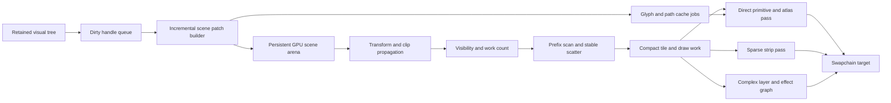

# Vello GPU Architecture Analysis and ProGPU 1000 FPS Scrolling Plan

Status: accepted architecture; implementation and AOT qualification in progress
Research and measurement dates: 2026-07-18 through 2026-07-19
ProGPU baseline revision analyzed: `06451e53e53d28fff946b2942dd24e5cc33210b9`
Vello revision inspected: `8ecea46dc79bbb10315c101f9dbd0955c627dab8` (2026-07-16)

## Executive decision

ProGPU should not replace its renderer wholesale with Vello's classic compute pipeline. The highest-value change for scrolling is to stop recompiling and re-uploading a mostly unchanged retained scene when a scroll transform or a small virtualized range changes. The recommended architecture is a retained GPU scene with stable object handles, transform indirection, incremental patch uploads, GPU visibility compaction, and indirect or render-bundle replay.

Vello provides two useful but different reference designs:

1. Classic Vello encodes an immediate scene into compact streams and processes the whole scene through GPU reductions, prefix scans, curve flattening, clipping, binning, tile allocation, path tiling, coarse command generation, and fine compute rasterization.
2. The newer Vello sparse-strip/hybrid renderer deliberately moves curve flattening, tiling, sorting, and analytic coverage generation to SIMD CPU code, uploads only sparse 4-pixel-high coverage strips, and uses conventional instanced vertex/fragment rendering and texture atlases. The pinned repository snapshot still marks the `sparse_strips` packages as under active development and unsuitable for production, while Linebender's April 2026 status report describes Vello Hybrid as roughly beta-quality and usable with remaining rough edges. The architecture is relevant, but its maturity must not be overstated in either direction.

ProGPU should adopt the transferable ideas from both:

- From classic Vello: compact scene streams, prefix-scan-based allocation, stable painter-order binning, tile-level work generation, indirect sizing, and avoiding full intermediate coverage textures.
- From sparse Vello: specialize common rectangles, keep sparse edge coverage rather than rasterizing full path bounds, use CPU SIMD when it is cheaper than a chain of small compute dispatches, separate fast source-over rendering from expensive layer/compositing paths, and cache glyphs in a managed multi-page atlas.
- From ProGPU's existing architecture: keep retained visual identity, exact invalidation, shaped glyph indices and positions, physical-DPI rasterization, four-way text subpixel snapping, calibrated vector-glyph quality, analytic primitive fast paths, static DXF buffers, and compiled-scene correctness.

The first implementation milestone is therefore not a new full-screen compute rasterizer. It is an incremental retained scene and one-submit frame graph. At the start of this work, the experimental `WavefrontVectorEngine` recreated large buffers, uploaded all cached curves and BVHs, binned with work proportional to screen cells times instances, capped a cell at 64 instances, copied the full target, and performed per-pixel BVH traversal. The Phase 4 checkpoints below remove the buffer churn, repeated flatten/upload, cell-by-instance loop, overlap cap, empty-cell fine dispatch, most solid/outside BVH walks, and the full-target copy. Edge cells still use the correctness-first per-pixel BVH fine stage; the engine must not become the default before the remaining Vello-style edge/backdrop coarse work meets the quality and performance gates.

## What “1000 FPS” must mean

At 1000 FPS, a frame has a 1.000 ms throughput interval. A CPU counter that calls `QueueSubmit` 1000 times per second does not prove 1000 completed frames. Likewise, a 120 Hz display cannot visibly present 1000 distinct frames per second even with VSync disabled.

The target must be qualified as follows:

- Reference workload: deterministic continuous scroll on every scrollable sample page, at a fixed window size, DPI, content, scroll delta, and quality configuration.
- Reference targets: named desktop GPU/driver and browser/WebGPU implementation. Results from different physical framebuffer sizes are not directly comparable.
- Throughput: at least 1000 GPU-completed frames per second over a 10-second measured interval after warmup.
- CPU pacing: submitted-frame interval p95 no greater than 1.000 ms and p99 no greater than 1.250 ms.
- GPU duration: timestamped GPU work p95 no greater than 0.850 ms, leaving scheduling margin.
- Queue depth: no more than two uncompleted frames. A deeper queue is latency hiding, not sustained performance proof.
- Quality: identical framebuffer size, sample count, coverage grid, glyph phase policy, DPI, color space, blending, clipping, and texture sampling to the protected reference.
- Correctness: each measured frame must advance the scroll state and produce the expected realized range and visible content. Replaying a stale frame is a failure.
- Startup: first interactive frame and first scroll response need separate cold metrics; warm throughput must not be achieved by moving an unbounded stall into page activation.

This is a reference-machine engineering target, not a hardware-independent API guarantee. A 1200 x 800 RGBA target requires at least 3.84 GB/s merely to write every pixel 1000 times per second. A 2400 x 1600 Retina target requires 15.36 GB/s before reads, blending, overdraw, atlas traffic, and presentation. GPU-heavy sample shaders may be fundamentally fill-rate bound at their full quality settings. The benchmark must report physical pixels and bytes written so an impossible bandwidth configuration is identified rather than “fixed” by reducing quality.

## Current measured baseline

The following desktop measurements were taken from the stated ProGPU revision on 2026-07-18 with Release binaries, VSync disabled, 120 warmup frames, 360 measured frames, scrolling enabled, and a 40 logical-pixel step.

| Page | Wall FPS | Wall interval | Compile | Upload | CPU render/submit recording | Surface acquire | Allocation/frame | Required speedup |
| --- | ---: | ---: | ---: | ---: | ---: | ---: | ---: | ---: |
| Data Virtualization | 355.65 | 2.812 ms | 1.8296 ms | 0.1011 ms | 0.1636 ms | 0.6464 ms | 30,188 B | 2.81x |
| Inter Typeface | 430.15 | 2.325 ms | 0.9391 ms | 0.1064 ms | 0.1189 ms | 0.9374 ms | 18,105 B | 2.32x |
| Font Glyph Browser | 314.17 | 3.183 ms | 2.0805 ms | 0.1061 ms | 0.2299 ms | 0.4148 ms | 100,836 B | 3.18x |

All three workloads reported `sceneCacheHits=0` with `Root version changed`. The glyph browser rendered 42 realized cells, changed neither glyph-atlas generation nor path-atlas generation, and performed no glyph evictions or clears during the measured interval. This is strong evidence that its steady-state problem is retained-scene recompilation, container/text work, and command rebuilding rather than glyph rasterization capacity.

These measurements are CPU-side phase timings. `RenderPassTimeMs` currently measures command recording, finish, and submission work, not timestamped GPU execution. The first task is to add completed-GPU timing before attributing the remaining wall time.

The first Phase 0 instrumentation pass added explicit queue-completion accounting and exposed a tail that the averages concealed. A 360-frame Data Virtualization run completed 359 measured GPU submissions at about 376 completed frames/s, reached three frames in flight, and had 2.66 ms surface-acquire p95 despite only 0.62 ms average acquire time. The benchmark now reports submitted and completed rates separately, p50/p95/p99/max CPU intervals, physical target dimensions, DPI, queue depth, and a schema-versioned JSON record. Timestamp queries are capability-gated and use a non-blocking triple readback ring; an adapter returning invalid zero timestamp pairs is reported as failed samples rather than a fictitious zero-cost GPU frame.

The canonical process-isolated desktop sweep is:

```bash
eng/progpu-benchmark-pages.sh --all --vector-engine atlas
eng/progpu-benchmark-pages.sh --all --vector-engine wavefront
```

It reads `eng/performance/sample-pages.txt`, launches every page in its own Release process, and writes complete logs plus JSONL and CSV artifacts. A source test requires the manifest order to match the actual navigation declarations so newly added pages cannot silently escape the performance sweep.
The vector engine is now an explicit process input and schema-v5 JSON field, preventing Atlas and
Wavefront results from being merged or compared without their renderer identity.

### Implementation checkpoint: retained fragments and non-blocking retirement

The first retained-scene milestone is implemented on the working branch:

- `Visual.LocalChangeVersion` distinguishes a visual's own command changes from descendant invalidation while `ChangeVersion` still protects whole-scene correctness.
- `SceneFragmentHandle` provides stable retained identity and versioned picture replacement.
- `GpuSceneFragmentArena` owns grow-only persistent vector, index, text, brush, and gradient storage and updates only changed fragment ranges.
- Translation-only placement uses shared `SceneTransformHandle` uniforms instead of rewriting glyph instances.
- Text-only visuals have an experimental automatic-promotion path when GPU hit testing, cached layers, effects, and unsupported transforms are absent. It is disabled by default after A/B testing showed that recycled font pages lost throughput through draw fragmentation and arena churn; explicit retained fragments remain enabled.
- DataGrid recycles a fixed fragment-handle ring, changes about 1.43 row fragments per 40-pixel scroll frame, and reuses about 28.43 row fragments.

On Data Virtualization, the detailed-instrumentation baseline completed 343.68 GPU frames/s, compiled for 1.8168 ms/frame, and uploaded 157,627 bytes/frame. The retained-fragment implementation has produced process-isolated runs between 375 and 638 completed frames/s, with the best repeat compiling for 0.8047 ms/frame and uploading 38,605 bytes/frame. The variation is material and means the 638 result is not yet a sustained-performance claim. Ten-second gates and tail latency remain required.

The first canonical 46-page sweep also exposed an independent five-second stall. `WgpuContext.CleanupPendingResources` called `WaitIdle` whenever any deferred resource existed. Eleven otherwise sub-millisecond retained-replay pages recorded a frame near 5,002 ms, and three image/animation pages could not finish the sweep in a reasonable time. This was not Vello-style scene preparation cost; it was a device-wide resource-retirement barrier.

Normal retirement now destroys/releases objects without waiting for the whole device. This follows the WebGPU lifetime contract: buffer destruction can occur after final commands are submitted, while the implementation retains the allocation until previously submitted operations complete. Queue completion remains the explicit ordering primitive when application-visible completion is required. See the [WebGPU buffer destruction and command lifetime specification](https://gpuweb.github.io/gpuweb/#buffer-destruction) and [`GPUQueue.onSubmittedWorkDone`](https://gpuweb.github.io/types/interfaces/GPUQueue.html#onsubmittedworkdone). A `BlockingDeviceWaitCount` metric enforces that normal measured frames perform no device-wide wait.

Post-fix checks removed the five-second outlier:

| Workload | Before worst frame | After result | Blocking waits | Outcome |
| --- | ---: | ---: | ---: | --- |
| Grid Splitter | 5,002.98 ms | 10.79 ms worst frame | 0 | pathological retirement stall removed |
| Image Effects | did not complete 480-frame sweep | 562 completed FPS in 10/20 smoke | 0 | page advances normally |
| Image & Buttons | did not complete 480-frame sweep | 565 completed FPS in 10/20 smoke | 0 | page advances normally |
| Motion & Animations | did not complete 480-frame sweep | 428 completed FPS in 10/20 smoke | 0 | page advances normally |

The sweep's remaining renderer-bound blockers are Font Glyph Browser (221 completed FPS, 1.431 ms average and 3.763 ms p95 compile), Inter Typeface (258 completed FPS, 1.332/3.362 ms compile), Visual Designer (230 completed FPS, 3.237/5.024 ms compile and 3.3 MB uploaded per frame), Data Virtualization, and LOL/s. These require incremental fragment compilation, retained glyph-run placement, bounded indirection/compaction, and specialized batched primitives. Presentation-bound static pages must be evaluated separately because surface acquisition still has 3-5 ms p95 variance even when compile time is under 0.02 ms.

A later corrected 600-frame blocker sweep, after automatic text promotion was disabled and
invalid WebGPU runs were made fatal, measured 347.52 completed FPS for Font Glyph Browser,
359.73 for Inter Typeface, and 385.51 for Data Virtualization. Font Glyph Browser still compiled
for 1.481 ms on average, uploaded 163,127 bytes, allocated 93,910 bytes, and issued 108 draws per
frame. The sampled trace attributed the recurring managed work to full visual-tree traversal and
text/glyph compilation; its atlas work averaged only 0.042 ms, although the long scroll did expose
LRU turnover. Inter compiled for 0.499 ms but had 8.599 ms surface-acquire p95. DataGrid reused
21.43 row fragments and updated 1.43 per frame, but alternating row chrome and text fragments still
created 66 draws.

Two focused fixes establish the next checkpoint:

- Visual Designer no longer invalidates its selection adorner after an unchanged arrange. Stable
  replay rose from 197.56 to 552.21 completed FPS, with 358 of 360 frames hitting the scene cache.
- Its dot background is now one analytic periodic GPU quad instead of roughly 52,000 circle
  vertices. The validated run retained 2,664 total page vector vertices and 560.70 completed FPS;
  the remaining 7.551 ms acquire p95 is presentation/GPU pacing, not scene compilation.
- DataGrid records non-overlapping row chrome before retained row text. This preserves painter
  output, reduces the measured page from 66 to 37 draws, and raised a 600-frame run from 385.51 to
  437.24 completed FPS. Compile-tail variance remains and requires transform-indexed fragment
  replay rather than further control-specific command reordering.

The benchmark now also counts uncaptured WebGPU errors and rejects a run when any occur. This
closed a false-success hole where an invalid vector shader produced approximately 9,700 reported
"completed FPS" while all render pipelines and command buffers were invalid. Timestamp-query
capability is not yet sufficient evidence of usable timing on the current Metal adapter: a traced
glyph run reported 601 failed timestamp readbacks and zero valid samples. Phase 0 therefore remains
open for backend-specific timestamp qualification even though queue-completion accounting is valid.

### Browser AOT measurement checkpoint (2026-07-19)

The current branch was successfully published with managed WebAssembly AOT and served locally from
the exact publish output. The browser benchmark is now selected through query parameters that are
translated into the same environment-variable contract used by the desktop harness. This removes
manual navigation timing from page selection and makes warmup, measured frame count, scroll delta,
VSync, completion tracking, and vector-engine selection reproducible in a browser AOT run.

Chromium on the measured machine advertises the WebGPU `timestamp-query` feature while the command
encoder does not expose `writeTimestamp`. Requesting the advertised feature is therefore not enough.
The browser host now qualifies both the adapter feature and the actual encoder method. Queue
completion metrics remain enabled, while pass timestamps are explicitly reported as unsupported;
the prior failure loop is gone and the measured origins produced no uncaptured WebGPU errors.

All results below used a 2560 x 1440 physical Bgra8Unorm target, DPI 2, one sample, VSync disabled,
120 warmup frames, 600 measured frames, a 40-logical-pixel deterministic scroll step, Atlas vector
rendering, completion tracking, and a maximum queue depth of two.

| Browser AOT page | GPU-completed FPS | Compile avg / p95 | Allocation/frame | Upload/frame | Cache behavior |
| --- | ---: | ---: | ---: | ---: | --- |
| Data Virtualization | 229.56-238.21 | 2.685-2.706 / 3.600 ms | 27,398-27,499 B | 80,533-80,534 B | 0 hits; 18.57 fragment reuses and 1.43 updates/frame |
| Font Glyph Browser | 216.14 | 2.184 / 4.400 ms | 68,638 B | 102,595 B | 238 hits; range-boundary misses dominate |
| Inter Typeface | 470.27 | 0.463 / 3.400 ms | 26,221 B | 55,395 B | 520 hits |
| Markdown | 464.00 | 0.206 / 0.100 ms | recorded in benchmark artifact | retained replay | 573 hits in the reference run |

The single-font, single-line text layout fast path reuses one thread-local pool-backed shaping buffer
and directly materializes the final retained glyph runs. It still invokes the same OpenType shaper,
feature set, glyph IDs, advances, offsets, and fallback decision. On Data Virtualization it improved
completed throughput from 233.00 to 238.21 FPS and reduced allocation from 33,784 to 27,499 bytes per
frame. It does not solve the principal cost: compiling the roughly 1.43 entering rows still takes
about 2.69 ms per frame.

Transform-only control runs with a one-pixel scroll step isolate the mutation-boundary cost:

| Page | 40 px step | 1 px transform-only step | Interpretation |
| --- | ---: | ---: | --- |
| Data Virtualization | 230-238 completed FPS | 552 completed FPS | row entry/rebind/compile is the dominant 40 px cost |
| Font Glyph Browser | 216 completed FPS | 478 completed FPS | realized-range turnover dominates; atlas work is small |

Correct transform-only replay tops out near 478-552 completed FPS at this physical target. Therefore the
1000 FPS target cannot be reached on this browser/GPU by control changes alone. The remaining path
must reduce both presentation/fill cost and command replay: dirty-rectangle or preserved-tile
scrolling, partial target updates where the swapchain permits them, fewer full-frame color writes,
and retained bundle/indirect replay. The benchmark reports a minimum 14.75 MB color write per frame;
1000 FPS would require at least 13.73 GiB/s of color writes before blending, overdraw, texture reads,
or presentation copies.

#### Incremental compiled-scene patch checkpoint

The next retained-scene slice removes the remaining full visual-tree compile when an explicit
`SceneFragmentHandle` changes but the scene topology does not:

- The compiled scene records each persistent fragment allocation, transform placement, parent clip
  and opacity, and the draw-range uses that reference its arena slot.
- A cache candidate compares fragment versions before traversal. Changed pictures are compiled into
  the existing grow-only `GpuSceneFragmentArena` slot, only the affected GPU ranges are uploaded, and
  merged draw ranges are refreshed in place.
- Capacity, stream kind, range count, transform placement, and duplicate-handle placement are strict
  compatibility gates. Any mismatch abandons the patch and performs a normal full compile in the
  same frame; stale or partially relocated arena data is never submitted.
- Glyph-atlas generation changes during a patch also force the ordinary compiler, preserving atlas
  UV generation correctness.
- Parent clip-stack and opacity state are captured and restored for patch compilation. A native
  pixel regression changes a clipped, half-opacity fragment and verifies cache reuse, the new color,
  unchanged clipping, and unchanged visual render count.
- Text arena slots receive bounded first-allocation headroom so recycled one- and two-digit row
  values normally remain in place without reserving unbounded exact-string variants.

DataGrid now uses stable slot-order text fragments and one hysteretic row-chrome fragment. Alternating
backgrounds, selection/hover chrome, selection accent, and row borders are recorded once for a
bounded two-window band rather than interleaved with every row's text. The initial slot reservation
accounts for the maximum fractional-scroll realization, preventing the first sub-row scroll from
doubling the retained topology. Forty consecutive realized-range transitions are covered by a test
that requires an unchanged root version, a compiled-scene hit, and only one or two fragment updates
per boundary.

The republished Release AOT measurements below use the same 2560 x 1440, DPI 2, 120/600-frame,
VSync-off, completion-tracked configuration as the preceding table:

| Workload | GPU-completed FPS | Compile avg / p95 | Upload/frame | Allocation/frame | Cache / draws |
| --- | ---: | ---: | ---: | ---: | --- |
| Data Virtualization, 40 px | 293.97 | 2.087 / 3.000 ms | 12,314 B | 25,412 B | 596/600 hits; 35 draws |
| Data Virtualization, 1 px repeat | 493.77 | 0.089 / 0.100 ms | 980 B | 7,312 B | 598/600 hits; 35 draws |
| Font Glyph Browser, 40 px | 230.51 | 2.187 / 4.400 ms | 103,409 B | 68,471 B | 235/600 hits; 110 draws |
| Inter Typeface, 40 px repeat | 455.65 | 0.466 / 3.500 ms | 54,773 B | 26,224 B | 521/600 hits; 62 draws |

Compared with the pre-patch DataGrid AOT baseline, the 40-pixel workload improves from 229-238 to
294 completed FPS, reduces upload traffic from about 80.5 KiB to 12.0 KiB per frame, and converts
596 of 600 measured frames into compiled-scene hits. Row-chrome batching reduces the patched design
from 66 to 35 draws while preserving the same visible rows, borders, alternating fills, text, clip,
and scrollbar in the browser screenshot. The 1-pixel repeat has only 0.199 ms average compositor
time and 0.089 ms compile time, yet its median submitted-frame interval is 2.5 ms. This is direct
evidence that further C# command-recording reductions alone cannot deliver 1000 GPU-completed FPS at
this target.

The next implementation priority is therefore the Vello/WebRender-style separation already defined
in Phases 2, 3, 6, and 7: keep font/glyph pages on stable interned fragments, generate visibility and
dirty-strip work without rebuilding the root, preserve or copy unchanged scroll tiles when the
surface path permits it, and replay compact indirect/bundled batches. Browser scheduling,
full-target color bandwidth, and actual GPU completion must remain measured separately; a faster
CPU submit counter is not an acceptable substitute.

A larger hysteretic overscan experiment was measured and rejected. It reduced average DataGrid
compile time to about 2.24 ms but left throughput flat at 233.88 FPS and worsened compile p95 to
17.1 ms by batching the same 1.43 entering rows into larger bursts. Overscan is not a substitute for
incremental row records and bounded patch uploads.

Quality and interaction qualification on this AOT output found:

- DXF initial zoom-to-fit is centered. Wheel zoom retained the selected world point under the
  cursor, drag pan matched the pointer delta, and the fit command restored the original bounds.
- Data Virtualization, Inter, Markdown, navigation icons, and ordinary text rendered sharply with no
  browser errors in the sampled pages.
- Font Glyph Browser exposed a repeated-arrange correctness defect in both virtualizing panels. The
  generic base arrange stretched realized cells to the complete 42,000-pixel virtual extent, then a
  cached-range early return skipped restoring item rectangles, placing cells around Y=21,000. Grid
  and stack panels now restore O(V) active item geometry after an actual arrange without recycling,
  rebinding, or advancing the reconciliation counter. Focused repeated-arrange tests pass, and the
  republished AOT page visibly renders cards, labels, outlines, and the scrolled glyph range. Its
  corrected 40-pixel and one-pixel results are 216.14 and 477.60 completed FPS respectively.
- The local DXF picker reaches the browser file-input path, but the in-app browser automation surface
  does not support assigning a file to a chooser. Source and focused tests verify cancellation-safe
  direct byte transfer into the WASM filesystem; an interactive Chrome/native chooser run remains a
  separate platform qualification gate.

#### Stable glyph-slot fragments and browser pacing checkpoint

The next glyph-browser checkpoint implements WebRender-style stable interned slots on top of the
generic compiled-fragment patcher. `UniformVirtualizingGridPanel` recognizes an optional retained
leaf contract, creates one fixed modulo ring sized to visible rows plus two overscan rows, and keeps
those visuals attached for the panel lifetime. A row transition rebinds only the entering modulo
slots. Each slot replaces a generation-bearing `SceneFragmentHandle` recorded in absolute content
coordinates, while one shared `SceneTransformHandle` applies the scroll offset. The panel remains
outside the `ScrollViewer` parent translation so the scroll transform is applied exactly once.

The Font Glyph Browser cells now record card chrome, the raw font glyph, and the two numeric labels
directly into those retained pictures. The numeric labels reuse length-class glyph/position arrays,
perform no string formatting, and avoid general rich-text layout for this fixed ASCII diagnostic
case. The raw glyph still uses the ordinary glyph atlas and all existing physical-DPI, phase,
outline, and color-glyph fallbacks. Theme colors are bound through dependency properties and
resolved for each element/theme before picture recording; three border pens are rebuilt only on a
theme change, not when a cell enters the viewport. Pointer hit routing maps the panel coordinate
plus scroll offset back to the active retained slot, preserving hover and click behavior even though
the slot visuals intentionally have no mutable layout placement.

A focused 20-row regression requires the post-warmup root version and attached child identities to
remain unchanged at every full-row boundary. Each frame must be a compiled-scene hit and patch
exactly `ColumnsCount` entering fragments. The same test forwards pointer move and press to the
first visible retained item after the final scroll. The broader qualification passes 47 sample
performance tests, 18 compositor layer/fragment tests, and the two headless glyph-page render and
theme diagnostics.

The exact Release AOT output was republished and measured at the same 2560 x 1440 physical target,
DPI 2, one sample, 120/600 frames, completion tracking, Atlas renderer, and VSync disabled:

| Workload | Scroll step | GPU-completed FPS | Compile avg / p95 | Compositor avg | Upload/frame | Allocation/frame | Cache / draws |
| --- | ---: | ---: | ---: | ---: | ---: | ---: | --- |
| Font Glyph Browser | 40 px | 302.43 | 0.122 / 0.300 ms | 0.344 ms | 22,172 B | 30,199 B | 596/600 hits; 110 draws |
| Font Glyph Browser | 1 px | 327.35 | 0.036 / 0.100 ms | 0.242 ms | 1,842 B | 14,328 B | 596/600 hits; 110 draws |
| Data Virtualization control | 40 px | 249.86 | 2.170 / 3.100 ms | 2.304 ms | 12,429 B | 25,368 B | 595/600 hits; 35 draws |
| Inter Typeface control | 40 px | 344.65 | 0.491 / 3.600 ms | 0.622 ms | 55,544 B | 11,188 B | 520/600 hits; 62 draws |

The glyph result improves the preceding 230.51 completed-FPS checkpoint by 31.2%, reduces average
compile time from 2.187 to 0.122 ms, reduces uploads by 78.6%, reduces allocation by 55.9%, and turns
the former 365 measured range-boundary misses into 596/600 cache hits. The AOT screenshot shows the
scrolled cards, icon outlines, decimal/hex labels, selected-glyph preview, theme colors, clips, and
scrollbar with no browser or WebGPU errors.

##### Rejected cross-fragment batching experiment

Three Release AOT implementations tested whether command reordering alone could remove the 110
cell-local draws. All used the same 2560 x 1440, DPI 2, 120/600-frame, 40-pixel, VSync-off benchmark
and retained the same card/glyph/label output. None met the no-regression gate, so their production
code was reverted:

| Experimental design | GPU-completed FPS | Compile avg / p95 | Upload/frame | Allocation/frame | Queue writes/frame | Draws |
| --- | ---: | ---: | ---: | ---: | ---: | ---: |
| One rebuilt visible-set fragment, layer ordered | 243.22 | 0.188 / 0.500 ms | 56,150 B | 38,765 B | 15.44 | 42 |
| Stable per-slot layer fragments | 251.83 | 0.151 / 0.400 ms | 22,333 B | 33,941 B | 27.85 | 42 |
| Per-slot layers plus one dirty-span write per arena stream | 249.96 | 0.144 / 0.400 ms | 27,904 B | 34,174 B | 15.41 | 42 |

The first version reduced draw replay but replaced and uploaded the complete visible batch whenever
a row entered. The second preserved delta-only bytes but doubled picture/handle churn and emitted
many small queue writes. The third reduced write count by uploading the min/max union of dirty arena
spans; disjoint layer allocations widened that union and increased bytes. These results reject both
whole-visible-set rebuilding and coarse min/max upload coalescing. The accepted 302.43-FPS stable
slot baseline remains the production path.

The next batching implementation must therefore operate below `GpuPicture`: keep fixed instance
slices for every slot, patch only the entering slices, keep separate compact dirty intervals per
stream, and replay stable batch descriptors or indirect draws over those slices. This is the same
separation used by Vello/WebRender-style retained encodings: scene identity and dirty records stay
fine grained while GPU submission is compact. Reducing draw count is not a success metric when it
raises allocation, upload traffic, frame-interval tails, or completed-frame latency.

A follow-up delta-only dictionary reconciliation trial was also reverted. In the same externally
pacing-limited browser window, the unchanged baseline measured 104.02 completed FPS with 0.186 ms
compile, 0.489 ms compositor time, 37,650 B allocation, and 21,843 B upload per frame. Avoiding the
active-map clear/reinsert measured 98.12 FPS, 0.195 ms compile, 0.506 ms compositor time, 36,934 B
allocation, and 22,004 B upload. The 716-byte allocation reduction did not offset the added range
diff work, while fragment updates, draw count, and uploaded content were unchanged. Future slot
bookkeeping work must use direct modulo lookup and fixed dirty instance records end to end; adding a
dictionary delta pass around the existing picture compiler is not sufficient.

This measurement also sharpens the remaining 1000-FPS plan. The one-pixel workload performs only
0.242 ms of compositor work yet has a 3.300 ms median submitted-frame interval. Its 110 draw calls
and approximately 14 KiB of managed allocation remain waste, but eliminating them cannot by itself
recover the other roughly 2.3 ms. The uncapped browser loop uses a `MessageChannel` admission task
and fences after two submitted frames to bound latency; full-size swapchain acquisition,
presentation, queue completion, main-thread scheduling, and full-target color writes remain in the
measured interval. A 1000-FPS claim must not be manufactured by allowing an unbounded queue or by
counting offscreen state updates as completed presentations.

The next implementation slices are therefore concrete and ordered:

1. **Cross-fragment instance batching.** Preserve painter order with stable batch keys and merge the
   non-overlapping glyph-card background, icon, primary-label, and accent-label streams into bounded
   instanced batches. Store slot-to-instance ranges so an entering cell patches only its fixed
   slice. Target no more than eight page-content draws instead of 105 cell-local draws without
   rebuilding all visible glyph arrays.
2. **Delta-only slot bookkeeping.** Replace the row-boundary clear/reinsert of the active dictionary
   with entering/leaving column deltas and a direct modulo lookup for hit testing. Keep the fixed
   slot array and scratch ranges allocated after cold layout. Target less than 2 KiB managed
   allocation per measured browser frame.
3. **Coalesced uploads.** Sort dirty fixed slices, merge adjacent byte ranges, and issue one write per
   retained vertex/index/text arena rather than one write per changed picture/range. A normal glyph
   row boundary should require at most four dynamic queue writes and no unchanged instance upload.
4. **DataGrid row instance records.** Stop compiling shaped entering-row pictures into general draw
   ranges. Keep fixed text-instance slices per recycled row, patch glyph IDs/positions/brush indices
   only for entering data, and preserve the existing 35-draw chrome ordering. Target compile plus
   patch below 0.200 ms at a 40-pixel step.
5. **Inter tile fragments.** Replace half-viewport root invalidation with stable vertical tile
   handles. Shape/layout remains lazy and reusable on CPU; the next tile is warmed in the bounded
   worker ring and published into a fixed tile slot. Scrolling patches one transform and only a tile
   entry changes at a boundary, removing the current 80/600 root-version misses without eager
   page-wide shaping.
6. **Preserved scroll surface.** Add an offscreen retained color target divided into damage tiles.
   Transform-only scroll copies or reprojects preserved tiles and redraws only the newly exposed
   strip plus overlays. This follows WebRender tile-cache retention and Vello's sparse-work
   principle: GPU work scales with damage rather than 3.69 million physical pixels. Full redraw
   remains the correctness fallback for effects, backdrop reads, non-translation transforms,
   incompatible clips, or device loss.
7. **Browser pacing qualification.** Timestamp the admission task, WASM host frame, command decode,
   queue completion, and presentation boundaries separately. Compare main-thread and dispatcher
   worker modes. Tune the maximum in-flight bound only from latency and completion evidence; add an
   offscreen throughput diagnostic mode solely to distinguish raster cost from swapchain pacing,
   never as the public scrolling result.

#### Detailed implementation: fixed retained instance slices

This is the next production implementation, replacing the rejected picture-level batching trials.
It applies Vello's separation between compact input records and compact GPU submission without
re-encoding an unchanged scene. The first consumer is Font Glyph Browser; the storage and replay
types must be reusable by DataGrid and Inter rather than page-specific compositor branches.

##### API and ownership

Add a typed `RetainedInstanceBatchHandle` owned by a visual or virtualizing panel. It is generation
safe, disposable, and contains stable handles for these independent streams:

```text
RetainedInstanceBatchHandle
  BatchDescriptor[]       stable painter-ordered replay groups
  FixedSlice[]            one slot x stream reservation per recycled item
  VectorVertex[]          card/background/chrome shadow storage
  uint[]                  immutable or rarely changed indices
  GlyphInstance[]         atlas glyph shadow storage
  Matrix4x4[]             shared and per-slot transform table
  DirtyIntervalSet[]      vectors, indices, glyphs, transforms, optional paints
  GpuBuffer[]             grow-only device arenas with bind generation
```

The proposed public/control-facing contract is intentionally typed and does not expose compositor
internals:

```csharp
public interface IRetainedVirtualizedItemBatch
{
    RetainedInstanceBatchHandle Batch { get; }
    RetainedInstanceSlice Slice { get; }
    bool UpdateRetainedInstanceSlice(Rect absoluteBounds);
}
```

`RetainedInstanceSlice` contains fixed start/capacity pairs, not arrays or `GpuPicture` objects.
Updates write into caller-provided spans or a stack-only writer. The writer validates capacity and
commits atomically; an overflow requests one cold grow/repack before rendering, or selects the
existing fragment fallback for that frame. It must never truncate glyphs or geometry.

The compositor-side owner should be a new `GpuRetainedInstanceArena`, not another mode on
`GpuSceneFragmentArena.Allocation`. The current arena associates one allocation and draw-range list
with one `SceneFragmentHandle`, clears an allocation's complete text capacity on update, and writes
each changed allocation immediately. Those semantics are correct for generic pictures but conflict
with multi-slot batching and compact interval upload. The new arena can reuse its grow-only buffer,
bind-generation, transform-index recycling, and shadow-storage patterns without weakening the
generic fragment path.

##### Fixed layouts for the glyph page

The glyph page has non-overlapping cells, so its painter order can be factored safely into a small
number of page-wide layers:

1. card fills and ordinary borders;
2. raw glyph atlas instances;
3. decimal label atlas instances;
4. hexadecimal label atlas instances;
5. hover/selection accent and focus overlays.

Batching across these layers is safe because cards do not overlap and each later layer preserves
the same within-cell order. General overlapping content must retain its original interleaving; it
may use multiple descriptors and is not eligible merely because material keys match. Alpha
blending is order-sensitive, so depth sorting or an unordered atomic append is not a substitute.

Reserve one fixed slice per modulo slot:

- card vector slice: fixed topology, normally four vertices and six indices for an analytic rounded
  rectangle, plus a bounded border representation;
- raw glyph slice: one atlas `GlyphInstance`, with the existing vector/color fallback recorded in a
  separate bounded descriptor when required;
- decimal and hexadecimal slices: capacity derived from the maximum representable glyph index and
  fixed prefixes, not the current string length;
- overlay slice: one fixed analytic instance, made inactive when the slot is not hovered or
  selected.

Indices for fixed card topology are generated once when capacity grows and are not uploaded on a
row transition. Glyph tails use a canonical inactive record with zero area and zero alpha in the
first implementation. This allows one direct instanced draw with no compaction dispatch for the
roughly 42-slot workload. If tail vertex work becomes measurable, add a stable source-index stream;
do not introduce cull/scan/scatter until calibration shows its dispatch cost is lower than direct
replay.

##### Dirty interval algorithm

Each stream owns a preallocated interval set. Committing slot `s` marks exactly its fixed slice
`[start, start + active-or-required-capacity)`. At the end of scene patching:

1. sort by start only when producers did not commit in slot order;
2. merge overlapping or directly adjacent intervals;
3. never merge across a positive gap merely to reduce write count;
4. upload each resulting interval from the shadow array;
5. clear interval count without releasing its backing storage.

For `D` dirty slots and `R` resulting adjacent runs, ordered slot production is `O(D)` work and
`O(R)` queue writes. Unordered production is `O(D log D)` only for the dirty records, not the full
arena. Storage is `O(S + D)` for `S` retained instances plus bounded dirty metadata. The accepted
glyph row boundary changes `ColumnsCount` adjacent modulo slices, so each stream should normally
collapse to one or two exact writes. This specifically avoids the rejected min/max-union design,
which uploaded unchanged gaps between disjoint allocations.

The upload scheduler must report per stream: dirty slice count, interval count, bytes requested,
bytes actually written, unchanged bytes covered by merging, and buffer growth. A debug invariant
requires `unchanged bytes covered == 0` except alignment padding explicitly required by WebGPU.

##### Replay descriptors and shader changes

`BatchDescriptor` is immutable between topology changes and contains pipeline kind, blend mode,
mask/clip identity, buffer ranges, maximum/active instance count, and painter sequence. The
compositor records the descriptor array once in the compiled scene and only refreshes its resource
generation after arena growth or device loss.

The initial glyph-page path should reuse existing shaders:

- atlas glyphs already encode a stable transform-table index in `GlyphInstance.Padding`, and
  `Text.wgsl::fragment_vs_main` resolves it from `fragmentTransforms`;
- analytic card vertices can use one shared scroll transform per page-wide vector descriptor;
- the current mask, atlas-page, DPI, ClearType/aliased/color-glyph, bold, italic, and brush behavior
  remains unchanged.

Only add a storage-indexed glyph vertex entry if inactive fixed tails or non-contiguous visibility
prove material. That entry can reuse `GpuSceneVisibility.VisibleSourceBuffer` and the indirect draw
layout already exercised by `RetainedGlyph.wgsl` and static DXF. For small batches, populate source
indices on the CPU or draw fixed capacity directly. For thousands of instances, route through the
existing count/scan/scatter compute pipeline. This size-based routing mirrors Vello Hybrid's direct
fast path versus coarse path and avoids paying three compute stages for a few dozen cells.

Any new shader remains an embedded file under the owning `Shaders/` directory with the repository's
algorithm/time/space contract. Fixed WGSL must not be emitted as a C# string. Browser AOT startup
must prewarm the selected pipeline variant before the benchmark interval.

##### Virtualization and hit testing

`UniformVirtualizingGridPanel` keeps its fixed modulo array but stops calling
`UpdateRetainedFragment` for batched children. On a range transition it computes the entering
columns directly, binds those slots, and commits only their batch slices. Transform-only scrolling
updates `_scrollTranslation` and no content stream. Hit testing computes the content index from the
pointer plus scroll offset, then verifies the modulo slot's generation/index; it does not rebuild an
active dictionary.

The existing `IRetainedVirtualizedItemFragment` path remains the fallback for arbitrary templates.
The new batch contract is opt-in and selected only when every probed slot returns the same layout
signature. A theme, font manager generation, DPI, item-size, column-count, or text-quality policy
change invalidates the relevant batch streams or rebuilds topology. Hover/selection changes patch
only the overlay or color record for the affected slot.

##### DataGrid and Inter reuse

After the glyph page meets its no-regression gate:

- DataGrid allocates one fixed atlas-glyph slice per recycled row/cell text run. Shaping results stay
  CPU-cached; entering data copies positioned glyph instances into the slice. Existing row chrome
  remains a page-wide batch and painter ordering stays equivalent to the accepted 35-draw design.
- Inter uses vertical tile slots rather than per-cell slots. Each tile owns bounded vector/text
  slices and a publication generation. Background preparation shapes and lays out only the next
  tile, then publishes a complete CPU record on the UI thread; GPU interval upload occurs in the
  next compositor frame. Font fallback, variable axes, OpenType features, line breaks, clusters,
  and selection geometry never move into a partial GPU shaper.
- Generic `ItemsControl` adopts the API only after the fixed-layout signature, fallback, theme,
  device-loss, and capacity behavior is proven by those two consumers.

##### Failure, device-loss, and quality behavior

- Arena growth increments its bind generation and rebuilds descriptors once; it does not invalidate
  glyph/path atlas UV generations.
- Device loss discards GPU buffers and bind groups but retains CPU shadow storage and stable logical
  slot identity. Recreation uploads the used high-water ranges once before replay.
- Glyph-atlas reset/repack still invalidates UV-bearing glyph instances. Rebuild only glyph streams;
  card vectors and slot bookkeeping remain valid.
- A slice-capacity miss is explicit. One bounded grow/repack is allowed before the frame; if it
  cannot fit, use the ordinary fragment compiler in the same frame and record the fallback metric.
- Complex masks, effects, non-source-over blends, overlapping template content, mutable drawing
  commands, or incompatible transforms stay on generic painter-ordered fragments until a typed
  descriptor represents them exactly.
- No route changes physical framebuffer size, DPI scale, phase lattice, gamma/contrast, hinting,
  sampling, fill rule, clip, or premultiplied-alpha behavior.

##### Implementation commits and tests

Implement in independently reversible commits:

1. `GpuRetainedInstanceArena`, fixed slices, interval merging, metrics, and CPU-only tests.
2. Compositor batch descriptors and direct vector/text replay, with native pixel-order tests.
3. `IRetainedVirtualizedItemBatch` and glyph-page integration behind an option, with pointer/theme/
   repeated-arrange tests.
4. Browser AOT qualification and default enablement only after the acceptance gates pass.
5. DataGrid row slices, then Inter tile slices, each with its own before/after evidence.
6. Optional indexed/indirect glyph replay only if direct fixed-capacity replay is measured as the
   remaining bottleneck.

Required focused tests:

- interval merge: empty, one, adjacent, overlapping, disjoint, reverse order, capacity boundary;
- atomic slice commit and explicit overflow without partial shadow mutation;
- stable painter output for overlapping controls and factored non-overlapping glyph cards;
- transform-only scroll performs zero vector/text writes;
- one-row transition updates exactly the entering column slices;
- hover, selection, theme, DPI, atlas generation, resize, column change, and device recreation;
- randomized pixel comparison against the existing picture path at 1000 scroll positions;
- browser AOT screenshot and interaction checks with zero uncaptured WebGPU errors.

##### Acceptance budget for this slice

Font Glyph Browser at the existing 2560 x 1440 browser-AOT target must meet all of these before the
new path becomes default:

| Metric | Required result |
| --- | ---: |
| Page-content draws | at most 8 |
| Transform-only content writes | 0 |
| Normal row-boundary queue writes | at most 4 |
| Normal row-boundary upload | at most 12 KiB |
| Compositor CPU average / p95 | at most 0.150 / 0.300 ms |
| Managed allocation after warmup | at most 2 KiB/frame |
| GPU-completed FPS | no lower than the accepted 302.43 baseline in controlled A/B runs |
| Pixel/interaction regressions | 0 |

The FPS gate is deliberately relative for this slice because the accepted browser run also proves
that swapchain/scheduler pacing can dominate after compositor work falls below 0.25 ms. The final
1000-FPS goal additionally needs preserved-scroll damage rendering and browser pacing work; fixed
slices are necessary to remove submission and allocation waste, but they are not presented as a
standalone 3.3x solution.

The 1000-FPS gate remains unchanged: every measured frame must advance validated scroll content,
remain within a two-frame queue, use the same physical target and quality policy, and complete on the
GPU. If the named browser/swapchain cannot present a 2560 x 1440 frame every millisecond even after
damage-preserved rendering, the report must state the hardware/browser ceiling and separately give
the internal retained-update throughput; it must not lower quality or relabel submitted work as
completed work.

This checkpoint supersedes the earlier sandbox-blocked AOT notes below. Those notes remain as an
audit trail for why browser evidence was previously absent; they are no longer the current state.

### Working-tree checkpoint: non-blocking per-pass GPU timestamps

Phase 0 now has pass-level instrumentation rather than only a whole-frame timestamp pair:

- `GpuTimestampRing` owns one 24-query set and three independently mappable 192-byte readback
  buffers. Query zero/one bound the complete compositor command stream; fixed pairs record glyph
  atlas, path atlas, scene preparation, masks/effects, primary rendering, Wavefront compute, and
  final composite. Nested fixed pairs further split Wavefront into geometry flattening, bin
  construction, active-cell compaction, and coarse/fine raster work. A busy ring drops only the
  diagnostic sample and never stalls rendering.
- Query resolution, readback copies, and all measured GPU work remain in the caller's single command
  encoder. Mapping starts only after queue submission, and metrics are harvested opportunistically
  on later frames. Normal rendering still creates no query set, buffers, arrays, map tasks, or
  timestamp commands unless diagnostics are explicitly enabled.
- Each readback slot carries the exact stage-written mask for its frame. Unused query indices are
  ignored even if the reusable WebGPU query set still contains older values, so an absent glyph,
  path, or Wavefront pass cannot be misreported as current GPU work.
- Benchmark warmup ends by advancing a metrics epoch and clearing counters. Late maps from the old
  epoch are safely unmapped but cannot contaminate measured averages or maxima. This is essential
  for separating cold pipeline/atlas work from sustained scrolling.
- The text and JSON benchmark records now expose sample count, average milliseconds, and maximum
  milliseconds for every pass, plus delta-based whole-frame GPU duration. Unsupported stages remain
  zero-sample records instead of being reported as zero-cost work.
- A native headless regression renders multiple frames, requires valid frame and primary-pass
  samples, checks every optional pass record for internally consistent values, resets the epoch, and
  requires a second independent sample set while rejecting WebGPU validation errors. The source
  builds successfully in this checkpoint. The current sandbox reaches
  wgpu-native but exposes no suitable Metal adapter, so executed timestamp qualification remains an
  explicit open gate; no GPU-duration result is claimed here.

This instrumentation changes diagnostics only. The remaining Phase 0 work is to qualify timestamp
units and availability on each desktop/browser backend, measure enabled overhead, and store Release
and browser AOT baselines.

### Working-tree checkpoint: retained spatial nodes and indexed text transforms

The current working tree advances Phase 1 beyond explicit row fragments. It is deliberately listed
separately from the committed measurements above because a clean browser AOT and sustained
GPU-completed benchmark have not yet qualified this slice.

- `Visual.RetainedTransform` and `ContainerVisual.ChildrenRetainedTransform` introduce a stable
  spatial-node handle. Translation changes patch a transform table and mark transform state dirty
  without incrementing immutable scene content versions.
- `Visual.ExcludeFromParentRetainedTransform` keeps overlays such as scrollbars in viewport space
  while content moves in scroll space.
- `ScrollViewer` uses one child transform for compatible subtrees and retains its scrollbar thumb as
  a picture plus transform. Its compatibility fallback preserves the former layout-translation path
  for clips, masks, effects, cached layers, or nested transforms that are not yet representable.
- `UniformVirtualizingGridPanel` keeps realized item positions absolute and moves the realized set
  through a shared transform. Realization changes remain container updates rather than per-pixel
  descendant placement changes.
- `InputSystem` composes the same retained transforms during hit testing and coordinate conversion,
  including the viewport-space overlay exclusion rule.
- `GpuSceneFragmentArena` owns stable transform indices. Retained text glyph instances store a
  transform-table index, and `Text.wgsl::fragment_vs_main` loads placement from the shared storage
  buffer. Adjacent compatible text fragments can therefore merge even when their placements differ.

Focused CPU/headless coverage currently proves that a retained root transform moves a compiled
subtree on a whole-scene cache hit, a retained child transform moves content while an excluded
overlay remains fixed, scroll does not rearrange content, coordinate conversion observes the scroll,
and the Font Glyph Browser, Data Virtualization, and Inter Typeface pages still produce non-empty
GPU output. `VirtualizingStackPanel`, `VirtualizingPanel`, and `UniformVirtualizingGridPanel` now use
the same shared-transform/fallback contract. These tests establish correctness invariants, not the
1000 FPS performance claim. Before integration this slice still requires:

1. browser AOT shader/pipeline creation with zero uncaptured WebGPU errors;
2. interactive scroll and hit-test checks on Data Virtualization, Font Glyph Browser, and Inter;
3. a safe per-panel fallback when a realized child is incompatible with retained translation;
4. process-isolated sustained desktop and browser measurements with valid completion accounting.

### Working-tree checkpoint: one-submit atlas recording

The next Phase 2 slice removes normal-frame atlas submissions without changing raster quality:

- `PathAtlas` retains its immediate API for callers outside a compositor frame, but also accepts a
  caller-owned command encoder. The compositor records all pending path batches ahead of its mask
  and color passes in the same command stream, for both onscreen and offscreen rendering. Its job,
  record, and segment uploads now use geometrically growing persistent storage arenas instead of
  allocating and retiring three GPU buffers for every cold batch. A persistent fourth arena stores
  one compact record per occupied 16x16 atlas tile; one flat dispatch maps those records back to path
  jobs, so mixed raster dimensions no longer require a bind group and dispatch per size class.
- `GlyphAtlas` now collects visible glyph raster jobs during scene compilation instead of opening a
  compute pass and creating an encoder at each first use. At frame recording time it writes aligned
  uniform-ring slices, records all jobs in one compute pass, and lets the compositor submit them with
  path preparation and final rendering.
- Nested cached-layer rendering and explicit static compilation retain an immediate flush path,
  because their atlas writes must be submitted before a separately submitted offscreen render can
  sample them. That is an exceptional dependency boundary, not the ordinary frame path.
- Glyph jobs are sorted by stable font-data identity and equal workgroup dimensions. Jobs in each
  group occupy a tightly packed, 256-byte-aligned storage-buffer slice and execute through the z
  dispatch dimension, reducing one pass and bind group per glyph to one pass and one bind group per
  font/footprint group. The remaining Phase 2 work is to replace those per-font bindings with global
  record/segment arenas and stable font-table indices, or a flat work queue when measurements show
  that the additional indirection is cheaper.
- Uniform capacity grows geometrically before recording when a cold batch exceeds the current ring;
  steady scrolling reuses the existing buffer. Old record/segment buffers are deferred through the
  context's non-blocking resource-retirement queue rather than destroyed before submission.

This changes command organization only. The existing analytic outline evaluation, physical-DPI
raster size, subpixel phase, sample grid, premultiplied coverage, and atlas cache keys remain intact.
The Release `ProGPU.Scene` dependency graph builds with zero errors after this slice. GPU image tests,
browser AOT pipeline creation, submission counters, and sustained measurements remain required before
the checkpoint can be promoted to a measured result.

### Working-tree checkpoint: hierarchical scan and stable GPU visibility

The first Phase 3 primitives are implemented independently of renderer routing:

- `GpuPrefixScan` owns geometrically growing input/output and hierarchy buffers. A 256-thread
  Blelloch stage scans 512 unsigned counters per block, recursively scans block sums, and propagates
  offsets downward. All levels record into one caller-owned compute pass; unsigned overflow matches
  WebGPU modulo-2^32 arithmetic.
- `GpuSceneVisibility` owns persistent draw metadata, transform, visible-index, material-key, count,
  and indirect-argument buffers. It records conservative four-corner transformed-AABB culling,
  hierarchical visibility scan, stable scatter, and a homogeneous indirect draw command without CPU
  readback.
- The cull contract treats clip bounds as device-space conservative rectangles, preserves input
  painter order, rejects invalid transform indices and non-finite bounds, and never sorts visible
  draws by material. Material runs can be derived only where doing so preserves painter semantics.
- CPU oracles cover empty, singleton, non-power-of-two, in-place, and unsigned-overflow scans plus
  transformed/rotated/clipped stable visibility. These oracles are the reference for randomized GPU
  comparison once a usable adapter is available.
- Native WebGPU readback now validates the exclusive scan at 1, 511, 512, 513, 1,025, and 262,145
  elements, crossing single-block, two-level, and three-level hierarchy boundaries and explicitly
  exercising modulo-2^32 overflow. A 1,025-draw GPU visibility test validates transformed/clipped
  culling, stable source/material scatter, visible count, and all four indirect draw arguments
  against the CPU oracle. These are executed-result tests, not shader-source assertions.

The next integration step is deliberately gated: the compositor must use compacted indices only for
a homogeneous storage-backed instance stream or portable indirect path. Merely running cull/scan and
then encoding the same CPU draws would add latency without reducing work. Small scenes will retain
compiled replay, while measured large homogeneous batches can opt into compute compaction with
hysteresis.

The first gated integration is now implemented for static DXF retained outline glyphs:

- `GpuSceneVisibility` composes a per-frame root camera with immutable per-instance transforms. The
  instance metadata and matrices upload once with the static buffer; pan, zoom, and placement update
  one 96-byte cull parameter record instead of rewriting all transformed bounds.
- Static retained-glyph streams with at least 2,048 instances use cull, hierarchical exclusive scan,
  stable scatter, and one `drawIndirect`. The compacted vertex entry resolves the stable source index
  before loading the original `RetainedGlyphInstance`; records, segments, painter order, analytic
  winding, coverage gamma, and sample-grid quality remain unchanged.
- Smaller streams use the former one-call direct retained replay, avoiding a compute-dispatch chain
  whose fixed cost can exceed vertex work. `CompositorOptions.EnableGpuSceneVisibility` and
  `GpuSceneVisibilityMinimumItems` make the route independently configurable; WinUI forwards both.
- If the same `DxfStaticBuffer` is placed more than once in a frame, the compositor deliberately uses
  direct replay for every placement. One shared compacted/indirect buffer cannot encode two root
  cameras before their later render passes without overwriting state, so this is an explicit
  correctness fallback rather than a race.
- `CompositorMetrics` reports GPU-visibility batch and input counts, while `DxfStaticBuffer` reports
  whether it owns the GPU visibility route, its dispatch count, and its viewport-uniform write
  count. Exact uniform reuse suppresses the otherwise redundant queue write between the visibility
  prepass and retained draw replay, while any camera, placement, target, or DPI change still uploads.
  This makes threshold A/B runs observable without readback in the normal frame.
- CPU tests cover root-camera plus retained-instance composition. Shader tests require the stable
  source-index binding and compacted vertex entry; the complete shader source/complexity audit and
  focused in-process suite pass. The native readback tests above now qualify the shared
  cull/scan/scatter/indirect machinery on the headless adapter; the retained-glyph render route still
  requires browser AOT and cross-backend image qualification.

This completes a real homogeneous indirect route, but not all Phase 3 exit criteria. Fragment-text
and analytic primitive batches still need persistent metadata construction and measured routing; GPU
timestamp qualification is also unresolved on the current Metal/browser environments.

### Proposed 1 ms throughput budget

CPU and GPU work can overlap, so the following are parallel budgets rather than values to add naively.

| Lane | p95 target | Required behavior |
| --- | ---: | --- |
| Input, animation, and layout | 0.080 ms | Scroll transform update is O(1); virtualization changes only entering/leaving containers |
| Scene patch production | 0.100 ms | No root traversal; encode dirty handles and changed ranges only |
| Queue writes and staging | 0.080 ms | Persistent ring buffers; coalesced dirty ranges; no whole-scene upload |
| Command encoding and submit | 0.120 ms | One encoder and one normal queue submission; render bundles or indirect replay |
| Surface acquire and present CPU | 0.150 ms | Non-blocking present mode where supported; bounded queue depth |
| CPU scheduling and safety margin | 0.120 ms | Includes AOT/browser call overhead and diagnostics-off bookkeeping |
| GPU scene preparation | 0.150 ms | Transform propagation, culling, prefix scans, and compact work generation |
| GPU raster and composite | 0.600 ms | Sparse coverage, atlas sampling, clipping, and final target writes |
| GPU safety margin | 0.100 ms | Driver variance and timestamp uncertainty |

The current surface-acquire measurements alone exceed the target on some workloads. Scene optimization is necessary but insufficient; swapchain pacing, queue depth, and GPU completion must also be profiled.

## Vello classic compute architecture

### Compact scene encoding

Vello records drawing operations into linear buffers rather than an object graph. Its encoding contains path tags, path data, transforms, styles, draw tags, draw data, and resources. Path tags describe segment type, transform changes, path boundaries, styles, and compact i16/f32 data selection. Glyph runs are resolved into cached glyph outline encodings and inserted into the same path/draw streams.

This design provides:

- Dense sequential uploads.
- Integer offsets instead of pointer-rich scene traversal.
- A representation that GPU scans can decode in parallel.
- One vector pipeline for fills, strokes, clips, and outline glyphs.

The tradeoff is that an immediate scene is normally repacked and processed again for a changed frame. ProGPU can use the same compactness without giving up retained identity by storing immutable encoded fragments in a persistent GPU arena and patching only changed headers, transforms, or fragment ranges.

### Prefix-scan foundation

Many vector tasks appear sequential: determine the path and transform for each tag, allocate variable numbers of lines or tiles, match clip push/pop operations, and preserve painter order. Vello expresses these as associative monoids plus parallel reductions and scans.

The principal scan stages are:

- `pathtag_reduce` and `pathtag_scan`: derive exclusive prefixes for transform index, segment index/data offset, style index, and path index.
- `draw_reduce` and `draw_leaf`: derive draw-data offsets and decode draw objects in parallel.
- `clip_reduce` and `clip_leaf`: use a bicyclic semigroup and scans to match clip stack structure and propagate clip bounds.
- Tile and backdrop scans: allocate variable tile ranges and propagate winding/backdrop values across tile rows.

The important architectural lesson is not the exact shader count. It is that allocation and stream decoding remain linear work with bounded intermediate storage and no CPU readback in the common path.

### Curve flattening

Vello's `flatten.wgsl` decodes compact path segments in parallel, applies transforms, expands strokes, emits caps and joins, and produces a line soup. It uses adaptive curve logic, including Euler-spiral-based cubic/stroke handling, and atomically allocates the emitted line ranges. Per-path bounds are updated with atomic min/max.

At the analyzed baseline, this stage was more complete than ProGPU's experimental wavefront
flattener, which used a stored fixed subdivision count and rewrote all cached raw curves every
frame. The Phase 4 checkpoint below replaces both behaviors. Vello also treats flattening as only
the first sparse stage; it does not ask every output pixel to traverse every candidate path's BVH.

### Draw decoding, clipping, and binning

Vello derives draw bounds, intersects them with clip bounds, and bins draw objects into coarse screen bins while preserving draw order. Its binning shader processes 256 draw objects per workgroup, builds shared-memory bitmaps of bin coverage, uses population counts to determine per-bin allocation, reserves output with atomics, and writes object indices in stable bit order.

This is materially different from ProGPU's experimental wavefront binner:

- Vello's cost follows draw coverage and chunked bin work.
- The analyzed ProGPU wavefront shader launched over screen grid cells and looped over every instance in every cell, giving O(grid cells x instances) tests; the Phase 4 checkpoint replaces it.
- Vello allocates variable-length bin lists with overflow detection.
- The analyzed ProGPU wavefront path gave every cell a fixed capacity of 64 and could not represent arbitrary overlap; the Phase 4 checkpoint replaces it with exact capacity accounting.

### Tiles, line-to-tile subdivision, and backdrop

Vello allocates a rectangular tile range for each path. A first line-processing pass counts how many path segments touch each tile and records winding/backdrop changes. An indirect setup pass sizes later work. A second pass clips and writes tile-relative segments. A row scan accumulates backdrop so a tile can determine whether it starts inside a non-zero/even-odd fill even when no edge crosses that tile.

Separating counting from writing is central:

1. Count variable output.
2. Prefix-scan or atomically reserve exact storage.
3. Write compact output.
4. Dispatch later stages indirectly from the generated count.

ProGPU's atlases instead dispatch over every pixel in each allocated glyph/path rectangle and test that pixel against the outline records. This is excellent when the coverage is reused many times, but it performs unnecessary cold work for a large path with a sparse edge and it creates phase/scale variants.

### Coarse command generation and fine rasterization

Vello's coarse stage walks binned draw objects for each tile and emits a compact per-tile command list for fills, gradients, images, clips, layers, and blends. The fine compute shader then executes the tile command list and writes the output image. Anti-aliasing can use area coverage or configured multisampling variants.

The classic design avoids an intermediate full-frame mask texture: line/tile data and per-tile commands are the intermediates. It also means a frame can require a long dependency chain of compute dispatches. That chain is appropriate for a large, dynamic vector scene but can cost more than direct retained replay for a small UI frame whose only mutation is one scroll matrix.

### Dynamic memory and failure handling

Vello uses a bump-allocation buffer and stage failure flags. Robust rendering can inspect allocation requirements and retry with larger buffers. This avoids fixed per-cell limits, but it can introduce readback/retry complexity. ProGPU should use grow-only capacity prediction and previous-frame high-water marks for normal frames, reserve explicit emergency headroom, and fail visibly after one bounded retry rather than silently dropping work.

## Vello sparse-strip and hybrid architecture

The newer sparse renderer is not simply “Vello with fewer compute shaders.” It is a different workload split.

### CPU path processing

`StripGenerator` performs these operations on the CPU:

1. Flatten a fill or stroke with a default 0.1 tolerance and viewport/clip culling.
2. Convert lines into analytic-AA tiles.
3. Sort tiles.
4. Render only necessary coverage into strips and an 8-bit alpha buffer.
5. Optionally intersect generated strips with a clip-path strip representation.

The current tile is 4 x 4 pixels. A strip stores a compact x/y location and an alpha-buffer index plus a fill-gap flag. Fully covered horizontal gaps can be represented without dense alpha values. Pixel-aligned rectangles bypass path flattening, tiling, and strip generation entirely.

The implementation reuses `Vec` capacity, flattening context, stroke context, temporary strip storage, and tile storage across resets. SIMD level selection is explicit. These details matter as much as the algorithm: a sparse representation does not help if every frame allocates new lists.

### Fast source-over path and coarse/layer path

Vello Hybrid exposes three modes:

- `FastOnly`: no pushed layers; strips go directly to a fast buffer and bypass coarse rasterization.
- `Interleaved`: default source-over root content can use the fast path while nested layers use coarse processing.
- `CoarseOnly`: non-default root blending requires the full coarse/layer path.

This is a useful model for ProGPU. Most sample UI content is ordinary source-over rectangles, text, icons, and clipped scrolling. It should not pay the machinery required for arbitrary blend layers. Complex masks, filters, and WPF shader effects can remain explicit frame-graph branches.

### GPU strip rendering

The sparse-strip shader uses instanced quads. Each instance contains packed position, widths, alpha-column index or rectangle fractions, paint payload, paint/type flags, and painter-order depth. The fragment shader samples compact alpha data for edge strips and handles solid gaps, images, gradients, blend slots, and analytic rectangles. Opaque and alpha strips are drawn in separate passes where valid.

This trades a long compute chain for:

- CPU SIMD geometry preparation.
- Compact alpha and instance uploads.
- A small number of conventional render passes.
- No compute-shader requirement, allowing WebGL fallback.

Its current implementation still contains acknowledged optimization work, including whole-alpha-buffer uploads and some per-pass buffer recreation. ProGPU should copy the architecture, not those temporary limitations.

### Current Vello Hybrid glyph path

Current Vello Hybrid integrates `glifo` glyph preparation and a glyph atlas:

- A glyph preparation cache reuses parsed/processed glyph data.
- Vector glyph commands can be replayed into atlas layers.
- Bitmap glyph uploads are queued separately.
- Glyph atlas maintenance performs eviction and region clearing.
- A multi-atlas manager can grow texture-array layers within configured limits.
- Cached glyphs are sampled as images during ordinary scene rendering.

This is closer to ProGPU's existing glyph atlas than classic Vello's historical “glyph outlines as ordinary scene fragments” path. ProGPU already has stronger protected quality rules for physical-DPI size, local/device fractional phases, vector fallback, and color glyphs. The useful additions are multi-page residency, unified cache maintenance, batched atlas work in the main frame graph, and separating glyph preparation from per-frame instance placement.

## ProGPU architecture today

### Retained visual tree and CPU compilation

`Compositor.RenderSceneCore` checks a whole-scene cache keyed by root identity/version, logical and physical target size, viewport, DPI, glyph/path atlas generations, tooltips, external layers, and cached layer state. A hit reuses CPU vertex/index/instance lists and GPU buffers. A miss clears the lists, recursively traverses the root, external layers, and tooltip, compiles commands, rebuilds draw calls, and writes the complete dynamic buffers.

This design is very fast for an unchanged static page, but it is binary: reuse the entire compiled scene or rebuild it. Scrolling advances the root `ChangeVersion`, so a one-matrix change invalidates reuse of all unrelated compiled work.

### Main vector and text paths

Ordinary ProGPU rendering is a conventional render pass:

- Vector paths are sampled from a compute-generated coverage atlas and drawn as indexed quads/geometry.
- Text is drawn as instanced glyph quads from a glyph atlas.
- Rectangles, rounded rectangles, ellipses, lines, meshes, textures, charts, static DXF buffers, clips, masks, effects, and extension pipelines have specialized compilation paths.
- Draw calls are replayed in painter order with pipeline, mask, blend, texture, scissor, and buffer state changes.

The architecture already avoids several common text regressions: shaped glyph indices are retained, common glyph runs are batched, outlines are cached, color/bitmap fallbacks are separate, and vector glyph coverage uses bounded phase/scale quantization.

### Path atlas

`PathAtlas.RasterizePendingPaths` batches pending outlines into shared persistent record and segment
uploads. A flat 16 x 16 tile-work stream represents mixed raster dimensions in one compute pass and
records into the compositor's command encoder. This is substantially better than one dispatch,
binding, or submission per path or raster-size group.

Remaining costs include:

- Geometrically growing persistent job, record, segment, uniform, and tile-record arenas retain
  capacity, but cold growth still replaces bindings and defers the old buffers.
- The flat tile-work queue removes the former bind group and dispatch per raster-size class; the
  remaining bind-group rebuild occurs only when an owning arena grows.
- Ordinary compositor frames record atlas work into the main encoder. Immediate callers and nested
  separately submitted offscreen work retain an explicit dependency-boundary submission.
- Full rectangle coverage work for each new scale/phase variant.
- Atlas packing, generation, and bounded-capacity recovery complexity.

### Glyph atlas

The glyph atlas keeps per-font GPU outline buffers and lazily compiles visible glyphs. A frame batch shares one command encoder and uniform ring, but each new glyph creates a bind group, begins and ends a compute pass, and dispatches separately. The glyph batch is then submitted separately from the main compositor. The immediate fallback path creates a uniform buffer, bind group, encoder, pass, and submission for one glyph.

The measured glyph scrolling workload had no new atlas generations or evictions, so these cold costs are not its current steady bottleneck. They still affect startup, font/size sweeps, and fast scrolling into unseen glyph ranges.

### Experimental wavefront engine

The optional Wavefront engine now keeps geometrically growing GPU buffers and stable bind groups,
uploads only appended cached BVH/curve ranges, and flattens only newly appended raw curves. Its
instance-driven occupancy bitmap, popcount, hierarchical scans, and stable scatters replace the
former O(grid cells x instances) binner and fixed 64-index cell capacity. A second scan compacts
non-empty cells, indirect dispatch launches fine work only for active cells, and the final render
pass composites only sparse active-cell quads. The former full intermediate-texture copy is gone.

This is a materially better experimental path, but it is not yet the default route to 1000 FPS for
ordinary UI. Fine work within an active cell can still diverge while traversing candidate shapes and
BVHs; complex overlap, clipping/layers, and cold geometry routing still require per-pass timestamp
evidence and quality comparison against the established atlas/analytic paths.

## Architecture comparison

| Concern | Vello classic | Vello sparse/hybrid | ProGPU today | Recommended ProGPU |
| --- | --- | --- | --- | --- |
| Scene ownership | Immediate linear encoding | Immediate CPU scene/strip storage | Retained visual tree, whole-scene compiled cache | Retained tree plus persistent linear GPU fragments and stable handles |
| Small transform change | Reprocess encoded scene | Regenerate affected CPU strips unless caller caches | Root cache miss can rebuild all commands | Patch one transform; reuse geometry, glyph runs, bins where valid |
| Stream decoding | GPU monoid scans | Direct CPU structures | Recursive CPU traversal and command switch | CPU dirty-fragment encoding; GPU scan only for variable work |
| Curve processing | Adaptive GPU flattening | SIMD CPU flattening | CPU outline compilation plus atlas compute; experimental fixed GPU subdivisions | Adaptive router: cached atlas, SIMD sparse strips, or full compute by workload |
| Binning | Shared bitmaps, popcount, stable output | CPU tile creation/sort | CPU draw batching; experimental O(T x I) grid scan | Stable block/bin count-scan-scatter with indirect work |
| Raster representation | Tile segments and commands | 4 x 4 sparse alpha strips | Full glyph/path atlas rectangles | Keep atlas for reusable small assets; strips for cold/sparse/dynamic paths |
| Fine rendering | Compute writes output image | Instanced vertex/fragment strips | Instanced glyphs and indexed vector/texture draws | Conventional fast path plus compute only when it reduces total work |
| Glyphs | Cached outline encodings inserted into vector scene | Prep cache plus multi-page glyph atlas | Single glyph atlas plus vector/path fallback | Multi-page atlas, retained run instances, batched jobs, preserved ProGPU phase quality |
| Clipping | GPU clip scans and tile commands | CPU strip intersection and coarse layers | Rect scissor, geometry masks, mask passes | Rect clip metadata fast path; cached clip masks; GPU clip graph only for complex stacks |
| Memory | Dynamic bump buffers and robust retry | Reused CPU storage plus alpha/instance buffers | Dynamic whole-scene buffers, temporary atlas buffers | Persistent grow-only arenas, dirty range uploads, bounded rings, explicit retry |
| Submission | Many compute stages in recording | Few render passes plus atlas work | Glyph submit + path submit + main submit possible | One normal frame encoder and one submit; exceptional external upload lane only |
| Browser | WebGPU compute required | WebGPU/WebGL compatible | WebGPU browser worker/AOT path | Same retained packet format; compute feature tiers and transfer-free fast path |
| Quality risks | Compute AA differs from native text | CPU strip quantization/atlas text | Strong protected DPI/phase/coverage contracts | Keep current quality policy and validate every new representation pixel-wise |

## Cross-engine design gate

Vello is the principal algorithmic reference for the compute portion of this plan, but it is not the
only architecture considered. The following primary-source comparison prevents two common mistakes:
moving reusable shaping/layout onto the GPU, and applying a full-scene compute pipeline to a workload
whose only mutation is one scroll transform.

| Engine | Relevant production design | ProGPU decision |
| --- | --- | --- |
| Skia/SkParagraph | Separates shaping/formatted results from drawing; GPU contexts own resource and font caches; positioned glyph runs can be replayed without repeating shaping. Skia GPU rendering specializes and combines paint, clip, coverage, color conversion, and blending in generated pipelines. | **Adopt** reusable shaped runs and device-owned caches. **Adapt** pipeline specialization to ProGPU's static WGSL modules and typed cache keys. **Reject** re-shaping or rebuilding glyph positions during scroll. |
| DirectWrite/Direct2D and Win2D | DirectWrite owns font discovery, shaping, layout, and cached glyph positions; Direct2D/Win2D consumes glyph runs and accelerates immediate drawing. A reused text-layout object avoids recalculating positions. Win2D command lists/sprite batching demonstrate retained command and bulk-image replay. | **Adopt** the layout/render boundary and immutable glyph-run contract. **Adapt** glyph-run replay to persistent WebGPU instances and physical-DPI phase keys. **Reject** per-frame platform text-layout calls in the compositor. |
| WebRender | Serializes a compact display list, builds a scene larger than the viewport, culls it into a frame, separates picture and spatial trees, interns repeated primitives, uses tile caches for localized invalidation, and prepares glyph atlas entries on worker threads. | **Adopt** separate spatial handles, stable interned IDs, viewport culling, localized damage, and demand-driven glyph preparation. **Adapt** process/IPC packets to the browser AOT worker only where a boundary exists. **Reject** raster cache layers for every scrollable subtree because memory and invalidation cost can exceed a transform-table patch. |
| Vello classic | Uses compact streams, associative scans, adaptive flattening, stable binning, exact tile allocation, coarse command generation, and a fine compute rasterizer. | **Adopt** scans, stable count/scan/scatter, indirect sizing, explicit overflow, and sparse tile work for large dynamic vector scenes. **Adapt** the immediate encoding into persistent retained fragments. **Reject** processing the complete unchanged scene for a scroll-only frame. |
| Vello Hybrid / sparse strips | Uses SIMD CPU geometry preparation, sparse 4-pixel strips, instanced vertex/fragment rendering, fast source-over and separate coarse/layer paths, and a managed glyph atlas. | **Adopt** sparse representation, simple instanced replay, and adaptive CPU/GPU routing. **Adapt** strip coverage to ProGPU's protected winding and quality rules. **Reject** assuming compute is faster for small or cold workloads without device measurements. |
| Parley | Keeps font context, rich text construction, shaping, line breaking, and layout as reusable CPU-side results; its output is consumed by a renderer rather than prescribing one raster backend. | **Adopt** renderer-neutral positioned text and explicit invalidation keys. **Reject** coupling font fallback or OpenType feature evaluation to atlas residency. |
| HarfBuzz | Converts Unicode buffers plus direction/script/language/features into glyph IDs, clusters, advances, and offsets; shape plans make reusable shaping decisions explicit. It is a shaping engine, not a rasterizer. | **Adopt** complete CPU shaping semantics and cacheable shape-plan/font-instance identity. **Reject** a partial GPU substitute: the proposed compute pipeline starts after shaping and line layout. |

The resulting boundary is intentional:

```text
Unicode + styles + font fallback + OpenType features
        -> reusable CPU shaping and line layout
        -> retained glyph IDs, positions, clusters, and local bounds
        -> GPU transform/cull/compact
        -> demand-driven atlas or vector coverage
        -> batched raster/composite
```

This plan uses the GPU for work that is parallel and frame-dependent—transform propagation,
visibility, allocation scans, binning, rasterization, and compositing. It keeps Unicode and OpenType
semantics in a correct reusable CPU result. A future GPU shaping proposal would need full behavioral
parity for all scripts, clusters, variation state, fallback, and feature ranges plus a measured win;
otherwise it would trade correctness for a workload that scrolling should not perform at all.

### Explicit Vello adoption record

The following is the implementation-level decision record for Vello's compute stages:

| Vello concept | Decision | Reason and ProGPU form |
| --- | --- | --- |
| Compact path/draw streams | Adapt | Store immutable encoded fragments in persistent arenas, addressed by generation-safe handles; patch only dirty ranges. |
| Path-tag/draw/clip scans | Adapt selectively | Use scans for variable GPU work and large scenes; retain direct CPU metadata for small stable scenes where a dispatch chain costs more than the work. |
| Adaptive GPU flattening | Adopt for large dynamic geometry | Replace fixed subdivisions and retain flattened output by geometry/tolerance key. Existing atlas/analytic routes remain for small stable shapes. |
| Shared-memory stable binning | Adopt | Implement block/bin count, exclusive scan, and deterministic scatter; remove the current O(tiles x instances) search and 64-item overlap cap. |
| Exact tile allocation and indirect sizing | Adopt | Capacity is counted before writes, overflow is explicit, and downstream dispatch sizes are generated without CPU readback. |
| Coarse command stream | Adopt for complex vector batches | Emit only edge/interior/layer work that the fine stage consumes; do not launch a generic full-screen BVH traversal. |
| Fine compute rasterizer | Adapt behind router | Use only when it beats atlas, analytic primitives, or sparse strips for the measured workload and backend. Preserve painter order, coverage, blend, and clip semantics. |
| Whole immediate scene re-encoding | Reject | ProGPU already owns retained visual identity; scroll should update one spatial node rather than repack all draw streams. |
| Sparse 4-pixel strips | Adopt first as CPU SIMD experiment | It offers a lower-risk representation and conventional render path; a GPU producer follows only when upload or CPU generation is proven dominant. |
| Glyph outlines through general vector pipeline | Reject as universal route | Ordinary text stays in a high-quality multi-page glyph atlas; vector/color/CFF fallbacks retain their existing bounded phase and scale policies. |

The decisive architectural difference is retention. Vello classic is strongest when a substantial
vector scene must be prepared in parallel. ProGPU's sample scrolling is strongest when the renderer
does almost no preparation because scene content is already resident. The target architecture uses
both: retention minimizes the input work set, then Vello-style scans and tiling process the remaining
large dynamic work without CPU serialization.

## Root causes of the current scrolling gap

### 1. Whole-scene invalidation is too coarse

The current cache is all-or-nothing. Scrolling changes the root version and causes recursive compilation, list rebuilding, brush/gradient reconstruction, draw-call reconstruction, complete dynamic buffer writes, and repeated state replay. This accounts for 0.94-2.08 ms average compile time in the three measured workloads and much larger maximums.

### 2. Geometry and placement are coupled

Most scroll content does not change geometry, glyph selection, brush, or local layout on every pixel. Only an ancestor translation and visible range change. Today compiled vertices often contain final positions, so placement changes force geometry/instance rebuilding. Placement must move to a transform table indexed by retained draw items.

### 3. Virtualization avoids large trees but still rebuilds active output

The data and glyph pages realize a bounded number of containers, which is correct, but every scroll step still rebinds or recompiles all active containers. Recycling must retain container render fragments, glyph runs, brushes, and buffer slices. Only data for newly entered rows/cells should change.

### 4. Multiple atlas and compositor submissions serialize startup work

New glyph and path coverage can be submitted before the main frame in separate command buffers. Queue order makes this correct, but command creation, submission, and resource lifetime overhead are material at a 1 ms target, particularly in browser WebGPU.

### 5. CPU timings do not expose GPU saturation

The compositor's current “render” metric stops after submission. It cannot distinguish GPU raster time, queue wait, swapchain wait, or CPU API overhead. Surface acquire varies from 0.41 to 0.94 ms in the measured pages, suggesting the CPU may already be pacing behind prior GPU work.

### 6. Draw replay remains CPU-driven

Even when buffers are reusable, the compositor loops through draw calls and issues pipeline/bind/scissor/draw calls each frame. Static render bundles or GPU-generated indirect argument ranges can make scroll replay proportional to material/pass count rather than visual count.

### 7. Current wavefront algorithms create more work than they remove

Full-screen per-pixel BVH traversal is poorly matched to sparse UI edges and glyph quads. Buffer recreation and complete geometry upload erase retention benefits. The experimental path must not be used as evidence that a compute-centered architecture is inherently faster or slower; its present algorithms are the limiting factor.

## Target architecture



### Persistent retained scene arena

Introduce stable IDs for compiled subtrees and draw fragments:

- `VisualHandle`: stable visual identity and parent/child relation.
- `TransformHandle`: local transform, opacity, and scroll offset, stored separately from geometry.
- `ClipHandle`: rect clip or complex clip graph reference.
- `GeometryHandle`: immutable primitive/path/mesh fragment.
- `TextRunHandle`: shaped glyph IDs, local positions, font/style key, and atlas references.
- `PaintHandle`: solid, gradient, image, or effect data.
- `DrawItemHandle`: painter-order link to geometry/text, transform, clip, paint, and bounds.

GPU storage is append/grow-oriented with a free-list and generation in each handle. A mutation writes only a compact `ScenePatch` record or dirty byte range. Reuse is no longer invalidated merely because an ancestor changed version.

Suggested patch operations:

- `CreateFragment(handle, payloadRange)`
- `UpdateTransform(handle, matrix, opacity)`
- `UpdateClip(handle, clipData)`
- `UpdatePaint(handle, paintData)`
- `ReplaceTextInstances(handle, glyphRange)`
- `SetVisibility(handle, flags)`
- `SetOrder(handle, stableOrderKey)`
- `DestroyFragment(handle, generation)`

Scroll updates should normally emit one `UpdateTransform` and no geometry/text upload. Virtualized boundary crossings create or rebind only the entering containers.

### Transform and clip indirection

Vertices and glyph instances remain in local coordinates. Draw metadata indexes a transform buffer. The GPU composes ancestor transforms either:

- on the CPU for the small dirty ancestor chain and uploads a final matrix; or
- in a compute pass for large transform hierarchies using depth buckets.

The first implementation should use CPU-composed dirty transforms because scroll normally changes one ancestor and all descendants can reference that one scroll transform. A general GPU hierarchy pass should be added only when profiling shows it is cheaper.

Rect clips remain compact scissor/bounds metadata. Complex geometry clips reference cached masks or clip fragments. A scroll transform changes the clip's placement handle, not the mask content.

### Stable visibility compaction

For each draw item, a compute or SIMD CPU stage evaluates transformed bounds against the viewport/clip and writes a 0/1 visibility count. An exclusive prefix scan produces compact indices. Painter order is preserved because stable input order maps monotonically through the scan.

Complexity:

- Visibility: O(D) work for D candidate draw items.
- Scan: O(D) total work and O(log D) parallel depth.
- Scatter: O(D) work, O(V) output for V visible items.
- Storage: O(D) flags/prefixes plus O(V) compact indices.

Small scenes should bypass compute and replay a cached render bundle. A dispatch threshold must be selected from benchmarks; compute startup is not free.

### Stable tile binning

For large or dynamic vector fragments, use a painter-order-preserving block/bin algorithm inspired by Vello:

1. Process draw items in fixed blocks of 256.
2. Compute transformed bounds and the covered coarse bins.
3. Build per-block shared-memory coverage bitmaps.
4. Popcount coverage to get each `(block, bin)` count.
5. Exclusive-scan counts to reserve exact bin storage.
6. Scatter set bits in ascending local draw order.
7. Process block ranges in ascending block order during coarse generation.

This avoids the current wavefront O(T x I) loop and fixed 64-item cell cap while preserving source-over painter order. Overflow is explicit and recoverable.

### Adaptive vector route

One vector representation is not optimal for every workload. Choose at retained-fragment creation or when scale/animation characteristics change.

1. Direct analytic primitives: rectangles, rounded rectangles, ellipses, simple lines, and blurred rounded rectangles. No atlas allocation.
2. Reusable coverage atlas: small stable paths, icons, and glyphs rendered repeatedly at stable size/phase. Preserve current high-quality 8 x 8 coverage and bounded phase policy.
3. Sparse strips: cold paths, large sparse outlines, dynamic strokes, or paths that would allocate a large mostly empty atlas rectangle. Generate 4 x 4 analytic-AA strips with SIMD CPU first; add a GPU generator only after the format and quality are validated.
4. Full compute tile pipeline: very large dynamic vector scenes where CPU strip generation or upload dominates. Use scan/bin/tile/coarse stages patterned after Vello, dispatched indirectly.
5. Static geometry buffers: DXF and other stable large scenes with only camera transform changes. Keep geometry resident and update only camera/viewport data.

The router must be telemetry-driven. Record path bounds area, segment count, edge-density estimate, reuse count, distinct phase/scale count, atlas residency cost, strip byte count, and measured cold generation cost.

### One-submit frame graph

Normal rendering should use one command encoder and one queue submission:

1. Copy or queue-write scene patch ranges before encoding.
2. Encode pending glyph/path atlas compute passes into the main encoder.
3. Encode transform/cull/scan/bin compute passes if required.
4. Encode masks/layers/effects according to explicit dependencies.
5. Encode direct primitive, atlas, strip, texture, and extension render passes.
6. Resolve timestamps and submit once.

`GlyphAtlas` and `PathAtlas` should accept an existing encoder and frame-lifetime allocator. Their transient buffers become slices of persistent rings. Bind groups should be persistent per buffer generation or use dynamic offsets, not created per glyph or raster-size group.

### Retained draw replay

Use two replay paths:

- Render bundles for truly stable pass segments whose pipeline, bind groups, buffers, and draw ranges are unchanged.
- Indirect draws or compact instance ranges for segments whose visible set changes.

Because WebGPU multi-draw-indirect support varies, the portable base should group compatible items into a small number of instanced draws. Optional device features can enable multi-draw or subgroup-optimized scans but must not change output.

## Detailed implementation plan

### Phase 0: trustworthy performance instrumentation

Deliverables:

1. Add WebGPU timestamp query sets around atlas raster, scene preparation, mask/effect passes, vector/text/strip passes, and final composite.
2. Resolve timestamp data through a triple-buffered readback ring so measurement never waits in the current frame.
3. Add a submitted/completed frame sequence using queue completion callbacks or fences. Record maximum queue depth and completion interval.
4. Split CPU metrics into scene patch, full compile fallback, buffer write, encoder creation, each pass's recording, finish, submit, acquire, and present.
5. Record physical target size, DPI, color format, sample count, bytes uploaded, atlas jobs, dispatches, passes, bind changes, draw calls, visible items, and dirty handles.
6. Extend `SamplePerformanceBenchmark` to output JSON/CSV as well as the existing line format and compute p50/p95/p99/max.
7. Add an automated page manifest that visits every sample page and applies a page-specific deterministic scroll/action script. A page without scrolling gets a deterministic animation or retained replay workload and is labeled separately.
8. Add cold-start gates: process start to first surface, first correct text frame, first page frame, and first scroll frame.

Likely files:

- `src/ProGPU.Scene/Compositor.cs`
- `src/ProGPU.Scene/CompositorHostFrame.cs`
- `src/ProGPU.Samples/SamplePerformanceBenchmark.cs`
- `src/ProGPU.Backend/WgpuContext.cs` and query/fence wrappers
- new `src/ProGPU.Backend/GpuTimestampRing.cs`
- new benchmark scripts under `scripts/performance/`

Exit criteria:

- Completed-GPU FPS and CPU-submitted FPS are reported separately.
- Measurement overhead is below 1% when disabled and below 3% when enabled.
- Replaying a stale frame or letting queue depth exceed two fails the benchmark.
- Baselines are stored for desktop Release, browser Release, and browser AOT.

### Phase 1: incremental retained scene fragments

Deliverables:

1. Add `CompiledVisualFragment` with stable handles for local draw items, transforms, clips, paints, and text runs.
2. Classify invalidation into structure, geometry, text layout, paint, transform, clip, opacity, visibility, and resource changes.
3. Maintain a compositor dirty-handle queue. Propagate root `ChangeVersion` for correctness, but do not use it as the only compiled-scene reuse decision.
4. Compile a visual only when its relevant fragment version changes. Reuse descendant fragments through ancestor transform changes.
5. Store scroll translation in a transform handle shared by the scroll content subtree.
6. Preserve virtualization container fragment identity when recycling. Rebind text/data only for entering containers and retain local buffers for unchanged cells.
7. Keep the current whole-scene cache as a fallback and correctness oracle during rollout.

Likely files:

- `src/ProGPU.Scene/Visual.cs`
- `src/ProGPU.Scene/ContainerVisual.cs`
- `src/ProGPU.Scene/Compositor.cs`
- new `src/ProGPU.Scene/CompiledVisualFragment.cs`
- new `src/ProGPU.Scene/SceneInvalidationKind.cs`
- `src/ProGPU.WinUI/Controls/ScrollViewer.cs`
- `src/ProGPU.WinUI/Controls/ItemsControl.cs`
- virtualization panels and recycler implementations

Exit criteria on the three blocker pages:

- A sub-row scroll produces O(1) transform patches and no full tree traversal.
- A virtualization boundary crossing recompiles only entering/leaving containers.
- Average scene patch CPU time is at most 0.100 ms; p99 at most 0.250 ms.
- Steady allocation is below 1 KiB/frame on desktop and below 2 KiB/frame in browser AOT.
- Pixel output matches the existing compositor for 1000 randomized scroll positions.

### Phase 2: persistent GPU arenas and one-submit atlas integration

Deliverables:

1. Add grow-only, generation-tracked GPU arenas for vector vertices/indices, glyph instances, textures, paints, transforms, clips, and draw metadata.
2. Use two- or three-frame ring slices for transient patch, job, scan, and indirect buffers. Grow on capacity failure; never recreate at the current size each frame.
3. Change `PathAtlas.RasterizePendingPaths` to record into a caller-supplied encoder and use ring slices for uniform/record/segment data.
4. Replace per-dispatch path bind groups with one persistent bind group plus dynamic offsets or a job-record storage buffer.
5. Replace per-glyph passes with a batched glyph job buffer. Group equal dispatch dimensions and use z for job index, or dispatch over a flat work queue that maps workgroups to glyph tiles.
6. Record glyph and path work before the render pass in the main encoder. Remove normal-frame atlas queue submissions.
7. Keep an explicit immediate upload API only for operations that truly occur outside a compositor frame.
8. Precreate pipelines, bind-group layouts, samplers, and common bind groups during controlled warmup. Browser AOT must not compile shader variants during scrolling.

Likely files:

- `src/ProGPU.Backend/GpuBuffer.cs`
- new `src/ProGPU.Backend/GpuArena.cs`
- new `src/ProGPU.Backend/GpuFrameRing.cs`
- `src/ProGPU.Vector/PathAtlas.cs`
- `src/ProGPU.Text/GlyphAtlas.cs`
- `src/ProGPU.Scene/Compositor.cs`
- `src/ProGPU.Backend/Shaders/PathRasterizer.wgsl`
- `src/ProGPU.Backend/Shaders/GlyphRasterizer.wgsl`

Exit criteria:

- One queue submission for an ordinary frame, including new glyph/path coverage.
- Zero buffer or bind-group creation during steady scrolling.
- No full-scene dynamic buffer writes for transform-only frames.
- Atlas cold-fill quality is byte-identical to the protected reference.
- First unseen glyph/path batch is at least 2x faster without increasing warm frame cost.

### Phase 3: GPU visibility, prefix scan, and portable indirect replay

Deliverables:

1. Add a reusable scan library with count, hierarchical reduce, exclusive scan, and scatter stages. Provide a portable WGSL path and optional subgroup specialization.
2. Add visibility flags for transformed draw bounds and clip bounds.
3. Compact visible items stably into material/pass ranges.
4. Generate instance counts and indirect arguments on GPU where supported.
5. Provide a render-bundle fallback for stable segments and a CPU-compacted fallback for small scenes or missing indirect features.
6. Add counters that choose CPU versus GPU compaction using measured prior-frame cost and hysteresis, not a hardcoded assumption.

New shaders must follow the repository shader contract and include algorithm, time complexity, space complexity, workgroup size, fixed bounds, numerical assumptions, and bandwidth notes.

Likely files:

- new `src/ProGPU.Compute/Shaders/ScanReduce.wgsl`
- new `src/ProGPU.Compute/Shaders/ScanAdd.wgsl`
- new `src/ProGPU.Compute/Shaders/SceneCull.wgsl`
- new `src/ProGPU.Compute/Shaders/SceneScatter.wgsl`
- new `src/ProGPU.Compute/GpuPrefixScan.cs`
- new `src/ProGPU.Scene/GpuSceneArena.cs`
- `src/ProGPU.Scene/Compositor.cs`

Exit criteria:

- Stable order is proven against CPU painter-order replay for randomized overlap scenes.
- Scan/count output is validated for zero, one, non-power-of-two, large, and overflow inputs.
- GPU compaction plus draw recording is below 0.150 ms p95 on the reference target.
- Small scenes do not regress; the router selects cached replay when compute overhead is higher.

### Phase 4: replace the current wavefront binner with sparse tile work

Implementation checkpoint (2026-07-18): Phase 4A and the first sparse-dispatch slice of Phase 4C
are implemented and CPU-qualified.

- `WavefrontVectorEngine` now uses geometrically growing persistent buffers for BVHs, raw curves, retained flattened lines, frame instances, cells, exact indices, coverage words, and uniforms. Bind groups persist until a backing buffer, scan arena, destination view, or texture generation changes.
- Geometry uploads and flatten dispatches run only when a new path/glyph geometry revision is added.
  They are now range-incremental: a cache miss writes only appended BVH nodes and raw curves at
  their persistent-arena offsets, passes `curveStart + curveCount` to compute, and flattens only the
  appended range. A geometrically growing buffer replacement resets the uploaded counters and
  deliberately replays all retained source once into the fresh BVH/curve/line arenas. A native
  three-frame test proves first upload, zero-work cache hit, and a two-curve append without arena
  replay. Transform-only frames upload instances but retain BVHs, curves, and flattened lines.
- Fixed 12-segment quadratic and 16-segment cubic flattening is replaced by a bounded adaptive
  policy. CPU preparation computes the standard `max(|B''|) * h^2 / 8` chord-error bound, while the
  GPU still emits the flattened line range in parallel. The requested transform, glyph size, and
  physical DPI select an upper-rounded quarter-octave scale bucket, so cached lines remain valid up
  to the bucket boundary and are reused across transform-only frames. Supported scales from 2^-16
  through 2^16 yield at most 129 variants per geometry; larger scales use the quality fallback. The
  device-space tolerance is 1/8 pixel and each curve is capped at 256 subdivisions. A non-finite/singular transform, unsupported
  brush, stroke path, empty outline, analytic arc, unknown segment kind, or curve that would exceed
  the cap routes through the existing atlas/glyph path; quality is never recovered by silently
  truncating subdivisions or skipping unsupported geometry. CPU tests sample quadratic and cubic
  chords, prove the bound, verify conservative bucket rounding and exact BVH line offsets, and
  exercise both explicit over-cap rejection and fail-closed arc extraction.
- Mixed fallback frames remain safe: `BeginFrame` clears the sparse-work flag, and an empty or fully
  atlas-routed Wavefront frame cannot replay the prior frame's indirect active-cell draw. The final
  base composite still runs when needed, but stale sparse tiles are not overlaid.
- Wavefront no longer disables the whole-scene cache unconditionally. A compatible static cache hit
  retains the instance list and replays it without visual-tree traversal or geometry discovery;
  accepted path/glyph, fallback, cache hit/miss, and retained-line counters make that route visible.
  The native path test now requires a second-frame scene-cache hit and identical center coverage.
- The 2026-07-19 retained-spatial checkpoint removes the remaining scroll-transform replay gap.
  Each 192-byte immutable shape instance uses its former padding word as a stable transform-table
  index, so the instance ABI does not grow. A separate 128-byte record stores the retained transform
  and inverse. The WGSL binner, coarse classifier, and fine rasterizer compose that record with the
  local instance transform; their inverse order is explicit for the C# row-vector/WGSL column-vector
  boundary. Translation-only transform slots are allocated lazily, recycled after the owning scene
  resource expires, and patched independently. A compiled scroll replay therefore uploads one
  transform record and zero shape instances instead of rebuilding the visual tree and rewriting the
  instance stream. Identity slot zero remains immutable, arbitrary camera/MVP commands stay on the
  established renderer, and scale-changing spatial transforms remain rejected so the adaptive
  flattening tolerance cannot become stale.
- CPU-qualified regressions protect the 192-byte instance and 128-byte transform ABI, the transform
  index offset, composed coverage-cell bounds, shader transform-table consumption, and the unchanged
  instance matrix after a retained move. A native pixel regression additionally requires a moved
  Wavefront path to hit the compiled-scene cache, upload zero instances and one transform, and clear
  the old pixels. Managed compilation succeeds, but this sandbox currently exposes no suitable
  WebGPU adapter, so that pixel test remains an explicit external runtime gate rather than a claimed
  executed result.
- The former cell-centric `for every instance` shader and fixed 64-index slab are removed. One invocation per instance transforms its four bounds corners and atomically ORs its painter-index bit into each covered 16 x 16 cell. This performs `O(I + O)` invocation/overlap work for `I` instances and `O` actual overlaps.
- Coverage words are cell-major and instance-word-minor. A popcount pass writes exact word counts into the reusable hierarchical `GpuPrefixScan`; deterministic scatter enumerates words and set bits in increasing order. Each cell receives one exact contiguous range with source painter order preserved. Atomic scheduling cannot reorder output.
- The CPU computes only the exact overlap capacity in `O(I)` from transformed rectangles, with no GPU readback. A count beyond the backend's 32-bit buffer addressability rejects the frame explicitly before encoding; it cannot truncate or silently drop shapes.
- A second hierarchical scan compacts non-empty cells in row-major order. A one-invocation finalize
  stage writes an exact one- or two-dimensional compute-indirect grid, bounded by WebGPU's portable
  65,535 workgroups per dimension. A sentinel carries the exact active count so the final partial
  row is bounds checked. The fine shader maps each indirect workgroup to one compacted 16 x 16 cell.
  Empty screen cells therefore launch no fine invocations, while edge cells keep bounds checks and
  the same candidate order.
- A coarse compute stage now assigns every active cell/shape pair one of three classes in the
  existing painter-ordered list: edge/uncertain, outside, or solid interior. One 64-lane workgroup
  handles one active cell through the same indirect grid. Classification evaluates winding and
  center distance once, multiplies local distance by the affine transform's minimum singular value
  (a conservative device-space lower bound), and promotes only when that bound exceeds the farthest
  cell corner plus the half-pixel AA support. Outside pairs disappear from fine work; solid pairs
  blend constant full coverage; uncertain pairs retain the prior per-pixel BVH path. This is the
  first edge/interior coarse command and preserves the existing half-open winding and AA equations.
- Portable compute-indirect dispatch is typed end to end: Silk forwards directly to WebGPU; the
  browser command packet carries pass, buffer, and offset; JavaScript calls
  `GPUComputePassEncoder.dispatchWorkgroupsIndirect` without readback. The active-flag, scan,
  compacted-cell, and indirect buffers are grow-only and their bind groups rebuild only on growth.
- `WavefrontBinningTests` covers 257 shapes in one cell (past the old cap), sparse multi-cell
  overlaps, stable active-cell order, and a zero-work indirect dispatch. The browser packet test
  protects compute-indirect transport, and the shader test requires the complete active-cell route.
  The browser dependency graph builds without warnings and the focused browser/shader/wavefront
  suite passes. Native WebGPU pipeline creation, an encoded wavefront frame, and 1x/2x DPI path
  pixel tests now also pass on the available headless adapter. That runtime gate additionally found
  and fixed a current-WGSL reserved identifier in the hierarchical scan and an unused auto-layout
  bind-group entry; neither issue was detectable through managed compilation alone.
- The full-window destination copy is removed. The ordinary retained render pass leaves its base
  pixels in the Wavefront intermediate texture. Fine compute reads that base texture but writes
  only compacted active 16 x 16 cells into a persistent sparse ping-pong texture. The active-count
  finalize stage writes both the two-dimensional compute dispatch and a six-vertex-per-cell draw
  command. After the compositor draws the unchanged base once, `WavefrontComposite.wgsl` generates
  two triangles for each compacted cell and `drawIndirect` replaces those pixels with exact
  `textureLoad` values. Because the compute result already contains the base pixel wherever a
  candidate has zero coverage, replacement preserves the prior painter-order and linear-light
  coverage equations without reading the render attachment or changing alpha math. Inactive cells
  perform no extra fragment sampling or render-target writes.
- The sparse-composite shader has no vertex buffer, sampler, or CPU-visible tile list. Its vertex
  stage reconstructs the cell rectangle from the row-major compacted index, clamps the final row
  and column to physical framebuffer dimensions, and emits two triangles. The persistent uniform,
  active-index, indirect-draw, and sparse-texture bindings rebuild only when their grow-only arena
  or texture generation changes. Native pipeline creation, encoded compute plus indirect render,
  1x/2x path pixels, and Wavefront glyph pixels pass on the available headless WebGPU adapter.

The retained bitmap uses `G * ceil(I / 32)` 32-bit words. It is a correctness-first portable implementation of Vello's stable coverage-bitmap concept, not the final memory layout. Large sparse dynamic scenes now have the stable radix-grouped overlap-pair route described below, selected by bounded occupancy and pair-count gates. Active-cell compaction eliminates empty-tile fine work, coarse classification removes solid/outside BVH walks, sparse indirect replacement removes the previous full-target copy, and the workgroup-local edge/backdrop command described below removes ordinary per-pixel BVH traversal. Backend calibration and the remaining clip/layer feature surface—not the old full-screen algorithm—now gate default routing.

The first bounded admission route is now implemented rather than allowing that bitmap to grow
without limit:

- `SelectBinningMode` computes the exact bitmap word count with 64-bit checked arithmetic before
  allocating a WebGPU buffer. The GPU bitmap route is capped at 16 MiB and, beyond a small 4,096-word
  floor, at eight bitmap words per useful cell/shape overlap. These are conservative safety values,
  exposed as named constants and benchmark telemetry rather than hidden device guesses.
- Workloads outside that envelope use persistent geometrically grown CPU arrays. Two deterministic
  passes count and prefix cells, then visit instances in painter order and write exact indices. A
  row-major active-cell list and both indirect argument records are uploaded directly. The route is
  `O(I + G + O)` CPU work, `O(G + O)` retained CPU storage and `O(A + O)` upload for `I` instances,
  `G` cells, `A` active cells and `O` overlaps; it performs no per-frame managed allocation after
  capacity warm-up. The shared fine shader selects compact active grid records for this route, so
  inactive grid cells consume no queue bandwidth.
- Both routes feed the same conservative coarse classifier, fine winding evaluator, sparse output,
  and indirect composite, so the switch changes bookkeeping cost rather than coverage, blend order,
  DPI, or half-open winding behavior. The CPU route is a bounded fallback, not a claim that CPU
  binning is the final high-density solution.
- Exact retained replay now caches the completed bin lists and indirect arguments. When instance
  identity, target size, DPI and retained transforms are unchanged, the next compiled-scene hit
  performs no overlap walk, bitmap clear/scan, CPU bin upload or active-cell compaction. A retained
  translation dirties only its transform record and correctly rebuilds spatial bins once; the next
  unchanged frame reuses them.
- Metrics report selected mode, reuse, coverage words, exact overlap count, CPU active cells and CPU
  bin upload bytes. Benchmark schema 6 records these alongside per-stage GPU timestamps, allowing
  the constants to be calibrated from matched final binaries instead of intuition.

This closes the unbounded-memory failure mode and the redundant static-frame binning regression.

The next Phase 4C checkpoint also implements the bounded all-GPU overlap-pair route:

- One 64-lane dispatch computes each instance's exact covered-cell count. The reusable hierarchical
  scan reserves a deterministic painter-ordered range for that instance, and a second dispatch emits
  `(cell index, instance index)` records without atomics or CPU bin uploads.
- Four portable stable 8-bit radix passes group the pairs by 32-bit cell index. Each 256-pair block
  writes a digit-major 256-bin histogram; one ordinary global exclusive scan simultaneously produces
  the base of each digit and the prefix of earlier blocks. Scatter adds a fixed local painter-order
  rank, so equal cell keys retain instance order without subgroup features or scheduling assumptions.
- The final sorted run endpoints build exact `GridCell` records. A lower-bound search at each run end
  avoids cross-invocation start/count races, after which the existing row-major active-cell scan,
  indirect dispatch, conservative coarse classifier, sparse fine compute, and indirect composite are
  reused unchanged.
- The route is admitted when the bitmap is inefficient and the exact pair count is between 16,384
  and 2,097,152. Four persistent pair streams require 16 bytes per pair; the digit-major histogram has
  `256 * ceil(O / 256)` counters. Smaller sparse lists keep the lower-dispatch CPU path, while larger
  lists retain the explicit bounded fallback instead of allocating an unbounded GPU sort arena.
- Benchmark schema 7 reports the selected route, pair-stream bytes and radix histogram count. A native
  16,384-pair test reverses the input cell keys, overlaps the final two shapes, reads the rendered
  output, and proves both WebGPU pipeline execution and equal-key painter-order stability with zero CPU
  bin-upload bytes.

The CPU still performs the exact `O(I)` transformed-bounds preflight used for capacity rejection; it
does not construct or upload bins on the GPU-radix route.

The Vello-style edge/backdrop checkpoint is also implemented:

- One lane in each 16 x 16 fine workgroup walks an uncertain cell/shape pair once and constructs a
  shared command containing at most 256 tile-local flattened-line indices. All 256 pixel lanes reuse
  that command, replacing the former 256 independent BVH traversals with one coarse traversal plus
  direct line evaluation. Solid and outside classifications keep their constant paths.
- Lines wholly to the right of the cell are not copied into the local command. Their exact half-open
  winding contribution is retained as 16 signed row backdrops evaluated at pixel-center Y positions.
  Lines left of the cell or outside its half-pixel AA support are discarded. This adapts Vello's
  tile segments plus backdrop prefix to ProGPU's signed-distance coverage rather than copying Vello's
  multisample fine rasterizer.
- Workgroup storage is fixed: 256 indices, 16 32-bit backdrops, and two state words (1,096 bytes).
  A command whose local list or BVH stack exceeds the bound sets an overflow flag and runs the prior
  per-pixel evaluator for that painter pair. No line, winding contribution, or coverage is dropped,
  and no unbounded per-frame command buffer is allocated.
- Partial framebuffer-edge cells no longer return lanes before a workgroup barrier. Every lane
  participates in command construction and lifetime barriers, while texture access remains guarded
  by physical framebuffer bounds.
- The direct command computes distances after affine transformation in physical device pixels. It
  therefore preserves the existing half-pixel smoothstep and font-weight offset while avoiding the
  prior ordinary-path approximation based only on the transformed X-basis length. The overflow path
  intentionally retains the old equation for pixel compatibility.
- Native WebGPU pipeline compilation, encoded Wavefront execution, the 16,384-pair stable-radix
  painter test, ordinary path/text checks, and a new subpixel rectangle regression pass on the
  available Metal adapter. The rectangle crosses three cells: its left edge uses a tile-local segment,
  its fill in the first cell depends entirely on the right-edge row backdrop, and both fractional
  edges remain antialiased. A separate 300-segment single-cell polygon exceeds the 256-line command
  capacity and proves the BVH fallback retains full center coverage.

The router must still be calibrated from sustained desktop and browser AOT timestamps before
Wavefront can become the default. A Release desktop benchmark binary built successfully in this
environment, but macOS application startup could not establish its GUI services and emitted no frame
samples; the unobservable run was cancelled. This is not performance evidence and does not relax the
same-binary desktop/browser measurement gate.

Deliverables:

1. Stop recreating wavefront GPU buffers. Convert all geometry, line, instance, bin, and work queues to persistent arenas.
2. Replace cell-centric `for each instance` binning with stable block/bin count-scan-scatter. **Implemented through the coverage-word route and the bounded GPU stable-radix overlap-pair route.**
3. Remove the fixed 64-shape cell limit and add explicit capacity accounting.
4. Replace full-screen per-pixel BVH traversal with tile work that visits only edge segments and solid interior spans. **Implemented with bounded shared edge commands, exact row backdrops, and correctness fallback.**
5. Add indirect setup stages so path count determines tile/segment/coarse work without CPU readback.
6. Remove the full-window background copy when source-over rendering can target the destination directly. Keep explicit layer inputs only for blend modes that need destination reads. **Implemented for ordinary Wavefront source-over through sparse ping-pong compute plus indirect tile replacement.**
7. Use adaptive curve flattening and retain flattened geometry until geometry or scale tolerance changes.
8. Compare three representations per workload: existing coverage atlas, CPU sparse strips, and GPU tile pipeline.

Recommended staging:

- 4A: implement the stable binner and persistent memory while retaining a debug-only fine path.
- 4B: implement CPU SIMD 4 x 4 sparse strips and an instanced strip renderer.
- 4C: implement GPU line-to-tile count/write/backdrop/coarse stages for large dynamic scenes.
- 4D: delete or rename the old experimental wavefront mode after all feature/quality tests pass.

Likely files:

- `src/ProGPU.Compute/WavefrontVectorEngine.cs`
- `src/ProGPU.Compute/Shaders/Wavefront.wgsl`
- new `src/ProGPU.Vector/SparseStrips/`
- new `src/ProGPU.Compute/Shaders/VectorBin*.wgsl`
- new `src/ProGPU.Compute/Shaders/VectorTile*.wgsl`
- new `src/ProGPU.Scene/Shaders/SparseStrip.wgsl`

Exit criteria:

- No O(screen cells x instances) pass.
- No hard overlap cap and no silent geometry drop.
- Dynamic vector test scenes beat the existing atlas path only where the adaptive router selects them.
- DXF pan/zoom remains transform-only after static compilation.
- Precise half-open winding and all path atlas stress tests remain unchanged or gain equivalent tests for the new path.

### Phase 5: glyph system for instant startup and scrolling

Implementation checkpoint (2026-07-18): bounded multi-page residency and page-aware batched raster/sampling are implemented.

- The compositor defaults to a four-layer `rgba8unorm` 2D texture-array glyph atlas. `CompositorOptions.GlyphAtlasPageCount` and `Window.GlyphAtlasPageCount` bound residency explicitly (1-255); targeted single-page stress tests keep their original capacity behavior.
- Each page owns independent height-segregated shelves. Allocation searches active pages, activates a fresh page only after existing shelves cannot fit the size class, and starts LRU region reuse only after the configured page bound is reached. No page clear or unrelated UV invalidation occurs during ordinary growth.
- `GlyphInfo` carries `AtlasPage`; compute jobs carry the layer in the existing 48-byte `GlyphUniforms` record and write `texture_storage_2d_array`. Equal-footprint jobs can still share one z dispatch even when their destination pages differ.
- The 96-byte `GlyphInstance` ABI is unchanged. Its former padding float stores the exact integer `transformIndex * 256 + atlasPage`, supporting 256 pages and 65,536 retained transforms without NaN payloads or precision loss. Ordinary and retained text vertex paths decode the same handle; fragment sampling uses `texture_2d_array` with a flat page interpolant.
- CPU tests protect the 96-byte stride, maximum page/transform round trip, and range rejection. A
  native validation run also found the important one-page case: WebGPU infers a plain 2D default
  view for a one-layer texture, while the common glyph shader requires `texture_2d_array` even when
  the configured page bound is one. `GpuTexture` now has an explicit `force2DArrayView` allocation
  contract and `GlyphAtlas` always uses it; one-page batch raster/readback, bounded-capacity vector
  fallback, multi-page sampling, and the shader audit pass. Browser runtime qualification remains
  pending because this sandbox cannot host the local browser/server process.
- Residency telemetry is constant-time on the hot path: cache hits/misses, rasterized pixels, page activations, evictions, and clears. `GetPageMetrics` performs the intentionally cold O(resident glyphs) diagnostic scan and reports active state, reserved shelf pixels, and resident glyph count per page.

This checkpoint addresses page growth/residency and preserves the prior 8 x 8 coverage, DPI, subpixel phase, color-bitmap, and retained-outline policies. Remaining Phase 5 work is bounded visible-range prefetch and measured eviction routing; font-wide eager enumeration remains prohibited.

The first bounded visible-range preparation route is also implemented for retained scrolling text:

- `TextVisual.DeferLayoutUntilRender` now exposes an engine-neutral viewport-deferred contract.
  During retained scroll compilation, only those direct text commands are culled against the
  current viewport plus one full viewport of overscan on every side. Ordinary visuals, static or
  offscreen compilation, descendants, layout, and non-deferred text retain their former behavior.
- `ScrollViewer` detects viewport-deferred descendants during arrange. Pixel scrolling inside a
  half-viewport band updates only the retained transform handle and leaves `ChangeVersion`
  unchanged. Crossing a band invalidates the scene once, before the visible edge can reach content
  outside the prior overscan, so newly relevant fixed-height specimens shape and enter residency
  on demand without a page-wide startup pass.
- The policy uses no per-frame tree scan: deferred discovery runs with layout/arrange, while band
  selection is fixed `O(1)` work per offset change. Headless tests prove both the version boundary
  and actual command behavior: a far deferred visual is not rendered initially and is compiled
  after scrolling its overscan region into range.

Bounded background preparation is now layered on that demand route:

- When a deferred visual falls outside compiled overscan but intersects the next half-viewport
  ring, the compositor invokes an engine-neutral `IViewportDeferredWarmable` hook. Farther content
  is not queued.
- `TextVisual` captures an immutable text/font/size/width/alignment/feature snapshot and prepares a
  CPU `TextLayout` without an atlas. At most 16 requests may be pending process-wide and only two
  execute concurrently, preventing page activation or fast scrolling from flooding the worker pool.
- Publication returns through the UI dispatcher and is accepted only when the layout revision still
  matches. Content, font, size, width, alignment, or OpenType-feature changes invalidate the revision;
  stale worker results are discarded. Atlas residency and GPU upload remain render-thread work.
- Focused tests prove that visible commands render normally, only the next ring receives a warmup,
  distant content is untouched, and a background-prepared layout is reusable after publication.

This moves shaping off the boundary frame without restoring eager page-wide shaping. Sustained
measurement must still determine whether the two-worker limit is appropriate for browser and
desktop device classes.

Deliverables:

1. Keep shaping and glyph selection separate from raster placement. A `TextRunHandle` stores shaped glyph indices and local positions once.
2. Store glyph run instances persistently; scroll and ancestor animation update transform handles only.
3. Add a glyph preparation cache keyed by typeface identity, glyph ID, variation coordinates, synthetic style, and outline transform. Cache raw outline records independently from raster size/phase.
4. Replace the single atlas with a bounded texture-array multi-page atlas where supported. Use generation-safe page/slot handles and clock/LRU eviction without clearing unrelated pages.
5. Batch new glyph jobs by font data and raster dimensions in the main encoder.
6. Prefetch only the visible plus overscan glyph range after layout, using bounded background CPU preparation and UI-thread-safe publication. Do not enumerate whole fonts.
7. Preserve the four physical subpixel positions for ordinary glyph atlas text and the existing 128 local x 16 device-phase bounded vector fallback policy.
8. Route large, transformed, gradient, color, bitmap, CFF, and unsupported glyphs through their existing quality-preserving paths until a new representation passes pixel tests.
9. Add atlas-residency telemetry per page: hit rate, job count, pixels rasterized, page growth, eviction, fallback count, and wasted shelf area.

Likely files:

- `src/ProGPU.Text/GlyphAtlas.cs`
- font manager and glyph outline cache files
- `src/ProGPU.Scene/Compositor.cs`
- `src/ProGPU.Scene/Shaders/RetainedGlyph.wgsl`
- text layout/run controls in `src/ProGPU.WinUI/`
- browser font resource loading path

Exit criteria:

- Font Glyph Browser steady scrolling performs no shaping, outline extraction, atlas job, or glyph instance rebuild for already prepared cells.
- Inter Typeface retains all OpenType/variation/layout behavior and visual quality.
- First-use glyph work is batched and bounded; page activation remains interactive.
- Glyph browser average scene patch plus CPU recording is below 0.200 ms before surface acquire.
- Existing glyph, fractional transform, CFF, SVG/color, and Skia comparison tests pass pixel thresholds.

### Phase 6: fast-path controls and virtualization

Implementation checkpoint (2026-07-18): the first sample-level mutation cleanup is implemented.

- Font Glyph Browser cell rebinding now compares the retained font and glyph index before changing
  the icon or its two label runs. A selection-only `RefreshVisibleItems` updates chrome for the old
  and new selection without formatting and allocating index/hex strings for every realized cell.
- Glyph cell selection, hover, and default chrome reuse per-container `ThemeResourceBrush` objects;
  theme changes still resolve dynamically, while pointer and selection changes no longer construct
  replacement brushes.
- `TypographicPreviewBox` retains its grid and axis pens. `DxfCanvasControl` likewise retains its
  dynamic background, border pen, and warning brush instead of resolving or allocating resources in
  `OnRender`. These changes do not alter geometry, antialiasing, DPI, or theme behavior.
- Inter's former page-wide invisible-layout warm loop is removed. It consumed up to 4 ms of UI-thread
  time per callback—80% of a 200 FPS browser budget and four complete 1000 FPS throughput intervals.
  Fixed-height specimens now reserve layout space without shaping and shape only when they enter a
  compiled viewport; the result is retained afterward. Any later prefetch implementation must be
  bounded to the visible plus overscan range and must yield to input instead of restoring an eager
  whole-document loop.
- `GlyphAtlas.IsAlmostFull` now checks the bounded page array with an allocation-free loop rather than
  constructing a LINQ iterator chain on an atlas-pressure query.
- `DataGrid` row chrome and shaped cell text now share per-row `SceneFragmentHandle` storage and one
  retained row transform. The scrollbar thumb is a retained picture with its own transform. When a
  sub-row offset leaves the realized start/end range unchanged, `ScrollOffset` patches those two
  handles and calls retained-transform invalidation without advancing `ChangeVersion` or invoking
  `OnRender`; a range, selection, hover, edit, theme, or layout change still rebuilds the affected
  fragments. Public first/last realized-row diagnostics make the mutation model observable.
- A virtualizing panel hosted by `ScrollViewer` no longer installs a redundant second viewport
  clip. The owner clip remains authoritative, while the content subtree becomes eligible for one
  retained transform-table entry. Realization boundaries still add/recycle containers and advance
  scene content versions; sub-row motion between those boundaries patches only the owner transform.
  A headless glyph-grid test renders real `FontIcon` glyph commands and proves the second sub-row
  scroll is a compiled-scene cache hit, protecting the Font Glyph Browser's steady path rather than
  only a synthetic layout invariant. `UniformVirtualizingGridPanel` and
  `VirtualizingStackPanel` also key their realized range and return before dictionary traversal,
  placement, measure, or arrange when that key is unchanged. Their reconciliation counters prove
  sub-item scrolling is O(1). Standalone panels retain their own clip unchanged.
- Repeated pointer movement that does not cross scrollbar hover state no longer invalidates
  `ScrollViewer`; `DataGrid` likewise invalidates only when hover/drag state actually changes.
- Animated sample callbacks now retain their paint and geometry inputs. `GradientArtVisual` mutates
  only gradient endpoints/origins; `GpuTextureCanvas` reuses all brushes and formats radius labels
  only when the corresponding control value changes; the cached `GpuPicture` showcase uses
  allocation-free timestamp sampling; and the hamburger icon reuses one dynamic theme brush.
- The animation-card gear records one immutable origin-centered path and one
  `RenderCommandGeometryCache`; rotation is a command matrix, not per-frame path construction. A new
  public `DrawPath` overload accepts both a transform and the caller's retained geometry cache, with
  a focused command-recording regression protecting cache identity.
- The Glyph Run showcase no longer allocates full glyph/position/advance arrays every animation
  frame or one pair of arrays per circular glyph. Character mapping and advances rebuild only when
  text, font, size or tracking changes. Wave animation updates one retained position array, while
  circular animation reuses bounded per-glyph index records and the same zero-position array.
  Source regressions audit these `OnRender` methods so brush, gradient, path, timing and glyph lookup
  allocations cannot silently return.
- Core frame animation now maintains a subtree activity count. A static root returns from
  `UpdateAnimations` in O(1), while an active frame visits only ancestor paths and children whose
  subtrees contain composition or control-owned animation. Counts follow reparenting, and replacing
  an animation on an already-active visual does not double-count it. `ProgressBar` uses the same
  contract: indeterminate state advances by elapsed time and invalidates before compilation, while
  `OnRender` is side-effect free.
- Sample-only `IAnimatedElement` discovery is performed once when the active navigation page changes.
  The host then updates a flat retained list rather than recursively walking the entire navigation,
  page, and control tree every frame. This removes an O(N) host cost from every static page and makes
  an animated page's sample callback work O(A), where A is its registered animated-element count.
  Behavioral and source regressions protect count propagation, flat-list discovery, and the absence
  of render-time animation mutation.

The Release sample project compiles with zero warnings after this slice. Sustained completed-GPU
measurements remain pending because the managed environment cannot launch a WebGPU browser or bind a
local server. These source-level wins therefore reduce known work but are not represented as a
measured FPS result.

Rendering changes cannot compensate for unnecessary control work. Apply these page-level rules:

1. `ScrollViewer` changes a compositor transform and scroll state, not every descendant offset.
2. Virtualizing panels update realization only when the visible index range changes; fractional scrolling inside an item is transform-only.
3. Recycled containers retain visual fragments and binding delegates. State refresh updates existing text/paint handles in place.
4. Text controls retain shaped runs and positioned glyph arrays until content, font, width, or relevant layout state changes.
5. Hover, selection, caret, and diagnostics update only their own retained overlay fragments.
6. Navigation retains page and visual identity; inactive pages may release GPU residency through an explicit policy, not tree reconstruction on every switch.
7. Status/FPS text remains rate-limited and outside the measured content path.

Page-specific expectations:

| Page class | Expected steady mutation |
| --- | --- |
| Data virtualization | One scroll transform; occasional entering/leaving row patches |
| Font glyph browser | One scroll transform; occasional recycled cell glyph-handle changes |
| Inter showcase and text documents | One scroll transform; no reshape or inline reconstruction |
| Markdown and code editor | One scroll transform; token/layout work only on content or width changes |
| DXF, SVG, picture, drawing context | Camera/root transform only for pan/zoom; static GPU geometry/texture residency |
| Charts and MotionMark | Patch changed series/group buffers only; indirect visible counts |
| Effects and ShaderToy | Uniform/time patch; GPU cost reported separately as fill/effect bound |
| Static controls/settings pages | Cached replay or render bundle; no visual-tree compile |

Exit criteria:

- Each page has a documented mutation model and benchmark invariant.
- No page unconditionally invalidates its root from `OnRender`.
- No page rebuilds text inlines, bindings, or child collections per scroll frame.
- Data/glyph realization state is validated throughout the benchmark, not only at the end.

### Phase 7: browser AOT transport and WebGPU pacing

Implementation checkpoint (2026-07-18): portable indirect draw transport is implemented and
CPU-qualified. `IWebGpuApi.RenderPassEncoderDrawIndirect` forwards through the Silk backend and the
browser packet protocol uses a fixed `DrawIndirect` opcode with pass handle, buffer handle, and byte
offset; JavaScript invokes `GPURenderPassEncoder.drawIndirect` without synchronous readback or object
serialization. The focused typed-packet test passes.

The ordinary worker fallback now also reuses command-packet transfer storage. The main thread copies
each WASM packet into a fitting buffer from a bounded 64-entry pool (4 KiB minimum, 1 MiB maximum
retained capacity), transfers `{ buffer, length }` records as one microtask batch, and the dispatcher
worker returns those detached buffers immediately after synchronous packet decoding—even when a
packet throws. Large exceptional packets are transferred once but are not retained. This removes
the former `heap.slice(...).buffer` allocation on every dispatch while preserving a copy-based path
for deployments without shared WASM memory or cross-origin isolation. JavaScript syntax validation,
the dependency build, and a source regression protecting transfer, length, return, bounds, and the
absence of `heap.slice` pass; browser runtime allocation measurement remains part of the AOT gate.

The same pool now covers worker upload payloads. Before replacing the upload view, the main thread
flushes its pending command batch so commands cannot observe the next upload prematurely. The worker
recycles the previous transferable only after all earlier messages have been decoded in sender order;
WebGPU queue write calls have synchronously consumed their JavaScript source bytes by that boundary.
The final active upload stays owned by the worker, large uploads remain unpooled, and no
`heap.slice(address, address + length).buffer` path remains. The focused source regression caught and
closed this allocation after the original command-packet pool checkpoint.

The browser, sample, and test dependency graphs compile on .NET 10 Release. Earlier working-tree AOT
publishes closed the retained-transform, scan, stable-binner, browser-indirect, and multi-page-atlas
managed call graph. A final republish after the sample-only Phase 6 cleanup could not complete in this
managed environment: the WASM/ILLink task hosts require prohibited local process IPC, and the
sandbox-only in-process registration attempt made no observable progress before cancellation. The
temporary override was removed. A second clean Release publish with build servers disabled reached
the same silent tool-host stall before producing compiler/linker output and was cancelled; build
servers were then shut down explicitly. This is an environmental validation gap, not an FPS or
WebGPU runtime success; a clean AOT publish and browser execution remain mandatory before
integration.

The post-transfer-pool retry produced every Release dependency through `ProGPU.Samples`, then again
stalled silently at the AOT/ILLink tool-host boundary for more than one minute. It was cancelled and
the build servers were shut down. This third reproduction narrows the gap to sandboxed tool-host IPC;
it does not change the mandatory clean AOT and browser-runtime gate.

The retained-transform checkpoint repeated the Release publish after the managed and shader-source
tests passed. It again built every dependency through `ProGPU.Samples` and produced no AOT/ILLink
progress before cancellation; build servers were shut down. A desktop Wavefront smoke benchmark was
also attempted with the new explicit engine selector, but the sandbox could not connect to macOS
LaunchServices/GUI services and produced no benchmark record. These are validation gaps: neither an
AOT success nor a throughput result is inferred from them.

The stable GPU-radix checkpoint repeated a clean Release AOT publish into an isolated `/tmp` output
with shared compilation, MSBuild server reuse, and node reuse disabled. It again completed every
managed dependency through `ProGPU.Samples`, then emitted no ILLink/AOT progress for a further bounded
window and was cancelled. The same shader module did compile and execute through native WebGPU in the
16,384-pair painter-order regression, but browser AOT publication and browser runtime performance
remain unqualified; native success is not substituted for that gate.

The edge/backdrop checkpoint repeated that clean Release AOT publish into a fresh isolated output
after Debug and Release native WebGPU qualification. Every managed dependency again completed through
`ProGPU.Samples`; ILLink/AOT then emitted no progress for a full bounded minute and the build was
cancelled. This fifth identical boundary confirms that the new shader and managed call graph build,
but it is still not a published AOT site or browser runtime result.

A previously completed AOT artifact was available for interaction-only browser checks, but the
managed sandbox rejects local TCP listener creation on `127.0.0.1:8081`. The in-app browser connected
normally and reported `ERR_CONNECTION_REFUSED`, confirming that no server was reachable. That older
artifact was not treated as validation of the current commits, and no browser FPS, image-quality, or
file-picker result is claimed from it.

Deliverables:

1. Keep the browser worker path in Release AOT and measure JS, WASM, worker, and WebGPU API time separately.
2. Encode scene patches in a binary typed packet with stable opcodes and offsets. Do not serialize retained scene state as objects or strings.
3. Reuse packet and typed-array storage. Use transferable buffers; enable a `SharedArrayBuffer` ring only when COOP/COEP deployment requirements are satisfied, with a tested transfer fallback.
4. Coalesce transform updates so only the latest scroll position is rendered when input outruns the bounded two-frame GPU queue.
5. Prewarm all required shader/pipeline variants before benchmark measurement without blocking first content display.
6. Detect timestamp-query and subgroup features. Use portable fallbacks and label results when exact GPU timestamps are unavailable.
7. Measure surface acquire separately from prior-frame GPU completion. Test immediate/mailbox/FIFO present modes where the platform exposes them; never report queued frames as completed FPS.
8. Keep file picker and browser platform services outside render hot paths.

Exit criteria:

- No per-frame managed/JS object graph allocation for scene transport.
- Normal scrolling uploads only patch bytes, not complete vertex/glyph buffers.
- Browser AOT output passes the same visual regression suite through Playwright/browser screenshots.
- Queue depth remains at most two and interaction always advances to the newest requested scroll state.

### Phase 8: rollout, feature parity, and removal of old paths

1. Introduce options independently: incremental fragments, persistent arenas, single-submit atlas, GPU compaction, sparse strips, and compute tiles.
2. Run A/B rendering into two offscreen targets in tests and compare pixels and command invariants.
3. Default-enable a feature only after it improves its target workload and does not regress small/static workloads by more than 3%.
4. Keep a reference CPU/compiler path until all render command types, clips, effects, color glyphs, and platform backends have coverage.
5. Remove obsolete paths only after desktop, headless, browser non-AOT, and browser AOT gates pass.

## Shader and algorithm specifications

### Prefix scan

Portable base:

- Workgroup size: 256 unless device limits or benchmarks select another compiled variant.
- Each invocation loads one or multiple adjacent values into workgroup memory.
- Perform an inclusive workgroup scan, write the exclusive result, and emit one block sum.
- Recursively scan block sums, then add scanned block offsets.
- For small inputs, run one workgroup and skip hierarchy buffers.

Complexity:

- Work: O(N).
- Parallel depth: O(log N) per hierarchy level.
- Storage: O(N) output plus O(N/256 + ...) block sums.
- Bandwidth: at least one input read and one output write, plus hierarchy traffic.

Tests must include overflow behavior. Counts use u32 only when maximum output is proven; otherwise use checked CPU capacity plus explicit GPU failure flags.

### Stable bin construction

The algorithm must preserve painter order. A naive atomic append from arbitrary invocations is incorrect because fragment blend order is observable.

Use fixed draw blocks and deterministic local bit order. Per-bin headers contain total count and offset. Each block/bin pair receives a prefix offset derived in block order. Scatter enumerates local draw IDs in ascending order. Complexity is O(D + K) useful work plus coverage bookkeeping, where K is total draw-bin overlap.

### Sparse strip format

Start with Vello's proven 4-pixel tile/strip height concept but define a ProGPU-owned format:

- Packed u16 x/y.
- Packed u16 total width/dense alpha width.
- Alpha byte offset or texture column.
- Paint/clip/transform handles.
- Stable depth/order key.
- Flags for solid gap, analytic rectangle, mask source, and color source.

Alpha data should live in a persistent storage buffer or R8 texture selected by measured backend performance. A storage-buffer path avoids repacking to a 2D texture; an R8 texture may have better sampling/cache behavior. Both must produce the same coverage.

### Adaptive routing model

Initial deterministic rules should be conservative:

- Direct analytic path for supported primitives.
- Glyph atlas for ordinary solid outline text at supported sizes/phases.
- Existing path atlas when estimated atlas pixels are below a threshold and reuse count is at least two.
- CPU sparse strips when edge density is low, atlas bounds are large, or geometry changes but segment count is moderate.
- GPU tile pipeline when segment count and dynamic reuse make CPU generation/upload exceed the measured compute cost.

Collect telemetry, then tune thresholds per device class. Do not introduce an opaque machine-learning policy into correctness-sensitive routing.

## Verification matrix

### Performance gates

For every sample page and target:

- Cold page activation.
- First correct text/icon frame.
- Warm static replay.
- Continuous scroll/action throughput.
- Direction reversals and large scroll jumps.
- Resize and DPI change.
- Theme change.
- Atlas cold, warm, near-capacity, eviction, and reset conditions.
- Browser AOT and desktop Release.

Report:

- CPU submitted FPS and GPU completed FPS.
- p50/p95/p99/max frame interval.
- GPU timestamps by pass.
- Queue depth and surface wait.
- Bytes uploaded and allocated.
- Dirty handles and recompiled fragments.
- Draws, dispatches, passes, state changes, and visible items.
- Atlas hit/miss/job/eviction/generation metrics.
- Physical target pixels and estimated write bandwidth.

### Correctness and quality gates

- Existing `LayerRenderTests` and `CompositorReviewRegressionTests` cache/invalidation cases.
- Path/glyph atlas reset, repack, fractional phase, winding, and capacity stress tests.
- Text shaping tests for scripts, bidi, ligatures, kerning, variation axes, OpenType features, color glyphs, and fallback.
- Pixel comparisons against current ProGPU output and selected Skia/DirectWrite references at multiple DPI values.
- Clip stacks, opacity masks, blend modes, effects, cached layers, tooltips, and external layers.
- Randomized painter-order scenes to validate stable GPU compaction/binning.
- DXF pan/zoom cursor anchoring and zoom-to-fit regression coverage.
- Browser screenshots and interactive scroll assertions via Playwright.

No performance result is accepted if it changes framebuffer size, drops a frame update, disables required invalidation, lowers coverage samples, changes font phase/DPI rules, or omits a command type.

## Recommended execution order

1. Instrument completed GPU work and all-page deterministic benchmarks.
2. Implement incremental visual fragments and transform indirection.
3. Fix virtualization/control mutation models so scroll is O(1) between realization boundaries.
4. Move buffers to persistent arenas and merge glyph/path/main work into one submission.
5. Add retained bundles and stable visibility compaction.
6. Implement CPU SIMD sparse strips and compare them with the existing atlas on real workloads.
7. Replace the experimental wavefront bin/fine algorithms with stable tile work only for workloads that prove a benefit.
8. Expand the glyph atlas to multi-page residency and batch cold jobs.
9. Optimize browser AOT packet transport and swapchain pacing.
10. Qualify 1000 completed FPS page by page without reducing quality.

The expected largest early gain is Phase 1: the measured blocker pages need roughly 2.3x-3.2x speedups, and 0.94-2.08 ms is currently spent compiling scenes that are mostly unchanged. Eliminating that work is more likely to reach the target than adding a full compute pipeline whose dispatch chain still processes the entire scene. The later Vello-inspired GPU stages are necessary for large dynamic vectors and for reducing CPU draw replay, but they should be introduced after retention makes the intended work set small.

## Research sources

Primary source snapshot:

- [Vello repository and README](https://github.com/linebender/vello/tree/8ecea46dc79bbb10315c101f9dbd0955c627dab8)
- [Vello architecture](https://github.com/linebender/vello/blob/8ecea46dc79bbb10315c101f9dbd0955c627dab8/doc/ARCHITECTURE.md)
- [Classic Vello render graph construction](https://github.com/linebender/vello/blob/8ecea46dc79bbb10315c101f9dbd0955c627dab8/vello/src/render.rs)
- [Vello scene encoding](https://github.com/linebender/vello/blob/8ecea46dc79bbb10315c101f9dbd0955c627dab8/vello_encoding/src/encoding.rs)
- [Path-tag scan shader](https://github.com/linebender/vello/blob/8ecea46dc79bbb10315c101f9dbd0955c627dab8/vello_shaders/shader/pathtag_scan.wgsl)
- [Curve flattening shader](https://github.com/linebender/vello/blob/8ecea46dc79bbb10315c101f9dbd0955c627dab8/vello_shaders/shader/flatten.wgsl)
- [Stable binning shader](https://github.com/linebender/vello/blob/8ecea46dc79bbb10315c101f9dbd0955c627dab8/vello_shaders/shader/binning.wgsl)
- [Tile allocation shader](https://github.com/linebender/vello/blob/8ecea46dc79bbb10315c101f9dbd0955c627dab8/vello_shaders/shader/tile_alloc.wgsl)
- [Line-to-tile count shader](https://github.com/linebender/vello/blob/8ecea46dc79bbb10315c101f9dbd0955c627dab8/vello_shaders/shader/path_count.wgsl)
- [Path tiling shader](https://github.com/linebender/vello/blob/8ecea46dc79bbb10315c101f9dbd0955c627dab8/vello_shaders/shader/path_tiling.wgsl)
- [Coarse shader](https://github.com/linebender/vello/blob/8ecea46dc79bbb10315c101f9dbd0955c627dab8/vello_shaders/shader/coarse.wgsl)
- [Fine compute rasterizer](https://github.com/linebender/vello/blob/8ecea46dc79bbb10315c101f9dbd0955c627dab8/vello_shaders/shader/fine.wgsl)
- [Current Vello row-backdrop prefix shader](https://github.com/linebender/vello/blob/main/vello_shaders/shader/backdrop.wgsl)
- [Current Vello coarse command shader](https://github.com/linebender/vello/blob/main/vello_shaders/shader/coarse.wgsl)
- [Current Vello fine tile rasterizer](https://github.com/linebender/vello/blob/main/vello_shaders/shader/fine.wgsl)
- [Sparse-strip project status and design](https://github.com/linebender/vello/blob/8ecea46dc79bbb10315c101f9dbd0955c627dab8/sparse_strips/README.md)
- [Sparse strip generation](https://github.com/linebender/vello/blob/8ecea46dc79bbb10315c101f9dbd0955c627dab8/sparse_strips/vello_common/src/strip_generator.rs)
- [Sparse strip representation and analytic coverage](https://github.com/linebender/vello/blob/8ecea46dc79bbb10315c101f9dbd0955c627dab8/sparse_strips/vello_common/src/strip.rs)
- [Hybrid scene fast/coarse modes](https://github.com/linebender/vello/blob/8ecea46dc79bbb10315c101f9dbd0955c627dab8/sparse_strips/vello_hybrid/src/scene.rs)
- [Sparse strip GPU shader](https://github.com/linebender/vello/blob/8ecea46dc79bbb10315c101f9dbd0955c627dab8/sparse_strips/vello_sparse_shaders/shaders/render_strips.wgsl)
- [Current Vello Hybrid glyph atlas integration](https://github.com/linebender/vello/blob/8ecea46dc79bbb10315c101f9dbd0955c627dab8/sparse_strips/vello_hybrid/src/text.rs)
- [GPU-friendly stroke expansion paper](https://arxiv.org/abs/2405.00127)
- [Linebender sparse-strip and Vello Hybrid progress report](https://linebender.org/blog/tmil-15/)
- [Linebender 2026 Q1 Vello and Vello Hybrid status](https://linebender.org/blog/tmil-25/)
- [Parley source and architecture entry point](https://github.com/linebender/parley)
- [Skia shaped-text staged result design](https://skia.org/docs/dev/design/text_shaper/)
- [Skia Canvas/GPU context and resource-cache ownership](https://skia.org/docs/user/api/skcanvas_creation/)
- [Skia GPU text sub-run, strike-cache, and slug sources](https://github.com/google/skia/tree/main/src/text/gpu)
- [Direct2D and DirectWrite text/layout separation](https://learn.microsoft.com/en-us/windows/win32/direct2d/direct2d-and-directwrite)
- [Win2D overview and glyph-run support](https://learn.microsoft.com/en-us/windows/apps/develop/win2d/)
- [Firefox/WebRender rendering overview](https://firefox-source-docs.mozilla.org/gfx/RenderingOverview.html)
- [WebRender tile-cache source](https://searchfox.org/firefox-main/source/gfx/wr/webrender/src/tile_cache)
- [HarfBuzz shaping and shape plans](https://harfbuzz.github.io/shaping-and-shape-plans.html)
- [HarfBuzz `hb_shape` contract](https://harfbuzz.github.io/harfbuzz-hb-shape.html)

Local ProGPU evidence inspected:

- `src/ProGPU.Scene/Compositor.cs`
- `src/ProGPU.Vector/PathAtlas.cs`
- `src/ProGPU.Text/GlyphAtlas.cs`
- `src/ProGPU.Backend/Shaders/PathRasterizer.wgsl`
- `src/ProGPU.Backend/Shaders/GlyphRasterizer.wgsl`
- `src/ProGPU.Compute/WavefrontVectorEngine.cs`
- `src/ProGPU.Compute/Shaders/Wavefront.wgsl`
- `src/ProGPU.Samples/SamplePerformanceBenchmark.cs`
- `src/ProGPU.Scene/GpuSceneFragmentArena.cs`
- `src/ProGPU.Compute/GpuSceneVisibility.cs`
- `src/ProGPU.Scene/RetainedGlyphGeometry.cs`
- `src/ProGPU.Scene/Shaders/RetainedGlyph.wgsl`
- `src/ProGPU.Scene/DxfStaticBuffer.cs`
- `src/ProGPU.Scene/SceneTransformHandle.cs`
- `src/ProGPU.Scene/Visual.cs`
- `src/ProGPU.Backend/Shaders/Text.wgsl`
- `src/ProGPU.WinUI/Controls/ScrollViewer.cs`
- `src/ProGPU.WinUI/Controls/UniformVirtualizingGridPanel.cs`
- `src/ProGPU.WinUI/Input/InputSystem.cs`
