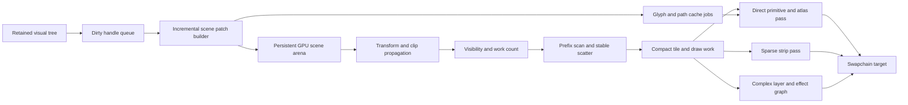

# Vello GPU Architecture Analysis and ProGPU 1000 FPS Scrolling Plan

Status: accepted architecture; implementation in progress  
Research date: 2026-07-18  
ProGPU revision: `f5ca7c51dbcd9ab6cdd7614c199d4e9a3673562e`  
Vello revision inspected: `8ecea46dc79bbb10315c101f9dbd0955c627dab8` (2026-07-16)

## Executive decision

ProGPU should not replace its renderer wholesale with Vello's classic compute pipeline. The highest-value change for scrolling is to stop recompiling and re-uploading a mostly unchanged retained scene when a scroll transform or a small virtualized range changes. The recommended architecture is a retained GPU scene with stable object handles, transform indirection, incremental patch uploads, GPU visibility compaction, and indirect or render-bundle replay.

Vello provides two useful but different reference designs:

1. Classic Vello encodes an immediate scene into compact streams and processes the whole scene through GPU reductions, prefix scans, curve flattening, clipping, binning, tile allocation, path tiling, coarse command generation, and fine compute rasterization.
2. The newer Vello sparse-strip/hybrid renderer deliberately moves curve flattening, tiling, sorting, and analytic coverage generation to SIMD CPU code, uploads only sparse 4-pixel-high coverage strips, and uses conventional instanced vertex/fragment rendering and texture atlases. This work is still marked as under active development and not production-ready in Vello's own repository.

ProGPU should adopt the transferable ideas from both:

- From classic Vello: compact scene streams, prefix-scan-based allocation, stable painter-order binning, tile-level work generation, indirect sizing, and avoiding full intermediate coverage textures.
- From sparse Vello: specialize common rectangles, keep sparse edge coverage rather than rasterizing full path bounds, use CPU SIMD when it is cheaper than a chain of small compute dispatches, separate fast source-over rendering from expensive layer/compositing paths, and cache glyphs in a managed multi-page atlas.
- From ProGPU's existing architecture: keep retained visual identity, exact invalidation, shaped glyph indices and positions, physical-DPI rasterization, four-way text subpixel snapping, calibrated vector-glyph quality, analytic primitive fast paths, static DXF buffers, and compiled-scene correctness.

The first implementation milestone is therefore not a new full-screen compute rasterizer. It is an incremental retained scene and one-submit frame graph. The experimental `WavefrontVectorEngine` should not become the default in its current form: it recreates large buffers, uploads all cached curves and BVHs, bins with work proportional to screen cells times instances, caps a cell at 64 instances, copies the full target, and performs per-pixel BVH traversal. Those costs and limits conflict with a 1 ms frame budget.

## What “1000 FPS” must mean

At 1000 FPS, a frame has a 1.000 ms throughput interval. A CPU counter that calls `QueueSubmit` 1000 times per second does not prove 1000 completed frames. Likewise, a 120 Hz display cannot visibly present 1000 distinct frames per second even with VSync disabled.

The target must be qualified as follows:

- Reference workload: deterministic continuous scroll on every scrollable sample page, at a fixed window size, DPI, content, scroll delta, and quality configuration.
- Reference targets: named desktop GPU/driver and browser/WebGPU implementation. Results from different physical framebuffer sizes are not directly comparable.
- Throughput: at least 1000 GPU-completed frames per second over a 10-second measured interval after warmup.
- CPU pacing: submitted-frame interval p95 no greater than 1.000 ms and p99 no greater than 1.250 ms.
- GPU duration: timestamped GPU work p95 no greater than 0.850 ms, leaving scheduling margin.
- Queue depth: no more than two uncompleted frames. A deeper queue is latency hiding, not sustained performance proof.
- Quality: identical framebuffer size, sample count, coverage grid, glyph phase policy, DPI, color space, blending, clipping, and texture sampling to the protected reference.
- Correctness: each measured frame must advance the scroll state and produce the expected realized range and visible content. Replaying a stale frame is a failure.
- Startup: first interactive frame and first scroll response need separate cold metrics; warm throughput must not be achieved by moving an unbounded stall into page activation.

This is a reference-machine engineering target, not a hardware-independent API guarantee. A 1200 x 800 RGBA target requires at least 3.84 GB/s merely to write every pixel 1000 times per second. A 2400 x 1600 Retina target requires 15.36 GB/s before reads, blending, overdraw, atlas traffic, and presentation. GPU-heavy sample shaders may be fundamentally fill-rate bound at their full quality settings. The benchmark must report physical pixels and bytes written so an impossible bandwidth configuration is identified rather than “fixed” by reducing quality.

## Current measured baseline

The following desktop measurements were taken from the stated ProGPU revision on 2026-07-18 with Release binaries, VSync disabled, 120 warmup frames, 360 measured frames, scrolling enabled, and a 40 logical-pixel step.

| Page | Wall FPS | Wall interval | Compile | Upload | CPU render/submit recording | Surface acquire | Allocation/frame | Required speedup |
| --- | ---: | ---: | ---: | ---: | ---: | ---: | ---: | ---: |
| Data Virtualization | 355.65 | 2.812 ms | 1.8296 ms | 0.1011 ms | 0.1636 ms | 0.6464 ms | 30,188 B | 2.81x |
| Inter Typeface | 430.15 | 2.325 ms | 0.9391 ms | 0.1064 ms | 0.1189 ms | 0.9374 ms | 18,105 B | 2.32x |
| Font Glyph Browser | 314.17 | 3.183 ms | 2.0805 ms | 0.1061 ms | 0.2299 ms | 0.4148 ms | 100,836 B | 3.18x |

All three workloads reported `sceneCacheHits=0` with `Root version changed`. The glyph browser rendered 42 realized cells, changed neither glyph-atlas generation nor path-atlas generation, and performed no glyph evictions or clears during the measured interval. This is strong evidence that its steady-state problem is retained-scene recompilation, container/text work, and command rebuilding rather than glyph rasterization capacity.

These measurements are CPU-side phase timings. `RenderPassTimeMs` currently measures command recording, finish, and submission work, not timestamped GPU execution. The first task is to add completed-GPU timing before attributing the remaining wall time.

The first Phase 0 instrumentation pass added explicit queue-completion accounting and exposed a tail that the averages concealed. A 360-frame Data Virtualization run completed 359 measured GPU submissions at about 376 completed frames/s, reached three frames in flight, and had 2.66 ms surface-acquire p95 despite only 0.62 ms average acquire time. The benchmark now reports submitted and completed rates separately, p50/p95/p99/max CPU intervals, physical target dimensions, DPI, queue depth, and a schema-versioned JSON record. Timestamp queries are capability-gated and use a non-blocking triple readback ring; an adapter returning invalid zero timestamp pairs is reported as failed samples rather than a fictitious zero-cost GPU frame.

The canonical process-isolated desktop sweep is:

```bash
eng/progpu-benchmark-pages.sh --all
```

It reads `eng/performance/sample-pages.txt`, launches every page in its own Release process, and writes complete logs plus JSONL and CSV artifacts. A source test requires the manifest order to match the actual navigation declarations so newly added pages cannot silently escape the performance sweep.

### Proposed 1 ms throughput budget

CPU and GPU work can overlap, so the following are parallel budgets rather than values to add naively.

| Lane | p95 target | Required behavior |
| --- | ---: | --- |
| Input, animation, and layout | 0.080 ms | Scroll transform update is O(1); virtualization changes only entering/leaving containers |
| Scene patch production | 0.100 ms | No root traversal; encode dirty handles and changed ranges only |
| Queue writes and staging | 0.080 ms | Persistent ring buffers; coalesced dirty ranges; no whole-scene upload |
| Command encoding and submit | 0.120 ms | One encoder and one normal queue submission; render bundles or indirect replay |
| Surface acquire and present CPU | 0.150 ms | Non-blocking present mode where supported; bounded queue depth |
| CPU scheduling and safety margin | 0.120 ms | Includes AOT/browser call overhead and diagnostics-off bookkeeping |
| GPU scene preparation | 0.150 ms | Transform propagation, culling, prefix scans, and compact work generation |
| GPU raster and composite | 0.600 ms | Sparse coverage, atlas sampling, clipping, and final target writes |
| GPU safety margin | 0.100 ms | Driver variance and timestamp uncertainty |

The current surface-acquire measurements alone exceed the target on some workloads. Scene optimization is necessary but insufficient; swapchain pacing, queue depth, and GPU completion must also be profiled.

## Vello classic compute architecture

### Compact scene encoding

Vello records drawing operations into linear buffers rather than an object graph. Its encoding contains path tags, path data, transforms, styles, draw tags, draw data, and resources. Path tags describe segment type, transform changes, path boundaries, styles, and compact i16/f32 data selection. Glyph runs are resolved into cached glyph outline encodings and inserted into the same path/draw streams.

This design provides:

- Dense sequential uploads.
- Integer offsets instead of pointer-rich scene traversal.
- A representation that GPU scans can decode in parallel.
- One vector pipeline for fills, strokes, clips, and outline glyphs.

The tradeoff is that an immediate scene is normally repacked and processed again for a changed frame. ProGPU can use the same compactness without giving up retained identity by storing immutable encoded fragments in a persistent GPU arena and patching only changed headers, transforms, or fragment ranges.

### Prefix-scan foundation

Many vector tasks appear sequential: determine the path and transform for each tag, allocate variable numbers of lines or tiles, match clip push/pop operations, and preserve painter order. Vello expresses these as associative monoids plus parallel reductions and scans.

The principal scan stages are:

- `pathtag_reduce` and `pathtag_scan`: derive exclusive prefixes for transform index, segment index/data offset, style index, and path index.
- `draw_reduce` and `draw_leaf`: derive draw-data offsets and decode draw objects in parallel.
- `clip_reduce` and `clip_leaf`: use a bicyclic semigroup and scans to match clip stack structure and propagate clip bounds.
- Tile and backdrop scans: allocate variable tile ranges and propagate winding/backdrop values across tile rows.

The important architectural lesson is not the exact shader count. It is that allocation and stream decoding remain linear work with bounded intermediate storage and no CPU readback in the common path.

### Curve flattening

Vello's `flatten.wgsl` decodes compact path segments in parallel, applies transforms, expands strokes, emits caps and joins, and produces a line soup. It uses adaptive curve logic, including Euler-spiral-based cubic/stroke handling, and atomically allocates the emitted line ranges. Per-path bounds are updated with atomic min/max.

This stage is more complete than ProGPU's current experimental wavefront flattener, which uses a stored fixed subdivision count and rewrites all cached raw curves every frame. Vello also treats flattening as only the first sparse stage; it does not ask every output pixel to traverse every candidate path's BVH.

### Draw decoding, clipping, and binning

Vello derives draw bounds, intersects them with clip bounds, and bins draw objects into coarse screen bins while preserving draw order. Its binning shader processes 256 draw objects per workgroup, builds shared-memory bitmaps of bin coverage, uses population counts to determine per-bin allocation, reserves output with atomics, and writes object indices in stable bit order.

This is materially different from ProGPU's experimental wavefront binner:

- Vello's cost follows draw coverage and chunked bin work.
- The current ProGPU wavefront shader launches over screen grid cells and loops over every instance in every cell, giving O(grid cells x instances) tests.
- Vello allocates variable-length bin lists with overflow detection.
- The current ProGPU wavefront path gives every cell a fixed capacity of 64 and silently cannot represent arbitrary overlap.

### Tiles, line-to-tile subdivision, and backdrop

Vello allocates a rectangular tile range for each path. A first line-processing pass counts how many path segments touch each tile and records winding/backdrop changes. An indirect setup pass sizes later work. A second pass clips and writes tile-relative segments. A row scan accumulates backdrop so a tile can determine whether it starts inside a non-zero/even-odd fill even when no edge crosses that tile.

Separating counting from writing is central:

1. Count variable output.
2. Prefix-scan or atomically reserve exact storage.
3. Write compact output.
4. Dispatch later stages indirectly from the generated count.

ProGPU's atlases instead dispatch over every pixel in each allocated glyph/path rectangle and test that pixel against the outline records. This is excellent when the coverage is reused many times, but it performs unnecessary cold work for a large path with a sparse edge and it creates phase/scale variants.

### Coarse command generation and fine rasterization

Vello's coarse stage walks binned draw objects for each tile and emits a compact per-tile command list for fills, gradients, images, clips, layers, and blends. The fine compute shader then executes the tile command list and writes the output image. Anti-aliasing can use area coverage or configured multisampling variants.

The classic design avoids an intermediate full-frame mask texture: line/tile data and per-tile commands are the intermediates. It also means a frame can require a long dependency chain of compute dispatches. That chain is appropriate for a large, dynamic vector scene but can cost more than direct retained replay for a small UI frame whose only mutation is one scroll matrix.

### Dynamic memory and failure handling

Vello uses a bump-allocation buffer and stage failure flags. Robust rendering can inspect allocation requirements and retry with larger buffers. This avoids fixed per-cell limits, but it can introduce readback/retry complexity. ProGPU should use grow-only capacity prediction and previous-frame high-water marks for normal frames, reserve explicit emergency headroom, and fail visibly after one bounded retry rather than silently dropping work.

## Vello sparse-strip and hybrid architecture

The newer sparse renderer is not simply “Vello with fewer compute shaders.” It is a different workload split.

### CPU path processing

`StripGenerator` performs these operations on the CPU:

1. Flatten a fill or stroke with a default 0.1 tolerance and viewport/clip culling.
2. Convert lines into analytic-AA tiles.
3. Sort tiles.
4. Render only necessary coverage into strips and an 8-bit alpha buffer.
5. Optionally intersect generated strips with a clip-path strip representation.

The current tile is 4 x 4 pixels. A strip stores a compact x/y location and an alpha-buffer index plus a fill-gap flag. Fully covered horizontal gaps can be represented without dense alpha values. Pixel-aligned rectangles bypass path flattening, tiling, and strip generation entirely.

The implementation reuses `Vec` capacity, flattening context, stroke context, temporary strip storage, and tile storage across resets. SIMD level selection is explicit. These details matter as much as the algorithm: a sparse representation does not help if every frame allocates new lists.

### Fast source-over path and coarse/layer path

Vello Hybrid exposes three modes:

- `FastOnly`: no pushed layers; strips go directly to a fast buffer and bypass coarse rasterization.
- `Interleaved`: default source-over root content can use the fast path while nested layers use coarse processing.
- `CoarseOnly`: non-default root blending requires the full coarse/layer path.

This is a useful model for ProGPU. Most sample UI content is ordinary source-over rectangles, text, icons, and clipped scrolling. It should not pay the machinery required for arbitrary blend layers. Complex masks, filters, and WPF shader effects can remain explicit frame-graph branches.

### GPU strip rendering

The sparse-strip shader uses instanced quads. Each instance contains packed position, widths, alpha-column index or rectangle fractions, paint payload, paint/type flags, and painter-order depth. The fragment shader samples compact alpha data for edge strips and handles solid gaps, images, gradients, blend slots, and analytic rectangles. Opaque and alpha strips are drawn in separate passes where valid.

This trades a long compute chain for:

- CPU SIMD geometry preparation.
- Compact alpha and instance uploads.
- A small number of conventional render passes.
- No compute-shader requirement, allowing WebGL fallback.

Its current implementation still contains acknowledged optimization work, including whole-alpha-buffer uploads and some per-pass buffer recreation. ProGPU should copy the architecture, not those temporary limitations.

### Current Vello Hybrid glyph path

Current Vello Hybrid integrates `glifo` glyph preparation and a glyph atlas:

- A glyph preparation cache reuses parsed/processed glyph data.
- Vector glyph commands can be replayed into atlas layers.
- Bitmap glyph uploads are queued separately.
- Glyph atlas maintenance performs eviction and region clearing.
- A multi-atlas manager can grow texture-array layers within configured limits.
- Cached glyphs are sampled as images during ordinary scene rendering.

This is closer to ProGPU's existing glyph atlas than classic Vello's historical “glyph outlines as ordinary scene fragments” path. ProGPU already has stronger protected quality rules for physical-DPI size, local/device fractional phases, vector fallback, and color glyphs. The useful additions are multi-page residency, unified cache maintenance, batched atlas work in the main frame graph, and separating glyph preparation from per-frame instance placement.

## ProGPU architecture today

### Retained visual tree and CPU compilation

`Compositor.RenderSceneCore` checks a whole-scene cache keyed by root identity/version, logical and physical target size, viewport, DPI, glyph/path atlas generations, tooltips, external layers, and cached layer state. A hit reuses CPU vertex/index/instance lists and GPU buffers. A miss clears the lists, recursively traverses the root, external layers, and tooltip, compiles commands, rebuilds draw calls, and writes the complete dynamic buffers.

This design is very fast for an unchanged static page, but it is binary: reuse the entire compiled scene or rebuild it. Scrolling advances the root `ChangeVersion`, so a one-matrix change invalidates reuse of all unrelated compiled work.

### Main vector and text paths

Ordinary ProGPU rendering is a conventional render pass:

- Vector paths are sampled from a compute-generated coverage atlas and drawn as indexed quads/geometry.
- Text is drawn as instanced glyph quads from a glyph atlas.
- Rectangles, rounded rectangles, ellipses, lines, meshes, textures, charts, static DXF buffers, clips, masks, effects, and extension pipelines have specialized compilation paths.
- Draw calls are replayed in painter order with pipeline, mask, blend, texture, scissor, and buffer state changes.

The architecture already avoids several common text regressions: shaped glyph indices are retained, common glyph runs are batched, outlines are cached, color/bitmap fallbacks are separate, and vector glyph coverage uses bounded phase/scale quantization.

### Path atlas

`PathAtlas.RasterizePendingPaths` batches pending outlines into shared record and segment uploads, sorts work by raster dimensions, groups equal workgroup dimensions, uses the dispatch z dimension for multiple paths, records one compute pass, and submits one path-atlas command buffer. This is substantially better than one submission per path.

Remaining costs include:

- Temporary GPU buffers for uniforms, records, and segments per pending batch.
- A bind group per raster-size dispatch group.
- A separate command encoder and queue submission before the compositor submission.
- Full rectangle coverage work for each new scale/phase variant.
- Atlas packing, generation, and bounded-capacity recovery complexity.

### Glyph atlas

The glyph atlas keeps per-font GPU outline buffers and lazily compiles visible glyphs. A frame batch shares one command encoder and uniform ring, but each new glyph creates a bind group, begins and ends a compute pass, and dispatches separately. The glyph batch is then submitted separately from the main compositor. The immediate fallback path creates a uniform buffer, bind group, encoder, pass, and submission for one glyph.

The measured glyph scrolling workload had no new atlas generations or evictions, so these cold costs are not its current steady bottleneck. They still affect startup, font/size sweeps, and fast scrolling into unseen glyph ranges.

### Experimental wavefront engine

The optional wavefront engine caches CPU BVHs and curve records but currently performs the following each frame:

- Disposes and recreates BVH, raw-curve, flattened-line, instance, grid-cell, and grid-index GPU buffers.
- Uploads all cached BVH nodes and raw curves, not only changes.
- Flattens all raw curves again.
- Bins by launching over grid cells and scanning every instance per cell.
- Keeps only 64 instance indices per cell.
- Copies the full intermediate texture.
- Launches one invocation per destination pixel; each pixel loops candidate shapes, transforms to local coordinates, traverses a depth-16 BVH stack, computes winding and minimum distance over flattened lines, and blends.
- Creates three bind groups every frame and performs a final texture composite pass.

The engine demonstrates GPU curve and shape processing, but its algorithms are not a route to 1000 FPS for ordinary UI. Its binner is O(T x I), where T is grid cells and I is instances, and its fine stage has divergent per-pixel BVH work. It should remain experimental until replaced by count/scan/scatter binning and sparse tile work.

## Architecture comparison

| Concern | Vello classic | Vello sparse/hybrid | ProGPU today | Recommended ProGPU |
| --- | --- | --- | --- | --- |
| Scene ownership | Immediate linear encoding | Immediate CPU scene/strip storage | Retained visual tree, whole-scene compiled cache | Retained tree plus persistent linear GPU fragments and stable handles |
| Small transform change | Reprocess encoded scene | Regenerate affected CPU strips unless caller caches | Root cache miss can rebuild all commands | Patch one transform; reuse geometry, glyph runs, bins where valid |
| Stream decoding | GPU monoid scans | Direct CPU structures | Recursive CPU traversal and command switch | CPU dirty-fragment encoding; GPU scan only for variable work |
| Curve processing | Adaptive GPU flattening | SIMD CPU flattening | CPU outline compilation plus atlas compute; experimental fixed GPU subdivisions | Adaptive router: cached atlas, SIMD sparse strips, or full compute by workload |
| Binning | Shared bitmaps, popcount, stable output | CPU tile creation/sort | CPU draw batching; experimental O(T x I) grid scan | Stable block/bin count-scan-scatter with indirect work |
| Raster representation | Tile segments and commands | 4 x 4 sparse alpha strips | Full glyph/path atlas rectangles | Keep atlas for reusable small assets; strips for cold/sparse/dynamic paths |
| Fine rendering | Compute writes output image | Instanced vertex/fragment strips | Instanced glyphs and indexed vector/texture draws | Conventional fast path plus compute only when it reduces total work |
| Glyphs | Cached outline encodings inserted into vector scene | Prep cache plus multi-page glyph atlas | Single glyph atlas plus vector/path fallback | Multi-page atlas, retained run instances, batched jobs, preserved ProGPU phase quality |
| Clipping | GPU clip scans and tile commands | CPU strip intersection and coarse layers | Rect scissor, geometry masks, mask passes | Rect clip metadata fast path; cached clip masks; GPU clip graph only for complex stacks |
| Memory | Dynamic bump buffers and robust retry | Reused CPU storage plus alpha/instance buffers | Dynamic whole-scene buffers, temporary atlas buffers | Persistent grow-only arenas, dirty range uploads, bounded rings, explicit retry |
| Submission | Many compute stages in recording | Few render passes plus atlas work | Glyph submit + path submit + main submit possible | One normal frame encoder and one submit; exceptional external upload lane only |
| Browser | WebGPU compute required | WebGPU/WebGL compatible | WebGPU browser worker/AOT path | Same retained packet format; compute feature tiers and transfer-free fast path |
| Quality risks | Compute AA differs from native text | CPU strip quantization/atlas text | Strong protected DPI/phase/coverage contracts | Keep current quality policy and validate every new representation pixel-wise |

## Root causes of the current scrolling gap

### 1. Whole-scene invalidation is too coarse

The current cache is all-or-nothing. Scrolling changes the root version and causes recursive compilation, list rebuilding, brush/gradient reconstruction, draw-call reconstruction, complete dynamic buffer writes, and repeated state replay. This accounts for 0.94-2.08 ms average compile time in the three measured workloads and much larger maximums.

### 2. Geometry and placement are coupled

Most scroll content does not change geometry, glyph selection, brush, or local layout on every pixel. Only an ancestor translation and visible range change. Today compiled vertices often contain final positions, so placement changes force geometry/instance rebuilding. Placement must move to a transform table indexed by retained draw items.

### 3. Virtualization avoids large trees but still rebuilds active output

The data and glyph pages realize a bounded number of containers, which is correct, but every scroll step still rebinds or recompiles all active containers. Recycling must retain container render fragments, glyph runs, brushes, and buffer slices. Only data for newly entered rows/cells should change.

### 4. Multiple atlas and compositor submissions serialize startup work

New glyph and path coverage can be submitted before the main frame in separate command buffers. Queue order makes this correct, but command creation, submission, and resource lifetime overhead are material at a 1 ms target, particularly in browser WebGPU.

### 5. CPU timings do not expose GPU saturation

The compositor's current “render” metric stops after submission. It cannot distinguish GPU raster time, queue wait, swapchain wait, or CPU API overhead. Surface acquire varies from 0.41 to 0.94 ms in the measured pages, suggesting the CPU may already be pacing behind prior GPU work.

### 6. Draw replay remains CPU-driven

Even when buffers are reusable, the compositor loops through draw calls and issues pipeline/bind/scissor/draw calls each frame. Static render bundles or GPU-generated indirect argument ranges can make scroll replay proportional to material/pass count rather than visual count.

### 7. Current wavefront algorithms create more work than they remove

Full-screen per-pixel BVH traversal is poorly matched to sparse UI edges and glyph quads. Buffer recreation and complete geometry upload erase retention benefits. The experimental path must not be used as evidence that a compute-centered architecture is inherently faster or slower; its present algorithms are the limiting factor.

## Target architecture



### Persistent retained scene arena

Introduce stable IDs for compiled subtrees and draw fragments:

- `VisualHandle`: stable visual identity and parent/child relation.
- `TransformHandle`: local transform, opacity, and scroll offset, stored separately from geometry.
- `ClipHandle`: rect clip or complex clip graph reference.
- `GeometryHandle`: immutable primitive/path/mesh fragment.
- `TextRunHandle`: shaped glyph IDs, local positions, font/style key, and atlas references.
- `PaintHandle`: solid, gradient, image, or effect data.
- `DrawItemHandle`: painter-order link to geometry/text, transform, clip, paint, and bounds.

GPU storage is append/grow-oriented with a free-list and generation in each handle. A mutation writes only a compact `ScenePatch` record or dirty byte range. Reuse is no longer invalidated merely because an ancestor changed version.

Suggested patch operations:

- `CreateFragment(handle, payloadRange)`
- `UpdateTransform(handle, matrix, opacity)`
- `UpdateClip(handle, clipData)`
- `UpdatePaint(handle, paintData)`
- `ReplaceTextInstances(handle, glyphRange)`
- `SetVisibility(handle, flags)`
- `SetOrder(handle, stableOrderKey)`
- `DestroyFragment(handle, generation)`

Scroll updates should normally emit one `UpdateTransform` and no geometry/text upload. Virtualized boundary crossings create or rebind only the entering containers.

### Transform and clip indirection

Vertices and glyph instances remain in local coordinates. Draw metadata indexes a transform buffer. The GPU composes ancestor transforms either:

- on the CPU for the small dirty ancestor chain and uploads a final matrix; or
- in a compute pass for large transform hierarchies using depth buckets.

The first implementation should use CPU-composed dirty transforms because scroll normally changes one ancestor and all descendants can reference that one scroll transform. A general GPU hierarchy pass should be added only when profiling shows it is cheaper.

Rect clips remain compact scissor/bounds metadata. Complex geometry clips reference cached masks or clip fragments. A scroll transform changes the clip's placement handle, not the mask content.

### Stable visibility compaction

For each draw item, a compute or SIMD CPU stage evaluates transformed bounds against the viewport/clip and writes a 0/1 visibility count. An exclusive prefix scan produces compact indices. Painter order is preserved because stable input order maps monotonically through the scan.

Complexity:

- Visibility: O(D) work for D candidate draw items.
- Scan: O(D) total work and O(log D) parallel depth.
- Scatter: O(D) work, O(V) output for V visible items.
- Storage: O(D) flags/prefixes plus O(V) compact indices.

Small scenes should bypass compute and replay a cached render bundle. A dispatch threshold must be selected from benchmarks; compute startup is not free.

### Stable tile binning

For large or dynamic vector fragments, use a painter-order-preserving block/bin algorithm inspired by Vello:

1. Process draw items in fixed blocks of 256.
2. Compute transformed bounds and the covered coarse bins.
3. Build per-block shared-memory coverage bitmaps.
4. Popcount coverage to get each `(block, bin)` count.
5. Exclusive-scan counts to reserve exact bin storage.
6. Scatter set bits in ascending local draw order.
7. Process block ranges in ascending block order during coarse generation.

This avoids the current wavefront O(T x I) loop and fixed 64-item cell cap while preserving source-over painter order. Overflow is explicit and recoverable.

### Adaptive vector route

One vector representation is not optimal for every workload. Choose at retained-fragment creation or when scale/animation characteristics change.

1. Direct analytic primitives: rectangles, rounded rectangles, ellipses, simple lines, and blurred rounded rectangles. No atlas allocation.
2. Reusable coverage atlas: small stable paths, icons, and glyphs rendered repeatedly at stable size/phase. Preserve current high-quality 8 x 8 coverage and bounded phase policy.
3. Sparse strips: cold paths, large sparse outlines, dynamic strokes, or paths that would allocate a large mostly empty atlas rectangle. Generate 4 x 4 analytic-AA strips with SIMD CPU first; add a GPU generator only after the format and quality are validated.
4. Full compute tile pipeline: very large dynamic vector scenes where CPU strip generation or upload dominates. Use scan/bin/tile/coarse stages patterned after Vello, dispatched indirectly.
5. Static geometry buffers: DXF and other stable large scenes with only camera transform changes. Keep geometry resident and update only camera/viewport data.

The router must be telemetry-driven. Record path bounds area, segment count, edge-density estimate, reuse count, distinct phase/scale count, atlas residency cost, strip byte count, and measured cold generation cost.

### One-submit frame graph

Normal rendering should use one command encoder and one queue submission:

1. Copy or queue-write scene patch ranges before encoding.
2. Encode pending glyph/path atlas compute passes into the main encoder.
3. Encode transform/cull/scan/bin compute passes if required.
4. Encode masks/layers/effects according to explicit dependencies.
5. Encode direct primitive, atlas, strip, texture, and extension render passes.
6. Resolve timestamps and submit once.

`GlyphAtlas` and `PathAtlas` should accept an existing encoder and frame-lifetime allocator. Their transient buffers become slices of persistent rings. Bind groups should be persistent per buffer generation or use dynamic offsets, not created per glyph or raster-size group.

### Retained draw replay

Use two replay paths:

- Render bundles for truly stable pass segments whose pipeline, bind groups, buffers, and draw ranges are unchanged.
- Indirect draws or compact instance ranges for segments whose visible set changes.

Because WebGPU multi-draw-indirect support varies, the portable base should group compatible items into a small number of instanced draws. Optional device features can enable multi-draw or subgroup-optimized scans but must not change output.

## Detailed implementation plan

### Phase 0: trustworthy performance instrumentation

Deliverables:

1. Add WebGPU timestamp query sets around atlas raster, scene preparation, mask/effect passes, vector/text/strip passes, and final composite.
2. Resolve timestamp data through a triple-buffered readback ring so measurement never waits in the current frame.
3. Add a submitted/completed frame sequence using queue completion callbacks or fences. Record maximum queue depth and completion interval.
4. Split CPU metrics into scene patch, full compile fallback, buffer write, encoder creation, each pass's recording, finish, submit, acquire, and present.
5. Record physical target size, DPI, color format, sample count, bytes uploaded, atlas jobs, dispatches, passes, bind changes, draw calls, visible items, and dirty handles.
6. Extend `SamplePerformanceBenchmark` to output JSON/CSV as well as the existing line format and compute p50/p95/p99/max.
7. Add an automated page manifest that visits every sample page and applies a page-specific deterministic scroll/action script. A page without scrolling gets a deterministic animation or retained replay workload and is labeled separately.
8. Add cold-start gates: process start to first surface, first correct text frame, first page frame, and first scroll frame.

Likely files:

- `src/ProGPU.Scene/Compositor.cs`
- `src/ProGPU.Scene/CompositorHostFrame.cs`
- `src/ProGPU.Samples/SamplePerformanceBenchmark.cs`
- `src/ProGPU.Backend/WgpuContext.cs` and query/fence wrappers
- new `src/ProGPU.Backend/GpuTimestampRing.cs`
- new benchmark scripts under `scripts/performance/`

Exit criteria:

- Completed-GPU FPS and CPU-submitted FPS are reported separately.
- Measurement overhead is below 1% when disabled and below 3% when enabled.
- Replaying a stale frame or letting queue depth exceed two fails the benchmark.
- Baselines are stored for desktop Release, browser Release, and browser AOT.

### Phase 1: incremental retained scene fragments

Deliverables:

1. Add `CompiledVisualFragment` with stable handles for local draw items, transforms, clips, paints, and text runs.
2. Classify invalidation into structure, geometry, text layout, paint, transform, clip, opacity, visibility, and resource changes.
3. Maintain a compositor dirty-handle queue. Propagate root `ChangeVersion` for correctness, but do not use it as the only compiled-scene reuse decision.
4. Compile a visual only when its relevant fragment version changes. Reuse descendant fragments through ancestor transform changes.
5. Store scroll translation in a transform handle shared by the scroll content subtree.
6. Preserve virtualization container fragment identity when recycling. Rebind text/data only for entering containers and retain local buffers for unchanged cells.
7. Keep the current whole-scene cache as a fallback and correctness oracle during rollout.

Likely files:

- `src/ProGPU.Scene/Visual.cs`
- `src/ProGPU.Scene/ContainerVisual.cs`
- `src/ProGPU.Scene/Compositor.cs`
- new `src/ProGPU.Scene/CompiledVisualFragment.cs`
- new `src/ProGPU.Scene/SceneInvalidationKind.cs`
- `src/ProGPU.WinUI/Controls/ScrollViewer.cs`
- `src/ProGPU.WinUI/Controls/ItemsControl.cs`
- virtualization panels and recycler implementations

Exit criteria on the three blocker pages:

- A sub-row scroll produces O(1) transform patches and no full tree traversal.
- A virtualization boundary crossing recompiles only entering/leaving containers.
- Average scene patch CPU time is at most 0.100 ms; p99 at most 0.250 ms.
- Steady allocation is below 1 KiB/frame on desktop and below 2 KiB/frame in browser AOT.
- Pixel output matches the existing compositor for 1000 randomized scroll positions.

### Phase 2: persistent GPU arenas and one-submit atlas integration

Deliverables:

1. Add grow-only, generation-tracked GPU arenas for vector vertices/indices, glyph instances, textures, paints, transforms, clips, and draw metadata.
2. Use two- or three-frame ring slices for transient patch, job, scan, and indirect buffers. Grow on capacity failure; never recreate at the current size each frame.
3. Change `PathAtlas.RasterizePendingPaths` to record into a caller-supplied encoder and use ring slices for uniform/record/segment data.
4. Replace per-dispatch path bind groups with one persistent bind group plus dynamic offsets or a job-record storage buffer.
5. Replace per-glyph passes with a batched glyph job buffer. Group equal dispatch dimensions and use z for job index, or dispatch over a flat work queue that maps workgroups to glyph tiles.
6. Record glyph and path work before the render pass in the main encoder. Remove normal-frame atlas queue submissions.
7. Keep an explicit immediate upload API only for operations that truly occur outside a compositor frame.
8. Precreate pipelines, bind-group layouts, samplers, and common bind groups during controlled warmup. Browser AOT must not compile shader variants during scrolling.

Likely files:

- `src/ProGPU.Backend/GpuBuffer.cs`
- new `src/ProGPU.Backend/GpuArena.cs`
- new `src/ProGPU.Backend/GpuFrameRing.cs`
- `src/ProGPU.Vector/PathAtlas.cs`
- `src/ProGPU.Text/GlyphAtlas.cs`
- `src/ProGPU.Scene/Compositor.cs`
- `src/ProGPU.Backend/Shaders/PathRasterizer.wgsl`
- `src/ProGPU.Backend/Shaders/GlyphRasterizer.wgsl`

Exit criteria:

- One queue submission for an ordinary frame, including new glyph/path coverage.
- Zero buffer or bind-group creation during steady scrolling.
- No full-scene dynamic buffer writes for transform-only frames.
- Atlas cold-fill quality is byte-identical to the protected reference.
- First unseen glyph/path batch is at least 2x faster without increasing warm frame cost.

### Phase 3: GPU visibility, prefix scan, and portable indirect replay

Deliverables:

1. Add a reusable scan library with count, hierarchical reduce, exclusive scan, and scatter stages. Provide a portable WGSL path and optional subgroup specialization.
2. Add visibility flags for transformed draw bounds and clip bounds.
3. Compact visible items stably into material/pass ranges.
4. Generate instance counts and indirect arguments on GPU where supported.
5. Provide a render-bundle fallback for stable segments and a CPU-compacted fallback for small scenes or missing indirect features.
6. Add counters that choose CPU versus GPU compaction using measured prior-frame cost and hysteresis, not a hardcoded assumption.

New shaders must follow the repository shader contract and include algorithm, time complexity, space complexity, workgroup size, fixed bounds, numerical assumptions, and bandwidth notes.

Likely files:

- new `src/ProGPU.Compute/Shaders/ScanReduce.wgsl`
- new `src/ProGPU.Compute/Shaders/ScanAdd.wgsl`
- new `src/ProGPU.Compute/Shaders/SceneCull.wgsl`
- new `src/ProGPU.Compute/Shaders/SceneScatter.wgsl`
- new `src/ProGPU.Compute/GpuPrefixScan.cs`
- new `src/ProGPU.Scene/GpuSceneArena.cs`
- `src/ProGPU.Scene/Compositor.cs`

Exit criteria:

- Stable order is proven against CPU painter-order replay for randomized overlap scenes.
- Scan/count output is validated for zero, one, non-power-of-two, large, and overflow inputs.
- GPU compaction plus draw recording is below 0.150 ms p95 on the reference target.
- Small scenes do not regress; the router selects cached replay when compute overhead is higher.

### Phase 4: replace the current wavefront binner with sparse tile work

Deliverables:

1. Stop recreating wavefront GPU buffers. Convert all geometry, line, instance, bin, and work queues to persistent arenas.
2. Replace cell-centric `for each instance` binning with stable block/bin count-scan-scatter.
3. Remove the fixed 64-shape cell limit and add explicit capacity accounting.
4. Replace full-screen per-pixel BVH traversal with tile work that visits only edge segments and solid interior spans.
5. Add indirect setup stages so path count determines tile/segment/coarse work without CPU readback.
6. Remove the full-window background copy when source-over rendering can target the destination directly. Keep explicit layer inputs only for blend modes that need destination reads.
7. Use adaptive curve flattening and retain flattened geometry until geometry or scale tolerance changes.
8. Compare three representations per workload: existing coverage atlas, CPU sparse strips, and GPU tile pipeline.

Recommended staging:

- 4A: implement the stable binner and persistent memory while retaining a debug-only fine path.
- 4B: implement CPU SIMD 4 x 4 sparse strips and an instanced strip renderer.
- 4C: implement GPU line-to-tile count/write/backdrop/coarse stages for large dynamic scenes.
- 4D: delete or rename the old experimental wavefront mode after all feature/quality tests pass.

Likely files:

- `src/ProGPU.Compute/WavefrontVectorEngine.cs`
- `src/ProGPU.Compute/Shaders/Wavefront.wgsl`
- new `src/ProGPU.Vector/SparseStrips/`
- new `src/ProGPU.Compute/Shaders/VectorBin*.wgsl`
- new `src/ProGPU.Compute/Shaders/VectorTile*.wgsl`
- new `src/ProGPU.Scene/Shaders/SparseStrip.wgsl`

Exit criteria:

- No O(screen cells x instances) pass.
- No hard overlap cap and no silent geometry drop.
- Dynamic vector test scenes beat the existing atlas path only where the adaptive router selects them.
- DXF pan/zoom remains transform-only after static compilation.
- Precise half-open winding and all path atlas stress tests remain unchanged or gain equivalent tests for the new path.

### Phase 5: glyph system for instant startup and scrolling

Deliverables:

1. Keep shaping and glyph selection separate from raster placement. A `TextRunHandle` stores shaped glyph indices and local positions once.
2. Store glyph run instances persistently; scroll and ancestor animation update transform handles only.
3. Add a glyph preparation cache keyed by typeface identity, glyph ID, variation coordinates, synthetic style, and outline transform. Cache raw outline records independently from raster size/phase.
4. Replace the single atlas with a bounded texture-array multi-page atlas where supported. Use generation-safe page/slot handles and clock/LRU eviction without clearing unrelated pages.
5. Batch new glyph jobs by font data and raster dimensions in the main encoder.
6. Prefetch only the visible plus overscan glyph range after layout, using bounded background CPU preparation and UI-thread-safe publication. Do not enumerate whole fonts.
7. Preserve the four physical subpixel positions for ordinary glyph atlas text and the existing 128 local x 16 device-phase bounded vector fallback policy.
8. Route large, transformed, gradient, color, bitmap, CFF, and unsupported glyphs through their existing quality-preserving paths until a new representation passes pixel tests.
9. Add atlas-residency telemetry per page: hit rate, job count, pixels rasterized, page growth, eviction, fallback count, and wasted shelf area.

Likely files:

- `src/ProGPU.Text/GlyphAtlas.cs`
- font manager and glyph outline cache files
- `src/ProGPU.Scene/Compositor.cs`
- `src/ProGPU.Scene/Shaders/RetainedGlyph.wgsl`
- text layout/run controls in `src/ProGPU.WinUI/`
- browser font resource loading path

Exit criteria:

- Font Glyph Browser steady scrolling performs no shaping, outline extraction, atlas job, or glyph instance rebuild for already prepared cells.
- Inter Typeface retains all OpenType/variation/layout behavior and visual quality.
- First-use glyph work is batched and bounded; page activation remains interactive.
- Glyph browser average scene patch plus CPU recording is below 0.200 ms before surface acquire.
- Existing glyph, fractional transform, CFF, SVG/color, and Skia comparison tests pass pixel thresholds.

### Phase 6: fast-path controls and virtualization

Rendering changes cannot compensate for unnecessary control work. Apply these page-level rules:

1. `ScrollViewer` changes a compositor transform and scroll state, not every descendant offset.
2. Virtualizing panels update realization only when the visible index range changes; fractional scrolling inside an item is transform-only.
3. Recycled containers retain visual fragments and binding delegates. State refresh updates existing text/paint handles in place.
4. Text controls retain shaped runs and positioned glyph arrays until content, font, width, or relevant layout state changes.
5. Hover, selection, caret, and diagnostics update only their own retained overlay fragments.
6. Navigation retains page and visual identity; inactive pages may release GPU residency through an explicit policy, not tree reconstruction on every switch.
7. Status/FPS text remains rate-limited and outside the measured content path.

Page-specific expectations:

| Page class | Expected steady mutation |
| --- | --- |
| Data virtualization | One scroll transform; occasional entering/leaving row patches |
| Font glyph browser | One scroll transform; occasional recycled cell glyph-handle changes |
| Inter showcase and text documents | One scroll transform; no reshape or inline reconstruction |
| Markdown and code editor | One scroll transform; token/layout work only on content or width changes |
| DXF, SVG, picture, drawing context | Camera/root transform only for pan/zoom; static GPU geometry/texture residency |
| Charts and MotionMark | Patch changed series/group buffers only; indirect visible counts |
| Effects and ShaderToy | Uniform/time patch; GPU cost reported separately as fill/effect bound |
| Static controls/settings pages | Cached replay or render bundle; no visual-tree compile |

Exit criteria:

- Each page has a documented mutation model and benchmark invariant.
- No page unconditionally invalidates its root from `OnRender`.
- No page rebuilds text inlines, bindings, or child collections per scroll frame.
- Data/glyph realization state is validated throughout the benchmark, not only at the end.

### Phase 7: browser AOT transport and WebGPU pacing

Deliverables:

1. Keep the browser worker path in Release AOT and measure JS, WASM, worker, and WebGPU API time separately.
2. Encode scene patches in a binary typed packet with stable opcodes and offsets. Do not serialize retained scene state as objects or strings.
3. Reuse packet and typed-array storage. Use transferable buffers; enable a `SharedArrayBuffer` ring only when COOP/COEP deployment requirements are satisfied, with a tested transfer fallback.
4. Coalesce transform updates so only the latest scroll position is rendered when input outruns the bounded two-frame GPU queue.
5. Prewarm all required shader/pipeline variants before benchmark measurement without blocking first content display.
6. Detect timestamp-query and subgroup features. Use portable fallbacks and label results when exact GPU timestamps are unavailable.
7. Measure surface acquire separately from prior-frame GPU completion. Test immediate/mailbox/FIFO present modes where the platform exposes them; never report queued frames as completed FPS.
8. Keep file picker and browser platform services outside render hot paths.

Exit criteria:

- No per-frame managed/JS object graph allocation for scene transport.
- Normal scrolling uploads only patch bytes, not complete vertex/glyph buffers.
- Browser AOT output passes the same visual regression suite through Playwright/browser screenshots.
- Queue depth remains at most two and interaction always advances to the newest requested scroll state.

### Phase 8: rollout, feature parity, and removal of old paths

1. Introduce options independently: incremental fragments, persistent arenas, single-submit atlas, GPU compaction, sparse strips, and compute tiles.
2. Run A/B rendering into two offscreen targets in tests and compare pixels and command invariants.
3. Default-enable a feature only after it improves its target workload and does not regress small/static workloads by more than 3%.
4. Keep a reference CPU/compiler path until all render command types, clips, effects, color glyphs, and platform backends have coverage.
5. Remove obsolete paths only after desktop, headless, browser non-AOT, and browser AOT gates pass.

## Shader and algorithm specifications

### Prefix scan

Portable base:

- Workgroup size: 256 unless device limits or benchmarks select another compiled variant.
- Each invocation loads one or multiple adjacent values into workgroup memory.
- Perform an inclusive workgroup scan, write the exclusive result, and emit one block sum.
- Recursively scan block sums, then add scanned block offsets.
- For small inputs, run one workgroup and skip hierarchy buffers.

Complexity:

- Work: O(N).
- Parallel depth: O(log N) per hierarchy level.
- Storage: O(N) output plus O(N/256 + ...) block sums.
- Bandwidth: at least one input read and one output write, plus hierarchy traffic.

Tests must include overflow behavior. Counts use u32 only when maximum output is proven; otherwise use checked CPU capacity plus explicit GPU failure flags.

### Stable bin construction

The algorithm must preserve painter order. A naive atomic append from arbitrary invocations is incorrect because fragment blend order is observable.

Use fixed draw blocks and deterministic local bit order. Per-bin headers contain total count and offset. Each block/bin pair receives a prefix offset derived in block order. Scatter enumerates local draw IDs in ascending order. Complexity is O(D + K) useful work plus coverage bookkeeping, where K is total draw-bin overlap.

### Sparse strip format

Start with Vello's proven 4-pixel tile/strip height concept but define a ProGPU-owned format:

- Packed u16 x/y.
- Packed u16 total width/dense alpha width.
- Alpha byte offset or texture column.
- Paint/clip/transform handles.
- Stable depth/order key.
- Flags for solid gap, analytic rectangle, mask source, and color source.

Alpha data should live in a persistent storage buffer or R8 texture selected by measured backend performance. A storage-buffer path avoids repacking to a 2D texture; an R8 texture may have better sampling/cache behavior. Both must produce the same coverage.

### Adaptive routing model

Initial deterministic rules should be conservative:

- Direct analytic path for supported primitives.
- Glyph atlas for ordinary solid outline text at supported sizes/phases.
- Existing path atlas when estimated atlas pixels are below a threshold and reuse count is at least two.
- CPU sparse strips when edge density is low, atlas bounds are large, or geometry changes but segment count is moderate.
- GPU tile pipeline when segment count and dynamic reuse make CPU generation/upload exceed the measured compute cost.

Collect telemetry, then tune thresholds per device class. Do not introduce an opaque machine-learning policy into correctness-sensitive routing.

## Verification matrix

### Performance gates

For every sample page and target:

- Cold page activation.
- First correct text/icon frame.
- Warm static replay.
- Continuous scroll/action throughput.
- Direction reversals and large scroll jumps.
- Resize and DPI change.
- Theme change.
- Atlas cold, warm, near-capacity, eviction, and reset conditions.
- Browser AOT and desktop Release.

Report:

- CPU submitted FPS and GPU completed FPS.
- p50/p95/p99/max frame interval.
- GPU timestamps by pass.
- Queue depth and surface wait.
- Bytes uploaded and allocated.
- Dirty handles and recompiled fragments.
- Draws, dispatches, passes, state changes, and visible items.
- Atlas hit/miss/job/eviction/generation metrics.
- Physical target pixels and estimated write bandwidth.

### Correctness and quality gates

- Existing `LayerRenderTests` and `CompositorReviewRegressionTests` cache/invalidation cases.
- Path/glyph atlas reset, repack, fractional phase, winding, and capacity stress tests.
- Text shaping tests for scripts, bidi, ligatures, kerning, variation axes, OpenType features, color glyphs, and fallback.
- Pixel comparisons against current ProGPU output and selected Skia/DirectWrite references at multiple DPI values.
- Clip stacks, opacity masks, blend modes, effects, cached layers, tooltips, and external layers.
- Randomized painter-order scenes to validate stable GPU compaction/binning.
- DXF pan/zoom cursor anchoring and zoom-to-fit regression coverage.
- Browser screenshots and interactive scroll assertions via Playwright.

No performance result is accepted if it changes framebuffer size, drops a frame update, disables required invalidation, lowers coverage samples, changes font phase/DPI rules, or omits a command type.

## Recommended execution order

1. Instrument completed GPU work and all-page deterministic benchmarks.
2. Implement incremental visual fragments and transform indirection.
3. Fix virtualization/control mutation models so scroll is O(1) between realization boundaries.
4. Move buffers to persistent arenas and merge glyph/path/main work into one submission.
5. Add retained bundles and stable visibility compaction.
6. Implement CPU SIMD sparse strips and compare them with the existing atlas on real workloads.
7. Replace the experimental wavefront bin/fine algorithms with stable tile work only for workloads that prove a benefit.
8. Expand the glyph atlas to multi-page residency and batch cold jobs.
9. Optimize browser AOT packet transport and swapchain pacing.
10. Qualify 1000 completed FPS page by page without reducing quality.

The expected largest early gain is Phase 1: the measured blocker pages need roughly 2.3x-3.2x speedups, and 0.94-2.08 ms is currently spent compiling scenes that are mostly unchanged. Eliminating that work is more likely to reach the target than adding a full compute pipeline whose dispatch chain still processes the entire scene. The later Vello-inspired GPU stages are necessary for large dynamic vectors and for reducing CPU draw replay, but they should be introduced after retention makes the intended work set small.

## Research sources

Primary source snapshot:

- [Vello repository and README](https://github.com/linebender/vello/tree/8ecea46dc79bbb10315c101f9dbd0955c627dab8)
- [Vello architecture](https://github.com/linebender/vello/blob/8ecea46dc79bbb10315c101f9dbd0955c627dab8/doc/ARCHITECTURE.md)
- [Classic Vello render graph construction](https://github.com/linebender/vello/blob/8ecea46dc79bbb10315c101f9dbd0955c627dab8/vello/src/render.rs)
- [Vello scene encoding](https://github.com/linebender/vello/blob/8ecea46dc79bbb10315c101f9dbd0955c627dab8/vello_encoding/src/encoding.rs)
- [Path-tag scan shader](https://github.com/linebender/vello/blob/8ecea46dc79bbb10315c101f9dbd0955c627dab8/vello_shaders/shader/pathtag_scan.wgsl)
- [Curve flattening shader](https://github.com/linebender/vello/blob/8ecea46dc79bbb10315c101f9dbd0955c627dab8/vello_shaders/shader/flatten.wgsl)
- [Stable binning shader](https://github.com/linebender/vello/blob/8ecea46dc79bbb10315c101f9dbd0955c627dab8/vello_shaders/shader/binning.wgsl)
- [Tile allocation shader](https://github.com/linebender/vello/blob/8ecea46dc79bbb10315c101f9dbd0955c627dab8/vello_shaders/shader/tile_alloc.wgsl)
- [Line-to-tile count shader](https://github.com/linebender/vello/blob/8ecea46dc79bbb10315c101f9dbd0955c627dab8/vello_shaders/shader/path_count.wgsl)
- [Path tiling shader](https://github.com/linebender/vello/blob/8ecea46dc79bbb10315c101f9dbd0955c627dab8/vello_shaders/shader/path_tiling.wgsl)
- [Coarse shader](https://github.com/linebender/vello/blob/8ecea46dc79bbb10315c101f9dbd0955c627dab8/vello_shaders/shader/coarse.wgsl)
- [Fine compute rasterizer](https://github.com/linebender/vello/blob/8ecea46dc79bbb10315c101f9dbd0955c627dab8/vello_shaders/shader/fine.wgsl)
- [Sparse-strip project status and design](https://github.com/linebender/vello/blob/8ecea46dc79bbb10315c101f9dbd0955c627dab8/sparse_strips/README.md)
- [Sparse strip generation](https://github.com/linebender/vello/blob/8ecea46dc79bbb10315c101f9dbd0955c627dab8/sparse_strips/vello_common/src/strip_generator.rs)
- [Sparse strip representation and analytic coverage](https://github.com/linebender/vello/blob/8ecea46dc79bbb10315c101f9dbd0955c627dab8/sparse_strips/vello_common/src/strip.rs)
- [Hybrid scene fast/coarse modes](https://github.com/linebender/vello/blob/8ecea46dc79bbb10315c101f9dbd0955c627dab8/sparse_strips/vello_hybrid/src/scene.rs)
- [Sparse strip GPU shader](https://github.com/linebender/vello/blob/8ecea46dc79bbb10315c101f9dbd0955c627dab8/sparse_strips/vello_sparse_shaders/shaders/render_strips.wgsl)
- [Current Vello Hybrid glyph atlas integration](https://github.com/linebender/vello/blob/8ecea46dc79bbb10315c101f9dbd0955c627dab8/sparse_strips/vello_hybrid/src/text.rs)
- [GPU-friendly stroke expansion paper](https://arxiv.org/abs/2405.00127)

Local ProGPU evidence inspected:

- `src/ProGPU.Scene/Compositor.cs`
- `src/ProGPU.Vector/PathAtlas.cs`
- `src/ProGPU.Text/GlyphAtlas.cs`
- `src/ProGPU.Backend/Shaders/PathRasterizer.wgsl`
- `src/ProGPU.Backend/Shaders/GlyphRasterizer.wgsl`
- `src/ProGPU.Compute/WavefrontVectorEngine.cs`
- `src/ProGPU.Compute/Shaders/Wavefront.wgsl`
- `src/ProGPU.Samples/SamplePerformanceBenchmark.cs`
