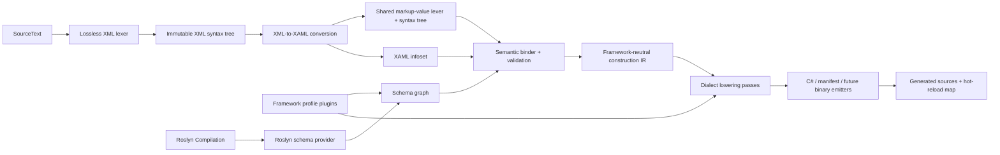

# ProGPU XAML Compiler Architecture

## Design goals

The compiler is a reusable Roslyn-based language platform, not a WinUI-specific file-to-string utility. Framework-neutral layers own XAML syntax, XML-to-XAML conversion, schema contracts, validation, bound nodes, construction IR, incremental identities, and extension hosting while directly reusing Roslyn text, spans, locations, diagnostics, annotations, symbols, compilations, and workspaces. Framework packages contribute vocabulary and lowering behavior.

## Pipeline

## Layer contracts

### 1. Text and lossless XML syntax

Roslyn `SourceText` owns decoded text, line mapping, content checksums, and text changes. `XamlSyntaxToken` covers the complete input. The published syntax tree follows Roslyn green/red conventions. XML names and raw token text are preserved; XAML meaning is not assigned here.

Roslyn's C# and Visual Basic `SyntaxNode` implementations cannot be subclassed by an external language because their required `GreenNode` constructor contract is internal. ProGPU therefore provides an isomorphic XAML green/red model and adapters using Roslyn `SourceText`, `TextSpan`, `Location`, `Diagnostic`, and `SyntaxAnnotation` directly.

### 2. XAML infoset

This layer implements MS-XAML section 8. It produces document, object, member, and text information items with retrieved-object state and namespace snapshots. It owns property-element recognition, content wrapping, effective XML namespace/`xml:space` evidence, and markup-extension dispatch. It retains whitespace-only text as lexical information; schema-dependent deletion or normalization cannot occur here because no type symbol is available.

No Roslyn symbol appears here.

### 2A. Shared markup-value language service

Attribute/text values that select markup syntax are parsed by a second, reusable language service in the `netstandard2.0` core. It consumes a Roslyn `SourceText` slice and produces a lossless immutable token stream plus recursive extension/value syntax. Tokens retain absolute spans into the owning XAML document and materialize text only on demand. The standard lexer is an index-based single pass with bounded recursion, cancellation, and configurable limits; it uses no regular expressions and performs no framework binding.

The standard grammar owns braces, separators, assignments, quoting, escaping, trivia, positional/named arguments, nesting, missing/skipped tokens, and recovery. `XamlMarkupLanguage` is the immutable source-generator-safe registry for genuinely new root value languages. Each `IXamlMarkupSyntaxPlugin` declares contract/implementation versions, trigger characters, contexts, precedence, associativity, conflict policy, and capabilities. Token recognizers are folded into the same trigger index. A recognized custom form must project into the canonical `XamlMarkupExtension` tree; the normal infoset and Roslyn-backed compiler pipeline therefore remain unchanged. Higher priority is deterministic, incompatible equal-priority matches are `PGXAML1154`, explicitly coalescible equivalent projections may share a result, and custom generator output is reparsed and structurally compared before publication. Framework and user packages contribute deterministic registrations at later seams:

1. trigger-indexed token or value recognizers for genuinely new lexical forms;
2. parser rules with declared context, precedence, version, and conflict behavior;
3. binders resolving syntax to Roslyn-backed schema symbols;
4. validation/lowering rules for resources, bindings, template binding, compiled expressions, or custom extensions;
5. formatter, generator, and conservative inverse-edit rules.

The current registry implements token recognition, root parsing, canonical projection, infoset dispatch, inverse formatting, and grammar-validated generation. The first independent downstream seam is the Roslyn markup-expression extension host described under construction IR. Custom nested-node kinds, operator parser rules, semantic binder/validator registration, general IR transforms, statement/unit/shared-output emitters, project package discovery, and inverse document edits remain later versioned seams; callers must not infer those capabilities from syntax registration alone.

WinUI `Binding`, `x:Bind`, `StaticResource`, and `ThemeResource`; WPF/Avalonia binding paths; MAUI markup extensions; and third-party syntax therefore share tokenization, trees, diagnostics, editing, and tests while retaining distinct semantics. Source-generator hosts load only the core parser. Workspace formatting and document editing remain separate so they do not inflate analyzer startup.

Document parser options are validated and copied before lexing, so mutable caller state cannot alter a published tree or its changed-text reparse. All cardinality and length bounds are positive; extension lists reject null entries; configurable document nesting is additionally capped at 1,024 to bound the current recursive structure parser independently of caller input. Cancellation is polled both at stage boundaries and inside long-token/declaration/entity loops. Recovery remains lossless: even fuzzed malformed input reconstructs from non-EOF tokens, while diagnostic count and tree construction stay within the snapshotted limits. The initial allocation gate covers a one-megabyte text token with a 32-byte-per-source-character ceiling; broader grammar-aware fuzzing and measured sustained throughput percentiles remain active gate work.

`XamlDocumentInspectionService` is the framework-neutral authoring projection over these two canonical stages. It parses and converts once, then iteratively publishes immutable syntax, lossless-token, infoset, and diagnostic entry sequences with exact `TextSpan` values, nullable stable IDs where the underlying node has one, total counts, and explicit truncation. Projection cardinality and preview length have validated hard ceilings, long source-token previews materialize only their bounded prefix, and every traversal polls cancellation. The service intentionally stops before schema binding: playgrounds and lightweight editors can inspect malformed XAML without a Roslyn `Compilation`, workspace, framework profile, or runtime assembly.

Compilation results retain the accepted transformed `XamlConstructionProgram` that was handed to structured Roslyn generation. `RoslynXamlCompilationInspectionService` projects that exact program's resolved bound graph, enriched resource graph, transformed IR, diagnostics, and generated `SyntaxTree` identities; it never rebinds or relowers a parallel display-only graph. Traversal is iterative, reference-cycle safe, cancellable, and independently bounded per pane. The standalone CLI and playground consume this service. The playground caches one base compilation over trusted-platform metadata and explicitly owned assemblies, then `RoslynXamlPreviewHostFactory` reads the canonical infoset, resolves the edited root through `IXamlTypeSystem`, and creates the qualified `x:Class`, exact base type, and public `InitializeComponent` constructor entirely with `SyntaxFactory`. Classless or invalid hosts remain inspectable and expose actionable materialization status. Every emitter and synthesized-host tree carries the host `CSharpParseOptions`; language version, feature flags, documentation mode, and preprocessor symbols therefore stay compatible without C# text round-tripping. Edits schedule a 300 ms versioned background inspection; every newer edit cancels its predecessor, only the latest version may marshal results to the UI dispatcher, the explicit button bypasses the delay, and page unload cancels retained work. Its Hot Reload pane observes the existing typed `HotReloadManager` lifecycle/result/diagnostic events, shows runtime support and generation counters, marshals updates through the UI dispatcher, and unsubscribes on unload.

`RoslynXamlProjectPreviewService` is the Workspaces-layer adapter for a real immutable Roslyn `Project`. It accepts a XAML `AdditionalDocument` and optional unsaved `SourceText`, obtains the project's C# compilation, removes reserved prior ProGPU generator trees, and leaves the owning `Workspace` untouched. It prepares every recognized sibling XAML document in deterministic logical-path order, uses one semantic resource project index, emits each document with the shared profile/options pipeline, retains the target's exact compilation inspection, and aggregates every structured generated tree into one in-memory artifact. This is necessary because sibling code-behind constructors depend on their own generated partial members even when only one page is being previewed. The CLI `preview` command opens the project with the established `MSBuildWorkspace` policy, adds an out-of-project file only to the immutable snapshot when needed, reports human or JSON status, and atomically moves the completed PE into place. The compiler service itself performs no dynamic load or UI mutation.

`RoslynXamlProjectDeltaService` compares two of those immutable snapshots. Canonical project-logical resource URIs identify documents; source checksums expose lexical changes; structured generated Roslyn roots, dependency slices, and diagnostic shapes determine semantic equivalence. Canonical infoset stable IDs and `XamlProjectionMap` annotations expose added, removed, retained, and modified identities without treating a line or offset as object identity. The resulting immutable plan separates syntax-only, XAML-only, metadata-only, and combined changes. A target or imported provider change schedules replacement, an unrelated sibling change remains visible to tooling without churning the target, and an unavailable artifact or changed qualified target retains the last good tree.

`RoslynXamlPreviewArtifactCompiler` is the last framework-neutral preview stage. It eagerly snapshots the exact generated syntax-tree set, adds those trees to the host `CSharpCompilation`, and emits an in-memory PE; generated source text is display-only and is never reparsed. Execution begins only in a framework tooling adapter. `WinUiXamlLivePreviewSession` checks dynamic-code support, loads a fully emitted candidate into a collectible context, performs the single documented tooling-only type-activation reflection call, verifies `FrameworkElement`, and then delegates replacement to `HotReloadManager.ReloadElement`. That manager uses the same state/focus/lifecycle/invalidation path as normal metadata hot reload and rolls back a failed publication. The playground leaves this path disabled until an explicit button grants permission for the page session; revocation and unload cancel pending work, detach the root, and release the context. AOT-only hosts keep every non-executable inspection pane.

For a metadata-bearing project delta, the WinUI adapter preserves the compiler/runtime transaction boundary: it materializes and validates the collectible candidate first, invokes the caller-supplied metadata coordinator second, and only then publishes through `HotReloadManager`. A missing or throwing coordinator, failed candidate, or failed canonical replacement unloads the unpublished candidate and leaves the current root and its context intact. This is an initial whole-root fallback; namescope-aware in-place patching and Roslyn metadata-delta production remain later layers over the same plan.

Custom delimiter pairs use the same parser rather than a dialect fork. `XamlMarkupParseOptions.BracketPairs` drives a stack-resident tracker whose backing closing-character array is allocated lazily only after an opening delimiter appears. Nested heterogeneous pairs suppress comma/equal grammar until closed, retain all token spans, and obey the common depth bound. `XamlMarkupBracketPolicy` translates validated member schema into parser options. Infoset conversion propagates explicitly supplied options and retains the decoded root markup value. During semantic binding, `IXamlMarkupBracketPairResolver` resolves each root or nested extension and exact named member through the canonical type system, selects only that member's validated pairs, and re-projects the schema-correct tree once while preserving document locations and stable root identity. The incremental generator and workspace pipeline therefore receive exact-member behavior automatically; applying every pair globally is forbidden because it could reinterpret unrelated arguments.

### 3. Schema graph and type systems

The core graph models schemas, types, members, constructors, text syntax, directives, compatibility, and assignability. `IXamlTypeSystem` is a provider facade. The Roslyn implementation maps `ITypeSymbol`/`ISymbol` data into canonical neutral descriptors. Text syntax is an immutable section 5.4 descriptor with fixed-value/pattern policy and optional canonical converter symbol; a member descriptor may override its value type's syntax.

Profiles can layer projected metadata over symbols. This is required for WinRT projections, WPF attached members, Avalonia styled/direct properties, MAUI bindable properties, and user-defined conventions.

Profiles may also publish synthetic schema types for vocabulary concepts that intentionally have no public constructible CLR type. These descriptors carry provider-qualified identity, namespace/name identity, markup-extension classification, return type, neutral constructor signatures, and canonical named-member descriptors. A genuine Roslyn symbol may be used as a compile-time value/assignability anchor, but no fake `ISymbol` is manufactured for a vocabulary declaration that has no CLR declaration. Descriptor identity therefore remains stable independently of nullable symbol evidence. WinUI resource, binding, template-binding, relative-source, and `x:Bind` vocabulary resolves through the same type/member-reference and diagnostic paths as CLR-backed vocabulary. Binding and resource semantics remain explicit profile lowering capabilities.

`XamlIntrinsicSchema` is the canonical bootstrap data for language/XML directives and allowed XML locations. XML conversion consults it to distinguish directives from ordinary intrinsic members and to synthesize pseudo-members such as `x:Initialization`. The Roslyn schema provider publishes constructor/default-constructibility metadata. A framework-neutral, bounded, cancellation-aware type-name parser handles recursive XAML type syntax for `x:Type` and `x:TypeArguments`; the Roslyn provider resolves generic definitions by arity and returns canonical constructed symbols. Binding resolves type/static/factory values and validates array elements, generic construction, constraints, and construction signatures; IR retains initialization, array, constructor, factory, and constructed-type semantics so emission never reconstructs them from strings. Constraint validation currently covers direct special and concrete constraints; constraints requiring type-parameter substitution remain an explicit maturity gate.

Intrinsic scalar and enumeration text is validated in binding against the effective descriptor, with diagnostics addressed to sections 6.2.2.5 or 6.3.2.4. `TypeConverterAttribute` on a type or member is read as Roslyn `AttributeData`; the converter must resolve to a public, non-abstract `TypeConverter` with an exact public parameterless constructor and public `ConvertFromInvariantString(string)` method. `XamlCreateFromStringShapeInfo` carries those symbols through `XamlBoundText` and `XamlIrText`, and C# emission constructs the typed invocation directly with `SyntaxFactory`. Profile literal conversion remains a declared fallback for framework syntaxes not yet projected into schema data.

Value serialization is a distinct save-path contract. `ValueSerializerAttribute` never changes load-path text syntax. Its annotation provider declares registered serializer bases, context types, and callable names. `XamlValueSerializerShapeInfo` on a type or member retains the canonical annotation, serializer/constructor/capability/conversion symbols, candidates, context type, provider provenance, null-suppression state, and error evidence. `RoslynXamlValueSerializerSyntaxFactory` emits exact symbol-derived `CanConvertToString` and `ConvertToString` calls with typed argument casts for writers and bidirectional tooling; it does not load assemblies, invoke reflection, or parse generated C# text.

Whitespace and construction-order annotations are canonical schema data. `XamlSchemaBooleanInfo` retains the effective value and exact annotation evidence for trim-surrounding-whitespace, whitespace-significant-collection, and usable-during-initialization semantics, including inherited origin and explicit derived `false`. Element-content binding performs schema-aware normalization only after member and collection types resolve. The default path maps XAML whitespace to spaces, collapses runs, removes boundary whitespace, drops lexical indentation around object content, retains normalized whitespace items only for significant collections, and trims both sides of annotated child objects. Inherited `xml:space="preserve"` bypasses normalization while `"default"` resets it. The bound value stores `OriginalText` and semantic `Text`; the infoset and source span remain unchanged. Structural validation and initial-directive ordering ignore whitespace-only implicit members. Usable-during-initialization is retained for the object-writer scheduling layer; merely discovering the attribute never silently reorders construction.

Content wrappers are repeatable inherited collection schema, represented by `XamlContentWrapperShapeInfo`. The descriptor retains its annotation/provider, wrapper type, public parameterless constructor, content member, content value type, and invalid evidence. Validation proves that the wrapper is constructible, assignable to the collection insertion type, and has a writable or mutable content member before binding can use it. Collection binding first preserves directly assignable content, then selects an exact or unique most-specific wrapper for foreign text/object content. It synthesizes an ordinary bound wrapper object and content member with deterministic derived stable IDs. Lowering and emission require no special wrapper opcode: the normal typed object-construction, assignment, and collection-add paths consume the canonical descriptors and Roslyn symbols. Invalid, unavailable, or ambiguous wrappers remain diagnostics rather than dynamic fallback.

Constructor-argument metadata is directional save-path evidence. `XamlConstructorArgumentShapeInfo` lives on the member descriptor and retains the exact annotation/provider, argument name, public single-argument constructor, matching parameter, all named candidates, and malformed evidence. Validation requires a public read/write property and symbol-equal parameter type. Ordinary XAML loading continues to bind and lower the property as a normal assignment; the annotation cannot silently replace it with a constructor call. Writers and inverse-edit providers may explicitly choose the round-trip constructor representation through `RoslynXamlConstructorArgumentSyntaxFactory`, which creates typed object construction and casts the value to the selected parameter symbol without reflection or parsing C# text.

Ambient metadata is canonical context-flow evidence. Types and members retain their own `XamlSchemaBooleanInfo`; effective member ambience is the union of a declared member/attached-getter annotation and an ambient resolved value type, matching the public `XamlMember.IsAmbient` contract. Getter and setter evidence for attached properties is composed into one member descriptor with getter precedence for identical single-valued contracts. `XamlAmbientContextGraphBuilder` projects the bound tree into immutable stable-ID contexts containing nearest-scope-first bound values, type/member origins, exact owner/member descriptors, and crossed deferred-member identities. It shares `XamlBoundMemberOrdering` with lowering so independent ordering and `DependsOn` edges cannot diverge, while all ambient values on an owner remain visible throughout that owner's nested schema scope for documented out-of-order qualification. The resource graph consumes the neutral subset it can prove: an effectively ambient dictionary-valued member creates a lexical resource scope when no explicit profile resource role overrides it. Other ambient values remain available for object-writer, converter, markup-extension, serializer, deferred-content, and editor consumers rather than being guessed into resource behavior.

Deferred-loader metadata is an executable typed schema shape, not an attribute label. `XamlDeferringLoaderShapeInfo` retains its exact annotation/provider, declared and resolved loader/content identities, public constructor, exact paired load/save methods, all named candidates, and errors. Both CLR-type and string-name attribute constructors converge on Roslyn symbols. The clean-room structural contract pairs the reader input with the save result, requires `IServiceProvider`, validates content acceptance and load result compatibility, and remains usable for independently implemented loaders without inspecting framework internals. Member metadata overrides value-type metadata. Effective deferred members accept their bound node stream, lower to `SetDeferredContent`, and create ambient-context boundaries. `RoslynXamlDeferringLoaderSyntaxFactory` produces typed load/save expressions from the selected symbols; framework profiles own reader/service materialization and runtime factory policy.

Repeatable markup-bracket annotations are canonical parser schema. `XamlMarkupBracketPairInfo` retains the full two-character annotation identity and provider on a member; complete repeatable-attribute identity prevents a conflicting second closer from being silently coalesced by its first constructor argument. Reserved grammar characters and one-opener/multiple-closer maps stay invalid descriptors and receive use-site diagnostics. The System.Xaml delimiter contract is also part of the shared attribute catalog so custom extensions can use it under any consuming framework profile when the defining assembly is referenced.

Language-directive aliases are symbol-backed schema rather than strings. `XamlAliasedMemberShapeInfo` retains the exact annotation/provider, direct property, or namescope attached owner/getter/setter. The binder projects `xml:lang` and `x:Uid` through the resolved canonical member and reports malformed metadata at the XAML use site. Namescope storage and namescope ownership remain separate: `NameScopePropertyAttribute` locates storage (including its public attached-owner form), while `XamlNameScopeShapeInfo` records a profile-declared exact interface or explicitly enabled duck-method identity. Interface identity wins over duck recognition. Only a valid shape starts a semantic scope boundary; the binder isolates duplicate-name and `x:Reference` validation within it.

Member ordering is also canonical schema. Each `XamlMemberDependencyInfo` retains the repeatable annotation and exact same-type dependency property. `XamlBoundMemberOrdering` performs the single stable topological sort used by construction lowering and ambient-context snapshots; the binder validates invalid edges and cycles from the same collection. No downstream stage reparses `DependsOn` strings or performs a second member-resolution policy.

Framework optimization annotations remain neutral typed data until a capable profile consumes them. `XamlMarkupExtensionOptionInfo` distinguishes Avalonia keyed and default option properties, retaining the exact property/annotation, typed constant, priority, and provider. `XamlMarkupExtensionOptionSelectorShapeInfo` retains an explicitly registered exact static Boolean selector, its option type, optional service-provider type, complete option/candidate collections, and provenance for both context-free and contextual signatures. The core validates malformed/conflicting metadata and callable shapes but does not know platform names or execute selectors. `IRoslynXamlMarkupExtensionOptionProfile` receives the canonical IR, descriptor, branch-value emitter, target/root context, and resource identity and may return a fully structured conditional expression; a concrete Avalonia profile owns evaluation order, service-provider construction, fallback, and trimming policy.

List-string grammars are canonical type metadata, not ad hoc converter behavior. `XamlListSplitInfo` corrects Avalonia's contract to an inherited class-only annotation, retains exact named-argument evidence and defaults, validates the collection shape and flags, and prepares longest-first first-character separator buckets once. Its reusable splitter returns normalized values, raw slices, and spans; the binder derives stable item nodes and sends them through the existing collection IR and structured insertion emitter.

Compiled-binding type flow is likewise canonical schema data. `XamlDataTypeSourceInfo`, `XamlDataTypeInheritanceInfo`, and `XamlItemsDataTypeInheritanceInfo` retain exact properties, constructor parameters, typed scope constants, optional ancestor types, and resolved ancestor-item properties. After semantic binding, `XamlDataTypeContextGraphBuilder` creates immutable stable-ID snapshots containing nearest-first explicit and item-derived bound values plus the exact scope request; no runtime framework object or reflection is required. `XamlBindingAssignmentInfo` is a separate lowering semantic. The core constructs the binding extension through ordinary object IR, and `IRoslynXamlBindingAssignmentProfile` publishes only a structured assignment statement, preventing the marked object from being accidentally invoked through normal markup-extension binding behavior.

Template-authoring metadata is a tooling projection over the same canonical Roslyn schema. `XamlTemplatePartInfo`, `XamlTemplateVisualStateInfo`, and `XamlStyleTypedPropertyInfo` normalize WinUI, WPF, and Avalonia public contracts while retaining exact declaring/property/type symbols and inheritance evidence. `XamlAttachedPropertyBrowseRuleInfo` retains the selected attached getter and target-type, logical-child, or attribute-presence constraint. These descriptors drive completion, validation, the playground, and future template analyzers; they do not alter object construction, attachable-member applicability, or emission.

Build metadata is a separate canonical projection, not generator glue. `IXamlBuildMetadataResolver` exposes exact assembly/module/type compilation-mode evidence, root namespaces, file identities, and repeatable resource identities, then returns one immutable `XamlDocumentBuildMetadata` for a physical document and optional `x:Class`. Resolution is host item metadata first, followed by class, module, and assembly annotations. The same result controls early `Skip`, root-qualified partial-class emission, semantic resource manifests, dependency identities, CLI manifests, and future hot reload. WinUI bindability and full-metadata-provider markers remain non-inherited type descriptors; they never imply construction behavior.

#### Attribute and shape convention engine

Attributes, framework projections, and duck-typed CLR shapes are schema inputs, not emitter special cases. Each profile exposes ordered `XamlSchemaAttributeRule` records and a `XamlSymbolShapePolicy`. Every policy carries an explicit `XamlSymbolShapeFeatures` declaration, so contributing object-writer handlers cannot implicitly replace a framework's attached-property, property-system, collection, resource, or markup-extension conventions. The Roslyn provider composes independent list families in priority/provider order and selects explicitly declared scalar and keyed-map entries by priority. Equivalent winners coalesce; incompatible equal-priority winners become canonical `XamlSymbolShapeConflictInfo` evidence and `PGXAML2049` document diagnostics rather than being silently accepted by provider-ID order. The Roslyn provider reads canonical `AttributeData` and symbols, then publishes neutral annotations and shape evidence on `XamlTypeInfo`/`XamlMemberInfo`. The policy also declares canonical types with framework initialization-text syntax, symbol-less pseudo content members, and whether getter-only attached collection inference is legal. These declarations become ordinary neutral descriptors before binding; the binder and emitter never test a WinUI, WPF, Avalonia, or MAUI type name.

Precedence is explicit attribute metadata, registered framework projection, registered symbol-shape rule, then profile fallback. Provider priority and stable provider ID order competing registrations; ambiguity is diagnosed. A shape rule validates the entire callable/member contract, including accessibility, static/instance form, arity, assignability, return type, collection insertion shape, and overload uniqueness. It never treats a matching name as sufficient evidence. A getter-only attached collection is represented as a retrievable attachable member only after its public static getter and returned collection shape pass those checks; generation invokes that typed getter and emits `Add` operations against its result.

Some XAML contracts intentionally describe a member that cannot be read or written from application code. `FrameworkTemplate` content is the canonical WinUI example: public metadata names a `Template` content member, but no CLR `Template` property exists. Profiles model this as a provider-qualified pseudo member with the neutral `DeferredContent` kind and `TemplateContent` semantic. Binding and IR preserve that fact as `SetDeferredContent`; no fake symbol or runtime property is invented. The core emitter now builds each factory body exclusively from Roslyn syntax in an isolated emission context, so named locals and reference fixups do not leak into the containing page. The profile publishes that lambda through a typed runtime call; WinUI materializes a fresh tree on every invocation and passes an explicit template-context parameter. The exact context type crosses semantic binding through `IXamlDeferredContentContextTypePolicy` and construction emission through `IXamlIrDeferredContentContextTypePolicy`; the core never searches for WinUI `ControlTemplate`, `TargetType`, or `TemplatedParent`. Explicit runtime namescope objects and hot-reload replacement inside materialized instances remain follow-up capabilities. Profiles without the lowering contract receive `PGXAML5001` rather than losing the subtree.

## Binding activation and lifetime

Ordinary `Binding` and compiled `x:Bind` are separate compiler features. Ordinary binding has an explicit synthetic-schema expression role, `XamlBoundBinding`, and `XamlIrBinding`; its original constructed extension remains the runtime descriptor. The bound node retains the shared lossless `XamlBindingPathSyntax`, an independent `XamlBindingSourceKind`, and an optional canonical source type. Lexical `x:DataType`, explicit literal values, exact `x:Static` members, exact resource-graph values, `RelativeSource Self`, namescope-resolved `ElementName`, and profile-resolved deferred-context sources are distinct. Explicit selectors always suppress lexical evidence. After first-pass binding, the semantic validator resolves forward/backward names and deferred factory contexts. Resource construction then produces the canonical immutable graph; `XamlResourceTypeEvidence` follows local definitions, alias chains, conditional candidates, and external semantic-manifest types without evaluating a resource, publishing a type only when all reachable candidates have the same Roslyn symbol. A second immutable enrichment pass rewrites only those explicit resource-source bindings and reuses the graph by replacing its bound-document reference; unresolved, cyclic, forward-disallowed, or mixed-type candidates remain runtime-resolved. Deferred/template boundaries prevent namescope leakage. WinUI classifies `RelativeSource TemplatedParent` and supplies the canonical `ControlTemplate.TargetType` through its contract, not a compiler-core special case. For a provable source, the neutral binder records an ordered `XamlBindingPathAccessor` sequence containing exact readable CLR member or mutable `IList<T>`/`IDictionary<string,T>` indexer symbols, source/value types, constant keys, and write evidence. `IRoslynXamlBindingAccessorRegistrationProfile` converts only that evidence to structured publication statements, while `IRoslynXamlOrdinaryBindingAssignmentProfile` converts the same canonical sequence into a framework-native immutable path plan. The WinUI profile emits deduplicated closed-generic static getter/setter delegates from Roslyn symbols into a checksum-named module initializer, and classless resource units compose the same statements with their existing module registration. Exact static sources are emitted as symbol-derived member access; resource sources retain the structured runtime lookup; self/template sources retain structured relative-source descriptors; and named sources retain the runtime `ElementName` descriptor. No member, indexer, name, resource value, or deferred context type is rediscovered during emission, and no C# fragment is assembled or reparsed.

The WinUI profile lowers the ordinary binding descriptor through a structured Roslyn `BindingOperations.SetBinding` invocation carrying target, target property, deferred-template context, and lexical lookup root. Descriptor containers are distinct: when the canonical target is `object`, `Binding`, or `BindingBase`, as with Fluent visual-state `Setter.Value`, the contextual profile emits the constructed descriptor itself and does not activate it against the setter. A deferred factory adds one explicit profile-created lifetime owner. `IRoslynXamlMarkupExtensionAssignmentProfile` reports whether an operation consumed that owner, while `IRoslynXamlDeferredMarkupExtensionLifecycleProfile` supplies structured preparation and finalization. The core aggregates this neutral evidence without knowing a framework extension or runtime type name; missing lifecycle support is `PGXAML3047`, missing accessor-publication support is `PGXAML3048`, and rejected ordinary assignment is `PGXAML3049`. `x:Bind` has its own `XamlBoundCompiledBinding` and `XamlIrCompiledBinding`. Its default source is the canonical Roslyn type named by `x:Class`; inside a scope carrying the profile-owned `x:DataType` directive, the source becomes that exact canonical Roslyn type and the generated deferred factory supplies its template-context object. The compiled member-access grammar records exact property/field, source-type, value-type, and write symbols for every step. Attached-property template bindings resolve the target and source dependency-property identifiers from their canonical declaring owners, so `AutomationProperties.Name` cannot degrade into an unrelated `FrameworkElement.Name` lookup.

Both runtime paths are reflection-free for members. Ordinary binding resolves dependency-object segments through registered dependency-property identity and CLR/indexer segments through `IBindingMemberAccessor`; generated module initialization publishes accessors before object construction, while explicit application registration remains an extension seam for runtime-only source types. Equivalent per-document registrations are idempotent in the exact-type/step registry. Fully typed generated bindings also receive immutable `BindingPathSegment` values, so WinUI evaluates member, integer-indexer, and string-indexer steps without splitting or reparsing the `Binding.Path` text. Indexer accessors listen to `INotifyCollectionChanged`, or indexer-related `INotifyPropertyChanged` as a fallback, rewire following member subscriptions, and retain TwoWay leaf writes. A class-backed unit now begins one ordinary-binding lifetime before construction and attaches it to the root only after content and generated fields commit; this delays initial namescope lookup until forward and backward named objects are reachable. Deferred factories use the same neutral lifecycle contract per materialization. Compiled property binding uses generated closed-generic `CompiledBindingPathSegment<TSource,TValue>` instances containing static typed accessors and the exact dependency-property identifier when present; no member registry lookup occurs. Both binding forms share constant integer/string syntax and exact mutable `IList<T>`/`IDictionary<string,T>` symbol resolution, but retain distinct ordinary-descriptor versus compiled-execution semantics. They deliberately do not infer mutable behavior from `IReadOnlyList<T>` or `IReadOnlyDictionary<TKey,TValue>`.

C#-style prefix casts, pathless casts, grouping parentheses, legacy qualified-member syntax, and terminal function calls share the same lossless grammar. The parser flattens grouped casts into evaluation-order steps but does not resolve types or decide whether `value.(Owner.Member)` is an attached member or a legacy cast/member form. The neutral binder resolves the qualified type through the lexical XAML namespace map, validates the exact Roslyn explicit conversion, and first asks the active schema for a canonical attachable getter/setter shape. A valid attachable getter becomes one exact-symbol segment with an optional setter and property-system identifier; otherwise the binder requires a valid cast plus readable instance member. WinUI emits `CompiledBindingCastPathSegment<TSource,TValue>` for explicit casts and typed static getter/setter invocations for attached members.

Function syntax retains a terminal method name, optional XAML-qualified static owner, and typed path/string/finite-number/language-Boolean arguments. The binder selects one exact accessible Roslyn method, retains its parameter symbols, and binds every path argument independently from the compiled-binding root. Emission builds the exact invocation, casts, literals, owner access, and dependency arrays directly with `SyntaxFactory`. `CompiledBindingFunctionPathSegment<TSource,TValue>` reevaluates one typed delegate and subscribes the method-name notification plus every owner/argument path; intermediate replacement causes the outer expression to dispose and rebuild those subscriptions. Work is `O(S + D)` per evaluation/rewire for `S` emitted access steps and `D` dependency steps, with bounded subscription storage and no runtime reflection.

`CompiledBindingExpression` rewires nested `INotifyPropertyChanged`, dependency-property, collection, or function-dependency subscriptions and performs OneTime/OneWay/TwoWay and BindBack updates. The compiler aggregates every class-backed property or event `x:Bind` and asks `IRoslynXamlCompiledBindingLifecycleProfile` for structured lifecycle member/prepare/initialize syntax. WinUI exposes one public `ICompiledBindings Bindings` property. `InitializeComponent` clears the prior source group, begins a deferred group, creates targets and expressions, commits names/content, and finally calls `Bindings.Initialize()`. Initial getters and listener attachment therefore occur once after construction. `StopTracking()` detaches without discarding expressions; `Update()` refreshes and reattaches; hot reload disposes the prior group before publishing a replacement. Each controller retains the exact group identity rather than just the page identity, so an externally retained pre-reload controller cannot mutate the replacement group. Direct runtime callers that do not begin a generated group retain immediate activation. A source-declared `Bindings` member is rejected before duplicate C# can be emitted.

Compiled event binding resolves one unambiguous compatible method symbol and emits an event lambda that reevaluates the typed owner path, including supported indexer and cast steps, when the event occurs without installing source tracking. Event-only pages still receive the documented lifecycle property, although the group has no tracked property expressions. WinUI declares OneTime as the property-binding default, while `x:DefaultBindMode`, `x:DataType`, and compiled-path delimiter policy are profile-owned.

Binding ownership is scoped as well as weak. Replacing or clearing a binding disposes its subscriptions. Page/control compiled-binding expressions are grouped by their generated source root; generated `InitializeComponent` clears that group before publishing a replacement tree, preventing OneWay/TwoWay handlers on a live page from retaining stale hot-reload targets. Each deferred factory containing ordinary `Binding` or `x:Bind` begins an ownerless group before target construction, passes that exact owner to every corresponding generated `SetBinding`, and attaches it transactionally to the completed root. `IXamlTemplateLifetime` is the public extensibility boundary, and `XamlTemplateFactory` maintains an ordered composite per root so ordinary, compiled, framework, and user-extension lifetimes coexist. Ordinary expressions defer target evaluation and listener installation until attachment; the explicit factory context is the source fallback when the new element has no data context. The root/lifetime association is independent from the data context, so any number of roots may track the same item. `Unloaded`, direct host replacement, and subtree replacement dispose only the registered lifetimes being removed in reverse attachment order; other materializations remain active. Subtree release is `O(V + B)` for `V` removed visuals and `B` bindings with `O(V)` bounded traversal storage. Typed `TemplateBinding` instances remain grouped by their templated parent. Reapplying a control template clears ordinary/template groups and compiled groups before detaching the old tree. Dependency-property callback lists use copy-on-write arrays: registration/removal allocates a new snapshot, while notification walks a stable immutable snapshot without per-notification allocation and remains correct when a callback rewires itself.

Framework initialization text follows the same rule. Canonical CLR types selected by `ProfileTextSyntaxTypeMetadataNames` receive an immutable profile text-syntax descriptor. Binding projects element text through the neutral initialization directive, and the profile constructs values with registered `ExpressionSyntax` factories. Nullable values are unwrapped for conversion and rewrapped by the typed assignment; no generated string is reparsed as C#.

Collection insertion and profile-declared add-child interfaces retain the selected Roslyn method symbol in `XamlCollectionShapeInfo`. Static, generic, by-reference, inaccessible, and ambiguous candidates are rejected. If the selected method is declared on an interface, structured emission casts the receiver to that exact interface before invoking it, so explicit interface implementations remain legal without reflection or name-based dispatch.

Property-system assignment follows the same evidence rule. A profile may declare an identifier suffix, canonical identifier type, and instance setter name. The Roslyn provider accepts the shape only when one accessible static identifier of the exact declared type exists and one accessible instance setter has the exact identifier/object parameter and `void` return contract. `XamlPropertySystemShapeInfo` retains those canonical symbols and provider provenance on `XamlMemberInfo`. The emitter never repeats the naming convention: an optional `IRoslynXamlResourceAssignmentProfile` consumes the validated descriptor and returns one structured statement.

The current catalog records public semantic attributes from standard .NET XAML Services, WinUI, WPF, Avalonia, and MAUI. The active WinUI profile enables the common, compiler build-control, and WinUI mappings; future framework packages select their own catalog and can add versioned rules. User providers use the same contract. Assembly-level XML namespace definitions, preferred prefixes, and compatibility aliases are indexed from Roslyn source/reference assembly symbols and exposed through `IXamlNamespaceMetadataResolver`; no assembly is loaded and no attribute is instantiated. Unknown metadata remains available for tooling so future attributes can be supported without syntax-tree changes.

Save-path and designer metadata uses the same engine. `DefaultValue`, designer serialization visibility/options, browsability/editor visibility, design-time visibility, and WPF localizability become immutable descriptors that retain `AttributeData`, `TypedConstant`, target `ISymbol`, provider, and inheritance depth. Inheritance follows both base types and Roslyn overridden-member links. `XamlMemberSerializationPolicy` is the canonical framework-neutral consumer: it selects excluded, element, content, or preferred-attribute form while leaving load binding and construction IR untouched. Designers use the canonical discovery flags, and localization tools consume neutral category/readability/modifiability values without constructing framework attributes.

Convention-based save behavior is profile data as well. A versioned symbol-shape feature enables configurable `ShouldSerialize` and `Reset` prefixes; resolution retains exact nearest Roslyn methods and candidates, validates callable signatures once, and attaches them to the same member serialization policy. Compilation never executes these instance methods. A future writer or designer invokes them only through its typed object-instance boundary.

Every `XamlBoundDocument` now builds a `XamlSerializationPlanGraph`. It is a stable-ID-indexed, immutable save/editor view over the complete bound object graph. Object plans reuse the same `DependsOn` ordering as ambient/data-type contexts and lowering; member plans combine source origin, hidden/content/attribute policy, effective serializer, defaults, conditional/reset symbols, and optional constructor evidence. Alternative constructor representation is explicitly opt-in and typed ambiguity/cardinality issues never mutate load binding. `RoslynXamlSerializationPlanSyntaxFactory` consumes valid plans as structured syntax, while the reverse projector can require canonical attribute disposition before accepting a generated-C# literal edit. Runtime object enumeration and final XAML text writing remain separate typed layers rather than being hidden inside schema discovery.

Examples of normalized semantics include content/runtime-name/implicit-key/namescope/XML-language/UID aliases, ambient lookup, member dependencies, construction/serialization hints, namespace maps, binding assignment and data-type inheritance, template scope/content, markup-extension service/return contracts, and whitespace policy. Repeatable rules preserve distinct values and canonical `AttributeData`; `DependsOn` values are graph-validated and produce a stable topological IR order, while standard obsolete/experimental usage produces XAML-located diagnostics. Collection/dictionary `Add` methods, attached accessors, add-child interfaces, and markup-extension base/interface/suffix plus callable contracts are shape evidence. A suffix without a valid `ProvideValue` contract is rejected. Markup-extension discovery first selects a provider-qualified identity family by priority; callable names, service-provider types, available services, and declaration policy then come from that same provider policy. This prevents a MAUI `IServiceProvider`/require-service contract, a WPF service contract, or a user suffix convention from contaminating a WinUI base-type extension. Equivalent equal-priority contracts coalesce with complete provider provenance; incompatible competing identity families remain explicit ambiguity evidence. The markup-extension descriptor carries its exact identity and selected callable symbols, full candidate set, registered service type, required service symbols, empty-provider permission, provenance, and invalid/ambiguity evidence. Registered context-aware overloads dominate parameterless overloads, while generic interfaces and service parameters must have one assignability-most-specific winner. Profile-declared available services are checked while the descriptor is built; a profile can require an explicit require-or-empty declaration, so emission cannot accidentally activate an extension with an incomplete context. A declared extension result remains an `ITypeSymbol` and is checked against the target. An attached property is accepted only when a unique public static getter/setter pair has a target-compatible first parameter and exactly matching value/return types; the descriptor retains both methods and its provider provenance. Emitters consume only the resulting descriptor.

### 4. Binder and validator

The binder resolves every infoset reference to a schema symbol or explicit error symbol. Structural rules run before semantic rules. Rules are registered data with stable IDs, prerequisites, default severity, and standards references.

Cross-file graph composition owns resource URIs, dictionary providers, generated partials, localization IDs, and profile registrations.

Text construction is a single symbol-backed family. Converter-instance and framework static create-from-string contracts retain distinct invocation kinds but share exact Roslyn target/factory/callable evidence through binding and IR. Structured emission consumes the selected method directly; no emitter performs string-based factory discovery.

### 5. Construction IR

The IR makes evaluation order and ownership visible. Representative operations are:

- create/retrieve object;
- begin/end namescope;
- register/resolve name;
- set regular or attached member;
- add collection/dictionary value;
- invoke markup extension;
- static/theme resource lookup;
- create runtime or compiled binding;
- create deferred template/resource factory;
- subscribe event;
- publish root and hot-reload identity.

Emitters consume IR only. They never reparse markup. The C# emitter uses Roslyn `SyntaxFactory`/`SyntaxGenerator`; generated nodes carry XAML projection annotations before deterministic formatting and serialization.

### 5A. Roslyn compiler extension host

`RoslynXamlExtensionHost` is the first user-owned semantic/emission seam spanning canonical binding through construction emission. It is immutable and targets `netstandard2.0`. Registrations declare a stable ID, host-contract and implementation versions, priority, capabilities, and conflict policy; the host snapshots those values so later mutation cannot change ordering. Duplicate IDs, incompatible contract versions, non-positive implementation versions, unknown capabilities, and capability/interface mismatches fail at composition time.

The `BoundDocumentTransform` capability is the earliest ordered semantic transform. It runs after the canonical binder and before resource manifests, resource graphs, validation, and lowering. A transform receives its predecessor's immutable document plus the canonical Roslyn type system and host context, and may replace only the bound root. The host preserves infoset identity, root-class evidence, directive aliases, and accumulated diagnostics, then constructs a new `XamlBoundDocument` so data-type and serialization-plan graphs are derived from the accepted root rather than retained stale. Root presence, stable ID, source span, type reference, and construction flags are invariant. An iterative shared-reference-aware worklist audits every reachable bound member/value, rejects default arrays, nulls, invalid spans, identity changes, and values beyond the snapshotted bound-node limit (4,194,304 by default). Thus `E` transforms over `N` members/values and `I` issues cost `O(E*(N+I))` time and `O(N+I)` bounded temporary storage without document-depth recursion. Exceptions or capability mismatches are `PGXAML2135`; invalid results/issues are `PGXAML2136`; cancellation escapes and later transforms continue from the last accepted document. The incremental generator uses the same profile host for semantic resource manifests, so dependency slicing and final emission cannot intentionally see different transformed semantics.

The `BoundDocumentValidation` capability runs after binding, resource-graph construction, and resource-source enrichment, but before construction lowering. Every validator receives the same immutable document/graph pair, canonical type system, framework and logical-resource identity, strictness, and cancellation token. Validators compose in host order rather than competing for one winner. They return issue records containing ID, severity, message, in-document span, and optional standards section; the host validates those records and creates the Roslyn diagnostic/location. Errors therefore enter the same immutable bound diagnostics and strict compilation decision as built-in validation. Plugin exceptions are `PGXAML2133`; null or invalid issues are `PGXAML2134`; cancellation escapes.

The `ConstructionProgramTransform` capability is an ordered immutable pipeline between canonical lowering and emission. Each transform receives its predecessor's complete program and may replace only the IR root plus append issue records. The host retains the original bound document, resource graph, and diagnostics and requires the compilation-unit root stable ID, source span, kind, and bound type reference to remain identical. Before accepting a result it walks every reachable object, operation, binding-extension payload, and value with an iterative visited worklist, rejects default arrays, null children, out-of-document spans, and values beyond the snapshotted host limit (4,194,304 by default). Thus `E` transforms over `N` values and `I` issues cost `O(E*(N+I))` time and `O(N+I)` bounded temporary storage without document-depth recursion. Exceptions are `PGXAML3052`; invalid results or issues are `PGXAML3053`; later transforms still execute over the last valid program.

The `MarkupExtensionExpression` capability receives an immutable `XamlIrObject` already classified as `InvokeMarkupExtension`, its canonical target type and member, structured target and lookup-root expressions, the project-logical resource URI, and cancellation. A handler either declines or returns an `ExpressionSyntax`. It cannot return source text. The compiler applies its standard projection annotation to a handled node, so source maps, generated-tree inspection, formatting, and future reverse projection remain compiler-owned.

Handlers run in descending priority before framework fallback markup/object-expression lowering. Once a priority wins, lower priorities are not invoked. Multiple winners at that priority are legal only when every winner explicitly selects `CoalesceEquivalent` and the returned Roslyn nodes are structurally equivalent; otherwise emission reports `PGXAML3050`. A plugin exception or null handled result reports `PGXAML3051`, while `OperationCanceledException` propagates. No match follows the unchanged framework profile path. Reserved intrinsic name-reference resolution remains ahead of the user host.

The host is available both as a direct compiler API and as a framework-profile contribution. A profile package may implement `IRoslynXamlExtensionProvider` and expose one immutable prevalidated host. Before semantic extension work, the emitter composes that profile host with caller registrations, reuses one global deterministic priority order, rejects duplicate IDs as XAML-located `PGXAML3054`, and retains the smaller transformed-bound and transformed-IR node limits. The composed host is then shared by bound transformation, validation, construction transformation, and both class-backed and classless emission.

This contribution contract does not scan analyzer directories or load assemblies dynamically. Framework packages advertise their analyzer facade declaratively through transitive MSBuild items, as described under hosts. Pre-bind schema transformations, specialized phase-scoped IR factories, statement/declaration/shared emitters, and inter-extension dependency ordering remain future capabilities.

Object initialization order is typed IR data. A valid inherited usable-during-initialization descriptor selects top-down scheduling only for an ordinary created child: declare the child, publish it through the canonical property/attached/collection/dictionary operation, then populate its members. Explicit `false`, unannotated types, retrieved values, markup extensions, arrays, initialization-text values, deferred factories, and constructor arguments retain their established schedule.

Object-writer interception is a schema-to-emission capability rather than a binder special case. `XamlSetValueHandlerShapeInfo` carries the attributed semantic, exact callback/event-args symbols, candidates, inheritance origin, provider provenance, and direct-access versus typed-bridge classification. Event-args lookup is scoped to the provider that supplied the winning annotation rule; globally registered policies cannot contaminate that family. A private callback remains a valid shape; it is not callable from arbitrary generated code and therefore requires a profile-provided source-integrated bridge. For a markup-extension assignment the neutral emitter constructs and populates the extension once before handing that expression to `IRoslynXamlSetValueHandlerProfile`; for converter assignment it hands over the raw text and canonical converter symbol. A framework profile owns its event-args, access bridge, and `Handled`/fallback protocol. If that capability is absent, emission fails explicitly rather than bypassing the public annotation contract.

Compatibility receivers use the adjacent `XamlMarkupExtensionReceiverShapeInfo` and `IRoslynXamlMarkupExtensionReceiverProfile` seam. Receiver interfaces and duck callables are profile-scoped Roslyn contracts, not core-known WPF names. Exact interface identity precedes explicitly enabled duck recognition, and attributed set handlers precede receiver interception. The profile alone builds the structured receiver cast/call, service provider, and compatibility fallback; the core supplies the already constructed extension, target member, receiver, root, and resource identity.

### Resource and retrieved-object graph

Resource analysis is a framework-neutral semantic pass between binding and construction lowering. It publishes immutable scope, definition, and reference records with deterministic IDs, source spans, lexical order, typed key descriptors, value type, and resolution state. `XamlResourceKeyInfo` distinguishes text, type, and public static-member keys; symbol-valued keys retain canonical Roslyn evidence, a structured-expression identity, and a separately comparable runtime-equality identity. Roslyn `const` fields fold by declared CLR type and invariant constant value. Text keys fold as strings for object/string dictionaries or as validated intrinsic/enum constants after the containing dictionary key type is known. Thus two constant aliases—or `x:Key="1"` and a matching `const int` in an integer-key dictionary—are diagnosed/resolved as the same runtime key, while `int 1`, `long 1`, static properties, and static readonly fields remain distinct. Emission still uses the original text conversion or symbol member access; it never substitutes a serialized folded constant. One factory reads explicit `x:Key`, attribute-selected dictionary-key members, and profile-declared implicit members. Static references reject local forward references; theme references retain their distinct forward/dynamic behavior. Nested `x:Type`/`x:Static` reference keys compare by the same identity as definitions. A reference that has no local provider is explicitly external so later application, merged-dictionary, platform, and cross-file providers can participate without weakening local validation.

Every `Source` import is owned by the lexical resource scope that contains it. The manifest carries the bound owner stable ID for same-compilation graph matching and a separate whitespace-insensitive structural scope identity for incremental comparison. Root and merged imports of a classless provider may contribute to consumers; imports inside keyed, template, or element-owned dictionaries remain private. A provider-root conditional import may contribute only with its typed partition descriptor intact. External lookup walks reference-scope ancestry from nearest to farthest, then applies reverse merged order and transitive-provider order within one owner. Consequently source document order cannot make an ancestor provider shadow a nearer element provider, importing a composite dictionary cannot leak a nested private provider into the consumer root, and importing a theme partition cannot turn its definitions into unconditional resources.

Resource vocabulary is projected by the selected framework profile onto neutral member and reference roles. The semantic graph never tests for a WinUI CLR type or for framework spellings such as `Resources`, `ThemeDictionaries`, `StaticResource`, or `ThemeResource`; it consumes roles retained on canonical `XamlMemberInfo` and `XamlTypeInfo` symbols. A conditional dictionary creates sibling `ThemePartition` scopes under one lexical parent, each carrying a typed key. Definitions with the same resource key therefore remain legal across variants and illegal within one variant. Static and dynamic lookup from the parent retain all nearest-level active-theme candidates; the runtime distinction is that static lookup snapshots the selected value at load time while dynamic lookup can re-evaluate it after a theme change. Lookup originating within a partition searches that partition before lexical ancestors without leaking into another variant. The binder treats a keyed child of a getter-only dictionary as an item even when one child is assignable to the property type, avoiding the single-variant retrieved-object ambiguity.

Graph construction indexes ordinary definitions by `(scope,key)`, conditional definitions by `(parent-scope,key)`, and external definitions by `(consumer-owner,key)` before resolving references. For `D` local definitions, `E` external definitions, `R` references, and lexical depth `H`, construction is `O(D log D + E + R*H + C)` time (the sort is confined to deterministic variant ordering and `C` is the number of returned candidates) with `O(D + E + S + R)` storage. It does not rescan every partition or provider for each reference.

The lowerer indexes resource references by stable bound-node identity and replaces markup-extension objects with `XamlIrResourceReference`; emitters never recognize resource syntax by name. A keyed reference object remains a dictionary definition and an IR value rather than being lost by an object-only filter. The graph retains its matched definition even when an explicitly configured provider build reorders an otherwise-invalid local static forward reference. The lowerer follows known aliases, retaining a common resolved value type and terminal unresolved/platform key; cycles and incompatible variants stop the inference. Dictionary insertion keys are created as Roslyn expressions: text through the profile converter for the canonical dictionary key type, type keys through `TypeOfExpressionSyntax`, and static keys through a symbol-derived `MemberAccessExpressionSyntax`. The WinUI profile receives that expression through its contract and lowers static references to a structured generic `XamlResourceResolver.Resolve<T>` invocation, preserving Roslyn nullability and selecting a proven source type only when a real conversion requires it; theme references become dynamic resource objects. The runtime resolver and theme marker/brush contracts accept object keys, use typed `FrameworkElement`/`Application` resource APIs, and do no reflective member discovery or string coercion before dictionary lookup. WinUI's final lookup tier is an explicit platform catalog. `IXamlPlatformResourceProvider` receives effective theme, theme-family, and contrast context; replacement and its `ResourcesChanged` event clear platform caches and enter the normal root invalidation wave. Current system-color leaves return raw `Color` values for static aliases while dynamic lookup exposes brushes and remains theme-sensitive.

WinUI dynamic theme references retain the generated lookup-root expression in `ThemeResource` and the type-compatible `ThemeResourceBrush` adapter. Dependency-property storage preserves that root, resolves local/ancestor/merged/theme/application scopes before `ThemeManager`, and repeats the same lookup when theme or parent context changes. Alias chains are followed with a lazily allocated cycle guard. For every CLR wrapper with a validated WinUI property-system shape, the profile emits `SetValue(identifier, ThemeResource(root, key))`; this supports non-brush typed wrappers without an illegal CLR assignment. Members without validated property-system evidence keep their ordinary typed lowering. Instance-backed units use `this` as the root, while static classless `Populate` methods use their typed `target` parameter.

Resolved resource values remain untyped until they enter a framework member. WinUI routes dependency-property resources, style setters, visual-state setters, and template bindings through one `XamlValueConverter`. It preserves already assignable objects, converts against the underlying type of nullable targets, uses invariant culture, and applies the same rule during initial assignment and retained theme-resource re-evaluation. The converter is a runtime framework policy rather than compiler IR: the neutral compiler still retains the canonical Roslyn target type and emits the validated property identifier directly.

Property elements for getter-only collection or dictionary members use retrieved-object semantics. When the explicit nested object is the same schema type returned by the getter, binding marks it retrieved and lowering emits `RetrieveMember`; nested add operations then target `owner.Member`. This prevents construction of an unattached dictionary and avoids synthesizing an illegal assignment.

The current name-reference pass binds `x:Reference` to an explicit name-reference value, validates existence and target assignability after collecting the document scope, and defers forward property/collection assignments until all referenced locals exist. This is deliberately not reported as complete namescope support: template/deferred factory boundaries, framework-projected namescope owners, collection/dictionary fixup policy, and constructor-argument fixups still require the full enter/exit namescope IR.

#### Classless compiled-resource artifacts

A classless dictionary is an executable compiler artifact, not a discarded validation-only document. The core descriptor records its normalized logical URI, generated namespace/type identity, and `Build`/`Populate` method identities without naming a runtime framework. The C# emitter produces the factory exclusively from construction IR and Roslyn syntax nodes. `Build` creates the canonical Roslyn-resolved root and calls `Populate`; `Populate` can also target an instance supplied by a framework loader or future hot-reload transaction.

Resource publication is optional profile behavior. A profile advertising `Resources` may implement `IRoslynXamlCompiledResourceProfile` to provide one structured registration statement. The current WinUI profile registers a typed `Func<ResourceDictionary>` from a module initializer. This decentralized per-artifact registration avoids a generated project aggregator whose reference to one invalid resource would prevent all valid dictionaries from registering. Other profiles can select generated indexes, module initialization, assembly metadata, or their native loader contract without changing core IR.

`ProGPU.WinUI.Themes.Fluent` is the production large-corpus provider. Its `AdditionalFiles` item links the external Microsoft UI XAML `generic.xaml` under `ProGPU.WinUI.Themes.Fluent/Themes/Generic.xaml`; it never copies or edits the source. `ResourceDictionary` carries exact usable-during-initialization metadata, so each theme partition is inserted into the root before its entries are populated. The Fluent project alone opts into stable static-dependency reordering because the upstream provider corpus contains internally generated forward aliases; ordinary documents retain the strict WinUI diagnostic. Lookup-root ownership follows resource scope rather than object nesting in general: a compiled unit begins with `this` or its typed population target, temporarily selects a nested dictionary while emitting that dictionary's entries, and restores the enclosing root afterward. Light, Dark, and HighContrast aliases therefore cannot capture the provider root or a sibling partition. Contrast state is orthogonal to `ElementTheme`; `HighContrast` wins for either Light or Dark and falls back to `Default` only when absent. A retained dependency-property theme marker re-resolves after provider/theme notification without reconstructing the dictionary.

The first syntax-through-layout corpus gate resolves the implicit `Button` and `CheckBox` styles from that compiled root, invokes their generated deferred factories, verifies template-local named parts and visual-state groups, and runs measure/arrange. The complex CheckBox path also proves that object key frames and nullable numeric animations carry canonical dependency-property identities and that a themed integer thickness crosses the untyped resource boundary as the declared nullable `double` animation value.

The following interaction gate connects ordinary control property changes to those generated groups. State lookup begins at the control and traverses its instantiated template tree because WinUI groups are attached to the template root rather than the control object. Before mutation, the runtime builds a typed assignment list from setters and supported storyboard timelines. It resolves simple and owner-qualified paths only against registered dependency properties, captures one raw local value per target/property, retains `ThemeResource` markers rather than snapshotting their resolved brush, restores the prior state in reverse order, and rolls back the whole new state if one assignment fails. Object key frames and final double, double-key-frame, and color values are supported. `UIElement.Opacity` is a canonical double dependency property whose callback updates the retained scene value. Duration clocks, transition interpolation, nested property paths, target names owned by a full namescope rather than the visual tree, and specialized theme animations remain explicit later capabilities.

The physical path remains attached to syntax, diagnostics, and source maps. MSBuild supplies `ProGpuXamlLogicalPath`; the generator uses that stable project identity for the resource URI, hint name, and factory hash. The CLI derives the same identity relative to the project directory. URI normalization is deterministic and host-separator independent.

Logical URI normalization is structured rather than a scheme-stripping string operation. A neutral identity retains scheme, authority or WPF component assembly, and normalized path. It recognizes authority-bearing `ms-appx://Package/…` and `avares://Assembly/…`, `/Assembly;component/…`, `pack://application:,,,/Assembly;component/…`, authority-free current-package forms, and relative/root-relative paths. Relative imports inherit the importing provider authority. Qualified imports and registrations require exact authority; they never enter suffix indexes. Authority-free `ms-appx:///…` and local WPF application-pack forms may use the unqualified project-logical compatibility index, where multiple suffix candidates remain ambiguous. This keeps core identity framework-neutral while allowing each profile/runtime to impose stricter scheme policy later.

WinUI runtime dispatch stores typed factory delegates and performs exact normalized lookup followed by a unique application-path suffix lookup only for unqualified providers and authority-free current-package requests. Qualified registrations preserve their authority, require exact lookup, and never enter the suffix index. Duplicate exact registrations fail, ambiguous suffixes do not select an arbitrary provider, and a thread-local active-build set rejects recursive `Source` chains. `ResourceDictionary.Source` builds first and commits entries, merged dictionaries, theme dictionaries, the URI, and one new generation only after success. Local and generic-interface mutations plus observable merged/theme collections advance a monotonic generation. Child dictionaries propagate a shared visited set, so each dictionary in a cyclic graph publishes at most once per mutation wave. Framework-element owners mark retained dynamic resources dirty and invalidate their subtree; application resources raise the process theme/resource notification. Lookup uses local entries before merged dictionaries and searches merged dictionaries in reverse declaration order with a separate recursion-stack guard, so cyclic graphs terminate without suppressing valid sibling paths.

### 6A. Editing, formatting, and bidirectional projection

`XamlSyntaxEditor` batches immutable node/token/trivia changes and produces a new tree plus Roslyn `TextChange` values. `XamlDocumentEditor` applies those changes to an XAML `AdditionalDocument` and returns a new `Solution` snapshot. Formatting is a rule chain over tokens/trivia with profile-specific rules layered after standard XML/XAML rules.

The projection map links XAML stable IDs and bound member IDs to annotations on generated C# syntax. Statements and generated literal expressions retain checksum, source-span, member, projection-kind, and stable-node evidence. Reverse projection is capability-based: the implemented property-literal inverse requires an annotation-preserving Roslyn edit, an unchanged XAML checksum, a unique attribute origin, and equal semantic member identities across the old/new compilations. It emits XML-escaped `TextChange` values transactionally; stale, missing, ambiguous, symbol-changing, unsupported, or overlapping edits return structured conflicts and leave XAML unchanged. Name/event/resource/binding inverses remain later registered capabilities. Arbitrary generated C# edits never overwrite XAML by heuristic or text matching.

### 6. Framework profiles

A profile is a versioned capability bundle, not a switch statement. It contributes:

- XAML namespace mappings and schema projections;
- directives and compatibility namespace behavior;
- text/value syntax;
- markup-extension parsers/binders;
- validation and lowering rules;
- resource, template, binding, namescope, and hot-reload runtime contracts;
- optional emitter helpers.

The first profile package is WinUI. Avalonia, WPF, and MAUI must be separate packages so their dependencies and semantics do not leak into the core.

### 7. Hosts

The incremental generator and CLI host the same compiler service. `RoslynXamlSemanticManifestCompiler` is the shared compilation-dependent preparation boundary: it resolves build metadata and logical resource identity, binds with canonical Roslyn symbols and the selected strictness, applies the composed bound-document transform host, and creates the semantic resource manifest from the accepted document. The generator adapts `AdditionalFiles`, analyzer config, Roslyn `Compilation`, diagnostics, and `AddSource`. Its parameterless entry point uses the built-in WinUI registry; an analyzer package can instead expose a tiny `[Generator]` facade that constructs `ProGpuXamlSourceGenerator` with its own explicit immutable `XamlFrameworkProfileRegistry`. That exact registry selects profiles in both semantic-manifest and final emission stages, so a package never depends on analyzer-directory discovery or target-project execution. Factory IDs and contract versions are snapshotted, advertised IDs are deterministically sorted, and `PGXAML0002` reports the actual facade catalog.

Each framework package declares its facade path, framework ID, and package ID through a transitive `ProGpuXamlGeneratorFacade` item. Before compilation, the shared target removes every declared facade from `@(Analyzer)` and adds back the unique declaration matching `ProGpuXamlFramework`; zero or multiple matches stop the build with the complete declaration set. Analyzer dependency filtering then preserves one contract assembly identity. This makes multi-package selection declarative and independent of NuGet/analyzer enumeration order.

The CLI adapts file/project discovery, `MSBuildWorkspace`, manifests, and transactional output. Because the CLI consumes dependency projects only for their public Roslyn symbols, it enables `LoadMetadataForReferencedProjects`; this preserves analyzer-only project boundaries, avoids loading generator implementation dependencies as application references, and leaves all genuine workspace diagnostics observable. Workspace compilations can already contain analyzer outputs, unlike the `Compilation` observed by that analyzer before `AddSource`. `RoslynXamlHostCompilation` therefore removes only reserved `*.ProGPU.Xaml.g.cs` trees before standalone binding; user trees and unrelated generator output remain. This prevents prior generated `Bindings`, fields, and initialization members from being misclassified as user collisions.

The build package exposes `ProGpuXamlEnabled`, `ProGpuXamlFramework`, `ProGpuXamlStrict`, `ProGpuXamlEmitHotReloadHooks`, and `ProGpuXamlEmitSourceComments` as compiler-visible properties. Individual `AdditionalFiles` can opt out with `ProGpuXamlCompile="false"`; `ProGpuXamlLogicalPath` supplies stable resource identity. The analyzer package keeps `ProGPU.Xaml.SourceGenerator`, `ProGPU.Xaml`, and `ProGPU.Xaml.Roslyn` binaries and portable symbols co-located under `analyzers/dotnet/cs` for dependency probing, but its transitive target removes the two dependency assemblies from `@(Analyzer)` before `CoreCompile`; this preserves one contract type identity and loads only the generator as a Roslyn analyzer. A portable package build finishes by copying a fixture to a temporary directory, restoring every ProGPU reference from the produced local feed into a private NuGet cache, building and running it, and inspecting persisted generated syntax. The CLI accepts the same framework identity, can inspect syntax/infoset/bound/resource-graph/IR stages, and emits JSON diagnostics plus a versioned artifact manifest. Framework IDs are resolved through `XamlFrameworkProfileRegistry`; factories and returned profiles must match `XamlFrameworkContract.CurrentVersion`. Final generated C# is serialized as deterministic UTF-8 without a byte-order mark in both hosts, so equivalent generator and CLI outputs are byte-identical. Declaration/projection source identities use canonical SHA-256 over the Unicode text encoded as BOM-free UTF-8 rather than inheriting a host's SHA-1/SHA-256 `SourceText` setting or original file encoding.

Framework contract version 2 adds the neutral compiled-resource artifact and optional Roslyn resource-publication capability. Profiles that do not advertise `Resources` remain valid for class-backed construction but receive a capability diagnostic for classless resource emission.

## Incrementality and hot reload

Each stage has an immutable input/output value and fingerprint:

- source checksum;
- token/syntax subtree identity;
- parse options/profile capability fingerprint;
- schema compilation identity;
- bound cross-file dependency set;
- IR fingerprint;
- emitted artifact fingerprint.

The compilation-independent infoset stage first produces a compact raw `XamlResourceDocumentManifest`. It records the physical diagnostic path separately from the normalized project-logical resource URI, whether the unit is a classless dictionary provider, candidate dictionary key kind/display/portable identity and value types, source imports, static/theme reference identities, and conditional partition kind/key, while its provider fingerprint excludes unrelated value text but includes partition identity. `using:` and `clr-namespace:` type/static keys normalize immediately; presentation namespaces are never guessed. A separately tracked `XamlSemanticResourceManifest` stage calls the shared semantic-manifest compiler with the Roslyn `Compilation`, selected profile, host options, and logical identity. That service binds the document, applies profile/caller semantic transforms, and replaces or adds definitions/references with canonical symbol identities from the accepted bound tree. This discovers provider-side implicit keys such as WinUI `Style.TargetType`, makes presentation `Button` resolve to the same symbol identity in providers and consumers, and replaces raw theme spelling with the bound typed partition key. Raw entries remain recovery evidence for nodes that fail to bind. The generator, CLI, workspace, and direct project hosts use this same service before constructing the project index.

Class-backed pages and dictionaries remain compilation inputs but never enter the `Source` provider index. Each import retains its semantic URI, stable syntax identity, exact value span, line span, bound lexical owner, structural scope identity, provider-export visibility, and optional partition. `XamlResourceProjectIndex` resolves relative imports against logical URI directories first, so linked and package-supplied XAML is independent of checkout layout; physical relative and unique suffix matching remain compatibility fallbacks. Resolution returns a deterministic resolved, missing, ambiguous, or cyclic outcome rather than selecting the first match, and every edge participating in a cycle is identified. Duplicate normalized provider URIs are retained as per-document issues instead of being overwritten. `XamlResourceDependencySlice` carries those immutable outcomes, sorted provider identities, and externally visible typed definitions with consumer-scope ownership, definition stable identity, provider provenance, and optional partition in local-before-transitive and reverse-merged lookup precedence. An ordinary provider reached by a partitioned `Source` inherits that partition. Dynamic external resolution retains one precedence winner per applicable variant rather than collapsing all variants to one definition. Resource-graph construction reports missing (`PGXAML4003`), ambiguous (`PGXAML4004`), cyclic (`PGXAML4005`), and duplicate-provider (`PGXAML4007`) conditions at their originating XAML locations, and upgrades otherwise unresolved key references to `ResolvedExternal` only after walking lexical owner ancestry by canonical key identity. Lowering still emits the same typed runtime lookup rather than embedding a foreign resource instance. Provider recursion exports only imports reachable through root, merged, or explicitly partitioned provider scope, while the dependency closure still tracks private imports for correct diagnostics and invalidation. The generator and CLI both pass the slice into semantic resource-graph construction and lowering. Recomputing the project index is allowed, but value equality filters downstream bind/lower/emit outputs when the document and its provider closure are unchanged; fingerprints use structural scope and partition identity rather than trivia-sensitive source positions. Tracked-step tests cover raw and semantic manifest caching, unrelated-provider caching, imported-provider invalidation, typed CLR- and presentation-namespace identity, implicit provider keys, source-located outcomes, linked logical providers, class-backed exclusion, duplicate identities, cycles, negative scope leakage, nearest-scope precedence, private transitive imports, formatting stability, conditional variants, and semantic provider resolution.

Stable IDs are structural, deterministic, and independent of process hash randomization. The syntax and infoset layers use immutable green data with lazy red parent-aware views; changed-text subtree reuse remains a later gate. Hot reload consumes semantic/IR identity maps rather than line numbers and can choose typed in-place patching or subtree replacement. The current project planner uses structured Roslyn equivalence to suppress formatting-only reloads and uses provider dependency slices to limit target invalidation.

For the current WinUI single-content-root path, generated reload code builds descendants into locals, commits the writable content property, and publishes generated name fields afterward. The runtime captures typed interaction state, releases focus, invokes reload, restores immediate state, and schedules deferred scroll/focus restoration. Failure restores captured state and reports diagnostics. Collection roots do not receive the in-place generated hook because clearing them before successful construction would violate the transaction boundary; replacement is the safe fallback until collection-diff IR exists.

## Transitional implementation policy

Bootstrap code is allowed only when:

1. the limitation is recorded in `FEATURE_MATRIX.md`;
2. it sits behind the final contract boundary;
3. tests prevent it from being mistaken for higher maturity;
4. replacement does not require breaking framework-neutral consumers.

The Roslyn `SyntaxFactory` emitter is the only C# emission path and consumes construction IR. The production generator performs parsing/infoset conversion and resource-manifest extraction in compilation-independent tracked stages, composes dependency slices, then performs Roslyn binding, IR lowering, and emission after combining with the `Compilation`. New features must extend the infoset, bound tree, IR, shared markup-value tree, projection contracts, and profile lowering; reintroducing syntax inspection, semantic rebinding, C# text templates, or parse-back generation in the emitter is prohibited.
